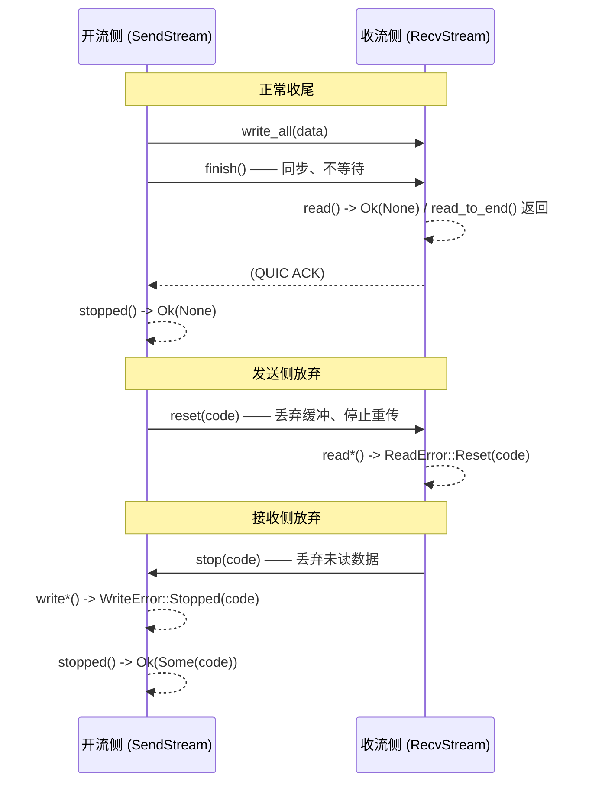

# 直接用 QUIC 原语（Using QUIC）

iroh 1.0.2 · 调研日期 2026-07-17 · 源码 `/Volumes/yexiyue/iroh-study/`
官方页：<https://docs.iroh.computer/protocols/using-quic.md>

> 这一页管的是**拿到 `Connection` 之后的事**——`connect()` / `accept()` 已经返回了，握手、打洞、relay 选路全都结束了，现在要决定「字节怎么在这条隧道里流动」。
>
> **建连之前的事** → [02-connecting.md](02-connecting.md)。**从零写一个协议的完整流程**（ALPN / Router /
> ProtocolHandler / framing / 上线 checklist）→ [03b-writing-a-protocol.md](03b-writing-a-protocol.md)。
> **noq 是什么** → [index-foundations.md](index-foundations.md)。

官方页开宗明义的定位（原文）：

> Think of iroh as giving you **reliable, secure tunnels between peers**.
> While iroh handles the hard parts of networking, **you still need to design how your application exchanges data once connected**.

**iroh 不替你做协议设计。** 没有 Codec，没有 request/response 抽象，没有自动的消息关联。你拿到的是 QUIC 流。

---

# ⚠️ 先看这个：官方页的代码抄下来编译不过

官方 `using-quic.md` 里的每一个 `accepting_endpoint` 片段，在 iroh 1.0.2 下**都编译不过**。逐条核对如下（左边是官方页原文，右边是本地 1.0.2 源码）：

| 官方页写法 | iroh 1.0.2 实际 | 后果 |
|---|---|---|
| `async fn accept_bi(&self) -> Result<Option<(SendStream, RecvStream)>, ConnectionError>` | `pub fn accept_bi(&self) -> AcceptBi<'_>`（`connection.rs:901`），`Output = Result<(SendStream, RecvStream), ConnectionError>`（`noq-1.0.1/src/connection.rs:1048-1049`）——**没有 `Option`** | 官方页的 `conn.accept_bi().await?.ok_or_else(\|\| anyhow!("connection closed"))?` 直接编译错误：`?` 之后是元组，元组上没有 `ok_or_else` |
| `async fn accept_uni(&self) -> Result<Option<RecvStream>, ConnectionError>` | `Output = Result<RecvStream, ConnectionError>`（`noq-1.0.1/src/connection.rs:1029-1030`）——**没有 `Option`** | 官方页的 `match conn.accept_uni().await? { Some(recv) => .., None => break }` 编译错误 |
| `async fn open_bi(&self) -> Result<(SendStream, RecvStream), ConnectionError>` | `pub fn open_bi(&self) -> OpenBi<'_>`（`connection.rs:885`）——**普通 fn 返回 Future 结构体**，不是 `async fn` | `.await` 行为一致，但你要照着这个签名写 trait / 存 Future 类型时对不上 |
| 「`RecvStream::stop` will resolve with `Ok(None)` if the stream was finished (or `Ok(Some(code))` if it was reset)」 | `pub fn stop(&mut self, error_code: VarInt) -> Result<(), ClosedStream>`（`noq-1.0.1/src/recv_stream.rs:275`）——**同步方法，不是 Future，也不返回 code** | 该描述实际上是 `SendStream::stopped()` 的语义（`send_stream.rs:251` + `:463-464` `Output = Result<Option<VarInt>, StoppedError>`）。官方页把两个 API 串了 |

**「连接关闭」在 1.0.2 里不是 `Ok(None)`，是 `Err(ConnectionError)`。** 这是仓内真实代码的写法（`iroh/iroh/examples/transfer.rs:660-665`）：

```rust
// Accept incoming streams in a loop until the connection is closed by the remote.
let close_reason = loop {
    let (send, recv) = match conn.accept_bi().await {
        Ok(streams) => streams,
        Err(err) => break err,          // ← 连接关闭走这里，不是 Ok(None)
    };
    tokio::spawn(/* ... */);
};
```

iroh-gossip 同款（`iroh-gossip/src/net/util.rs:123-130`）：

```rust
stream = self.conn.accept_uni(), if !conn_is_closed => {
    let stream = match stream {
        Ok(stream) => stream,
        Err(_) => { conn_is_closed = true; continue; }   // ← 同样是 Err
    };
    ...
}
```

> **判据**：官方 using-quic 页的**散文部分（模式分类、设计权衡、关闭时机）质量很高、值得逐字读**；**代码片段部分要当伪代码看**。本页下面所有代码都按 1.0.2 源码改写过。
>
> 差异成因未考证——不排除是文档基于某个未发布分支或历史版本写的。以本地 1.0.2 源码 + 仓内 examples 为准。

---

# 四个流原语

```rust
// iroh/iroh/src/endpoint/connection.rs:874-903，全部在 impl<T: ConnectionState> Connection<T> 里（:811）
#[inline] pub fn open_uni(&self)   -> OpenUni<'_>   { self.inner.open_uni() }
#[inline] pub fn open_bi(&self)    -> OpenBi<'_>    { self.inner.open_bi() }
#[inline] pub fn accept_uni(&self) -> AcceptUni<'_> { self.inner.accept_uni() }
#[inline] pub fn accept_bi(&self)  -> AcceptBi<'_>  { self.inner.accept_bi() }
```

Future 的 Output（`noq-1.0.1/src/connection.rs`）：

| Future | Output | 定义位置 |
|--------|--------|---------|
| `OpenUni` | `Result<SendStream, ConnectionError>` | `:963-970` |
| `OpenBi` | `Result<(SendStream, RecvStream), ConnectionError>` | `:981-992` |
| `AcceptUni` | `Result<RecvStream, ConnectionError>` | `:1029-1037` |
| `AcceptBi` | `Result<(SendStream, RecvStream), ConnectionError>` | `:1048-1059` |

四个方法都取 **`&self`**（不是 `&mut self`），`Connection` 又是 `Clone` —— 所以 **clone 进任意多个 task、各自开流** 是合法且推荐的用法，不需要锁、不需要流管理器。详见下一节。

`impl` 块是 `impl<T: ConnectionState> Connection<T>`（`connection.rs:811`），意味着这四个方法在 **0-RTT 状态**下同样可用。

## uni 还是 bi？

官方页的原话（很准确，直接引）：

> * With uni-directional streams, only the opening side sends bytes to the accepting side. The receiving side can already start consuming bytes before the opening/sending side finishes writing all data.
> * With bi-directional streams, both sides can send bytes to each other at the same time. The API supports full duplex streaming.
>
> One bi-directional stream is essentially the closest equivalent to a TCP stream. If your goal is to adapt a TCP protocol to the QUIC API, the easiest way is going to be opening a single bi-directional stream and then essentially using the send and receive stream pair as if it were a TCP stream.

**bi 流 vs 两条反向 uni 流的区别**（官方页，两条都是实打实的）：

1. bi 流一次 open→accept 就建好了流对；两条 uni 流要一边 open+发数据、另一边 accept 再反向 open，多一轮编排。
2. **两条 uni 流不能作为一个整体被 stop/reset**——一条被 reset 了另一条还开着。bi 流可以整体 stop/reset。

---

## Connection 是 Clone：clone + spawn + open_bi

```rust
// connection.rs:736-741
#[derive(Debug, Clone)]
pub struct Connection<State: ConnectionState = HandshakeCompleted> {
    inner: noq::Connection,
    data: State::Data,
}
```

因为 `open_*` 只要 `&self` 且 `Connection` 是 `Clone`（iroh 侧 `connection.rs:736` derive；noq 侧 `noq/src/connection.rs:310-311` 也是 Clone，doc：「May be cloned to obtain another handle to the same connection.」），可以把 Connection clone 进任意多个 task，每个 task 各自开流。

**调用方不必自己加锁、不需要流管理器、不需要中央 multiplexer。**

> ⚠️ 精确表述：「不必自己加锁」只在**应用层**成立。noq 内部每条连接有一把互斥锁——`poll_open` 第一行就是 `conn.lock_without_waking("poll_open")`（`noq-1.0.1/src/connection.rs:1000`），`ConnectionRef` 本身即 `Arc<Mutex<State>>` 语义。别说成「无锁」。

> **libp2p 对照**：libp2p 里要开流必须通过 Swarm 的事件循环（Swarm 不是 Clone、要独占 `&mut`），跨 task 开流得自己搭 channel + 命令模式转发。iroh 下 `Connection.clone()` 直接丢进 `tokio::spawn` 就行。

## 「流很便宜」是写进 rustdoc 的合同

不是社区口头说法。iroh 与 noq 两层文档共 **7 处**明确表述：

```
// connection.rs:820-824（open_uni 的 # QUIC streams 段）
/// QUIC can multiplex many streams onto a single connection. Streams can be short or
/// long lived and may be opened and closed without incurring any extra cost. ...
/// Thus streams do not suffer head-of-line blocking.

// connection.rs:828-831（# Opening streams 段）
/// Opening a new stream does not incur any extra overhead compared to sending data on an
/// existing stream. However only once some data has been transmitted on the stream, will
/// the peer become aware of the newly opened stream.

// lib.rs:147-148
//! Additionally to being extremely light-weight, streams can be interleaved and will not
//! block each other.  Allowing many streams to co-exist, regardless of how long they last.

// lib.rs:152（warning 块）
//! To keep streams cheap, they are lazily created on the network ...

// endpoint.rs:875
/// Note that due to the light-weight properties of streams a stream will only be accepted
/// once the initiating peer has sent some data on it.

// noq connection.rs:321 (open_uni) / :333 (open_bi)
/// Streams are cheap and instantaneous to open unless blocked by flow control.
```

**noq 那句一字点破成本模型：唯一的开销来源是流控，不是流本身。**

# 流的三种「通知」：finish / reset / stop

这是 QUIC API 最容易搞混的地方。除了收发字节，流上还有三种带外信号，**三种都不对称**（发送侧和接收侧看到的东西不一样）。

## 精确语义表（全部源码核实）

| 我调用 | 签名 | 对端看到什么 |
|---|---|---|
| `SendStream::finish()` | `pub fn finish(&mut self) -> Result<(), ClosedStream>`（`send_stream.rs:188`）**同步** | `RecvStream::read` → `Ok(None)`；`read_to_end` → 返回全部数据；`read_exact` → `Err`（`UnexpectedEof`） |
| `SendStream::reset(code)` | `pub fn reset(&mut self, error_code: VarInt) -> Result<(), ClosedStream>`（`send_stream.rs:212`）**同步** | 所有 read 系方法 → `ReadError::Reset(code)` |
| `RecvStream::stop(code)` | `pub fn stop(&mut self, error_code: VarInt) -> Result<(), ClosedStream>`（`recv_stream.rs:275`）**同步** | 对端 `SendStream::write*` → `WriteError::Stopped(code)`；对端 `stopped()` → `Ok(Some(code))` |

`finish` 的官方 rustdoc（`noq-1.0.1/src/send_stream.rs:177-187`）：

```
/// Notify the peer that no more data will ever be written to this stream
///
/// It is an error to write to a [`SendStream`] after `finish()`ing it. [`reset()`](Self::reset)
/// may still be called after `finish` to abandon transmission of any stream data that might
/// still be buffered.
///
/// To wait for the peer to receive all buffered stream data, see [`stopped()`](Self::stopped).
```

**`finish()` 只是「声明我不再写了」，不等待任何数据发出去。** 这一点是后面所有关闭 bug 的根源。

`reset` 的 rustdoc（`send_stream.rs:202-211`）：

```
/// Close the send stream immediately.
///
/// No new data can be written after calling this method. Locally buffered data is dropped, and
/// previously transmitted data will no longer be retransmitted if lost. If an attempt has
/// already been made to finish the stream, the peer may still receive all written data.
```

**`reset` 与 `finish` 的差别只有两条**（官方页表述）：立即生效并丢弃未发送的缓冲数据；带一个应用层 `VarInt` 错误码。

## `stopped()`：唯一能等到「对端确实收到了」的原语

```rust
// noq-1.0.1/src/send_stream.rs:241-250（文档）+ :251（签名）+ :463-464（Output）
/// Completes when the peer stops the stream or reads the stream to completion
///
/// Yields `Some` with the stop error code if the peer stops the stream. Yields `None` if the
/// local side [`finish()`](Self::finish)es the stream and then the peer acknowledges receipt
/// of all stream data (although not necessarily the processing of it), after which the peer
/// closing the stream is no longer meaningful.
///
/// For a variety of reasons, the peer may not send acknowledgements immediately upon receiving
/// data. As such, relying on `stopped` to know when the peer has read a stream to completion
/// may introduce more latency than using an application-level response of some sort.
pub fn stopped(&self) -> Stopped { ... }

impl Future for Stopped { type Output = Result<Option<VarInt>, StoppedError>; }
```

**注意最后那段官方告诫**：`stopped()` 等的是 QUIC ACK，不是「对端应用处理完了」，而且 ACK 可能延迟。**要确认「对端处理完了」，应该用应用层响应，不是 `stopped()`。**

iroh-gossip 是少数正当使用 `stopped()` 的地方——收尾时等对端把已发数据 ack 完（`iroh-gossip/src/net/util.rs:241-264`）：

```rust
// Close remaining streams.
for (topic_id, mut stream) in self.streams.drain() {
    stream.finish().ok();
    self.finishing.spawn(async move {
        stream.stopped().await.ok();       // ← 等对端 ack
        debug!(topic=%topic_id.fmt_short(), "stream closed");
    }.instrument(tracing::Span::current()));
}
if !self.finishing.is_empty() {
    // Wait for the remote to acknowledge all streams are finished.
    if let Err(_elapsed) = n0_future::time::timeout(Duration::from_secs(5), async move {
        while self.finishing.join_next().await.is_some() {}
    }).await {
        debug!("not all send streams finished within timeout, abort")
    }
}
```

**注意这里的 `timeout(5s)`**——`stopped()` 可能永远不 resolve（对端挂了/网络断了），生产代码必须加超时。

## 一张图理清



---

# 六种交互模式（按 1.0.2 改写）

官方页把交互模式分成 6 类。下面每一类都给出**能编译的 1.0.2 版本**，并标注官方原版哪里不对。

## 1. Request / Response —— 最常见

一次交互一条 bi 流，**连接侧最后读到数据 → 连接侧负责 close**。

```rust
// 连接侧
async fn connecting_endpoint(conn: &Connection, request: &[u8]) -> Result<Vec<u8>> {
    let (mut send, mut recv) = conn.open_bi().await?;
    send.write_all(request).await?;
    send.finish()?;                                  // 让对端 read_to_end 能返回

    let response = recv.read_to_end(MAX_RESPONSE_SIZE).await?;

    conn.close(0u32.into(), b"I have everything, thanks!");
    Ok(response)
}

// 接受侧
async fn accepting_endpoint(conn: Connection) -> Result<()> {
    // 官方页此处是 `.await?.ok_or_else(...)`，1.0.2 无 Option，直接解元组
    let (mut send, mut recv) = conn.accept_bi().await?;
    let request = recv.read_to_end(MAX_REQUEST_SIZE).await?;

    let response = compute_response(&request);
    send.write_all(&response).await?;
    send.finish()?;

    conn.closed().await;                             // ← 等对端先关，不是礼貌是必需
    Ok(())
}
```

仓内实现：`iroh/iroh/examples/echo.rs:83-112`（accept 侧）+ `:38-69`（connect 侧）、`iroh/iroh/examples/search.rs:124-162`。

**`read_to_end(N)` 的 `N` 是防 OOM 的硬性限长，必须自己给**，超了返回 `ReadToEndError::TooLong`（`noq-1.0.1/src/recv_stream.rs:566-573`）。rustdoc 明说（`:248-259`）：「`size_limit` should be set to limit worst-case memory use.」search.rs 给的是 64（`search.rs:139`）。

## 2. 全双工流式 —— O(1) 内存处理任意大请求

响应可以在请求还没收完时就开始发。

```rust
async fn accepting_endpoint(conn: Connection) -> Result<()> {
    let (mut send, mut recv) = conn.accept_bi().await?;      // 1.0.2：无 Option

    let mut buf = [0u8; size_of::<u64>()];
    // read_exact 在对端 finish 后返回 Err，以此结束循环
    while recv.read_exact(&mut buf).await.is_ok() {
        let number = u64::from_be_bytes(buf);
        let doubled = number.wrapping_mul(2).to_be_bytes();
        send.write_all(&doubled).await?;
    }
    send.finish()?;

    conn.closed().await;    // the other side will tell us when it's done reading our data
    Ok(())
}
```

## 3. 一条连接多次 Request/Response —— HTTP/3 模式

官方页对这一类的定位（原文）：

> This is one of the main use cases QUIC was designed for... In HTTP3, each HTTP request is run as its own bi-directional stream... this makes it possible for the user agent to cancel some HTTP requests without cancelling any others in the same HTTP3 connection.

```rust
// 连接侧：同一条 conn 上反复调
async fn request(conn: &Connection, request: &[u8]) -> Result<Vec<u8>> {
    let (mut send, mut recv) = conn.open_bi().await?;
    send.write_all(request).await?;
    send.finish()?;
    Ok(recv.read_to_end(MAX_RESPONSE_SIZE).await?)
}

// 接受侧：1.0.2 版（官方页的 match Some/None 编译不过）
async fn handle_requests(conn: Connection) -> Result<()> {
    loop {
        let (send, recv) = match conn.accept_bi().await {
            Ok(streams) => streams,
            Err(_err) => break,                 // ← 连接关闭
        };
        tokio::spawn(handle_request(send, recv));
    }
    Ok(())
}
```

**这就是 `transfer.rs:660-665` 的真实形状**，也是绝大多数应用协议该用的形状。官方页的补充很重要：

> the client doesn't immediately close the connection after a single request (duh!). Instead, it might want to optimistically keep the connection open for some idle time or until it knows the application won't need to make another request... All that said, it's still true that **the connecting side closes the connection**.

## 4. 多条有序通知 —— uni 流 + framing

**关键点：顺序性来自「单条流内字节有序」+「逐帧处理」。**

官方页用 `tokio-util` 的 `LengthDelimitedCodec`。这条路在类型上是通的——`RecvStream`/`SendStream` 实现了 tokio 的 `AsyncRead`/`AsyncWrite`（`noq-1.0.1/src/recv_stream.rs:588`、`send_stream.rs:329`，均无 feature gate）。

**但 n0 自己一个都没这么用**：仓内真实协议（iroh-gossip、transfer.rs）全是手写 `u32` 长度前缀 + postcard，用的是 `tokio::io::{AsyncReadExt, AsyncWriteExt}` 的 `read_u32` / `write_u32`（`iroh-gossip/src/net/util.rs:21-24, :359, :390`）。手写版见 [03b-writing-a-protocol.md](03b-writing-a-protocol.md) 的 framing 模板。

官方页对另一种做法的评价（值得读，因为它正是「一条消息一条流」的权衡）：

> There's another somewhat common way of doing this: The order that `accept_uni` come in will match the order that `open_uni` are called on the remote endpoint... This way you would receive one notification per stream and know the order of notifications from the stream ID/the order of accepted streams.
> The downside of doing it that way is you will occupy more than one stream. If you want to multiplex other things on the same connection, you'll need to add some signaling.

## 5. 一次请求 → 多个有序响应

跟模式 4 同构，只是角色反过来：请求走一次 write，响应侧用 framing 分段。

## 6. 一次请求 → 多个**无序**响应 —— 每个响应一条 uni 流

```rust
async fn connecting_side(conn: Connection, request: &[u8]) -> Result<()> {
    let mut send = conn.open_uni().await?;
    send.write_all(request).await?;
    send.finish()?;

    let recv_tasks = TaskTracker::new();
    loop {
        match conn.accept_uni().await {
            Ok(recv) => { recv_tasks.spawn(handle_response(recv)); }
            Err(_) => break,                    // ← 1.0.2：Err 不是 Ok(None)
        }
    }
    recv_tasks.wait().await;
    conn.close(0u32.into(), b"Thank you!");
    Ok(())
}
```

官方页在这里给了两个**很实用的设计提示**（原文摘要）：

- 拆成多条 uni 流会**破坏请求↔响应的关联**。修法：请求/响应各带一个 per-request 的唯一 ID 前缀。
- 怎么知道「无序响应发完了」？**优雅解法：把请求流开成 bi 而不是 uni，反向那半条只用来传「最后一条响应流的 stream ID」，当作 control stream。**

---

# 背压：它在哪里发生

**这是 iroh 相对 libp2p 心智差异最大的一处：QUIC 下几乎所有「超限」都是背压（挂起排队），不是错误。**

## 三个背压点

| 位置 | 触发条件 | 行为 |
|---|---|---|
| `open_bi()` / `open_uni()` 的 `.await` | 并发流数达到对端的 `max_concurrent_*_streams`（默认 100） | `Poll::Pending` 排队，**不报错**（`noq-1.0.1/src/connection.rs` 的 `poll_open`） |
| `write_all()` / `write_chunk()` 的 `.await` | 流控窗口耗尽（`stream_receive_window` / `receive_window` / `send_window`） | 挂起等待对端读走数据 |
| `send_datagram_wait()` 的 `.await` | 出站 datagram 缓冲满 | 挂起（对比 `send_datagram()` 直接丢老数据） |

`poll_open` 只在**连接已经出错**时返回 `Err`；额度耗尽时返回 `Poll::Pending` 挂起等 `stream_budget_available` 通知。完整源码与 yamux `TooManyStreams` 的对照见下一节。

> **一句话结论**：iroh 下「无脑多开流」最坏是变慢，不是失败。libp2p/yamux 下同样操作会 `TooManyStreams` **打死整条连接**。从 libp2p 迁过来时，原先的限流器/流池是可以直接删掉的净负债。

### 超限是背压不是错误（区别于 libp2p 的技术核心）

```rust
// noq-1.0.1/src/connection.rs 的 poll_open
fn poll_open<'a>(ctx, conn, mut notify, dir) -> Poll<Result<(ConnectionRef, StreamId, bool), ConnectionError>> {
    let mut state = conn.lock_without_waking("poll_open");
    if let Some(ref e) = state.error {
        return Poll::Ready(Err(e.clone()));          // ← 只有连接已出错才 Err
    } else if let Some(id) = state.inner.streams().open(dir) {
        ...
        return Poll::Ready(Ok((conn.clone(), id, is_0rtt)));
    }
    loop {
        match notify.as_mut().poll(ctx) {
            Poll::Pending => return Poll::Pending,   // ← 额度耗尽：挂起等待，不报错
            Poll::Ready(()) => notify.set(conn.shared.stream_budget_available[dir as usize].notified()),
        }
    }
}
```

**「无脑多开」在 iroh 下最坏结果是变慢（排队），不是失败。这就是为什么可以不做流管理。**

#### 对照实锤：yamux 超限是致命错误

```rust
// yamux-0.13.10/src/connection.rs:489-491 —— 出站超限
fn poll_new_outbound(&mut self, cx: &mut Context<'_>) -> Poll<Result<Stream>> {
    if self.streams.len() >= self.config.max_num_streams {
        log::error!("{}: maximum number of streams reached", self.id);
        return Poll::Ready(Err(ConnectionError::TooManyStreams));   // ← 硬错误，非背压
    }
```

而且**入站超限更狠**：`connection.rs:622-624` 与 `:725-727` 直接 `Action::Terminate(Frame::internal_error() / protocol_error())`，**当场终止整条连接**。

注意 `TooManyStreams` 属于 `ConnectionError`（`yamux-0.13.10/src/error.rs:16-30`，含 `Io` / `Decode` / `NoMoreStreamIds` / `Closed` / `TooManyStreams` / `InvalidWindowUpdate`）——是**连接级**错误，整条连接不可用。默认上限 `max_num_streams: 512`（`yamux-0.13.10/src/lib.rs:90`）。

> **这就是问题的答案**：libp2p 下「流是稀缺资源、要多路复用管理」是**被迫的**——不管理就 `TooManyStreams` 打死连接。iroh/QUIC 下同样情形只是 `Poll::Pending` 排队。**从 libp2p 迁 iroh 时，原先的限流/流池逻辑属于可以直接移除的净负债。**
>
> 反直觉：yamux 默认 512 比 QUIC 默认 100 更宽——但 yamux 超限是致命的，QUIC 超限只是排队。**「数字更大」反而更危险。**

```rust
// noq-proto-1.0.1/src/config/transport.rs:552-560
max_concurrent_bidi_streams: 100u32.into(),
max_concurrent_uni_streams: 100u32.into(),
max_idle_timeout: Some(VarInt(30_000)),
stream_receive_window: STREAM_RWND.into(),   // = 12500*1000/1000*100 = 1_250_000 bytes
receive_window: VarInt::MAX,
send_window: (8 * STREAM_RWND).into(),
send_fairness: true,
```

iroh 的 builder（`iroh/iroh/src/endpoint/quic.rs:151-162`）只覆盖 keepalive、multipath、NAT 相关项，**未触碰 `max_concurrent_*_streams`**：

```rust
fn new() -> Self {
    let mut cfg = noq::TransportConfig::default();
    cfg.keep_alive_interval(Some(HEARTBEAT_INTERVAL));
    cfg.default_path_keep_alive_interval(Some(HEARTBEAT_INTERVAL));
    cfg.default_path_max_idle_timeout(Some(PATH_MAX_IDLE_TIMEOUT));
    cfg.max_concurrent_multipath_paths(MAX_MULTIPATH_PATHS);
    cfg.max_remote_nat_traversal_addresses(MAX_QNT_ADDRESSES);   // quic.rs:537
    cfg.server_handshake_migration(true);
    Self(cfg)
}
```

调用链：`endpoint.rs:202` `transport_config: QuicTransportConfig::default()` → `quic.rs:140-142` → `QuicTransportConfigBuilder::new()`（153-163）→ noq-proto 默认 100/100。

> 唯一的例外不在应用面：`iroh-relay/src/quic.rs:108-109` 把 `max_concurrent_uni_streams(0)` / `max_concurrent_bidi_streams(0)` 显式设为 0——那是 relay 的 QUIC 地址发现服务端（ALPN_QUIC_ADDR_DISC），刻意禁止对端开任何流，与应用数据面无关。所以准确说法是「**应用面 Endpoint 没改过**」。

#### 100 是并发数，2^62 是生命周期总量——别读串

```
// connection.rs:863-865
/// The protocol limits the total number of streams during the lifetime of a connection
/// to 2**62, this limit applies to the sum of uni- and bi-directional streams. For most
/// practical purposes this is essentially unlimited.
```

文档里那句 `2^62 "essentially unlimited"` 说的是**生命周期累计总数**，不是并发数。**要开 >100 并发流必须显式调 `max_concurrent_bidi_streams()`，否则第 101 条静默排队。**

#### 反直觉：你设的限制是「对端能向你开多少」

```rust
// quic.rs:169-176 —— 注意 "incoming" 和 "for the peer to open"
/// Maximum number of incoming bidirectional streams that may be open concurrently.
///
/// Must be nonzero for the peer to open any bidirectional streams.
///
/// Worst-case memory use is directly proportional to `max_concurrent_bidi_streams *
/// stream_receive_window`, with an upper bound proportional to `receive_window`.
pub fn max_concurrent_bidi_streams(mut self, value: VarInt) -> Self { ... }

// 运行期版本（connection.rs:1084-1108），&self 且可随时调，不用重建连接
pub fn set_max_concurrent_uni_streams(&self, count: VarInt)
pub fn set_receive_window(&self, receive_window: VarInt)
pub fn set_max_concurrent_bi_streams(&self, count: VarInt)
```

**想让自己能开 500 条并发流，改自己的 config 没用——必须让对端把它的 `max_concurrent_bidi_streams` 调到 500。** 双方都是 iroh 默认时，双向各 100。

> **libp2p 对照**：yamux 的 `set_max_num_streams` 是**本地对称限制**（`self.streams.len() >= self.config.max_num_streams` 直接卡自己出站），语义**正好相反**——libp2p 卡自己，QUIC 卡对端。迁移时这个方向搞反会导致限制完全不生效。

## 背压的代价是内存，不是错误

默认值（`noq-proto-1.0.1/src/config/transport.rs:544-560`）：

```
max_concurrent_bidi_streams: 100
max_concurrent_uni_streams:  100
stream_receive_window:       1_250_000 bytes   (STREAM_RWND)
receive_window:              VarInt::MAX       ← 无限，默认不构成任何保护
```

**worst-case ≈ 100 × 1.25MB = 125MB / 连接。** 对「同时开多条大流、且可能来不及读」的应用（文件传输）这是真实的内存风险。详细推导见下一节。

**反直觉提醒**：`max_concurrent_bidi_streams` 设的是「**对端**能向**你**开多少条」。想让自己能开 500 条并发流，改自己的 config 没用——得让对端改。

### N 条流的真实代价是内存

```
// connection.rs:857-861（# Stream limits 段）
/// Each stream has a *receive window* of a maximum number of bytes that may be
/// in-flight before the sender is blocked from transmitting more. ... There is also a
/// [`QuicTransportConfigBuilder::receive_window`] which applies to all streams combined
/// and can be changed during a connection using [`Self::set_receive_window`].
```

默认推导（`noq-proto/src/config/transport.rs:544-558`）：

```
EXPECTED_RTT        = 100 ms
MAX_STREAM_BANDWIDTH = 12500 * 1000 bytes/s
STREAM_RWND         = MAX_STREAM_BANDWIDTH / 1000 * EXPECTED_RTT = 1_250_000
stream_receive_window: STREAM_RWND
receive_window: VarInt::MAX      // = (1 << 62) - 1，见 noq-proto/src/varint.rs:18
```

**worst-case ≈ 100 × 1.25MB = 125MB/连接。** 而 `receive_window` 默认是 `VarInt::MAX`（无限），所以文档那句「upper bound proportional to `receive_window`」在**默认配置下不构成任何保护**——真正的天花板就是 125MB/连接。

**对文件传输类应用（同时开多条大流、且可能来不及读）这是个真实的内存风险**：要么调小 `stream_receive_window`，要么显式设 `receive_window` 做聚合兜底。

`quic.rs:216-222` 的官方告诫：

> Setting this smaller than `receive_window` helps ensure that a single stream doesn't monopolize receive buffers, which may otherwise occur if the application chooses not to read from a large stream for a time while still requiring data on other streams.

> **libp2p 对照**：yamux **强制**你先算内存——`max_connection_receive_window` 必须 ≥ 256KiB × `max_num_streams`，否则 assert 直接 panic（`yamux-0.13.10/src/lib.rs:129-134`）。QUIC 不强制，默认给你无限聚合窗口——更自由，也更容易踩内存。

## 怎么正确地压满带宽：`transfer.rs` 的读写模板

**读侧**——32 个 `Bytes` 缓冲一次读约 32KB，零拷贝（`iroh/iroh/examples/transfer.rs:838-850`）：

```rust
// These are 32 buffers, for reading approximately 32kB at once
let mut bufs: [Bytes; 32] = std::array::from_fn(|_| Bytes::new());

while let Some(n) = recv.read_many_chunks(&mut bufs[..]).await.anyerr()? {
    read += bufs.iter().take(n).map(Bytes::len).sum::<usize>();
    num_chunks += 1;
}

send.finish().anyerr()?;
```

`read_many_chunks` 的签名是 `Result<Option<usize>, ReadError>`（`noq-1.0.1/src/recv_stream.rs:212-215`）——**这里的 `Option` 是真的**（`None` = 流结束），别跟 `accept_bi` 那个不存在的 `Option` 搞混。

**写侧**——带超时的 vectored 写（`transfer.rs:906-930`）：

```rust
/// Writes as much of [`Bytes`] to a [`SendStream`] as possible within `timeout`.
async fn write_chunk_timeout(send: &mut SendStream, chunk: Bytes, timeout: Duration)
    -> Result<usize, WriteError>
{
    // This follows the pattern of [`SendStream::write_all_chunks`] but with a timeout applied.
    let timeout = tokio::time::sleep(timeout);
    tokio::pin!(timeout);
    let mut bufs = &mut [chunk][..];
    let mut total = 0;
    while !bufs.is_empty() {
        tokio::select! {
            _ = &mut timeout => break,
            written = send.write_many_chunks(&mut bufs) => { total += written?; }
        }
    }
    Ok(total)
}
```

**这段之所以存在，是因为 `write_all_chunks` 没法加超时**——背压挂起时你没有逃生口。要给传输加时限就得降级到 `write_many_chunks` 自己循环。

## 读写 API 全表（`noq-1.0.1`）

| 方法 | 签名 | 位置 |
|---|---|---|
| `RecvStream::read` | `async fn read(&mut self, buf: &mut [u8]) -> Result<Option<usize>, ReadError>` | `recv_stream.rs:76` |
| `RecvStream::read_exact` | `async fn read_exact(&mut self, buf: &mut [u8]) -> Result<(), ReadExactError>` | `:89` |
| `RecvStream::read_chunk` | `async fn read_chunk(&mut self, max_length: usize) -> Result<Option<Bytes>, ReadError>` | `:172` |
| `RecvStream::read_many_chunks` | `async fn read_many_chunks(...) -> Result<Option<usize>, ReadError>` | `:212-215` |
| `RecvStream::read_to_end` | `async fn read_to_end(&mut self, size_limit: usize) -> Result<Vec<u8>, ReadToEndError>` | `:260` |
| `SendStream::write` | `async fn write(&mut self, buf: &[u8]) -> Result<usize, WriteError>` | `send_stream.rs:61` |
| `SendStream::write_all` | `async fn write_all(&mut self, buf: &[u8]) -> Result<(), WriteError>` | `:74` |
| `SendStream::write_many_chunks` | `async fn write_many_chunks(...) -> Result<usize, WriteError>` | `:99-102` |
| `SendStream::write_chunk` | `async fn write_chunk(&mut self, buf: Bytes) -> Result<(), WriteError>` | `:116` |
| `SendStream::write_all_chunks` | `async fn write_all_chunks(&mut self, bufs: &mut [Bytes]) -> Result<(), WriteError>` | `:130` |

另有 `tokio::io::AsyncRead for RecvStream`（`recv_stream.rs:588`）/ `tokio::io::AsyncWrite for SendStream`（`send_stream.rs:329`），**无 feature gate**——所以 `tokio::io::copy(&mut recv, &mut send)` 直接可用（`echo.rs:99`），`AsyncReadExt::read_u32` 之类也直接可用。`futures_io` 的对应 impl 在 `#[cfg(feature = "futures-io")]` 后面（`recv_stream.rs:575-576`、`send_stream.rs:311`）。

⚠️ `read_to_end` 的 rustdoc 有一条容易漏的告诫（`recv_stream.rs:248-259`）：

```
/// Uses unordered reads to be more efficient than using `AsyncRead` would allow.
/// If unordered reads have already been made, the resulting buffer may have gaps containing
/// arbitrary data.
///
/// This operation is *not* cancel-safe.
```

**`read_to_end` 不是 cancel-safe**，别往 `tokio::select!` 里塞。`read_many_chunks` 与 gossip 的 `RecvStreamState::next`（`iroh-gossip/src/net/util.rs:185-187` 也明确标注 "not cancellation-safe"）同理。

---

# 流优先级

```rust
// noq-1.0.1/src/send_stream.rs:222-228（文档）+ :229/:236（签名）
/// Set the priority of the send stream
///
/// Every send stream has an initial priority of 0. Locally buffered data from streams with
/// higher priority will be transmitted before data from streams with lower priority. Changing
/// the priority of a stream with pending data may only take effect after that data has been
/// transmitted. Using many different priority levels per connection may have a negative
/// impact on performance.
pub fn set_priority(&self, priority: i32) -> Result<(), ClosedStream>
pub fn priority(&self) -> Result<i32, ClosedStream>
```

**四条硬事实：**

1. 初始优先级 **0**，`i32`，**大的先发**。
2. `set_priority` 取 **`&self`**，可以随时改。
3. **改优先级对「已经缓冲的数据」可能不生效**——要等那批数据发完。所以优先级要在写数据**之前**设。
4. **优先级层级不要用太多**：官方明说 "Using many different priority levels per connection may have a negative impact on performance"。**用 2～3 档（如 高/普通/低），别拿它当排序键。**

配套旋钮 **`send_fairness`**（默认 `true`，`noq-proto-1.0.1/src/config/transport.rs:560`）：同优先级流之间
round-robin 公平调度。文档（`transport.rs:156-165`）中立地指出「Disabling fairness can reduce fragmentation
and protocol overhead for workloads that use **many small streams**」——即**多小流场景反而应该关掉 fairness**
（可减少分片与协议开销），与直觉相反。**默认 `true` 是为公平性优化，不是为吞吐。**

---

# Datagram：官方明说「大多数情况下你不该用」

## 官方页的原话（这段很重要，逐字引）

> We often see users reaching for the QUIC datagram extension when implementing real-time protocols. **Doing this is in most cases misguided.**
> QUIC datagram sending still interacts with QUIC's congestion controller and thus are also acknowledged.
> Implementing traditional protocols on top of QUIC datagrams might thus not perform the way they were designed to.
> **Instead, it's often better to use lots of streams that are then stopped, reset or prioritized.**
>
> A real-world example is the media over QUIC protocol (MoQ in short): MoQ is used to transfer live video frames. It uses one QUIC stream for each frame (QUIC streams are cheap to create)!

**「datagram 仍受拥塞控制约束」这一点有源码旁证**：`send_datagram_wait` 的 rustdoc（`iroh/iroh/src/endpoint/connection.rs:973-980`）——

```
/// Unlike [`send_datagram()`], this method will wait for buffer space during congestion
/// conditions, which effectively prioritizes old datagrams over new datagrams.
```

「datagram 也被 ack」这一条我在 noq-proto 里**未找到直接对应的源码证据**（grep `datagram` + `ack/congestion` 的命中都在 UDP datagram 的 packet coalescing 逻辑上，不是 QUIC DATAGRAM 帧）。此处按官方文档陈述记录，未独立核实。

## API 全表（`iroh/iroh/src/endpoint/connection.rs`）

| 方法 | 签名 | 位置 |
|---|---|---|
| `send_datagram` | `pub fn send_datagram(&self, data: Bytes) -> Result<(), SendDatagramError>` **同步** | `:969` |
| `send_datagram_wait` | `pub fn send_datagram_wait(&self, data: Bytes) -> SendDatagram<'_>` | `:982` |
| `read_datagram` | `pub fn read_datagram(&self) -> ReadDatagram<'_>` | `:907` |
| `max_datagram_size` | `pub fn max_datagram_size(&self) -> Option<usize>` | `:998` |
| `datagram_send_buffer_space` | `pub fn datagram_send_buffer_space(&self) -> usize` | `:1010` |

`send_datagram` 的 rustdoc（`:963-967`）：

```
/// Transmits `data` as an unreliable, unordered application datagram.
///
/// Application datagrams are a low-level primitive. They may be lost or delivered out
/// of order, and `data` must both fit inside a single QUIC packet and be smaller than
/// the maximum dictated by the peer.
```

`max_datagram_size` 的 rustdoc（`:986-996`）：

```
/// Returns `None` if datagrams are unsupported by the peer or disabled locally.
///
/// This may change over the lifetime of a connection according to variation in the path
/// MTU estimate. The peer can also enforce an arbitrarily small fixed limit, but if the
/// peer's limit is large this is guaranteed to be a little over a kilobyte at minimum.
```

**`max_datagram_size()` 会随连接生命周期变化（MTU 探测），每次发之前查，别缓存。**

`SendDatagramError`（`noq-1.0.1/src/connection.rs:1882-1898`）：

```rust
pub enum SendDatagramError {
    UnsupportedByPeer,              // 对端不支持
    Disabled,                       // 本地禁用
    TooLarge,                       // 超过 MTU - overhead 或对端限额
    ConnectionLost(ConnectionError),
}
```

## iroh 默认是开着的

```rust
// noq-proto-1.0.1/src/config/transport.rs:576-577
datagram_receive_buffer_size: Some(STREAM_RWND as usize),   // = Some(1_250_000)，None 才是禁用
datagram_send_buffer_size:    1024 * 1024,                  // 1 MiB
```

`datagram_receive_buffer_size` 的语义（`:302-307`）：

```
/// Maximum number of incoming application datagram bytes to buffer, or None to disable
/// incoming datagrams
///
/// The peer is forbidden to send single datagrams larger than this size. If the aggregate size
/// of all datagrams that have been received from the peer but not consumed by the application
/// exceeds this value, old datagrams are dropped until it is no longer exceeded.
```

**注意「old datagrams are dropped」**——收发两侧缓冲满时都是**丢弃旧数据**，不是背压。`send_datagram_wait` 是唯一会背压的那个。

## 判据

| 场景 | 用什么 |
|---|---|
| 实时音视频帧 | **多条短流 + `reset`/`stop`/`set_priority`**（MoQ 做法） |
| 高频小状态同步（位置/心跳）、可整包丢 | datagram 勉强合理 |
| 「我要低延迟所以用 datagram」 | **停**——先读官方那句 "in most cases misguided" |

---

# 关闭连接：最容易写错的部分

官方页对症状的描述非常准（原文）：

> If you don't close connections gracefully, you'll see the connecting timing out on one endpoint, usually after 30s, even though another endpoint finishes promptly without errors.

（30s 对得上 `noq-proto-1.0.1/src/config/transport.rs:554` 的 `max_idle_timeout: Some(VarInt(30_000))`。）

## API

```rust
// iroh/iroh/src/endpoint/connection.rs
pub async fn closed(&self) -> ConnectionError            // :917  等对端/本端关闭
pub fn close_reason(&self) -> Option<ConnectionError>    // :925  None = 还开着
pub fn close(&self, error_code: VarInt, reason: &[u8])   // :959  同步！只入队
```

**`close()` 不是 async——它只把 CONNECTION_CLOSE 排进发送队列。** echo.rs 的注释把这条讲透了（`iroh/iroh/examples/echo.rs:58-67`）：

```rust
// Explicitly close the whole connection.
conn.close(0u32.into(), b"bye!");

// The above call only queues a close message to be sent (see how it's not async!).
// We need to actually call this to make sure this message is sent out.
endpoint.close().await;
// If we don't call this, but continue using the endpoint, we then the queued
// close call will eventually be picked up and sent.
// But always try to wait for endpoint.close().await to go through before dropping
// the endpoint to ensure any queued messages are sent through and connections are
// closed gracefully.
```

## 三条规则

**规则 1：最后**读到**应用数据的那一侧负责 `close()`；另一侧 `closed().await` 等它。**

官方页原文：

> the endpoint that received application data last will be the endpoint that calls `Connection::close` at that point in time. Conversely, the other endpoint should wait for `Connection::closed` to resolve before ending its operations.

echo.rs 的两侧正好是这个形状：connect 侧读完 echo → `conn.close()`（`:58`）；accept 侧发完 → `connection.closed().await`（`:108`）。

**规则 2：`close()` 之后一定要 `endpoint.close().await`。**

生产写法带超时（`transfer.rs:787-794`）：

```rust
async fn close_endpoint_with_timeout(endpoint: &Endpoint, output: Output) {
    let shutdown_start = Instant::now();
    let timed_out = timeout(SHUTDOWN_TIME, endpoint.close()).await.is_err();
    output.emit(EndpointClosed { duration: shutdown_start.elapsed(), timed_out });
}
```

**规则 3：别让 `Connection` 意外 drop。**

官方页：

> We might accidentally close connections too early, because we accidentally drop the `Connection` (which implicitly calls close). Instead, we should always keep around the connection and either wait for `Connection::closed` to resolve or call `Connection::close` ourselves at the right moment.

> ⚠️ **仓内有一处「反例」，别照抄**：`search.rs:199` 的注释是 `// Dropping the connection here will close it.`，连接侧压根不调 `close()`，靠 drop 隐式关。这跟规则 3 的告诫直接冲突。它能跑是因为 accept 侧 `connection.closed().await`（`:158`）会被 drop 触发的 close 唤醒，而且 `main` 最后有 `router.shutdown()`。**范例图省事，生产按规则 3 走。**

## 长连接：并发监视 `closed()`

协议流程本身不决定谁先关时（P2P 长连接），官方页给的模式：

```rust
async fn handle_connection(conn: Connection) -> Result<()> {
    futures_lite::future::race(
        run_protocol(conn.clone()),
        async move { conn.closed().await; anyhow::Ok(()) },
    ).await?;
    Ok(())
}
```

iroh-gossip 是这个模式的真实版——`SendLoop::run` / `RecvLoop::run` 都把 `conn.closed()` pin 住塞进 `select!`（`iroh-gossip/src/net/util.rs:227-238` 与 `:116-123`）：

```rust
let conn_clone = self.conn.clone();
let closed = conn_clone.closed();
tokio::pin!(closed);
loop {
    tokio::select! {
        biased;
        _ = &mut closed => break,
        Some(msg) = self.send_rx.recv() => self.write_message(&msg).await?,
        _ = self.finishing.join_next(), if !self.finishing.is_empty() => {}
        else => break,
    }
}
```

## 用错误码区分「正常结束」与「真的挂了」

`transfer.rs` 的做法值得抄（`:76` + `:676-679`）：

```rust
/// Connection error code for a gracefully closed connection.
const GRACEFUL_CLOSE: VarInt = VarInt::from_u32(1);

// ... 连接侧完成后：
conn.close(GRACEFUL_CLOSE, b"done");                        // :758

// ... 接受侧判断：
let is_graceful = matches!(
    &close_reason,
    ConnectionError::ApplicationClosed(f) if f.error_code == GRACEFUL_CLOSE
);
let error = (!is_graceful).then(|| format!("{close_reason:#}"));
```

**没有这个约定，你的日志里每条正常结束的连接都会是一条 error。**

幂等收尾（`transfer.rs:769-770`，gossip 同款 `iroh-gossip/src/net.rs:570-573`）：

```rust
// If the connection hasn't been closed above, close it now.
if conn.close_reason().is_none() {
    conn.close(0u32.into(), b"shutdown");
}
```

## 「对端确实收完了」的确认技巧

`transfer.rs` 用**反向流的 `finish()`** 当 ACK，比 `stopped()` 更可靠（这正是 `stopped()` rustdoc 推荐的「application-level response」）。

上传侧（`:862-866` 文档 + `:893-896`）：

```rust
/// Send data on `send` for `length`, afterwards wait for `recv` to be closed.
///
/// When done sending, we wait for [`RecvStream`] to be closed. The remote will finish its
/// corresponding send stream once it has read all our data. This ensures that we don't close
/// the connection before the remote has fully read our data.
send.finish().std_context("failed to finish stream")?;
debug!("sending finished, wait for confirmation");
recv.read_to_end(0).await.anyerr()?;          // ← 限长 0！
```

**`read_to_end(0)` 是个精妙的确认原语**：对端只 `finish()` 不发任何字节，所以 0 字节限长足够；一旦对端多发一个字节就是 `ReadToEndError::TooLong`（协议违规，正好该报错）。

对应的下载侧（`:822-825` 文档 + `:850`）：

```rust
/// Drain `recv`, and once done finish `send`.
///
/// We use [`SendStream::finish`] as a confirmation once we fully read [`RecvStream`]. The remote
/// will wait for this event and not close the connection earlire.   [原文拼写如此]
send.finish().anyerr()?;
```

---

# 中止流（Aborting Streams）

官方页的动机（MoQ 场景，原文）：

> * Each video frame is sent on its own uni-directional stream
> * Frames arrive out of order due to network conditions
> * By the time an old frame finishes transmitting, newer frames have already been received
> * Continuing to receive the old frame wastes bandwidth and processing time

四条要点（官方页 "Key insights"，原文）：

> 1. **Stream IDs indicate order**: QUIC stream IDs are monotonically increasing. You can compare stream IDs to determine which streams are newer without relying on application-level sequencing.
> 2. **Both sides can abort**: Either the sender (via `reset`) or receiver (via `stop`) can abort a stream.
> 3. **QUIC stops retransmissions**: When a stream is reset or stopped, QUIC immediately stops trying to recover lost packets for that stream.
> 4. **Streams are cheap**: Opening a new stream is very fast (no round-trips required), so it's perfectly fine to open one stream per video frame, message, or other small unit of data.

**第 1 条落到 API 上**：`SendStream::id()`（`noq-1.0.1/src/send_stream.rs:271`）、`RecvStream::id()`（`recv_stream.rs:298`），都返回 `StreamId`。`transfer.rs:690` 就拿它当 tracing 字段：`#[instrument("handle", skip_all, fields(id=send.id().index()))]`。

> ⚠️ **第 4 条有个默认配置的坑**：「一帧一流」在默认 `max_concurrent_uni_streams: 100` 下之所以安全，是因为帧流生命周期极短、开完就关，并发数压不满 100。**如果你的「一消息一流」是长生命周期的，第 101 条会静默 `Poll::Pending` 排队**——症状是「莫名其妙卡住」，没有任何错误。要么控制并发，要么让对端调大限额。

---

# 懒创建：`open_bi()` 后不写数据 = 死锁

**这是「便宜」的另一面，也是从 libp2p 迁过来最容易踩的一条。**
跨越 iroh 与 noq 两层文档三处警告：

```
// iroh connection.rs:839-841
/// Note that opening a stream is not sufficient for the accept call to yield a new
/// stream. Data must be sent on a stream before the respective accept call at the peer
/// will yield a [`RecvStream`].

// iroh lib.rs:151-156
//! To keep streams cheap, they are lazily created on the network: only once a sender starts
//! sending data on the stream will the receiver become aware of a stream. ... The sender
//! **must** send data on the stream before the receiver's [`Connection::accept_bi`] call
//! will return.

// noq-1.0.1/src/connection.rs:357-362
/// **Important Note**: The `Connection` that calls [`open_bi()`] must write to its [`SendStream`]
/// before the other `Connection` is able to `accept_bi()`. Calling [`open_bi()`] then
/// waiting on the [`RecvStream`] without writing anything to [`SendStream`] will never succeed.
```

**「便宜」和「懒创建」是同一枚硬币的两面**：正因为 `open_bi()` 不发任何网络包（纯本地记账），对端才完全不知道流存在。

**经典死锁**：A `open_bi()` 后等 B 先说话，B 卡在 `accept_bi()` 上永远等不到。**协议设计上必须保证「开流方先写」。** dumbpipe 就是靠发一个 5 字节 HANDSHAKE 常量来破这个局。

> **libp2p 对照**：libp2p 开流会立刻走 multistream-select 协商往返，对端马上收到 inbound stream 事件。**从 libp2p 迁过来最容易踩的就是这条**——原本「开流即通知」的假设在 iroh 下不成立。

## dumbpipe：cheap streams 的样板（注意有两种写法，别抄错）

**正确样板**——一条 Connection clone 进每个 task，每个本地 socket 开一条新流，无流池/限流器（`dumbpipe/src/main.rs:834-856` accept 循环 + `:797-831` handler）：

```rust
loop {
    let next = tokio::select! { stream = unix_listener.accept() => stream, _ = ctrl_c() => break };
    let connection = connection.clone();          // :844 复用同一条 iroh Connection
    tokio::spawn(async move {                     // :846 每个本地连接一个 task
        handle_unix_accept(next, connection, handshake).await
    });
}

// handle_unix_accept @ :797-831
let (mut endpoint_send, endpoint_recv) = connection.open_bi().await?;   // :808-811
```

**反面写法**——`handle_tcp_accept`（`main.rs:483-514`）每个 TCP 连接都重新 `endpoint.connect(addr, alpn)`（:494-497）建**新连接**再 `open_bi()`（:498-501）。那是打洞成本很高的写法。同一个仓里两种写法并存。

> 版本提醒：`dumbpipe/Cargo.toml:19` 声明 `iroh = "1.0.0"`，Cargo.lock 解析到 **1.0.0**（crates.io 版，不是本地 iroh-study 那份 1.0.2）。用到的 API（`Connection: Clone` + `&self open_bi`）两版一致，架构论点不受影响。已核实 dumbpipe src/ 下确无 semaphore / limiter / pool（grep 零命中）。

## dumbpipe 的四步骨架（可直接复制）
```rust
// 监听端（main.rs:308-317 create_endpoint + :380-400）
let endpoint = Endpoint::builder(presets::N0).secret_key(sk).alpns(alpns).bind().await?;
timeout(ONLINE_TIMEOUT, endpoint.online()).await;   // 等 home relay，5s
let ticket = EndpointTicket::new(endpoint.addr());
loop {
    let connecting = endpoint.accept().await.unwrap();
    let connection = connecting.await?;
    let (s, mut r) = connection.accept_bi().await?;   // 拿到一对 QUIC 流
}

// 连接端（main.rs:308-317 + :430-436）—— 注意空 alpns
let endpoint = Endpoint::builder(presets::N0).secret_key(sk).alpns(vec![]).bind().await?;
let connection = endpoint.connect(args.ticket.endpoint_addr(), ALPN).await?;
let (mut s, r) = connection.open_bi().await?;
if !args.common.is_custom_alpn() {
    s.write_all(&dumbpipe::HANDSHAKE).await?;         // ← 破懒创建死锁
}
```

**`.alpns()` 是「我接受哪些入站协议」，只连出去就传 `vec![]`；出站协议在 `connect(addr, alpn)` 时逐次指定。**

**dumbpipe 没用 Router**——单协议场景直接裸 accept 循环即可，Router 是多 ALPN 分派才需要的。

## 一个可直接复用的适配器：一对流 → 一个双向 IO
```rust
// iroh-examples/dumbpipe-web/src/quinn_endpoint.rs
//! QuinnEndpoint is a wrapper around a quinn::SendStream and quinn::RecvStream
//! It implements AsyncRead and AsyncWrite so it can be used with tokio::io::copy
use iroh::endpoint::{RecvStream, SendStream};

pub struct QuinnEndpoint { pub send: SendStream, pub recv: RecvStream }

impl AsyncRead for QuinnEndpoint {
    fn poll_read(self: Pin<&mut Self>, cx: &mut Context<'_>, buf: &mut ReadBuf) -> Poll<std::io::Result<()>> {
        Pin::new(&mut self.get_mut().recv).poll_read(cx, buf)
    }
}
```

**iroh 的 SendStream/RecvStream 各自已实现 AsyncWrite/AsyncRead，需要的只是把「一对流」合成「一个双向 IO」。** 注意 iroh 1.0 的这些类型实际来自 **noq**（n0 的 QUIC 实现）。

（⚠️ `dumbpipe-web` 本身**不是浏览器例子** —— 它的 package name 是 `reverse-proxy`，是个原生 tokio + hyper 反向代理。见 [index-ecosystem-map.md](index-ecosystem-map.md) 的导航陷阱。）

# 0.5-RTT（服务端提前发数据）

官方页把这个讲得比 rustdoc 清楚（原文）：

> the server can actually start sending application data **before** the client finishes the handshake, achieving what's called "0.5-RTT" latency.
>
> **How to use it:** On the server side, this happens automatically - you don't need to do anything special.

**安全提醒是硬性的**（官方页）：

> * **The server should treat 0.5-RTT requests as potentially non-idempotent**
> * Avoid performing actions with side effects (like making payments, deleting data, etc.) based solely on 0.5-RTT data

对应的源码侧原语：`RecvStream::is_0rtt()`（`noq-1.0.1/src/recv_stream.rs` 的 `is_0rtt`，rustdoc：「In which case any non-idempotent request should be considered dangerous at the application level. Because read data is subject to replay attacks.」）。

真正的 **0-RTT**（客户端提前发）是另一回事，走 `Accepting::into_0rtt()` / `Connecting::into_0rtt()`，两侧签名不对称，详见下方「0-RTT：客户端提前发」一节与 `iroh/iroh/examples/0rtt.rs`。

---

# 0-RTT：客户端提前发

## 0-RTT：on_accepting 的第二个用途

```
// protocol.rs:229-247
/// However, this method can also be used to implement the accept side of a
/// 0-RTT connection.
/// `ProtocolHandler::on_accepting` allows you to take over the connection
/// state machine early in the handshake processes, by calling [`Accepting::into_0rtt`].
///
/// When working with 0-RTT, you may want to implement all of your protocol
/// logic in `on_accepting`. This is fine because `on_accepting` can handle
/// long-running processes. In this case, the [`ProtocolHandler::accept`] method
/// can simply return `Ok(())`.
```

**两边签名不对称，别照抄**：
- 接受侧 `Accepting::into_0rtt()` → `IncomingZeroRttConnection`（**不会失败**，`connection.rs:620-624` 里 `.expect("incoming connections can always be converted to 0-RTT")`）
- 连接侧 `Connecting::into_0rtt()` → `Result<OutgoingZeroRttConnection, Connecting>`（可能被拒，把 Connecting 还给你）

**安全提醒是硬性的**：0-RTT 数据可被重放，**绝不能用来触发非幂等操作**（`connection.rs:605-608`）。

官方 `0rtt.rs` 例子走的是手写 `endpoint.accept()` 而不是 Router——说明 Router + 0-RTT 这条路虽然文档支持，但**缺可抄的完整范例**。

> libp2p 的 QUIC transport 目前不把 0-RTT 暴露给上层——transport 抽象吃掉了这个能力。iroh 因为不做 transport 抽象、直接暴露 QUIC 语义，0-RTT / RETRY / ALPN 这些都能用上。**这是「薄封装」的收益面。**

# 速查：从「我要做什么」到「用哪个原语」

| 我要… | 用 | 注意 |
|---|---|---|
| 一问一答 | `open_bi` + `write_all` + `finish` + `read_to_end(N)` | `N` 必须给；连接侧最后 `close()` |
| 一条连接跑很多请求 | `open_bi` per request；接受侧 `loop { accept_bi }` | 关闭走 `Err(ConnectionError)`，不是 `Ok(None)` |
| 大文件 | `write_many_chunks` / `read_many_chunks` | `read_to_end` 会全进内存；`write_all_chunks` 无法超时 |
| 多条有序消息 | 一条 uni 流 + `u32` 长度前缀 framing | 顺序域 = 流边界 |
| 多条可乱序、可单独取消的消息 | 一条消息一条流 | 长生命周期时当心默认 100 并发上限 |
| 实时音视频 | 多条短流 + `reset`/`stop`/`set_priority` | **不是 datagram** |
| 「对端收到了吗」 | 应用层 ACK（反向流 `finish` + `read_to_end(0)`） | `stopped()` 等的是 QUIC ACK，会延迟且可能永不返回 |
| 优雅收尾 | 最后读数据的一侧 `close(code, reason)` + `endpoint.close().await` | `close()` 是同步的、只入队 |
| 区分正常/异常结束 | 自定义 `GRACEFUL_CLOSE: VarInt` + `matches!(ApplicationClosed(f) if f.error_code == ..)` | 不做的话日志全是 error |
