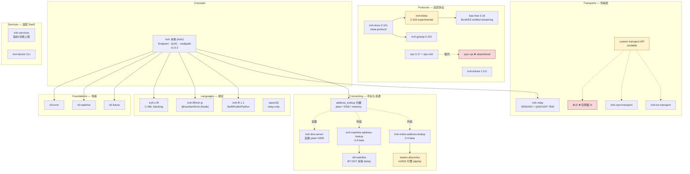

# 生态地图：全景 · 成熟度证据链 · 不存在清单

iroh 1.0.2 · 调研日期 2026-07-17 · 源码 `/Volumes/yexiyue/iroh-study/`（24 个仓）

> 「能力 → 库」速查表在 [SKILL.md](../SKILL.md)。本文是它的**证据背面**：每条成熟度判定的依据、以及「别找了，不存在」的 grep 级举证。
>
> **方法论边界**：iroh-study 下的仓库多为 **shallow clone（depth=1）**，`git log` 只有 1 条。因此本文的成熟度判定**不使用**提交频率与 issue 活跃度，只用五类证据：**版本号 / HEAD 日期 / 依赖版本 / README 声明 / CI 配置**。要评活跃度请 `git fetch --unshallow` 或直接看 GitHub。

## 生态全景

按 docs.iroh.computer 的真实分区组织。括号内是本地仓名。

**读图三条**：

① **iroh 核心很瘦** —— mDNS、DHT 都是外挂 crate，iroh 核心 crate 对 mDNS 零依赖（`iroh/iroh/Cargo.toml` grep `mdns` 零命中）；带着 libp2p「mDNS 是内置 behaviour」的直觉会翻车。

② **iroh 1.0 ≠ 生态 1.0** —— iroh / iroh-tickets / n0-watcher / n0-error 已 1.x；blobs(0.103) / gossip(0.101) / docs(0.101) / irpc(0.17) / address-lookups(0.4) 全是 0.x，无 API 稳定承诺。

③ **irpc 从不承载 bulk 字节** —— n0 自己的分界线：bulk data plane 手写 `ProtocolHandler`，control/progress 才上 irpc（含 iroh-blobs 自己）。

## 成熟度总表（完整证据链）

### production —— 可生产依赖

| 库 | 版本 | 依据 |
|---|---|---|
| **iroh** | 1.0.2 | `iroh/iroh/Cargo.toml:3`；HEAD 2026-07-16（调研前 1 天），PR 号已到 #4421；含 16 种 NAT 组合的 userns 仿真测试矩阵（`iroh/iroh/tests/patchbay/nat.rs`）；`#![deny(missing_docs)]` + `cargo_check_external_types` 公开 API 白名单（`iroh/iroh/Cargo.toml:170-193`）。注意：iroh 根 `Cargo.toml` **没有** `[workspace.package]`，版本在 `iroh/iroh/Cargo.toml:3` |
| **iroh-tickets** | 1.0.0 | `iroh-tickets/Cargo.toml:3`；HEAD 2026-06-15 `chore: Release iroh-tickets version 1.0.0`；README 无免责声明；**7 个仓**（10 个 Cargo.toml）依赖它，其中真正的生产采用面是 6 个 crate：iroh-blobs / iroh-docs / dumbpipe / iroh-ffi / iroh-ffi·iroh-js / iroh-c-ffi（另 4 个是 examples/experiments） |
| **iroh-relay** | 1.0.2 | 与 iroh 同仓同版本；`iroh-relay/Cargo.toml:176-179` 定义 `[[bin]] name = "iroh-relay"` + `required-features = ["server"]`；仓根有 `docker/Dockerfile`；`lib.rs:30` `#![deny(missing_docs, ...)]`、`:31` `#![cfg_attr(not(test), deny(clippy::unwrap_used))]`；`access.shared_token` 于 1.0.0 落地（CHANGELOG:55，#4326），AccessControl trait 于 1.0.0-rc.1 落地（CHANGELOG:123，#4276）—— **都在 1.0.2 里，不是未发布特性** |
| **iroh-dns-server** | 1.0.2 | 与 iroh 主线同步发版；自带 `config.dev.toml` / `config.prod.toml`（18 行）；`iroh/docker/Dockerfile` 有独立 build target；n0 用它跑生产 dns.iroh.link |
| **bao-tree** | 0.16.0 | `bao-tree/Cargo.toml`；README **无任何免责声明**（与 iroh-blobs README 形成对比），有 CI/docs.rs/crates.io 徽章；被 iroh-blobs 0.103 以 `bao-tree = "0.16"` 生产依赖并随 sendme 0.36.0 分发。⚠️ **HEAD 本身就是 release commit `Release v0.16.0` (2025-11-04)，即默认分支 8.5 个月零提交**——属「小而完备、已收敛」，5 个 open issue 全是 API 打磨类（#56/#57/#59/#76/#11），无正确性缺陷。GitHub API：未归档、35 stars |
| **dumbpipe** | 0.39.0 | HEAD 2026-06-24 `ci: add semver check (#102)` —— 有 PR 编号与 semver CI；依赖 `iroh = { version = "1.0.0", default-features = false, features = ["tls-ring"] }`（Cargo.toml:19）+ `iroh-tickets = "1.0.0"`；`tests/cli.rs` 494 行。⚠️ 它是 CLI 应用而非库，pre-1.0 不代表不可用 |
| **n0-future** | 0.3.2 | CHANGELOG 记 2026-01-07；被 **14 个仓**依赖；1506 行里绝大部分是 `#[cfg(wasm_browser)] mod wasm`，**native 端只有十几行 `pub use tokio::*`**。MSRV 1.85 / edition 2021 |
| **n0-watcher** | 1.0.0 | `n0-watcher/Cargo.toml`；iroh 1.0.2 依赖且 `iroh/iroh/src/lib.rs:291` `pub use n0_watcher::Watcher;` —— **是 iroh 公开 API**。⚠️ 1.0 很年轻（rc.0 于 2026-05-06、1.0.0 于 2026-06-15），最后**功能性**变更即 1.0.0 发布（2026-07-09 那条是 dependabot 的 actions/checkout bump）；含 loom 并发测试但 **7 个 workflow 无一跑 loom**；MSRV 1.91（三个地基库里最激进） |
| **n0-error** | 1.0.0 | `n0-error/Cargo.toml`；iroh / iroh-base / iroh-relay 均依赖。⚠️ 0.1.3（2026-01-15）→ 1.0.0（2026-06-15）只隔 5 个月；**CHANGELOG 里没有 1.0.0 条目**（最顶部是 1.0.0-rc.0），日期来自 git log + Cargo.toml。**能用 ≠ 该用**，见 [foundations.md](foundations.md) |
| **iroh-ffi** | 1.1.0 | HEAD 2026-07-16（调研前 1 天）`ci: replace gh CLI with action-gh-release`，PR 号 #274；9 个 workflow；Makefile.toml 有 `verify-swift-xcframework` / `verify-kotlin-android-consumer` 这类「发布前验证产物形状」任务。⚠️ `Cargo.toml:5` 是 `publish = false` —— 1.1.0 **不是 crates.io release**（走 npm/maven/cocoapods），版本号不是承载证据；production 判定靠 HEAD 日期与它作为官方绑定的角色 |
| **iroh-c-ffi** | 0.101.0 | HEAD 2026-06-25 `ci: add semver check (#71)`；依赖 iroh 1.0.0。⚠️ **打折**：版本号 pre-1.0 且 edition 2021（iroh-ffi 已 edition 2024）——二等公民 |
| **iroh-doctor** | 0.101.0 | HEAD 2026-06-24 `ci: add semver check (#82)`；依赖 iroh 1.0.0；README 提供 `cargo install iroh-doctor`。⚠️ 独立 0.x 版本线，且消费 `unstable-net-report`（无 semver 保证）——**当 CLI 用，别当库依赖** |
| **iroh-services** | 1.0.0 | `iroh-doctor/Cargo.lock` 显示 registry source + checksum，即已正式发布；被 iroh-ffi 依赖。⚠️ 是 **library crate**（`iroh-ffi/src/services.rs:8` `use iroh_services::{Client, ClientBuilder};`），**源码未克隆到 iroh-study，本次未审计**（不是「不可审计」——crates.io 按定义分发源码） |

### production（推断）—— 证据支持但无上游背书

> 这两个库**没有任何上游文档自称 production-ready**。下面的判定是从发版节奏 + CI 厚度 + 存量迁移代码推导出来的，属本 skill 的推断，不是 n0 的承诺。

| 库 | 版本 | 依据 | 反向证据（必须一起读） |
|---|---|---|---|
| **iroh-gossip** | 0.101.0 | CHANGELOG 发版连续可回溯至 2024-11-04 的 0.28.1，近一年约每月一版；README 无免责声明；有仿真器 `src/bin/sim.rs` + simulation workflow；CI 有 wasm32 门禁且断言产物无 `import "env"` | 0.101.0 vs iroh 1.0.2 —— **无 1.0 API 稳定承诺**；shallow clone 无法评活跃度 |
| **iroh-docs** | 0.101.0 | 与 gossip 同日同版本；HEAD 2026-07-15（调研前 2 天）`fix: don't abort receive loop on invalid message (#110)`；14552 行 + 4 个集成测试 + proptest-regressions + **成体系的存储迁移代码**（`src/store/fs/migrate_v1_v2.rs`——有真实存量数据才会写迁移） | 同上 0.x；`.github/workflows/` 下**没有** release.yaml（gossip 有），疑手工发版；wasm32 CI 加了 `--no-default-features` |

### beta —— 能用，但别当 1.0 看

| 库 | 版本 | 依据 |
|---|---|---|
| **iroh-mdns-address-lookup** | 0.4.0 | HEAD 2026-07-10；依赖 iroh 1.0.0。测试**扎实**：6 个 tokio 测试全部**未被 ignore**（`mdns_publish_resolve`:613 / `mdns_publish_expire`:678 / `mdns_subscribe`:735 / `non_advertising_endpoint_not_discovered`:784 / `test_service_names`:818 / `mdns_publish_relay_url`:878），且用 `mod run_in_isolation`(:601) 向 nextest 声明单线程跑。**但**：(1) 0.4.0 pre-1.0，cargo 语义下 minor bump 即 breaking——**测试好 ≠ API 稳**；(2) 核心功能**全压在 alpha 依赖上**：`swarm-discovery = "0.6"`，而 `swarm-discovery/Cargo.toml:3` 是 `0.6.0-alpha.2`，第三方作者（rkuhn），最后提交 2026-04-15 |
| **iroh-mainline-address-lookup** | 0.4.0 | HEAD 2026-07-10；依赖 iroh 1.0.0；被 iroh 核心文档正式指引（`iroh/iroh/src/address_lookup.rs:46-51`）。**降级依据**：唯一的集成测试 `dht_address_lookup_smoke`（lib.rs:374）带 `#[ignore = "flaky"]`（lib.rs:372）——crate 内**没有其他 tokio 测试**，即**整条 DHT publish/resolve 路径零常态 CI 覆盖**；README 无生产背书 |
| **n0-mainline** | 0.5.0 | HEAD 2026-06-15 即 release commit；README 明列已实现 BEP5/42/43/44。**降级依据**：(1) `ed25519-dalek = "=3.0.0-rc.0"`（Cargo.toml:30）—— 精确 pin 在 **release candidate** 上，且位于 DHT 签名验证路径；(2) feature `unstable_signed_peers` 自述 "not yet a published BEP and is therefore considered unstable"。**协议覆盖完整 ≠ 生产成熟** |

> **关于 n0-mainline 的 ed25519-dalek rc pin —— 别夸大**：它**不会**造成 cargo 解析冲突。若你的项目解析到 ed25519-dalek 2.x，2.x 与 3.0.0-rc.0 是不同 SemVer major，cargo 会把它们当独立编译单元共存。真实风险是另外三条：① 重复的 crypto 编译 / 二进制膨胀；② 类型不兼容——**仅当** ed25519 类型跨边界传进 n0-mainline 时；③ 签名路径里跑着未经充分验证的 RC 代码。加之前 `cargo tree` 看一眼即可，不必预设它会打架。

### experimental —— 读，别依赖

| 库 | 版本 | 依据 |
|---|---|---|
| **iroh-blobs** | 0.103.0 | **上游自己不背书**：`README.md:3` 在 HEAD（e82cbdc，2026-06-15，即 0.103.0 的发布 commit 本身）原文仍是 *"NOTE: this version of iroh-blobs is not yet considered production quality. For now, if you need production quality, use iroh-blobs 0.35"*。实锤未修缺陷：issue #233（fs store Poisoned panic，0 评论无人认领）、#207（WASM + irpc 不可用，社区 3 月追问、6 月仍开）。仓库本身活跃（143 stars，刚跟上 iroh 1.0）。**张力**：n0 自家 CLI sendme 0.36.0 已依赖它发布 —— 但 README 的免责声明是维护者的明确表态 |
| **custom transport API** | — | `iroh/iroh/Cargo.toml:162` `unstable-custom-transports = []`；`iroh/iroh/src/endpoint.rs:808` 明写 *"It is not covered by semantic versioning guarantees and may change in any release without a major version bump"*。**但已有可跑通的官方 example** + 被 Tor/Nym 两个真实 crate 消费 —— 非纯纸面设计 |
| **swarm-discovery** | 0.6.0-alpha.2 | `swarm-discovery/Cargo.toml:3`；`hickory-proto = "=0.26.0-beta.4"` 精确 pin 在 beta；HEAD 2026-04-15，比 iroh-address-lookups(07-10) 落后约 3 个月；`git tag` 为空 |
| **iroh-tor-transport** | 0.1.0 | crates.io 唯一版本 0.1.0（2026-06-15）；README 首屏 *"**Experimental:** both iroh custom transports and this crate are experimental and may change."*；stars=16；单一作者 rklaehn；2026-01-22~02-05 有连续真实开发，此后**只在 iroh 发版时跳动** |
| **iroh-nym-transport** | 0.1.0 | 同上；stars=12；**未在 `iroh/TRANSPORTS.md` 注册**（自占 id 0x4E594D）；`n0-error` 仍 pin 在 ^0.1 而 Tor 版已升到 ^1.0 —— 维护滞后 |
| **iroh-experiments/** 全部 | 0.1~0.3 | 仓 README：*"Things in here can be very low level and unpolished... most will not [make it into iroh]"*；**5 个子项目中 4 个**（content-discovery / h3-iroh / iroh-dag-sync / iroh-pkarr-naming-system）停在 `iroh = "1.0.0-rc.1"`，第 5 个（iroh-s3-bao-store）更早、停在 `iroh = "0.35"`；CI **只跑 check/fmt/clippy，零 `cargo test`**；`ci.yml:15` MSRV 1.75（远低于 iroh 主仓的 Rust 2024） |
| **iroh-automerge / iroh-automerge-repo** | 0.1.0 | 位于 iroh-**examples**（README:9 自述 *"Examples how to use iroh... should be somewhat easy to understand"*）；无 description/license/repository 元数据，**未发布到 crates.io**；总共 227 / 410 行 |
| **iroh-dht-experiment** | 0.1.1 | 依赖 `iroh = "0.93"` / `iroh-blobs = "0.95.0"` —— 跨了整个 1.0 breaking 迁移；HEAD 2025-10-21；README 自述 *"Most tests are not really tests but just print out some network stats"*；grep `AddressLookup\|address_lookup` **零命中**——它根本没接 iroh 的寻址接口。**名字骗人**：它不是 address lookup，是一个从零写的 Kademlia 研究/仿真项目（用 BLAKE3 换掉 SHA1 把 keyspace 扩到 32 字节正好装下 ed25519 公钥、用 iroh connection + 0-RTT 换掉裸 UDP），目标是**内容路由** |

### 官方示例 —— 抄模式，别当依赖

| 库 | 依据 |
|---|---|
| **sendme** 0.36.0 | `README.md:11-15` 原文两句成对：*"**This is an example application** using iroh with the iroh-blobs protocol to send files and directories over the internet."* → *"It is **also** useful as a standalone tool for quick copy jobs."* —— `also` 一词的全部作用就是「首先是示例，其次才是工具」。发行工具特征齐全（panic=abort / lto / strip / crates.io 徽章 / `tests/cli.rs`），所以它**不是实验品**，但也不是「production 参考实现」。诚实标签：**官方示例，同时作为可用工具发布** |
| **browser-echo / browser-chat** | version 0.1.0，无 publish 字段，未上 crates.io；在 iroh-examples 仓（自述为示例）。**但**它们在 CI 的 `WASM_EXAMPLES_LIST`（`ci.yml:19` 只有这两个）里，每次 PR 验证 wasm 能编过，也在 `deploy.yml` 的 paths 里 —— 是**被持续验证的一等示例**，可放心抄模式。⚠️ 但别当 production 参考：它们的 tracing-subscriber 开了 env-filter 拉进 regex，体积白扛 |
| **browser-blobs** | 同为 0.1.0 示例，且**不在** CI wasm 列表里，只在 deploy 时构建；缺 `[profile.release]`（白付约 39% gzip 体积）；`src/lib.rs:4` 有一行被注释掉的 cfg gate；edition 还停在 2021。**工程细节别抄，只取 API 用法** |
| **tauri-todos** | 509 行 Tauri 应用，`src-tauri/src/{lib.rs, main.rs, ipc.rs, iroh.rs, state.rs, todos.rs}`；依赖 tauri ^2 + iroh 1.0.0 + iroh-docs 0.101；`src/iroh.rs:20-49` 演示 Endpoint+Gossip+Blobs+Docs 完整接线。它也用 `name = "tauri_todomvc_lib"` 规避 Windows lib/bin 命名冲突（注释：*"The _lib suffix... This seems to be only an issue on Windows"*） |

### abandoned —— 不要用

| 库 | 依据 |
|---|---|
| **quic-rpc** 0.20.0 | irpc 亲口继承：`irpc/src/lib.rs:148-153` *"This crate evolved out of the quic-rpc crate... Compared to quic-rpc, this crate does not abstract over the stream type and is focused on iroh and our noq."*（反向确认：quic-rpc 仓内 grep `irpc` 零命中 —— **单向继承声明**）；HEAD 2025-05-12（距 irpc 的 2026-07-01 有 14 个月空窗）；**致命**：`Cargo.toml:22` `iroh = { version = "0.35" }` 与 iroh 1.0.2 完全不兼容；生态外部依赖数 **0**。⚠️ 措辞准确性：**quic-rpc 的 README/lib.rs 里没有任何显式 deprecation 声明**，abandoned 判定靠上述三项证据 + irpc 的单方面继承声明。**仍有价值的部分**：README 的 `Why?` 一节把「optional rpc framework / 进程内子系统边界」的设计动机讲得比 irpc 更透 |
| **顶层 `iroh-js/`** | HEAD `d400294` **2023-12-07** `initial commit`（initial commit 就是 HEAD）；`package.json` version 0.0.1，包名 `@n0computer/iroh`（**不是**活体的 `@number0/iroh`）；README 首句自我否定 *"This is a very much work-in-progress version"*，且自陈 *"It's distinct from iroh-ffi, which actually embeds an iroh node in the host language"* —— 它是 HTTP-RPC 客户端骨架，靠调已下线的 api.iroh.network REST API；无 CI。**活的 JS 绑定在 `iroh-ffi/iroh-js/`** |
| **bao-docs** | 4 个文件（2 个 reveal.js HTML 幻灯片 + README + INDEX），HEAD **2023-04-20**；README 里 video 链接至今是 `[video](http://tbd)`；索引推荐的 abao crate 早被 bao-tree 取代。内容有效但密度极低（53 个 `<section>` 里约 20 张有文字）。有价值的 slide：17-31 / 34 / 38 / 43。**学原理请直接读 `bao-tree/src/lib.rs:1-204`**（新 2 年半且更深） |
| **iroh-s3-bao-store** | README 有显式 NOTE：*"This crate is currently pinned to iroh@0.35 / iroh-blobs@0.35... porting the 'outboard in memory, data stays remote' behaviour properly hasn't been done yet — **left for future work**."* 同仓其余项目已到 1.0.0-rc.1 / blobs 0.102，它落后约 67 个 minor。仍留在 CI 的 RS_EXAMPLES_LIST 里，故只是「**停止移植**」而非删除 |

## 不存在 —— 别找了（每条都有 grep 级依据）

- **BLE / 蓝牙传输**：全生态仅 2 处字符串提及。`iroh/TRANSPORTS.md:10` 的 BLE 行 **repo 列为空**（对比同表 Tor 行有 repo 链接且状态 experimental）；另 1 处是 `iroh-base/src/endpoint_addr.rs:392` 的测试注释 `// Small id, small data (e.g., Bluetooth MAC)`。GitHub `n0-computer/iroh-ble` 与 `iroh-bluetooth` 均 **404**
- **RN Turbo Module 官方绑定**：iroh-ffi 只吐 Kotlin/Swift/Python —— uniffi_bindgen 0.31.1 内置 backend 只有 kotlin/python/ruby/swift。iroh-ffi 全仓 0 处 react-native / turbo module 引用
- **「短码 → 记录」rendezvous**：iroh 的寻址原语只有 pubkey→addr。即便用到 Mainline DHT，用途也只是「按 endpoint 公钥查地址」（`n0-mainline/README.md`：*"The main purpose for which iroh uses n0-mainline is endpoint address lookup via BEP_0044."*）
- **ticket 的过期/一次性/撤销**：`iroh-tickets/src/` 全仓 grep `expir|ttl|nonce|one.time|revoke` **零命中**
- **iroh-blobs 的浏览器持久化**：全仓 grep `opfs|indexeddb|origin.?private|FileSystemDirectoryHandle` **零命中**。只有 MemStore
- **iroh-blobs 的可插拔 store 后端 trait**：`Store` 是 **struct**（`api.rs:213`），`store/mod.rs` 与 `api.rs` 的 `pub trait` grep 零命中。自定义 store 意味着实现 `api::Store` 背后的 irpc actor/service —— **这正解释了 issue #84 为何是在「申请」该 trait**
- **STUN**：`net_report/probes.rs:25-33` 的 `enum Probe { Https, QadIpv4, QadIpv6 }` **无 Stun 变体**；`CHANGELOG.md:585` 记录 `Remove stun-rs (#3546)`。全仓 grep `stun` 的 20 处命中**全部是标识符残留**（如 `periodic_re_stun_timer`）
- **DCUtR 式的独立打洞握手**：全仓 grep `call_me_maybe|CallMeMaybe` 在 `iroh/iroh/src/` 下**零命中**（⚠️ 别拿 grep `disco` 当证据 —— 它有 92 处命中，全是 address_lookup/discovery/discovered/Disconnected）。机制是 QUIC multipath（`CHANGELOG.md:718` `Use quinn multipath`）

## 导航陷阱

### 1. 两个 iroh-js

| | 顶层 `iroh-js/` | `iroh-ffi/iroh-js/` |
|---|---|---|
| 状态 | **死了 2.5 年** | **活的** |
| HEAD | `d400294` **2023-12-07** `initial commit` | 随 iroh-ffi（2026-07-16） |
| npm 包名 | `@n0computer/iroh` | **`@number0/iroh`** |
| 是什么 | HTTP-RPC 客户端骨架，**不嵌 iroh 节点** | napi-rs 原生绑定，真的嵌节点 |

**24 个仓平铺时，`iroh-js` 这个顶层目录名会骗人。**

### 2. 改名后 grep 不到 ≠ 功能不存在

**这是本次调研里最典型的陷阱。** iroh-experiments 顶层 README 说 content-discovery 含 *"[pkarr] integration for finding trackers"*，而**字面 grep `pkarr` 在该目录零命中** —— 很容易得出「README 与代码不符」的结论。**那是错的。**

pkarr 机制以**改名后的 crate** 完整存在且已接线：
- `content-discovery/Cargo.toml:32` `iroh-mainline-address-lookup = "0.3"`
- `iroh-content-tracker/src/main.rs:53` `DhtAddressLookup::builder().secret_key(key).build()?`（发布自身地址）
- `iroh-content-discovery-cli/src/main.rs:88` `DhtAddressLookup::builder().no_publish().build()?`（查询侧）
- Cargo.lock 内 iroh-mainline-address-lookup 依赖 n0-mainline，而 n0-mainline README 自述为 *"an iroh-flavored fork of [nuhvi/dht]"*、*"endpoint address lookup via BEP_0044"* —— **nuhvi 即 pkarr.org 作者，BEP_0044 ed25519 签名可变记录就是 pkarr 的机制本体**

**n0 把 pkarr 换成自家 n0-mainline、并把 discovery 改名 address_lookup，所以字符串消失而功能仍在。**

> 📌 **通则**：iroh 生态凡是 grep 不到 `discovery` / `pkarr` 的地方，**先想想是不是改名了**。只查一个子 crate 的 Cargo.toml（恰好是三个里唯一没有该依赖的那个）+ 字面 grep 关键词 = 得出反向结论。

### 3. 两个同名的 `RelayConfig`

| 类型 | 位置 | 语义 |
|------|------|------|
| `relay_map::RelayConfig` | `iroh-relay/src/relay_map.rs:232` | **客户端侧**（连哪个 relay）。被 iroh 顶层 re-export：`iroh/src/lib.rs:290` —— **`iroh::RelayConfig` 是这个** |
| `server::RelayConfig` | `iroh-relay/src/server.rs:127` | **服务端侧**（怎么起 relay）。需 `use iroh_relay::server::RelayConfig` |

**字段完全不同。同时 import 必须 alias。文档/示例里看到 `RelayConfig` 一定要先看 use 语句。**

### 4. automerge 在 iroh-examples，不在 iroh-experiments

对全树 grep `automerge` 的命中**全部**落在 `iroh-examples/` 下，iroh-experiments **零命中**（其 README 列出的全部内容为 content-discovery、h3-iroh、iroh-dag-sync、iroh-pkarr-naming-system、iroh-s3-bao-store）。两仓定位不同：experiments 是 *"very low level and unpolished"*，examples 是 *"should be somewhat easy to understand"*。

### 5. `dumbpipe-web` 不是浏览器例子

`Cargo.toml` 的 package name 是 **`reverse-proxy`**（与目录名不符）；依赖 hyper 1.0 + `tokio { features = ["full"] }`（wasm 下不可能）+ dumbpipe 0.39，**零 wasm-bindgen 系依赖**；不在 deploy/wasm 列表里。**名字里的 "web" 指「给 dumbpipe 加个 HTTP 前端」，不是「跑在 web 里」。**
