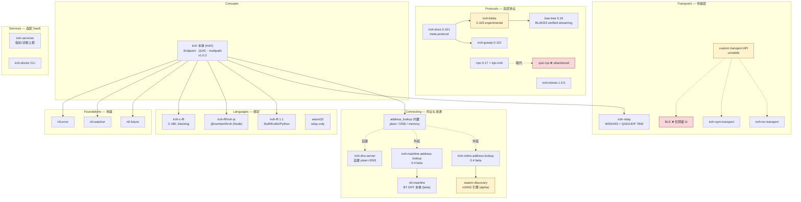

# 生态地图：按能力查库 · 成熟度证据链 · 不存在清单

iroh 1.0.2 · 调研日期 2026-07-17 · 源码快照 `/Volumes/yexiyue/iroh-study/`（24 个仓）

> **这是正交索引层，不是官方分区。** 官方文档只讲 n0 自家那套怎么用，不回答「要做 X 有没有现成的库」
> 「这个 crate 维护还活着吗」「代价是什么」。本文按**用途**而非领域组织，回答的就是这三个问题。
>
> 撞到报错 → [index-gotchas.md](index-gotchas.md)；官方没讲的地基 → [index-foundations.md](index-foundations.md)。

> **方法论边界（本文全部成熟度判定的效力声明）**：iroh-study 下的仓库多为 **shallow clone（depth=1）**，
> `git log` 只有 1 条，且**不是 git 仓库整体**（无统一 `.git`）。因此本文的成熟度判定**不使用**
> 提交频率与 issue 活跃度，只用五类证据：**版本号 / HEAD 日期 / 依赖版本 / README 声明 / CI 配置**。
> 要评活跃度请 `git fetch --unshallow` 或直接看 GitHub。

## 生态全景

按 docs.iroh.computer 的真实分区组织。括号内是本地仓名。



**读图三条**：

① **iroh 核心很瘦** —— mDNS、DHT 都是外挂 crate，iroh 核心对 mDNS 零依赖。带着 libp2p「mDNS 是内置 behaviour」的直觉会翻车 → [02-connecting.md](02-connecting.md) 的 mDNS 一节。

② **iroh 1.0 ≠ 生态 1.0** —— iroh / iroh-tickets / iroh-relay / iroh-dns-server / n0-watcher / n0-error 已 1.x；blobs(0.103) / gossip(0.101) / docs(0.101) / irpc(0.17) / address-lookups(0.4) 全是 0.x，**无 API 稳定承诺**。

③ **irpc 从不承载 bulk 字节** —— n0 的分界线是「bulk data plane 手写 `ProtocolHandler`，control/progress 才上 irpc」 → [03d-docs-rpc-automerge.md](03d-docs-rpc-automerge.md)。

---

# 第一部分：能力 → 库速查表

成熟度含义见[下方分级](#成熟度总表完整证据链)。

### 寻址与发现

| 我要做 X | 用 Y | 成熟度 | 入口 |
|---|---|---|---|
| 跨网寻址（EndpointId → 地址） | **iroh 内置 pkarr**（`presets::N0` 已默认装好） | production | `iroh/iroh/src/address_lookup.rs` |
| 局域网发现（对标 libp2p mDNS behaviour） | **iroh-mdns-address-lookup**（iroh 核心**不含** mDNS，必须外挂） | **beta** | `iroh-address-lookups/iroh-mdns-address-lookup/src/lib.rs` |
| 去中心化寻址（摆脱对 n0 DNS 的单点依赖） | **iroh-mainline-address-lookup**（BitTorrent Mainline DHT） | **beta** | `iroh-address-lookups/iroh-mainline-address-lookup/src/lib.rs` |
| 自建 pkarr relay + DNS 权威 | **iroh-dns-server** | production | `iroh/iroh-dns-server/config.prod.toml` |
| 「短码 → 地址」rendezvous | ❌ **生态里不存在**。iroh 的寻址原语只有 pubkey→addr | — | [`01-concepts.md`](01-concepts.md) |

### 数据传输

| 我要做 X | 用 Y | 成熟度 | 入口 |
|---|---|---|---|
| 逐块验签 / 可信断点续传（不要 blob store） | **bao-tree**（纯算法库，**不依赖 iroh 网络栈**） | production | `bao-tree/src/lib.rs:1-204` |
| 内容寻址 blob store + 传输 + GC + 多源下载 | **iroh-blobs** | **experimental**（README 自述非生产质量） | `iroh-blobs/src/api/remote.rs` |
| 文件传输的官方范式参考 | **sendme**（读它的 1184 行 main.rs） | **官方示例** | `sendme/src/main.rs` |
| 最小 P2P 骨架（裸管子，自研协议） | **dumbpipe**（lib.rs 只有 13 行） | production | `dumbpipe/src/lib.rs` |
| 内容发现（"谁有这个 hash"） | **iroh-content-discovery**（tracker 式，非 DHT） | experimental | `iroh-experiments/content-discovery/` |

### 邀请 / 分享链接

| 我要做 X | 用 Y | 成熟度 | 入口 |
|---|---|---|---|
| 把「连到某节点所需的一切」编码成可粘贴字符串 | **iroh-tickets** 的 `Ticket` trait（自定义 payload） | production | `iroh-tickets/src/lib.rs` |
| 分享一个 blob（地址 + hash） | **iroh-blobs 的 `BlobTicket`** | 随 iroh-blobs | `iroh-blobs/src/ticket.rs` |
| 过期 / 一次性 / 撤销 | ❌ **ticket 零支持**，必须自己在 payload 里做 | — | [`01-concepts.md`](01-concepts.md) |

### 高层协议

| 我要做 X | 用 Y | 成熟度 | 入口 |
|---|---|---|---|
| 大规模 swarm 的 topic pubsub | **iroh-gossip** | production（推断） | `iroh-gossip/src/api.rs` |
| 多设备 KV 最终一致同步（共享文件夹） | **iroh-docs**（meta-protocol：强制 blobs + gossip 三件套） | production（推断） | `iroh-docs/src/protocol.rs` |
| Rust↔Rust typed actor 边界 / RPC | **irpc** | production，但 **pre-1.0 且破坏性变更频繁** | `irpc/src/lib.rs` |
| 把 irpc 跑在 iroh 上 | **irpc-iroh** | production（生态实证仅 n=1） | `irpc/irpc-iroh/src/lib.rs` |
| ~~RPC 抽象 transport~~ | ❌ **quic-rpc 已被 irpc 取代**，卡死在 iroh 0.35 | **abandoned** | `quic-rpc/` |
| CRDT 协作文档 | ⚠️ 生态里只有 **示例**（iroh-automerge / iroh-automerge-repo），无库 | experimental | `iroh-examples/iroh-automerge/src/protocol.rs` |

### 传输层

| 我要做 X | 用 Y | 成熟度 | 入口 |
|---|---|---|---|
| 自建 relay | **iroh-relay**（`--features server`，自带 binary + Dockerfile） | production | `iroh/iroh-relay/src/main.rs` |
| 自定义物理/覆盖网络 | **custom transport API**（数据报级，非 stream 级） | **不受 semver 保护** | `iroh/iroh/src/socket/transports/custom.rs` |
| Tor 隐藏服务传输 | **iroh-tor-transport**（要外部 Tor daemon + control port） | experimental | GitHub `n0-computer/iroh-tor-transport` |
| Nym mixnet 传输 | **iroh-nym-transport**（~15-20 KiB/s，README 自陈不适合文件传输） | experimental | GitHub `n0-computer/iroh-nym-transport` |
| BLE / 蓝牙传输 | ❌ **不存在**。只在 `iroh/TRANSPORTS.md:10` 预留了 id 0x424C45，repo 列为空 | — | `iroh/TRANSPORTS.md:10` |

### 语言绑定

| 我要做 X | 用 Y | 成熟度 | 入口 |
|---|---|---|---|
| Swift / Kotlin / Python | **iroh-ffi**（uniffi 0.31） | production | `iroh-ffi/src/endpoint.rs` |
| Node.js | **iroh-ffi/iroh-js** = npm `@number0/iroh`（napi-rs 3） | production | `iroh-ffi/iroh-js/src/endpoint.rs` |
| C / C++ / Go / 嵌入式 | **iroh-c-ffi**（safer-ffi，**全同步阻塞**） | production（打折：0.101.0 + edition 2021） | `iroh-c-ffi/src/endpoint.rs` |
| React Native Turbo Module | ❌ **不存在**，uniffi_bindgen 内置 backend 只有 kotlin/python/ruby/swift | — | [`05-languages.md`](05-languages.md) |
| 浏览器 / wasm | **iroh 本体**（`default-features = false, features = ["tls-ring"]`） | production | `iroh-examples/browser-echo/src/node.rs` |
| ⚠️ 顶层 `iroh-js/` 目录 | ❌ **墓碑**。2023-12-07 单 commit，指向已下线的 api.iroh.network | **abandoned** | `iroh-js/README.md` |

### 地基与工具

| 我要做 X | 用 Y | 成熟度 | 入口 |
|---|---|---|---|
| tokio ↔ wasm 的 spawn/time 垫片 | **n0-future**（native 上就是 `pub use tokio::*`） | production | `n0-future/src/task.rs` |
| 状态广播（latest-value-wins） | **n0-watcher**（是 iroh 公开 API，用 iroh 就躲不掉） | production | `n0-watcher/src/lib.rs` |
| 带 location 的错误库 | **n0-error** —— 但**大概率不该用**（location 生产默认不采集） | production | `n0-error/src/meta.rs` |

## 一句话选型：寻址与发现

| 场景 | 选择 | 代价 |
|---|---|---|
| 跨网寻址（默认） | **内置 pkarr**（`presets::N0` 已装好） | 信任 n0 的 dns.iroh.link 一家（它能看到你的 IP、EndpointId、你查过谁） |
| 浏览器 / wasm | **只能是 pkarr relay**（HTTP） | 没得选。DHT 与 mDNS 编译都过不去 |
| 局域网 / 离线内网 | **iroh-mdns-address-lookup**（beta） | 必须显式设 `addr_filter`（**默认不过滤**）；移动端权限是空白区 |
| 真去中心化（摆脱 n0 单点） | **iroh-mainline-address-lookup**（beta） | 源 IP 暴露给公共 BT DHT 的 bootstrap 与沿途节点；lookup 向全网泄露「你在找谁」 |
| 带外交换地址（ticket / 扫码 / 配对） | **MemoryLookup**，或干脆什么都不装 | 无 —— 这条路完全不需要任何寻址基础设施 |

三者**可同时装、无优先级**，并发查询先到先得。


---

# 第二部分：成熟度

## 成熟度分级速览

**iroh 1.0 ≠ 生态 1.0**：iroh / iroh-tickets / iroh-relay / iroh-dns-server / n0-watcher / n0-error / bao-tree 已 1.x（bao-tree 是 0.16 但按证据判 production）；blobs(0.103) / gossip(0.101) / docs(0.101) / irpc(0.17) / address-lookups(0.4) 全是 0.x，**无 API 稳定承诺**。

| 分级 | 含义 | 成员 |
|---|---|---|
| **production** | 可生产依赖 | iroh · iroh-relay · iroh-dns-server · iroh-tickets · bao-tree · dumbpipe · n0-future · n0-watcher · n0-error · iroh-ffi · iroh-c-ffi(打折) · iroh-doctor · iroh-services |
| **production（推断）** | 证据支持但**无上游背书** | iroh-gossip · iroh-docs |
| **beta** | 能用，别当 1.0 看 | iroh-mdns-address-lookup · iroh-mainline-address-lookup · n0-mainline |
| **experimental** | 读，别依赖 | iroh-blobs · custom transport API · swarm-discovery · iroh-tor/nym-transport · iroh-experiments/\* · iroh-automerge\* · iroh-dht-experiment |
| **官方示例** | 抄模式，别当依赖 | sendme · browser-echo/chat/blobs · tauri-todos |
| **abandoned** | 不要用 | quic-rpc · 顶层 `iroh-js/` · bao-docs · iroh-s3-bao-store |

> ⚠️ 两条容易被写高的：**sendme 是「官方示例，同时作为可用工具发布」**（`README.md:11-15` 两句成对：*"**This is an example application**..."* → *"It is **also** useful as a standalone tool"*，`also` 一词的全部作用就是「首先是示例」）；**mDNS / DHT lookup 是 beta 不是 production**（0.4/0.5 pre-1.0；DHT 唯一测试 `#[ignore = "flaky"]`；mDNS 核心压在 alpha 依赖 `swarm-discovery 0.6.0-alpha.2` 上；n0-mainline 把 `ed25519-dalek` 精确 pin 在 `=3.0.0-rc.0`）。

## 成熟度总表（完整证据链）

### production —— 可生产依赖

| 库 | 版本 | 依据 |
|---|---|---|
| **iroh** | 1.0.2 | `iroh/iroh/Cargo.toml:3`；HEAD 2026-07-16（调研前 1 天），PR 号已到 #4421；含 16 种 NAT 组合的 userns 仿真测试矩阵（`iroh/iroh/tests/patchbay/nat.rs`）；`#![deny(missing_docs)]` + `cargo_check_external_types` 公开 API 白名单（`iroh/iroh/Cargo.toml:170-193`）。注意：iroh 根 `Cargo.toml` **没有** `[workspace.package]`，版本在 `iroh/iroh/Cargo.toml:3` |
| **iroh-tickets** | 1.0.0 | `iroh-tickets/Cargo.toml:3`；HEAD 2026-06-15 `chore: Release iroh-tickets version 1.0.0`；README 无免责声明；**7 个仓**（10 个 Cargo.toml）依赖它，其中真正的生产采用面是 6 个 crate：iroh-blobs / iroh-docs / dumbpipe / iroh-ffi / iroh-ffi·iroh-js / iroh-c-ffi（另 4 个是 examples/experiments） |
| **iroh-relay** | 1.0.2 | 与 iroh 同仓同版本；`iroh-relay/Cargo.toml:176-179` 定义 `[[bin]] name = "iroh-relay"` + `required-features = ["server"]`；仓根有 `docker/Dockerfile`；`lib.rs:30` `#![deny(missing_docs, ...)]`、`:31` `#![cfg_attr(not(test), deny(clippy::unwrap_used))]`；`access.shared_token` 于 1.0.0 落地（CHANGELOG:55，#4326），AccessControl trait 于 1.0.0-rc.1 落地（CHANGELOG:123，#4276）—— **都在 1.0.2 里，不是未发布特性** |
| **iroh-dns-server** | 1.0.2 | 与 iroh 主线同步发版；自带 `config.dev.toml` / `config.prod.toml`（18 行）；`iroh/docker/Dockerfile` 有独立 build target；n0 用它跑生产 dns.iroh.link |
| **bao-tree** | 0.16.0 | `bao-tree/Cargo.toml`；README **无任何免责声明**（与 iroh-blobs README 形成对比），有 CI/docs.rs/crates.io 徽章；被 iroh-blobs 0.103 以 `bao-tree = "0.16"` 生产依赖并随 sendme 0.36.0 分发。⚠️ **HEAD 本身就是 release commit `Release v0.16.0` (2025-11-04)，即默认分支 8.5 个月零提交**——属「小而完备、已收敛」，5 个 open issue 全是 API 打磨类（#56/#57/#59/#76/#11），无正确性缺陷。GitHub API：未归档、35 stars |
| **dumbpipe** | 0.39.0 | HEAD 2026-06-24 `ci: add semver check (#102)` —— 有 PR 编号与 semver CI；依赖 `iroh = { version = "1.0.0", default-features = false, features = ["tls-ring"] }`（Cargo.toml:19）+ `iroh-tickets = "1.0.0"`；`tests/cli.rs` 494 行。⚠️ 它是 CLI 应用而非库，pre-1.0 不代表不可用 |
| **n0-future** | 0.3.2 | CHANGELOG 记 2026-01-07；被 **14 个仓**依赖；1506 行里绝大部分是 `#[cfg(wasm_browser)] mod wasm`，**native 端只有十几行 `pub use tokio::*`**。MSRV 1.85 / edition 2021 |
| **n0-watcher** | 1.0.0 | `n0-watcher/Cargo.toml`；iroh 1.0.2 依赖且 `iroh/iroh/src/lib.rs:291` `pub use n0_watcher::Watcher;` —— **是 iroh 公开 API**。⚠️ 1.0 很年轻（rc.0 于 2026-05-06、1.0.0 于 2026-06-15），最后**功能性**变更即 1.0.0 发布（2026-07-09 那条是 dependabot 的 actions/checkout bump）；含 loom 并发测试但 **7 个 workflow 无一跑 loom**；MSRV 1.91（三个地基库里最激进） |
| **n0-error** | 1.0.0 | `n0-error/Cargo.toml`；iroh / iroh-base / iroh-relay 均依赖。⚠️ 0.1.3（2026-01-15）→ 1.0.0（2026-06-15）只隔 5 个月；**CHANGELOG 里没有 1.0.0 条目**（最顶部是 1.0.0-rc.0），日期来自 git log + Cargo.toml。**能用 ≠ 该用**，见 [index-foundations.md](index-foundations.md) |
| **iroh-ffi** | 1.1.0 | HEAD 2026-07-16（调研前 1 天）`ci: replace gh CLI with action-gh-release`，PR 号 #274；9 个 workflow；Makefile.toml 有 `verify-swift-xcframework` / `verify-kotlin-android-consumer` 这类「发布前验证产物形状」任务。⚠️ `Cargo.toml:5` 是 `publish = false` —— 1.1.0 **不是 crates.io release**（走 npm/maven/cocoapods），版本号不是承载证据；production 判定靠 HEAD 日期与它作为官方绑定的角色 |
| **iroh-c-ffi** | 0.101.0 | HEAD 2026-06-25 `ci: add semver check (#71)`；依赖 iroh 1.0.0。⚠️ **打折**：版本号 pre-1.0 且 edition 2021（iroh-ffi 已 edition 2024）——二等公民 |
| **iroh-doctor** | 0.101.0 | HEAD 2026-06-24 `ci: add semver check (#82)`；依赖 iroh 1.0.0；README 提供 `cargo install iroh-doctor`。⚠️ 独立 0.x 版本线，且消费 `unstable-net-report`（无 semver 保证）——**当 CLI 用，别当库依赖** |
| **iroh-services** | 1.0.0 | `iroh-doctor/Cargo.lock` 显示 registry source + checksum，即已正式发布；被 iroh-ffi 依赖。⚠️ 是 **library crate**（`iroh-ffi/src/services.rs:8` `use iroh_services::{Client, ClientBuilder};`），**源码未克隆到 iroh-study，本次未审计**（不是「不可审计」——crates.io 按定义分发源码） |

### production（推断）—— 证据支持但无上游背书

> 这两个库**没有任何上游文档自称 production-ready**。下面的判定是从发版节奏 + CI 厚度 + 存量迁移代码推导出来的，属本 skill 的推断，不是 n0 的承诺。

| 库 | 版本 | 依据 | 反向证据（必须一起读） |
|---|---|---|---|
| **iroh-gossip** | 0.101.0 | CHANGELOG 发版连续可回溯至 2024-11-04 的 0.28.1，近一年约每月一版；README 无免责声明；有仿真器 `src/bin/sim.rs` + simulation workflow；CI 有 wasm32 门禁且断言产物无 `import "env"` | 0.101.0 vs iroh 1.0.2 —— **无 1.0 API 稳定承诺**；shallow clone 无法评活跃度 |
| **iroh-docs** | 0.101.0 | 与 gossip 同日同版本；HEAD 2026-07-15（调研前 2 天）`fix: don't abort receive loop on invalid message (#110)`；14552 行 + 4 个集成测试 + proptest-regressions + **成体系的存储迁移代码**（`src/store/fs/migrate_v1_v2.rs`——有真实存量数据才会写迁移） | 同上 0.x；`.github/workflows/` 下**没有** release.yaml（gossip 有），疑手工发版；wasm32 CI 加了 `--no-default-features` |

### beta —— 能用，但别当 1.0 看

| 库 | 版本 | 依据 |
|---|---|---|
| **iroh-mdns-address-lookup** | 0.4.0 | HEAD 2026-07-10；依赖 iroh 1.0.0。测试**扎实**：6 个 tokio 测试全部**未被 ignore**（`mdns_publish_resolve`:613 / `mdns_publish_expire`:678 / `mdns_subscribe`:735 / `non_advertising_endpoint_not_discovered`:784 / `test_service_names`:818 / `mdns_publish_relay_url`:878），且用 `mod run_in_isolation`(:601) 向 nextest 声明单线程跑。**但**：(1) 0.4.0 pre-1.0，cargo 语义下 minor bump 即 breaking——**测试好 ≠ API 稳**；(2) 核心功能**全压在 alpha 依赖上**：`swarm-discovery = "0.6"`，而 `swarm-discovery/Cargo.toml:3` 是 `0.6.0-alpha.2`，第三方作者（rkuhn），最后提交 2026-04-15 |
| **iroh-mainline-address-lookup** | 0.4.0 | HEAD 2026-07-10；依赖 iroh 1.0.0；被 iroh 核心文档正式指引（`iroh/iroh/src/address_lookup.rs:46-51`）。**降级依据**：唯一的集成测试 `dht_address_lookup_smoke`（lib.rs:374）带 `#[ignore = "flaky"]`（lib.rs:372）——crate 内**没有其他 tokio 测试**，即**整条 DHT publish/resolve 路径零常态 CI 覆盖**；README 无生产背书 |
| **n0-mainline** | 0.5.0 | HEAD 2026-06-15 即 release commit；README 明列已实现 BEP5/42/43/44。**降级依据**：(1) `ed25519-dalek = "=3.0.0-rc.0"`（Cargo.toml:30）—— 精确 pin 在 **release candidate** 上，且位于 DHT 签名验证路径；(2) feature `unstable_signed_peers` 自述 "not yet a published BEP and is therefore considered unstable"。**协议覆盖完整 ≠ 生产成熟** |

> **关于 n0-mainline 的 ed25519-dalek rc pin —— 别夸大**：它**不会**造成 cargo 解析冲突。若你的项目解析到 ed25519-dalek 2.x，2.x 与 3.0.0-rc.0 是不同 SemVer major，cargo 会把它们当独立编译单元共存。真实风险是另外三条：① 重复的 crypto 编译 / 二进制膨胀；② 类型不兼容——**仅当** ed25519 类型跨边界传进 n0-mainline 时；③ 签名路径里跑着未经充分验证的 RC 代码。加之前 `cargo tree` 看一眼即可，不必预设它会打架。

### experimental —— 读，别依赖

| 库 | 版本 | 依据 |
|---|---|---|
| **iroh-blobs** | 0.103.0 | **上游自己不背书**：`README.md:3` 在 HEAD（e82cbdc，2026-06-15，即 0.103.0 的发布 commit 本身）原文仍是 *"NOTE: this version of iroh-blobs is not yet considered production quality. For now, if you need production quality, use iroh-blobs 0.35"*。实锤未修缺陷：issue #233（fs store Poisoned panic，0 评论无人认领）、#207（WASM + irpc 不可用，社区 3 月追问、6 月仍开）。仓库本身活跃（143 stars，刚跟上 iroh 1.0）。**张力**：n0 自家 CLI sendme 0.36.0 已依赖它发布 —— 但 README 的免责声明是维护者的明确表态 |
| **custom transport API** | — | `iroh/iroh/Cargo.toml:162` `unstable-custom-transports = []`；`iroh/iroh/src/endpoint.rs:808` 明写 *"It is not covered by semantic versioning guarantees and may change in any release without a major version bump"*。**但已有可跑通的官方 example** + 被 Tor/Nym 两个真实 crate 消费 —— 非纯纸面设计 |
| **swarm-discovery** | 0.6.0-alpha.2 | `swarm-discovery/Cargo.toml:3`；`hickory-proto = "=0.26.0-beta.4"` 精确 pin 在 beta；HEAD 2026-04-15，比 iroh-address-lookups(07-10) 落后约 3 个月；`git tag` 为空 |
| **iroh-tor-transport** | 0.1.0 | crates.io 唯一版本 0.1.0（2026-06-15）；README 首屏 *"**Experimental:** both iroh custom transports and this crate are experimental and may change."*；stars=16；单一作者 rklaehn；2026-01-22~02-05 有连续真实开发，此后**只在 iroh 发版时跳动** |
| **iroh-nym-transport** | 0.1.0 | 同上；stars=12；**未在 `iroh/TRANSPORTS.md` 注册**（自占 id 0x4E594D）；`n0-error` 仍 pin 在 ^0.1 而 Tor 版已升到 ^1.0 —— 维护滞后 |
| **iroh-experiments/** 全部 | 0.1~0.3 | 仓 README：*"Things in here can be very low level and unpolished... most will not [make it into iroh]"*；**5 个子项目中 4 个**（content-discovery / h3-iroh / iroh-dag-sync / iroh-pkarr-naming-system）停在 `iroh = "1.0.0-rc.1"`，第 5 个（iroh-s3-bao-store）更早、停在 `iroh = "0.35"`；CI **只跑 check/fmt/clippy，零 `cargo test`**；`ci.yml:15` MSRV 1.75（远低于 iroh 主仓的 Rust 2024） |
| **iroh-automerge / iroh-automerge-repo** | 0.1.0 | 位于 iroh-**examples**（README:9 自述 *"Examples how to use iroh... should be somewhat easy to understand"*）；无 description/license/repository 元数据，**未发布到 crates.io**；总共 227 / 410 行 |
| **iroh-dht-experiment** | 0.1.1 | 依赖 `iroh = "0.93"` / `iroh-blobs = "0.95.0"` —— 跨了整个 1.0 breaking 迁移；HEAD 2025-10-21；README 自述 *"Most tests are not really tests but just print out some network stats"*；grep `AddressLookup\|address_lookup` **零命中**——它根本没接 iroh 的寻址接口。**名字骗人**：它不是 address lookup，是一个从零写的 Kademlia 研究/仿真项目（用 BLAKE3 换掉 SHA1 把 keyspace 扩到 32 字节正好装下 ed25519 公钥、用 iroh connection + 0-RTT 换掉裸 UDP），目标是**内容路由** |

### 官方示例 —— 抄模式，别当依赖

| 库 | 依据 |
|---|---|
| **sendme** 0.36.0 | `README.md:11-15` 原文两句成对：*"**This is an example application** using iroh with the iroh-blobs protocol to send files and directories over the internet."* → *"It is **also** useful as a standalone tool for quick copy jobs."* —— `also` 一词的全部作用就是「首先是示例，其次才是工具」。发行工具特征齐全（panic=abort / lto / strip / crates.io 徽章 / `tests/cli.rs`），所以它**不是实验品**，但也不是「production 参考实现」。诚实标签：**官方示例，同时作为可用工具发布** |
| **browser-echo / browser-chat** | version 0.1.0，无 publish 字段，未上 crates.io；在 iroh-examples 仓（自述为示例）。**但**它们在 CI 的 `WASM_EXAMPLES_LIST`（`ci.yml:19` 只有这两个）里，每次 PR 验证 wasm 能编过，也在 `deploy.yml` 的 paths 里 —— 是**被持续验证的一等示例**，可放心抄模式。⚠️ 但别当 production 参考：它们的 tracing-subscriber 开了 env-filter 拉进 regex，体积白扛 |
| **browser-blobs** | 同为 0.1.0 示例，且**不在** CI wasm 列表里，只在 deploy 时构建；缺 `[profile.release]`（白付约 39% gzip 体积）；`src/lib.rs:4` 有一行被注释掉的 cfg gate；edition 还停在 2021。**工程细节别抄，只取 API 用法** |
| **tauri-todos** | 509 行 Tauri 应用，`src-tauri/src/{lib.rs, main.rs, ipc.rs, iroh.rs, state.rs, todos.rs}`；依赖 tauri ^2 + iroh 1.0.0 + iroh-docs 0.101；`src/iroh.rs:20-49` 演示 Endpoint+Gossip+Blobs+Docs 完整接线。它也用 `name = "tauri_todomvc_lib"` 规避 Windows lib/bin 命名冲突（注释：*"The _lib suffix... This seems to be only an issue on Windows"*） |

### abandoned —— 不要用

| 库 | 依据 |
|---|---|
| **quic-rpc** 0.20.0 | irpc 亲口继承：`irpc/src/lib.rs:148-153` *"This crate evolved out of the quic-rpc crate... Compared to quic-rpc, this crate does not abstract over the stream type and is focused on iroh and our noq."*（反向确认：quic-rpc 仓内 grep `irpc` 零命中 —— **单向继承声明**）；HEAD 2025-05-12（距 irpc 的 2026-07-01 有 14 个月空窗）；**致命**：`Cargo.toml:22` `iroh = { version = "0.35" }` 与 iroh 1.0.2 完全不兼容；生态外部依赖数 **0**。⚠️ 措辞准确性：**quic-rpc 的 README/lib.rs 里没有任何显式 deprecation 声明**，abandoned 判定靠上述三项证据 + irpc 的单方面继承声明。**仍有价值的部分**：README 的 `Why?` 一节把「optional rpc framework / 进程内子系统边界」的设计动机讲得比 irpc 更透 |
| **顶层 `iroh-js/`** | HEAD `d400294` **2023-12-07** `initial commit`（initial commit 就是 HEAD）；`package.json` version 0.0.1，包名 `@n0computer/iroh`（**不是**活体的 `@number0/iroh`）；README 首句自我否定 *"This is a very much work-in-progress version"*，且自陈 *"It's distinct from iroh-ffi, which actually embeds an iroh node in the host language"* —— 它是 HTTP-RPC 客户端骨架，靠调已下线的 api.iroh.network REST API；无 CI。**活的 JS 绑定在 `iroh-ffi/iroh-js/`** |
| **bao-docs** | 4 个文件（2 个 reveal.js HTML 幻灯片 + README + INDEX），HEAD **2023-04-20**；README 里 video 链接至今是 `[video](http://tbd)`；索引推荐的 abao crate 早被 bao-tree 取代。内容有效但密度极低（53 个 `<section>` 里约 20 张有文字）。有价值的 slide：17-31 / 34 / 38 / 43。**学原理请直接读 `bao-tree/src/lib.rs:1-204`**（新 2 年半且更深） |
| **iroh-s3-bao-store** | README 有显式 NOTE：*"This crate is currently pinned to iroh@0.35 / iroh-blobs@0.35... porting the 'outboard in memory, data stays remote' behaviour properly hasn't been done yet — **left for future work**."* 同仓其余项目已到 1.0.0-rc.1 / blobs 0.102，它落后约 67 个 minor。仍留在 CI 的 RS_EXAMPLES_LIST 里，故只是「**停止移植**」而非删除 |

## iroh 本体的成熟度

- **production**
- **依据**：
  - `iroh/iroh/Cargo.toml:3` version = 1.0.2
  - git log -1 = `chore(ci): make sure android cleans up after itself (#4421)`（2026-07-16，调研前 1 天），**PR 编号已到 #4421，活跃度极高**
  - 含 Linux userns 网络仿真测试套件 `iroh/iroh/tests/patchbay/nat.rs` 覆盖 16 种 NAT 组合矩阵
  - 仓库含 iroh-relay / iroh-dns-server / docker 等**完整自建基础设施代码**
  - ⚠️ `iroh/iroh/Cargo.toml:170-193` 的 `[package.metadata.cargo_check_external_types] allowed_external_types` 是一条**防止非 1.0 外部类型泄漏进公开 API 的 lint 白名单**（名单里明确分组注释 workspace crates / crates owned by us that will move to 1.0 / 1.0 crates we deem fine / non-1.0 crates we decided to accept）—— 它是 semver 纪律的**佐证**，但不是 semver 保护机制本身。**semver 保护来自它是 1.0.x 这一事实**


### 正文归属速查（此处只留判定，完整证据在上方各表，正文在各分区）

| 库 | 成熟度 | 依据摘要 | 正文 |
|---|---|---|---|
| **iroh-gossip** | production（推断） | 0.101.0；发版节奏可回溯至 2024-11-04 的 0.28.1，近一年约每月一版；README 无免责；有仿真器 `src/bin/sim.rs` + simulation workflow；CI 有 wasm32 门禁且断言产物无 `import "env"`。⚠️ 无上游背书；0.101 vs iroh 1.0.2 无 API 稳定承诺 | [02-connecting.md](02-connecting.md) |
| **iroh-docs** | production（推断） | 0.101.0，与 gossip 同日同版；HEAD 2026-07-15（调研前 2 天）；14552 行 + 4 个集成测试 + proptest-regressions + **成体系的存储迁移代码**（有真实存量数据才会写迁移）。⚠️ 无 release.yaml（gossip 有），疑手工发版；wasm32 CI 加了 `--no-default-features` | [03d-docs-rpc-automerge.md](03d-docs-rpc-automerge.md) |
| **irpc** | production，但 **pre-1.0 且破坏性变更频繁** | 0.17.0；edition 2024；最后提交 2026-07-01；已跟上 iroh 1.x。**6 个仓依赖、5 个在 0.17**。⚠️ 15 个月 10 个 minor 有 **6 个带 [breaking]** —— 平均 **1.7** 个版本一次破坏性变更。**production-grade 的维护度 ≠ 稳定的 API 契约** | [03d-docs-rpc-automerge.md](03d-docs-rpc-automerge.md) |
| **irpc-iroh** | production，但**生态实证仅 n=1** | 与 irpc 同仓同版同步发布；有 wasm CI。⚠️ 0.17 版的外部消费者**只有 iroh-doctor 一个**（且是诊断 CLI 而非传输生产路径）；对比 irpc 的 5 个 0.17 消费者。⚠️ 上游 TODO 计划把它并入 irpc 主 crate | [03d-docs-rpc-automerge.md](03d-docs-rpc-automerge.md) |
| **quic-rpc** | **abandoned** | 见上方「abandoned」表 | [03d-docs-rpc-automerge.md](03d-docs-rpc-automerge.md) |
| **iroh-tickets** | production | 1.0.0；HEAD 2026-06-15 即 release commit；README 无免责；**10 个 Cargo.toml / 7 个仓**依赖，真正的生产采用面是 6 个 crate（iroh-blobs / iroh-docs / dumbpipe / iroh-ffi / iroh-ffi·iroh-js / iroh-c-ffi）；整个 crate 只有 2 个源文件（109 + 235 行），无网络代码、无状态、无 IO | [01-concepts.md](01-concepts.md) |
| **iroh-blobs** | **experimental** | 见上方「experimental」表 | [03c-blobs.md](03c-blobs.md) |
| **bao-tree** | production | 见上方「production」表 | [03c-blobs.md](03c-blobs.md) |
| **sendme** | **官方示例（同时作为可用工具发布）** | 见上方「官方示例」表 | [03c-blobs.md](03c-blobs.md) |
| **dumbpipe** | production | 见上方「production」表 | [03c-blobs.md](03c-blobs.md) |
| **iroh-mdns-address-lookup** | **beta** | 见「beta」表 | [02-connecting.md](02-connecting.md) |
| **iroh-mainline-address-lookup** | **beta** | 见「beta」表 | [02-connecting.md](02-connecting.md) |
| **iroh-tor-transport** / **iroh-nym-transport** | experimental | 见「experimental」表 | [04-transports.md](04-transports.md) |
| **iroh-ffi** / **iroh-c-ffi** | production / production（打折） | 见「production」表 | [05-languages.md](05-languages.md) |
| **browser-echo / browser-chat** | **官方示例**（CI 持续验证） | 见「官方示例」表 | [06-wasm-browser.md](06-wasm-browser.md) |
| **browser-blobs** | **官方示例**（不在 CI wasm 列表） | 见「官方示例」表 | [06-wasm-browser.md](06-wasm-browser.md) |
| **iroh-doctor** | production（CLI，别当库） | 见「production」表 | [08-deployment.md](08-deployment.md) |
| **iroh-services** | production（**纯选配 SaaS**） | 见「production」表 | [09-iroh-services.md](09-iroh-services.md) |

---

# 第三部分：单库详解（成熟度证据链 + 工程细节）

> 上面两部分给的是**判定**；这一部分给的是**每个库的完整证据与工程细节**。
> 顺序与「生态全景」图一致：数据传输 → 高层协议 → 工具 → 示例 → 实验仓。

## bao-tree —— 只要验签，不要 blob store

- **成熟度**：**production**
- **依据**：
  - 版本 0.16.0；README **无任何免责声明**（与 iroh-blobs README 形成鲜明对比），有 CI/docs.rs/crates.io 徽章，自述 *"The merkle tree used for BLAKE3 verified streaming"*
  - 被 iroh-blobs 0.103.0 以 `bao-tree = "0.16"` 生产依赖，并随 sendme 0.36.0（2026-06-15 发布）分发
  - **5 个 open issue 全是 API 打磨类**（#56 改名 tokio-fsm、#57 暴露 truncate_ranges、#59 EmptyOutboard 语义困惑、#76 keyed bao、#11 实现 bao-tree diff），**无正确性缺陷**
  - ⚠️ **HEAD 本身就是 release commit**（`Release v0.16.0`，2025-11-04）—— 即默认分支 8.5 个月**零提交**（不只是「无新 release」）。属「小而完备、已收敛」型低 churn，不是无人维护，但读者应自行判断「稳定」与「停滞」
  - GitHub API：未归档、35 stars、last push 2025-11-04
- **入口**：`bao-tree/src/lib.rs:1-204`（全库最好的文档，含 sync/async 两个可跑的端到端示例）；outboard 实现看 `src/io/outboard.rs`；trait 定义看 `src/io/sync.rs:46-100`

### 依赖极轻，且不依赖 iroh

`bao-tree/Cargo.toml:16-38` 全部依赖：range-collections、smallvec、bytes、futures-lite(opt)、**iroh-io(opt)**、positioned-io、genawaiter(opt)、tokio(opt，仅 `features=["sync"]`)、blake3、serde(opt)。

> `iroh-io` 是**独立的 io 抽象 crate**（AsyncSliceReader 等），**不是 iroh 网络栈**，且仅被 `tokio_fsm` feature 启用。

`default = ["tokio_fsm", "validate", "serde", "fs"]` → 用 `default-features = false, features = ["validate"]` 可只要同步 + 验证路径，**连 tokio/iroh-io 都不引**。

依赖规模粗略量级（Cargo.lock `[[package]]` 计数，含 dev-deps）：**bao-tree 273** vs iroh-blobs 510 vs sendme 504。
MSRV：bao-tree `rust-version = 1.75`、edition 2021（vs iroh-blobs 1.91）—— 新 edition 可依赖旧 edition crate，无兼容问题。

**这就是「只要验签不要 blob store」路线成立的技术前提：能，而且很干净。**

## iroh-blobs —— 要不要整套 store

### ⚠️ 0.103.0 自述「不具备生产质量」，且退不回 0.35

README 第 3 行（经 `src/lib.rs:2` 的 `#![doc = include_str!("../README.md")]` 注入为 crate 文档）：

> **NOTE: this version of iroh-blobs is not yet considered production quality. For now, if you need production quality, use iroh-blobs 0.35**

HEAD = **e82cbdc**（2026-06-15，`chore: Release iroh-blobs version 0.103.0`）—— **该声明就写在 0.103.0 的发布 commit 里**，不是历史残留。

**而 0.35 是旧架构，退不回去**（已经 docs.rs 独立核实）：

- `https://docs.rs/iroh-blobs/0.35.0/iroh_blobs/api/index.html` → **HTTP 404**，而 0.103.0 同路径 → 200。**`api` 模块（`remote()` / `execute_get` / `local()` 的宿主）在 0.35 整个不存在**
- 0.35 的 `store::fs` 只导出 `Store`（另有 BatchOptions/InlineOptions/Options/PathOptions），**无 `FsStore`**。0.103 的 `FsStore::load` 在 `src/store/fs.rs:1390`，`execute_get` 在 `src/api/remote.rs:638`
- 旁证：`CHANGELOG.md` 版本头从 0.35.0（2025-05-12）**直接跳到** 0.101.0（2026-05-08），0.36–0.100 整段不在册

**存在张力**：iroh 主体已发 1.0（API 稳定），容易让人以为整个 iroh 生态都稳了；但 blobs 仍是 0.103 且自述非生产质量。n0 自家官方工具 sendme 0.36 照样发在 0.103 上，说明这句话更像「API 仍会变」而非「跑不动」——但**升级会破坏兼容，且传输主力恰恰是那个没 1.0 的 crate**。

**实锤未修缺陷**：issue **#233**（fs store Poisoned panic，2026-05-22 开、**0 评论无人认领**）、issue **#207**（WASM + irpc 不可用，2026-01-14 开、更新到 2026-06-15）。

- **入口**：`iroh-blobs/src/lib.rs`（模块地图）→ 续传心智看 `src/api/remote.rs:51-65` + :340-402 → store 后端看 `src/store/mod.rs` → 架构背景看 `DESIGN.md`

### 想自己写 store？两道墙

### 墙 1：可插拔持久化后端未落地（issue #84 / PR #86）

| Issue/PR | 状态 | 事实 |
|----------|------|------|
| **#84** "Make iroh-blobs fs storage agnostic" | **OPEN**（created 2025-04-25，updated **2026-06-09**，7 条评论） | 正文原文：「Eventually I think it would even be possible to support browser based storage like local storage or **indexeddb**」。rklaehn 2025-04-25 回：*"We would happily accept a PR... We want to release iroh 1.0 in Q3 this year, and iroh-blobs 1.0 at the same time"* |
| **#86** "Seanaye/persistence trait" | **OPEN、非 draft**（2025-04-30 → **2026-05-27**），+752/-263 across 16 files | matthiasbeyer 2025-09-28 评论：*"I believe this cannot be trivially rebased, right? But I think this is crucial and should not be neglected by the iroh authors!"* |
| **#90** "Browser / WebAssembly support" | **OPEN**（2025-05-06） | tracking issue |
| **#187** "feat: compile to wasm for browsers" | **MERGED 2025-11-06** | +240/-136 across 28 files。**正是它带来了 wasm 编译支持**（合并痕迹本地可见：build.rs 的 cfg_aliases 与 ci.yaml 的 wasm job） |
| **#201** "deps: Fix deps to actually work, **not just compile**, in wasm-browser" | **MERGED 2025-12-04** | — |

### 墙 2：WASM + irpc 组合不可用（issue #207）

OPEN，created 2026-01-14、updated **2026-06-15**（与 0.103.0 发布同日）。正文：*"Currently the `iroh-blobs/rpc` feature needs to be enabled when `iroh-blobs` is used alongside `irpc-iroh`. This does not work in WASM as the feature also enables some tokio code."*

社区追问（cbenhagen 2026-03-30）：*"We'd also like to target wasm soon and are using both iroh-blobs (through iroh-docs) and iroh-rpc. Is there anything I can do to help move this forward?"* —— **无维护者回复**。

本地佐证：`rpc = ["dep:noq", "irpc/rpc", "irpc/noq_endpoint_setup"]` 在 default 里；`Store::connect(endpoint: noq::Endpoint, ...)`(`api.rs:253`) 与 `Store::listen(self, endpoint: noq::Endpoint)`(`api.rs:261`) 均 `#[cfg(feature = "rpc")]` → wasm 上（`--no-default-features`）这些 API **直接不存在**。

> ⚠️ **一条要证伪的旧说法**：「issue #84/#90 开了 14-15 个月零 PR」—— **「零 PR」是错的**（#187 已 MERGED）。
>
> **正确的、更微妙也更有用的结论**：**wasm 能编译 ≠ 浏览器能用**。能编译（#187 已合），但**没持久化**（#86 未合）且 irpc 组合还坏着（#207）。
>
> ⚠️ 别用 `gh search issues --repo n0-computer/iroh-blobs "indexeddb OR opfs OR persistence"` 当判据 —— 它返回空集，但那是**查询构造 artifact**；拆开单独搜 `indexeddb` 就返回 #84。
>
> **Web 端评估要盯 #86，不是 #90。**

### 自己写 store 的真实成本

`Store` 是 **struct**（`api.rs:213`）而非可实现的 trait —— 自定义 store 意味着实现 `api::Store` 背后的 **irpc actor/service**。**这条路成本很高，不是「实现个 trait」那么简单。**

## sendme —— 官方文件传输范式

- **成熟度**：**官方示例，同时作为可用工具发布**
- **依据（诚实版）**：
  - `README.md:11-15` 原文是**成对的两句**：*"**This is an example application** using iroh with the iroh-blobs protocol to send files and directories over the internet."* → *"It is **also** useful as a standalone tool for quick copy jobs."*
  - `also` 一词的全部作用就是「**首先是示例，其次才是工具**」。只引第二句会得出「production 参考实现」的错误结论
  - 它**不是实验品**：version 0.36.0；HEAD 2026-06-15；README 有 Crates.io/downloads/Chat/License/CI 徽章；release profile 是认真的（`Cargo.toml:60-66`：`panic="abort"` / `opt-level="s"` / `codegen-units=1` / `lto=true` / `strip=true`）；有 `tests/cli.rs` 端到端测试
  - **张力**：它依赖 `iroh-blobs = "0.103"`，而后者 README 自述非生产质量 —— **工具本身成熟，底座自述不成熟**
- **入口**：`sendme/src/main.rs`（1184 行 + tests/cli.rs 180 行，无其他 .rs 文件，**无 lib target**）

### 1184 行里，传输逻辑接近于 0

| 区段 | 行数 | 内容 |
|------|------|------|
| CLI 定义块 | 55–298 = **244** | clap 参数 / Format / RelayModeOption / AddrInfoOptions |
| 密钥与路径处理 | 299–364 = **66** | `get_or_create_secret` / `validate_path_component` / `canonicalized_path_to_string` |
| **import** | 373–476 = **104** | |
| **export** | 487–541 = **55** | |
| **send** | 648–792 = **145** | |
| **receive** | 1007–1155 = **149** | |
| 进度条工厂 | 874–958（7 个函数） | `show_download_progress` 在 960-973 是消费循环 |

**四个传输函数合计 453 行**，且其中大量是进度条与路径处理。

`grep -rniE "chunk|checkpoint|resume|range" --include="*.rs" .` 在整个 sendme 仓只命中一处，且是 `tests/cli.rs:44` 的注释 `// rand::thread_rng().gen_range(10000u16..60000)` —— **与传输无关**。

**`grep -c "impl ProtocolHandler" sendme/src/main.rs` → 0。sendme 没有实现任何 ProtocolHandler。** 真正实现的是 iroh-blobs 的 `BlobsProtocol`：

```rust
// iroh-blobs-0.103.0/src/net_protocol.rs:86-99
impl ProtocolHandler for BlobsProtocol {
    async fn accept(&self, conn: Connection) -> std::result::Result<(), AcceptError> {
        let store = self.store().clone();
        let events = self.inner.events.clone();
        crate::provider::handle_connection(conn, store, events).await;
        Ok(())
    }
    async fn shutdown(&self) { ... }
}
```

**`ProtocolHandler` 是「你要自造协议时才实现」的扩展点。用现成的 blobs 传文件，一行 `.accept(ALPN, blobs)` 就够。**

**它把三件事下沉了**：chunk/续传/校验 → iroh-blobs（23457 行）；加密 → QUIC-TLS（RFC 7250 raw public key，EndpointId 即公钥）；连接 → ticket（自带 EndpointAddr，无需任何 rendezvous）。

> ⚠️ **「1184 行实现完整文件传输」这个数字容易被误读成 iroh 很省。准确说法是：sendme 里跟传输协议有关的代码接近于 0，1184 行绝大多数是 clap 参数、indicatif 进度条、路径校验、剪贴板。真正的传输在 iroh-blobs 里 —— sendme 的对应物是 23457 行，不是 0。**
>
> 而且 sendme **没有** offer/accept 门控、没有收件箱、没有历史、没有多会话并发管理、不是 push 模型。**拿它的行数跟一个功能完整的传输层比是无效对比。差别不在总量，而在这些代码是 n0 维护还是你维护。**

依赖数：`[dependencies]` **20 项** + target-specific 的 libc/windows-sys = **22 个直接依赖**。其中真正的网络/传输相关只有 **iroh 和 iroh-blobs 两个**。（`irpc` 是显式直接依赖，因为 provider 事件流的类型泄漏在公开 API 上——`main.rs:547` 用到 `irpc::channel::mpsc::Receiver`。）

## dumbpipe —— 最小可用 P2P 的下限

- **成熟度**：**production**（version 0.39.0；HEAD 2026-06-24 `ci: add semver check (#102)`；`tests/cli.rs` 494 行）
- **入口**：`dumbpipe/src/main.rs`（894 行）、`dumbpipe/src/lib.rs`（**13 行**）

### 六个成对子命令 + 一个反直觉命名

```rust
pub enum Commands {
    GenerateTicket,
    Listen(ListenArgs), ListenTcp(ListenTcpArgs),
    Connect(ConnectArgs), ConnectTcp(ConnectTcpArgs),
    #[cfg(unix)] ListenUnix(ListenUnixArgs),
    #[cfg(unix)] ConnectUnix(ConnectUnixArgs),
}
```

⚠️ **listen/connect 的语义是相对 iroh endpoint 而言、不是相对 TCP**——源码专门为此写了免责注释：

```
/// Listen on an endpoint and forward incoming connections to the specified host and port. ...
/// As far as the endpoint is concerned, this is listening. But it is
/// connecting to a TCP socket for which you have to specify the host and port.
ListenTcp(ListenTcpArgs),
```

另外 `listen`(stdio) **只服务第一个连接就 break**（"stop accepting connections after the first successful one"），`listen-tcp`/`listen-unix` 才是 per-connection spawn。

> ⚠️ README 说的是「inspired by the unix tool **netcat**」，Cargo.toml description 是「A cli tool to pipe data over the network, with NAT hole punching」——**没有 "Unix pipes between devices" 这句话，别编造引文**。

## iroh-tickets

- **成熟度**：**production**
- **依据**：
  - version 1.0.0（`iroh-tickets/Cargo.toml:3`）；HEAD 2026-06-15 `chore: Release iroh-tickets version 1.0.0`；README 无任何 experimental/免责声明
  - 依赖面：本 study 集合内 **10 个 Cargo.toml** 依赖它，但只跨 **7 个仓**（browser-chat 贡献 2 个）。其中 4/10 是 examples/experiments（browser-chat + iroh-gateway 在 iroh-examples；h3-iroh + iroh-dag-sync 在 iroh-experiments）
  - **真正的生产采用面是 6 个 crate**：iroh-blobs / iroh-docs / dumbpipe / iroh-ffi / iroh-ffi·iroh-js / iroh-c-ffi
  - ⚠️ 本地为 shallow clone，无法据此判断提交频率
- **入口**：`iroh-tickets/src/lib.rs`
- **规模**：整个 crate 只有 2 个源文件（lib.rs 109 行 + endpoint.rs 235 行），**无网络代码、无状态、无 IO**

## iroh-gossip

- **成熟度**：**production（推断）**
- **依据**：
  - version 0.101.0；CHANGELOG.md:5 显示 v0.101.0 于 2026-06-15 发布；发版节奏连续规律，可回溯至 2024-11-04 的 0.28.1（CHANGELOG.md:278），近一年约每月一版
  - README 全文无任何免责/实验性声明（grep `deprecat|experimental|not production` 零命中）
  - 工程成熟度信号充分：专门的仿真器 `src/bin/sim.rs` + simulation.yaml workflow；release.yaml 自动发版；`ci.yaml:150` 有 wasm32 构建门禁且 `ci.yaml:175` 断言产物无 `import "env"`（即真正浏览器可用）
  - ⚠️ **这是本 skill 的推断，不是 n0 的承诺** —— 全生态无任何上游文档自称 production-ready
  - ⚠️ **反向证据**：版本仍是 0.101.0 而 iroh 已 1.0.2 —— **无 1.0 API 稳定承诺**；本地 shallow clone（`git rev-list --count` = 1），无法评估提交频率或 issue 活跃度
- **入口**：`iroh-gossip/src/api.rs`（公开 API）；协议心智模型读 `src/proto.rs` 模块文档前 46 行（HyParView + PlumTree 全流程）；可跑参考 `examples/chat.rs`

## iroh-docs

- **成熟度**：**production（推断）**
- **依据**：
  - version 0.101.0；CHANGELOG.md:5 显示 v0.101.0 于 2026-06-15 发布（与 gossip 同日同版本，两者跟随 iroh 发版列车）；可回溯至 2024-11-04 的 0.28.0
  - HEAD 2026-07-15 `fix: don't abort receive loop on invalid message (#110)` —— 离调研仅 2 天，**明确在维护中**
  - README 与 CHANGELOG 均无免责/弃用声明
  - **工程厚度真实**：14552 行源码；4 个集成测试文件（`tests/{client,gc,sync,util}.rs`）；`proptest-regressions/` 目录；以及**成体系的存储迁移代码** `src/store/fs/migrate_v1_v2.rs` 与 `migrate_redb_v2_tuples.rs` —— **有真实存量数据才会写迁移**
  - ⚠️ **这是本 skill 的推断，不是 n0 的承诺**
  - ⚠️ **反向证据**：① 0.101.0 vs iroh 1.0.2，无 1.0 API 稳定承诺；② `.github/workflows/` 下**没有** release.yaml（gossip 有），疑手工发版；③ wasm32 CI 构建加了 `--no-default-features`（`ci.yaml:310`）；④ shallow clone
- **入口**：`iroh-docs/src/protocol.rs`（仅 132 行，最快入口）；操作面读 `src/api.rs`；数据模型读 `src/sync.rs`（Capability :186、Record :1125）

## irpc（现役）与 quic-rpc（前身）

### irpc

- **成熟度**：**production，但 pre-1.0 且破坏性变更频繁**
- **依据**：
  - version 0.17.0（`irpc/Cargo.toml:3`）；edition 2024；rust-version 1.91；最后提交 2026-07-01（`b6f8c46 refactor: simplify docsrs cfg (#105)`）
  - CHANGELOG.md:6 记 0.17.0 于 2026-06-15 发布并 **[breaking]** Update to iroh 1.0 and noq 1.0 —— **已跟上 iroh 1.x**
  - 生态实证：**6 个仓依赖 irpc，其中 5 个在 0.17** —— iroh-blobs(:41)、sendme(:42)、iroh-gossip(:66)、iroh-doctor(:48)、iroh-docs(:36)；第 6 个 iroh-dht-experiment(:19-20) 滞后在 **0.9.0**（最后提交停在 2025-10-21）
  - ⚠️ **稳定性折价**：**pre-1.0**，且 CHANGELOG 显示 15 个月内 10 个 minor release 有 **6 个带 [breaking]**（0.5.0 / 0.11.0 / 0.13.0 / 0.14.0 / 0.16.0 / 0.17.0）—— 平均每 **1.7** 个版本一次破坏性变更。**production-grade 的维护度 ≠ 稳定的 API 契约**
- **入口**：`irpc/src/lib.rs:1-153`（模块文档：Goals / Non-goals / 交互模式 / Transports / History）；`:539-870` 是 Client 的全部 API；最小可跑用法读 `examples/local.rs`

### irpc-iroh

- **成熟度**：**production，但生态实证仅 n=1**
- **依据**：
  - version 0.17.0（`irpc/irpc-iroh/Cargo.toml:3`）；与 irpc 主 crate 同仓同版本同步发布（`irpc/Cargo.toml:102` `members = ["irpc-derive", "irpc-iroh"]`）；`:16` `iroh = { workspace = true }`（解析到 iroh "1"）
  - 有 wasm CI 保障（`irpc/.github/workflows/ci.yml:130-151`，含断言 `! wasm-tools print --skeleton ... | grep 'import "env"'` 对 `irpc.wasm` 与 `irpc_iroh.wasm` 各一行）
  - ⚠️ **置信度应显式低于 irpc**：全生态 0.17 版的**外部消费者只有 iroh-doctor 一个**（`Cargo.toml:49`，`src/swarm/rpc.rs:6` 实际使用 `IrohRemoteConnection`），且它是诊断/压测 CLI 而非传输生产路径；另一个消费者 iroh-dht-experiment 停在 0.9.0 且仓名自陈 experiment。对比 irpc 的 5 个 0.17 消费者（含 iroh-blobs/iroh-gossip/iroh-docs 这类真实生产 crate）
- **入口**：`irpc/irpc-iroh/src/lib.rs`；最该读的是 `examples/remote-and-local.rs`（同一个 StorageApi 本地/远端两用）

### quic-rpc —— 不要用

- **成熟度**：**abandoned**
- **依据**：
  - irpc 亲口承认继承：`irpc/src/lib.rs:148-153` `# History` 段：*"This crate evolved out of the quic-rpc crate, which is a generic RPC framework for any transport with cheap streams such as QUIC. Compared to quic-rpc, this crate does not abstract over the stream type and is focused on iroh and our noq."*（反向确认：quic-rpc 仓内 grep `irpc` 在 *.md/*.rs/*.toml 中零命中 —— **单向继承声明**）
  - 最后提交 **2025-05-12**（`0e3358e chore: Release`），距 irpc 的 2026-07-01 有 **14 个月空窗**
  - version 0.20.0（`Cargo.toml:3`）；edition 2021 / rust-version 1.76（irpc 已 edition 2024 / 1.91）
  - **致命**：`Cargo.toml:22` `iroh = { version = "0.35", optional = true }`，而 iroh 现为 1.0.2 —— 其 iroh-transport 与当前 iroh **完全不兼容**；CHANGELOG 的 `[unreleased]` 段还停在 "Update to iroh@0.29.0"
  - 生态实证：依赖 quic-rpc 的**只有它自己的 examples 和 quic-rpc-derive**，**外部依赖数 0**
  - ⚠️ **措辞准确性**：quic-rpc 的 README 和 src/lib.rs 里**没有任何显式 deprecation 声明**。abandoned 判定靠上述三项证据（提交时间 / 版本 pin / 零依赖）+ irpc 的单方面继承声明
- **它砍掉了什么**：quic-rpc 抽象了 transport（`src/transport/` 下有 flume / quinn / hyper / iroh / combined / boxed / mapped 七种）—— 这个「抽象 stream 类型」正是 irpc 主动砍掉的东西
- **唯一例外场景**：需要 **HTTP/2 transport**（README 称大块数据吞吐上 http2/tcp 仍优于 QUIC），而 irpc 只支持 noq/iroh —— 但代价是绑死 iroh 0.35，**实践中不可接受**
- **仍有价值的部分**：`quic-rpc/README.md` 的 `Why?` 一节把「optional rpc framework / 进程内子系统边界」的设计动机讲得比 irpc 更透，作为**设计思路读物**仍可一读


## CRDT / automerge —— 只有示例，没有库

**⚠️ 常见误判：automerge 集成不在 iroh-experiments，在 iroh-examples。**

对全 iroh-study 树 grep `automerge` 的命中**全部**落在 `iroh-examples/` 下。iroh-experiments **零命中**（其 README 列出的全部内容为 content-discovery、h3-iroh、iroh-dag-sync、iroh-pkarr-naming-system、iroh-s3-bao-store）。

两仓定位不同：
- `iroh-experiments/README.md`：*"Things in here can be very low level and unpolished"*
- `iroh-examples/README.md:9-10`：*"Examples how to use iroh... should be somewhat easy to understand"*，:12 指路 *"For very experimental things there is [iroh-experiments]"*


## iroh-doctor

- **成熟度**：**production**
- **依据**：
  - HEAD `c6abce7` 2026-06-24 `ci: add semver check (#82)`（约 3 周前）；version 0.101.0；依赖 `iroh = { version = "1.0.0", features = ["metrics", "unstable-net-report"] }`（`Cargo.toml:23`），Cargo.lock 锁在 1.0.0（与当前 1.0.2 semver 兼容）
  - README 提供 `cargo install iroh-doctor`；CI 含 semver check
  - ⚠️ **两点保留**：① 它是**独立的 0.x 版本线**，不在 iroh 1.0 的 semver 承诺内；② 它消费 `unstable-net-report`，而 `iroh/iroh/src/lib.rs:294-301` 明写 *"This API is unstable and gated behind the `unstable-net-report` feature. **It is not covered by semantic versioning guarantees and may change in any release without a major version bump.**"* —— **作为一次性诊断 CLI 这两点无所谓，但别把它的 API 编进产品**
  - ⚠️ 本地为 shallow clone（`git rev-parse --is-shallow-repository` = true，`git log` 仅 1 条），**无法**据此判断提交频率或 issue 活跃度
- **入口**：`iroh-doctor/src/doctor.rs`（`Commands` enum 在 :61）

## 浏览器示例：browser-echo / browser-chat / browser-blobs

- **browser-echo / browser-chat**：**活跃维护的官方示例**（不是 production）
  - 依据：version 0.1.0，**无 publish 字段，未上 crates.io**；`iroh-examples/README.md:9` 自述 *"Examples how to use iroh or one of the iroh library crates. Things in here should be somewhat easy to understand."*
  - **但**它们在 CI 的 `WASM_EXAMPLES_LIST`（`ci.yml:19` 只有这两个）里，每次 PR 验证 wasm 能编过；也在 `deploy.yml` 的 paths 和 `Makefile.toml` 的 deploy 依赖里；iroh 1.0.0；HEAD 2026-06-15 `deps: update to iroh 1.0 (#164)`
  - → **被持续验证的一等示例，可放心抄模式**；但别当依赖，也别把它当 production 参考（**它的 tracing-subscriber 开了 env-filter 拉进 regex，体积白扛，生产要去掉**）
- **browser-blobs**：**experimental**
  - 依据：README 明写 *"For now, only the in-memory store works in the browser, so there is no persistence."*；**不在** CI wasm 列表；`Cargo.toml` 完全没有 `[profile.release]`；`src/lib.rs:4` 有一行**被注释掉的 cfg gate**（`// #[cfg(all(target_family = "wasm", target_os = "unknown"))]`，导致 wasm 模块无条件编译）；`public/main.js:48` 只在 `size < 1024*1024` 时才敢读回内容 —— **作者自己知道大文件会炸**；edition 还停在 2021（另两个是 2024）；**没有 `.cargo/config.toml`**（另两个都有）

## bao-docs 是幻灯片，不是文档

- **成熟度**：**abandoned**
- 仅 4 个文件（README.md 933B / INDEX.md 958B / bao.html 4.7MB / bao-thing.html 4.8MB），无 src、无 CI；HEAD `e1cb932` **2023-04-20**；README 里 bao-thing 的 video 链接至今是 `[video](http://tbd)`；INDEX.md 推荐的 abao crate 早被 bao-tree 取代
- 内容确实有效但密度极低（53 个 `<section>` 里约 20 张有文字，其余是图片 data: URI）。有价值的 slide：17-31（Persist branch hashes / Verified streaming / Inline vs Outboard / Slice encoding）、34（Chunk groups）、38（Size proofs）、43（Don't flip to pre-order）

**学原理请直接读 `bao-tree/src/lib.rs:1-204`** —— 它比 bao-docs 新 2 年半且更深。bao-docs 仅在需要给团队做原理分享时当 slide 素材。

## iroh-experiments —— 读，别依赖

- **仓 README 自述**：*"This is for experiments with iroh by the n0 team. Things in here can be very low level and unpolished."* + *"Some of the things in this repo might make it to iroh-examples or even into iroh itself, most will not."*
- **依赖全部落后**：`.github/workflows/ci.yml:16` `RS_EXAMPLES_LIST: "content-discovery,iroh-pkarr-naming-system,iroh-s3-bao-store,iroh-dag-sync,h3-iroh"`
  - **4 个停在 `iroh = "1.0.0-rc.1"`**：content-discovery(`Cargo.toml:29`)、h3-iroh(:18)、iroh-dag-sync(:10)、iroh-pkarr-naming-system(:12)
  - **第 5 个更早**：iroh-s3-bao-store(:24) 是 `iroh = "0.35"`
  - 而 `iroh/iroh/Cargo.toml:3` 是 **1.0.2**
- **CI 只跑 check/fmt/clippy，零 `cargo test`**：三个 step 分别只跑 `cargo check --all-features` / `cargo fmt -- --check` / `cargo clippy` —— **无 `cargo test`**。`ci.yml:15` `MSRV: "1.75"`（远低于 iroh 主仓的 Rust 2024）
- 仓库 HEAD `b66d8b8` 2026-06-01，标题即 `feat: update to iroh@1.0.0-rc.1 (#47)`

**连 n0 自己都只保证它能编译过。任何从这里抄的代码都要按 1.0.2 重新校对 API。**

### content-discovery

- **成熟度**：**experimental**
- **是什么**：tracker 式全局内容发现。三个 crate —— `iroh-content-discovery`（协议类型 + client，ALPN `n0/tracker/1`）、`iroh-content-tracker`（tracker 服务端）、`iroh-content-discovery-cli`
- **语义**：「谁有这个 HashAndFormat」。peer 用 `SignedAnnounce`（ed25519 签名，**防冒名宣告**）向 tracker 宣告自己持有某内容，`AnnounceKind` 区分 Partial / Complete；他人向 tracker Query 得到持有者 EndpointId 列表。支持 0-RTT 宣告（`announce_conn_0rtt`）与并行多 tracker 宣告（`announce_all`）
- **入口**：`iroh-experiments/content-discovery/iroh-content-discovery/src/protocol.rs`（:15 `pub const ALPN: &[u8] = b"n0/tracker/1";`）

```rust
// client.rs:96 —— 向单个 tracker 宣告
pub async fn announce(
    endpoint: &Endpoint,
    endpoint_id: EndpointId,          // tracker 的 EndpointId
    signed_announce: SignedAnnounce,  // ed25519 签名
) -> Result<()>;

// client.rs:71 —— 并行向多个 tracker 宣告
pub fn announce_all(
    endpoint: Endpoint,
    trackers: impl IntoIterator<Item = EndpointId>,
    signed_announce: SignedAnnounce,
    announce_parallelism: usize,
) -> impl Stream<Item = (EndpointId, Result<()>)>;
```

**功能上对应 libp2p 的 DHT Provider 语义，但用的是「中心化 tracker」而非 DHT。**


### iroh-pkarr-naming-system

- **成熟度**：**experimental**
- **依据**：version 0.2.0；依赖 `iroh = "1.0.0-rc.1"` / `iroh-blobs = "0.102"` / `pkarr = { version = "5", features = ["dht"] }`；受仓 README 免责覆盖；CI 不跑测试
- **是什么**：IPNS 的极简复刻 —— 把一个 iroh blake3 content hash 发布到 ed25519 公钥名下，通过 pkarr + BitTorrent mainline DHT 存取，之后可按公钥查最新 hash。即「**可变指针指向不可变内容**」
- ⚠️ **与 iroh 内建的 address_lookup 不同**：那里 pkarr 用于发布**节点地址**；这里 pkarr 被用来发布**内容 hash**
- **何时可能有用**：想做「稳定分享链接，内容可更新」（一个长期有效的分享码指向最新版文件）—— 这是 n0 生态里唯一的可变命名参考
- **别用于设备地址发现** —— 那是 iroh 内建 address_lookup 的活，已在正式版里

### h3-iroh

- **成熟度**：**experimental**
- **依据**：version 0.1.0；依赖 `iroh = "1.0.0-rc.1"` / `h3 = "0.0.8"`（**h3 上游自身仍是 0.0.x**）；受仓 README 免责覆盖；CI 不跑测试；`src/` 只有 lib.rs + axum.rs 两个文件
- **是什么**：把 iroh 的 QUIC 连接接到 h3 crate 上，在 iroh 连接之上跑 HTTP/3。带 axum feature，可以让现成的 axum app 通过 iroh（含 relay 穿透）对外服务。examples/ 里有 client.rs / server.rs / server-axum.rs
- **何时可能有用**：想把一个本地 HTTP 服务暴露成「跨网络可达、无需公网 IP、E2E 加密」的服务 —— **属于「值得知道，暂不投入」**
- **别把它当 Web 端方案**：浏览器不能直接说 iroh 协议，**h3-iroh 的两端都得是 iroh 节点**

### iroh-dag-sync

- **成熟度**：**experimental**
- **依据**：version 0.1.0；依赖 `iroh = "1.0.0-rc.1"` / `iroh-blobs = "0.102"` / `iroh-gossip = "0.100"` / `iroh-car = "0.5"` / `redb = "4.1"` / ipld-core / cid / serde_ipld_dagcbor；受仓 README 免责覆盖；CI 不跑测试；README 自称 *"Example how to use iroh protocols"*
- **是什么**：在 iroh-blobs 与 IPFS 之间搭桥 —— 同步「非 BLAKE3 CID」的 IPFS DAG（unixfs 目录、深层 DAG），用 redb 存 DAG 结构、iroh-blobs 存原始数据，支持从 .car 文件导入
- **唯一可借鉴处**：它展示了 iroh-blobs + 自定义 traversal + redb 索引怎么组合
- **别因为「也要传目录」就来抄** —— 它的复杂度全在 IPFS CID 兼容与多哈希函数上。直接看 iroh-blobs 的 collection 抽象即可

### iroh-s3-bao-store

- **成熟度**：**abandoned**
- **依据**：**README 有显式 NOTE**：*"This crate is currently pinned to `iroh@0.35` / `iroh-blobs@0.35`. The store API in iroh-blobs 0.102 is structured differently, and porting the 'outboard in memory, data stays remote' behaviour properly hasn't been done yet — **left for future work**."* Cargo.toml 佐证：`iroh = "0.35"` / `iroh-blobs = "0.35"`（同仓其余项目已到 1.0.0-rc.1 / blobs 0.102，它落后约 67 个 minor）；version 0.1.0。仍留在 CI 的 RS_EXAMPLES_LIST 里，故只是「**停止移植**」而非删除
- **是什么**：把数据留在 S3/HTTP 远端、只在内存里算 bao outboard 的 iroh-blobs store 实现
- **别用**。仅在想理解「outboard 与数据可以分离存放」这一 bao 特性时扫一眼它的 README 概念说明。**学 bao/outboard 请直接读 `bao-tree/src/lib.rs:1-204`**（见 `03c-blobs.md`）

---

# 第四部分：选型结论

### 1. 要 bao-tree，多半不要 iroh-blobs

bao-tree 是**不依赖 iroh 网络栈**的纯算法 crate（`bao-tree/Cargo.toml:16-38`；`default-features = false, features = ["validate"]` 连 tokio 都不引），精准补上「逐块验签」，代价约 **0.39% outboard 存储**，`Outboard` trait 可自实现 → outboard 能进你自己的 SQLite/KV。**与「迁不迁 iroh」完全解耦**。

iroh-blobs 则是整套 store：README 自述非生产质量、**全库零加密原语**、浏览器只有 MemStore、fs store 有已验证的 Poisoned panic 路径（#233）、强制 tag/GC 心智、`FsStore::load` 还会自建一个独立的 multi_thread tokio runtime。→ [`03c-blobs.md`](03c-blobs.md)

### 2. 迁 iroh 的最小形状是 dumbpipe，不是 iroh-blobs

n0 自己的分界线：**bulk data plane 手写 `ProtocolHandler`，control/progress 才上 irpc**（iroh-blobs 自己也是这个模式）。iroh-blobs 是 pull 模型，push API 源码自述 experimental 且 `EventMask::DEFAULT` 里 `push: RequestMode::Disabled` —— **协议默认关闭**，官方还明确拒绝提供开启 push 的便捷常量（`iroh-blobs/src/provider/events.rs:200-203`）。

dumbpipe 证明最小可用 iroh P2P 的协议定义只需 **13 行**（一个 ALPN 常量 + 5 字节 handshake + 一个 re-export）。→ [`03c-blobs.md`](03c-blobs.md)

## 一句话选型：bao-tree / iroh-blobs / dumbpipe

| 你想要 | 用 | 代价 |
|---|---|---|
| **只要逐块验签 / 可信断点续传** | **bao-tree**（纯算法，不依赖 iroh 网络栈） | 约 0.39% outboard 存储；chunk/传输/store 全自理。**低风险、可回退、与「迁不迁 iroh」完全解耦** |
| 内容寻址 + 白拿续传/校验 + pull 模型 + 多源下载 | **iroh-blobs**（读 sendme 学怎么用） | 吞下全栈：README 自述非生产质量 + 四条硬伤 + 收件箱所有权要交出去 |
| 自研协议 + 保留现有传输层 + push 模型 | **dumbpipe 形状**（13 行 lib.rs 就是全部协议定义） | 一根裸管子，chunk/续传/校验全自理 |

**迁 iroh 的最低风险路径是 dumbpipe 形状**：保留全部自研传输逻辑，只把底层流换掉。


## 何时不用 bao-tree

1. 只传小文件（<几 MB）—— 整文件重传比维护 outboard 便宜
2. 需要 wire format 与 oconnor663 bao 互通但又想用 chunk group —— 互斥
3. 想要开箱即用的多源下载/去重/GC —— 那是 iroh-blobs 的活

## 何时用 iroh-blobs

1. 桌面端、要多源并发下载（`api::downloader`）、跨设备/跨会话去重、或传目录树（HashSeq/Collection）
2. 能接受「blob 明文落盘、hash 即凭证」
3. 愿意等它 1.0

**想抄心智但不想引库时**：`remote.rs:340-402` 的 `missing()` 和 `bitfield.rs` 值得直接读。

## 何时不该照抄 sendme 的产品模型

它是 **pull**（收方主动拉）+ 自包含 ticket + 前台阻塞进程（Ctrl-C 即停止服务、删临时目录）。且它的安全模型就是「**ticket 即凭证**」—— 任何人拿到 ticket 即可下载，无 TTL、无配对。

**若你的产品语义是「配对设备之间的持久通道」或「短码 rendezvous」，sendme 的 ticket 模型不能直接照搬。** 详见 [01-concepts.md](01-concepts.md)。

## 一句话选型：gossip / docs / irpc

| 你的问题 | gossip | docs | irpc |
|---|---|---|---|
| **它解决什么** | 大规模、成员未知的 swarm 里做 pubsub | 多设备对同一份可变 KV 数据集最终一致 | Rust↔Rust 的 typed actor / RPC 边界 |
| **它不解决什么** | 「设备 X 是否在线」的定向存活探测 | 点对点一次性传输 | 跨语言（Tauri IPC / uniffi 都接不了） |
| **典型误用** | 拿 NeighborUp/Down 当 presence | 只想要 blobs 却被拖进全栈 | 当成 bulk data plane |


---

# 第五部分：不存在 —— 别找了


- **BLE / 蓝牙传输**：全生态仅 2 处字符串提及。`iroh/TRANSPORTS.md:10` 的 BLE 行 **repo 列为空**（对比同表 Tor 行有 repo 链接且状态 experimental）；另 1 处是 `iroh-base/src/endpoint_addr.rs:392` 的测试注释 `// Small id, small data (e.g., Bluetooth MAC)`。GitHub `n0-computer/iroh-ble` 与 `iroh-bluetooth` 均 **404**
- **RN Turbo Module 官方绑定**：iroh-ffi 只吐 Kotlin/Swift/Python —— uniffi_bindgen 0.31.1 内置 backend 只有 kotlin/python/ruby/swift。iroh-ffi 全仓 0 处 react-native / turbo module 引用
- **「短码 → 记录」rendezvous**：iroh 的寻址原语只有 pubkey→addr。即便用到 Mainline DHT，用途也只是「按 endpoint 公钥查地址」（`n0-mainline/README.md`：*"The main purpose for which iroh uses n0-mainline is endpoint address lookup via BEP_0044."*）
- **ticket 的过期/一次性/撤销**：`iroh-tickets/src/` 全仓 grep `expir|ttl|nonce|one.time|revoke` **零命中**
- **iroh-blobs 的浏览器持久化**：全仓 grep `opfs|indexeddb|origin.?private|FileSystemDirectoryHandle` **零命中**。只有 MemStore
- **iroh-blobs 的可插拔 store 后端 trait**：`Store` 是 **struct**（`api.rs:213`），`store/mod.rs` 与 `api.rs` 的 `pub trait` grep 零命中。自定义 store 意味着实现 `api::Store` 背后的 irpc actor/service —— **这正解释了 issue #84 为何是在「申请」该 trait**
- **STUN**：`net_report/probes.rs:25-33` 的 `enum Probe { Https, QadIpv4, QadIpv6 }` **无 Stun 变体**；`CHANGELOG.md:585` 记录 `Remove stun-rs (#3546)`。全仓 grep `stun` 的 20 处命中**全部是标识符残留**（如 `periodic_re_stun_timer`）
- **DCUtR 式的独立打洞握手**：全仓 grep `call_me_maybe|CallMeMaybe` 在 `iroh/iroh/src/` 下**零命中**（⚠️ 别拿 grep `disco` 当证据 —— 它有 92 处命中，全是 address_lookup/discovery/discovered/Disconnected）。机制是 QUIC multipath（`CHANGELOG.md:718` `Use quinn multipath`）

每条的正面陈述在对应分区：BLE → [04-transports.md](04-transports.md)；RN Turbo Module → [05-languages.md](05-languages.md)；
短码 rendezvous → [01-concepts.md](01-concepts.md) 的 Address Lookup 一节；ticket 无过期/撤销 → [01-concepts.md](01-concepts.md) 的 Tickets 一节；
blobs 无浏览器持久化 → [06-wasm-browser.md](06-wasm-browser.md)；blobs 无可插拔 store trait → [03c-blobs.md](03c-blobs.md)；
**无 STUN / 无 DCUtR 式独立打洞握手 → [01-concepts.md](01-concepts.md) 的 NAT Traversal 一节（libp2p 用户成片踩空的重灾区，那里有正面讲解）**。

---

# 第六部分：导航陷阱

### 1. 两个 iroh-js

| | 顶层 `iroh-js/` | `iroh-ffi/iroh-js/` |
|---|---|---|
| 状态 | **死了 2.5 年** | **活的** |
| HEAD | `d400294` **2023-12-07** `initial commit` | 随 iroh-ffi（2026-07-16） |
| npm 包名 | `@n0computer/iroh` | **`@number0/iroh`** |
| 是什么 | HTTP-RPC 客户端骨架，**不嵌 iroh 节点** | napi-rs 原生绑定，真的嵌节点 |

**24 个仓平铺时，`iroh-js` 这个顶层目录名会骗人。**

### 2. 改名后 grep 不到 ≠ 功能不存在

**这是本次调研里最典型的陷阱。** iroh-experiments 顶层 README 说 content-discovery 含 *"[pkarr] integration for finding trackers"*，而**字面 grep `pkarr` 在该目录零命中** —— 很容易得出「README 与代码不符」的结论。**那是错的。**

pkarr 机制以**改名后的 crate** 完整存在且已接线：
- `content-discovery/Cargo.toml:32` `iroh-mainline-address-lookup = "0.3"`
- `iroh-content-tracker/src/main.rs:53` `DhtAddressLookup::builder().secret_key(key).build()?`（发布自身地址）
- `iroh-content-discovery-cli/src/main.rs:88` `DhtAddressLookup::builder().no_publish().build()?`（查询侧）
- Cargo.lock 内 iroh-mainline-address-lookup 依赖 n0-mainline，而 n0-mainline README 自述为 *"an iroh-flavored fork of [nuhvi/dht]"*、*"endpoint address lookup via BEP_0044"* —— **nuhvi 即 pkarr.org 作者，BEP_0044 ed25519 签名可变记录就是 pkarr 的机制本体**

**n0 把 pkarr 换成自家 n0-mainline、并把 discovery 改名 address_lookup，所以字符串消失而功能仍在。**

> 📌 **通则**：iroh 生态凡是 grep 不到 `discovery` / `pkarr` 的地方，**先想想是不是改名了**。只查一个子 crate 的 Cargo.toml（恰好是三个里唯一没有该依赖的那个）+ 字面 grep 关键词 = 得出反向结论。

### 3. 两个同名的 `RelayConfig`

| 类型 | 位置 | 语义 |
|------|------|------|
| `relay_map::RelayConfig` | `iroh-relay/src/relay_map.rs:232` | **客户端侧**（连哪个 relay）。被 iroh 顶层 re-export：`iroh/src/lib.rs:290` —— **`iroh::RelayConfig` 是这个** |
| `server::RelayConfig` | `iroh-relay/src/server.rs:127` | **服务端侧**（怎么起 relay）。需 `use iroh_relay::server::RelayConfig` |

**字段完全不同。同时 import 必须 alias。文档/示例里看到 `RelayConfig` 一定要先看 use 语句。**

### 4. automerge 在 iroh-examples，不在 iroh-experiments

对全树 grep `automerge` 的命中**全部**落在 `iroh-examples/` 下，iroh-experiments **零命中**（其 README 列出的全部内容为 content-discovery、h3-iroh、iroh-dag-sync、iroh-pkarr-naming-system、iroh-s3-bao-store）。两仓定位不同：experiments 是 *"very low level and unpolished"*，examples 是 *"should be somewhat easy to understand"*。

### 5. `dumbpipe-web` 不是浏览器例子

`Cargo.toml` 的 package name 是 **`reverse-proxy`**（与目录名不符）；依赖 hyper 1.0 + `tokio { features = ["full"] }`（wasm 下不可能）+ dumbpipe 0.39，**零 wasm-bindgen 系依赖**；不在 deploy/wasm 列表里。**名字里的 "web" 指「给 dumbpipe 加个 HTTP 前端」，不是「跑在 web 里」。**

### ⚠️ TRANSPORTS.md 本身已过时且不可全信

- `TRANSPORTS.md:9` 的 Tor repo 链接 `https://github.com/n0-computer/iroh-tor` 经 GitHub API 查询返回 **301 Moved Permanently** —— 实际仓库已更名为 `n0-computer/iroh-tor-transport`
- Nym 自占 id 0x4E594D 但 **TRANSPORTS.md 全表 4 行数据行无 Nym 条目**
- 表本身仅 10 行，:3 写明维护方式为 *"If you want to publish a globally available custom transport, choose an id and do a PR against this repo."* —— **纯人工 PR，无强制**

**提示**：iroh 的「替代传输生态」整体处于早期状态 —— **连注册表都是手工维护且已 stale，说明这条线目前无人认真运营，不宜作为技术选型的依赖项。**

---

# 附：方法论限制（诚实交代）


iroh-study 里的仓库是 **shallow clone（depth=1）**，因此任何基于 git log 的「提交频率 / 是否停更 / issue 活跃度」判断在本地都**无法成立**。

- `git rev-parse --is-shallow-repository` 在 iroh-doctor、iroh-experiments、iroh 三处均返回 `true`
- `git log --oneline | wc -l` 三处均为 **1**

可用的日期证据只有各仓 HEAD 单条 commit：iroh-doctor `c6abce7` = 2026-06-24、iroh-experiments `b66d8b8` = 2026-06-01、iroh = 2026-07-16。

**本 skill 中所有 maturity 判定均基于「HEAD 日期 + 版本号 + 依赖版本 + README 免责声明 + CI 配置」，未使用提交频率或 issue 活跃度。**

**iroh 主仓 HEAD 距调研仅 1 天、PR 编号已到 #4421，是本次唯一有直接证据表明高强度维护的仓。**
