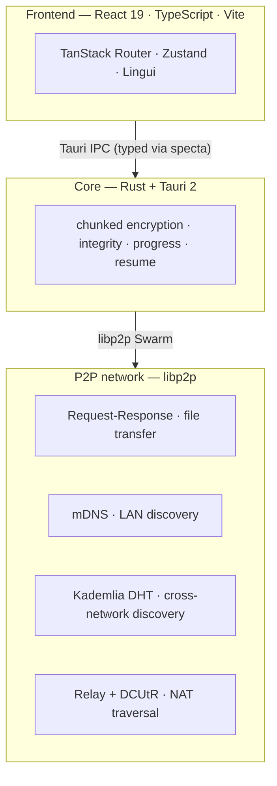

<div align="center">


# SwarmDrop

**The data channel between your devices — for humans and AI agents alike.**

Decentralized, cross-network, end-to-end encrypted file transfer.
No accounts. No servers. No cloud.

[](https://github.com/swarm-apps/SwarmDrop/releases)
[](LICENSE)
[](#download)
[](https://github.com/swarm-apps/SwarmDrop/stargazers)
[](https://tauri.app)
[](https://libp2p.io)

**[Website](https://swarm-apps.github.io/SwarmDrop/)** ·
**[Features](#features)** ·
**[AI & MCP](#built-for-ai-agents-mcp)** ·
**[Download](#download)** ·
**[Mobile](https://github.com/swarm-apps/SwarmDrop-RN)** ·
**[简体中文](README.zh-CN.md)**

</div>

---

## About

**SwarmDrop** takes the LocalSend experience and frees it from the local network: send files securely between **any** of your devices, across any network, with **only the sender and receiver able to decrypt** them. No account to create, no central server in the middle.

And because the AI era runs on agents that constantly produce files on one machine and need them on another, SwarmDrop ships a **built-in local MCP Server** — so AI agents can deliver files across your devices and search your inbox, turning device-to-device transfer into **programmable infrastructure** for humans and agents alike.

## Features

| | |
|---|---|
| **Cross-Network** | Works on LAN or across the public internet. mDNS + Kademlia DHT + Relay + DCUtR pick the best route automatically — same Wi-Fi, different networks, behind NAT. |
| **End-to-End Encrypted** | XChaCha20-Poly1305 with a fresh per-transfer key. Relays and bootstrap nodes only ever see ciphertext. Not a privacy *policy* — a cryptographic *fact*. |
| **No Accounts, No Servers** | Connect with a 6-digit pairing code or LAN auto-discovery. Decentralized Ed25519 device identity. Self-host the bootstrap node if you want. |
| **AI-Native** | A local MCP Server lets AI agents drive transfers and search your received files — the part no AirDrop or LocalSend can do. |
| **Resumable & Reliable** | Resumable transfers with BLAKE3 integrity, plus a local SQLite history and inbox. Survives drops, restarts, and flaky links. |

## Built for AI Agents (MCP)

Most local tools can only be *read* by an AI. SwarmDrop can be *driven* by one.

It runs an embedded [Model Context Protocol](https://modelcontextprotocol.io) server — bound strictly to `127.0.0.1`, opt-in, off by default — that any local MCP client (Claude Desktop, Cursor, Claude Code, VS Code …) can connect to. Through it, an agent can:

- **Check the network** — is the P2P node up, who's connected.
- **List devices** — your paired, online devices.
- **Deliver files** — send files to a device by natural-language request; the recipient still approves in-app.
- **Search the inbox** — find what you've received by keyword, then resolve the local file path.

Everything happens on-device and end-to-end encrypted — the agent's reasoning can live in the cloud, but your files and their contents never leave your machines.

> See the [MCP usage guide](src-tauri/docs/mcp-guide.md) to wire it into your agent.

## Download

**[Get SwarmDrop from the official website](https://swarm-apps.github.io/SwarmDrop/)** — desktop and mobile, every platform in one place.

| Platform | Format |
|---|---|
| **macOS** | `.dmg` (Apple Silicon · Intel) |
| **Windows** | `.msi` · `.exe` (x64) |
| **Linux** | `.deb` · `.rpm` · `.AppImage` (x64) |
| **Android** | `.apk` |
| **iOS** | build from source |

> Downloads and **automatic updates** — for both desktop *and* mobile — are served by [SwarmHive](https://github.com/swarm-apps/SwarmHive), our own open-source, self-hostable release server. No proprietary update SaaS in the loop.

> **Mobile** — SwarmDrop also runs on **Android & iOS** via [SwarmDrop-RN](https://github.com/swarm-apps/SwarmDrop-RN), a React Native app that shares the very same Rust core (`crates/core`) and encrypted protocol as the desktop app.

## Getting Started

```
1. Launch the app → set a security password → start the P2P node
2. Add a device → 6-digit pairing code  /  LAN auto-discovery
3. Pick a device → drag & drop files to send
```

**Pairing**

- **Pairing code** — for cross-network: one side generates a 6-digit code, the other enters it.
- **LAN** — on the same Wi-Fi, devices discover each other automatically; click to pair.

**Transfer paths** *(auto-selected, best first)*

| Route | Latency | When |
|---|---|---|
| Direct LAN | ~2 ms | same network |
| NAT hole-punch (DCUtR) | 10–100 ms | different networks, punch succeeds |
| Relay fallback | 100–500 ms | when hole-punching fails |

## Comparison

| | **SwarmDrop** | LocalSend | Syncthing |
|---|:---:|:---:|:---:|
| LAN transfer | ✓ | ✓ | ✓ |
| Cross-network (no shared network) | ✓ | — | ✓ <sub>(setup)</sub> |
| End-to-end encrypted | ✓ | ✓ | ✓ |
| No account / no server | ✓ | ✓ | ✓ |
| One-shot delivery (not continuous sync) | ✓ | ✓ | — |
| **AI agent-drivable (MCP)** | ✓ | — | — |
| Open source | ✓ | ✓ | ✓ |

## How It Works



**Security model**

- **Device identity** — Ed25519 keypair; the private key lives in an encrypted [Stronghold](https://docs.rs/iota-stronghold) vault.
- **Transfer keys** — a fresh 256-bit symmetric key per transfer (XChaCha20-Poly1305), held only in memory.
- **Zero trust** — bootstrap and relay nodes never see plaintext.
- **Biometric unlock** — Touch ID / Face ID / Windows Hello.
- **No telemetry** — no data collection, ever.

<details>
<summary><b>Privacy &amp; telemetry</b></summary>

<br>

SwarmDrop collects **nothing**. There is no analytics, no account, and no central server that handles your files. File contents are encrypted end-to-end and only ever exist in plaintext on the sending and receiving devices. The optional MCP server binds to `127.0.0.1` only and is off by default. The only infrastructure involved is bootstrap/relay nodes that help peers find each other and relay **ciphertext** when direct connection fails — you can self-host your own.

</details>

<details>
<summary><b>Tech stack</b></summary>

<br>

| Layer | Technology |
|---|---|
| Frontend | React 19 · TypeScript 5.8 · Vite 7 · Tailwind CSS 4 · shadcn/ui |
| State / Routing | Zustand 5 · TanStack Router |
| i18n | Lingui 5 (zh · zh-TW · en …) |
| Backend | Rust · Tauri 2 · SeaORM + SQLite |
| P2P | libp2p 0.56 (mDNS · Kademlia · Relay · DCUtR · request-response) |
| Security | Stronghold · Ed25519 · XChaCha20-Poly1305 · BLAKE3 |
| AI | embedded MCP server (rmcp + axum, `127.0.0.1` only) |
| IPC types | tauri-specta (commands & events, fully typed) |

</details>

<details>
<summary><b>Repository layout</b></summary>

<br>

```
SwarmDrop/
├── src/              # frontend (React + Vite)
├── src-tauri/        # desktop shell (Tauri command/event routing, MCP server)
├── crates/
│   ├── core/         # shared core: network / pairing / device / transfer / protocol / db
│   ├── entity/       # SeaORM entities
│   └── migration/    # SeaORM migrations
├── libs/core/        # swarm-p2p-core (git submodule)
└── docs/             # documentation site (Next.js + Fumadocs)
```

`crates/core` is shared by both the desktop app (`src-tauri`) and the mobile app
([SwarmDrop-RN](https://github.com/swarm-apps/SwarmDrop-RN)) via uniffi-bindgen-react-native.

</details>

## Building from Source

Requires **Node 18+**, **pnpm 9+**, and a recent stable **Rust** toolchain (1.85+).

```bash
git clone --recurse-submodules git@github.com:swarm-apps/SwarmDrop.git
cd SwarmDrop
pnpm install

pnpm tauri dev      # develop
pnpm tauri build    # package
```

> If you already cloned without submodules: `git submodule update --init --recursive`.

## Roadmap

- [x] P2P networking (libp2p · mDNS · DHT · Relay · DCUtR)
- [x] Device pairing (pairing code · LAN direct · biometric unlock)
- [x] File transfer (E2E encryption · live progress · history · resume)
- [x] MCP server — AI agents can send files & search the inbox
- [ ] Expanded agent toolset — full transfer lifecycle (status / cancel / pause / resume) over MCP
- [ ] On-device content extraction for richer inbox search

## Contributing

Issues and PRs welcome. A few conventions:

- [Conventional Commits](https://www.conventionalcommits.org) (`feat:` / `fix:` / `chore:` …).
- Before committing: `cargo fmt && cargo clippy` for Rust, `pnpm exec tsc --noEmit` for the frontend.
- IPC bindings (`src/lib/bindings.ts`) are **auto-generated** — don't hand-edit; run `pnpm tauri dev` to regenerate.
- **Translations** are managed with [Lingui](https://lingui.dev) (`pnpm i18n:extract`). New-language README contributions are welcome too — see [README.zh-CN.md](README.zh-CN.md) for the format.

## The swarm-apps Family

SwarmDrop is part of a family of decentralized, local-first, end-to-end encrypted tools:

- **SwarmDrop** — device-to-device file transfer. [Desktop](https://github.com/swarm-apps/SwarmDrop) · [Mobile](https://github.com/swarm-apps/SwarmDrop-RN)
- **SwarmNote** — decentralized, encrypted notes. [Desktop](https://github.com/swarm-apps/SwarmNote) · [Mobile](https://github.com/swarm-apps/SwarmNote-RN)
- **SwarmHive** — self-hostable, open-source release & auto-update server for Tauri and React Native apps. SwarmDrop ships every update through it — and so can you. [Repo](https://github.com/swarm-apps/SwarmHive)

## License

[MIT](LICENSE) © SwarmDrop Contributors

<div align="center"><sub>Built with <a href="https://tauri.app">Tauri</a> · <a href="https://libp2p.io">libp2p</a></sub></div>
