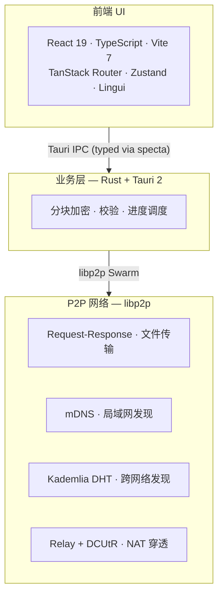

<div align="center">


# SwarmDrop

**去中心化、跨网络、端到端加密的文件传输工具**

*Drop files anywhere. No cloud. No limits.*

[](https://github.com/swarm-apps/SwarmDrop/releases)
[](LICENSE)
[](https://tauri.app)
[](https://libp2p.io)

[下载](#下载) · [快速开始](#快速开始) · [构建](#从源码构建) · [移动端](https://github.com/swarm-apps/SwarmDrop-RN)

</div>

---

SwarmDrop 是基于 libp2p 的 **P2P 文件传输应用**，把 LocalSend 的体验扩展到任意网络环境——
不限局域网、不要服务器、传输内容**只有收发双方能解密**。

<table>
<tr>
<td width="25%" align="center"><sub>🌐</sub><br><b>跨网络</b><br><sub>mDNS + DHT + DCUtR 自动选路</sub></td>
<td width="25%" align="center"><sub>🔒</sub><br><b>端到端加密</b><br><sub>XChaCha20-Poly1305<br>中继也不能解密</sub></td>
<td width="25%" align="center"><sub>🚀</sub><br><b>零配置</b><br><sub>不要账号<br>不要中央服务器</sub></td>
<td width="25%" align="center"><sub>📱</sub><br><b>全平台</b><br><sub>Win · macOS · Linux<br>Android (RN)</sub></td>
</tr>
</table>

### 与同类工具对比

| | LocalSend | Send Anywhere | **SwarmDrop** |
|---|---|---|---|
| 网络范围 | 仅局域网 | 跨网络（中转） | **跨网络（P2P）** |
| 服务器 | 无 | 有 | **无**（可自建引导节点） |
| 端到端加密 | — | — | **✓** |
| 开源 / 自托管 | ✓ / — | — / — | **✓ / ✓** |

## 下载

到 [Releases](https://github.com/swarm-apps/SwarmDrop/releases/latest) 选最新版：

| 平台 | 格式 |
|---|---|
| **Windows** | `.msi` · `.exe` (x64) |
| **macOS** | `.dmg` (Apple Silicon · Intel) |
| **Linux** | `.deb` · `.rpm` · `.AppImage` (x64) |
| **Android** | 见 [SwarmDrop-RN](https://github.com/swarm-apps/SwarmDrop-RN/releases) |

## 快速开始

```
1. 启动应用 → 设置安全密码 → 启动 P2P 节点
2. 添加设备 → 6 位配对码 / 局域网自动发现
3. 选择设备 → 拖拽文件发送
```

**配对方式**
- **配对码**：跨网络场景，一方生成 6 位数字码，对方输入即可
- **局域网**：同 Wi-Fi 自动发现对方，点击配对

**传输路径**（自动选优）

| 路径 | 延迟 | 触发条件 |
|---|---|---|
| 局域网直连 | ~2ms | 同一网络 |
| NAT 打洞 (DCUtR) | 10–100ms | 不同网络，打洞成功 |
| 中继转发 | 100–500ms | 打洞失败兜底 |

## 安全模型

- **设备身份**：Ed25519 密钥对，私钥落 [Stronghold](https://docs.rs/iota-stronghold) 加密保险库
- **传输密钥**：每次传输独立生成 256-bit 对称密钥，XChaCha20-Poly1305
- **零信任**：引导节点、中继节点都看不到明文
- **生物识别解锁**：TouchID / FaceID / Windows Hello
- **无遥测**：不收集任何用户数据

## 技术架构



<details>
<summary><b>技术栈</b></summary>

| 层 | 技术 |
|---|---|
| 前端 | React 19 · TypeScript 5.8 · Vite 7 · Tailwind CSS 4 · shadcn/ui |
| 状态 / 路由 | Zustand 5 · TanStack Router |
| i18n | Lingui 5 (zh · en · zh-TW) |
| 后端 | Rust 2024 · Tauri 2 · sea-orm |
| P2P | libp2p 0.56（mDNS · Kademlia · Relay · DCUtR · request-response） |
| 加密 | Stronghold · Ed25519 · XChaCha20-Poly1305 · BLAKE3 |
| IPC 类型 | tauri-specta（命令 / 事件双向 typed） |

</details>

<details>
<summary><b>仓库结构</b></summary>

```
SwarmDrop/
├── src/              # 前端（React + Vite）
├── src-tauri/        # 桌面 shell（Tauri command / event 路由）
├── crates/
│   ├── core/         # 双端共享：网络 / 配对 / 设备 / 传输 / 协议
│   ├── entity/       # SeaORM 实体
│   └── migration/    # SeaORM 迁移
├── libs/core/        # swarm-p2p-core（git submodule）
└── docs/             # Astro + Starlight 文档站
```

`crates/core` 同时被桌面 (`src-tauri`) 和移动端 ([SwarmDrop-RN](https://github.com/swarm-apps/SwarmDrop-RN))
通过 uniffi-bindgen-react-native 复用。

</details>

## 从源码构建

需要 Node 18+ · pnpm 9+ · Rust 1.80+。

```bash
git clone --recurse-submodules git@github.com:swarm-apps/SwarmDrop.git
cd SwarmDrop
pnpm install

pnpm tauri dev      # 开发
pnpm tauri build    # 打包
```

## 路线图

- [x] P2P 网络（libp2p · mDNS · DHT · Relay · DCUtR）
- [x] 设备配对（配对码 · 局域网直连 · 生物识别）
- [x] 文件传输（端到端加密 · 实时进度 · 历史记录）
- [ ] 断点续传
- [ ] MCP 集成（AI 助手发文件）

## 贡献

Issue / PR 欢迎。一些约定：

- Conventional Commits（`feat:` / `fix:` / `chore:` 等）
- 改完跑 `pnpm lint && pnpm typecheck`，Rust 部分 `cargo fmt && cargo clippy`
- 改了 IPC 命令 / 事件后跑测试自动生成 bindings.ts（`pnpm test`）

## License

[MIT](LICENSE) &copy; SwarmDrop Contributors

<div align="center"><sub>Built with <a href="https://tauri.app">Tauri</a> · <a href="https://libp2p.io">libp2p</a></sub></div>
