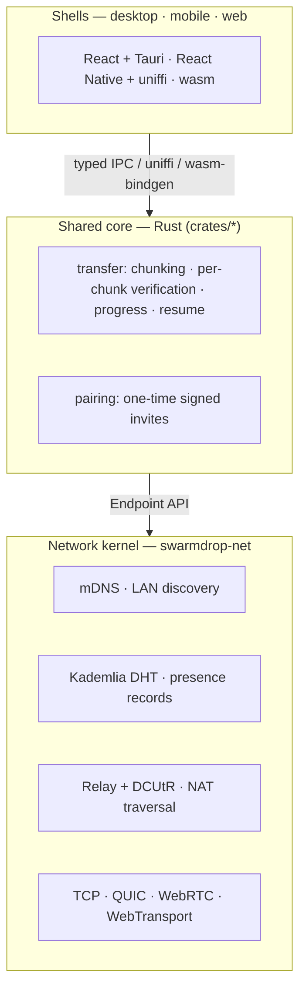

<div align="center">


# SwarmDrop

**Decentralized, cross-network, end-to-end encrypted file transfer.**

No accounts. No servers. No cloud.

[](https://github.com/swarm-apps/SwarmDrop/releases)
[](LICENSE)
[](#download)

[Website](https://swarm-apps.github.io/SwarmDrop/) · [简体中文](README.zh-CN.md)

</div>

---

## What it is

The LocalSend experience, freed from the local network: send files between **any** of
your devices, across any network, with only the sender and receiver able to decrypt
them. Nothing to sign up for, no central server in the middle.

It runs on desktop, Android and — with nothing to install — [in the browser](https://swarm-apps.github.io/SwarmDrop/app).
All three are real transfer endpoints backed by the same Rust core, not a full client
plus a companion web page.

It also runs a local MCP server, so AI agents can deliver files across your devices and
search what you've received.

> **Project status.** The core is feature-complete and has been stable for a while:
> cross-network transfer, pairing, resume, three clients, MCP. Current work is the
> finishing pass — aligning interaction across the three clients, edge-case copy, and
> converging the on-device links (cross-network especially). Bug reports and UX
> friction are exactly what's most useful right now.

## Features

- **Cross-network** — LAN or the public internet. mDNS, Kademlia DHT, relay and DCUtR
  hole-punching pick the route automatically.
- **End-to-end encrypted** — every connection is Noise- or TLS 1.3-encrypted and
  mutually authenticated. Relays only ever forward ciphertext they hold no key for.
- **No accounts, no servers** — pair with a one-time signed invite (link or QR), or let
  LAN discovery find your devices. Ed25519 device identity, held by the OS secure store on
  mobile and in an owner-only file on desktop.
- **Resumable** — per-chunk BLAKE3 verification via bao-tree; every block is checked as
  it lands. Survives drops, restarts and flaky links.
- **Runs in the browser** — the same core compiled to wasm. Pairing, transfer, resume and
  OPFS-backed storage, over WebRTC and WebTransport. No extension, no install.
- **AI-drivable** — an embedded MCP server exposes transfers and inbox search to agents.

## Download

[**Official site**](https://swarm-apps.github.io/SwarmDrop/) — every platform in one place.

| Platform | Format |
|---|---|
| macOS | `.dmg` (Apple Silicon · Intel) |
| Windows | `.msi` · `.exe` (x64) |
| Linux | `.deb` · `.rpm` · `.AppImage` (x64) |
| Android | `.apk` |
| Browser | [nothing to install](https://swarm-apps.github.io/SwarmDrop/app) — runs as wasm |
| iOS | build from source only<sup>†</sup> |

<sup>†</sup> iOS has no sideloading path: every build must be signed by Apple and tied to
a provisioning profile. Running it on your own device requires an Apple Developer
account, and there is currently no App Store or TestFlight release. The browser build
works on iOS Safari.

Downloads and automatic updates are served by
[SwarmHive](https://github.com/swarm-apps/SwarmHive) — our own open-source, self-hostable
release server. No proprietary update SaaS in the loop.

## Getting started

1. Launch the app, name the device, start the P2P node.
2. Add a device — share a one-time invite, or use LAN auto-discovery.
3. Pick a device and drop your files.

**Pairing.** Across networks, one side generates a one-time invite carrying an Ed25519
signature and a 24-hour TTL; it travels as a link or a QR code and can be used exactly
once. On the same Wi-Fi, devices discover each other automatically.

**Routing** is automatic, best route first:

| Route | Latency | When |
|---|---|---|
| Direct LAN | ~2 ms | same network |
| NAT hole-punch (DCUtR) | 10–100 ms | different networks, punch succeeds |
| Relay fallback | 100–500 ms | hole-punching fails |

## AI agents (MCP)

SwarmDrop embeds a [Model Context Protocol](https://modelcontextprotocol.io) server,
bound strictly to `127.0.0.1`, opt-in and off by default. Any local MCP client (Claude
Code, Claude Desktop, Cursor, VS Code …) can then check node status, list paired
devices, send files — the recipient still approves in-app — and search the inbox by
keyword.

The agent's reasoning may live in the cloud, but your files never leave your machines.
See the [MCP guide](src-tauri/docs/mcp-guide.md) to wire it up.

## How it works


```mermaid
graph TB
    subgraph Shells["Shells — desktop · mobile · web"]
        A["React + Tauri · React Native + uniffi · wasm"]
    end
    subgraph Core["Shared core — Rust (crates/*)"]
        B["transfer: chunking · per-chunk verification · progress · resume"]
        G["pairing: one-time signed invites"]
    end
    subgraph Net["Network kernel — swarmdrop-net"]
        D["mDNS · LAN discovery"]
        E["Kademlia DHT · presence records"]
        F["Relay + DCUtR · NAT traversal"]
        H["TCP · QUIC · WebRTC · WebTransport"]
    end
    Shells -- "typed IPC / uniffi / wasm-bindgen" --> Core
    Core -- "Endpoint API" --> Net
```

**Security model**

- **Identity** — Ed25519 keypair. On mobile the private key lives in the OS secure store
  (iOS Keychain / Android EncryptedSharedPreferences). On desktop it lives in an
  owner-only file (`0600` on unix) under the app data directory — same shape as a
  passphrase-less SSH key. It protects against other users, not against other processes
  running as you.
- **Pairing** — one-time signed invite: Ed25519 signature + 128-bit capability + 24h
  TTL. The capability rides in the URL fragment, so it never reaches a server.
- **In transit** — Noise (TCP / WebRTC) or TLS 1.3 (QUIC). Every connection runs its own
  handshake with fresh ephemeral keys, and both peers are authenticated by device identity.
- **Integrity** — the file's BLAKE3 hash is the bao-tree verification root; each chunk
  carries a proof and is verified on arrival.
- **Relays are blind** — peers complete their own end-to-end handshake *on top of* the
  relay's byte pipe, so a relay holds no key for what it forwards. Self-host your own if
  you prefer.
- **No telemetry** — nothing is collected, ever.

<details>
<summary><b>Tech stack</b></summary>

<br>

| Layer | Technology |
|---|---|
| Frontend | React 19 · TypeScript 5.8 · Vite 7 · Tailwind CSS 4 · shadcn/ui |
| State / Routing | Zustand 5 · TanStack Router |
| i18n | Lingui 6 (zh · zh-TW · en) + rust-i18n for native strings |
| Backend | Rust 2024 · Tauri 2 · SeaORM + SQLite |
| P2P | in-house `swarmdrop-net` — an iroh-style `Endpoint` API over libp2p (mDNS · Kademlia · Relay · DCUtR), native + wasm |
| Transports | TCP · QUIC · WebRTC (hole-punching + direct) · WebTransport — the last two are our own libp2p transports, written because upstream had gaps on both |
| Security | Ed25519 identity · Noise / TLS 1.3 · BLAKE3 + bao-tree |
| AI | embedded MCP server (rmcp + axum, `127.0.0.1` only) |
| IPC types | tauri-specta — commands and events, fully typed |

One Rust core in `crates/*` backs all three shells: desktop (`src-tauri`), mobile
(`mobile/`, via uniffi) and browser (`crates/web`, via wasm). `crates/core` carries no
`sea-orm` and `crates/transfer` no dependency on `core` — those boundaries are what keep
the wasm target compiling.

</details>

## Building from source

Requires **Node 20+**, **pnpm 9+** and **Rust 1.85+**. There are no git submodules — a
plain clone is enough.

```bash
git clone git@github.com:swarm-apps/SwarmDrop.git
cd SwarmDrop
pnpm install

pnpm tauri dev      # develop
pnpm tauri build    # package
```

## Roadmap

- [x] P2P networking — mDNS · DHT · relay · DCUtR
- [x] Device pairing — one-time signed invites · QR · LAN direct
- [x] File transfer — live progress, history, resume
- [x] MCP server — agents can send files and search the inbox
- [x] Mobile apps
- [x] Browser client (wasm) — a full node at [`/app`](https://swarm-apps.github.io/SwarmDrop/app): pairing, transfer, resume
- [ ] **Polish pass** — interaction parity across the three clients, edge-case states, on-device link convergence
- [ ] Cross-network throughput measured on real devices (LAN is; the relayed and hole-punched paths are not yet)
- [ ] Full transfer lifecycle over MCP — status · cancel · pause · resume
- [ ] On-device content extraction for richer inbox search

## Contributing

Issues and pull requests are welcome. [**CONTRIBUTING.md**](CONTRIBUTING.md) covers setup,
the pre-commit checks, and the conventions you can't infer from the code — the repo has
four separate pnpm workspaces and `src/lib/bindings.ts` is generated, to name two.

Participation is governed by our [Code of Conduct](CODE_OF_CONDUCT.md).

**Found a security issue?** Please use
[private vulnerability reporting](https://github.com/swarm-apps/SwarmDrop/security/advisories/new)
rather than a public issue. Scope and threat model are in [SECURITY.md](SECURITY.md).

## Related

- **SwarmHive** — self-hostable release & auto-update server for Tauri and React Native
  apps. SwarmDrop ships every update through it, and so can you.
  [Repo](https://github.com/swarm-apps/SwarmHive)
- **SwarmNote** — decentralized, encrypted notes. **No longer maintained**: the notes
  space is crowded enough that the effort is better spent here.
  [Desktop](https://github.com/swarm-apps/SwarmNote) · [Mobile](https://github.com/swarm-apps/SwarmNote-RN)

## Writing

- [Why a browser can do peer-to-peer file transfer](https://juejin.cn/post/7673332898415263785)
  (Chinese) — WebRTC, WebTransport and OPFS, and what it took to make the browser a real
  node. Source in [`dev-notes/blogs/three-clients-web/`](dev-notes/blogs/three-clients-web/README.md).
- [One Rust core, running on both Tauri and React Native](https://juejin.cn/post/7639930076302770216)
  (Chinese) — the architecture this project is built on.

## License

[MIT](LICENSE) © SwarmDrop Contributors
