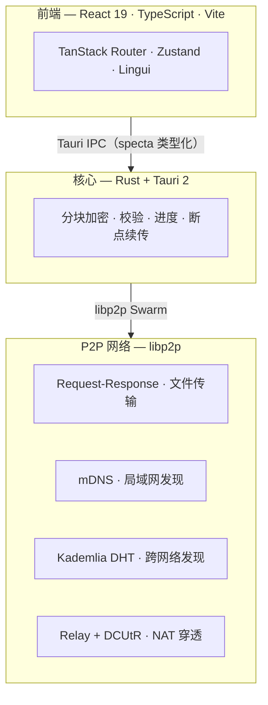

<div align="center">


# SwarmDrop

**你设备之间的数据通道 —— 同时面向人与 AI Agent。**

去中心化、跨网络、端到端加密的文件传输。
无账号、无服务器、无云。

[](https://github.com/swarm-apps/SwarmDrop/releases)
[](LICENSE)
[](#下载)
[](https://github.com/swarm-apps/SwarmDrop/stargazers)
[](https://tauri.app)
[](https://libp2p.io)

**[官网](https://swarm-apps.github.io/SwarmDrop/)** ·
**[特性](#特性)** ·
**[AI 与 MCP](#为-ai-agent-而生mcp)** ·
**[下载](#下载)** ·
**[移动端](mobile/)** ·
**[English](README.md)**

</div>

---

## 简介

**SwarmDrop** 把 LocalSend 的体验从局域网中解放出来：在你的**任意**设备之间、跨任意网络安全地传文件，且**只有收发双方能解密**。无需注册账号，中间也没有任何中央服务器。

而 AI 时代由 Agent 驱动 —— 它们不断在一台机器上产出文件，又需要把文件送到另一台。为此 SwarmDrop 内置了一个**本地 MCP Server**：让 AI Agent 能跨设备投递文件、检索你的收件箱，把设备间传输变成同时服务于人与 Agent 的**可编程基础设施**。

## 特性

| | |
|---|---|
| **跨网络** | 局域网或公网都行。mDNS + Kademlia DHT + Relay + DCUtR 自动选最优路径 —— 同 Wi-Fi、跨网络、NAT 之后都能连上。 |
| **端到端加密** | XChaCha20-Poly1305，每次传输独立密钥。中继与引导节点只见密文。这不是隐私*政策*，是密码学*事实*。 |
| **无账号、无服务器** | 6 位配对码或局域网自动发现即可连接，去中心化 Ed25519 设备身份。引导节点可自建。 |
| **AI 原生** | 本地 MCP Server 让 AI Agent 驱动传输、检索已收文件 —— AirDrop / LocalSend 做不到的那部分。 |
| **断点续传、可靠** | 断点续传 + BLAKE3 校验，本地 SQLite 历史与收件箱。掉线、重启、弱网都能扛。 |

## 为 AI Agent 而生（MCP）

大多数本地工具只能被 AI *读取*，SwarmDrop 能被 AI *驱动*。

它内置一个 [Model Context Protocol](https://modelcontextprotocol.io) Server —— 严格绑定 `127.0.0.1`、用户主动开启、默认关闭 —— 任何本地 MCP 客户端（Claude Desktop、Cursor、Claude Code、VS Code……）都能连上。通过它，Agent 可以：

- **查看网络** —— P2P 节点是否运行、谁已连接。
- **列出设备** —— 已配对且在线的设备。
- **投递文件** —— 用自然语言把文件发给某台设备；接收方仍需在应用内确认。
- **检索收件箱** —— 按关键词找到收到过的文件，并解析出本地路径。

一切都在端上、端到端加密地发生 —— Agent 的推理可以在云端，但你的文件及其内容永不离开你的设备。

> 接入方式见 [MCP 使用指南](src-tauri/docs/mcp-guide.md)。

## 下载

**[前往官网下载](https://swarm-apps.github.io/SwarmDrop/)** —— 桌面与移动端，全平台一站获取。

| 平台 | 格式 |
|---|---|
| **macOS** | `.dmg`（Apple Silicon · Intel） |
| **Windows** | `.msi` · `.exe` (x64) |
| **Linux** | `.deb` · `.rpm` · `.AppImage` (x64) |
| **Android** | `.apk` |
| **iOS** | 源码构建 |

> 下载与**自动更新**（桌面*和*移动端）均由 [SwarmHive](https://github.com/swarm-apps/SwarmHive) 提供 —— 我们自研、可自托管的开源发布与更新服务，全程不依赖任何商业更新 SaaS。

> **移动端** —— SwarmDrop 也通过 `mobile/` 运行在 **Android 与 iOS** 上，它与桌面端共享同一份 Rust core（`crates/core`）和加密协议。

## 快速开始

```
1. 启动应用 → 设置安全密码 → 启动 P2P 节点
2. 添加设备 → 6 位配对码  /  局域网自动发现
3. 选择设备 → 拖拽文件发送
```

**配对方式**

- **配对码** —— 跨网络场景：一方生成 6 位数字码，对方输入即可。
- **局域网** —— 同一 Wi-Fi 下自动发现，点击配对。

**传输路径** *（自动选优，优先靠前）*

| 路径 | 延迟 | 触发条件 |
|---|---|---|
| 局域网直连 | ~2 ms | 同一网络 |
| NAT 打洞（DCUtR） | 10–100 ms | 不同网络，打洞成功 |
| 中继转发 | 100–500 ms | 打洞失败兜底 |

## 对比

| | **SwarmDrop** | LocalSend | Syncthing |
|---|:---:|:---:|:---:|
| 局域网传输 | ✓ | ✓ | ✓ |
| 跨网络（无需同网） | ✓ | — | ✓ <sub>(需配置)</sub> |
| 端到端加密 | ✓ | ✓ | ✓ |
| 无账号 / 无服务器 | ✓ | ✓ | ✓ |
| 一次性投递（非持续同步） | ✓ | ✓ | — |
| **AI Agent 可驱动（MCP）** | ✓ | — | — |
| 开源 | ✓ | ✓ | ✓ |

## 工作原理



**安全模型**

- **设备身份** —— Ed25519 密钥对，私钥落在加密的 [Stronghold](https://docs.rs/iota-stronghold) 保险库。
- **传输密钥** —— 每次传输独立生成 256-bit 对称密钥（XChaCha20-Poly1305），仅存内存。
- **零信任** —— 引导节点、中继节点都看不到明文。
- **生物识别解锁** —— Touch ID / Face ID / Windows Hello。
- **无遥测** —— 不收集任何用户数据。

<details>
<summary><b>隐私与遥测</b></summary>

<br>

SwarmDrop **不收集任何数据**：无分析统计、无账号、没有任何中央服务器经手你的文件。文件内容端到端加密，明文只在收发两端存在。可选的 MCP server 仅绑定 `127.0.0.1` 且默认关闭。唯一涉及的基础设施是帮助节点互相发现、并在直连失败时转发**密文**的引导 / 中继节点 —— 你可以自建。

</details>

<details>
<summary><b>技术栈</b></summary>

<br>

| 层 | 技术 |
|---|---|
| 前端 | React 19 · TypeScript 5.8 · Vite 7 · Tailwind CSS 4 · shadcn/ui |
| 状态 / 路由 | Zustand 5 · TanStack Router |
| i18n | Lingui 5（zh · zh-TW · en……） |
| 后端 | Rust · Tauri 2 · SeaORM + SQLite |
| P2P | libp2p 0.56（mDNS · Kademlia · Relay · DCUtR · request-response） |
| 安全 | Stronghold · Ed25519 · XChaCha20-Poly1305 · BLAKE3 |
| AI | 内置 MCP server（rmcp + axum，仅 `127.0.0.1`） |
| IPC 类型 | tauri-specta（命令与事件双向类型化） |

</details>

<details>
<summary><b>仓库结构</b></summary>

<br>

```
SwarmDrop/
├── src/              # 前端（React + Vite）
├── src-tauri/        # 桌面壳（Tauri command/event 路由、MCP server）
├── crates/
│   ├── core/         # 双端共享核心：网络 / 配对 / 设备 / 传输 / 协议 / 数据库
│   ├── entity/       # SeaORM 实体
│   └── migration/    # SeaORM 迁移
├── libs/core/        # swarm-p2p-core（git submodule）
└── docs/             # 文档站（Next.js + Fumadocs）
```

`crates/core` 同时被桌面端（`src-tauri`）与移动端
（`mobile/`）通过 uniffi-bindgen-react-native 复用。

</details>

## 从源码构建

需要 **Node 18+**、**pnpm 9+** 以及较新的稳定版 **Rust**（1.85+）。

```bash
git clone --recurse-submodules git@github.com:swarm-apps/SwarmDrop.git
cd SwarmDrop
pnpm install

pnpm tauri dev      # 开发
pnpm tauri build    # 打包
```

> 若已克隆但未拉取子模块：`git submodule update --init --recursive`。

## 路线图

- [x] P2P 网络（libp2p · mDNS · DHT · Relay · DCUtR）
- [x] 设备配对（配对码 · 局域网直连 · 生物识别）
- [x] 文件传输（端到端加密 · 实时进度 · 历史 · 断点续传）
- [x] MCP Server —— AI Agent 可发文件、检索收件箱
- [ ] 扩展 Agent 工具集 —— 通过 MCP 驱动完整传输生命周期（状态 / 取消 / 暂停 / 恢复）
- [ ] 端上内容抽取，强化收件箱检索

## 贡献

欢迎 Issue 与 PR。一些约定：

- [Conventional Commits](https://www.conventionalcommits.org)（`feat:` / `fix:` / `chore:` 等）。
- 提交前：Rust 跑 `cargo fmt && cargo clippy`，前端跑 `pnpm exec tsc --noEmit`。
- IPC 绑定（`src/lib/bindings.ts`）是**自动生成**的 —— 不要手改；跑一次 `pnpm tauri dev` 重新生成。
- **翻译**用 [Lingui](https://lingui.dev) 管理（`pnpm i18n:extract`）。也欢迎贡献新语言的 README —— 格式参照本文件。

## swarm-apps 家族

SwarmDrop 是一系列去中心化、本地优先、端到端加密工具中的一员：

- **SwarmDrop** —— 设备间文件传输，桌面与移动同仓。[仓库](https://github.com/swarm-apps/SwarmDrop)
- **SwarmNote** —— 去中心化的加密笔记。[桌面端](https://github.com/swarm-apps/SwarmNote) · [移动端](https://github.com/swarm-apps/SwarmNote-RN)
- **SwarmHive** —— 可自托管的开源发布与自动更新服务，支持 Tauri 与 React Native 应用。SwarmDrop 自身的每次更新都走它 —— 你的应用也可以。[仓库](https://github.com/swarm-apps/SwarmHive)

## 许可证

[MIT](LICENSE) © SwarmDrop Contributors

<div align="center"><sub>Built with <a href="https://tauri.app">Tauri</a> · <a href="https://libp2p.io">libp2p</a></sub></div>
