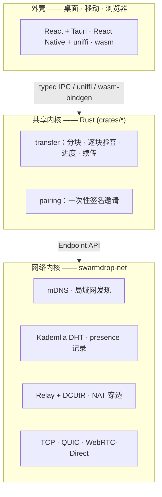

<div align="center">


# SwarmDrop

**去中心化、跨网络、端到端加密的文件传输。**

无账号，无服务器，无云。

[](https://github.com/swarm-apps/SwarmDrop/releases)
[](LICENSE)
[](#下载)

[官网](https://swarm-apps.github.io/SwarmDrop/) · [English](README.md)

</div>

---

## 这是什么

把 LocalSend 的体验从局域网里解放出来：在你的**任意**设备之间、跨任意网络传文件，且只有收发双方能解密。不用注册，中间也没有任何中央服务器。

它还内置一个本地 MCP Server，AI Agent 因此可以跨设备投递文件、检索你收到过的东西。

## 特性

- **跨网络** —— 局域网或公网都行。mDNS、Kademlia DHT、中继与 DCUtR 打洞自动选路。
- **端到端加密** —— 每条连接都经 Noise 或 TLS 1.3 加密并双向鉴权，中继只转发它没有密钥的密文。
- **无账号、无服务器** —— 用一次性签名邀请（链接或二维码）配对，或让局域网自动发现设备。
  Ed25519 设备身份存放在系统钥匙串里。
- **断点续传** —— BLAKE3 + bao-tree 逐块验签，每块收到即验。掉线、重启、弱网都能扛。
- **可被 Agent 驱动** —— 内置 MCP Server 把传输与收件箱检索开放给 AI Agent。

## 下载

[**前往官网**](https://swarm-apps.github.io/SwarmDrop/) —— 全平台一站获取。

| 平台 | 格式 |
|---|---|
| macOS | `.dmg`（Apple Silicon · Intel） |
| Windows | `.msi` · `.exe` (x64) |
| Linux | `.deb` · `.rpm` · `.AppImage` (x64) |
| Android | `.apk` |
| 浏览器 | [无需安装](https://swarm-apps.github.io/SwarmDrop/app) —— 以 wasm 运行 |
| iOS | 仅能自行构建<sup>†</sup> |

<sup>†</sup> iOS 没有侧载途径：任何构建都必须由 Apple 签名并绑定 provisioning profile。装到自己
设备上需要 Apple 开发者账号，目前也没有 App Store 或 TestFlight 版本。浏览器版在 iOS Safari
上可以正常使用。

> 下载与自动更新由 [SwarmHive](https://github.com/swarm-apps/SwarmHive) 提供 —— 我们自研、
> 可自托管的开源发布服务，全程不依赖商业更新 SaaS。

## 快速开始

1. 启动应用，为本机命名，启动 P2P 节点。
2. 添加设备 —— 分享一次性邀请，或用局域网自动发现。
3. 选中设备，把文件拖进去。

**配对。** 跨网络时由一方生成一次性邀请，它带有 Ed25519 签名和 24 小时有效期，以链接或二维码
形式传递，且只能使用一次。同一 Wi-Fi 下设备会自动发现彼此。

**选路**是自动的，best route first：

| 路径 | 延迟 | 何时走 |
|---|---|---|
| 局域网直连 | ~2 ms | 同一网络 |
| NAT 打洞（DCUtR） | 10–100 ms | 跨网络且打洞成功 |
| 中继兜底 | 100–500 ms | 打洞失败 |

## AI Agent（MCP）

SwarmDrop 内置一个 [Model Context Protocol](https://modelcontextprotocol.io) Server，严格绑定
`127.0.0.1`，需主动开启、默认关闭。任何本地 MCP 客户端（Claude Code、Claude Desktop、Cursor、
VS Code……）连上之后，就能查看节点状态、列出已配对设备、发送文件（接收方仍需在应用内确认）、
以及按关键词检索收件箱。

Agent 的推理可以在云端，但你的文件不会离开你的设备。接入方式见
[MCP 使用指南](src-tauri/docs/mcp-guide.md)。

## 工作原理


```mermaid
graph TB
    subgraph Shells["外壳 —— 桌面 · 移动 · 浏览器"]
        A["React + Tauri · React Native + uniffi · wasm"]
    end
    subgraph Core["共享内核 —— Rust (crates/*)"]
        B["transfer：分块 · 逐块验签 · 进度 · 续传"]
        G["pairing：一次性签名邀请"]
    end
    subgraph Net["网络内核 —— swarmdrop-net"]
        D["mDNS · 局域网发现"]
        E["Kademlia DHT · presence 记录"]
        F["Relay + DCUtR · NAT 穿透"]
        H["TCP · QUIC · WebRTC-Direct"]
    end
    Shells -- "typed IPC / uniffi / wasm-bindgen" --> Core
    Core -- "Endpoint API" --> Net
```

**安全模型**

- **设备身份** —— Ed25519 密钥对，私钥交给系统钥匙串（Keychain / 凭据管理器 / Secret Service）。
- **配对** —— 一次性签名邀请：Ed25519 签名 + 128 位凭证 + 24 小时有效期。凭证放在 URL fragment
  里，因此永远不会到达服务器。
- **传输加密** —— Noise（TCP / WebRTC）或 TLS 1.3（QUIC）。每条连接各自握手、使用全新临时密钥，
  双方都由设备身份完成鉴权。
- **完整性** —— 文件的 BLAKE3 哈希即 bao-tree 的验证根，每块都带证明并在抵达时校验。
- **中继是瞎的** —— 双方在中继的字节管道**之上**完成自己的端到端握手，中继对转发的内容没有密钥。
  你也可以自建。
- **无遥测** —— 不收集任何数据。

<details>
<summary><b>技术栈</b></summary>

<br>

| 层 | 技术 |
|---|---|
| 前端 | React 19 · TypeScript 5.8 · Vite 7 · Tailwind CSS 4 · shadcn/ui |
| 状态 / 路由 | Zustand 5 · TanStack Router |
| 国际化 | Lingui 6（zh · zh-TW · en）+ rust-i18n（原生串） |
| 后端 | Rust 2024 · Tauri 2 · SeaORM + SQLite |
| P2P | 自研 `swarmdrop-net` —— libp2p 之上的 iroh 风格 `Endpoint` API（mDNS · Kademlia · Relay · DCUtR · WebRTC-Direct），native + wasm 双 target |
| 安全 | 系统钥匙串 · Ed25519 · Noise / TLS 1.3 · BLAKE3 + bao-tree |
| AI | 内置 MCP Server（rmcp + axum，仅 `127.0.0.1`） |
| IPC 类型 | tauri-specta —— 命令与事件全类型化 |

`crates/*` 这一份 Rust 内核支撑三端外壳：桌面（`src-tauri`）、移动（`mobile/`，经 uniffi）与
浏览器（`crates/web`，经 wasm）。`crates/core` 零 sea-orm、`crates/transfer` 零 core 依赖 ——
正是这两条边界让 wasm target 编得过。

</details>

## 从源码构建

需要 **Node 20+**、**pnpm 9+** 和 **Rust 1.85+**。没有 git submodule，直接 clone 即可。

```bash
git clone git@github.com:swarm-apps/SwarmDrop.git
cd SwarmDrop
pnpm install

pnpm tauri dev      # 开发
pnpm tauri build    # 打包
```

## 路线图

- [x] P2P 网络 —— mDNS · DHT · 中继 · DCUtR
- [x] 设备配对 —— 一次性签名邀请 · 二维码 · 局域网直连
- [x] 文件传输 —— 实时进度、历史、断点续传
- [x] MCP Server —— Agent 可发文件、检索收件箱
- [x] 移动端
- [ ] 浏览器端（wasm）—— [`/app`](https://swarm-apps.github.io/SwarmDrop/app) 已可用，仍在收敛
- [ ] MCP 覆盖完整传输生命周期 —— 状态 · 取消 · 暂停 · 恢复
- [ ] 端上内容提取，让收件箱检索更强

## 参与贡献

欢迎提 Issue 和 PR。[**CONTRIBUTING.md**](CONTRIBUTING.md) 写了环境搭建、提交前的门禁清单，
以及那些看代码看不出来的约定 —— 比如本仓有四个彼此独立的 pnpm workspace，
以及 `src/lib/bindings.ts` 是自动生成的。

参与本项目需遵守[行为准则](CODE_OF_CONDUCT.md)。

**发现安全问题？** 请走
[私密漏洞报告](https://github.com/swarm-apps/SwarmDrop/security/advisories/new)，
不要开公开 Issue。适用范围与威胁模型见 [SECURITY.md](SECURITY.md)。

## 相关项目

- **SwarmNote** —— 去中心化的加密笔记。
  [桌面端](https://github.com/swarm-apps/SwarmNote) · [移动端](https://github.com/swarm-apps/SwarmNote-RN)
- **SwarmHive** —— 面向 Tauri 与 React Native 应用的可自托管开源发布与更新服务。
  SwarmDrop 自己的每次更新都走它，你也可以。
  [仓库](https://github.com/swarm-apps/SwarmHive)

## 许可证

[MIT](LICENSE) © SwarmDrop Contributors
