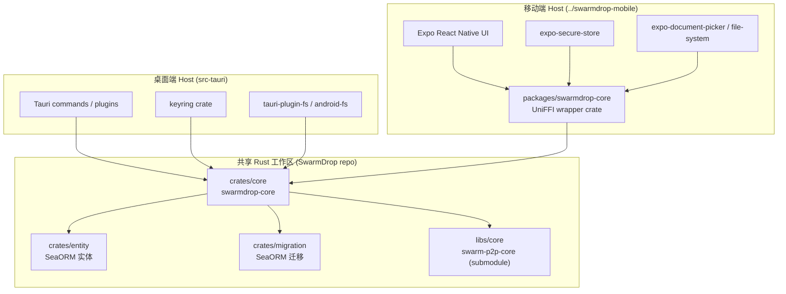

# Core / Desktop / Mobile 架构边界

本文档对应 OpenSpec 变更 `extract-core-and-add-rn-mobile`，说明 core 抽离后 SwarmDrop 的整体架构边界。所有新增功能在落地前都应先回答：**这是 core 共享逻辑，还是 host 适配？**

## 总览

## 各 crate 的职责

| Crate | 职责 | 不允许包含 |
| --- | --- | --- |
| `crates/core` (`swarmdrop-core`) | P2P 节点管理、配对、传输、设备模型、身份模型、数据库操作、协议类型 | `tauri::*`, `expo::*`, `uniffi::*`, 平台路径 / IO 直接调用 |
| `crates/entity` | SeaORM 实体定义 | 业务逻辑 |
| `crates/migration` | SeaORM 迁移 | 任何运行时业务代码 |
| `src-tauri` | Tauri commands、Tauri 插件初始化、桌面 Host trait 实现、updater/MCP | 共享业务逻辑（应推回 core） |
| `../swarmdrop-mobile/packages/swarmdrop-core/rust/mobile-core` | UniFFI wrapper，types/records/enums 投影，callback trait 桥接 | core 业务逻辑 |
| `../swarmdrop-mobile/src` | Expo Router / Zustand UI、移动端 Host trait 实现 | 业务规则（应通过 bridge 调用 core） |

## Host Traits（边界点）

所有平台相关的能力都通过 trait 注入 core：

| Trait | 桌面实现 (`src-tauri/src/host/*`) | 移动实现 (`../swarmdrop-mobile/src/core/*`) |
| --- | --- | --- |
| `KeychainProvider` | `keyring` crate（macOS Keychain / Windows Credential Manager / Linux Secret Service） | `expo-secure-store`（iOS Keychain / Android Keystore） |
| `EventBus` | Tauri Channel + emit | `ForeignEventBus` → JSI 回调 → Zustand stores |
| `AppPaths` | `tauri::path::*` | `expo-file-system` `Paths` API |
| `FileAccess` | 本地文件系统 + Android SAF (tauri-plugin-android-fs) | `expo-document-picker` + 文档目录 |
| `Notifier` | `tauri-plugin-notification` | `expo-notifications` |
| `UpdateInstaller` | Tauri updater + UpgradeLink | no-op（移动商店发布走自家流程） |

## 不允许跨界的事项

- **不允许在 core 中直接 `use tauri::*` 或拉取 Tauri 类型**。即使 desktop 是当前唯一的成熟 host，也必须通过 trait 解耦。
- **不允许在 RN/Expo 代码中重写业务逻辑**。如果某段逻辑桌面端已经在 core 实现，移动端必须通过 UniFFI bridge 调用，禁止 JS 复制实现。
- **不允许 wrapper crate (`mobile-core`) 向回依赖 RN 包**。它只能依赖 `swarmdrop-core` 和 UniFFI。
- **不允许 UniFFI 注解出现在 `swarmdrop-core`**。所有 `#[uniffi::export]` 都集中在 `mobile-core` wrapper。

## 加新功能时的判断流程

1. **业务规则？** → 进 `swarmdrop-core`
2. **平台能力？** → 抽 / 复用 host trait，桌面与移动各自实现
3. **UI / 路由？** → 桌面进 `src/`，移动进 `../swarmdrop-mobile/src/`
4. **数据库 schema？** → 进 `crates/entity` 和 `crates/migration`

## 相关文档

- [Core 抽离盘点](../archive/recon-2026-07/core-extraction-inventory.md)
- [Rust 工作区命令](../build/rust-workspace.md)
- [文件传输设计](../archive/pre-refactor-design/file-transfer-design.md)
