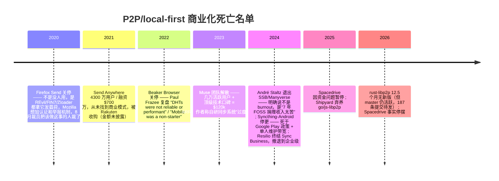
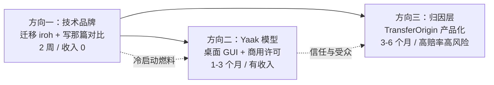

# SwarmDrop 方向调研最终报告

> ## ⚠️ 校正说明（2026-07-16，报告生成后当天补）
>
> 这份报告由一个 44 agent 的 workflow 生成。事后核实发现三处错误，已在正文中就地修正，此处汇总备查。**读正文前先读这一节。**
>
> **校正 1 — 输入数据错误（我的错，污染了全部 44 个 agent）**
> 我在扫描代码库时跑的是 `crates/core/src`、`src-tauri/src`、`libs/core/src` 三个目录的**合计**行数（24,941），却当作 `crates/core` 一家的数字喂给了所有 agent。真实数字：
>
> | 目录 | 行数 |
> |---|---|
> | crates/core/src | **13,992** |
> | src-tauri/src | 6,085 |
> | libs/core/src | 4,864 |
>
> 一个可行性评委自己去数了代码把这个错误抓了出来。影响：所有"复用 60-75%"的估算分母虚高。评委实测后的真实值是**网络侧可原样搬约 3.5k 行**（pairing 364 + network 1,329 + identity 238 + device_manager 311 + presence 882 + infra 402），约 **25-30%**。而 `transfer/` 那 6,789 行在几乎所有候选方向里都用不上。
>
> **校正 2 — "0 个扛住证伪"是错的，Kill 阶段根本没跑**
> workflow 设了门槛：综合分 ≥6.0 且最低分 ≥3.5 才进入对抗性证伪。7 个候选**全部卡在门口**，所以没有任何方向被真正证伪过。实际数据：26 张评委票，**最高 6.5 分，仅 1 张 ≥6 分，平均 3.42/10**（另有 2 张可行性票因格式错误失败）。
> 这个更正不是好消息、反而更硬：不是一个反方辩手杀死了它们，是 4 个独立的、带联网核查的评委把 7 个方向平均打到了 3.42 分。但措辞必须准确——**它们死于评分，不是死于证伪**。
>
> **校正 3 — "libp2p 正在塌"是夸大的（我转述了 agent 的措辞，没自己去看提交记录）**
> GitHub API 实测（2026-07-16）：
> - 自 v0.56.0 以来 master 已累积 **187 条提交、300 个文件变更**，只是没发版
> - 近五个月提交量：3月 22、4月 20、5月 34、6月 19、7月 5 条——稳定活跃
> - 2026-07-13 落地的是 `feat(swarm): smart dialing`，**功能开发，不是依赖 bump**
> - 近 100 条提交剔除 dependabot 后仍有 51 条实质改动，来自 12 个真人（João Oliveira 22 条、Daniel Knopik 11 条 + 长尾）
>
> 正确画像是**"活着，但发布卡住了，维护核心薄"**，不是"正在塌"。真实风险不是"会死"，而是"**那 187 个提交你够不着**"——要么挂 git 依赖，要么 fork。
> **这个更正实质动摇了第五节"下周一迁 iroh"的建议**，见该节的修订说明。

**结论先行：调研跑完 8 路情报、24 个候选方向之后，7 个通过去重的方向没有一个拿到及格分（26 张评委票平均 3.42/10，最高 6.5）——包括你和我都最想相信的那些。这份报告最诚实的交付物不是"做这个"，而是一个必须先接受的事实：你手里 crates/core 那 13,992 行 Rust 里最硬的那部分（libp2p DCUtR 打洞 + relay + 分块传输），在 2026 年的市场价格是 0。不是低，是 0。Tailscale 免费送、iroh `cargo add` 三行、Anthropic 和 OpenAI 各自的 MCP 隧道免费送。任何以"我能打洞"为承重结构的方向，都在第一条 HN 评论里死于"为什么不用 Tailscale"。**

所以这份报告推荐的三个方向，全部建立在一个反直觉的重新定位上：**把 P2P 当成实现细节藏起来，把你真正稀缺的东西——两年生产环境跑通全套 libp2p 栈的经验、6 位码引荐的产品洞察、`TransferOrigin::{Human, Mcp}` 这个全行业独一份的数据模型——拿出来卖。** 而且必须接受：这三个方向里，最可能赚到钱的那个几乎不用 crates/core，最能复用 crates/core 的那个几乎赚不到钱。这个错配本身就是结论。

---

## 一、先看清地形：三张必须内化的事实

在讲方向之前，有三条情报会重写你的整个判断框架。如果你只读这份报告的一部分，读这一节。

### 1.1 iroh 抢走了增量，但 libp2p 没有塌 —— 本节已按实测重写

> **本节原标题是"你的护城河已经被填平了"，原文断言 libp2p"正在塌"、"你 pin 的版本是 HEAD"。后一句是事实错误，已重写。见顶部校正 3。**

iroh 1.0 于 2026-06-15 发布，HN 1,398 分 / 462 评论。它的团队第一版（beetle）就是基于 rust-libp2p 的完整 IPFS 节点，然后他们把 libp2p 整个扔了重写。iroh 开发者 karissa 亲口确认："folks who made iroh worked on libp2p first, but found many limitations in libp2p's design"。

**但"libp2p 正在塌"是错的。** GitHub API 实测（2026-07-16）：master 自 v0.56.0 以来已累积 **187 条提交、300 个文件变更**；近五个月提交量稳定在每月约 20 条；三天前刚落地 `feat(swarm): smart dialing`——是功能开发。剔除 dependabot 后近 100 条里仍有 51 条实质改动，来自 12 个真人。

所以准确的说法是：**rust-libp2p 活着，但发布卡住了，维护核心薄。** 0.56.0 停在 2025-06-27，到今天 12.5 个月没发版（此前节奏 5-6 个月一发），而 João Oliveira 一人扛了近期 22 条提交、Daniel Knopik 11 条，剩下是长尾——bus factor 确实低。生态侧的资金压力是真的：Protocol Labs 的 anchor funding 2025 年底到期，Interplanetary Shipyard 已在 2025-08 宣布放弃 go-libp2p 和 js-libp2p 的维护（原文："Recent resourcing challenges have made it increasingly difficult to dedicate the people and funding required"）。

**对 SwarmDrop 的真实风险因此不是"地基会塌"，而是"那 187 个提交你够不着"**——撞上一个已在 master 修好的 bug 时，只能挂 git 依赖或 fork。这是可管理的，且**本身不构成迁移理由**。

对照数据（实测，2026-07-16）：

| | rust-libp2p | iroh |
|---|---|---|
| GitHub stars | 5,578 | 11,755 |
| 仓库创建 | 2017-03-24 | 2022-03-14 |
| 最新 crates.io 版本 | 0.56.0 (2025-06-27) | 1.0.2 (2026-07-06) |
| master 未发版提交 | **187 条** | — |
| 近 5 个月提交/月 | ~20 条（稳定） | 活跃 |
| crates.io 累计下载 | 17.1M | 1.18M |
| 近 90 天下载 | 2.27M（占累计 13%） | 633k（**占累计 54%**） |

**libp2p 是存量大盘（以太坊/Filecoin/Polkadot 锁定），iroh 是增量曲线。** 这个结论仍然成立——它讲的是动能分布，不是生死。而 Spacedrive——那个和你架构逐条同构的项目——已经迁到 iroh 了。

**关于"当初选 libp2p 是不是错了"：不是。** SwarmDrop 首个 commit 是 2026-01-29，而 iroh 0.96.0 发布于 2026-01-28——你开工那天它刚发版，pre-1.0、无 wire protocol 稳定性承诺。当时的信息下选 libp2p 是正确决定。

**关于迁移的真实症结（比"谁更好"重要得多）：** 你实际只用了 libp2p 约 5%（Kademlia 当 rendezvous + Relay + DCUtR + mDNS），所以迁移主要是删代码——**但那 5% 恰好是 iroh 故意不提供的**。iroh 的发现键控在节点自身公钥上（DNS 签名记录 + Mainline DHT BEP 44），给不了"指定任意 key 去 put/get"这个自由度，而这正是 `share_code_key(code) = SHA256("/swarmdrop/share-code/" || code)` 赖以存在的能力。一句话：**iroh 在你用 libp2p 的 95% 上更好，在你真正依赖的 5% 上什么都不给。**

### 1.2 Spacedrive 是你的镜子，而它已经停摆了

这条我必须直说，因为它是整份调研里对你冲击最大的一条。

spacedriveapp/spacedrive：38,579 stars、拿了 $2M（OSS Capital、Naval Ravikant、Tobias Lütke、Tom Preston-Werner 背书）、最后 commit 2026-04-19（停滞 3 个月）、4 年多仍停在 v2.0.0-alpha.2、**从未发布 1.0**。2025-03 因资金问题暂停开发。License 已改为 FSL-1.1-ALv2（source-available，非 OSI 开源）。

它的架构，逐条对比你的：

| Spacedrive | SwarmDrop |
|---|---|
| 纯 Rust core (VDFS) | crates/core (13,992 行) |
| Tauri 桌面 | Tauri v2 桌面 |
| React Native / Expo 移动 | SwarmDrop-RN (RN + Expo) |
| SeaORM | SeaORM 2.0 |
| Specta 生成 TS/Swift 类型 | specta |
| BLAKE3 内容哈希 | blake3 |
| P2P（已从 libp2p 迁到 iroh） | libp2p 0.56 |

而它现在的 README 定位是什么？"Sync via P2P. Keep AI agents safe with built-in screening"、"AI-ready by design"、"route AI and automation through structured APIs, permissions, and processing layers instead of direct file operations"。

**它抢先一步喊出了你正在考虑的同一个定位，然后停摆了。** 它的 v3 发布帖在 HN 只有 8 分 0 评论，而 2023 年那篇有 348 分——同一个团队、同一个方向，注意力塌缩了 40 倍。

我的判断是：Spacedrive 死于范围过大（文件管理器 + 云盘 + 索引 + AI 全都要），这是你的机会而非纯粹的坏消息。但你必须能一句话回答"为什么我不是 Spacedrive"，而且这个答案不能是"我范围更小"——那是过程，不是结果。

### 1.3 这个品类的商业化是一片焦土，且有完整的死亡名单

我按时间线排一遍，你会看到一个极其一致的模式：



三条最锋利的对照数据：

- **Plausible 的对照实验**：开源后 6 个月只收到 **6 笔 $5 捐赠**，同期云服务 MRR 从 $400 涨到 $8,500+。官方结论原文："donations are not a viable monetization method"。
- **Immich 的荣誉制许可**：公告 **285 踩 vs 134 赞**，最高赞评论是"Tf is this bro just put a donation link somewhere"。而且 Immich 敢这么玩的唯一原因是 FUTO 在给核心团队发工资——这个前提在所有讨论里几乎从未被提及。
- **HN 上 505 分的《Why haven't local-first apps become popular?》**，最高票诊断（用户 api）："**it is not an engineering problem.** ... Cloud SaaS is both unbreakable DRM and an impossible to evade subscription model. ... **The billing system is the tail that wags the dog.**"

结论很硬：**P2P/local-first 天然反订阅——没有服务器就没有 DRM，没有 DRM 就没有"不付费就断供"的杠杆。** 这解释了为什么这个领域全是"捐赠 → 作者退出"的循环。

André Staltz 的退出声明是最该被你逐字读一遍的东西："I wouldn't describe this as burnout. Working on PPPPP has been low-stress, and the technical challenges are actually fun." 真正原因是"7 years of FOSS donation income is tough, and for this year I want to earn what the industry usually pays for people in my skill range"。

**杀死 P2P 项目的不是技术难度，是作者的机会成本。** 这对你——一个能同时驾驭 libp2p 协议层、Tauri、RN、终端的人——是比任何技术风险都更该正视的一条。你的机会成本很高。

---

## 二、推荐方向

我推荐三个，但要先说清楚它们的关系，因为这个关系本身就是策略：



**方向一不是生意，是燃料。** 情报里有一条被反复验证的因果：Yaak 能靠 $79/年 活着的前提是作者是 Insomnia 创始人、自带信任与受众。你现在没有这个。所以"开源影响力 + 商业化双轮"不是并列关系，是**因果关系**——影响力先行，它是商业化的冷启动条件。这一点必须先说清楚，否则后面两个方向的排序看起来会很反直觉。

---

### 方向一：迁移到 iroh，并写下那篇全世界只有十个人能写的对比

**（这不是产品，是 2 周的技术品牌动作 + 基建卫生。但它是另外两个方向的前置条件。）**

#### 它是什么

两件事，捆在一起做：

1. **把 crates/core 的传输层从 libp2p 迁到 iroh。** 这大概率是**净减代码**——砍掉 `network/` 里的 config/manager/event_loop/candidates 约 1.2k 行的 mDNS/Kad/Relay/DCUtR/AutoNAT 装配，换来 QUIC multipath 和 1.0 的 wire protocol 稳定性承诺。保留你真正的资产：配对语义、收件箱、断点续传 checkpoint、host 抽象层、`TransferOrigin`。

2. **写这篇文章**：
   > *"I ran libp2p's full DCUtR stack in production for two years. Then I deleted it for iroh. Here's the honest comparison n0 never wrote."*

#### 为什么现在成立

HN 用户 mhluongo（前 libp2p 用户）在 iroh 1.0 那个 1,398 分的帖子里公开求过这篇文章：

> "As someone who has historically built on libp2p, I'd love to see an updated comparison focused on app developers! Last year, I was trying to choose between the two and went with what I know... but it feels like there's real momentum on Iroh's side."

n0 至今没写。他们唯一那篇《Comparing Iroh & Libp2p》是 **2024-01-05** 的老文，而且对自己的打洞成功率**刻意没给数字**。

全世界能写这篇文章的人——同时在生产环境跑过 libp2p 全套（mDNS/Kad/Relay/DCUtR/AutoNAT）**并且**真的评估过迁移成本的——不超过十个。你是其中之一。成本接近零，因为迁移过程本身就是素材。

而且这篇文章有一个别人写不出的杀手锏：**你可以给出同一套上层业务逻辑在两个传输层下的真实对比**，包括代码行数、打洞成功率（你有生产遥测）、以及那些不写在文档里的坑。这不是评测，是尸检报告。

#### 为什么这条比"发布产品"分数高

情报里有一条极其反直觉的规律：**在成熟品类里，唱衰帖和复盘帖的分数系统性高于发布帖。**

- local-first 的最高分不是任何一个 local-first 产品，而是《Why haven't local-first apps become popular?》——505 分 / 485 评论。
- MCP 的最高分不是任何 MCP server，而是《Supabase MCP can leak your entire SQL database》（848 分）和《The S in MCP Stands for Security》（730 分）。
- 而基于 iroh 做的 LocalSend 替代品（alt-sendme）上过两次 HN：**2 分和 4 分**。

同一批人、同一周、同一技术。**HN 奖励的是"让别人能做决策的东西"，不是"造好的东西"。**

#### 谁付钱

没人。这条明确不赚钱，别自欺欺人。它的产出是：一次 300-800 分的 HN 曝光、一批认识你名字的 Rust/P2P 开发者、以及后面两个方向的冷启动燃料。

#### 最大的风险和对冲

**风险**：n0 的人（karissa、dignifiedquire 常年混 HN）出来说"我们从没声称过 90%"——如果你的文章建立在打脸那个数字上，会当场变成打稻草人。

**对冲**：**不要把文章的支点放在"iroh 吹牛"上**。情报核实过：那个广为流传的"iroh 90% vs libp2p 70%"是**不对称比较**——70% 来自同行评议的 440 万次实测（Trautwein et al., arXiv 2604.12484），而 90% 在 iroh 的任何一手来源里都找不到，全是 SEO 农场补上的。

把支点放在"迁移的真实体验和代价"上，姿态是**同行分享**而不是 gotcha。这样 n0 的人出现只会给你背书，不会拆你台。顺便你还可以顺手澄清那个 90% 的来源问题——**作为服务而不是攻击**，这反而是加分项。

---

### 方向二：cc-switch 象限 —— Tauri + Rust + agent 工具链的桌面 GUI，走 Yaak 的商用许可模型

**（这是三个方向里唯一有已验证收入模型的。也是最不需要你的 P2P 资产的。这个矛盾是真实的，我不粉饰。）**

#### 为什么先讲这个象限，而不是直接给产品

因为这条的证据强度是全场最高的，而且它证明的东西会改变你的选题标准。

**farion1231/cc-switch**：117,647 stars、7,871 forks、创建于 **2025-08-04**（11 个月）、MIT、Rust + Tauri，topics 含 "tauri"、"rust"、"mcp"、"openclaw"。它是什么？**给 AI CLI 工具做配置/供应商切换的桌面 GUI。** 技术含量远低于你的 libp2p 协议栈。

同期 Tauri star 榜：clash-verge-rev 131,778、rustdesk 118,331、jan 43,587、screenpipe 20,113 (YC S26)、yaak 18,865。

**cc-switch 赢不是靠协议创新，是靠"精准戳中 agent 用户的日常痛点"。** 你的技术深度远超它，但它的选题嗅觉值得抄。

而商业模板是现成的——**Yaak (mountain-loop/yaak)**：18,865 stars、Tauri、**MIT 开源**，定价是 Individual Annual $79/年 / Individual Lifetime $349 / Business $149/用户/年（含 SSO），自述"100% bootstrapped, indie project"。**不需要 SaaS 后端**——这与你的无服务器定位天然兼容，也绕开了 local-first 那个"没有 DRM 就没有杠杆"的死结（许可证是社会契约层的 DRM，不是技术层的）。

#### 具体做什么

我不给你一个具体产品名，因为**选题必须由你在方向一的过程中观察得出**——这是这条路径的关键。但我给出选题的三个硬约束，它们是从整份情报里反推出来的：

1. **必须是 CLI + bash 干不了的事。** HN 上对 MCP 最有杀伤力的批评是 the_mitsuhiko 的"Give it a file system and bash in a sandbox and you have a capable system"，而且这个批评有真实共识。MCP 唯一守得住的阵地只有两条：**跨信任边界的 OAuth 授权**，和 **审批门 / 审计日志 / 人在环**（aschuth 的论点）。凡是 `curl | sh` 能替代的，做了就是白做。

2. **必须跨 agent 厂商中立。** Claude Code 占 coding-agent 讨论份额 75%，但 Codex CLI 有 500 万周活、OpenCode 有 800 万月活。只做 Claude Code 插件会丢掉一半以上市场。而且平台风险是已发生两次的事实——2026 年 Anthropic 和 Google 都封杀过用订阅额度跑第三方 harness（HN 1,099 分和 802 分），Anthropic 甚至一度对提及 "OpenClaw" 的 commit 拒绝服务（1,349 分）。**MCP 是唯一的中立接入面**，而它已于 2025-12-09 捐给 Linux Foundation 旗下的 Agentic AI Foundation（AWS/Google/Microsoft/OpenAI/Cloudflare/Bloomberg 白金创始成员）——押 MCP 不再是押某一家公司。

3. **必须是"用 Rust 重写成小/快/安全的基础设施"，不是"写 agent 逻辑"。** Rust 在 agent 领域的位置已经清晰：zeroclaw 5 个月 32,275 stars、ironclaw 12,522 stars，全是把跑通的 TS 概念重写成 Rust 基础设施。这正好是你的能力画像。

#### 谁付钱、怎么定价

直接抄 Yaak 的锚点，这是已验证的价格带：

| 档位 | 价格 | 说明 |
|---|---|---|
| 免费 | $0 | 仅限个人非商用，全功能 |
| Individual Annual | $79/年 | 含 lifetime fallback |
| Individual Lifetime | $349 | 一次性 |
| Business | $149/用户/年 | 含 SSO |

**关键的许可决策，从第一天就定死，写进 README**：用 **AGPL + 商用需另购授权**。理由是双重证伪过的——Redis 2024 转 SSPL、2025-05 灰溜溜退回 AGPLv3（创始人原话："SSPL, in practical terms, failed to be accepted by the community"），代价是催生了拿到 AWS 和 Google 支持的 Valkey 分叉；Elastic 2024-08 早一步退回 AGPL。**绝不要"先宽松吸引用户、再收紧"**——你的体量下一次分叉就等于项目死亡。

同时把"什么永远免费"一次性钉死。反面教材是 Tailscale 2026 定价 v4 的反弹（HN item 47691281），典型评论："build immense goodwill with developer-friendly terms, embed yourself as a deep infrastructure dependency, and then aggressively squeeze the margins"。单人项目经不起一次定价反噬。

#### 1-3 个月的 MVP 切到哪

- **第 1 个月**：方向一的迁移 + 文章。同时在这个过程里，**观察你自己每天用 Claude Code / Codex 时最烦的那件事**——这是选题的唯一可靠来源，不是市场调研。
- **第 2 个月**：把那个痛点做成 Tauri 桌面 GUI，范围小到能一句话说清。cc-switch 的范围是"切换 API 供应商配置"，就这么小。
- **第 3 个月**：AGPL 开源 + 商用许可页 + Show HN。

#### 能复用 crates/core 的哪些部分

**诚实的答案：可能一行都用不上。**

这就是那个矛盾。cc-switch 的技术栈和你重合的部分是 **Tauri + Rust + shadcn + specta**——是壳，不是核。你的 host 抽象层（keychain/notifier/paths/event_bus）可能有用，你的 SeaORM + SQLite 持久化可能有用，仅此而已。

但请注意这个反直觉的重估：**你的 Tauri + Rust + specta + shadcn + i18n 的桌面工程能力本身就是资产**，而且是被 117k star 验证过的那种资产。你一直把它当成"壳"，市场把它当成产品。

同时，1Password 和 Bitwarden 的架构佐证了另一件事：你的 host.rs 平台抽象层设计是对的（1Password 的 foundation crate、Bitwarden 的 Rust SDK 都是同构）。它在未来任何方向里都能复用——只是不在这个方向里承重。

#### Show HN 怎么设计

2026 年的爆款公式已经收敛，而且证据链很硬：

| 帖子 | 分数 |
|---|---|
| Claude Code sends 33k tokens before reading the prompt; OpenCode sends 7k | 699 |
| MCP server that reduces Claude Code context consumption by 98% | 570 |
| What xAI's Grok build CLI sends to xAI: A wire-level analysis | 534 |
| Semble: Code search for agents that uses 98% fewer tokens than grep | 445 |
| Getting GLM 5.2 running on my slow computer | 931 |

**公式是：约束 + 可测量的 delta + 标题里有数字。**

反面同样清晰——"隐私"这个词在标题里是**大约 5 倍的分数惩罚**：Ichinichi (E2E encrypted, local-first) 136 分、Bramble 153 分、Off Grid 124 分、Local Privacy Firewall 111 分。而同样是本地跑，说"27B 跑在手机上"= 679 分。**用户想要的是炫技和省钱，不是免于监控。**

所以：标题里放数字，隐私降级成副产品，绝不出现"decentralized"、"P2P"、"encrypted"这些词。

Show HN 的经济学也要算清楚（danfking 对 188,000 条 Show HN 的 14 年分析）：约 **1.4 star/upvote**、**24 小时半衰期**、**48 小时后 92% 结束**、HN 分数只解释 **8%** 的 star 方差、评论数与 star 相关性只有 r=0.10。一次 500 分的爆款 ≈ 700 stars，两天内耗尽。**它是脉冲不是引擎**，别把它当 go-to-market 的全部。

发帖时间：两个独立大样本（157k 和 188k 条）都收敛到**周日晚美东 / 周一 00:00 UTC**，而不是人人都在传的"周二到周四早上"。但这两个来源本身可能是 SEO 内容，按 medium 置信度使用。

#### 最大的风险和对冲

**风险 1：选题撞车。** 这个赛道节奏极快——zeroclaw 5 个月冒出 32k star。你花 2 个月做的东西可能在第 3 周被人抢发。

**对冲**：选题必须来自你自己的日常痛点 + 你的独特能力交集。别人抢发的是"想法"，抢不走的是"你两年 libp2p 生产经验 + Tauri 工程力"这个组合能做而他们做不好的那一版。

**风险 2：Yaak 的成功前提你没有。** Gregory Schier 是 Insomnia 创始人，自带信任和受众。

**对冲**：这正是方向一存在的理由。**顺序不能反。**

**风险 3：平台吞噬。** 12 个月内 Gemini CLI 关停换闭源 Antigravity、Cursor 被 SpaceX 以 $60B 收购、Windsurf 被卖。任何深度绑定单一 CLI 的产品都在流沙上。

**对冲**：以 MCP 为接入面（Linux Foundation 中立标准），不做任何单一 CLI 的插件。

---

### 方向三：归因层 —— 把 `TransferOrigin::{Human, Mcp{client}}` 变成产品

**（这是唯一一个"你已有的资产 = 别人公认的最大难点"的重合点。也是赔率最高、风险最大、最不该在第 1 个月做的那个。）**

#### 为什么这条值得单列

整份情报里有一条重合，八路调研里有六路独立指向了它：

- **[agent-protocols]**：MCP 唯一守得住、CLI 攻不破的阵地只有两条——跨信任边界的 OAuth 授权，和审批门/审计日志/人在环。而 Identiverse 2026 的定调是："Authentication is largely solved; **authorization is not**"，OAuth scope 回答不了"whether a specific agent, acting for a specific user, may call a specific tool with specific arguments"。
- **[p2p-infra]**：Tailscale 的整个 AI 融资叙事（Aperture）就是"给 agent 上身份与审计"——他们在 API 层做了，**在数据传输层没人做**。
- **[commercial-validation]**：MCP 变现全行业公认"**计量（meter/去重/分工具费率/汇总成一张发票）才是最难的部分，付款反而不是**"。
- **[viral-mechanics]**：授权疲劳有真实共情（一个 60 秒吐槽游戏拿了 386 分），CSA 出了 Agentic Trust Framework，AgentMail 拿了 YC 投资（169 分）。
- **[terminal-tools]**：开发者的第一大真实抱怨是 token 烧钱——人均 $400-1,500/月，某客户单人长周末烧掉 $4,200，"**Re-sent context is 62% of the bill**"。
- **[graveyard]**：ElectricSQL——local-first 基础设施的旗手——已经把域名从 electric-sql.com 改成 **electric.ax**，README slogan 变成 "The agent platform built on sync"，**并且不再自称 local-first**。

最后这条是最重要的：**你 protocol.rs 里那个 `TransferOrigin::{Human, Mcp{client}}` 不是超前赌注，是恰好踩在整个行业同时转向的那个点上。** 你只是自己没意识到这是共识而不是赌注。

而 Local-First Conf 2026 刚在柏林开完（2026-07-12~14，就在几天前），议程一半是 AI/agent 议题：《Agents on the canvas》(tldraw)、《Plaintext-first apps in the age of agents》、Armin Ronacher《Reflections on building cloud and local hybrid machine entities》。**local-first 没有赢，它是被 AI 收编了。** 你可以毫无心理负担地把这套技术重新叙述为"Agent 时代的设备间数据通道"。

#### 具体做什么

**先做测量，不做产品。** 这个顺序是从证据里推出来的，不是保守。

第一步是一篇文章 + 一个开源工具：

> **"I instrumented every byte an AI agent moved on my machine for 30 days. 62% of my Claude bill was context I'd already sent."**

工具形态：一个本地 hook + SQLite 账本，记录每一次"字节离开这台机器"——谁发起的（Human / Mcp{client}）、什么时候、哪个文件、去了哪。**这一版一行 crates/core 都不需要**，也不需要 P2P。它就是一个 hook + 一个数据库 + 一篇有数字的文章。

如果这篇文章拿到 400+ 分（按上表的规律，"我测量了 X，结果是 N%" 这个矿脉现在正热且门槛低），你就有了需求验证。**然后**才考虑把它扩展成跨设备的归因层——那时 crates/core 才开始承重。

#### 为什么必须这个顺序

因为对抗性证伪已经把"直接做产品"这条路杀干净了。这个形状的东西被实测过至少八次，全部躺平：

| 项目 | HN 分数 |
|---|---|
| MCP Gateway – Zero-Trust Access to MCP Tool Servers | 4 |
| Claw – Let your AI agent operate any machine as if it were local | 2 |
| Ariadne – Let your cloud AI agent use your local Chrome | 2 |
| ZTM: Privacy-first P2P solution for OpenClaw and local LLMs | 1 |
| Browser Terminal Use – A Local-to-Cloud Execution Bridge | 1 |
| Making remote MCP servers handle local files | 1 |
| AgentAnycast（libp2p + DCUtR + relay + A2A + MCP 全套） | **80 stars 后死亡** |

**八个项目、中位数 2 分、零个例外。** 这不是"还没人讲好故事"，是"反复讲了没人听"。

AgentAnycast 这条尤其要看清楚：**它用和 SwarmDrop 几乎逐条对应的技术栈**（libp2p host / Noise_XX / AutoNAT / DCUtR 打洞 / Circuit Relay v2 / A2A 引擎 / MCP server）实现过了，代码是真的、能跑。结果 80 stars、1 个贡献者、37 次 commit、2026-03-27 后停摆。作者已放弃并用 Rust 重写（hermes-keryx，0 stars）。

**技术不是瓶颈，需求才是。** 你的技术优势解决不了这个问题，因为 AgentAnycast 死掉的原因不是代码写不出来。

所以：先用一篇零成本的测量文章验证需求，验证不了就停手。这一步的最大价值是它**便宜**。

#### 谁付钱

这是最弱的一环，必须诚实标注。

MCP 生态目前是"2 万+ 供给、**不到 5% 赚过一美元**"的状态，$5-15/月的价格带完全是空的（现状是 $0 或 $19-149），唯一的成功样本（21st.dev Magic MCP 称 6 周破 $10k MRR）是**创始人自称、第三方明确标注 unverified**。

如果测量文章验证了需求，可能的付费形态是团队档（多人视图、保留期、导出、按 agent 的限额策略）。但要清醒：这本质是企业 IAM 生意，而 Google Agent Gateway / Okta / Auth0 / WorkOS / Stytch / Kong / Aembit 都在猛攻这块。**单人 1-3 个月切不进企业 IAM。**

所以这条的现实定位是：**高赔率彩票 + 确定性的技术品牌**。文章一定要写（成本几乎为零），产品要等信号。

#### 能复用 crates/core 的哪些部分

第一版（测量）：**几乎为零**。SeaORM 持久化 + `TransferOrigin` 的数据模型思路。

第二版（跨设备归因，仅在验证后）：这时 crates/core 才真的承重——设备身份（Ed25519）、配对、传输通道、host 抽象全部用上。但请注意，**即使到这一步，P2P 也不是承重结构**：一个 E2E 加密的哑中继在密码学上同样成立（不可伪造性来自密钥位置，不来自网络拓扑）。P2P 是你的成本优势和叙事，不是你的安全论证。

#### 最大的风险和对冲

**风险：这个方向的"必须 P2P"论证在密码学上是错的，而你可能会不自觉地依赖它。**

对抗性证伪抓到过这个错误：签名对 action hash、验证方用 pinned 公钥验，**中继能审查但不能伪造**。所以"经过服务器则服务器能伪造"是错的。

**对冲**：不要把 P2P 当卖点，把它当成本结构。Tailscale 免费层慷慨的真正原因就是这个——P2P 数据面意味着免费用户的字节从不经过你的带宽账单，控制面"可扩展 100 倍才需担心成本"。**你无意中已经具备了完全相同的成本结构**，这才是 P2P 在你手里的真实价值。

---

## 三、被杀死的方向，以及点名的竞品

这一节可能比推荐更有价值。以下每一条都不要碰。

### 3.1 「跨网络版 LocalSend」——被 85k stars 和一条 4 分的帖子封死

**竞品点名**：
- **LocalSend** — 85,368 stars、仍在高度活跃（2026-07-16 还在推），只做局域网
- **Blip**（Resilio 出品）— 跨网络、无大小限制、数据不落服务器，**个人/教育/公益永久免费，商业 $25/月**
- **Syncthing** — 86,415 stars
- **croc** 35,566、**magic-wormhole** 22,716

三条致命证据：

1. **《Show HN: LocalSend Alternative Built with Iroh》拿了 4 分 0 评论**（2025-11-01），同一项目另一次上 HN 拿 2 分。用了当红的 iroh 也激不起任何水花。
2. **n0 官方的 sendme（基于 iroh 的传文件工具）只有 1,103 stars**，而 iroh 本体有 11,754。即使背靠 1,398 分的 HN 热度，传文件工具依然无人问津。
3. **LocalSend 那条 923 分的 HN 热帖里**，用户最大的抱怨正是 SwarmDrop 已经解决的"必须在同一局域网"——但同一批用户对 10€/月 的反应是"**Hmm - no**"。

**技术优势和付费意愿在这里精确地错开了。** 而且"跨网"这个功能差距不是护城河——LocalSend 接个 iroh 就能补上。

### 3.2 「Ferry / 大文件交付工具」——Blip 已经以更低价占着，且定价故事被 NAT 物理定律击穿

即使换个垂直（影视后期），也不行：

- **Blip 今天就是 $25/月 商用不限量**，比你能开的价还低，而且是 Resilio 出品（10 年 P2P 积累 + M&E 品牌）。所谓"固定月费不限量，SaaS 跟不进"的定价创新**并不存在**。
- **"不碰你的字节所以不按 GB 收费"只对打洞成功的 70% 成立**（arXiv 2604.12484，440 万次实测，DCUtR 条件成功率 70% ± 7.1%）。失败的 30% 恰好集中在企业网络里，而 `libs/core/src/config.rs:31` 已设 `max_circuit_bytes: u64::MAX`——一次中继的 2TB 交付 ≈ $220 出网费砸在你单台阿里云上，对应 $29/月不限量。
- **Adobe 已经把 Frame.io Camera to Cloud 捆进 Creative Cloud All Apps 白送**，旗舰用例（片场 dailies → 剪辑）在你动手之前就被杀过一轮了。
- **收件方必须装 app 且在线**——而 MASV 的核心护城河恰恰是"对方点链接零安装"。这在 P2P 架构里无解，且决定成交的正是收件侧。

### 3.3 「手机即 MCP server」——被免费开源和 Apple 同时夹击

- **sweetrb/apple-photos-mcp** 等多个免费开源 MCP server 已经让 Claude 直接搜 macOS 照片库——对 iPhone + Mac + iCloud 用户（Claude Code 人群的绝大多数）**那就是他们的手机相册**。你的 30 秒 demo 免费就能跑，代价只是 10 秒同步延迟。
- **9to5Mac 2025-09-22 从 iOS 26 / macOS Tahoe 26.1 beta 代码里发现 Apple 正在把 MCP 集成进 App Intents**，系统级暴露 app 能力给 ChatGPT/Claude。而 Photos.app 是 Apple 自家的 Intents 提供者。一旦发布，"agent 看见我手机的照片"变成免费系统能力。
- 已死样本：**PhonePi 1 分、Mirroir 1 分、Joey 2 分、Palmier 7 分**；GitHub 上 **iPhone-mcp 85 stars 已停摆、phone-mcp 239 stars 已停摆**。
- 100% 收入压在 App Store 审核（相册 + 相机 + 后台网络三件套叠满）——**正是杀死 Syncthing-Android 的那道闸门**。

### 3.4 「MCP 隧道 / 房卡 / 远程 MCP 接入」——Anthropic 和 OpenAI 亲手堵上了，Cloudflare 还在免费送

- **Anthropic MCP Tunnels**（research preview）：cloudflared 出站隧道 + 自研 proxy + 三层安全。
- **OpenAI Secure MCP Tunnel**（2026-06-26）：出站 HTTPS + long-polling，隧道客户端开源。
- **Cloudflare Access 免费档**：前 50 用户 + 邮箱 OTP + 15 分钟~1 个月 session + 认证审计日志 + 官方"Third Party Access / 承包商"落地页——把"过期 + 外部访客零 IdP + 审计日志 + 一键撤销"全部白送了。
- **magic-wormhole 早在 2016 年就用短码 + SPAKE2 + rendezvous mailbox 解决了引荐问题**（22.7k stars，crates.io 有现成 Rust crate），croc 35.5k stars 同理。而 SwarmDrop 的 DHT rendezvous **比它们的 mailbox 更慢更不可靠**。
- **MCP 的 enterprise-managed authorization（ID-JAG / RFC 8693）已于 2026-06 稳定**——"跨信任边界的 scoped + 可过期授权"正在被规范本身吸收。

顺带一个必须知道的安全问题：我读过你的 `crates/core/src/dht_key.rs` 和 `pairing/manager.rs`：

```rust
share_code_key(code) = SHA256("/swarmdrop/share-code/" || code)   // 10^6 空间
let record = client.get_record(share_code_key(code)).await?.record;
let peer_id = record.publisher.ok_or(AppError::InvalidCode)?;     // 无条件信任第一条返回的 record
```

100 万条 SHA256 彩虹表可预计算，把整个码空间枚举一遍——ShareCodeRecord 里直接带着 listen_addrs + OsInfo，等于公开列出所有在线会话及其拨号地址。更致命的是开放 Kademlia 不认证谁能在某个 key 下 put，攻击者地毯式 put 覆盖全部 10^6 key 即可成为任意码的 provider。在文件传输里这只是骚扰（对面还要显式 accept 一个 offer），**但任何往"远程执行/远程能力"方向的扩展都会把它变成会话劫持**。这不是项目杀手（可修），但它是"把配对原语原样复用到 agent 场景"这条路的硬否定。

### 3.5 「Ghosthand / 让云端 agent 用你本地已登录的 Chrome」——两半都已被平台免费发货

- **Google 的 `chrome-devtools-mcp --autoConnect`**（Chrome M144 内置，附权限弹窗，MCP 形态天然中立）
- **Anthropic 的 Claude in Chrome**（官方文案："shares your browser's login state"）
- **OpenClaw Browser Relay** 免费扩展官方就支持 remote CDP relay server
- **Kimi WebBridge** 是模型厂商自己出的免费扩展，兼容 Claude Code/Cursor

而且 P2P 在这个场景是**负资产**：KB 级延迟敏感指令流 + 出站受限沙箱，正确解是出站 WebSocket 到中继，打洞纯属白加 30% 失败率。你 crates/core 那 13,992 行里所有硬资产（transfer 6,789 行 / 断点续传 / 分块 / blake3）一行都用不上。

### 3.6 「手机审批 agent 越权」——Anthropic 2026-02 就上线了，社区版 3 分钟装完

- **Anthropic Remote Control**（2026-02）官方原话："Permission prompts come to your device — you decide what runs"。
- 社区版 **claude-push / claude-remote-approver / claude-ntfy-hook**：60 行 bash + 免费 ntfy.sh，**3 分钟装完**。
- **Anthropic 2026-07-07 刚给 Cowork 发了官方手机审批。**
- 市场对这个的定价已经公开挂出来了：同款 Show HN **5 分 / 2 条评论**；HN 上"手机批准 Claude Code"已有 **12 个 Show HN、最高 39 分、中位数 3 分**（含一个"P2P + 手机 + agent"的逐条同构样本 = 4 分）。
- 而且 iOS 上 **Ed25519 根本不能常驻 Secure Enclave**（只支持 P-256），任何"指纹签名"的 headline 密码学声明物理上不成立。

### 3.7 「分布式本地推理」——物理定律不允许

exo（46k stars）已实质死亡（近 5 周 0 commit，社区定性为 VC rugpull），留下 46k star 的信任真空。但别去填：

Mesh LLM 贡献者 i386 原话："This was done on my home lab **simulating 5ms latency and jitter**... Splits work quite well if your nodes are over WAN at **metro latency's** but not super fast on global WAN."

**推理切分要求低延迟同城/同局域网——此时根本不需要打洞。** DCUtR 的价值在于跨越 NAT 连接远端，而这个场景恰恰不需要。技术资产与需求形状完全错配。而且 Mesh LLM 5 天前刚拿了 345 分抢跑，单人 1-3 个月做不出 skippy 那样的模型切分引擎。

### 3.8 「A2A 相关的任何东西」——27:1 的用量差距

我直接查了 PyPI/npm 官方 API（2026-07-16 实测）：

| 包 | 月下载 |
|---|---|
| PyPI `mcp` | 297,524,026 |
| PyPI `fastmcp` | 97,764,506 |
| npm `@modelcontextprotocol/sdk` | 169,915,530 |
| **MCP 合计** | **≈ 4.67 亿/月** |
| PyPI `a2a-sdk` | 11,368,236 |
| npm `@a2a-js/sdk` | 5,609,794 |
| **A2A 合计** | **≈ 1.7 千万/月** |

**MCP : A2A ≈ 27 : 1。** 而 GitHub stars 是反过来的——a2aproject/A2A 有 24,803 stars，modelcontextprotocol 只有 8,605。

HN 上的真实评价（item 48582679）："The lack of widespread adoption suggests that A2A is not really solving a real-world problem, compared to MCP"；"I still don't get a2a but you probably have to work at Google or something to see this as the solution"。

**押 MCP，不要碰 A2A。**

---

## 四、最反直觉的六条发现

这六条是真正改变判断的东西，其余都是细节。

**1. GitHub stars 在 2026 年已经和真实使用量脱钩，甚至反向。** A2A 的 stars 是 MCP 规范仓库的 3 倍，用量却只有 1/27。OpenClaw 有 383k stars（48 小时破 10 万，据称超过 React 和 Linux 的增速），但 HN 的《Ask HN: Who is using OpenClaw?》（342 分/383 评论）里主流意见是"manufactured bot hype"、"0 utility"——楼主原话："I don't use it personally, and neither does anyone in my circle...even though I feel like I'm super plugged into the ai world"。**如果你的目标之一是"开源影响力"，必须极其小心地区分"刷到 star"和"真的有人用"——这两件事已经完全脱钩。**

**2. 基础设施拿走全部注意力，跑在它上面的 app 一分不值。** iroh 1.0 拿 1,398 分，用 iroh 做的文件传输 app（alt-sendme）拿 2 分和 4 分。同一批人、同一周、同一技术。连"An iroh powered smart fan"（一个智能风扇）都拿了 167 分。**HN 奖励的是"让别人能造东西的东西"。**

**3. P2P 技术热得发烫，死的只是"去中心化"这个词。** iroh 1.0 博文**通篇不提 libp2p、不提 IPFS、不提 decentralized、不提 Web3**，卖点是纯人体工学的"dial keys, not IPs"——然后拿到 1,398 分。Delta Chat 的评价一针见血："We regard iroh to be one of the most interesting efforts to arise out of the ashes of Web3." **技术活下来了，词死了。SwarmDrop 的问题从来不是方向，是词汇表。**

**4. 连 P2P 赛道的领跑者都无法对 P2P 收费。** n0 融资 4 年、跑了 65 个预发布版本、拿下 HN 1,398 分，最终商业模式是 **$19/月的可观测性 metering**。核心库 Apache-2.0/MIT 完全免费。HN 上有人直接质疑："为什么我要用他们 $19/月 的服务而不是公开基础设施？"**这基本证伪了"做 P2P 基础设施 = 好生意"。**

**5. 用户怕的不是网络被窃听，是 agent 本身。** HN 用户 lxgr（OpenClaw 使用者）原话："there's absolutely no way I'm letting **that hot mess of a walking, talking CVE** anywhere near my data." 注意他说的是 **agent 是 CVE，不是网络不安全**。**SwarmDrop 引以为傲的 XChaCha20-Poly1305 端到端加密，在 agent 隐私这个议题上解决的是一个用户并不担心的问题。** 而资本已经押注 TEE 路线（Tinfoil 融了 $7.8M，Apple PCC / Google Private AI Compute 同路线）抢走了"E2EE for AI"这个叙事。

**6. Anthropic 官方的 agent 间通信机制，传输层就是本地磁盘上的一个 JSON 文件。** `~/.claude/teams/{team}/inboxes/{agent}.json` + 文件锁防竞态，需 `CLAUDE_CODE_EXPERIMENTAL_AGENT_TEAMS=1` 才开。在一个年化 $80 亿的产品里。**这既说明这一层确实没人认真做过，也说明厂商判断跨机器根本不是当下瓶颈**——而 HN 数据支持他们：开发者骂的全是 token 烧钱（人均 $400-1,500/月，62% 的账单是重复 context）和上下文重建，"机器之间连不上"排不进痛点前三。

---

## 五、如果我是你，下周一做什么

> **本节已按校正 3 修订。原文的第一步是"下周一上午开分支迁 iroh"，理由是"旧地基在塌"。地基没在塌（master 五个月来每月约 20 条提交，三天前还在落地新功能），该建议的收益端因此明显缩水，而成本端未变——那位可行性评委的反对（4+ 周、6 位码 rendezvous 要重写、零用户可见价值）相对权重上升。修订后的第一步是"先勘察，再决定迁不迁"。**

**下周一上午，做 iroh 迁移的可行性勘察——不是迁移本身。**

需要算清楚的只有一件事：**6 位码 rendezvous 在 iroh 上怎么落地。** 这是整个迁移的唯一真瓶颈（传输层反而是净减代码：砍掉 `network/` 里约 1.2k 行的 mDNS/Kad/Relay/DCUtR/AutoNAT 装配，换来 QUIC multipath 和 1.0 wire protocol 稳定性承诺）。

iroh 的发现键控在节点自身公钥上（DNS 签名记录 + Mainline DHT BEP 44），给不了"指定任意 key 去 put/get"的自由度，而这正是 `share_code_key(code) = SHA256(...)` 赖以存在的能力。三条候选解，代价差别很大：

1. **码里嵌公钥指纹**（`429183-a4f2`）——保住无服务器，但码变长，产品手感受损
2. **复用 Mainline DHT 的 immutable item**（key = 内容哈希）——可能凑得出任意 key 的效果，待验证
3. **保留一个极薄的 rendezvous 服务**——工程最省，但直接冲撞"无服务器"定位

勘察产出应该是：三条路各自的工作量、对产品定位的伤害、以及**顺带解掉分享码枚举那个安全问题**（见 3.4 节末——10⁶ 码空间可彩虹表枚举 + 开放 Kademlia 可抢注，与迁移是同一个根因，iroh 的设计从结构上免疫这类攻击）。

**勘察完再决定迁不迁。** 迁移的正当理由已经从"逃离塌陷的地基"降级为"拿回够不着的 187 个提交 + 顺手修掉 rendezvous 的安全缺陷 + 给文章攒素材"——仍然成立，但不再紧急，也不该占用 MVP 关键路径。

**无论迁不迁，都开一个 Markdown 文件记录。** 每一个坑、每一处行数变化、每一个 API 的人体工学差异。这份笔记就是那篇文章——而**文章的价值不依赖于你最终迁没迁**：一篇《我评估了迁移，算完账后决定不迁，这是完整的账》同样是全世界没人写过的东西，甚至更诚实。

**文章标题**（迁了的版本）：*"I ran libp2p's full DCUtR stack in production. Then I evaluated iroh. Here's the honest comparison n0 never wrote."*

姿态是同行分享，不是 gotcha。**别把支点放在打脸"90%"上**——那个数字在 iroh 一手来源里根本不存在，全是 SEO 农场补的；n0 的人（karissa/dignifiedquire 常年混 HN）一句"我们从没发过这个数"就能把你变成打稻草人。顺手澄清它的来源——**作为服务，不作为攻击**。周日晚美东发。

**为什么勘察 + 文章是最优的第一步，即使它一分钱都不赚：**

1. **技术品牌**——写一篇全世界不超过十个人能写、且已经有人公开求过的文章（HN 用户 mhluongo 在 iroh 1.0 那个 1,398 分的帖子里公开求过，n0 至今没写；他们唯一那篇对比是 2024-01-05 的老文，且对自己的打洞成功率刻意没给数字）。这是你从"又一个开源作者"变成"那个 libp2p/iroh 的人"的最短路径。
2. **冷启动燃料**——Yaak 的 $79/年 能成立的前提是作者自带受众（Insomnia 创始人）。你没有这个前提，这一步就是在造它。
3. **净化词汇表**——评估的过程会逼你重新描述这个项目。等你写完这篇文章，你会自然地不再说"decentralized"、"P2P 文件传输"，而是说别的什么。那个"别的什么"就是方向二的选题。
4. **顺带的基建收益**——不管迁不迁，你都会搞清楚 rendezvous 的安全缺陷该怎么修。

**而在这两周里，做一件更重要的事：观察你自己。**

每天用 Claude Code / Codex 时，把让你烦的每一件事记下来。cc-switch 用 11 个月做到 117k stars，靠的不是协议深度——它的技术含量远低于你的 libp2p 栈——靠的是精准戳中 agent 用户的日常痛点。**你的选题必须来自这里，不能来自市场调研。** 别人抢发的是想法，抢不走的是"你的 Rust/Tauri 工程力 + 两年协议层生产经验"能做好而他们做不好的那一版。

**明确不要做的事（下周一到下个月）：**

- 不要写任何新的 P2P 协议代码。
- 不要碰移动端。Syncthing 是这个领域最成功的开源项目之一，社区比 SwarmDrop 强太多，它的 Android 端死于 Google Play 政策 + 单人维护带宽。Paul Frazee 说"Mobile was a non-starter"。你一个人同时扛 Tauri + RN + 协议层，Play Store 的存储权限审核会和 App Store 审核同时打你。**MVP 阶段把移动端冻结。**
- 不要发布任何形式的"跨网络版 LocalSend"。那条路的期望值经过实测是 2-4 分。
- 不要碰 A2A。
- 不要在标题里写"privacy"、"encrypted"、"decentralized"、"P2P"。

---

## 六、最后一段真话

这份报告没有给你一个"这个方向一定成"的答案，因为调研结果不支持任何这样的答案。24 个候选方向、7 个通过去重、**0 个拿到及格分**（26 张评委票平均 3.42/10，最高 6.5，仅 1 张 ≥6）。这本身就是最重要的信息。

（措辞按校正 2 修订：它们死于评分门槛，不是死于对抗性证伪——Kill 阶段因无人达标而从未运行。这个更正让结论更硬而非更软：不是一个反方辩手杀死了它们，是 4 个独立的、带联网核查的评委把 7 个方向平均打到了 3.42 分。）

但我想指出一件你可能低估了的事。整份情报里，Muse 的复盘（Adam Wiggins，Heroku 联合创始人、local-first 论文合著者）说了这么一句："**the digression into building our own sync system was arguably too big of an investment for a small team**"。

而你已经把它写完了，而且生产验证了。**沉没成本已付。** 他的第二条教训才是真正该听的：Muse 死于**没有垂直聚焦，做成了 everything app**。

SwarmDrop 现在最大的风险不是技术，是"**谁在什么具体场景下非用不可**"这个问题没有答案。1-3 个月应该花在切死一个场景，或者——更诚实地说——花在**把你自己变成一个有受众的人**，因为已验证的单人 $100k+ 案例（Tony Dinh 从 $500 MRR 到 $45k/月）无一例外靠的是个人分发渠道（X 上 9.7 万粉丝、Product Hunt、HN、6000+ 订阅的 newsletter），而**这块是你目前最大的短板**。

技术不是你的短板。技术从来不是这个领域里任何人的短板。AgentAnycast 的作者写完了全套 libp2p + DCUtR + relay + A2A + MCP，拿到 80 stars 然后停手。André Staltz 有比你更强的分发、更强的社区、更多的捐赠，最后因为"7 年拿不到市场薪资"而退出。

**从写那篇文章开始。它是你手里唯一一个成本接近零、且没有竞争者的东西。**