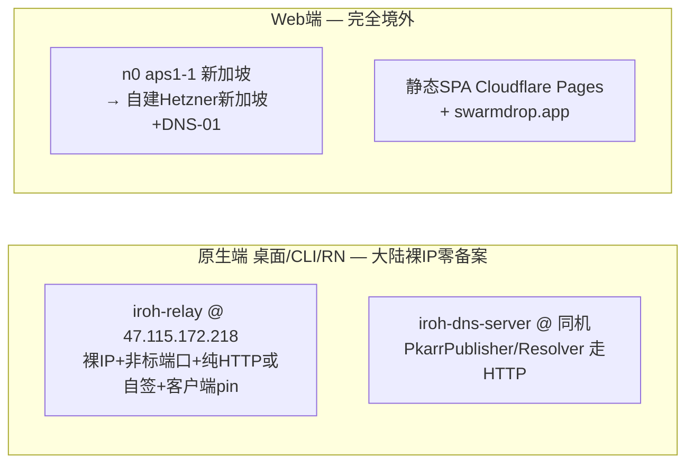
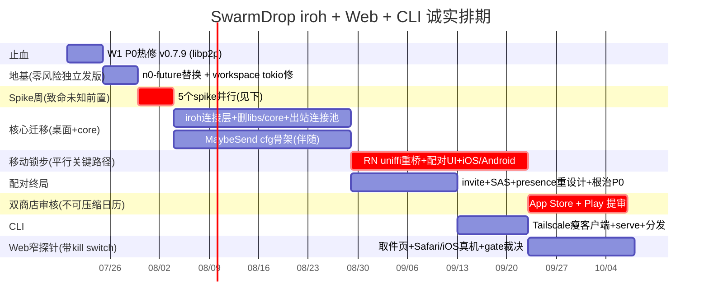

# SwarmDrop：iroh 迁移 + Web 端 + CLI 端 —— 开工路线报告

> 写给已经拍板要做这三件事的你。本文只回答「怎么做、多贵、什么顺序、哪里有雷」，不再论证要不要做。凡是会改变你下周动作的信息都在，其余略去。

---

## 0. 一段话结论

**三件事都能做，没有物理上做不成的 showstopper。但「单人 1–3 个月三端 MVP」这个范围假设是破的——诚实的日历时间是 5–9 个月**，压垮它的不是 iroh 本身（iroh 迁移主要是删代码），而是**六份攻击报告里五份都独立点名、而任务简报只字未提的两块载荷型工作**：(1) 共享同一个 `crates/core` 的 **SwarmDrop-RN 必须锁步迁移**（否则 v0.7.18 移动端真实用户当场与迁好的桌面失联，且无法再对新 core 编译）；(2) **libp2p↔iroh wire 不兼容的 flag-day** 切换 + 存量用户 PeerId→EndpointId 的数据/重配对迁移。正确的排序是：**P0 热修（现网 libp2p）→ n0-future 替换（零风险独立发版）→ 一周 spike 集中烧掉致命未知 → iroh 连接层迁移（桌面 + 移动锁步）→ 邀请链接配对终局（同时根治三个 P0）→ CLI → Web 端窄实验（最后、解耦、带 kill switch）**。Web 端所有外部证据都是负的、单位经济为负、且是你路线里唯一「无人区」，**它不该进 MVP，更不该驱动排期**；真正的护城河是「唯一带 iOS 的 iroh 全平台产品」，也就是被所有人忘记预算的**移动端**。

---

## 1. 🔴 SHOWSTOPPERS

没有让整个项目死掉的物理禁区。但有**四条「物理不可能」或「等价死路」的硬约束**，它们不阻断项目，但会决定架构形状，必须现在就吞下：

### S1 —— Web 端 + 大陆自建 relay 承接浏览器流量 = 物理不可行

浏览器页面跑在 `https://` 上时，混合内容策略强制 `wss://`（`iroh-relay/src/client.rs` 的 wasm 分支把 http→ws、其余一律→wss，四大浏览器 WONTFIX-by-design，无 override）。`wss` 强制受信 CA 证书 → 强制域名 → 域名 + 443 解析到大陆 IP → 触发 ICP 备案拦截（**阿里云自身拦截，不是 GFW**）。而现有 `47.115.172.218` 之所以活着，正是因为它裸 IP + 非标端口 + 无域名——裸 IP 签不出受信证书，浏览器必拒。

**结论**：Web relay 只有三条出路，必须选一条：**(a) MVP 直接用 n0 的 `aps1-1`（新加坡，Hetzner，实测 `5.223.65.62`，v1.0 relay 官方承诺支持到 EOL）；(b) 有成本压力后自建 Hetzner 新加坡 + 域名 + DNS-01（服务器境外，零备案）；(c) 大陆裸 IP + LE IP 证书 + 443——这条我判它走不通**（LE IP 证书只支持 http-01/tls-alpn-01、不支持 dns-01，强制需要 80/443 可达，而那正是阿里云未备案拦的两个端口；即便侥幸通过也是 6 天一续、断 6 天全线掉线的新 SPOF）。**推荐 (a)→(b)，绝不 (c)，永远不把 Web relay 放阿里云大陆承接流量。**

### S2 —— 浏览器内打洞 = 永久物理不可能，Web 端 100% relay

iroh 官方原文 "we can't port our hole-punching logic in iroh to browsers"（浏览器沙箱不给 UDP socket）。WebRTC exit 已被上游关掉（issue #3250/#3440 均 CLOSED，rklaehn 2026-06-15 在 HN 明确不承诺进核心库，两个社区 crate 8★/5★、4 commits、停更 2 个月）；WebTransport PR #4396 读 body 才知是 **relay 传输优化**（首字节 2 RTT vs 3-4），不是直连。**同一个 WiFi 下两个浏览器互传也要绕 relay 一圈**，无 mDNS。**这不否决 Web 端，但否决「Web 端免费无限传大文件」这个形态**——每个字节都是你付钱，双向计费。

### S3 —— iroh-blobs 在浏览器做文件传输 = 等价死路

只有 MemStore、零持久化（README 原文 "only the in-memory store works in the browser, so there is no persistence"），2GB 文件直接 OOM，IndexedDB/OPFS 后端不存在（issue #84/#90 开了 14–15 个月零 PR），且 main README 第一行至今自陈「非生产质量」。**正解：Web 端根本不引 iroh-blobs，用 SwarmDrop 自有 transfer 层，见 §4。**

### S4 —— 隐藏的真 showstopper：SwarmDrop-RN 锁步迁移，无法回避

这是任务简报**完全没提、而六份交付攻击里五份独立揪出**的最大盲区。实测：`SwarmDrop-RN/.../mobile-core/Cargo.toml` 用 git rev **钉住四个 crate，其中含 `swarm-p2p-core`**；mobile-core 的 `network.rs`/`pairing.rs`/`utils.rs`/`app.rs` 直接 `use swarm_p2p_core::libp2p::{Multiaddr, PeerId, identity::Keypair}` 且整个建在 6 位码 DHT 模型上。

- 你 W-中期「删 `libs/` submodule」的那一刻，mobile-core **编译失败**。
- libp2p↔iroh wire 不兼容 → 桌面发 iroh 版后，v0.7.18 移动端真实用户既连不上新桌面、也无法再对新 core 编译。
- 所以移动端**必须与桌面锁步迁移**：uniffi 重桥（PeerId→EndpointId/新配对模型全过一遍）+ 6941 行 TS 绑定 regen + RN 配对/传输 UI + `bootstrap-nodes` 设置页（iroh 没有 libp2p bootstrap，直接作废）+ iroh 在 iOS/Android 经 uniffi 交叉编译（noq/ring 进 xcframework/.a，**无先例**）+ 双商店审核（可被拒、往返 1–2 周）。

**这是一个未预算的、与桌面网络栈替换同量级的平行项目，约 +3–5 周开发 + 商店审核日历，且在关键路径上。** 它不是「以后同步一下」，是「不做就打断你一半真实用户」。

### 附：不是 showstopper 但必须写进风险登记册

- **iroh 原生 QUIC 硬编码 SNI `<base32-endpoint-id>.iroh.invalid`**（`iroh/src/tls/name.rs`，`pub(crate)`、decode 端硬匹配、受 1.0 wire 兼容保护，**应用层改不了只能 fork 两端**）。GFW 自 2024-04-07 解密 QUIC Initial 做 SNI 封锁 → **一条 `*.iroh.invalid` 规则可让全中国所有 iroh 直连同时失效**。对以中国为主体的用户群，这是系统性单点，见 §7。
- **iroh 没有 TCP 直连**（direct 只能 UDP/QUIC）。这对 libp2p 是真 regression：UDP 被限速时 libp2p 还能 TCP 直连，iroh 只能落 relay。

---

## 2. wasm32 那道墙怎么翻（任务问题 3）

### 简报的前提是错的：DB 不是墙，tokio 才是

实测反转：`sea_orm::DatabaseConnection` 是一个 **enum**，`ProxyDatabaseConnection` 只是它的一个 variant，`Database::connect_proxy(DbBackend::Sqlite, ...)` 返回的还是**同一个类型**。`proxy = ["serde/derive"]` 只拉 serde derive，不拉 sqlx、不拉 tokio。所以简报担心的「60 处 `DatabaseConnection` 写进 transfer 签名」——**走 proxy 路一行都不用改**。`error.rs:50` 的 `Database(#[from] sea_orm::DbErr)` 也只有一行、proxy 构建下正常编译，不是结构性障碍。

**真正的成本在 tokio**：core 里 29 处 `tokio::spawn`/`tokio::time`（`presence/supervisor.rs` 7、transfer 6、`network/event_loop.rs` 3、`infra/supervisor.rs` 2、`wire/data_plane.rs` 3 + ~10 处 time）。tokio 官方：time 模块在无 timer 的 wasm 平台会 **panic**。解药是 **n0-future 0.3.2**——正是 iroh 自己为此造的轮子，机械替换 `tokio::{spawn,time}` → `n0_future::{task,time}`，native 底层就是 tokio、行为不变。**这一步可以脱离 iroh 独立先做、独立发版、风险接近零，是天然的第一个技术 PR。** 注意 `tokio::sync::{Mutex,watch}` 和 `tokio_util::CancellationToken` 是纯 sync 原语，留着不动；workspace 里 `tokio = "1.49.0"` 没指定 feature 靠 unification 拿 rt，这本身是个坑，wasm 构建要显式声明。

### 但攻击揪出了两条路都逃不掉的真墙：!Send 传染

`host.rs` 的 6 个 trait（KeychainProvider/EventBus/FileAccess/Notifier/UpdateInstaller/AppPaths）全部是**无条件 `Send + Sync` + `#[async_trait]`**（desugar 成 `+Send` future）。native 侧 19 处 spawn 真的要求 Send；但 wasm 侧只要 impl 碰 web-sys / OPFS / IndexedDB / n0-future 就是 **!Send**。这两个要求在类型系统层面正面冲突。

**所以「照 host.rs 抄一个 trait」和「transfer 6789 行一行不改」都是假的**：要让 core 编 wasm，必须给 ~14 个 async trait + 全部 impl + 所有 `Arc<dyn Trait+Send+Sync>` 字段 + 19 个 spawn 做 **cfg 门控的条件 Send/Sync 界**（`#[cfg_attr(not(wasm), async_trait)]` / `#[cfg_attr(wasm, async_trait(?Send))]` + `MaybeSend` 宏，参照 n0-future 自己的 boxed 做法）。这是贯穿整个平台中立核心的横切手术，不是局部改动，**且必须早做（和 n0-future 同期，W2 附近），不能拖到 Web 端才发现**。

### 三条翻墙路径，按代价与风险排

| 路径 | 动作 | 代价 | 风险 |
|---|---|---|---|
| **A. 不复用 transfer（取件页）** | Web 只编 `protocol.rs`，写一个单向 receive-only ALPN | **完全绕开** SeaORM/!Send/tokio-wasm 整片墙 | protocol.rs 当前拖着 `swarm_p2p_core::NetClient` + `entity::TerminalReason`（sea-orm ActiveEnum 嵌进 wire 类型），需先解耦，非「1 天」 |
| **B. TransferStore trait + 轻 Web store** | 抽 ~11–14 个 async 方法，SeaORM impl 移独立 crate，Web 用内存/IndexedDB | 符合你的架构口味，core 真平台中立，1–2 周 + MaybeSend 全量改造 | !Send 传染贯穿全 core；「轻 store」与「transfer 共享状态机」矛盾——要么完整重建状态机、要么显式承认 Web 不复用 resume flow |
| **C. SeaORM proxy 直穿** | `DatabaseConnection` 不改，加 ~150 行 `ProxyDatabaseTrait` bridge → wa-sqlite/OPFS | DB 层几乎零改动 | **无公开先例**（唯一 in-tree 例子是 Cloudflare D1，不碰 SQLite BLOB）；`begin/commit/rollback` 空默认实现返回 `()` → `inbox.rs:202-258` 事务**静默退化成非事务**（必须显式覆盖 + 写「故意让 COMMIT 失败」的测试）；SendWrapper unsafe；`completed_chunks: Vec<u8>` 经 proxy JSON 往返未验证；`now_ms()`→`chrono::Utc::now()` 在 wasm 需 wasmbind 否则运行时失败 |

**推荐：走 A（Web 取件页，不复用 transfer）作为 Web 的实现路径，同时独立做 B 的 TransferStore 抽取当作 core 的正确分层清理（与 Web 决策解耦，反正它让 core 真正平台中立、符合你口味、可独立发版）。** C 作为「哪天 Web 真要完整会话持久化」的逃生舱记在文档里——SeaORM 已在低一层开好了这条缝，随时可切。**不要为一个物理上用不上断点续传的端（浏览器关标签页 = JS 上下文销毁 = checkpoint 全灭）付 C 的全部无先例风险。**

---

## 3. iroh 迁移的真实范围（任务问题 4）

心智模型完全不同：iroh 是 `Endpoint + Router + ALPN`，没有 Swarm poll 循环、没有 `NetworkBehaviour`、没有 Kademlia。**迁移的主要动作是删代码，不是写代码**——但攻击正确地指出「删 4864 行」掩盖了一块净新代码。

### 真实 API（iroh 1.0.2，Rust 1.91+，edition 2024）

```rust
// bind
pub async fn bind(preset: impl Preset) -> Result<Self, BindError>;
// connect：拨 EndpointId，不是 IP
pub async fn connect(&self, addr: impl Into<EndpointAddr>, alpn: &[u8]) -> Result<Connection, ConnectError>;
// 服务端
let router = Router::builder(endpoint).accept(ALPN.to_vec(), Arc::new(Handler)).spawn();
// ProtocolHandler 只有一个方法
async fn accept(&self, connection: Connection) -> Result<(), AcceptError>;
// 数据/控制面：QUIC 双向流
let (mut send, mut recv) = conn.open_bi().await?;   // 对端 conn.accept_bi()
```

### 删 / 重写 / 不动

| 处置 | 代码 | 说明 |
|---|---|---|
| **整个删** | `libs/core` submodule（4,864 行：event_loop 651 / config 445 / data_channel 475 / behaviour 230 / command 全套 kad / pending_map 175） | iroh 自带 event loop + Router，这些全是 libp2p 架构补丁 |
| **删** | `NatStatus` / `circuit_hops` / `is_public_routable` / `candidates.rs`(281) | NAT 推断 iroh 内部做完了 |
| **删** | `dht_key.rs`(21 行) + pairing 的 DHT 分支 | iroh 无 Kademlia（FAQ 原文 "iroh does not include a Kademlia-based DHT"）——三个 P0 的原语连根拔起 |
| **重写** | `presence/supervisor.rs`(805 行) | 迁移里**唯一没有明确好答案**的模块。降级为「pkarr 记录新鲜度 + 对已配对设备直接探活」。**不引 iroh-gossip**（0.101 非 1.0）。注意这是准实时→轮询的**功能降级**，不是等价替换，要让产品拍板 |
| **重写** | pairing（invite + SAS，见 §8）、`network/manager.rs` + `event_loop.rs` | libp2p 事件面 → iroh 事件面，两套完全不同 |
| **净新写（被「删 4864 行」掩盖）** | **出站连接生命周期管理器** | iroh Router 只接管**入站 accept 侧**；按 EndpointId+ALPN dial、连接复用池、session→connection 映射、relay-vs-direct 路径选择是净新代码。**这是网络层被 3-4 倍低估的真正原因，W-网络层要按 3–4 周不是 9 天估** |
| **几乎不动** | transfer 6,789 行 | 对 `swarm_p2p_core`/libp2p 只有 17 处耦合 / 10 文件（0.25% 密度）——这是你最大的既有资产，当初分层做得比你以为的干净 |
| **净升级** | `data_plane.rs`(258) 的 DataChannel impl → `Connection::open_bi/accept_bi` | 现在依赖 `libp2p-stream 0.4.0-alpha`（连 libp2p 0.56 stable facade 都没进），换成 QUIC 原生一等公民 + 1.0 wire 稳定保证 |

### iroh-blobs 能不能替代自研 transfer？—— 不能，这是最大的岔路口，答案是明确的「否」

三条独立理由叠加：**(1)** iroh-blobs main README 第一行至今自陈「非生产质量，要生产级用 0.35」，而 0.35 钉死在 iroh 0.35，**「生产级 blobs」和「1.0 的 iroh」不可兼得**；**(2)** 浏览器里只有 MemStore、零持久化（见 S3）；**(3) 模型根本错配**——blobs 是内容寻址 pull（知道 BLAKE3 hash 就能拉），与 SwarmDrop 的 push/offer 授权语义**直接冲突**，会架空「配对设备才能收」的权限模型。**保留自研 transfer，只换连接层。** 唯一值得单独引的是 `bao-tree ^0.16`（BLAKE3 verified streaming，若想让每个续传 range 独立可验证，你已经在用 blake3）。

**控制面不引 irpc**（多一个 0.17 依赖 + 强制 postcard），手写 bi-stream 与数据面同构即可。**顺手可评估删掉应用层 XChaCha20-Poly1305**：QUIC/TLS1.3 已端到端加密且 relay 解不开，应用层再套一层是纯 CPU 开销——除非目的是静态加密或防 relay 元数据关联（那要显式论证，不能默认保留）。至少在 Web 端（单线程、100% relay、字节量最大）应关掉它，别付双加密税。

---

## 4. Web 端怎么做（任务问题 5）——敢说的话：它是路线里最弱的一环，别让它驱动排期

### 先把话说透：证据一边倒是负的

- 品类是坟场：HN 2024-01 至今 27 条「file-transfer + webrtc」story，中位数约 3 分，81% 不到 10 分。**Web 端不会带来开源影响力**，动机里若含「曝光/star」，删掉。
- 唯一被验证的退出路径是「成功 → 被 LimeWire 买走 → P2P 内核被摘掉改币圈漏斗」（Snapdrop 10.9k★ / ShareDrop 10.7k★，2025-02）。
- 奶牛快传 2026-01-10 停服清数据（6 个月前），它有付费会员、有母公司（稿定设计）、有巨大流量，还是没活下来。
- LocalSend 用「双端必装 + 只能同 WiFi」拿到 85,313★ / 500 万下载，是最好的 web 工具的 8 倍——**「零安装」不是这个品类的胜负手**。
- 2026-07-15 的 PairDrop HN 帖（46 分）痛点是真的，但整帖用户自发举出的解法全是原生 App，**没有一个人说「要是有网页版就好了」**。

**结论**：Web 端定位只能是**「零安装的便携取件入口」，不是桌面端等价物**。首页明写「Web 版走中继、Chrome-only、单文件 ≤200MB、大文件请装客户端」。

### 怎么做

- **不复用 crates/core**（走 §2 路径 A）。新 crate `crates/web`，依赖只有 `iroh = { version="1", default-features=false, features=["tls-ring"] }` + `swarmdrop-protocol`。新 ALPN `swarmdrop/web-fetch/1`：单向流、无 checkpoint、无应用层加密。原生端多实现一个 ProtocolHandler，约 200 行。**这一刀砍掉 SeaORM proxy bridge、SendWrapper、wa-sqlite/OPFS、多 tab 选主、整个 core 塞 Worker——约 7 周**，而砍掉的东西 Web 端本来就用不上。
- **存储**：内存 + 少量 IndexedDB。断点续传在 Web 物理失效（关标签页即死，Firefox 空闲 30s / Chromium 5min 强杀），不为一个用不上的能力搬 6789 行。
- **落盘**：Chrome 走 File System Access API；Firefox/Safari 因 ≤200MB 直接 download blob 兜底。**明确不做 StreamSaver.js**（把 service worker 装第三方域名做 MITM，对 E2E 产品是安全叙事自杀）。
- **relay**：n0 的 `aps1-1.relay.n0.iroh.link`（新加坡，零自建零成本）→ 有压力自建 Hetzner 新加坡。**绝不阿里云大陆**（1GB Web→桌面 = relay 出 1GB：阿里云 ¥0.8 vs Hetzner 欧洲 ¥0.008，**100 倍差**；且 iroh-relay 只有 rx 限流无 tx，必须外层自建出网熔断否则恶意用户烧爆带宽）。
- **域名/备案**：**备案按服务器位置触发，不按域名触发**。静态 SPA 放 Cloudflare Pages + 自购域名（`swarmdrop.app` 实测无 DNS，几十块 10 分钟先买下来，别让它继续当设计前提），服务器境外 → 零备案。**大陆那台 `47.115.172.218` 永远不挂域名**，只服务原生端。落地页 payload 走 URL fragment（永不上服务器）+ URL scheme 接管，落地页仅 fallback。
- **反直觉利好**：iroh wasm 不需要 SharedArrayBuffer/threads → **不需要 COOP/COEP 响应头**，wasm 可直接嵌任意静态托管。bundle 基线实测 iroh-only **1.05 MiB gzip**（opt-level=z + LTO + strip + wasm-opt -Os），首屏先渲染 UI 再异步 init()。
- **无人区预算不可压缩**：iroh 的「浏览器支持」CI 跑的是 Node.js 22.5，**全 CI 无 chrome/firefox/safari/headless 任何字样**，GitHub 上 `iroh wasm browser` 仓库搜索 = **0**，**你是第一个在 Safari/iOS 上验证它的人**。留 3 天真机自测。

### 带钱谁付 + kill criteria

Web 端 100% relay、双向计费、单位经济为负、且面向 C 端免费用户没有转嫁机制。发布后看 7 天真实数据，**取件页完成的传输量 < 桌面传输量的 5% → 砍掉，代码留仓库当 demo，不再投一分钟**。这 2–3 周买的不是一个 Web 端，是一个明确答案。

---

## 5. CLI 怎么做（任务问题 6）——它比 Web 便宜、单位经济为正、但也不是增长引擎

### 形态（硬约束决定，不是偏好）

一台机器只能有一个 iroh Endpoint 属主 + 一个 SQLite writer。CLI 和桌面 App 各开一个 = 同 EndpointId 双开 + SQLite 写锁冲突。所以走 **Tailscale 模型**：

- 默认瘦客户端：`swarmdrop send <file> --to my-nas` → 本地 IPC（Unix domain socket / Windows named pipe）→ 桌面 App 已有 daemon。配对状态、SQLite、Endpoint 天然共享，零额外配对逻辑（Tailscale 官方原文：CLI "does not maintain its own networking state—all operations are performed by sending HTTP requests to the tailscaled daemon's LocalAPI endpoint"）。
- 无 GUI 机器（NAS/VPS/CI）：`swarmdrop serve` 自带 daemon，复用 core + 实现 `host.rs` 六个 trait 的 headless 版（Keychain→文件/OS keyring；Notifier→no-op；EventBus→日志/webhook；AppPaths→XDG）。

### 唯一该押的差异化

croc（35.5k★，品类现任者，仍在增长）是**无状态一次性的**，每次人工搬 code phrase。SwarmDrop 有持久配对身份 + SQLite 历史 + checkpoint → `swarmdrop send ./build.tar.zst --to my-nas` 是 croc **结构上做不到的事**。不要做 croc 复制品（它花 8.7 年才到 35.5k），也别指望复制 uv/ripgrep 曲线（那些都是「替换开发者每天已在敲的既有命令」，传文件不是）。

### MCP —— 顺带复用，不是立项理由，不是付费点

`swarmdrop mcp` 直接复用桌面 1,410 行 `tools.rs`（rmcp），1 天工作量。**但**：Handrive 已经把完全相同的组合（P2P + 40 个 MCP tools + CLI + headless + REST API）做完，2026-03-16 Show HN **2 分 1 评论**，然后永久免费。搜 agent 跨机器传文件的真实痛点，HN comment 返回 nbHits=0；生态既有答案是 git 和 vendor 云。**`TransferOrigin::{Human, Mcp}` 在数据模型里是好事，但别为它建路线图。**

### 分发（实测数据锁定）

| 平台 | 渠道 | 数据（croc 实测） |
|---|---|---|
| macOS | **Homebrew tap 必做** | brew 12,113/365d vs release 直下仅 395（5.5x+，且 brew analytics 是 opt-out 所以是下限） |
| Windows | GitHub release 直下 + winget/scoop | Windows-64bit.zip 7 天 2,330 次，**最大单一渠道**（反直觉） |
| Linux | 直下 AppImage/deb + AUR | — |
| cargo | 顺手做，可忽略 | sendme 90 天仅 576 次 |

### 商业化的真话

**CLI 本身收费无先例、无空间**（croc / magic-wormhole / sendme / alt-sendme / Handrive 全免费）。唯一被验证的变现位是**托管 relay**（ngrok / n0 模式，n0 明码 $0.27/relay/hour）。CLI 的商业价值是把 headless/NAS/CI 用户导向你的 relay，不是自己收钱。

---

## 6. 中国部署方案（任务问题 7）

### 最大反转：iroh 的 relay 走 TCP/WebSocket/443，不是 QUIC

简报前提「iroh 全 QUIC 所以在中国更脆弱」是**反的**。0.91 起 relay 协议只剩 WebSocket，官方明确「iroh will work behind firewalls that only allow TCP outbound」。**iroh 的 relay fallback 就是它的 TCP fallback**。中国移动 2025-05-17 起的 UDP 限速只会把流量压到 relay，不会断线。

### 架构必然分叉（是好事）



- **原生端**：`47.115.172.218` 跑 iroh-relay，**省略 `[tls]` 段 → 纯 HTTP**（源码 `iroh-relay/src/main.rs` 明写 "TLS is disabled if not present"；官方文档说的 "public IP and DNS name" 与源码矛盾，**照文档执行会误杀整个迁移**）。或自签 CA + 客户端 pin（`ClientBuilder::tls_client_config()` 是**必填项**，官方一等公民能力，且 **QAD/UDP 7824 需要 TLS**，纯 HTTP 会丢 QAD 压低打洞率——所以更稳的是自签 + pin）。rustls 遵守 RFC 6066，**对 IP 字面量不发 SNI** → 阿里云未备案 SNI 拦截和 GFW SNI 封锁都没有匹配目标。这是大陆自建 Tailscale DERP 多年成熟打法的正规版（iroh relay 官方承认自己就是 "a revised version of the DERP protocol written by Tailscale"）。
- **discovery 零域名**：同机自建 iroh-dns-server，`PkarrPublisher::builder("http://47.115.172.218:<port>")` 走 HTTP。**这是必做项不是可选**——不做的话大陆用户发现链路挂在境外 `dns.iroh.link` 上，这是 libp2p Kademlia 方案里不存在的新增中心化依赖，别漏。
- **双 relay 是配置项不是代码**：RelayMap 放 `[大陆裸IP, aps1-1.relay.n0.iroh.link]`，iroh 启动 ping 全部、按 RTT 选 home relay、自动 failover。「大陆 vs 新加坡」两难不成立。

### 必须实测 + 埋点的三件事

1. **`*.iroh.invalid` SNI 硬编码风险**（见 S4 附）：W-早期就把 `PathSelection`/`PathSelector`（iroh 1.0 `endpoint.rs:42`）的**强制 relay 回退做成用户可见开关**；去 n0 提 issue（源码注释自己写着 "We *could* decide to remove that indicator in the future likely without breakage"，这同时是开源影响力的免费入口）。反直觉结论：**在中国，relay-over-WSS 反而是最隐蔽的通道**（matheus23 原话 "The ClientHello is undetectable when sent via the relay transport"），「真 P2P 直连」才是最脆弱的那个。
2. **direct vs relay 比例，按运营商埋点**（wasm 下 `default-features=false` 关掉 metrics，要自己实现）。这决定你的成本模型：若中国移动家宽大面积回落 relay，「原生端 ~90% 直连」的财务基线崩，阿里云 0.8 元/GB 账单要按最坏情况重算。
3. **relay 出网熔断**（iroh-relay `PerClientRateLimitConfig` 只有 rx 无 tx）。

---

## 7. P0 安全洞怎么安排（任务问题 8）——正在被利用，W1 就修，不排在迁移后面

三个 DHT 系 P0 全部源于同一个原语「自定义 key 可写的公共 DHT」，iroh 拿走 Kademlia = 它们在新架构下无处可长。**「迁 iroh」和「修 P0」本来就是一件事**。但 iroh 迁移要几周后才出，洞今天敞着，所以分两段：

### W1 —— 现网 libp2p 上热修，发 v0.7.9，纯 hotfix 零重构

| P0 | 修法 | 工作量 |
|---|---|---|
| **PairingMethod::Direct 零校验旁路**（最严重，纯代码缺陷，与 iroh 无关，一台 VPS + ~30 行冒充任意设备） | `pairing/manager.rs` 只有 Code 分支校验、Direct 直通落库。改成 Direct 强制携带接收端 UI 现场生成的一次性 challenge + 校验入站为私有网段 + `circuit_hops==0`；不满足直接 drop | 0.5–1d |
| **OnlineRecord 全网用户名册**（无签名裸发 hostname + 真实公网 IP，key 可公开计算） | 摘掉 hostname（device_name 改配对握手交换）+ key 换 `SHA256(NS‖pairing_secret)` + 记录加 Ed25519 签名。降级为「已配对设备可查」。**注意这 3 天在换 pkarr 后整个删掉——明知的沉没成本，用 3 天买几周安全窗口** | 1.5d |
| **6 位码可枚举 + Kademlia 抢注双向 MITM** | libp2p 上无根治法。止血：码 6 位数字 → 8 位 Crockford base32（彩虹表 32MB→8TB）+ TTL 300→60s + 单码单次 + 失败锁定 + **配对完成前双端强制显示 SAS**（从共享密钥派生 4 emoji/6 数字，人眼比对）。**SAS 是传输无关的资产，迁 iroh 后 PeerId→EndpointId 逻辑一行不改** | 2d |
| **bootstrap MemoryStore max_records=1024** | 调 65536 + TTL 淘汰（约 1000 台在线就自然满，是静默容量炸弹） | 0.5h |

**并写 SECURITY.md 诚实披露**：6 位码 MITM 在配对终局前不完全修复。诚实是开源项目的信誉资产。

### 配对终局（随 iroh 迁移）—— 结构性根治

删 `dht_key.rs`；pkarr 的 key 强制是 32 字节 ed25519 公钥（不可枚举、不可抢注、不知公钥查不到任何东西）；`PairingMethod::Direct` 整个取消（所有配对必须持 capability[32]）。落地 `dev-notes/iroh-invite-link-pairing-design.md`，但**逐条修掉它已评审出的四个问题**：

1. `swarmdrop.app` 不存在 + 落地页 SPOF/备案 → payload 走 **fragment 永不上网**，`swarmdrop://i#<payload>` scheme 接管，落地页降级为渐进增强，挂了不影响已装用户。
2. invite 带长期身份 = 隐私倒退且永久留微信记录 → 放**一次性 EndpointId**（iroh 允许每次配对生成临时 SecretKey），配对成功后在加密信道内交换长期身份。
3. 手机→电脑循环依赖 → 「有屏幕的出码、有摄像头的扫」+ **SAS 让低熵码也安全**打破循环。**注意此洞没有完美解，双电脑跨网仍要粘链接，设计文档里写明承认，不要假装解决**。
4. **零 discovery 依赖**：invite 直接带 EndpointAddr 配 `MemoryLookup`，同时干掉「境外 SPOF」和「dns.iroh.link 中国可达性未知」。

### 硬顺序依赖

**Web 端绝不能早于配对终局**。Web 会新增一个由你运营的受信 relay/信令面；在配对 MITM 修复前上 Web，会把「可被 MITM」从「需主动抢注 DHT」降级为「运营方或任何攻陷 relay 者默认可为」（HN 用户 howtofly 原话："The signaling server could be used as the perfect place to perform MITM attack"）。本报告的排序天然满足这个依赖。

---

## 8. 推荐排期（任务问题 9）—— 诚实版：桌面+移动+CLI 约 5–7 个月，Web 是解耦的窄探针

> **先删掉三个前面几版路线共有的假东西**：不存在「先在 libp2p 上把 core 抽成 wasm-clean、之后 iroh 只换 adapter」这个正交验证点——core 与 libp2p 身份/加密/错误类型的解耦**本身就是 iroh 迁移**，二者不可分。也不存在「三端 1–3 个月」。下面是把移动锁步、wire-break、MaybeSend、真·浏览器 runtime 都算进去后的诚实排期。



### Spike 周（W3）—— 每个致命未知在写迁移代码前烧掉

| Spike | 验收标准 | 红灯后果 |
|---|---|---|
| **S-1 大陆 443 存活** | `certbot --preferred-profile shortlived --ip-address 47.115.172.218 --standalone` 能签出 + wss 三网可连 + 72h 未封 | 红灯即退 n0 aps1（本来就推荐这么走，此答案值 1 天因为它决定「以后有没有这个选项」） |
| **S-2 真·浏览器 runtime**（不是 cargo check！） | 单 dedicated Worker 里跑通「一条 offer→chunk→OPFS 落盘 + iroh relay WS 同时泵」；单线程 actor 不死锁、std Instant 全清、!Send store 满足 trait；同步 OPFS 落盘不饿死 relay event loop | 若阻塞/死锁 → Web 大文件当场判死，降级为「≤50MB 文本/剪贴板」，省 W-Web 大半 |
| **S-3 iroh-on-iOS/Android 编译** | noq/ring 经 uniffi 交叉编译进 xcframework/.a，ubrn regen 通过 | 卡移动端立项——这是整个项目的关键路径闸门 |
| **S-4 中国直连率** | 电信/联通/移动 × direct/relay 比例表 + tcpdump 确认 `.iroh.invalid` SNI 明文；移动家宽 >50% 绿灯 | <20% → 原生端也烧 relay，商业模型重算。**注意单人一个 ISP 测不准全国，可信数据只能上线后靠遥测拿到——这个 spike 给方向不给结论** |
| **S-5 transfer 跑 iroh bi-stream** | 现有 transfer 集成测试全绿、不改测试 | — |

### 关键排期原则

1. **W1 P0 与 W2 n0-future 与迁移路线无关**，无论后面怎么走都先做，且各自独立发版（v0.7.9 / v0.8.0），给你真实的下行保护——前两周任何时候叫停，用户拿到的都是更好的版本。
2. **MaybeSend cfg 骨架伴随 iroh 迁移做**，不能拖到 Web 端才发现（见 §2）。
3. **移动锁步是平行关键路径，不是尾巴**：每个改 core 的 milestone 后紧跟 mobile-core + RN 适配 + 双端构建测试。商店审核是不可压缩的日历，必须先于或同步于桌面强更。
4. **Web 排最后、解耦、带 kill switch**（见 §4）。它是市场证据最负、最无人区的一块，绝不压在 iroh 迁移同一个冲刺里。
5. **wire-break 策略要在动 core 前定死**：要么设计 protocol 版本协商 + 一段桌面双栈过渡窗口（+2 周但保住存量舰队），要么明确接受一次强制全网升级 + PeerId→EndpointId 数据迁移脚本 + 应用内引导 + 用户公告。移动端不能强更，必须有「旧版可读提示升级」的降级路径。**不能用「双端灰度 2d」一笔带过。**

### 别忘了记进预算的隐藏工作（每份攻击都点名，简报全为 0）

存量用户数据迁移 / 五端回归 QA / i18n（主仓 3 locale + RN 独立 2 locale，invite/SAS/QR/Web/CLI 全新串）/ docs 站重写 / **demo 素材重录**（`video/` Remotion 工程 + `e2e/` WebDriver 录的全是旧 6 位码流程，配对一改全作废，正在吃你当前工时）/ 两个线上产品的维护税（近 90 天 210+ commit，按 ×1.25–1.4 拉伸日历）。

---

## 9. 下周一做什么

**不碰任何迁移代码，先做四件互不依赖、当天就能启动的事：**

1. **开 P0 热修分支，先删 `PairingMethod::Direct`**（0.5 天、零风险、堵死一整类攻击）。这是唯一「立刻做、立刻堵、与所有后续决策无关」的修复。当周发 v0.7.9。
2. **花几十块把 `swarmdrop.app` 买下来**，只指向境外（Cloudflare Pages 占位）。别让一个不存在的域名继续当设计前提。
3. **配 wasm 工具链**：`brew install llvm` + CC/AR（macOS 上 Apple Clang 编不了 wasm32，ring 必炸），`.cargo/config.toml` 加 `[target.wasm32-unknown-unknown] rustflags = ["--cfg", 'getrandom_backend="wasm_js"']`，建一个 wasm32 空 smoke crate。把工具链坑一次性趟平。
4. **开 n0-future 替换 PR**（29 处 spawn/time，native 行为不变），作为独立发版的 v0.8.0——你的第一个迁移相关、但零迁移风险的产出。

**同时，本周内做一个书面决策（比写代码更重要）**：把范围从「三端 1–3 个月」诚实重定为「**桌面 iroh + 移动锁步 + CLI，约 5–7 个月；Web 端降级为解耦的窄探针，排在最后、带 kill switch、不进 MVP**」。理由已在 S4 和 §4：移动端是被所有人忘记预算的强制工作、也是你唯一的真护城河（HN 1398 分帖里那句 "file transfers between e.g. Windows and **iOS** seamlessly" 是你目前唯一能回答的，而领先你一周的 alt-sendme 恰恰**没有 iOS**）；而 Web 端是被拿来论证「iroh 迁移从可选变必须」的那块，也正是市场证据最负、开发者自认最残缺的那块。把这两件事的优先级摆正，是这份报告对你最值钱的一句话。