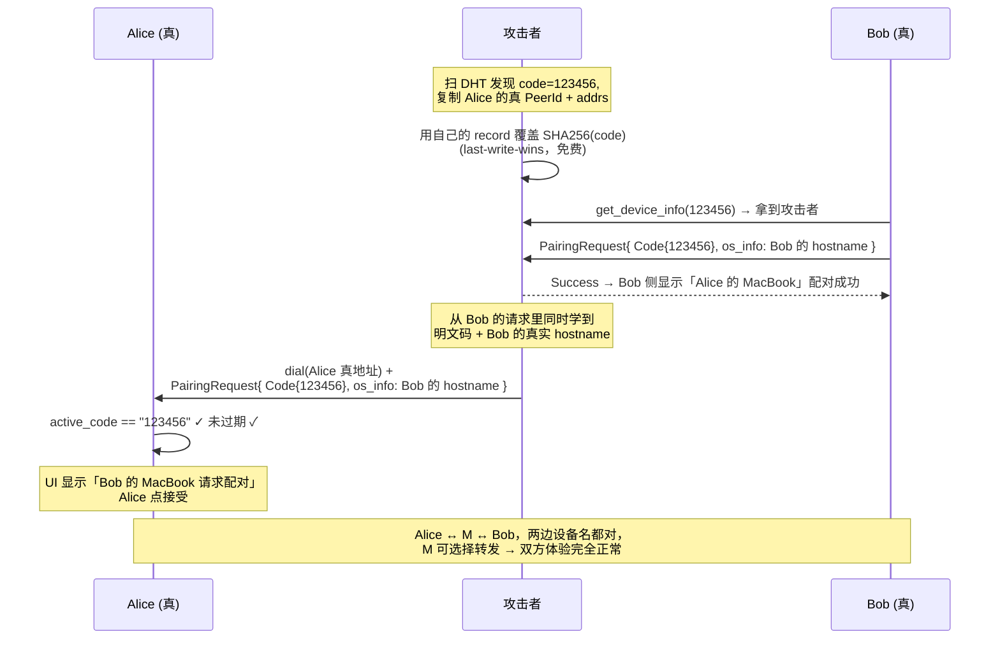
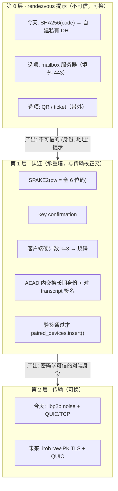

# SwarmDrop Rendezvous 勘察报告

日期：2026-07-16
范围：6 位配对码的 rendezvous 层安全性、iroh 迁移可行性、中国网络约束
结论摘要：**不迁 iroh（现在别谈），6 位码保住，立刻修安全**

---

## 0. 一段话结论

**6 位码在 iroh 上能活，因为 rendezvous 根本不该落在 iroh 上。** `Endpoint::connect(impl Into<EndpointAddr>, alpn)` 直接吃带地址的 `EndpointAddr` 并尝试直连，`MemoryLookup`（1.0 里 `StaticProvider` 的新名字）的文档定位就是「注入 out-of-band 学到的地址 —— e.g., from endpoint tickets or **application-specific channels**」。所以任务简报里那个前提（「iroh 不给我 put 任意 key 的自由度，而这正是现有实现赖以存在的能力」）**事实正确但推论错了**：现有实现赖以存在的是「码 → 地址」这个映射，而 iroh 从未要求你用它的发现体系来做这件事。答案是「不落地在 iroh 上，落地在 iroh 旁边」。

**但真正的决策结论是：不迁，而且现在别谈迁。** 理由三条，任一条都够：(a) 你的两个攻击面跟 iroh 完全无关，且今天就在 v0.7.8 的真实用户身上敞着，攻击成本是一台 VPS + 约 50 行代码；(b) iroh 1.0 的默认配置（`presets::N0` = 硬编码 `https://dns.iroh.link/pkarr` + n0 relay，仅美西/欧洲）对中国用户是**净退步**，要真去中心就得自建 relay + dns-server，那是你现在没有的预算；(c) **修安全跟迁 iroh 完全解耦** —— PAKE 层是纯应用层的，今天在 libp2p 上写完，迁 iroh 时只换「AEAD 密文里交换的身份类型」（`PeerId + Vec<Multiaddr>` → `EndpointAddr`），约 30 行。

**6 位码的手感可以 100% 保住。** 反直觉但确凿：magic-wormhole 的码只有 16 bit（比你的 20 bit **更少**），却安全了十年。差别 100% 在架构，不在熵。所以「6 位码不够安全」这个诊断是错的 —— 错的是把码当成了公开的 DHT 查找键。

---

## 1. 不可能三角：成立，且必须牺牲「无服务器」

### 严格论证

1. 接收方 Bob 唯一的输入是码 `c`，`H(c) = log2(10^6) ≈ 19.93 bit`。
2. 因此查找键必须是 Bob 可独立计算的确定性函数 `K = f(c)`，故 `H(K) ≤ H(c) = 19.93 bit`。**查找键的熵永远不可能超过码的熵。**
3. 开放 DHT 在结构上不存在可被节流的主体 —— 任何节点可被任何 peer 无认证查询。Wolchok & Halderman 的判词（WOOT'10）：**"BitTorrent DHTs cannot allow one and prevent the other."** 可查询性与可枚举性是同一个能力。
4. 攻击者以 `2^H` 一次性代价预计算 `{f(c)}` —— 现有实现下就是 `sha2::Sha256::digest([NS, code].concat())` × 10^6 = **32 MB 表、0.05 秒**。
5. 「K 上有记录」就是码的 oracle，反查即得码。
6. 阈值 `R* = S/T = 10^6/300 = 3,333 次查询/秒` 即达命中概率 1。该速率在 **2010 年的单台桌面 PC** 上就已超出（论文实测 81 分钟爬完 100 万+ DHT 记录）。

∴ **{开放 DHT 无守门人} × {6 位码} × {抗枚举} 不可兼得。**

### 逃生口只有三个，代价已量化

| 逃生口 | 代价 |
|---|---|
| (a) 抬熵到不可枚举 | 需 38–41 bit = **12–13 位数字**。杀产品。 |
| (b) 在查询路径上放限速器 | 就是 rendezvous server。**你已经有一台了。** |
| (c) 承认码公开，把认证移到别处（PAKE / SAS） | 仍需限流器 —— 否则 Alice 本人变成一个无限次、可静默拉动的 oracle。 |

任何声称同时做到三者的方案，必然在某处偷偷引入了守门人或额外信道（QR / mDNS 同网段），必须把那个东西显式化再评估。

### 两个必须写死的否定结论

**加长码无效。** HackerOne #1060541 的判词逐字：*"Increasing OTP length (e.g., 4-digit to 6-digit) does not fix the vulnerability."* 根因永远是缺限流，不是缺熵。

**加 argon2 伤己不伤敌。** 码空间固定在 10^6，密钥拉伸只给攻击者加一次**入场费**：@1s/码 × 10^6 = 277.8 CPU-小时 ≈ **$5.56**（竞价实例，一次性），表 32 MB，永久复用于所有用户、所有时间，边际查询成本为零。而每个合法用户每次配对多付 1–5 秒（移动端更痛）。magic-wormhole 的 `docs/attacks.rst` 十年前逐字写过这个修法，并自己否决了：*"...plus do some significant key-stretching (like 5-10 seconds of scrypt or argon2), which would increase latency and CPU demands, and **still be less secure overall**."*

### 第四条路存在，但有前提

**限流器不必是服务器。** Matter 的 commissionee 自己限流（20 次失败退出 commissioning mode，退出后需**物理操作**才能重进），全程没有 rendezvous server。但 Matter 能成立的真正原因是：**discriminator（12 bit，公开，走 BLE/mDNS 广播）≠ setup passcode（27 bit，秘密，只进 SPAKE2+）—— 码从不用于发现。**

三个互不相干的系统独立收敛到同一条定律：

| 系统 | 公开定位段 | 秘密认证段 |
|---|---|---|
| magic-wormhole | nameplate（服务器分配） | password（16 bit，只进 SPAKE2） |
| Matter | discriminator（12 bit，BLE/mDNS 广播） | setup passcode（27 bit，只进 SPAKE2+） |
| distributed-topic-tracker | topic_hash（派生 DHT 签名 key） | initial_secret（派生内容加密 key） |
| **SwarmDrop** | **`share_code_key(code) = SHA256(NS ‖ code)` —— 全码即查找键** | **无** |

> **用于「找到对方」的标识，必须与用于「证明是对方」的秘密正交。SwarmDrop 是唯一把两者合一的。**

---

## 2. 中国网络：可能直接否决迁移，也可能否决 mailbox

这一节的结论比密码学更硬 —— 它们是外部施加的、代码绕不过的。

### 2.1 Mainline DHT：可达，但不能押

**「BT DHT 在中国用不了」是错觉。** CHINANET-BACKBONE 是 Mainline 上全球第 3 大 ASN（1,131,734 个 IP，30 天观测，IPinfo.io / TorrentFreak 2025-09-27），仅次于 Rostelecom 和 Korea Telecom。

**但仍然不能押：**
- 中国移动自 **2025-05-17** 起在省级网关部署针对 PCDN 的 UDP 限速方案，**对海外 UDP 流量限制尤为严格**，且默认禁止 UDP 主动入站。广东移动用户实测 qBittorrent DHT 节点数为 **0**（正常应在 350–1000）。Mainline 是纯 UDP + BT 流量特征，落在打击面正中。
- `mainline` v7 的 4 个默认 bootstrap 里，`router.bittorrent.com` 和 `dht.libtorrent.org` 被 GFW DNS 投毒到 facebook/twitter/ntt 的 IP（transmission#8664，2026-03-08）。这条**可绕**（`Config.bootstrap` 收 `Option<Vec<SocketAddrV4>>`，吃 IP 不走 DNS）。
- **没有任何公开的 BEP44 put 成功率 / 查询延迟实测数据。** 多轮检索：pkarr 只有定性描述，ProbeLab 测 IPFS/Polkadot/Base/Avail 但**唯独不测 Mainline**，学术测量最新止于 2013。「Mainline 有 1000 万节点」是 pkarr/Pubky 的市场宣传，无法独立证实。

### 2.2 n0 relay：中国无节点，且 n0 自己说不能用

docs.iroh.computer 原文：**"Public relays are suitable for development and testing. For production, use dedicated relays."** 公共 relay 只有美西/欧洲。穿透失败时 relay 路径实测 270–400ms（直连打洞后 3–8ms）。

所以「iroh 默认 relay 在中国是否被墙」这个问题不需要回答 —— 无论如何都不该用公共 relay。**必须自建。** 而自建 relay ≈ 你已经在付的那台机器。

### 2.3 iroh 默认比你现在更中心化

`iroh/src/endpoint/presets.rs`：

```rust
impl Preset for N0 {
    builder = builder.address_lookup(PkarrPublisher::n0_dns());
    builder = builder.address_lookup(DnsAddressLookup::n0_dns());
    builder = builder.relay_mode(default_relay_mode());
}
pub const N0_DNS_PKARR_RELAY_PROD: &str = "https://dns.iroh.link/pkarr";
```

Mainline 版本是 **opt-in 的独立 crate**（`iroh-mainline-address-lookup` **0.4.0**，2026-06-15，**独立于 iroh 1.0 的版本号与稳定性承诺** —— 1.0.0-rc.0 博客明说拆出去是为了 "a different versioning and release schedule"）。

**「换 iroh = 更去中心化」是反的。** 默认路径下你只是把自建阿里云 bootstrap 换成 n0 的美国 DNS。

### 2.4 ICP 备案：最被低估的一条，可能直接否决 mailbox 方案

任何「WSS over 443 + 阿里云自有域名」的方案（即所有 mailbox 方案的默认部署形态）**在中国大陆不可部署**：

- 未备案域名解析到大陆 IP → **80/443 被云厂商（不是 GFW，是阿里云自己）拦截**返回备案提示页。据 2025 年监管升级，非标端口也会被周期性扫描后封禁（首违关停公网 24h，二违永久封 IP）。
- 备案 = 实名身份 + 中国注册域名 + **10–20 个工作日**（可驳回，个人主体常被打回）+ 内容与主体审核。它把一个具名自然人法律绑定到「运营一个跨网文件传输服务」上。

**最讽刺的地方：现状 `47.115.172.218:4001` 之所以活着，正是因为它是裸 IP + 非标端口 + 无域名 —— 无域名则无可备案之物。**

**决定性反证（项目已经用脚投过票）：** `/Volumes/yexiyue/SwarmDrop/src-tauri/tauri.conf.json` 里 updater endpoint 是 `http://47.115.172.218:3030/...` + `"dangerousInsecureTransportProtocol": true`。**最需要 TLS 的服务 —— 自动更新 —— 在这台机器上跑的是明文 HTTP、非标端口、无域名、无证书。** 如果 443 + TLS 在这台机器上是「0.5 人周」的事，它早就该先用在 updater 上了。

**三条逃生口：**

| 方案 | 评价 |
|---|---|
| **mailbox 挪出大陆（香港/新加坡）** | **推荐。** relay 是**数据面**（bulk 传输，270-400ms 绕行不可接受）→ 留阿里云裸 IP；mailbox 是**控制面**（allocate + claim + 4 个 PAKE 报文 + release ≈ 4 个 RTT，**零文件数据**）→ 境外多 100ms = 握手多 0.4 秒，用户无感。一举拿到：备案问题结构性消失、域名 + Let's Encrypt + 443、WSS/443 抗封锁形态完整保留、且两者不再同司法辖区同 IP。 |
| 境内裸 IP + 非标端口 + 客户端 pin **自签 CA（10 年期）** | 可行，但要给 `crates/core` 写自定义 `ServerCertVerifier`。注意必须 pin **CA 而非 leaf**，否则 leaf 过期那天所有未更新客户端配对**永久变砖**。且 `crates/core` 今天没有 TLS 根证书栈（实测：`webpki-roots` / `rustls-native-certs` 都在 `tauri-plugin-http` 那条**桌面链**上），移动端要为此新增一整套 TLS + Android 无标准文件式证书库。 |
| Let's Encrypt IP 证书（2026-01-15 GA，**160 小时有效期**） | 不推荐。全球配对唯一通路挂在一个 6 天续期的定时任务上。 |

### 2.5 GFW 打的是 QUIC，不是 UDP（一个意外的加分项）

- USENIX Security'25：GFW 自 **2024-04-07** 起 "decrypts QUIC Initial packets at scale" 做基于 SNI 的定向封锁。
- USENIX Security'23：**"UDP traffic is not affected. The new censorship system is limited to TCP."**

所以现状的 QUIC:4001 已经在定向打击面上（跨境），TCP:4001 保底。这也意味着：**把 rendezvous 从 QUIC:4001 搬到任何 TCP 形态都是净改善**。

---

## 3. 威胁建模：两个攻击面全部成立，且比简报更严重

### 3.1 攻击面 #1（枚举）：成立，且「私有 DHT」不构成门槛

`/Volumes/yexiyue/SwarmDrop/crates/core/src/dht_key.rs:7-16` —— key = `SHA256("/swarmdrop/share-code/" ‖ code)`，无盐、无密钥、无 per-session 随机数。

**「攻击者要先加入我们的私有网络」这个门槛不存在：**
- `libs/core/src/runtime/node.rs:45-56` 只有 `.with_tcp(noise)` / `.with_quic()` / `.with_relay_client(noise)` —— **没有 libp2p pnet / PreSharedKey，没有 allow/deny list**。
- bootstrap 的 multiaddr + PeerId 明文写在开源仓库 `crates/core/src/network/config.rs:16-19`；`protocol_version = "/swarmdrop/1.0.0"` 公开。
- 攻击者的工具就是**本仓库的 `swarm-p2p-core` 本体** + 约 50 行代码。

更糟：`replication_factor = 3`（`libs/core/src/runtime/behaviour.rs:120`，rust-libp2p 默认是 20），私有小网下几乎所有 record 都落在 bootstrap 上 → 攻击者只需与 bootstrap 建**一条连接**，在 yamux 上 pipeline GET_VALUE 扫完 10^6 个 key。

**私有 ≠ 更安全。** 它是隐晦（obscurity），不是隔离。

### 3.2 攻击面 #2（抢注/冒充）：成立，是完整的认证绕过

链条逐环源码验证：

```rust
// libp2p-kad-0.48.0/src/behaviour.rs:1828-1849 — record_received 唯一的检查
if record.publisher.as_ref() == Some(self.kbuckets.local_key().preimage()) { ... }
// 只保护本机自己发布的副本；之后 record_filtering 默认 StoreInserts::Unfiltered 直接 store.put

// record/store/memory.rs:113-133 — 后写者无条件赢
Occupied(mut e) => { e.insert(r); }

// crates/core/src/pairing/manager.rs:113
let peer_id = record.publisher.ok_or(AppError::InvalidCode)?;   // ← 无条件信任
```

**rust-libp2p 自己在源码注释里管这个字段叫 "(alleged) publisher"**（`behaviour.rs:1838`）。上游用词就在警告你。

`manager.rs:135-178` 的 `request_pairing` 零校验：对方回一句 `PairingResponse::Success` 就 `paired_devices.insert(peer_id, info)`。攻击者跑一个永远回 Success 的节点即可。显示名也归攻击者（`manager.rs:124-125` 把 DHT record 里的 `OsInfo` 存进 `discovered_peers`；`manager.rs:272-282` 的 `refresh_paired_device_os_info` 还允许配对后随时改名）。

### 3.3 简报漏了的：#1 × #2 = 完整双向透明 MITM



**根因是 `PairingMethod::Code { code: String }` 把明文码发给对端**（`crates/core/src/protocol.rs:12-25`）。`handle_pairing_request` 里的 `active_code` 校验**不但挡不住，还是 MITM 第二段的通行证**。防御被改造成了攻击工具。

### 3.4 三条简报没列、但更该先修的

**(a) `PairingMethod::Direct` 是一条零校验旁路 —— 攻击者根本不需要码。**

```rust
// crates/core/src/protocol.rs:22
enum PairingMethod { Code { code }, Direct }

// crates/core/src/network/event_loop.rs:131-147
// 入站 AppRequest::Pairing 来自任何 peer → 直接 cache_inbound_request + 弹 UI
// 无 is_paired 检查、无来源校验、无限流

// crates/core/src/pairing/manager.rs:193-206
if let PairingMethod::Code { code } = method { /* 校验 */ }
// ← Direct 直接 fall-through 到 :224-229 的无条件 paired_devices.insert
```

配合 `libs/core/src/runtime/behaviour.rs:138` 的 `kad.set_mode(Some(kad::Mode::Server))` —— **每个 SwarmDrop 客户端都是 Kademlia server，全部躺在路由表里**，标准 FIND_NODE 爬行即可枚举全网 PeerId。

于是：**爬 PeerId → dial → 发 `PairingRequest { method: Direct, os_info: { hostname: "Bob 的 MacBook" } }` → Alice 弹窗 → 她正在等 Bob，点接受。** 不需要码、不需要枚举、不需要抢 DHT。

> **这条独立于本次全部三个方案、独立于 iroh。只要 `Direct` 还开着，无论选什么方案，攻击面 #2 都没修掉。这是最便宜、最紧急的一条。**

**(b) presence 普查 —— 在中国语境下后果可能超过文件泄露。**

```rust
// crates/core/src/presence/mod.rs:52-64
pub struct OnlineRecord {
    #[serde(flatten)] pub os_info: OsInfo,   // ← hostname，常含真名（yexiyue-MacBook-Pro）
    pub direct_addrs: Vec<Multiaddr>,        // ← 真实公网 IP
    pub relay_addrs: Vec<Multiaddr>,
    pub relays: Vec<RelayHint>,
    pub timestamp: i64,
}
pub const ONLINE_RECORD_TTL_SECS: u64 = 300;   // 刷新周期 = TTL/2 = 150s
```

`supervisor.rs:407-430` 的 `announce_online()` 对**每个节点无条件发布**（与是否配对无关），key = `SHA256("/swarmdrop/online/" ‖ 公开的 peer_id)`，**无签名、无授权、任何人可算可查**。`supervisor.rs:346-390` 的查询侧全程不验签、不看 publisher。

⇒ **一份任何人可爬取的、持续更新的「全网 SwarmDrop 用户 → PeerId + hostname + 真实 IP + 在线时间线」名册**，与配对码是否过期无关。

**换 iroh 不解决**（pkarr 同样是「知道 EndpointId 就查得到地址」）。唯一的解是记录内容加密给已配对设备。

顺带：`supervisor.rs:369-386` 对 record 里**任意指定的** `hint.peer_id` + `hint.addrs` 无条件 `add_peer_addrs` + `dial` —— 攻击者可让受害者节点向任意 IP:port 发起连接。`announce_offline` 基本是 no-op（`behaviour.rs:945-951` 只删本地且只删 publisher==自己的，Kademlia 无删除原语）。

**(c) 码碰撞 —— 不需要攻击者，随产品成功必然引爆。**

生日界：10^6 空间，N 个并发活跃码 → 碰撞概率 ≈ N²/(2×10^6)。**N=1000 → 约 39%。**

后果不是「配对失败」，是 **Bob1 把文件发给陌生人 Alice2**：Alice2 的 `active_code` 恰好也是 "123456" → `manager.rs:198` 的校验通过 → Alice2 看到一个陌生 hostname 的请求，而她正在等她的 Bob2，很可能直接点接受 → 码被消费 → 真正的 Bob2 随后拿到 InvalidCode。

**这直接证明 `active_code` 校验的语义是错的：它验证的是「码相等」，不是「对面是我约定的那个人」。**

**(d) 过期校验校错了字段。** `manager.rs:107-110` 只看 kad 的传输层 `record.expires`（`protocol.rs:565` 每跳按接收端的 `record_ttl` 重算，本项目 = 3600s），而 `ShareCodeRecord` 认认真真带了 `created_at`/`expires_at`（`code.rs:46-55`）却**从未被读过**。⇒ **攻击者的投毒记录寿命是合法码的 12 倍**。「TTL=300s 所以窗口很小」是假安慰。

### 3.5 危害边界（部分减压）

入站有真防线：`event_loop.rs:363-379` 未配对 peer 的 Offer 直接 reject（NotPaired）；`device.rs:291-301` 新配对默认 `Collaborator`，其 policy 为 `auto_accept: false, require_confirmation: true, allow_mcp_send_to_device: false`。

**致命的是出站**：Bob 的设备列表里那条叫「Alice 的 MacBook」的攻击者条目，他主动点发送 = 直接投递。事后的 trust policy 救不了 —— 用户对「这个条目是谁」的认知已经被污染。

**⇒ 修复点唯一且明确：写入 `paired_devices` 之前必须完成密码学校验。**

### 3.6 严重性

| 面 | 可利用性 | 成本 | 后果 |
|---|---|---|---|
| **Direct 旁路** | 高 | 一台 VPS + ~30 行 | 静默冒充，受害者零感知 |
| **抢注 + 双向 MITM** | 高 | 一台 VPS + ~50 行 | 文件明文落入攻击者手，两边 UI 都正常 |
| **枚举** | 高（0.05 秒） | ≈0 | 前置条件 + 全网 IP/OS 测绘表 |
| **presence 普查** | 高（被动） | ≈0 | 全网用户名册（中国语境下 ≥ 文件泄露） |
| **码碰撞** | 无需攻击者 | — | 随用户增长必然发生，静默误配对 |

**P0，立刻修。现有系统的安全性来自「还没人写那 50 行代码」，不是任何机制。**

---

## 4. 解耦：能，且必须

### 证明

认证层的输入只有四样：

1. 本端稳定身份
2. 对端**经传输层密码学认证**的稳定身份
3. 码
4. 一条可靠有序的双向消息通道

| | libp2p 提供 | iroh 提供 |
|---|---|---|
| (1)(2) | noise + Ed25519 `PeerId` | raw-public-key TLS + `EndpointId`（同样是 Ed25519 公钥） |
| (4) | `request_response::cbor::Behaviour` | 自定义 ALPN + `Router::builder(endpoint).accept(ALPN, handler)` + QUIC 双向流 |

四样一一对应。⇒ **`pake.rs` 迁移时零改动**；`manager.rs` 只换类型（`PeerId` → `EndpointId`，`Vec<Multiaddr>` → `EndpointAddr`），约 30 行。

### 反过来也成立：iroh 修不了任何一个攻击面

```rust
// docs.rs/iroh/1.0.2/iroh/address_lookup/trait.AddressLookup.html
pub trait AddressLookup: Debug + Send + Sync + 'static {
    fn publish(&self, _data: &EndpointData) { ... }              // ← 连 key 参数都没有
    fn resolve(&self, _endpoint_id: EndpointId)                  // ← 只吃 EndpointId
        -> Option<BoxStream<Result<Item, Error>>> { ... }
}
```

**这是签名限制不是实现限制** —— 自定义 impl 也改不了。所以 rendezvous 无论如何都要自己做，iroh 帮不上忙。

### 分层



> **第 1 层今天就能在 libp2p 上写完，且迁 iroh 时原样搬走。第 0 层和第 2 层的决策不该阻塞它。**

---

## 5. 推荐方案

### 诚实前置：9 个候选方案全部被红队攻破

3 个 fatal（架构错），6 个 serious（骨架对，参数/机制错）。所以下面推荐的不是任何一个原方案，而是**红队一致收敛到的公共交集**。

### 第一期：止血包（推荐立刻做）

**约 3–4 人周（单人）。零新增基础设施、零备案、零商店阻塞、`libs/` 零改动。**

| # | 改动 | 文件 | 性质 |
|---|---|---|---|
| 1 | **删掉 `PairingMethod::Direct`**（不是加固，是删除）。mDNS 的职责是提供 multiaddr（地址提示），不是提供授权。`handle_pairing_request` 改成 match 穷尽、无 fall-through；**校验必须在 `publish(PairingRequestReceived)` 之前**（当前是「先弹窗再校验」，顺序反了，顺带消灭「陌生人可向全网任意节点弹窗 + 推系统通知」的骚扰面） | `protocol.rs:22`、`manager.rs:193`、`event_loop.rs:131-147`、`event_loop.rs:338-350` | **净删代码** |
| 2 | `ShareCodeRecord` 删 `os_info`；`listen_addrs` 只留 relay circuit 地址（家宽 IP 不给枚举者，直连地址在 PAKE 后经加密信道交换） | `pairing/code.rs:46-55` | 净删代码 |
| 3 | `get_device_info` **彻底不读 `record.publisher`** | `manager.rs:113` | 净删代码 |
| 4 | **删 `PairingMethod::Code { code }`** —— 明文码永不上网 | `protocol.rs:12-25` | 破坏性 |
| 5 | 校验 payload 里的 `expires_at`，不是 kad 传输层的 `record.expires` | `manager.rs:107-110` | — |
| 6 | **SPAKE2(pw = 全 6 位码)** + key confirmation。`spake2 = "0.5.0-pre.0"`（magic-wormhole.rs 生产在用，pin 死 + 锁 Cargo.lock） | 新增 `pairing/pake.rs` | 新增 |
| 7 | **客户端硬计数**（见下，这条最容易写错） | `pairing/pake.rs` | 新增 |
| 8 | **长期身份绑定到 transcript**：AEAD 载荷里附 `Sig_Ed25519(H(msg_a ‖ msg_b ‖ 双方声称的长期公钥 ‖ nonce))`，验签通过才 `paired_devices.insert()` | `pairing/pake.rs` | 新增 |

**第 7 条（计数器）必须逐字写死，红队在这里攻破了每一个原方案：**

```
不变量 1：计数在「接受 PakeStart」的那一刻 +1，不是在「收到错误的 confirm」时。
  → 否则：攻击者收到 Alice 的 confirm_a 后直接挂断，本地验证猜测正确性，
    Alice 的 fail_count 恒为 0，300 秒内跑完 10^6。SPAKE2 的「每会话一次猜测」
    定理仍然成立 —— 但没人数会话。

不变量 2：responder 先亮 confirmation = 免费预言机。joiner 必须先发
  HMAC(key, "joiner→host")，host 验证通过后才发自己的。

不变量 3：同一时刻只允许一条 in-flight 握手。第二条并发 → 拒绝。
  → 否则：并发 N 路 = N 次独立猜测。magic-wormhole 的 mailbox 在看到第三方
    claim 时抛 CrowdedError，理由原文："Once the server sees three sides in the
    conversation, it cannot proceed correctly because PAKE is a two-party protocol."
    这个 2-side 硬上限就是 one-guess 的执行机制。

不变量 4：计数器键在 code 上，绝不键在 peer_id 上（PeerId 自签名，磨密钥
  实测 7.3 MH/s，按 peer 计数等于没计数）。

不变量 5：超时、断线、静默丢弃 —— 全部算失败。
```

**测试锁死（不可裁剪）：** 反面教材是 Matter SDK —— 20 次限流被实测「不生效，计数器涨到 21/20、22/20 仍继续受理新的 pairing 请求」。至少三条：
- 攻击者静默重启 10^4 次握手 → 码必须在第 k 次前烧掉，且攻击者拿到的 confirm 样本 ≤ 1
- `Direct` / 未知 method / 错误 nonce → 断言 `paired_devices` **未变更** 且 **未发布 UI 事件**
- 转发型 MITM（第三方原样中继 msg_a/msg_b）→ 两条腿的 confirm 必须都失败

**效果：**

| 攻击面 | 修复后 |
|---|---|
| #2 抢注/冒充 | **完全关闭**（写入 `paired_devices` 之前必须过 PAKE + 验签） |
| 双向透明 MITM | **完全关闭**（码不上网 + SPAKE2 不可中继：中继者两边都要知道口令） |
| #1 枚举 | 从「离线全量收割明文码」降级为「每次猜测需一次在线握手 + 3 次即烧码」（p = 3/10^6） |
| 码碰撞 | 降级为 PAKE 失败（不再是静默误配对） |
| OsInfo/IP 测绘表 | 消失 |

**诚实的残余风险（必须写进设计文档，不能糊过去）：**

1. **枚举仍在。** 攻击者能数出「此刻有 N 个匿名会话在等」+ 收 PeerId + relay 地址。这是无守门人下的**物理下限**，不是可以调参修掉的。
2. **烧码 DoS。** 攻击者知道码（枚举免费）→ 3 个包烧掉任何活跃码 → 可持续 → 跨网配对不可用。**这是安全与可用的结构性两难**：严格计数 = 免费烧码；宽松计数 = 在线爆破。在无守门人前提下无解。**正确的产品叙事是：把静默的完全沦陷，换成了吵闹的、可重试的 DoS。** UI 必须优雅降级（「配对失败次数过多，请重新生成」+ 冷却），不能卡死。
3. **presence 普查不修**（见下）。

### 第一期 B：presence 加密（约 1.5–2 人周，建议同批，优先级可能高于第一期 A）

最低限度（**零成本，今天就能做**）：**从 `OnlineRecord` 里删掉 `os_info`**。hostname 对「找地址」这个用途毫无必要，却是名册里最伤人的那一列（中国用户的 hostname 常含真名）。

完整修法：`OnlineRecord` 的 `os_info` + `direct_addrs` 用「配对时协商的共享密钥」加密（复用已有的 `chacha20poly1305`），DHT 上只留密文。攻击者仍能数出活跃用户数，但拿不到 hostname + 真实 IP。顺手修掉 `supervisor.rs:379-386` 的未认证任意地址注入。

### 第二期：mailbox（可选，需要先答四个问题）

**只有在第一期的残余（枚举元数据 + 烧码 DoS）被判定为不可接受时才做。**

架构必须是 **mailbox（转发 PAKE 消息）而不是 directory（发布地址让 Bob 直连）**：

```
POST /v1/nameplate         → { nameplate: "7", token, ttl: 300 }
POST /v1/mailbox/7/claim   → { claim_token }   ← ≤2 个 claimant，第 3 个 409
POST /v1/mailbox/7/msg     → 追加消息（≤512B），Bearer claim_token
GET  /v1/mailbox/7/msg?since=k  (long-poll)
```

码 = `<变长 nameplate>-<4 位 password>`，例如 `7-8241`（**5 个字符，比今天的 `824137` 还短**）。nameplate = 服务器分配的最小空闲整数、**无上界**；password = 本地 CSPRNG 生成的固定 4 位，**永不上网**，只进 SPAKE2。连字符是零歧义的分隔符（不要用「码长决定 nameplate 长度」这种脆弱约定）。

**为什么必须是 mailbox：**
- directory 让 Bob 直连 Alice → 限流器被迫下沉到 Alice 本机 → 回到第一期的两难。mailbox 让**所有猜测流经可限流点**，这才是 magic-wormhole「one guess」的来源。
- 地址在 PAKE 成功后经 K 加密的最后一条消息交换 → **枚举 nameplate 只知道「有个会话在进行」，看不到 PeerId、看不到 IP** → 顺带切断「枚举 → 收 PeerId → 喂给 `online_key` 做永久追踪」这条组合链。
- 变长 nameplate 让 allocate-and-hold 攻击（7 个 IP、$0、隐形）从「摧毁产品手感」降级为「nameplate 多一两位」—— 攻击不再有回报。

**四个必须在写代码之前答完的问题：**

1. **部署在哪？** 推荐 mailbox 出境（香港/新加坡，控制面，4 RTT）+ relay 留阿里云裸 IP（数据面）。这一刀同时解决备案、证书、单点司法辖区。
2. **iOS 后台怎么办？** 实测 `/Volumes/yexiyue/SwarmDrop-RN/ios/SwarmDrop/Info.plist` **无 `UIBackgroundModes`**。而「发码 → 切微信」这个动作本身就挂起 App。必须定义 mailbox 的断线/重连/ownership 语义：allocate 时下发**服务端生成的高熵 bearer token（绝不从码派生）**，mailbox 归属 **TTL 绑定而非连接绑定**，重连凭 token 认领。不做这条，要么 nameplate 被提前回收（Bob 把猜测泄露给陌生人），要么泄漏满 TTL。
3. **限流按什么维度？** **per-IP 在中国 CGNAT 下不可用**（一个出口 IP 后面数千用户），IPv6 一台 VPS 就是 /64 = 2^64 个地址。必须：per-mailbox 硬计数（k=3）+ **PoW/HashCash 挂在 POST 上**（合法用户一次配对只 POST 一次，PoW 对手机 <100ms；攻击者要占空间得付 10^6 份），per-IP 降级为辅助信号。注意：**只限流 404 响应而不是所有 GET** —— 抗枚举强度不变（攻击者 99.7% 是 404），合法流量天花板消失，一键停服杠杆消失。
4. **双仓怎么切？** 见第 7 节。

**工作量：真实 8–12 人周，外加 App Store 审核的日历时间。**（原方案自估 6–9，红队一致判定低估 1.7–2×，漏项：mailbox 断线状态机、`crates/core` 的 WSS/TLS 栈（今天**没有任何 HTTP 客户端**，实测依赖表只有 serde/tokio/swarm-p2p-core/sea-orm/chacha20poly1305/blake3/specta 等）、三平台 TLS 信任配置、RN uniffi 全链路、叙事重写、e2e/demo 素材重录。）

### 为什么不推荐 SAS（人肉比对 4 位确认码）

- **杀掉异步配对。** SAS 要到双方都连上后才算得出，比对必须两人同时在屏幕前。而「Alice 生成码发微信 → 去忙别的 → Bob 半小时后输码」正是跨网场景的常态。SPAKE2 是全自动的，Alice 不需要在场。
- **人因不可证明。** Signal 安全码的老问题：绝大多数用户不比对。它的实际安全性 = `P(用户真比对) × 1e-4 + P(不比对) × 1`，而 SPAKE2 的 1e-4 是**无条件的密码学上界**。
- **它有一个真优势，值得作为可选档保留：它是唯一能防住恶意/被强制服务器的东西**（SAS 绑定 transcript，MITM 无法让两侧 transcript 一致，即使服务器完全知道码）。建议做成「设置 → 高安全模式：配对时比对 4 位校验码」，而不是默认。
- 如果做，**必须**：per-session 新鲜的 DH 密钥（绝不 commit 在 DHT record 上 —— 那会强制 `K_a` 跨会话复用，攻击者一次静默探针拿到 `K_a` 后离线磨 SAS 只要 **7–25 秒**，10 核 Apple M4 实测 X25519 = 56K ops/s/core）；双向 MAC 验证（不能只在输入方本地 `if` 比较）；SAS ≥ 6 位（对齐 Bluetooth numeric comparison / ZRTP 的 ~20 bit，13.3 bit 只有行业余量的 1/64）。

---

## 6. 被否决的方案

### (a) 从码派生 keypair 发 BEP44 —— 看起来最美的那个

协议上**完全成立**，且有在维护的生产参考实现：`distributed-topic-tracker` 0.3.5（2026-06-15，同时依赖 `iroh = "1"` + `mainline = "7"`），其 PROTOCOL.md 就是这个构造：

```
signing_keypair_seed = SHA512(topic_hash + unix_minute)[..32]
salt = SHA512("salt" + topic_hash + unix_minute)[..32]
get_mutable(signing_pubkey, salt)
```

**否决理由五条，任一条足够：**

1. **写授权归零。** dtt 自己的 PROTOCOL.md 白纸黑字：**"This keypair is deterministic and publicly derivable."** 谁知道码谁就持有签名私钥。BEP44 的验签只在「key 由**不可枚举**的秘密派生」时有意义，而这个前提被 20 bit 熵打死。（BEP42 也救不了 —— 它约束的是 node ID 与 IP 的绑定，抗 eclipse，**完全不管谁能 put**。）
2. **净退步：seq 焊死。** BEP44 规范：*"a node hosting the list node MUST not downgrade a list head from a higher sequence number to a lower one, only upgrade."* 而 libtorrent 源码 `src/kademlia/dht_storage.cpp:514`：`if (0 == m_settings.get_int(settings_pack::dht_item_lifetime)) return;` —— 直接跳过全部按年龄清理，而 `dht_item_lifetime` **默认就是 0**，文档原文「default is 0, means never expires」。⇒ **攻击者一发 `seq = i64::MAX` 就把 target 永久焊死。** libp2p-kad 无 seq、last-writer-wins，正主随时能重新 put 抢回来。**这是相对现状的净退步**，必须靠时间桶轮换降级成「焊死一分钟」。
3. **枚举不修**，只从 0.05 秒抬到约 50 秒（10^6 次 ed25519 keygen ≈ 50 CPU-秒单核，SHA1 部分可忽略）。
4. **中国**：Mainline 是 UDP + BT 双靶心（见 2.1）。
5. **隐私回归**：向全球公共 DHT 泄露每一次 SwarmDrop 会话的存在。现状的私有 DHT 虽然靠默默无闻，但攻击者要枚举得先加入你的网络，而**所有查询流量都经过你自己的 bootstrap** —— 迁到 Mainline 等于放弃这个位置。

### (b) OPRF 盲限速器（服务器学不到码）

**两条独立的致命：**

1. **单信任域下是空构造。** OPRF 盲性只在「持有 `sk` 的一方」≠「持有记录/mailbox_id 的一方」且不共谋时才有意义。你只有一个信任域（一个人、一台机器、一个司法辖区）。RFC 9497 §3.3.1 逐字：*"An entity that knows both the private key and the input can compute the PRF result using the following **Evaluate** function."* ⇒ 持有 sk 者本地 grind 10^6 个码 ≈ **50–150 CPU-秒**（一小时内摊销为零）→ 完整 `code → mailbox_id → seal_key` 表 → **服务器知道每一个码。** 而客户端亲手把 `mailbox_id` 交给它做路由。**一个人无法与自己不共谋。**
2. **盲性 ⊥ 每码限流。** 盲服务器看到的是一个均匀分布的群元素，信息论上不知道这是查询还是发布、命中还是未命中、是不是在扫空间 ⇒ **每码计数在数学上不可能** ⇒ 只剩 per-IP + 全局限流。而 6 位码的安全性 **100% 由每码限流承载**（NIST SP 800-63B：100 次 = 1e-4，且那是给**第二因子**的；Matter：20 次 = 2e-5）。全局限流给出 `p ≈ T·TTL/10^6`，要达到 NIST 边界需 `T ≤ 0.33 QPS` = 产品不可用。**安全性与合法吞吐死锁 —— 产品越成功越不安全。**

### (c) 纯 Ticket 替代 6 位码

密码学最干净（128 bit，枚举/抢注在数学上**不适用**，不是缓解是消失）。但三条产品级否决：

1. **手机→电脑方向无解。** 桌面无摄像头。手机屏幕上 160 字符怎么弄到电脑上？需要一个跨设备文本通道 —— **那正是 SwarmDrop 本身要解决的问题**。而这恰恰是文件传输工具的主线场景之一。
2. **「微信发 ✅ 点一下」是假的。** 微信聊天文本只对 http/https 链接化，`swarmdrop://pair#...` 是纯文本不可点。实际路径是「长按 → 复制 → 切 App → 粘贴」（4 步）vs 6 位码「看 → 切 App → 敲 6 个数字」（3 步）。要真「点一下」必须上 https universal link → 需域名 + web server → **重新引入服务器** + 微信众所周知会拦 universal link。
3. **隐私回归。** ticket 里是 Alice 的**长期 PeerId**（跨会话恒定），永久留在微信服务器和聊天记录里。配合 `online_key` = **永久 IP/hostname 追踪句柄**。今天的 6 位码 300s 后是一串废数字。「与今天等价」是错的，是单向倒退。

**但 ticket 应该作为第二入口保留**（面对面 QR，电脑→手机方向），且 ticket 里必须放 **ephemeral 身份**、真实身份在认证后的加密信道内交换。

### (d) iroh-gossip 的 TopicId 当 rendezvous

`TopicId::from_bytes([u8; 32])` 确是应用自选的任意 32 字节 —— 看起来像救星。但 `gossip.subscribe(topic_id, bootstrap_peers)` 的 `bootstrap_peers: Vec<EndpointId>` 被文档定义为「**已在该 topic swarm 中**的节点」。要加入 topic 你已经需要知道对方是谁 = 原问题本身。**鸡蛋问题，封死。**

### (e) BEP5 `announce_peer`（唯一的真·任意 key 原语）

```rust
pub fn announce_peer(&self, info_hash: Id, port: Option<u16>) -> Result<Id, PutQueryError>
pub fn get_peers(&self, info_hash: Id) -> GetIterator<Vec<SocketAddrV4>>
```

`info_hash` 是**入参**且类型是任意 20 字节 `Id` —— 反直觉地，BEP5 比 BEP44 更灵活（BEP44 用「target 由 pubkey 决定」换来了签名认证，牺牲了 key 的自由度）。但载荷只有 `SocketAddrV4`，且 announce 的是**直连地址，NAT 后失效** —— 恰好丢掉换 iroh 的全部理由。备胎，不是路。

### (f) BEP44 immutable item

```rust
pub fn put_immutable(&self, value: &[u8]) -> Result<Id, PutQueryError>   // target 是返回值
pub fn get_immutable(&self, target: Id) -> Option<Box<[u8]>>
```

target = SHA1(bencode(value))，key 由内容唯一决定 ⇒ 查询方必须先知道内容才能算出 target。**结构性无用**，但它是很自然的第一直觉，要明确写进「走不通」清单。

### (g) 码里嵌公钥指纹（`429183-a4f2`）

16 bit 指纹 = **8.98 毫秒**磨出碰撞（基准：mkp224o 实测 7.3 MH/s，双路 Xeon E5-2670）。32 bit = 588 秒单机（10 台 59 秒，仍在 300s TTL 内）。而设备身份是**长期 Ed25519 密钥**（存 Stronghold），攻击者可**无限期离线磨** ⇒ 必须按标准二次原像余量取 **≥64 bit（保守 80）** ≈ 13 个 base32 字符 → 产品死。

---

## 7. 明确的下一步

### 今天

**修 `PairingMethod::Direct`**（约 0.5 人日，**净删代码**）。这条独立于本次一切决策 —— 只要它开着，无论选什么方案、迁不迁 iroh，攻击面 #2 都没修掉。

### 本周

1. **`ShareCodeRecord` 删 `os_info`**（约 0.5 人日）。**DHT key 一个字节都不改** ⇒ 旧客户端照常查得到，零兼容问题。前端 `-device-found-view.tsx` 的 `found` 阶段用 `OsInfo::unknown_from_peer_id`（`manager.rs:160` 已有此函数）兜底，或改成「正在验证…」的 loading。这是唯一零成本、零风险、与网络栈选型完全无关的修复，它直接掐掉「全网 IP + hostname 测绘表」。
2. **`OnlineRecord` 删 `os_info`**（同上理由，同样零成本）。
3. **提交 Apple Multicast Networking Entitlement 申请。** 实测：`/Volumes/yexiyue/SwarmDrop-RN/ios/SwarmDrop/SwarmDrop.entitlements` **没有 `com.apple.developer.networking.multicast`**、Info.plist **没有 `NSLocalNetworkUsageDescription`/`NSBonjourServices`**；Android manifest **没有 `CHANGE_WIFI_MULTICAST_STATE`**、全仓库零处 `MulticastLock`。而 `libs/core` 用的是 libp2p 自建 mDNS responder（裸 socket 打 224.0.0.251:5353）。⇒ **mDNS 在 iOS 真机和 Android 上今天就是死的**，只是被 DHT rendezvous 扛着 100% 流量所以没人发现。这是已存在的 bug，且 Apple 的审批是人工裁量、周期以周计 —— **先排队，不管最后走哪条路。**
4. **决定 `libs/bootstrap` 的 `MemoryStore` 上限。** 实测 `/Volumes/yexiyue/SwarmDrop/libs/bootstrap/src/behaviour.rs:92` 是 `MemoryStore::new(peer_id)` ⇒ 默认 `max_records = 1024`，`record_ttl = 7200s`。这 1024 条被**活跃配对码**和**每台在线设备每 150 秒重发的 OnlineRecord** 共享 ⇒ **约 1000 台设备同时在线就自然满，新码从此发布失败，不需要攻击者。** 这既是 DoS 面也是产品天花板。注意：抬高上限**不修 DoS**（攻击者成本 O(字节)），只买时间。且要动 submodule + 重新部署那台机器（一次带停机的 flag day）。

### 2–4 周

第一期止血包（第 5 节）+ presence 加密。

### 迁移与发版（三方案通用，必须提前设计，红队一致判定这块预算为 0 是错的）

**实测的双仓现状：**
- 桌面 `/Volumes/yexiyue/SwarmDrop/src-tauri/tauri.conf.json` = **v0.7.8**
- 移动 `/Volumes/yexiyue/SwarmDrop-RN/app.json` = **v0.7.18**，且用 **git rev 钉住主仓**（`swarmdrop-core = { git = "...", rev = "d62a4dd..." }`）
- **两条完全独立的版本轨。**「双仓同版本发布 / tag 同步推」是一个已经不成立的虚构。

**约束：**
- 桌面走 SwarmHive + Tauri updater，`min_version` 强更（`release.yml:159,187-193` 的 `workflow_dispatch` 路径现成，`1f0ffc3` 刚修好强更弹窗不劫持普通更新）→ 几小时覆盖。
- **iOS 上强制更新在物理上不存在**（审核 1–7 天 + 用户自主更新，长尾以月计）。Rust core 变了，OTA/JS bundle 救不了。
- ⇒ **必然存在数周到数月的窗口：桌面 v0.8 与移动 v0.7.18 之间跨网配对完全断掉。**

**正确做法（不要一刀切）：**
1. **绝对不要改 `protocol_version = "/swarmdrop/1.0.0"`**（`crates/core/src/network/config.rs:89` / `libs/bootstrap/src/behaviour.rs:74`）—— 那是 identify 字段，改它会把 DHT 劈成两个互不相通的网络，且**升级提示在物理上传不到老客户端**（连接在应用层消息之前就被拒）。
2. **v0.8.0（双端同发）**：`PairingMethod` **新增** `Pake{..}` 变体，**保留** `Code{code}` 可反序列化但**一律拒绝**并回一个新的 `PairingRefuseReason::PeerTooOld` ⇒ 老客户端看到明确拒绝而不是神秘超时。新客户端只发 `Pake`。
3. **观察期**（≥2 个 App Store 发布周期）：桌面用 `min_version` 推；移动端用「去商店更新」的阻断墙 + Identify `agent_version` 的 `caps` 机制（实测已存在：`device.rs:201-205` 的 `to_agent_version()` 编码 `caps=a,b`，`device.rs:241-247` 解析）在设备列表上标「对方版本过旧」。
4. **v0.9.0**：删 `Code` 变体 + `share_code_key`。
5. **发版顺序**：RN 先提审并等上架，桌面强更**在 RN 上架之后**再推。
6. 建议在 `crates/core` 里定义一个**独立于应用版本号的 `WIRE_VERSION` 常量**。

**注意一个好消息（实测）：** `libs/core/src/runtime/behaviour.rs:49` 用的是 `request_response::cbor::Behaviour<Req, Resp>`，且 `AppRequest` / `PairingMethod` 都是 `#[serde(tag = "type")]` **内部标签** ⇒ CBOR + serde 按**名字**编码 variant，不是索引。所以增删 `PairingMethod` 变体**不会移位 `AppRequest::Transfer` 的判别式** —— **存量已配对设备的文件传输照常工作**，只有 Pairing 路径干净地反序列化失败（`InboundFailure`，不杀连接）。前提是不改 `req_resp_protocol`（`libs/core/src/config.rs:195`）。

### 存量配对怎么办（必须显式签字）

v0.7.8 的每一个现存配对，都是通过一个已被判定为「完全攻破」的流程建立的，而 `PairedDeviceInfo::new`（`device.rs:291-301`）硬编码 `trust_confirmed = true`。二选一，写进决策文档：

- (a) 升级后把所有 `trust_confirmed` 打回 false，逼用户重新确认；
- (b) 显式写下「我们接受存量配对可能已被 MITM，不做处理」并签字。

**不要把「已配对设备不受影响」当成优点写。**

### 叙事必须同步改

从「零服务器」改成：

> **无账号 / 服务器不碰明文，也不碰你的文件 / 服务器可自建可替换 / 已配对之后完全 P2P**

这既诚实（阿里云 bootstrap 已是既成事实，SPOF 的全部成本 —— 账单、可用性、被墙风险 —— **早已支付**），又恰好是 n0 官方对「怎么做去中心化发现」的原话答案（discussion #3598：**"running multiple iroh-dns-server instances redundantly"** —— 官方的去中心化方案就是自己跑服务器）。

magic-wormhole 把这个因果说得最直白：**"Wormhole codes can be so short because they implicitly contain a common mailbox server URL."** —— **码之所以能短，正因为有那台服务器。**

### 最后一句

**SwarmDrop 今天付了 SPOF 的全部代价，却让码在一个任何人可无限次查询的 keyspace 里裸奔。** 而所有 DHT 查询流量本来就流经那台机器 —— **限流点早就存在，只是没启用。** 从「私有 DHT」到「限速 mailbox」的距离，比看起来近得多。

但**先别急着走那一步**：第一期的止血包（3–4 人周、零基础设施、零备案、零商店阻塞）就能把「零成本静默冒充 + 双向透明 MITM」这个 P0 关掉，把攻破从 `p = 1` 降到 `p = 3e-6` 的在线猜测。**它今天就能开工，它不需要任何架构决策，它也不会被 iroh 决策阻塞。**

**别让一个 8–12 人周的基础设施项目，压着一个正在被利用的 P0 洞。**