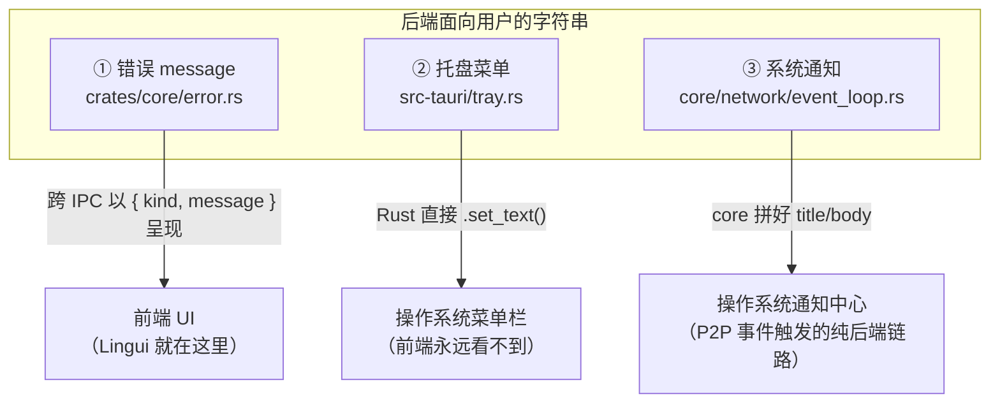
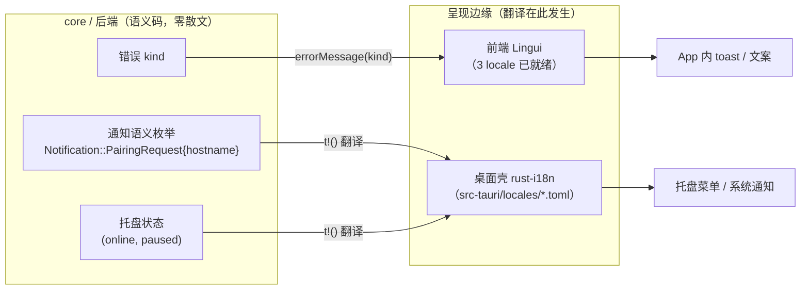
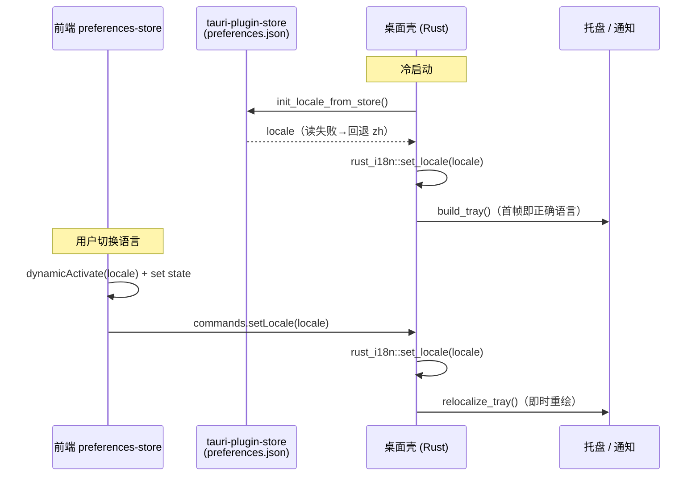
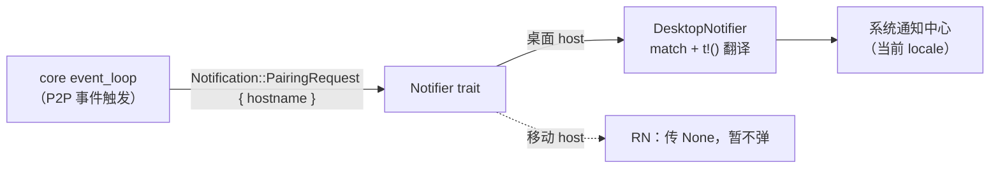

# Rust 后端国际化实战：从「混乱的单一语言」到「后端发码、边缘翻译」

SwarmDrop 的前端早已用 Lingui 支持了简体中文、繁体中文、英文三语，但后端的字符串却「绕过」了它——错误提示大多是英文（`"Node not started"`），偶尔夹着两句硬编码中文（`"配对码已过期"`）；系统托盘菜单、系统通知则全是硬编码中文。用户切到 English 后，托盘、通知和大量报错仍是中英混杂。本文完整记录我们如何把后端国际化收拾干净——核心是一条原则：**后端只发「稳定语义码」，翻译发生在呈现边缘**。

## 问题：后端字符串的三桶乱麻

第一反应是「给 Rust 装个 i18n 库就行」。但真正动手前先分类，会发现后端面向用户的字符串**根本不是一个问题**——它们按「谁来渲染」分成三桶，消费者完全不同：



三桶的关键差异在于：**① 的文本最终由前端渲染，而 ②③ 由 Rust/操作系统直接渲染，前端根本够不着**。

还有一个决定性事实：**当前语言（locale）只活在前端**——它持久化在 `preferences-store`（tauri-plugin-store），后端完全不知道用户选了什么语言。

如果无脑给 Rust 装个 i18n 库、让后端把三桶都翻译了，会犯两个错：错误文本本该复用前端现成的 Lingui（8 语目录都在那），却要在 Rust 里再维护一份；而且后端根本不知道当前 locale。**根因是「翻译发生在错误的层」**。

## 核心原则：后端发码，边缘翻译

正确的架构是一条统一原则：

> **后端（尤其平台无关的 `crates/core`）只发「稳定语义码 + 结构化参数」，永不产出本地化散文。翻译发生在「呈现边缘」——前端 Lingui 管 App 内文案，host 侧的 Rust 目录管原生 OS 表面。**

顺着这条线，三桶各归各位：



这套设计还有个额外好处：错误的 `kind` 和通知的语义枚举是**同构**的——都是「后端发码、边缘翻译」的实例。下面分两条独立的轨来实现。

## Track 1：错误 —— 交给前端 Lingui，后端几乎零改

### `kind` 才是稳定合同

SwarmDrop 的后端错误经 Tauri IPC 序列化成 `{ kind, message }` 抛给前端。前端早就在用 `kind`：

```ts
// src/lib/errors.ts —— 改造前
export function getErrorMessage(err: unknown): string {
  if (isAppError(err)) return err.message;  // ← 直接把后端英文/中文原样丢给用户
  if (err instanceof Error) return err.message;
  return String(err);
}
```

合同已经在那了。要做的只是：把 `getErrorMessage` 从「返回后端 `message`」改成「按 `kind` 查 Lingui 目录」，`message` 降级为开发者/日志用技术细节。

```ts
// src/lib/errors.ts —— 改造后
import { i18n } from "@lingui/core";
import { msg } from "@lingui/core/macro";
import type { MessageDescriptor } from "@lingui/core";

/** 有明确用户语义的错误 kind → 本地化消息描述符 */
const KIND_MESSAGES: Record<string, MessageDescriptor> = {
  NodeNotStarted: msg`节点未启动`,
  ExpiredCode: msg`配对码已过期`,
  InvalidCode: msg`无效的配对码`,
  Network: msg`网络连接出现问题，请稍后重试`,
  Transfer: msg`文件传输失败，请重试`,
  Identity: msg`设备身份初始化失败`,
};

/** 内部/技术类错误统一归入的通用提示 */
const GENERIC_ERROR = msg`出错了，请重试`;
const TECHNICAL_KINDS = new Set(["Io", "Serialization", "Database", "TaskJoin", "P2p", "Tauri"]);

export function getErrorMessage(err: unknown): string {
  if (isAppError(err)) {
    const descriptor = KIND_MESSAGES[err.kind];
    if (descriptor) return i18n._(descriptor);        // 命中语义 → 当前 locale 文案
    if (TECHNICAL_KINDS.has(err.kind)) return i18n._(GENERIC_ERROR);
    return i18n._(GENERIC_ERROR);                     // 未登记 kind：不泄漏英文原文
  }
  if (err instanceof Error) return err.message;
  return String(err);
}
```

这里有个 Lingui 的运行时用法值得记：`errors.ts` 是**非组件的纯工具模块**，不能用 `useLingui` hook。用 `msg\`...\`` 建**描述符**（locale 无关），再用全局 `i18n._(descriptor)` 在调用时按当前激活的 locale 渲染。描述符可以在模块顶层建好，`i18n._` 每次调用都取当前 locale——这正是 Lingui 处理动态消息的标准姿势。

### 后端顺手清理

错误 `kind` 分两档：**有用户语义的**（`NodeNotStarted`/`Network`/`Transfer`/`Identity`/`ExpiredCode`/`InvalidCode`）各给专门文案；**内部/技术类的**（`Io`/`Serialization`/`Database`/…）统一「出错了，请重试」，技术细节留在 `message` 供日志。

后端还要清掉两个「越界」的中文错误——它们是中文，恰恰暴露了「有人想让 `message` 面向用户」的错误直觉：

```rust
// crates/core/src/error.rs
// 改前：#[error("配对码已过期")] ExpiredCode,
// 改后：语言无关技术描述，面向用户的文案交给前端按 kind 渲染
#[error("pairing code expired")]
ExpiredCode,
#[error("invalid pairing code")]
InvalidCode,
```

**Track 1 成本极低**：后端错误结构零改动（`kind` 合同早在），复用现成 Lingui，App 内用户读到的一切走同一个翻译源。

## Track 2：托盘 + 通知 —— 这里才真正需要 Rust 侧 i18n

### 为什么这两处绕不开 Rust

通知由 P2P 事件在**纯后端链路**触发，窗口失焦（甚至 webview 休眠）时也要弹，前端根本没法插手翻译；托盘更是 Rust 直接渲染的原生菜单。这两处只能 Rust 来译——这才是「Rust 如何实现国际化」的正题。

### 选型：`rust-i18n`

原生字符串总共才 ~20 条 × 3 locale。对比几个方案：

| 方案 | 评价 |
|---|---|
| **`rust-i18n`** ✅ | `t!("tray.open")`，TOML 目录编译期内嵌，`set_locale()` 全局，DX 最好，恰好够用 |
| `fluent`（Project Fluent） | 复数/性别语法很强但过重，我们无复数需求，杀鸡用牛刀 |
| 手写 `match locale` | 3×20=60 臂，重复 locale 列表，随文案增长劣化 |
| 复用 Lingui `.po` | 想法诱人（与前端同目录），但 `gettext-rs` 带 C 依赖、键集也不同，耦合不值 |

### 目录布局与 `i18n!` 宏

`rust-i18n` 用 per-locale 文件，文件名即 locale code（和前端 `LocaleKey` 对齐）：

```
src-tauri/locales/
├── zh.toml
├── zh-TW.toml
└── en.toml
```

```toml
# src-tauri/locales/zh.toml
[tray]
open = "打开 SwarmDrop"
open_folder = "打开接收文件夹"
settings = "设置…"
quit = "退出 SwarmDrop"
pause = "暂停接收"
resume = "恢复接收"

[tray.status]
offline = "○ 未连接"
online = "● 在线 · 可接收文件"
paused = "⏸ 已暂停接收"

[notif.pairing]
title = "配对请求"
body = "%{hostname} 请求与您配对"

[notif.incoming_transfer]
title = "收到文件传输请求"
body = "%{name} 想要向您发送文件"
```

嵌套表 `[tray.status]`、`[notif.pairing]` 会被 `rust-i18n` **自动扁平成点分键** `tray.status.offline`、`notif.pairing.title`。

**踩坑 1：`i18n!` 宏必须在 crate 根调用**。`t!` 宏展开成 `crate::_rust_i18n_translate(...)`，如果 `i18n!` 放在子模块里，这个路径解析不到。所以它只能待在 `lib.rs`：

```rust
// src-tauri/src/lib.rs（crate 根）
rust_i18n::i18n!("locales", fallback = "zh");
```

`"locales"` 相对 `CARGO_MANIFEST_DIR`（即 `src-tauri/`）；`fallback = "zh"` 让缺项回退源 locale，而不是显示裸键名。

### `t!` 与插值

**踩坑 2：插值语法**。`rust-i18n` 4.x 的占位符是 `%{name}`，调用用 named-arg：

```rust
use rust_i18n::t;

t!("tray.open")                                    // → "打开 SwarmDrop"
t!("notif.pairing.body", hostname = "MacBook")     // → "MacBook 请求与您配对"
```

`t!` 返回 `Cow<'static, str>`，`MenuItem::set_text` / `with_id` 收 `AsRef<str>` 可直接吃；需要 `String` 时用 `.to_string()`（比 `.into_owned()` 稳，对 `Cow`/`String`/`&str` 都成立）。

### locale 从哪来：读 tauri-store 的「双层编码」JSON 字符串

前端是 locale 的唯一权威源，它持久化在 tauri-plugin-store。Rust 需要在两个时机拿到 locale：



**踩坑 3：tauri-store 里存的是「双层编码」的字符串**。zustand 的 persist 中间件经 `JSONStorage` 把整个 `{ state, version }` 序列化成**字符串**再交给 tauri-store。所以 Rust 侧 `store.get("preferences-store")` 拿到的是 `Value::String("{...}")`，不是对象——要先 `.as_str()` 取出字符串、再 `serde_json::from_str` 解析一次，才能读到 `state.locale`：

```rust
// src-tauri/src/i18n.rs
fn read_persisted_locale(app: &AppHandle) -> Option<String> {
    use tauri_plugin_store::StoreExt;

    let store = app.store("preferences.json").ok()?;
    let raw = store.get("preferences-store")?;
    let serialized = raw.as_str()?;                              // ← 值本身是字符串
    let parsed: serde_json::Value = serde_json::from_str(serialized).ok()?;  // ← 再 parse 一次
    let locale = parsed.get("state")?.get("locale")?.as_str()?;
    Some(locale.to_string())
}
```

**踩坑 4：读取时机必须在 `build_tray` 之前**。托盘在 `setup()` hook 里创建，如果晚于它设 locale，托盘首帧会闪一下默认语言：

```rust
// src-tauri/src/setup.rs
crate::i18n::init_locale_from_store(app.handle());  // ← 必须在前
crate::tray::build_tray(app.handle())?;
```

切换语言则走一个新增的 Tauri 命令，前端在 `setLocale` 里 best-effort 调用它：

```ts
// src/stores/preferences-store.ts
async setLocale(locale: LocaleKey) {
  await dynamicActivate(locale);   // 前端 Lingui 切换
  set({ locale });
  try {
    await commands.setLocale(locale);  // 后端 rust-i18n 切换 + 重绘托盘
  } catch { /* best-effort：失败不影响前端已切换 */ }
}
```

### 托盘即时重绘：存全部句柄 + 状态缓存

**踩坑 5：要「切语言即时重绘」，托盘的全部菜单项句柄都得长存**。原来的 `TrayState` 只存了状态行和暂停项两个 `MenuItem`（因为只有它们会动态变），其它项（打开/设置/退出…）建完就 drop 了——切语言时它们换不了词。所以要把全部句柄纳入 `TrayState`。

还有个微妙点：状态行和暂停项的文案**依赖当前 `(online, paused)` 状态**（在线/暂停/离线三态文字不同）。切语言时得重新派生它们，可后端此刻并不持有这两个 flag。解法是在 `TrayState` 里用 `AtomicBool` 缓存这俩，`refresh_tray` 更新它们、`relocalize_tray` 读它们重新派生：

```rust
// src-tauri/src/tray.rs
pub struct TrayState {
    status_item: MenuItem<Wry>,
    open_item: MenuItem<Wry>,
    pause_item: MenuItem<Wry>,
    open_folder_item: MenuItem<Wry>,
    settings_item: MenuItem<Wry>,
    quit_item: MenuItem<Wry>,
    tray_icon: TrayIcon<Wry>,
    online: AtomicBool,   // 缓存当前状态，供切语言时重新派生状态行/暂停项文案
    paused: AtomicBool,
}

/// 语言切换时重设托盘全部菜单项文案（由 set_locale 命令调用）。
pub fn relocalize_tray(app: &AppHandle) {
    if let Some(state) = app.try_state::<TrayState>() {
        let online = state.online.load(Ordering::Relaxed);
        let paused = state.paused.load(Ordering::Relaxed);
        let status = TrayStatus::from_flags(online, paused);
        let _ = state.status_item.set_text(status.text());        // 依赖状态，重新派生
        let _ = state.open_item.set_text(t!("tray.open"));         // 静态项，直接取词
        let _ = state.pause_item.set_text(pause_label(paused));
        let _ = state.open_folder_item.set_text(t!("tray.open_folder"));
        let _ = state.settings_item.set_text(t!("tray.settings"));
        let _ = state.quit_item.set_text(t!("tray.quit"));
    }
}
```

### 通知：core 保持语言中立 —— 语义枚举

通知最能体现「后端发码」的价值。原来 `crates/core` 里直接拼好了中文散文：

```rust
// 改前：core 里塞了中文 —— 平台无关的 core 不该背语言
notifier.notify_if_unfocused(NotificationRequest {
    title: "配对请求".to_string(),
    body: format!("{} 请求与您配对", req.os_info.hostname),
}).await;
```

改成语义枚举后，core 只表达「发生了什么」，翻译完全交给 host：



```rust
// crates/core/src/host.rs —— 语义枚举，零散文
pub enum Notification {
    PairingRequest { hostname: String },
    IncomingTransfer { device_name: String },
}

#[async_trait]
pub trait Notifier: Send + Sync {
    async fn notify(&self, notification: Notification) -> AppResult<()>;
    async fn notify_if_unfocused(&self, notification: Notification) -> AppResult<()> {
        self.notify(notification).await
    }
}
```

```rust
// src-tauri/src/host/notifier.rs —— 翻译发生在桌面 host
fn localize(notification: &Notification) -> (String, String) {
    match notification {
        Notification::PairingRequest { hostname } => (
            t!("notif.pairing.title").to_string(),
            t!("notif.pairing.body", hostname = hostname).to_string(),
        ),
        Notification::IncomingTransfer { device_name } => (
            t!("notif.incoming_transfer.title").to_string(),
            t!("notif.incoming_transfer.body", name = device_name).to_string(),
        ),
    }
}
```

`core` 从此彻底不碰语言——这既符合「平台中立」的架构口味，也让共享 `crates/core` 的移动端（SwarmDrop-RN）能各自本地化。

## 一个关键教训：改 core trait 未必破下游

设计阶段我们最担心的是：改 `Notifier` trait 的签名会不会**破坏依赖同一个 `crates/core` 的 SwarmDrop-RN**？直觉是「改 core 的公共 trait 必炸下游」，甚至一度打算为此做跨仓配对提交。

**实现阶段这个担心被证伪了。** 一查 RN 的代码：

```rust
// SwarmDrop-RN/.../mobile-core/src/events.rs
run_event_loop(
    receiver, shared, event_bus as Arc<dyn EventBus>,
    None, // 移动端无窗口聚焦概念，不需要 Notifier
).await;
```

RN **根本不实现 `Notifier`**——它对 `run_event_loop(..., Option<Arc<dyn Notifier>>)` 直接传 `None`，也从不引用 `NotificationRequest`。而这次改动只动 trait 的**方法签名**，trait 名 `Notifier` 和 `run_event_loop` 的签名都没变，所以 RN 那个 `None` 调用点毫发无伤。加上 RN 的 `Cargo.toml` 通常把 `swarmdrop-core` pin 在某个 git rev（而非本地 path），本地改动对它零即时影响。

> **教训：动 core 的公共 trait 前，先去下游查它到底实不实现这个 trait、是不是传 `None`——别默认「改 core trait 必炸下游」。** 一次 5 分钟的核实，省掉了一整套本不必要的跨仓协调。

## 验证清单

国际化这类改动，很多路径（尤其托盘/通知的真机表现）只能运行应用手测，但编译期能覆盖的要先全绿：

- `pnpm exec tsc --noEmit` —— 前端类型 + Lingui 宏
- `pnpm build` —— vite 会编译出三个 `messages-*.js` locale catalog
- `cargo check -p swarmdrop-core --features specta` + `cargo check -p swarmdrop`
- `cargo clippy -p swarmdrop --no-deps -- -D warnings` —— 只 lint 目标 crate，跳过依赖里的基线噪声
- `cargo test -p swarmdrop-core --no-run` —— 确认改动在 test 上下文（`MemoryHost`）也编译
- 真机手测：设置里切 zh↔en → ①错误 toast ②托盘全部菜单项 ③系统通知 三者语言一致跟随；冷启动首帧不闪

## 小结

「Rust 中如何实现国际化」这个问题，答案不是「装个 `rust-i18n` 就完了」，而是先想清楚**哪些字符串该由谁翻译**：

- **一切经 IPC 让前端展示的文本**（错误等）→ 后端只发稳定 `kind`，前端 Lingui 翻译，后端几乎零改。
- **Rust/OS 直接渲染、前端够不着的**（托盘、系统通知）→ 才用 `rust-i18n`；locale 由前端权威源同步给后端（启动读持久化 + 切换发命令）；`crates/core` 保持语言中立，通过**语义枚举**把翻译交给 host。

一句话收束：**后端发码，边缘翻译**。这条原则既避免了在 Rust 里重复维护一份翻译，又让平台无关的 core 彻底不背语言——顺带还证明了「改 core trait 必炸下游」只是个需要动手核实、常常并不成立的直觉。

---

*相关知识库：`dev-notes/knowledge/rust-backend.md` 的「国际化 (i18n)」段；OpenSpec 变更：`openspec/changes/localize-backend-strings/`。*
