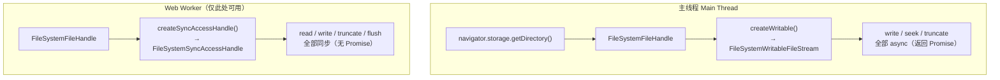

# OPFS：浏览器里的私有文件系统

> **讲什么**：Origin Private File System（OPFS）是什么，它和 IndexedDB / localStorage
> 的本质区别，以及它为什么是 Web 端「落盘 + 断点续传」的地基。重点讲 OPFS 两套 API
> 的**线程约束**——主线程 async 与 Worker-only 的 SyncAccessHandle——以及这个约束和
> libp2p `webrtc-websys` 只能跑主线程之间的冲突（本项目为何选了前者）。
>
> **为什么重要**：断点续传要「按 offset 往文件里写一段」。浏览器里唯一能干净做到这件事的
> 平台设施就是 OPFS。选错存储（比如 IndexedDB）或选错线程模型，整条落盘路径要么写不动、
> 要么静默挂死。这是把 Rust 传输内核搬进浏览器时，网络之外的第二道地基。

## 问题：浏览器里，文件往哪写

桌面/移动端收文件是 `std::fs` + positioned write，天经地义。浏览器里没有 `std::fs`
（`wasm32-unknown-unknown` 连 libc 都没有，见 [storage-abstraction.md](../../knowledge/storage-abstraction.md)）。
那一个从 P2P 流里逐块到达、要支持中断后从断点续写的文件，落在哪？

浏览器给过三代持久化设施，能力天差地别：

| 设施 | 数据模型 | 能否 positioned write | 适合 |
|---|---|---|---|
| `localStorage` | 字符串 KV，同步，~5MB | 否 | 小配置 |
| **IndexedDB** | 结构化对象 KV（可存 Blob） | **否**——只能整个 value 读出/写回 | 元数据、小对象 |
| **OPFS** | **真·文件系统**（目录 + 文件 + 句柄） | **是** | **大文件、随机写、断点续传** |

IndexedDB 能塞 Blob，但它是 key→value：改一个字节要把整个 value 取出、改、写回。
断点续传需要的是「打开文件，seek 到 offset，写 4096 字节，关闭」——这是**文件系统**语义，
不是 KV 语义。OPFS 正是补上这一层。

## OPFS 是什么

**Origin Private File System** 是 File System Access API 的一个分支：每个 origin
（协议+域名+端口）拿到一个**私有的、沙盒化的文件系统根**，通过
`navigator.storage.getDirectory()` 取得（返回 `FileSystemDirectoryHandle`）。

关键性质（均为 Web 平台规范事实，参 MDN *File System API / Origin private file system*）：

- **per-origin 隔离**：`https://a.com` 和 `https://b.com` 各有各的根，互不可见。
- **不进用户可见文件系统**：它不是「下载文件夹」，用户在 Finder / 资源管理器里看不到，
  也不用授权弹窗。纯给程序当私有暂存/持久区。
- **有目录树、有文件句柄**：`getDirectoryHandle` / `getFileHandle`（都带 `create` 选项）
  能像真文件系统一样逐段建目录。
- **持久**：只要 origin 的存储没被清，刷新页面数据还在。这正是 IndexedDB 之外、
  MemStore 拿不到的东西。

## 两套 API，两个线程世界

这是 OPFS 最容易踩坑的地方：**同一个文件系统，暴露了两套写 API，各自绑死在不同线程上。**



| | 主线程 async API | Worker-only Sync API |
|---|---|---|
| 入口 | `handle.createWritable()` | `handle.createSyncAccessHandle()` |
| 产物 | `FileSystemWritableFileStream` | `FileSystemSyncAccessHandle` |
| 调用形态 | async / Promise | **同步**（`.read()` / `.write()` 直接返回） |
| 能在哪跑 | 主线程 **和** Worker 都行 | **只能在专用 Web Worker 里**（规范强制） |
| 性能 | 每次 write 一次异步往返 | 最快，接近原生 |

`FileSystemSyncAccessHandle` 是性能最优、语义最贴近 `std::fs` 的那一套（同步 seek+write）。
但 MDN 明确写着它**必须在 dedicated Web Worker 内创建**——主线程调 `createSyncAccessHandle()`
直接抛错。这不是性能建议，是硬约束。

## 冲突：SyncAccessHandle 要 Worker，webrtc-websys 要主线程

按「性能最优」直觉，应该把 OPFS 落盘放进 Worker、用 SyncAccessHandle。但本项目的网络栈
把这条路堵死了：

- libp2p 的 `webrtc-websys` transport 在构造时调 `web_sys::window().expect(...)`
  （`transports/webrtc-websys/src/transport.rs:116`）——**Worker 里没有 `window`，直接 panic**。
  见 [libp2p-wasm.md](../../knowledge/libp2p-wasm.md)：只有 `websocket-websys` 支持 Worker。
- 如果传输必须在主线程，而 SyncAccessHandle 又只能在 Worker，那么「网络收到的块」和
  「同步落盘句柄」就分处两个线程，中间要再架一层跨线程消息传递。

本项目的取舍：**统一用主线程 async API**。传输和落盘都在主线程，`createWritable()`
路径主线程可用，省掉了 Worker 编排。代价是每次 write 一次异步往返、以及（当前 demo 实现里）
先把整个文件缓冲进内存、finalize 时一次落盘。

> 这个线程约束和 Web 侧存储后端选型是**一起**做的决定，不能分开选——
> 见 [storage-abstraction.md](../../knowledge/storage-abstraction.md) 的「未决/待查」。

## 本项目佐证：主线程 async 落盘

`crates/web/src/file_access.rs` 的 `write_opfs` 就是标准的主线程三步
（`getDirectory → getFileHandle(create) → createWritable → write → close`），全程 async：

```rust
// crates/web/src/file_access.rs（节选，去掉了 SendWrapper 包裹，见第 05 篇）
async fn write_opfs(relative_path: &str, data: &[u8]) -> AppResult<()> {
    let handle = opfs_file_handle(relative_path, true).await?;   // getFileHandle(create:true)
    let writable = JsFuture::from(handle.create_writable()).await?  // FileSystemWritableFileStream
        .dyn_into::<FileSystemWritableFileStream>()?;
    let write_promise = writable.write_with_u8_array(data)?;
    JsFuture::from(write_promise).await?;                          // write（async）
    JsFuture::from(writable.close()).await?;                       // close（async）
    Ok(())
}
```

`opfs_file_handle` 沿 `relative_path` 逐段 `get_directory_handle_with_options(seg, {create})`
建目录、末段建文件句柄——OPFS 的目录树能力被直接用来还原发送端的相对路径结构。

注释里也点明了当前的简化：**块先入内存缓冲，`finalize_sink` 时一次落 OPFS**。
真正的流式 positioned write（`writable.seek(offset)` 后写一段、跨多个 await 持有 writable 句柄）
更复杂，留作后续；这也是「大文件会吃内存」的原因。规范上 `FileSystemWritableFileStream`
是支持 `write({type:'write', position, data})` 的，能力就绪，只是本项目还没接。

`web-sys` 侧要显式开启这些接口特性（`crates/web/Cargo.toml`）：
`StorageManager` / `FileSystemDirectoryHandle` / `FileSystemFileHandle` /
`FileSystemWritableFileStream` / `FileSystemGetDirectoryOptions` 等——wasm-bindgen 的
web-sys 绑定按 feature 裁剪，不开就没有对应方法。

## 对照：iroh-blobs 在浏览器只有 MemStore

要理解 OPFS 的价值，最好的反面教材是 iroh-blobs。它在浏览器里**只有纯内存的 MemStore**
（`browser-blobs/src/node.rs:25` `MemStore::default()`，README 直言 *"no persistence"*），
全仓 grep `opfs / indexeddb / FileSystemDirectoryHandle` **零命中**
（见 [iroh 06-wasm-browser.md](../../../.claude/skills/iroh/references/06-wasm-browser.md)）。

后果链很直接：**无持久化 store → 无落盘 → 刷新即从零开始**，且整块入内存（受可用内存限制）。
iroh 官方对此的处理是「1MiB 以上干脆不读」。

**OPFS 就是把这块短板补上的那一层**：本项目 Web 端能做到「收到的文件落盘、逐字节一致、
可 `<a download>` 读回」（`export_blob_url` 从 OPFS 读回建 blob URL），靠的正是 OPFS
提供了 iroh-blobs MemStore 缺的持久化文件系统。

## 一个前置门：OPFS 只在 secure context 存在

最后一句必须记住：`navigator.storage` 本身被 **secure context** gate 住。在非 secure
的源（比如 `http://192.168.x.x`）下，`navigator.storage` 直接是 `undefined`，
`getDirectory()` 的 Promise 永久 pending——落盘静默挂死。这道门和它造成的惨案，
下一篇 [01-secure-context.md](01-secure-context.md) 专门讲。

## 小结

- IndexedDB 是 KV，改一个字节要整块重写；OPFS 是真文件系统，支持 positioned write，
  才是断点续传的地基。
- OPFS 有两套 API：主线程 async（`createWritable`）与 **Worker-only** 的 sync
  `SyncAccessHandle`。后者性能最优但绑死 Worker。
- 本项目因为 `webrtc-websys` 只能主线程，选了主线程 async 落盘——线程约束和网络栈耦合，
  一起决定。
- iroh-blobs 浏览器只有 MemStore（刷新即丢），反衬出 OPFS 提供的持久化是不可替代的。

**延伸**：SendWrapper 如何让 `!Send` 的 OPFS 句柄满足 `FileAccess` 的 `Send` 约束，
见 [05-wasm-bindgen-boundary.md](05-wasm-bindgen-boundary.md)。
