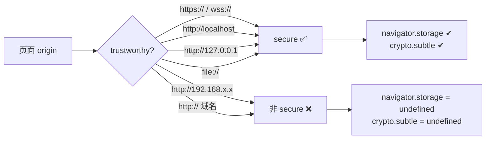

# secure context：谁是 trustworthy origin

> **讲什么**：什么是 secure context（安全上下文），它的 origin 白名单精确包含哪些
> （以及 http 私网 IP 为什么不在内），哪些 Web API 被它 gate 掉。用本项目一次真实的
> 「finalize 永久 pending」惨案，说明这道门在工程上的两条后果。
>
> **为什么重要**：secure context 是一道**隐形**的门——不满足时，很多平台 API 不是报错，
> 而是**整个不存在**（属性直接 `undefined`）。碰上去的代码往往不崩溃、不超时，只是静默挂死。
> 本项目就为此花了两轮调试才定位。任何在浏览器里碰 `navigator.storage` / `crypto.subtle`
> 的代码，都必须先理解这道门。

## 问题：同一份 wasm，换个地址就落盘挂死

现象（[libp2p-wasm.md](../../knowledge/libp2p-wasm.md) 的门 4 实测）：Web 壳端到端调试时，
用 `http://192.168.50.105:8080`（私网 IP over http）访问，传输**全绿**——连接建立、
分块推送、bao 验证全过——唯独最后 `finalize` 落盘那一步**静默永久挂死**：不报错、不超时、
不 reject，就是不返回。

换成 `http://127.0.0.1` 或 `http://localhost`，同一份 wasm 立即通过，逐字节一致。
唯一的变量是**页面的 origin**。浏览器探针一句话定位：

```text
isSecureContext: false   navigator.storage: undefined   crypto.subtle: undefined
```

根因：`http://192.168.50.105` **不是 secure context**，`navigator.storage` 是
`undefined`，`write_opfs` 调 `navigator.storage.getDirectory()` 打到 undefined 上，
web-sys 绑定的 `JsFuture` 永久 pending——**最坏的失败模式，无错误无超时**。

## 什么是 secure context

secure context 是 Web 平台的一个全局判定：当前执行环境是否「足够可信」，
以决定要不要放行一批敏感 API。它由页面 origin 的**可信度**（potentially trustworthy origin）
决定，判定结果暴露在 `window.isSecureContext`（布尔）。

**白名单**（规范事实，参 MDN *Secure contexts* / W3C *Secure Contexts*）——一个 origin
被判为 trustworthy，当且仅当满足其一：

| 判据 | 例子 | secure？ |
|---|---|---|
| `https:` / `wss:` | `https://swarmdrop.app` | ✅ |
| 环回地址 | `http://127.0.0.1`、`http://[::1]` | ✅ |
| `localhost` / `*.localhost` | `http://localhost:1420` | ✅ |
| `file:` | `file:///Users/x/a.html` | ✅ |
| **http + 私网 IP 字面量** | **`http://192.168.50.105`** | **❌ 不在内** |
| http + 域名 | `http://example.com` | ❌ |

**关键点**：`127.0.0.1` / `localhost` 即使走 `http://` 也是 secure（环回被认为可信）；
但 `192.168.x.x` / `10.x` / `172.16-31.x` 这类**私网 IP 走 http 不是** secure context。
「本机」和「局域网」在这里是两个世界——这一步最反直觉，也是本项目踩坑的根。



## 被 gate 的 API：不是报错，是不存在

secure context 门后的 API，在非 secure 源下**不是抛异常，而是属性本身就是 `undefined`
/ 对象整个不挂载**。本项目直接撞上的两个：

- **`navigator.storage`（OPFS 入口）**：非 secure 下 `undefined` → `getDirectory()`
  无从调起 → 落盘挂死（见上）。
- **`crypto.subtle`（SubtleCrypto）**：非 secure 下 `undefined`。注意区分——
  `crypto.getRandomValues()` 到处可用，但 `crypto.subtle`（Web Crypto 的非对称/摘要等）
  是 secure-context-only。

还有一批（本项目未直接用但同门）：Service Worker、部分 `navigator.mediaDevices`、
Geolocation、Web Bluetooth 等，都需要 secure context。规律是「凡涉及持久化、加密、
硬件、后台能力」的强力 API，基本都在门后。

## 为什么连接不受影响，只有落盘炸

这是本项目根因最隐蔽的地方：**在 http 私网 IP 下，P2P 连接照通，只有落盘挂死。**

原因：libp2p 的 **Noise 握手用的是自带的加密实现**（wasm 里是纯 Rust 的
x25519 / ChaCha20-Poly1305 / blake2 一类），**不依赖 `crypto.subtle`**。所以 secure context
缺失完全不影响 Noise 加密、不影响连接建立。网络层全绿。

结果就是「网络全绿、只有存储挂」——最容易误判成传输 bug 的表现。要不是浏览器探针
直接测 `isSecureContext`，很难想到根因在页面 origin 上。

> 这条也是本项目「四道 wasm 运行时门」里的门 4。完整的十一轮调试复盘走
> [wasm-debugging/](../wasm-debugging/) 系列；本篇只讲**平台事实**这一半。

## 工程后果：两条必须落地的约束

本项目从这次惨案里固化了两条工程规则（写进了代码）：

**① 生产 Web 端必须 https 部署。** 别图省事让局域网 helper 直接起 HTTP 服务托管页面
（`http://192.168.1.5:8080`），那样页面不是 secure context，丢掉 OPFS 与 `crypto.subtle`。
正确姿势是**页面照常从 `https://` 加载，只有 P2P 连接打到局域网 IP**——这恰好能利用
mixed content 的私网 IP 豁免（见 [03-mixed-content-private-ip.md](03-mixed-content-private-ip.md)）。

**② 碰平台 API 的端口实现必须预检 + 兜底超时。** 绝不能让 undefined 上的 JsFuture
永久 pending。`crates/web/src/file_access.rs` 的做法：

```rust
// 构造时预检 isSecureContext，明确报错而非挂死
fn ensure_secure_context() -> AppResult<()> {
    let win = web_sys::window().ok_or_else(|| AppError::Transfer("无 window".into()))?;
    if !win.is_secure_context() {
        return Err(AppError::Transfer(
            "OPFS 不可用：当前页面非 secure context，navigator.storage 缺失。\
             请用 https 或 localhost / 127.0.0.1 访问（而非 http 私网 IP）。".into(),
        ));
    }
    Ok(())
}
```

不止预检——**每个 OPFS 的 await 还套了 `n0_future::time::timeout(5s)` 兜底**
（`opfs_root` / `export_blob_url`）：即便底层因任何原因不 resolve，也在 5 秒内明确
失败，而非永久挂起。预检定位「环境错」，超时兜住「未知的挂死」。

`WebNode::spawn` 也在启动时就 `warn` 一次（`crates/web/src/node.rs`），页面上
`index.html` 同样用 `window.isSecureContext` 弹一条红色警告——**在传到一半炸掉之前**
就告诉用户。

## 自查：一行探针分清「环境」还是「代码」

碰到「某个平台 API 相关的路径莫名挂死」，最快的定位手段是**绕开整个 Rust 栈，直接在
DevTools Console 里探平台层**：

```js
console.log(isSecureContext, navigator.storage, crypto.subtle);
// secure:     true   StorageManager{...}   SubtleCrypto{...}
// 非 secure:  false  undefined             undefined
```

一句话就能把「环境错（origin 不 secure）」和「代码错（逻辑 bug）」切开。本项目门 4
就是这么定位的——在此之前花了两轮在 Rust 侧逐个假设，来回拉扯。**平台层探针 > 逐个假设**。

顺带两个易错点：

- **`file://` 是 secure context，但它没有有效 origin**，OPFS 之类按 origin 隔离的存储
  在 `file://` 下行为受限甚至不可用——「secure」不等于「所有 API 都好用」。
- **反向代理/隧道要小心**：内网穿透工具若把 `https://` 外壳降级成内部 `http://` 转发，
  `isSecureContext` 看的是**浏览器地址栏那个 origin**，不是后端实际协议——别被中间层骗。

## 小结

- secure context 白名单：`https/wss`、`http://localhost`、`http://127.0.0.1`、`file://`。
  **http 私网 IP（192.168.x.x 等）不在内**——这是最反直觉的一条。
- 门后的 API（`navigator.storage`、`crypto.subtle`…）在非 secure 源下**是 undefined，
  不是报错**，碰上去的 JsFuture 会永久 pending（无错误无超时）。
- 连接不受影响，因为 libp2p Noise 用自带加密、不依赖 `crypto.subtle`——这让「只有落盘炸」
  的根因格外隐蔽。
- 工程铁律：生产 Web 端 https 部署；碰平台 API 的代码构造时预检 + 每个 await 套超时兜底。

**下一篇** [02-webrtc-websocket-in-browser.md](02-webrtc-websocket-in-browser.md) 讲另一个
平台硬约束：浏览器根本不能 listen，只能经 relay 被动接收。
