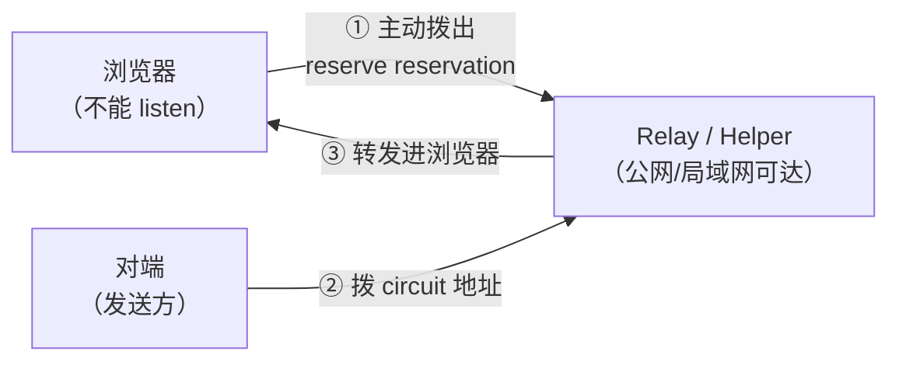
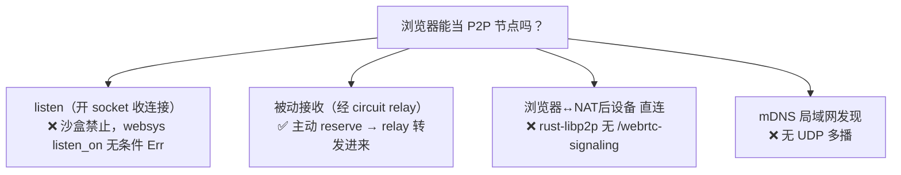

# 浏览器能 listen 吗

> **讲什么**：浏览器作为一个 P2P 节点，能不能监听入站连接（listen）？答案是决定性的
> **不能**。但它**可以**经 circuit relay 被动接收——这两件事的区别，是理解「浏览器在 P2P
> 网络里到底能做什么」的关键。顺带讲清楚浏览器里可用的两种 libp2p 传输
> （websocket-websys / webrtc-websys）各自的边界，以及「浏览器间没有直连」的真相。
>
> **为什么重要**：很多 libp2p / P2P 用户会想当然地以为「换个 wasm transport 就能让浏览器
> 像桌面节点一样收连接」。这是幻觉。搞不清 listen 与被动接收的区别，会在「Web 端能收文件吗」
> 这个产品问题上得出完全错误的结论。

## 问题：Web 端能不能当「接收方」

SwarmDrop 是文件传输工具，接收是核心场景。桌面节点收文件靠的是：向 relay 申请
reservation，让对端经 relay circuit 拨进来（见 [relay-circuit-fix.md](../network/relay-circuit-fix.md)）。
那浏览器能不能也这样当接收方？

要回答它，得先分清两个被混为一谈的能力：

- **listen**（监听）：开一个本地 socket，等别人连进来。需要操作系统的 socket 服务端能力。
- **被动接收**（passive accept）：自己不开 socket，而是**主动**连到一个中继，让中继替你
  转发别人打给你的连接。

## 决定性事实：浏览器不能 listen

浏览器的 JS 运行时**没有任何服务端 socket API**——不能 `bind()`、不能 `listen()`、
不能 accept 入站 TCP/UDP。这是沙盒的硬约束，不是 libp2p 的限制。

libp2p 把这个事实诚实地编码进了代码。三个 websys transport 的 `listen_on`
**全部无条件返回 `Err`**（[libp2p-wasm.md](../../knowledge/libp2p-wasm.md) 已复核）：

```rust
// transports/websocket-websys/src/lib.rs:83-89（webrtc-websys / webtransport-websys 同）
fn listen_on(&mut self, _id, _addr) -> Result<(), TransportError<Self::Error>> {
    Err(TransportError::MultiaddrNotSupported(addr))   // 无 cfg 分支、无 feature gate
}
```

而 `webrtc-websys` 的 `dial` 还额外拒绝 `role.is_listener()`
（`transport.rs:74-76`）——那正是 DCUtR 打洞时的 listener 侧。**⇒ 浏览器永远无法把一条
relay 连接升级成直连打洞。** 这是一条比「不能 listen」更深的约束。

## 但可以经 circuit relay 被动接收

浏览器开不了监听，却仍能**被别人连到**——靠 circuit relay。机制在于：relay client
的 `listen_on` **不走内层 transport**。

```rust
// protocols/relay/src/priv_client/transport.rs:131
// listen_on 解析 relayed multiaddr 后，发 ListenReq 让 behaviour 主动"拨出"到 relay 做预留
```

也就是说，`swarm.listen_on("/relay-addr/p2p-circuit")` 触发的不是「开本地 socket」，
而是「**主动拨到 relay，申请一个 reservation**」。这个动作浏览器完全能做（它就是一次出站连接）。
预留成功后，别人拨你的 circuit 地址，relay 替你转发进来。



**这就是本项目浏览器传输端的接收入口。** `crates/web/src/node.rs` 的 `reserve()`
正是干这件事：

```rust
// crates/web/src/node.rs（节选）
pub async fn reserve(&self, helper_addr: String) -> Result<String, JsValue> {
    let (id, addr) = split_p2p_addr(&helper_addr)?;
    self.endpoint.ensure_relay_reservation(NodeAddr::with_addrs(id, vec![addr])).await?;
    // 等 reservation 变 Active，返回可被动接收的 circuit 地址：
    //   {helper_addr}/p2p-circuit/p2p/{self.node_id}
}
```

注释一针见血：*「经 helper 请求 circuit reservation（浏览器被动接收连接的唯一入口）」*。
浏览器 reserve circuit → 对端拨这个 circuit 地址 → 被动接收，本项目实测「浏览器↔浏览器
经 helper circuit 双向文件传输逐字节一致」（[libp2p-wasm.md](../../knowledge/libp2p-wasm.md) 实测表 #3）。

## 浏览器里可用的两种传输

浏览器既然不能 listen，剩下的全是**出站**能力（主动拨号）。libp2p 在浏览器给两条腿：

| transport | 地址形态 | 用途 | 约束 |
|---|---|---|---|
| **websocket-websys** | `.../ws`（明文）/ `.../wss`（TLS） | 拨 helper / relay | `wss` 需域名+CA 证书；`ws://` 受 mixed content（私网 IP 豁免，见第 03 篇）；**支持 Web Worker** |
| **webrtc-websys** | `.../udp/.../webrtc-direct/certhash/<h>` | 拨裸 IP + 自签证书哈希 | 免域名免证书；**只能主线程**（`window()` panic，见第 00 篇）；不受 mixed content 约束 |

本项目 Web 壳的 `connect()` 一个入口同时吃两种（`crates/web/src/node.rs`，
`index.html` 的 placeholder 就写着 `.../ws/p2p/...` 或 `.../webrtc-direct/certhash/.../p2p/...`）。
spike 的 wasm 客户端把两个 transport 都装上、靠 multiaddr 自己分派
（`spike/webrtc-direct-https/src/lib.rs` 的 `dial_inner`）。

**webrtc-websys 只能主线程**这一条特别要记住：它构造时调 `web_sys::window()`，Worker 里
无 window 直接 panic。这也是第 00 篇里「OPFS 落盘为何选主线程 async」的连锁原因——
传输被钉在主线程，落盘只好也跟着。

（还有第三种 `webtransport-websys`，`listen_on` 同样无条件 `Err`，本项目未用；WebTransport
的浏览器/Safari 支持面本身还不稳，暂不纳入。）

## 被动接收和桌面 reserve 是同一套机制

值得点明：浏览器 `reserve()` 申请 circuit reservation，和桌面节点收文件走的是**字面同一套
libp2p relay 机制**——桌面端在连上 bootstrap 后 `listen_on(/p2p-circuit)` 拿 reservation
（见 [relay-circuit-fix.md](../network/relay-circuit-fix.md) 的修复），浏览器端调
`ensure_relay_reservation` 做同样的事。区别只在**触发方式**：桌面靠 `listen_on` 一个
relayed multiaddr，浏览器封装成一个显式的 `reserve()` API。可达性模型是统一的，
不是「Web 端另起炉灶」。

reservation 不是一劳永逸：libp2p relay v2 的预留默认有效期约 1 小时，client 会自动续约；
relay 断开则预留失效，需重连后重新申请。浏览器端因此对「helper 是否 Active」是有状态的——
`reserve()` 里 `watch_relays()` 轮询到 `RelayState::Active` 才返回可用的 circuit 地址。

## 「浏览器间直连」的真相

一个常见幻觉是「js-libp2p 有 `@libp2p/webrtc`，所以浏览器间能直连」。要说清楚：

- 浏览器间直连（browser-to-browser）在 libp2p **协议层面已定稿**
  （`specs/webrtc/webrtc.md`），机制是经 relay 跑 `/webrtc-signaling/0.0.1` 交换 SDP、
  打洞成功后 relay 只承担信令。
- 但它要求**两端都实现该信令协议**。js-libp2p 有完整实现；**rust-libp2p 零实现**
  （全仓 grep `webrtc-signaling` 无命中）。本项目桌面/移动端是 rust-libp2p。

⇒ 对本项目而言：**浏览器拿不到「浏览器 ↔ NAT 后设备」的直连**，无论选 js 还是 rust
（详细论证见 [libp2p-wasm.md](../../knowledge/libp2p-wasm.md) 的「被推翻的旧认知」）。
浏览器的可达性天花板就是**经 relay 被动接收**——这条结论对 iroh 同样成立（iroh 浏览器端
也是 relay-only，见 [iroh 06-wasm-browser.md](../../../.claude/skills/iroh/references/06-wasm-browser.md)）。

## 顺带一提：浏览器也没有发现能力

listen 之外，浏览器还少一样东西：**mDNS**。它发不了 UDP 多播（沙盒硬约束），所以
局域网里也不能像桌面那样自动发现同网段设备。本项目的局域网路线因此让 LAN helper
兼当「发现锚点」——浏览器手动拨一个 helper 地址，由 helper 的 Kad Server 查同网段其他设备
（见 [libp2p-wasm.md](../../knowledge/libp2p-wasm.md) 的「局域网路线」）。

## 小结



- 浏览器**不能 listen**（无服务端 socket），websys transport 的 `listen_on` 无条件 `Err`。
- 但**可以经 circuit relay 被动接收**——`listen_on(/p2p-circuit)` 不走内层 transport，
  而是主动 reserve。这是本项目 Web 端的接收入口（`reserve()`）。
- 可用传输：`websocket-websys`（ws/wss，支持 Worker）+ `webrtc-websys`（webrtc-direct，
  只能主线程）。
- 「浏览器间直连」需两端都实现 `/webrtc-signaling`，rust-libp2p 没有——本项目 Web 端
  可达性上限是「经 relay 被动接收」。

**下一篇** [03-mixed-content-private-ip.md](03-mixed-content-private-ip.md)：既然要从
https 页面拨局域网 IP，mixed content 这道门怎么过。
