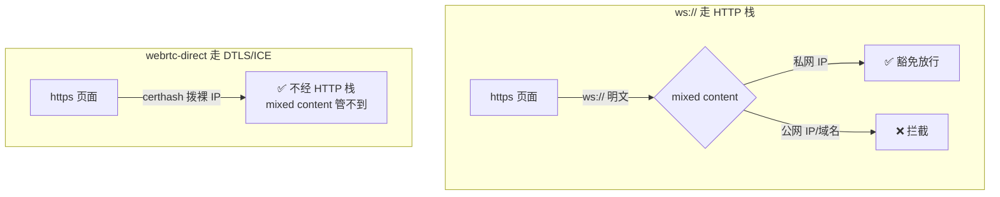

# mixed content 与私网 IP 豁免

> **讲什么**：https 页面连 http/ws:// 明文资源会被 mixed content 拦掉——但**私网 IP
> 字面量是豁免的**。webrtc-direct 则**根本不受** mixed content 约束（它不走 HTTP 栈）。
> 用本项目 spike 的 2×2 实证矩阵 + fetch 对照实验，把「豁免专属私网 IP」和「certhash
> 免域名的价值」讲清楚，并说明为什么「测私网连通」与「测 OPFS 落盘」不能在同一环境同时做。
>
> **为什么重要**：本项目「用户自建 relay 免域名、裸 IP 就能服务浏览器」的整个架构论据，
> 全压在两条 mixed content 断言上。这两条不是从规范推的，是**跑出来的**——理解它需要
> 分清规范默认、Chrome 的具体豁免、以及 WebRTC 为何是例外。

## 问题：https 页面怎么连局域网明文

第 01 篇的结论逼出一个两难：Web 端**必须** https 部署（否则 OPFS/crypto.subtle 没了），
但要连的 relay/helper 在局域网里，往往只能给出 `ws://192.168.x.x`（CA 不会给私网 IP 签证书，
物理上做不出 `wss://192.168.x.x`）。

直觉是「https 页面拨 `ws://` 明文，必被 mixed content 掐死」。整个自建 relay 的架构就卡在
这里——如果直觉成立，Web 端要么放弃 https（丢 OPFS），要么强制用户买域名。所以本项目
专门做了 spike（`spike/webrtc-direct-https/`）去实测这道门。

## 规则一：mixed content 默认拦明文

**mixed content**（混合内容）是 Web 平台的一条安全规则：一个 https 页面加载 http/ws://
明文子资源时，浏览器会拦截或升级（规范 W3C *Mixed Content*）。目的是防止「https 页面里
夹一段明文流量被中间人篡改」。

默认判据是 origin 的 **potentially trustworthy**（和 secure context 同一套可信度判定，
见 [01-secure-context.md](01-secure-context.md)）——明文 http/域名不可信，被拦。

## 规则二：私网 IP 字面量豁免

但 Chrome 的实现里有一条**豁免**（[libp2p-wasm.md](../../knowledge/libp2p-wasm.md) 引 Chrome 官方文档）：

> The request hostname is a private IP literal (e.g., `192.168.0.1`).

即：目标主机名是**私网 IP 字面量**时，不按 mixed content 拦。这就给了「https 页面拨
`ws://192.168.x.x`」一条活路。

**但这是 Chrome 的具体行为，不是普适规范保证**。所以本项目没有停在「文档说」，而是实测。

## spike 的 2×2 实证矩阵

`spike/webrtc-direct-https/` 用**同一份 wasm、同一个 libp2p 节点，唯一变量是页面协议**，
跑了 2×2（2026-07-17，Chrome）：

| 页面 origin | → `webrtc-direct`（裸 IP + certhash） | → `ws://`（私网 IP） |
|---|---|---|
| `http://192.168.50.105:8080` | ✅ RTT 300µs | ✅ RTT 500µs |
| **`https://192.168.50.105:8443`** | **✅ RTT 500µs** | **✅ RTT 200µs** |

右上角那格是关键：**https 页面拨 `ws://` 私网 IP，通了**（RTT 200µs）。豁免是真的。

## 对照实验：证明豁免专属私网 IP

只跑上面那张表还不够——万一是测试工具（`--ignore-https-errors` 之类）把 mixed content
整个关了，那张表就是假象。所以 spike 加了**对照实验**：从同一个 https 页面 `fetch`：

| 目标 | 结果 |
|---|---|
| `http://192.168.50.105:8080/`（私网 IP） | **放行** |
| `http://neverssl.com/`（公网明文） | **被拦**（`TypeError: Failed to fetch`） |

公网被拦 ⇒ **mixed content 确实在生效**，`--ignore-https-errors` 没把它关掉
（它只跳过证书校验，origin 仍是 `https://`）。私网 IP 放行 ⇒ **豁免是真的、且专属私网 IP**。

这个对照是方法论上的要点：**不做对照，就分不清「豁免」和「工具把门关了」**。
（spike README 坑 10 也强调：`--ignore-https-errors` 不影响 mixed content，但这条每次都得实测，
不能假设。）

## 规则三：webrtc-direct 根本不受 mixed content 约束

矩阵左右两列的对比揭示了更硬的一条：**`webrtc-direct` 四格全通**，包括 https 页面直拨裸 IP。

原因：**WebRTC 根本不走浏览器的 HTTP/fetch 栈**。它用 DTLS/ICE 自建连接，mixed content
是「HTTP 子资源」层面的规则，管不到 WebRTC。所以 webrtc-direct 拨任意 IP（公私都行）
都不被 mixed content 拦。

`webrtc-direct` 的地址形态 `/ip4/1.2.3.4/udp/1234/webrtc-direct/certhash/<hash>`——
**裸 IP + 自签证书哈希**，把信任从「CA 体系」搬进了 multiaddr 本身。certhash 免域名的价值
正在于此：

这就是本项目「用户自建**公网** relay 免域名」论据的地基：公网裸 IP + webrtc-direct，
一个裸 IP 就够，不必买域名配 Let's Encrypt。（矩阵右下角公网格未直接实测，但其前提
「WebRTC 不受 mixed content 约束」已由左下角坐实。）

## 张力：测私网连通与测 OPFS 落盘不可兼得

一个实战上的坑：**想同时测「mixed content 私网格」和「OPFS 落盘」，在一台机器上做不到。**

- 测 mixed content 私网格，需要**https 页面**去连**私网 IP**。
- 测 OPFS 落盘，需要 secure context（见第 01 篇）。
- https 页面本身是 secure context——听起来兼容。但难点在**证书**：给私网 IP 签一张
  浏览器信任的证书很麻烦（spike 用 `rcgen` 自签 SAN 覆盖 localhost + LAN IP，浏览器还要
  手动点「继续」），而这种自签环境下要稳定跑 OPFS 端到端很别扭。

所以本项目实际是**分开测**的：mixed content 矩阵在 `https://192.168.50.105`（自签）上跑；
OPFS 落盘端到端换 `http://localhost` / `127.0.0.1`（secure context 即使是 http，
证书零负担）跑。两个环境各测各的，别指望一个环境同时满足。

> 顺带澄清一个易混点：`http://192.168.x.x` **既过不了 secure context**（第 01 篇，
> OPFS 没了）**又**在被别人当目标连时才谈得上 mixed content。secure context 看的是
> **页面自己的 origin**，mixed content 看的是**页面去连的目标**——两道门，两个视角，
> 别混。

## 一道未拦、但明说要拦的门：LNA

Chrome 的 **Local Network Access（LNA）**（Chrome 142，2025-10-28 上线）会限制公网站点
访问私网 IP。但官方明确：WebSocket / WebTransport / WebRTC 连接**尚未纳入** LNA
权限门，会「soon」纳入（[libp2p-wasm.md](../../knowledge/libp2p-wasm.md) 引原文）。

⇒ **今天能用，未来一定会弹权限提示**（不是阻断，是用户点「允许」）。spike 没测到它，
因为 spike 的页面本身就在私网 IP 上（local→local，不触发 LNA）——要测得把页面挂到
真公网 HTTPS origin。产品上要提前设计授权引导，别等它突然冒出来。

## 附：certhash 为什么要跨重启稳定

webrtc-direct 的地址把证书哈希写进 multiaddr（`.../webrtc-direct/certhash/<h>`），
这意味着**证书一变，certhash 就变，之前分发出去的地址全部失效**。所以自签证书必须
**持久化**、跨进程重启保持同一张——否则 relay 重启一次，所有已发布的连接地址作废。

本项目内核对此有测试 + 冒烟壳实测：同一持久化证书两次 bind，certhash 一致
（[libp2p-wasm.md](../../knowledge/libp2p-wasm.md) 实测表 #4）。这是「裸 IP + certhash」
路线能作为稳定入口的前提——免了 CA，但把「证书稳定性」的责任接到了自己手上。

对照 `wss://` 路线：它的证书由 CA 体系背书，域名不变地址就不变，不必自己管持久化；
代价是必须有域名。两条路各自的负担正好互补——这也是第 02 篇那张传输对比表的底层账。

## 小结

- **mixed content**：https 页面默认拦 http/ws:// 明文子资源。判据是目标 origin 的可信度。
- **私网 IP 字面量豁免**（Chrome 实测）：`ws://192.168.x.x` 从 https 页面放行；对照实验
  （公网 http 被拦）证明豁免专属私网 IP，不是工具假象。
- **webrtc-direct 不受 mixed content 约束**：它走 DTLS/ICE 不经 HTTP 栈，certhash 免域名
  拨裸 IP——这是自建公网 relay 免域名论据的地基。
- **secure context（页面 origin）和 mixed content（连接目标）是两道门**，别混；也因此
  「测私网连通」和「测 OPFS 落盘」要分环境做。
- LNA 今天不拦 WS/WebRTC，但明说会拦——产品上要提前埋授权引导。

**下一篇** [04-readablestream-bridge.md](04-readablestream-bridge.md) 转到数据出口：
Rust 的事件流怎么交给 JS 消费。
