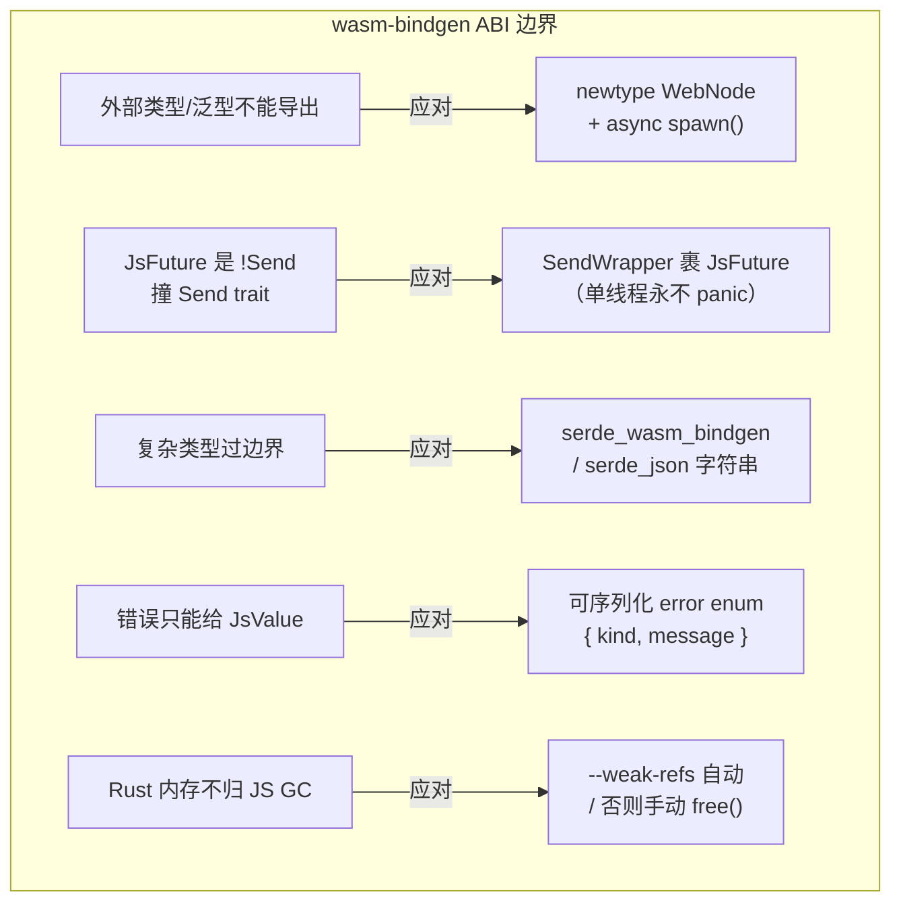

# wasm-bindgen 边界：newtype / SendWrapper / 序列化

> **讲什么**：把 Rust 对象暴露给 JS 时，wasm-bindgen 这层 ABI 强加的三类约束，以及本项目
> 各自的应对：① wasm-bindgen 不能给外部 crate 类型加标注、不支持泛型/生命周期 → **newtype
> 包一层**；② `!Send` 的 `JsValue` 撞上要求 `Send` 的 trait → **`SendWrapper` 裹 JsFuture**；
> ③ 错误别拍成字符串 → **可序列化 error enum**。外加 `--weak-refs` 的内存回收语义。
>
> **为什么重要**：这些不是风格选择，是 ABI 的硬边界。不理解它们，代码要么编不过
> （泛型导不出）、要么在特定线程模型下埋雷（SendWrapper panic）、要么前端拿不到可判别的
> 错误。这一篇把散落在 `crates/web` 各处的边界约束收成一张地图。
>
> **和 [rust-wasm/](../rust-wasm/) 的分工**：那个系列讲**工具链工程**（双 target、
> n0-future、git master pin、llvm）。本篇只讲 **wasm-bindgen 这层 ABI 的语义约束**，
> 不重复工具链。

## 约束一：newtype——因为 ABI 表达不了泛型和外部类型

wasm-bindgen 生成 JS↔Rust 的胶水代码，但它的表达力有限：

- **不能给外部 crate 的类型加 `#[wasm_bindgen]`**（孤儿规则 + 它要在类型定义处生成胶水）。
- **不支持泛型、不支持生命周期参数**——导出的类型/函数签名必须是具体、无生命周期的。

所以「把内核对象直接 `#[wasm_bindgen]` 导出」行不通。标准解法是 **newtype 包一层**：
在 Web 壳里定义一个自己的、具体的、无泛型的 wrapper，把内核对象藏在里面，wrapper 的方法
做「转类型 + 委托」。

本项目 `WebNode` 就是这个范式（`crates/web/src/node.rs`）：

```rust
#[wasm_bindgen]
pub struct WebNode {              // ← Web 壳自己的具体类型，可标 #[wasm_bindgen]
    endpoint: Endpoint,
    manager: Arc<TransferManager>, // ← 内核对象藏在字段里，不直接导出
    // ...
}

#[wasm_bindgen]
impl WebNode {
    pub async fn spawn() -> Result<WebNode, JsValue> { /* 装配所有端口 */ }
    pub async fn connect(&self, addr: String) -> Result<String, JsValue> { /* ... */ }
    pub async fn send_files(&self, to: String, files: Vec<File>) -> Result<String, JsValue> { /* ... */ }
    // 方法签名全是 String / Vec<File> / JsValue 这类 ABI 能表达的具体类型
}
```

两个衍生细节：

- **异步静态构造器叫 `spawn()`**。wasm-bindgen 生成的类型构造函数是 private，
  需要 async 初始化（这里要 `await` bind endpoint）的对象，走 `static async fn spawn()`——
  这是 iroh `browser-echo` / `browser-chat` 也用的范式（`EchoNode::spawn()`）。
- **方法参数/返回值只能是 ABI 可表达的类型**：`String`、`Vec<File>`、`web_sys::ReadableStream`、
  `JsValue`。复杂结构过边界要么 `serde_wasm_bindgen::to_value`（见约束三/第 04 篇），
  要么 `serde_json::to_string` 成字符串（`lookup_share_code` 就返回 JSON 字符串）。

## 约束二：SendWrapper——!Send 的 JsValue 撞上 Send trait

这是最微妙的一条。浏览器里一切 JS 互操作（OPFS、fetch、Promise）都经
`wasm_bindgen_futures::JsFuture`，而 **`JsFuture` 是 `!Send`**（内部持 `JsValue`，
不能跨线程）。

但本项目的端口 trait 是**平台中立**的，签名要求 `Send`（`#[async_trait]` + `: Send + Sync`，
桌面/移动端的多线程实现需要它）。于是矛盾出现：Web 实现 trait 方法体里 `.await` 一个
`!Send` 的 `JsFuture`，返回的 future 就不 `Send`，**满足不了 trait 约束**。

有两条路：改 trait（把 `Send` 约束 cfg 条件化），或改实现（把 `!Send` 的 future
裹成 `Send`）。本项目选后者——**`send_wrapper::SendWrapper`**，因为它**一个字都不用改
core 的 trait**（论证见 [storage-abstraction.md](../../knowledge/storage-abstraction.md)：
`?Send` 会病毒式传染击穿 22 处 `tokio::spawn`，cfg 别名方案要改掉全部 6 个 host trait）。

`SendWrapper<T>` 无条件实现 `Send + Sync`，代价是：**跨线程 access 或 drop 会 panic**。
在单线程 wasm（不开 atomics）下永不触发——这就是它安全的前提。

**安全形态**（`crates/web/src/file_access.rs` 的写法）：整段 async 一次裹住，内部不跨
让出点持有裸 `JsValue`：

```rust
async fn read_source_chunk(&self, source: &FileSourceId, offset: u64, length: usize)
    -> AppResult<Vec<u8>>
{
    // 所有 !Send 的 JsValue 都在 await 前拿到 promise 后即丢，
    // 只让 SendWrapper<JsFuture> 跨 await —— 保证返回的 future 满足端口的 Send。
    let promise = {
        let file = self.source(source)?;
        let blob = file.slice_with_f64_and_f64(offset as f64, (offset + length as u64) as f64)?;
        blob.array_buffer()          // ← JsValue 在这个块里用完就 drop
    };
    let buf = SendWrapper::new(JsFuture::from(promise)).await?;   // ← 只有它跨 await
    Ok(js_sys::Uint8Array::new(&buf).to_vec())
}
```

要点：**先把 `!Send` 的 `JsValue` 在一个块里用完 drop 掉，只让 `SendWrapper<JsFuture>`
跨越 `.await`**。整段 async 一次包裹、内部不在让出点上持裸 JsValue——这是让「返回的
future 是 Send」成立的关键写法。`finalize_sink` 里 `SendWrapper::new(write_opfs(...))`
同理，把整个跨多个 await、持 OPFS 句柄的 future 一次裹住。

连**存句柄的字段**都要裹：`OpfsFileAccess` 的 `sources` / `sinks` 是
`SendWrapper<RefCell<HashMap<...>>>`——因为里面存的 `web_sys::File` 也 `!Send`，
而结构体本身要 `Send + Sync` 才能进 `Arc<dyn FileAccess>`。

**代价必须写进注释 + CI 钉死 target**（本项目 `file_access.rs` 顶部就写了）：
一旦启用 wasm threads（atomics + shared memory），单线程假设破裂，SendWrapper 就从
「永不触发」变成「活雷」。CI 要保证 target 不带 `+atomics`。

## 约束三：错误用可序列化 enum，别拍字符串

wasm-bindgen 方法返回 `Result<T, JsValue>`，最省事的写法是把 `anyhow::Error` /
`to_string()` 拍成 `JsError::new(&s)`——iroh 官方例子的 `to_js_err` 就是这么干的。
**但这样前端拿到的错误只有一句人话，丢了机器可判别的 `kind`**，没法「对方拒收 → 弹 A、
网络失败 → 弹 B」地分支。

本项目定义了**可序列化的 error enum**（`crates/web/src/error.rs`），经 serde-wasm-bindgen
转成结构化 JS 对象 `{ kind, message }`：

```rust
#[derive(Debug, Clone, Serialize)]
#[serde(tag = "kind", rename_all = "camelCase")]   // ← kind 供 JS 分支，message 供展示
pub enum WebError {
    Identity { message: String },
    Network { message: String },
    Transfer { message: String },
    InvalidInput { message: String },
    NotFound { message: String },
    Storage { message: String },
}
```

`From<AppError> for WebError` 把内核错误按语义收敛到这几类，`to_js()` 用
`serde_wasm_bindgen::to_value` 序列化。前端就能读 `e.kind` 分支了（tag/camelCase 对齐
规则和第 04 篇的事件枚举完全一致）。

## 收尾：--weak-refs 与手动 free()

wasm-bindgen 导出的类型在 JS 里是「持有 Rust 内存指针的句柄」，Rust 那块内存**不归 JS GC
自动管**。回收有两条路，取决于构建时是否带 `--weak-refs`：

- 带 `--weak-refs`：生成 `FinalizationRegistry`，JS 对象被 GC 时**自动**释放 Rust 内存
  （尽力而为，时机不确定）；且挂 `Symbol.dispose` 支持 `using` 语法。
- 不带：JS 侧**必须手动 `obj.free()`**，否则 Rust 内存泄漏。

本项目 `WebNode` 走的是显式生命周期——`close(self)`（消费 `self`）关停节点。iroh 官方
例子构建时都带 `--weak-refs`（`browser-echo` 的 `build:release`），但 README 提醒
`build:wasm:release` 有时漏带——**构建 flag 影响的是内存回收语义，不是可有可无的优化**。
（具体构建命令属工具链，归 [rust-wasm/](../rust-wasm/)。）

## 一张边界地图



## 小结

- **newtype 是必需的**（不是风格）：wasm-bindgen 不能标外部类型、不支持泛型/生命周期 →
  `WebNode` 包一层，async 初始化走 `static spawn()`。
- **SendWrapper 裹 JsFuture** 让 `!Send` 的 JS 互操作满足平台中立 trait 的 `Send` 约束，
  core 零改动；安全前提是**单线程 wasm**——写法上「JsValue 用完即 drop，只让
  SendWrapper 跨 await」，注释钉死单线程假设 + CI 禁 atomics。
- **错误用可序列化 enum**（`{ kind, message }`）而非拍字符串，前端才能按 `kind` 分支。
- `--weak-refs` 决定 Rust 内存是自动回收还是必须手动 `free()`——构建 flag 关乎正确性。

**回到起点**：这一系列的六篇覆盖了把 Rust 传输内核搬进浏览器时，网络之外的全部 Web 平台
门槛——OPFS 落盘、secure context、能否 listen、mixed content、事件流桥、wasm-bindgen 边界。
总览见 [README.md](README.md)。
