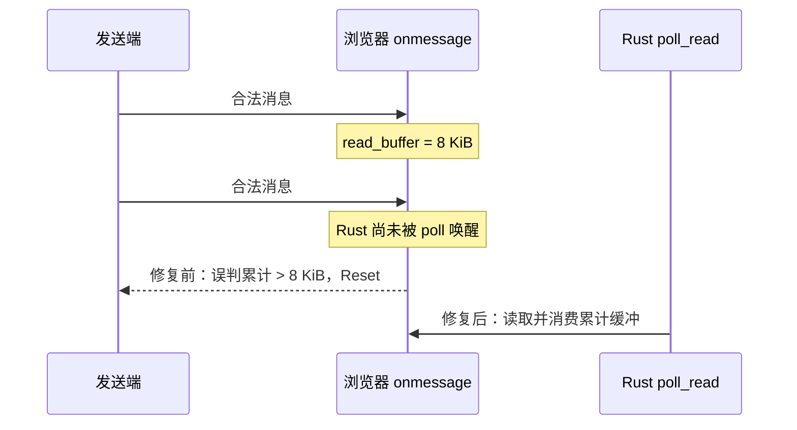

# 一次 DataChannel 误判：8 KiB 单帧限制不等于 8 KiB 接收缓冲

> 2026-07-25 浏览器对浏览器传文件故障复盘。控制面、relay reservation、offer/accept 都成功，
> 接收端却立刻 `unexpected end of file`。最终根因在 `libp2p-webrtc-websys`：把“单条消息的
> 协商上限”错误地复用为“浏览器回调累计读取缓冲上限”。

这是一个典型的 wasm 运行时问题：native 测试和编译都不能证明浏览器事件循环下的行为正确，必须
用两个真实浏览器页面经公网 relay 传文件验证。

## 症状：控制面全绿，数据面刚启动就被中断

发送端和接收端先后出现：

```text
offer 已发出
transferAccepted
transfer-data 发送中断: ... connection is closed

Data-channel receive interrupted: ... unexpected end of file
```

relay 的 reset、`ResourceLimitExceeded`、以及：

```text
libp2p_webrtc_utils::stream::drop_listener:
Stream dropped without graceful close, sending Reset
```

都是流已经被浏览器端重置后的下游现象。真正决定方向的一行是随后加到 Websys 的日志：

```text
libp2p_webrtc_websys::stream::poll_data_channel:
Remote is overloading us with messages, resetting stream
```

它表明不是 relay 带宽、Noise、邀请协议或文件校验错误，而是接收方在本地主动关闭了 WebRTC
stream。

## 先厘清三个不同的“大小”

| 名称 | 所在层 | 本次值 | 职责 |
|---|---|---:|---|
| `CHUNK_SIZE` | SwarmDrop 文件/bao 层 | 256 KiB | 文件如何分块、校验与续传 |
| `max_message_size` | libp2p WebRTC framing 层 | 8 KiB | 单条编码后 DataChannel 消息的最大大小；连接双方协商 |
| `read_buffer` | `webrtc-websys` 浏览器回调层 | 修复前误用 8 KiB | 已到达 JS 回调、尚未被 Rust `poll_read` 消费的**累计**字节 |

这三个量都合理，但绝不能互相替代。应用层 256 KiB chunk 会被 framing 层拆为许多不超过 8 KiB
的 DataChannel 消息；一次浏览器事件循环又可能在 Rust 获得运行机会前连续收到了多条这样的合法消息。

## 根因：一次正确的连接协商，被错误套到了本地队列

为了解决浏览器与原生端对 DataChannel message size 的兼容性，fork 中引入了连接级
`StreamConfig::max_message_size()`，并将 SwarmDrop 的 WebRTC 单帧上限设为 8 KiB。这一部分是
正确的：它同时约束 framing、发送端高水位和双方协商，避免对方收到大于自身能力的单条消息。

问题出在 Websys `onmessage` 回调原本的保护逻辑：

```rust
if read_buffer.len() + data.length() as usize > config.max_message_size() {
    overloaded.store(true, Ordering::SeqCst);
    // reset stream
}
```

在旧实现中该阈值恰好是固定 16 KiB；引入 8 KiB 协商后它改成了 8 KiB。于是：

1. 第一条 8 KiB（或接近 8 KiB）消息进入 `read_buffer`，仍合法；
2. wasm 单线程中，延后的 Rust wake 尚未执行；
3. 第二条同样合法的消息到达 JS `onmessage`；
4. 累计缓冲超过 8 KiB，被错误视为远端滥发；
5. 接收端 reset，发送端看到 `connection is closed`，接收端看到 EOF。

这里没有任何一条消息越过协商上限；错误只是把**每条消息的协议约束**当成了**本地队列的资源约束**。



## 修复：两个边界各管一件事

本地 `yexiyue/rust-libp2p` fork 提交 `c4c2c167` 的改动保持协议 API 不变：

```rust
const DEFAULT_MAX_READ_BUFFER_SIZE: usize = 256 * 1024;

fn max_read_buffer_size(config: StreamConfig) -> usize {
    max(DEFAULT_MAX_READ_BUFFER_SIZE, config.max_message_size())
}
```

`onmessage` 只在累计字节超过这个**独立且有界**的本地容量时才拒绝数据。它仍不会无界增长，且当
调用者把单帧协商值设得比 256 KiB 更大时，缓冲至少容纳一条合法消息。

补了三个单元测试：

- 两条连续的合法 8 KiB 消息不会误触发 overload；
- 256 KiB 上限仍然有效；
- 大于 256 KiB 的合法单帧配置会相应提高缓冲下限。

同时在 `StreamConfig` 文档中明确：它约束 framing 与发送背压，不约束 transport 私有的累计接收队列。

## `flush()`：不是根因，也不应成为浏览器特例

排查中曾出现：

```text
Uncaught Error: closure invoked recursively or after being dropped
```

这是 Websys 旧的 `bufferedamountlow` 回调生命周期/唤醒时机问题。上游修复 #6558 将回调 wake
延后，避免 wasm 单线程在 Closure 仍执行时重入或在 Closure 已释放后再次调用。

曾经为了绕过该症状，业务层在 wasm 下跳过每帧 `writer.flush()`。这不是正确的长期方案：它把
transport 回调问题泄露成业务层的 target 条件分支，也丢失了 flush 的完成与背压语义。

最终做法是：

1. 使用含回调生命周期修复的 fork；
2. 修正累计 `read_buffer` 的独立上限；
3. 在 `write_frame` 中恢复所有 target 统一的 `writer.flush().await`；
4. 以一个会在 `poll_flush` 返回错误的 writer 做回归测试，确保未来不会悄悄移除 flush。

`Stream dropped without graceful close, sending Reset` 在 stream 被主动丢弃、取消或异常结束时可能是
预期诊断；它不应单独被当作根因。应优先找它之前第一条“谁发起 reset、为什么”的日志。

## 排障方法：从首个主动错误反推，不调大 relay 限制

这次有效的顺序是：

1. 将发送端、接收端和 relay 的日志按同一 `session_id` 对齐；
2. 区分控制面（配对、offer、accept）与数据面（打开 stream、首帧、连续帧）；
3. 在 Websys 的 `onmessage`、data-channel 创建/释放、stream reset 处添加最小日志；
4. 找到第一条主动失败：`Remote is overloading us`；
5. 将其与 8 KiB 连接配置、事件循环延后 wake 对照；
6. 写出“多个合法消息先入队”的回归测试；
7. 只重新构建 wasm 并部署 try 页面，用两个真实浏览器复验。

不能用下面这些现象直接下结论：

- Relay 记录 reset，不等于 relay 是根因；
- 接收端 EOF，不等于发送端编码有误；
- `drop_listener` 的 Reset，不等于必须关闭 graceful-close 日志；
- native 传输测试通过，不等于 wasm 回调调度正确；
- 单文件小样本成功，不等于连续帧和多文件场景不会触发队列边界。

## 最终验证与发布边界

修复后本地通过：

- `cargo test -p libp2p-webrtc-websys`（含新增回归测试）；
- `cargo check -p libp2p-webrtc-websys --target wasm32-unknown-unknown`；
- `cargo check -p swarmdrop-web`；
- `cargo test -p swarmdrop-transfer`（59 项）；
- `pnpm build:wasm` 与文档生产构建。

SwarmDrop 提交 `6ddb550` 将 fork revision、统一 flush 和新 wasm 一起提交；GitHub Pages 成功重建并
发布 try 页面。该缺陷在 `webrtc-websys` 浏览器实现中，relay 与桌面/移动原生二进制不因这次修复
而需要重新发布。

## 经验沉淀

1. 协商值首先是协议边界；本地资源边界需要独立命名、独立配置、独立测试。
2. 浏览器 callback 与 Rust future 之间至少隔着一次事件循环调度，不能假定“每来一条消息就立即
   `poll_read` 一次”。
3. wasm 特例必须落在 transport/平台适配层；业务协议层应尽量保持同一语义。
4. 先找到第一个主动 reset，再解释后续所有 EOF、relay reset 和资源告警。
5. 对浏览器 P2P，CI 编译是必要条件，两个真实页面经真实 relay 的端到端传输才是完成条件。

## 相关材料

- [公网 Relay 与浏览器入口复盘](../network/2026-07-public-relay-and-browser-entry.md)
- [`dev-notes/knowledge/net-kernel.md`](../../knowledge/net-kernel.md)
- [wasm 调试系列](../wasm-debugging/)
- fork：`yexiyue/rust-libp2p@c4c2c167`
