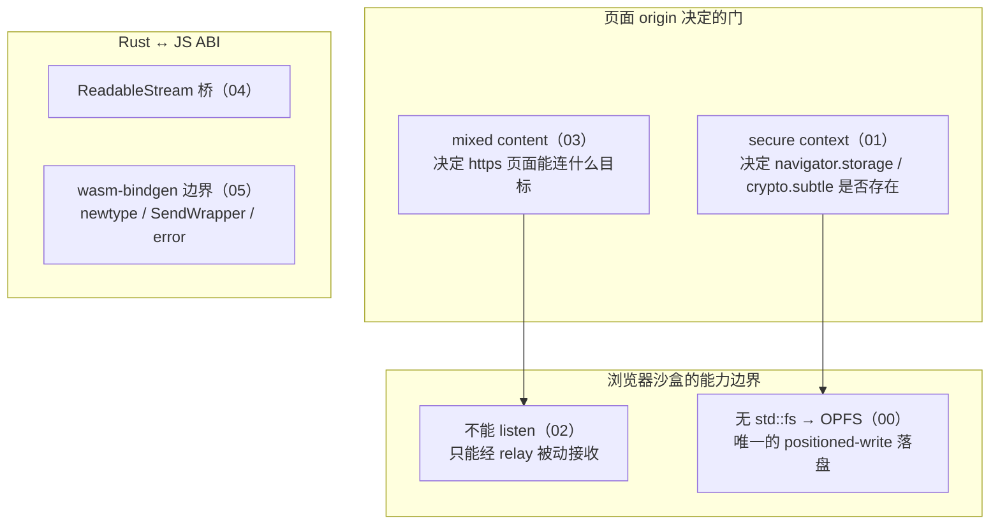

# browser-platform —— 浏览器平台知识

> 把 Rust 传输内核搬进浏览器，**网络协议之外**要过的那一整排 Web 平台门槛。
> 每篇聚焦一个内聚知识点，讲的是**通用 Web 平台知识**（不特定于本项目），用 SwarmDrop
> 的 `crates/web`、`spike/webrtc-direct-https`、以及知识库实测作为佐证。
>
> 面向想补齐「浏览器底层认知」的读者——libp2p / 桌面背景、第一次认真做 Web 端的人。

## 为什么单独成系列

Rust 编到 wasm 能不能跑，是**工具链**问题（见姊妹系列 [rust-wasm/](../rust-wasm/)）。
但「编过」之后，代码要真正在浏览器里工作，撞上的是另一批东西：文件往哪写、哪些 API
在什么 origin 下才存在、浏览器能不能收连接、https 页面能连什么、Rust 的流怎么给 JS。
这些**不是 libp2p 的事，也不是 Rust 的事，是 Web 平台本身的规则**。本系列专收这一类。

每条平台事实都标了依据：**规范/MDN 概念** vs **本项目实测**（凡「实测」均来自
`spike/` 或知识库里真跑过浏览器的记录），两者不混。

## 篇目

| # | 篇 | 一句话 |
|---|---|---|
| 00 | [OPFS：浏览器里的私有文件系统](00-opfs.md) | 断点续传的落盘地基；主线程 async vs Worker-only SyncAccessHandle 的线程冲突 |
| 01 | [secure context：谁是 trustworthy origin](01-secure-context.md) | 白名单精确边界；http 私网 IP 不在内 → OPFS/crypto.subtle 变 undefined 的惨案 |
| 02 | [浏览器能 listen 吗](02-webrtc-websocket-in-browser.md) | 不能 listen，但能经 circuit relay 被动接收；两种 websys transport 的边界 |
| 03 | [mixed content 与私网 IP 豁免](03-mixed-content-private-ip.md) | https 页面拨明文的规则；私网 IP 豁免与 webrtc-direct 免疫的 2×2 实证 |
| 04 | [Rust Stream → JS ReadableStream](04-readablestream-bridge.md) | 事件流的桥；单 reader 约束、serde tag/camelCase 对齐、无自动 TS 类型 |
| 05 | [wasm-bindgen 边界](05-wasm-bindgen-boundary.md) | newtype / SendWrapper / 可序列化 error / --weak-refs 四类 ABI 约束 |

## 阅读顺序

- **顺读 00→05** 最完整：落盘（00）→ 落盘的前置门（01）→ 网络可达性（02）→ 连接怎么过门（03）
  → 数据出口（04）→ 整个 wasm↔JS 边界（05）。
- 只关心**存储**：00 → 01。
- 只关心**网络门**：02 → 03。
- 只关心 **Rust↔JS ABI**：04 → 05。

## 一张全景图

## 和姊妹系列的边界

本系列属 SwarmDrop 网络内核重构系列（见 [../2026-07-net-refactor-series.md](../2026-07-net-refactor-series.md)）的一支，
与其他四支互不重复：

- **[rust-wasm/](../rust-wasm/)** —— wasm **工程**：双 target、n0-future、libp2p git master、
  工具链。本系列讲平台**行为**，不重复工具链。
- **[wasm-debugging/](../wasm-debugging/)** —— 四道 wasm 运行时门的**调试复盘**。本系列的
  01（secure context = 门 4）只讲平台事实，调试叙事在那边。
- **[network-kernel/](../network-kernel/)** —— iroh 风格架构重构。
- **[transfer-architecture/](../transfer-architecture/)** —— 传输域端口抽象、bao。

## 主要素材出处

- `dev-notes/knowledge/libp2p-wasm.md` —— 四道门、mixed content 私网豁免实测、secure context 惨案
- `dev-notes/knowledge/storage-abstraction.md` —— SendWrapper 免改 trait、浏览器无 SQLite
- `.claude/skills/iroh/references/06-wasm-browser.md` —— 浏览器不能 listen、MemStore、ReadableStream 范式
- `spike/webrtc-direct-https/` —— mixed content 2×2 矩阵 + fetch 对照
- `crates/web/src/{file_access,events,node,error}.rs`、`static/index.html` —— 本项目 Web 壳实现
