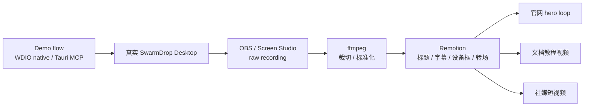
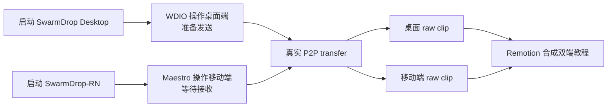
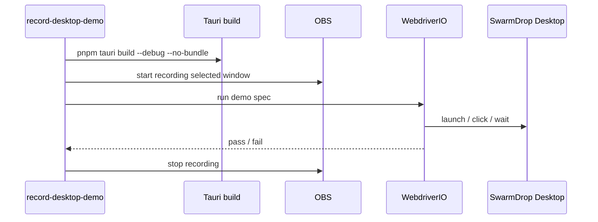

# SwarmDrop 桌面端录制流水线：把 E2E flow 变成官网和教程素材

这篇只讲录制，不讲如何接入桌面 E2E。E2E 测试见 [desktop-webdriver-e2e.md](./desktop-webdriver-e2e.md)。

录制的核心原则是：

> 录屏软件只负责采集画面，用户路径应该由脚本驱动。

如果流程靠手点，视频很快会变成一次性素材：改了 UI 要重录，换语言要重录，官网要横版、短视频要竖版也要重录。SwarmDrop 桌面端应该把素材生产变成流水线：用 WDIO 或 Tauri MCP 操作真实应用，用 OBS / Screen Studio 录制窗口，用 Remotion 做统一包装。

## 总体链路



和 E2E 的区别：

| 类型 | 目标 | 写法 |
|---|---|---|
| smoke flow | 抓 bug | 断言硬、等待短、失败敏感 |
| demo flow | 录素材 | 数据稳定、节奏舒服、画面干净 |

同一条用户路径可以同时有两个版本：一个负责测试，一个负责展示。

## 工具分工

| 工具 | 位置 | 负责什么 |
|---|---|---|
| WDIO browser mode | 前端快速层 | 准备和验证 renderer 状态，不直接录官网素材 |
| WDIO native mode | 桌面自动化层 | 启动真实 Tauri App、点击、等待、截图 |
| Tauri MCP Bridge | AI 临场操作层 | 手工探索、调试当前窗口、临时操作 |
| OBS | 可脚本化录制层 | 免费、可控、适合自动开始/停止 |
| Screen Studio | 高质量手工录制层 | 自动缩放、鼠标动画、产品 demo 好看 |
| ffmpeg | 标准化层 | 裁切、转码、统一帧率和尺寸 |
| Remotion | 合成层 | 品牌包装、字幕、分辨率、多语言、多画幅 |

短期追求效率：Screen Studio + WDIO demo spec。

长期追求可重复：OBS + WDIO demo spec + Remotion。

## 为什么录制要用 native mode

WDIO browser mode 很适合前端测试，但官网和教程素材应该优先录真实桌面壳：

- 用户看到的是 Tauri 窗口，不是 Chrome；
- 窗口尺寸、标题栏、系统文件选择器都属于产品体验；
- native notification、open-with、托盘、文件操作只能在真实宿主里确认；
- 后续和移动端并排展示时，桌面端画面应该是真实 App。

所以录制链路里：

- browser mode 用于快速验证 demo UI 状态；
- native mode 或 Tauri MCP 用于驱动真实 App；
- OBS / Screen Studio 负责采集真实窗口。

## demo flow 写法

demo flow 不要写得像测试用例。它应该像分镜脚本：

```typescript
import { browser, expect, $ } from '@wdio/globals';

describe('SwarmDrop desktop send-file demo', () => {
  it('shows the send entry and device selection path', async () => {
    await expect($('body')).toBeDisplayed();

    await browser.pause(800);
    await browser.saveScreenshot('build/wdio/screenshots/demo-home.png');

    await $('[data-testid="send-files-action"]').click();

    await browser.pause(800);
    await browser.saveScreenshot('build/wdio/screenshots/demo-send-sheet.png');
  });
});
```

demo spec 的特点：

- 等动画结束，不抢节奏；
- 用稳定 fixture；
- 少用失败敏感的细碎断言；
- 每个视觉段落保存截图；
- 每条视频只覆盖一个清晰场景；
- 控制在 10 到 30 秒内。

## 推荐素材场景

### `desktop-home.demo`

展示 SwarmDrop 桌面端首页。

画面：

- 设备信息；
- 网络状态；
- 发送入口；
- 收件箱或历史入口。

用途：

- 官网 hero；
- README 首屏图；
- 宣传短片开场。

### `send-file.demo`

展示桌面端发送文件。

画面：

- 点击发送；
- 选择 fixture 文件；
- 出现设备选择或发送确认；
- 进入传输进度。

用途：

- 官网功能段落；
- 文档教程；
- 移动端联动视频的一半。

### `inbox.demo`

展示收件箱和历史。

画面：

- 打开收件箱；
- 展示 demo 文件；
- 打开操作菜单；
- 展示“在文件夹中显示”这类桌面能力。

用途：

- 功能介绍；
- 教程中的“收到后在哪里找”。

### `desktop-mobile-transfer.demo`

展示桌面和移动端真实联动。

这条不应该塞进单个 WDIO spec，而是用外层 orchestrator：



这条视频最适合放官网：桌面发送，手机接收，能直接解释 SwarmDrop 是什么。

## fixture 和 demo 数据

不要用真实用户数据录官网素材。建议固定一个 demo 数据目录：

```text
e2e/desktop/fixtures/
├── demo-report.pdf
├── design-preview.png
├── release-notes.md
└── unicode-文件名.txt
```

命名要求：

- 文件名真实，但不要泄露公司或个人信息；
- 文件大小小而稳定；
- 覆盖常见类型：PDF、图片、Markdown、中文文件名；
- 不要依赖 Downloads 里临时存在的文件。

如果需要固定收件箱状态，可以增加 debug-only seed 命令或测试 profile。录制前先把应用带到可预期状态。

## 产物目录

建议统一放在 `build/` 下，不要散落到桌面：

```text
build/
├── wdio/
│   └── screenshots/
├── desktop-recordings/
│   ├── raw/
│   └── normalized/
└── remotion/
    └── rendered/
```

职责：

- `build/wdio/screenshots`：关键状态截图，方便 AI 和人复盘；
- `build/desktop-recordings/raw`：OBS / Screen Studio 原始视频；
- `build/desktop-recordings/normalized`：裁切、转码后的中间素材；
- `build/remotion/rendered`：最终可发布视频。

## 三个阶段

### 阶段一：半手工录制

适合第一批官网素材。

流程：

1. 构建或启动 SwarmDrop desktop；
2. 打开 Screen Studio；
3. 开始录窗口；
4. 跑 WDIO demo spec 或让 AI 用 Tauri MCP 操作；
5. 停止录制；
6. 手工导出 MP4。

优点：最快，画面好看。

缺点：批量重录不方便。

### 阶段二：OBS 脚本化

适合反复生成素材。

流程：



优点：可重复、可批量、适合 CI 或 release 前素材刷新。

缺点：OBS 场景、窗口捕获和权限要先配好。

### 阶段三：Remotion 统一合成

适合最终官网和教程输出。

Remotion 不负责点击按钮，它负责把 raw clips 包装成发布素材：

- 加标题；
- 加步骤字幕；
- 加品牌色背景；
- 加桌面窗口框；
- 合并移动端 Maestro 视频；
- 输出 16:9、9:16、1:1；
- 输出不同语言版本。

合成配置可以参数化：

```text
input: build/desktop-recordings/normalized/send-file.mp4
title: Send files across your own devices
captionTrack: captions/en/send-file.json
output:
  - website-hero.mp4
  - docs-step.mp4
  - social-short.mp4
```

## Screen Studio 还是 OBS

| 工具 | 适合 | 不适合 |
|---|---|---|
| Screen Studio | 第一批高质量官网素材、手工产品 demo | 全自动批量重录 |
| OBS | 可脚本化录制、长期素材流水线 | 开箱即漂亮的自动缩放和鼠标动画 |

我的建议：

- 第一版官网素材：Screen Studio；
- 稳定后要反复生成：OBS；
- 最终品牌包装：Remotion。

## 录制前检查清单

- 关闭系统通知；
- 清理桌面和无关窗口；
- 固定窗口尺寸；
- 固定 demo 数据；
- 确认 app 语言；
- 确认主题颜色；
- 确认网络状态；
- 确认接收端设备在线；
- 确认 OBS / Screen Studio 有屏幕录制权限；
- 先跑一遍 WDIO demo spec，确保不会卡住。

## 常见坑

### 录到的是 Chrome，不是真实桌面壳

这是用了 browser mode。官网和教程素材优先用 native mode 或 Tauri MCP 驱动真实 App。

### 录屏黑屏

通常是 macOS 屏幕录制权限或 OBS source 配置问题。先给 OBS / Screen Studio 授权，再确认捕获的是正确窗口或显示器。

### selector 变了导致 demo 卡住

demo flow 必须用稳定 `data-testid`，不要靠长文案或视觉层级。

### 节奏太快

测试可以快，demo 不能快。demo spec 里可以保留 `browser.pause()`，也可以等待动画结束和状态稳定。

### 素材不统一

把 raw、normalized、rendered 分开存，所有最终发布都从 Remotion 输出，不要每条视频手工裁不同尺寸。

## 推荐落地顺序

第一阶段，先做两条可录 demo：

1. `desktop-home.demo`；
2. `send-file.demo`；
3. 用 Screen Studio 手工录第一版；
4. 用截图确认关键画面。

第二阶段，接 OBS：

1. 固定 OBS 场景；
2. 固定窗口尺寸；
3. 写 `record-desktop-demo` 脚本；
4. 跑 WDIO demo spec；
5. 产出 raw clip。

第三阶段，接 Remotion：

1. 建立桌面视频模板；
2. 加字幕和标题；
3. 输出官网 hero 和教程版本；
4. 加移动端 Maestro 视频合成双端演示。

## 参考资料

- [desktop-webdriver-e2e.md](./desktop-webdriver-e2e.md)
- [WebdriverIO Tauri browser mode](https://github.com/webdriverio/desktop-mobile/blob/main/packages/tauri-service/docs/browser-mode.md)
- [Tauri WebDriver](https://v2.tauri.app/develop/tests/webdriver/)
- [Remotion](https://www.remotion.dev/)
