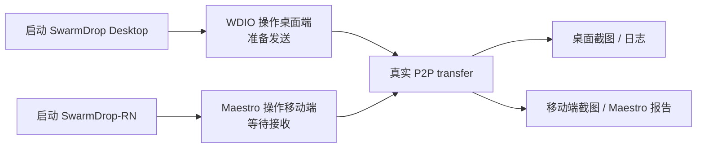

# SwarmDrop 桌面端 E2E：用 WebdriverIO 统一 browser mode 和 native mode

移动端用 Maestro 之后，SwarmDrop-RN 的 UI 验证可以变成可提交、可重跑、可被 AI 读取的 flow。桌面端也需要同样的能力，但它面对的是 Tauri：前端是 Web，宿主是真实桌面 App。

这篇只讲桌面端 E2E 测试，不讲录制和视频后期。录制流水线单独放在 [desktop-demo-recording-pipeline.md](./desktop-demo-recording-pipeline.md)。

## 目标

桌面端 E2E 要解决三件事：

- 快速验证 renderer：页面、路由、状态、Tauri command 参数；
- 验证真实桌面壳：Tauri binary、native webview、窗口、真实 IPC、日志；
- 给 AI 和 CI 留下稳定证据：截图、失败日志、可复跑 spec。

推荐主线是 WebdriverIO + `@wdio/tauri-service`，用同一套测试栈覆盖两种模式：

| 模式 | 跑在哪里 | 用途 |
|---|---|---|
| browser mode | Chrome + Vite dev server | 快速验证前端 UI，mock `invoke()` 和 event |
| native mode | 真实 Tauri binary + native webview | 验证桌面壳、真实 IPC、窗口、日志 |

这意味着 SwarmDrop 不需要再单独引入 Playwright 作为主路径。Playwright 仍然可用，但 WDIO browser mode 更贴合 Tauri，因为它能在 `window.__TAURI_INTERNALS__.invoke()` 边界 mock command，并且和 native mode 共用 runner、selector、spec 组织方式。

## 概念

### WebDriver

WebDriver 是标准自动化协议。它不负责录屏，而是负责让外部程序控制浏览器或 webview：

- 找元素；
- 点击、输入、按键；
- 等待页面状态；
- 截图；
- 执行脚本；
- 管理窗口。

### WebdriverIO

WebdriverIO 是 Node.js 里的测试运行器和自动化 API。它负责组织 spec、启动服务、提供 `browser`、`$`、`expect` 等 API，并输出报告。

### `@wdio/tauri-service`

`@wdio/tauri-service` 是 WebdriverIO 的 Tauri 适配层。它提供两条路：

- browser mode：不启动 Tauri binary，只跑 Vite dev server；
- native mode：启动真实 Tauri App，并通过 WebDriver 驱动 native webview。

### `tauri-plugin-wdio-webdriver`

这是 embedded provider 需要的 Tauri 插件。它把 WebDriver server 放进 Tauri debug build 里，让 WDIO 能驱动真实 native webview。macOS 没有系统级 WKWebView driver，这条路线尤其重要。

### `tauri-plugin-wdio`

这是更高阶的 Tauri 集成插件。它提供：

- `browser.tauri.execute()`；
- command / IPC mock；
- frontend log capture；
- backend log capture；
- window 状态读取。

如果只是 browser mode 或基础 native smoke，可以先不接。需要真实 Tauri bridge 能力时再接。

## 推荐目录

建议把桌面 E2E 放到独立目录：

```text
e2e/
└── desktop/
    ├── wdio.browser.conf.ts
    ├── wdio.conf.ts
    ├── specs/
    │   ├── renderer.browser.spec.ts
    │   ├── launch.smoke.spec.ts
    │   └── send-file.native.spec.ts
    └── fixtures/
        └── demo-file.txt
```

对应脚本可以是：

```json
{
  "scripts": {
    "test:desktop:browser": "wdio run e2e/desktop/wdio.browser.conf.ts",
    "build:desktop:e2e": "tauri build --debug --no-bundle",
    "test:desktop:e2e": "wdio run e2e/desktop/wdio.conf.ts"
  }
}
```

## browser mode

SwarmDrop 的 Tauri dev server 是：

```json
{
  "build": {
    "devUrl": "http://localhost:1420"
  }
}
```

browser mode 可以直接跑这个 dev server：

```typescript
// e2e/desktop/wdio.browser.conf.ts
export const config: WebdriverIO.Config = {
  runner: 'local',
  specs: ['./e2e/desktop/specs/**/*.browser.spec.ts'],
  framework: 'mocha',
  reporters: ['spec'],
  services: [
    [
      '@wdio/tauri-service',
      {
        mode: 'browser',
        devServerUrl: 'http://localhost:1420',
        devServer: 'pnpm dev',
      },
    ],
  ],
  capabilities: [{ browserName: 'tauri' }],
};
```

browser mode 的优点：

- 不需要构建 Tauri binary；
- 不需要 `tauri-driver`、WebKitWebDriver 或 msedgedriver；
- 反馈快，适合日常 UI 改动；
- 可以用 Chrome DevTools 和 Vite HMR；
- 可以 mock `invoke()`；
- 可以断言 Tauri command 调用参数；
- Tauri event API 也可以通过 in-page registry 测试。

一个典型 spec：

```typescript
import { browser, expect, $ } from '@wdio/globals';

describe('Send file renderer flow', () => {
  it('calls prepare_send with selected files', async () => {
    const mockPrepareSend = await browser.tauri.mock('prepare_send');
    await mockPrepareSend.mockResolvedValue({
      sessionId: 'demo-session',
      fileCount: 1,
    });

    await browser.url('http://localhost:1420');
    await $('[data-testid="send-files-action"]').click();

    await mockPrepareSend.update();
    await expect(mockPrepareSend).toHaveBeenCalledTimes(1);
  });
});
```

browser mode 适合验证：

- 页面布局；
- 路由和状态切换；
- 空状态；
- 设置页；
- renderer 是否用正确参数调用 Tauri command；
- renderer 是否能处理 mock 后端响应；
- 前端事件订阅和主动 `emit()`。

browser mode 不适合验证：

- 真实 Tauri IPC；
- 真实 Rust backend；
- 系统文件选择器；
- 托盘；
- deep link / open-with；
- 多窗口；
- backend log capture；
- `browser.tauri.execute()`。

如果报 `unmocked Tauri command`，说明 renderer 调用了某个 `invoke(command)`，但测试没有为这个 command 注册 mock。先用 `browser.tauri.mock(command)` 定义返回值，再触发 UI。

还要注意：browser mode 注入脚本默认在页面加载完成后注入。如果应用在模块初始化阶段就调用 `invoke()`，可能早于 mock 注册。遇到这种情况，要么调整启动路径，要么按 browser mode 文档建议，在 Vite dev build 更早阶段注入测试脚本。

## native mode

native mode 驱动真实 Tauri binary。它用于验证桌面宿主层，不是前端快速测试的替代品。

### 安装依赖

WDIO 侧：

```bash
pnpm add -D @wdio/cli @wdio/tauri-service @wdio/tauri-plugin tsx
```

Tauri 侧 embedded provider：

```bash
cd src-tauri
cargo add tauri-plugin-wdio-webdriver
```

如果要使用 `browser.tauri.execute()`、日志捕获、窗口状态等能力：

```bash
cd src-tauri
cargo add tauri-plugin-wdio
```

这些是普通 dependency，不是 Rust dev-dependency。debug 版 Tauri binary 要能链接这些插件，只是注册时用 `#[cfg(debug_assertions)]` 限制到 debug build。

### 注册插件

SwarmDrop 现在已经在 debug build 注册 `tauri-plugin-mcp-bridge`。WDIO 插件也应该沿用同一原则，只在 debug build 注册：

```rust
#[cfg(debug_assertions)]
let builder = builder
    .plugin(tauri_plugin_mcp_bridge::init())
    .plugin(tauri_plugin_wdio_webdriver::init())
    .plugin(tauri_plugin_wdio::init());
```

如果只启用 embedded WebDriver，不使用 `browser.tauri.execute()`、mock 和日志能力，可以先只注册 `tauri_plugin_wdio_webdriver`。

### 配置 capabilities

SwarmDrop 的 capability 文件是：

```text
src-tauri/capabilities/default.json
```

接入 WDIO 时需要追加类似权限：

```json
"wdio-webdriver:default",
"wdio:default"
```

只用了 embedded WebDriver server 时，可以先只加 `wdio-webdriver:default`。启用 `tauri-plugin-wdio` 后再加 `wdio:default` 或更细粒度的 `wdio:allow-*` 权限。

### 确认 `withGlobalTauri`

`tauri-plugin-wdio` 的前端集成依赖 Tauri global API。SwarmDrop 当前已经开启：

```json
{
  "app": {
    "withGlobalTauri": true
  }
}
```

### 前端入口

如果使用 `tauri-plugin-wdio`，需要在前端入口导入：

```typescript
if (import.meta.env.DEV) {
  await import('@wdio/tauri-plugin');
}
```

生产构建不需要暴露测试集成。

### native 配置

```typescript
// e2e/desktop/wdio.conf.ts
export const config: WebdriverIO.Config = {
  runner: 'local',
  specs: ['./e2e/desktop/specs/**/*.native.spec.ts'],
  maxInstances: 1,
  framework: 'mocha',
  reporters: ['spec'],
  mochaOpts: {
    ui: 'bdd',
    timeout: 60_000,
  },
  services: [
    [
      '@wdio/tauri-service',
      {
        appBinaryPath: './src-tauri/target/debug/swarmdrop',
        driverProvider: 'embedded',
      },
    ],
  ],
};
```

跑 native spec 前先构建 debug binary：

```bash
pnpm tauri build --debug --no-bundle
```

第一个 smoke spec：

```typescript
import { browser, expect, $ } from '@wdio/globals';

describe('SwarmDrop desktop launch', () => {
  it('opens the main window', async () => {
    const body = await $('body');

    await expect(body).toBeDisplayed();
    await browser.saveScreenshot('build/wdio/screenshots/launch.png');
  });
});
```

第一条 native spec 只证明闭环：

1. debug binary 能构建；
2. WDIO 能启动真实 Tauri App；
3. WebDriver 能连上 native webview；
4. 截图产物能落到固定目录。

## Tauri MCP 的位置

Tauri MCP Bridge 适合 AI 临场调试：

- 当前窗口是什么状态；
- 某个按钮能不能点；
- 事件 payload 对不对；
- 截图里有没有弹窗；
- 某条 Tauri event 能否模拟。

WDIO 适合长期沉淀：

- spec 可以提交到仓库；
- 报告和失败截图稳定；
- CI 接入清楚；
- browser mode 和 native mode 统一；
- 多平台语义更标准。

不要让 Tauri MCP 和 WDIO 同时控制同一个窗口。需要 AI 参与时，让 AI 修改 spec 或分析截图，不要在 WDIO 跑测试时插入手动点击。

## 第一批 flow

### `renderer.browser`

目标：验证 renderer 和 Tauri command 的交互契约。

检查点：

- 首页可渲染；
- 关键按钮存在；
- 点击后调用正确 command；
- mock 后端响应能驱动 UI 状态变化。

### `launch.native`

目标：证明真实桌面 App 能被 WDIO 启动和截图。

检查点：

- 主窗口可见；
- 首页核心区域可见；
- 截图可保存。

### `network-status.native`

目标：证明桌面宿主和网络状态 UI 能对上。

检查点：

- 网络卡片出现；
- 设备名出现；
- 节点启动/停止按钮状态正确。

### `send-file.native`

目标：验证发送入口和真实桌面壳能力。

检查点：

- 点击发送；
- 打开或 mock 文件选择；
- 出现发送确认或设备选择界面。

### `desktop-mobile-transfer.orchestrated`

目标：桌面端和移动端联动。

这条不要强行塞进单个 WDIO spec。更稳的方式是外层 orchestrator：



## 常见坑

### App binary 找不到

确认已经构建：

```bash
pnpm tauri build --debug --no-bundle
```

再确认路径：

```text
src-tauri/target/debug/swarmdrop
```

### embedded WebDriver 没起来

检查：

- `tauri-plugin-wdio-webdriver` 是否在 `Cargo.toml`；
- debug build 是否注册了 `tauri_plugin_wdio_webdriver::init()`；
- capability 是否包含 `wdio-webdriver:default`；
- WDIO service 是否设置 `driverProvider: 'embedded'`。

### native mode 中 `browser.tauri.execute()` 不可用

这通常说明 `tauri-plugin-wdio` 没接完整。

检查：

- Rust 插件是否注册：`tauri_plugin_wdio::init()`；
- capability 是否包含 `wdio:default`；
- 前端入口是否导入 `@wdio/tauri-plugin`；
- `withGlobalTauri` 是否开启。

### selector 太脆

不要用视觉层级和长中文文案作为主要 selector。给关键操作补 `data-testid`：

- `send-files-action`
- `receive-inbox-tab`
- `network-status-card`
- `paired-device-card`
- `transfer-progress-row`
- `mcp-settings-toggle`

这些 ID 是自动化契约，不应该跟视觉样式绑定。

## 推荐落地顺序

第一阶段，先跑 browser mode：

1. 接入 `@wdio/tauri-service`；
2. 配 `wdio.browser.conf.ts`；
3. 用 browser mode 跑 `http://localhost:1420`；
4. mock 关键 Tauri command 和 event；
5. 给首页关键按钮补 `data-testid`。

第二阶段，再跑 native mode：

1. 安装并注册 `tauri-plugin-wdio-webdriver`；
2. 用 embedded provider 启动 debug Tauri binary；
3. 跑通 `launch.native`；
4. 固定截图目录；
5. 需要真实 IPC、窗口或日志时再接 `tauri-plugin-wdio`。

第三阶段，接入双端编排：

1. 桌面端用 WDIO；
2. 移动端用 Maestro；
3. 外层脚本协调启动、等待、截图和报告。

## 参考资料

- [Tauri WebDriver](https://v2.tauri.app/develop/tests/webdriver/)
- [Tauri WebdriverIO example](https://v2.tauri.app/develop/tests/webdriver/example/webdriverio/)
- [WebdriverIO Tauri service](https://webdriver.io/docs/desktop-testing/tauri/)
- [WebdriverIO Tauri plugin setup](https://webdriver.io/docs/desktop-testing/tauri/plugin-setup/)
- [WebdriverIO Tauri browser mode](https://github.com/webdriverio/desktop-mobile/blob/main/packages/tauri-service/docs/browser-mode.md)
