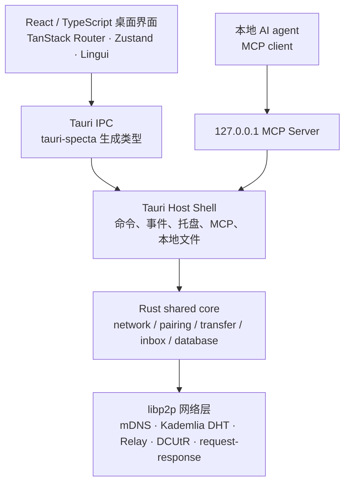
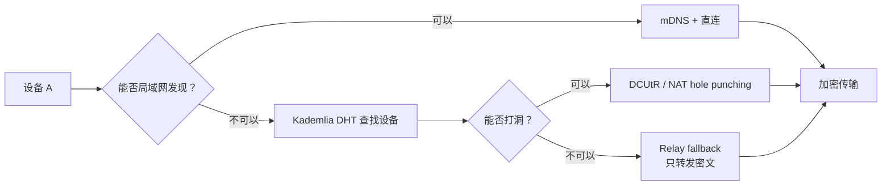
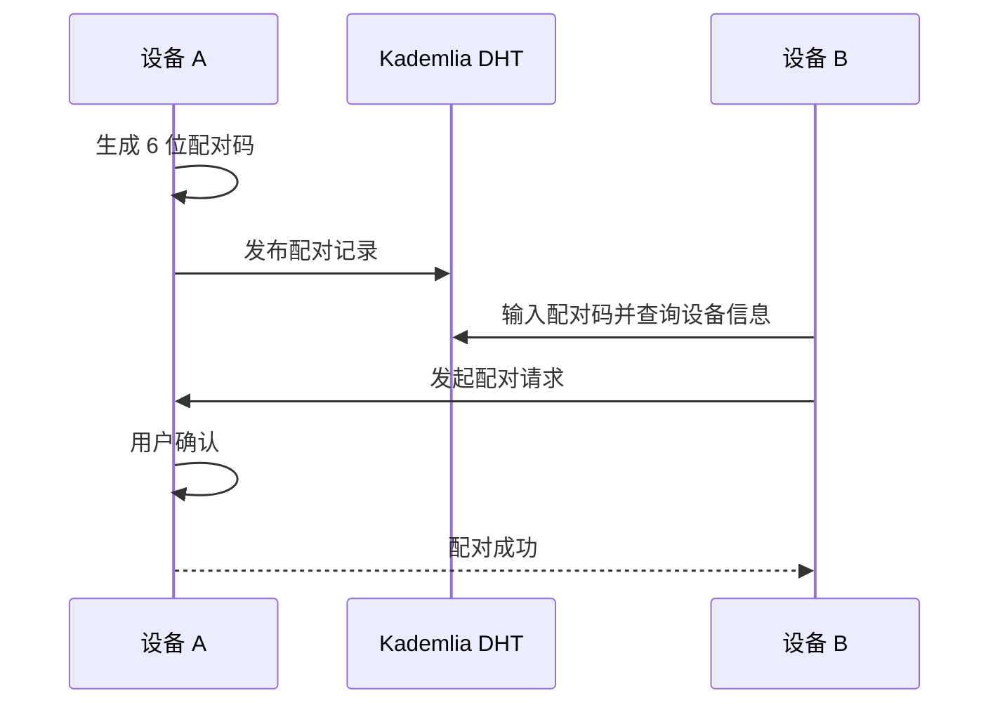
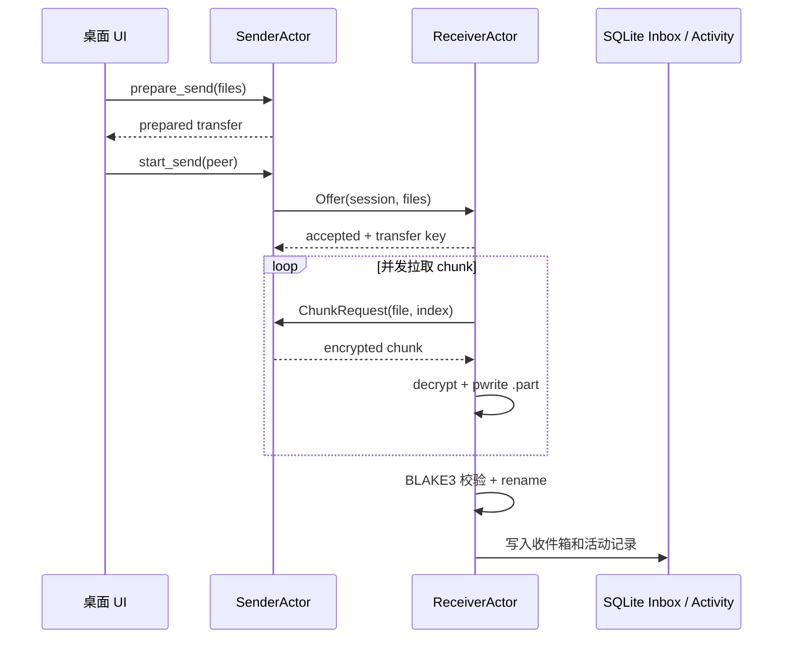
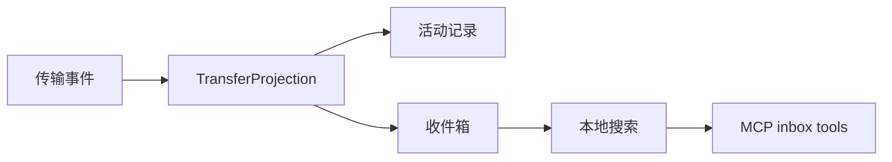
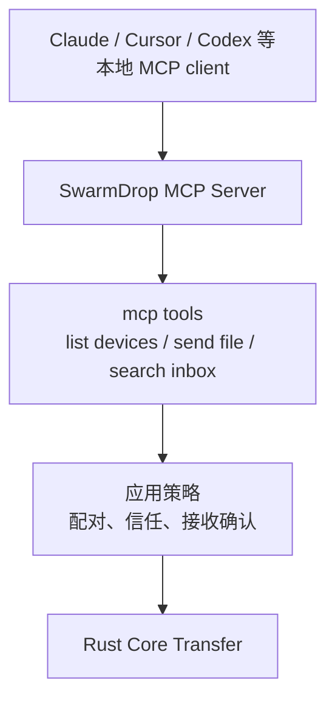
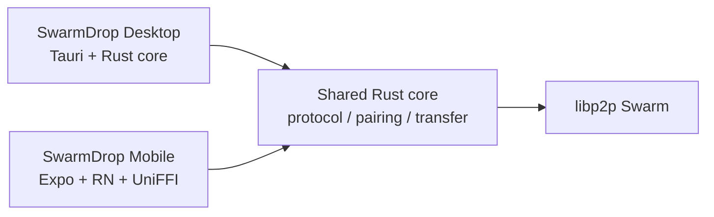

# SwarmDrop 桌面端架构：把传文件做成一条可信数据通道

很多文件传输工具解决的是“把文件从 A 发到 B”。SwarmDrop 想解决的是更底层的一件事：

> 当人和 AI agent 都在不同设备上工作时，设备之间应该有一条不依赖账号、不经过云盘、可以被程序调用、也足够安全的本地数据通道。

这就是 SwarmDrop 桌面端的定位。它不是同步盘，不是聊天软件的附件功能，也不是只能在同一 Wi-Fi 下工作的 AirDrop 替代品。它是一套跨网络、端到端加密、可恢复、可被 AI agent 驱动的设备间传输基础设施。

这篇文章给第一次接触项目的开发者快速建立整体图景：桌面端如何设计，解决了哪些真实问题，以及它和移动端 SwarmDrop-RN 如何组成一套完整的跨端产品。

> 移动端配套文章见 SwarmDrop-RN 仓库的 [SwarmDrop Mobile 架构](https://github.com/swarm-apps/SwarmDrop-RN/blob/main/dev-notes/blogs/swarmdrop-mobile-architecture.md)。两篇文章讲的是同一条数据通道在桌面和手机上的两种宿主形态。

## 先看它解决的问题

如果只是在同一局域网内传一个文件，问题其实不难。真正麻烦的是这些场景：

- 笔记本在公司网络，手机在移动网络，双方隔着 NAT；
- 发送过程中网络抖动，传输不能从头再来；
- 文件不能经过第三方云盘，也不能让中继节点看到明文；
- 已配对设备应该像“自己的设备”一样可信，但仍要保留接收策略；
- AI agent 生成了文件，希望能发到另一台设备，而不是只能给人一个下载链接；
- 用户要看到传输状态、收件箱和历史，而不是面对一堆底层网络术语。

SwarmDrop 桌面端的设计就是围绕这些问题展开的。

## 总体架构

桌面端可以分成五层：



这张图里最重要的不是技术名词，而是边界：

- `src/` 负责用户界面和状态投影；
- `src-tauri/` 负责桌面宿主能力：IPC、托盘、MCP、本地文件、安全存储；
- `crates/core/` 负责真正的平台无关业务：设备、网络、传输、恢复、数据库；
- `libs/core/` 提供更底层的 P2P/runtime 能力；
- UI 永远不直接理解 libp2p，AI agent 也不绕过应用策略直接碰文件。

这个分层让 SwarmDrop 可以同时服务三类使用者：普通用户、开发者和 AI agent。

## 网络层：自动选择最好的路

SwarmDrop 的连接不是“要求两台设备在同一网络”。它会根据环境自动选择路径：



`NodeConfig` 是这层的一个关键节点。它把 bootstrap peer、监听地址、数据通道协议、基础设施模式等参数收束在一起，让桌面端、测试和移动端共享一套网络启动语言。也正因为它连接了网络配置、传输、测试和运行时，graphify 图谱里它是桌面端最重要的跨社区桥梁之一。

设计上的目标很直接：用户不应该理解 DHT、Relay 或 DCUtR，用户只需要知道“设备在线，可以传”。底层网络负责尽力找路，找不到直连时才退到中继，而且中继永远只看到密文。

## 配对层：用 6 位码建立设备信任

设备第一次认识彼此，需要一个简单但不中心化的方式。SwarmDrop 采用：

- 局域网内用 mDNS 自动发现；
- 跨网络用 6 位配对码；
- 配对码对应的设备信息发布到 Kademlia DHT；
- 配对完成后形成长期设备身份和信任策略。

配对系统的关键是把“发现设备”和“信任设备”拆开。DHT 只是帮助两台设备找到彼此，不等于自动信任；真正的信任仍然要经过用户确认。



这套设计解决了一个很具体的问题：不用账号系统，也不用中心服务器，两台陌生设备仍然可以建立可验证的联系。

## 传输层：拉取式、可恢复、端到端加密

SwarmDrop 的传输协议选择“接收方拉取分块”，而不是发送方不停推数据。

原因很现实：

- 接收方控制节奏，天然有背压；
- 某个 chunk 超时，接收方重试同一个 `ChunkRequest` 即可；
- nonce 可以由 `session_id + file_id + chunk_index` 确定性派生，重试仍然安全；
- 接收方决定保存位置、`.part` 文件、校验和最终 rename。



`TransferManager`、`SenderActor`、`ReceiverActor`、`FileRange`、`checkpoint`、`progress` 是这条链路的核心。它们共同把一次传输拆成可观测、可恢复、可校验的状态流。

这也是 SwarmDrop 和普通“发文件按钮”的区别：协议不是一次性动作，而是一条生命周期。

## 收件箱和活动：传输不是结束，而是可追踪的记录

桌面端没有把“收到文件”当成弹窗结束。它落到本地 SQLite，形成收件箱和传输活动。

这层解决两个问题：

1. 用户需要知道最近收到了什么、来自谁、保存在哪里；
2. AI agent 需要可查询的本地结果，而不是只能“发完就忘”。

所以桌面端的收件箱、搜索、活动记录、恢复入口和 MCP 工具是一条线上的东西。收件箱不是一个附加页面，它是“可信数据通道”的可见账本。



这也是后续能力可以自然扩展的地方：内容索引、文件预览、agent 自动整理、跨设备任务流，都可以从这个账本继续长出来。

## MCP：AI 不是卖点贴纸，而是另一个客户端

SwarmDrop 内置本地 MCP server，但它的定位很克制：

- 只绑定 `127.0.0.1`；
- 默认关闭，需要用户开启；
- agent 可以列设备、看网络状态、发送文件、搜索收件箱；
- 接收端仍然遵守应用里的确认和信任策略。

这让 AI agent 可以使用同一条传输基础设施，而不是走一套“AI 专用后门”。



这件事对未来很关键。AI agent 生成的报告、截图、构建产物、压缩包，经常需要从开发机送到测试机、手机或另一台电脑。SwarmDrop 把这个动作变成可编程的本地能力，同时保持端到端加密和用户控制。

## 桌面端为什么是主仓

SwarmDrop 桌面端不只是一个 Tauri UI，它同时承担“共享核心”的源头：

```text
SwarmDrop/
├── src/              # 桌面 UI
├── src-tauri/        # 桌面宿主能力
├── crates/core/      # 共享业务核心
├── crates/entity/    # 数据库实体
├── crates/migration/ # 数据库迁移
└── libs/core/        # P2P/runtime 基础能力
```

移动端 SwarmDrop-RN 通过 UniFFI / ubrn 把同一套 Rust core 带到 Android 和 iOS。也就是说：

- 桌面端定义协议、传输语义和核心模型；
- 移动端复用这些语义，而不是重写一套“手机版协议”；
- 两端共享配对、加密、传输、恢复和设备身份的基本事实；
- 平台差异留给宿主层处理，比如 Tauri IPC、React Native Turbo Module、Android SAF、iOS sandbox。

这种设计让项目不会裂成两个产品。它们是同一个 SwarmDrop，只是跑在不同设备上。

## 和移动端怎么配合

桌面端是完整工作台，移动端是随身节点。两者的关系不是“主应用 + 附属 App”，而是同一网络里的两个平等设备。



桌面端更适合承担：

- 文件选择、拖拽、批量发送；
- 本地 MCP server 和 agent 工作流；
- 收件箱搜索和活动管理；
- 跨平台桌面发行和自动更新。

移动端更适合承担：

- 随身接收；
- 系统分享入口；
- Android SAF 保存到任意目录；
- 通知、前台服务和移动端权限体验；
- 和桌面端形成“手机 ↔ 电脑”的常用通道。

两端的共同目标是一致的：让用户不用再思考“我该用哪个云盘/聊天窗口/线缆”，而是直接把文件送到自己的另一台设备。

## 为什么值得 Star

SwarmDrop 的价值不在于又做了一个文件传输 UI，而在于它把几件难事合在了一起：

- 去中心化发现和跨网络连接；
- 端到端加密传输；
- 可恢复的 chunk 协议；
- 本地收件箱和活动账本；
- 桌面 + 移动共享 Rust core；
- AI agent 可调用但不越权的 MCP 通道；
- 自托管、开源、无账号、无云中转。

如果你关心本地优先、隐私、P2P、AI agent 工作流，或者只是受够了“传个文件还要绕一圈云盘”，SwarmDrop 值得你点一个 Star，也欢迎一起把这条可信数据通道打磨得更稳、更快、更好用。
