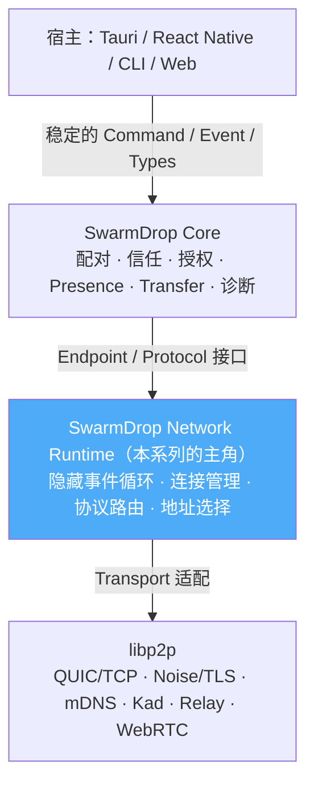

# 保留 libp2p，却要学 iroh——一次没有发生的迁移

> 这篇讲**为什么我们评估了迁移 iroh、最后决定不迁，却仍然照着 iroh 的样子把网络层重写了一遍**。它是整个 network-kernel 系列的起点：后面每一篇讲的「怎么重构」，答案的根都在这里。

## 缘起：一个很有诱惑力的念头

SwarmDrop 的网络层是从 libp2p 一点点搭起来的：mDNS 局域网发现、Kademlia DHT、Circuit Relay + DCUtR 打洞、AutoNAT、request-response、独立数据流，再加上配对、在线状态、文件传输。能用，但用起来「重」——业务层要直接 poll 一个巨大的 `SwarmEvent` 事件循环，要理解每一种 Behaviour 事件，libp2p 的类型（`PeerId`、`Multiaddr`、`ResponseChannel`）顺着泛型一路穿透到 FFI 和 IPC 边界。

这时候看到 iroh，很难不动心。它把身份、寻址、QUIC、打洞、Relay fallback 全部收进一个 `Endpoint`，用 `EndpointId` 表达远端，用 Router/ProtocolHandler 按协议分发连接，用 Ticket 编码「连上我需要的一切」。应用面对的是连接和流，而不是一个庞大的事件枚举。**看起来，换成 iroh 就能一次性解决所有「重」。**

于是我们认真做了迁移评估。结论写在 [`dev-notes/why-libp2p-not-iroh.md`](../../why-libp2p-not-iroh.md)：**不迁**。但这个「不迁」不是「维持现状」——恰恰相反，它触发了一次彻底的内核重写。

## 为什么不迁：迁移改的不是我们真正的痛点

关键的认识是：**iroh 好在架构和 API，而我们的痛点也在架构和 API——但这两件好东西，并不必须绑在一起买。**

拆开看四条：

**1. iroh 不能一对一替换 libp2p。** libp2p 是一组可组合的开放协议，iroh 更接近一套围绕 QUIC Endpoint 的完整运行时，抽象层次不同。就算迁过去，SwarmDrop 的产品网络层——配对与信任、邀请授权与撤销、在线状态、文件 Offer/Accept/续传、未配对设备的访问控制、跨宿主统一协议——**一样得自己保留或重写**。迁移换掉的是连接运行时，不是产品协议。

**2. 我们需要的协议组合，libp2p 已经全有了。** mDNS、Kad、Relay、DCUtR、request-response、流协议都在用，桌面设备还能在纯局域网模式里兼任 helper 节点为别人提供 DHT 与 Relay。迁 iroh 意味着放弃 Kad 模型、换掉整套寻址与中继体系、更换 PeerId 与 wire protocol、桌面与移动端必须同步切换且旧版本互不兼容、已有配对身份不能静默继承。这是全量迁移成本，不是替换几个 API 调用。

**3. Web 端要的是协议互操作，不是共享同一个 Rust 运行时。** 浏览器是 SwarmDrop 的重要方向：不装应用，打开分享链接就能和已配对设备传文件。但浏览器不能像原生端那样自由用 UDP，iroh 的浏览器路径不能等价复用原生的 QUIC 打洞。libp2p 则同时有 Rust 和 JS 实现，定义了 WebRTC Direct、Circuit Relay 等互操作协议——原生端跑 rust-libp2p，Web 端跑 js-libp2p，双方靠标准协议对话。**共享协议和类型，不强求共享运行时**，这更贴合浏览器的约束。

**4. API 更好 ≠ 应该换协议栈。** iroh 的吸引力主要是「常见连接流程变简单」，而这属于架构与 API 设计——**这些完全可以在 libp2p 之上自建**，同时保住底层协议生态的开放性。

一句话概括决策：

> 保留 libp2p 的开放协议栈，学 iroh 的架构边界和 API 表达。

## 目标：让上层看不见 libp2p

重构后的目标架构是清晰的四层，关键在于**每一层只依赖上一层的领域接口，libp2p 被压在最底、不向上穿透**：

这次重构的产物就是中间那层蓝色的框：新的 `crates/net`（内核）+ `crates/net-base`（类型底座），替代旧的 `libs/core`（`swarm-p2p-core`）。

## 要向 iroh 学的六件事

整个系列就是把下面这六点逐一落地，每一点对应一到两篇：

| # | 要学的设计 | 我们的做法 | 对应文章 |
|---|---|---|---|
| 1 | **Endpoint 而非裸 Swarm**：业务层不驱动事件循环 | `Endpoint` = `Arc<Inner>` 门面，单中枢 actor 唯一 poll 点 | [01](01-endpoint-facade.md) |
| 2 | **按协议路由**，而非巨型事件分支 | Router + ProtocolHandler，路由到 **stream** 级 | [02](02-router-protocol-handler.md) |
| 3 | **状态与事件分离**（Watcher 的心智） | watch 采样状态 + bounded mpsc 必达边沿 | [03](03-event-dual-track.md) |
| 4 | **可插拔扩展点** 的人体工学 | RPITIT trait + Dyn 孪生 + blanket 三件套（比 iroh 省掉一道 From） | [04](04-extension-points.md) |
| 5 | **Ticket 体验 + 连接授权分离**：连接与流是主角 | 裸流上的 typed `Rpc`，handler 可 await 用户决策 | [05](05-typed-rpc-on-streams.md) |
| 6 | **简单路径模型 + 可插拔发现** | `PathKind` 四态 + AddressLookup / DHT 子 API | [06](06-address-lookup-dht.md) |

还有一条不在 iroh「要学」清单里、但被 iroh 反衬出来的硬约束——**libp2p 类型不许穿透内核边界**。正是它让「将来真要换网络库，只改适配层」从口号变成可执行，见 [07](07-type-boundary.md)。

## 什么保留、什么重构

「不迁移」不等于「不动」。底层协议栈保留，上层职责全部重排：

| 范围 | 决策 |
|---|---|
| libp2p QUIC/TCP、Noise/TLS、mDNS、Kad、Relay、DCUtR、AutoNAT | **保留** |
| 当前 Swarm 事件循环 | 收进内核 actor，不再向业务层暴露（[01](01-endpoint-facade.md)） |
| `request_response` | 换成裸流上的 typed RPC（[05](05-typed-rpc-on-streams.md)） |
| 文件数据流 | 保留独立 stream 协议，不塞进巨型 RPC 消息 |
| 巨型 `NodeEvent` 枚举 | 拆成 watch 状态 + 小事件流（[03](03-event-dual-track.md)） |
| 6 位 DHT 配对码 | 本次做等价迁移（DhtKey 域隔离）；**升级为签名、可过期的邀请凭证是后续 roadmap**（PairInvite 设计待实施，产品协议不绑网络库类型） |
| Tauri / UniFFI / Web 宿主 | 绑稳定的 Core API，不绑 libp2p 内部类型（[07](07-type-boundary.md)） |
| iroh | 作为设计参考与持续观察的备选适配器 |

## 什么时候才重新评估迁移

这个「不迁」是有保质期的。原决策文档列了几条重估触发条件，核心几条是：iroh 出现成熟稳定的浏览器直连并满足大文件持久化续传；iroh 生态允许浏览器与原生独立互操作（wire 级而非 binary 级）；libp2p 的维护成本成为可**量化**的主要瓶颈（而不是「觉得 API 复杂」）；或者网络适配层建成后，能小范围实验接入 iroh 而不动产品协议与存量用户。

换句话说——**这次重构本身，就是在为「将来万一要换」铺路**：把 libp2p 关进适配层，才谈得上有朝一日无痛替换它。这也是 [07](07-type-boundary.md) 那条类型边界存在的全部理由。

## 一个刻意的不同：stream 路由，不是 per-connection ALPN

学 iroh 不等于抄 iroh。最能体现「学架构而非搬实现」的一点是路由粒度：

- **iroh** 一条 QUIC 连接对应一个 ALPN，路由粒度是**整条连接**；
- **libp2p** 一条连接经 multistream-select 天然跑多条协议子流，协商发生在开流时。

所以我们的 Router 把粒度定在 **stream** 而不是 connection——这是尊重 libp2p 的语义，而不是硬套 iroh 的形状。细节见 [02](02-router-protocol-handler.md)。这类「形似而神取其宜」的取舍，会在系列里反复出现。

## 这次决策不意味着什么

- 不意味着 libp2p 现有 API 已经够好——恰恰相反，内核必须大幅简化，这才有了整个系列；
- 不意味着永远不用 iroh——它仍是设计参考和备选适配器，重估条件写在原决策文档里；
- 不意味着所有平台跑同一个 libp2p 二进制——我们追求 **wire 兼容**，不是 binary 复用；
- 不意味着继续依赖公共 DHT/Relay——纯局域网与自托管仍是一等模式。

带着这个「保留协议栈、重写架构」的定调，我们从内核的门面开始：[01 — Endpoint 门面：从裸 Swarm 到 Arc\<Inner\>](01-endpoint-facade.md)。
