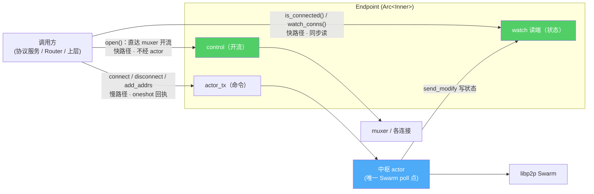

# Endpoint 门面：从裸 Swarm 到 Arc\<Inner\>

> 这篇讲内核最外层的那个 `Endpoint`——它凭什么能「Clone 一下随便分发」、凭什么让业务层再也不用写事件循环。理解了它，后面 Router、RPC、Watcher 才有落脚点。

## 旧栈：业务层得亲自消费事件洪流

旧栈的入口是 `start::<Req, Resp>()`（[`libs/core/src/runtime/node.rs`](../../../libs/core/src/runtime/node.rs)），它返回**三样东西**：

```rust
pub fn start<Req, Resp>(...) -> Result<(
    NetClient<Req, Resp>,       // 发命令
    EventReceiver<Req>,         // 收事件 —— 业务层得自己 loop 消费
    DataChannelReceiver,        // 收入站数据流
)>
```

事件循环本身是库内 `tokio::spawn(event_loop.run())` 起的，这一步没问题。问题在 `EventReceiver`：它是一条 `NodeEvent` 通道，而 `NodeEvent` 是个 [20+ 变体的巨型枚举](../../../libs/core/src/event.rs)——`Listening`、`PeerConnected`、`NatStatusChanged`、`RelayServerCircuitAccepted`、`InboundRequest`……业务层必须写一个大 `match` 把它们逐一分派。更糟的是 `NetClient<Req, Resp>` 和 `EventReceiver<Req>` 都带着业务泛型，业务类型顺着泛型一路渗进网络层。

**上层不该关心「Swarm 冒出了哪种事件」，它只想要「连上这个设备」「订阅在线状态」。** 这就是要收进门面的东西。

## 新栈：Endpoint 是一个 `Arc<Inner>`

新内核的门面定义只有几行（[`crates/net/src/endpoint.rs`](../../../crates/net/src/endpoint.rs)）：

```rust
#[derive(Clone)]
pub struct Endpoint {
    inner: Arc<Inner>,
}

pub(crate) struct Inner {
    node_id: NodeId,
    actor_tx: mpsc::Sender<ActorMessage>,   // 慢路径：命令进 actor
    control: libp2p_stream::Control,        // 快路径：开流直达 muxer
    registry: StreamRegistry,
    watch_addrs: watch::Receiver<AddrsInfo>,   // 快路径：状态读 watch
    watch_nat: watch::Receiver<NatStatus>,
    watch_conns: watch::Receiver<BTreeMap<NodeId, ConnInfo>>,
    watch_relays: watch::Receiver<BTreeMap<NodeId, RelayState>>,
    dht: Option<crate::dht::Dht>,
    connect_timeout: Duration,
    closed: CancellationToken,
    actor_handle: Mutex<Option<JoinHandle<()>>>,
}
```

`#[derive(Clone)]` 之所以廉价，是因为它只 clone 一个 `Arc`。所有可变状态都藏在后台 actor 里，`Inner` 持有的全是**句柄**：一条命令通道、一个流控制柄、四个 watch 读端。于是 Endpoint 可以随手 clone 分发给每个协议服务、每个 Router，而不用担心状态被复制或加锁竞争。这正是 iroh `Endpoint` 的同款形态——门面是句柄，状态在别处。

没有业务泛型。`Req`/`Resp` 整个消失了——业务类型不进网络层（这条边界见 [07](07-type-boundary.md)），控制面消息改走裸流上的 typed RPC（见 [05](05-typed-rpc-on-streams.md)）。

## 唯一的 Swarm poll 点：中枢 actor

`bind()` 在装配完 Swarm 后，把它交给一个后台 actor，然后 `spawn` 成任务（[`crates/net/src/endpoint/builder.rs`](../../../crates/net/src/endpoint/builder.rs)）：

```rust
let actor = Actor::new(swarm, actor_rx, WatchSenders { .. }, actor_tx.clone(), ..);
let actor_handle = n0_future::task::spawn(actor.run());
```

`actor.run()` 的循环是全内核**唯一** `select` Swarm 的地方（[`crates/net/src/actor.rs`](../../../crates/net/src/actor.rs)）：

```rust
loop {
    tokio::select! {
        msg = self.rx.recv() => match msg {
            None | Some(ActorMessage::Shutdown) => break,
            Some(msg) => self.handle_message(msg),
        },
        ev = self.swarm.select_next_some() => self.handle_swarm_event(ev),
    }
}
```

只有两个分支：命令、Swarm 事件。对比旧栈 `EventLoop` 那个还要额外 poll 入站数据流、维护 `pending_channels`、`pending_id_counter` 的循环，这里干净得多——入站流被 Router 自己 poll 走了（见 [02](02-router-protocol-handler.md)），事件被拆成 watch 与 mpsc 两条出口（见 [03](03-event-dual-track.md)）。

`actor` 是唯一写 watch 的人，也是唯一碰 Swarm 的人。**没有锁，因为没有共享可变状态**——所有对 Swarm 的操作都串行化成 `ActorMessage`，用 oneshot 回结果：

```rust
async fn request<T>(&self, make: impl FnOnce(oneshot::Sender<Result<T, Error>>) -> ActorMessage)
    -> Result<T, Error>
{
    let (tx, rx) = oneshot::channel();
    self.inner.actor_tx.send(make(tx)).await.map_err(|_| Error::Closed)?;
    rx.await.map_err(|_| Error::Closed)?
}
```

## 快路径：能不经 actor 就不经 actor

如果每个操作都走 actor，那 actor 会成为瓶颈。所以两类高频操作被刻意从 actor 旁路掉：



- **开流**走 `libp2p_stream::Control`。`Endpoint::open()` 拿 `control.clone()` 直接 `open_stream(peer, protocol)`，不排队进 actor——这等价于 iroh 直达 muxer 的 ReadOnlyMap 快路径。文件传输一条连接上并发几十条流，绝不能每条都排 actor 的队。
- **状态读**走 watch 的 `borrow()`。比如 `is_connected` 是一次同步内存读，零 await：

```rust
pub fn is_connected(&self, node: NodeId) -> bool {
    self.inner.watch_conns.borrow().contains_key(&node)
}
```

慢路径（`connect`、`disconnect`、`add_addrs`、`set_keep_alive`、`add_infrastructure_peer`）才进 actor——它们要改 Swarm 状态，本就必须串行化。这条快慢分界，是「单 actor 不成为瓶颈」的关键。

## close：三段式编排

保活白名单（见 [presence 那篇](../pairing-transfer/presence-two-bugs-one-root-cause.md)）会把连接钉死，所以「怎么关」和「怎么活」一样重要。`close()` 是三步（`endpoint.rs`）：

```rust
pub async fn close(&self) {
    let _ = self.inner.actor_tx.send(ActorMessage::Shutdown).await;   // ① 通知 actor 退出
    let handle = self.inner.actor_handle.lock().expect("lock").take();
    if let Some(handle) = handle {
        let _ = n0_future::time::timeout(SHUTDOWN_GRACE, handle).await; // ② 等它真的退出（宽限 5s）
    }
    self.inner.closed.cancel();                                        // ③ 唤醒 closed() 等待者
}
```

actor 一收到 `Shutdown` 就 `break` 出循环，随后 **drop 掉 Swarm——这会断开全部连接、关掉全部监听**。`closed()` 返回一个可 await 的信号，宿主可以等它 resolve 后再退进程。

一个重要约定：**Router 的关停不在这里**。完整关停顺序是先 `router.shutdown().await`（停 accept 循环、优雅调各 handler 的 shutdown），再 `endpoint.close().await`。为什么分开、Router 那半段怎么编排，见 [02](02-router-protocol-handler.md)。

## 小结

| | 旧栈 | 新栈 |
|---|---|---|
| 入口 | `start::<Req,Resp>()` 返回三元组 | `Endpoint::builder()...bind()` 返回一个 Clone 廉价的门面 |
| 业务泛型 | `NetClient<Req,Resp>` 全程穿透 | 无泛型 |
| 事件循环 | 业务层 poll `EventReceiver<NodeEvent>` | 用户永不接触，收进单中枢 actor |
| 状态读取 | 发命令问事件循环 | 同步读 watch |
| 开流 | 经 NetClient | 直达 muxer 快路径 |

门面立住了，下一个问题是：对端开进来的流，怎么分派到正确的处理逻辑？那是 Router 的活——[02 — 按协议路由，而不是巨型事件分支](02-router-protocol-handler.md)。
