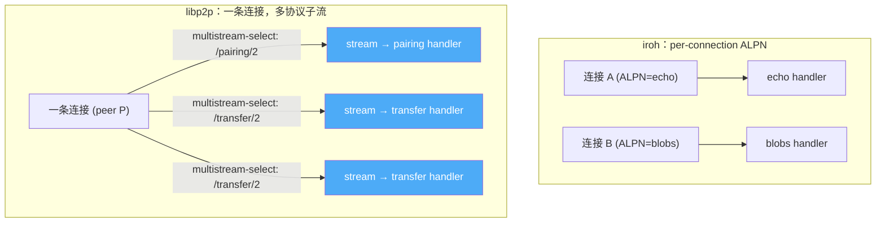
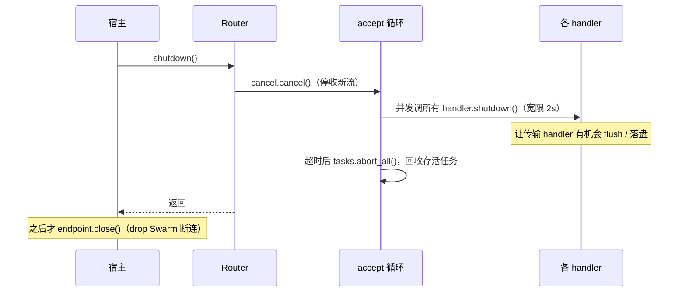

# 按协议路由，而不是巨型事件分支

> 这篇讲入站流怎么找到它的处理逻辑：Router + ProtocolHandler。重点是一个**刻意和 iroh 不一样**的决定——路由粒度是 stream，不是 connection。

## 旧栈：一切入站都挤进一个 match

旧栈里，对端发来的东西分两路进业务层，两路都很别扭：

- **控制请求**走 request-response behaviour，最后变成 `NodeEvent::InboundRequest { peer_id, pending_id, request }` 塞进那条巨型事件通道。业务层在大 `match` 里认出它，处理完再拿 `pending_id` 回 `send_response`——请求和响应被 `pending_id` 硬拆成两半（这套三件套怎么消失的，见 [05](05-typed-rpc-on-streams.md)）。
- **数据流**走 libp2p-stream，事件循环用一个 `SelectAll<BoxStream<(StreamProtocol, PeerId, Stream)>>` 把多个协议的入站流合并了持续 poll（[`libs/core/src/runtime/event_loop.rs`](../../../libs/core/src/runtime/event_loop.rs) 的 `inbound_channels`）。

于是「新增一个入站协议」这件事，要在事件循环里改 `match`、维护新的字段、想好回执怎么走。协议边界散在事件循环内部，而不是一个可注册的东西。

## 新栈：Router 把协议注册成一张表

新内核把它收成两个概念（[`crates/net/src/router.rs`](../../../crates/net/src/router.rs)）：

```rust
pub trait ProtocolHandler: Send + Sync + std::fmt::Debug + 'static {
    /// 处理一条入站流（每条流在独立任务上调用）。
    fn accept(&self, stream: P2pStream) -> impl Future<Output = Result<(), AcceptError>> + Send;

    /// 优雅关停钩子（默认空实现）。
    fn shutdown(&self) -> impl Future<Output = ()> + Send { async {} }
}
```

注册和 iroh 的手感一模一样——`builder → accept → spawn`：

```rust
let router = Router::builder(endpoint.clone())
    .accept(PAIRING_V2.protocol(), PAIRING_V2.handler(pairing_service))
    .accept(TRANSFER_DATA_V2, transfer_handler)
    .spawn();
```

`accept()` 只是往一个 `BTreeMap<ProtocolId, Box<dyn DynProtocolHandler>>` 里 insert，**真正让对端能开这些协议流的是 `spawn()`**——这一点也和 iroh 完全对齐（iroh 的 `accept` 也只是插 BTreeMap，`spawn` 才把 ALPN 写进 TLS 配置并起循环）。`spawn()` 做两件事：逐协议向 `Control` 注册入站流源，然后起 accept 循环：

```rust
for protocol in handlers.keys() {
    let streams = control.accept(stream_protocol)   // 此刻起对端才能开这个协议的流
        .unwrap_or_else(|e| panic!("protocol {protocol} already registered: {e}"));
    incoming.push(streams.map(move |(peer, stream)| (protocol.clone(), peer, stream)).boxed());
}
```

`ProtocolHandler` 是个「用户写 `async fn accept`、内部却存 `Box<dyn>`」的人体工学 trait——它靠一套「RPITIT trait + Dyn trait + blanket impl」实现，这套范式在内核里复用了三处，单独一篇讲：[04](04-extension-points.md)。这里只需知道：**你写线性的 `async fn accept`，Router 负责把它擦成 `Box<dyn DynProtocolHandler>` 塞进表里。**

## 刻意的不同：路由粒度是 stream，不是 connection

这是本篇最该记住的一句话。

iroh 一条 QUIC 连接绑定一个 ALPN，握手时协商，之后这条连接就是这个协议的——**路由粒度是整条连接**。libp2p 不是这样：



libp2p 一条连接经 multistream-select 天然复用多条协议子流，协议协商发生在**开流时**而非建连时。`libp2p_stream::Behaviour` 的 `IncomingStreams` 恰好已经按协议把入站流预分类好了。所以我们的 Router 顺着 libp2p 的纹理来——**按 `ProtocolId` 路由到 stream 级**，而不是硬把「一条连接 = 一个协议」的 iroh 模型套上来。

这不是妥协，是尊重底层语义。硬套 per-connection 模型反而要在上面再造一层复用，得不偿失。`ProtocolId` 的约定（必须以 `/` 开头、必须带版本号、精确匹配无协商回退）也是照着 multistream-select 与 ALPN 的共同实践定的（[`crates/net-base/src/protocol_id.rs`](../../../crates/net-base/src/protocol_id.rs)）。

## accept 在独立任务上跑完（iroh 形状 A）

accept 循环收到一条入站流后，**不是当场串行处理，而是 `spawn` 一个任务让 handler 在上面跑到底**：

```rust
let Some(guard) = registry.try_acquire(peer, protocol.clone(), Direction::Inbound) else {
    warn!(%protocol, %peer, "inbound stream rejected: limit exceeded");
    drop(stream);   // 超配额：显式拒绝（drop 即 reset 流），不静默排队
    continue;
};
let p2p = P2pStream::new(NodeId::from_peer_id(peer), protocol.clone(), Direction::Inbound, stream, Some(guard));
tasks.spawn(async move {
    let handler = handlers.get(p2p.protocol()).expect("registered");
    if let Err(e) = handler.accept(p2p).await {
        warn!(%protocol, %remote, error = %e, "protocol handler failed");
    }
});
```

这正是 iroh `ProtocolHandler::accept` 的语义——「返回的 future 跑在新 spawn 的任务上，可以活得任意久」。好处是：

- **accept 循环永不被单个 handler 阻塞**——慢的配对确认、长的文件传输各自在自己的任务上，不拖累别人；
- **长连接协议直接在 accept 里 `loop`** 就行，它在独立任务上可以长期存活；
- **handler 的 panic 在 `tasks.join_next()` 处显形**，只记一行 warn，不掀翻整个循环。

一条约定要记牢：**handler 返回 `Err`，Router 只记一行 warn 然后 drop 流，不会给对端发任何错误码**（[`crates/net/src/error.rs`](../../../crates/net/src/error.rs) 的 `AcceptError` 文档）。要让对端知道失败原因，得在返回前自己写一帧响应。业务级的「拒绝/失败」应该编码进响应类型本身，而不是靠断流表达——这条在 RPC 那篇会具体化。

## 重复注册 = panic，不是静默覆盖

同一个 `ProtocolId` 注册两次会直接 panic：

```rust
pub fn accept(mut self, protocol: ProtocolId, handler: impl ProtocolHandler) -> Self {
    let prev = self.handlers.insert(protocol.clone(), Box::new(handler));
    assert!(prev.is_none(), "protocol {protocol} registered twice on the same Router");
    self
}
```

这是一个**主动的反 iroh 决定**。iroh 的 `set_alpns` 是覆盖式的——空 Router、或先 `.alpns(X)` 再 Router 注册 `Y`，会把先前的静默清掉，结果是「某个协议神秘失灵」这种最难查的故障。我们宁可在启动时 panic 一次，也不要运行时一个协议悄悄没了。同理，`spawn()` 时若协议已被别的 Router/Control 占用，`control.accept` 报错也直接 panic：**显式失败优于静默失灵**。

## Router 关停：先停循环，再优雅收尾

前一篇说过完整关停是 `router.shutdown().await` 先于 `endpoint.close().await`。Router 这半段的编排（`run_loop` 尾部）是：



先 `cancel` 停止接受新流，再**并发**调用每个 handler 的 `shutdown()`（默认空实现，传输 handler 可以覆盖它来 flush 半成品），给 2 秒宽限，超时就 `abort_all` 强杀存活任务。之所以要和 `endpoint.close()` 分成两步：handler 的优雅收尾必须发生在连接还活着的时候——等 Swarm 被 drop、连接全断了再 flush 就晚了。

## 小结

| | 旧栈 | 新栈 |
|---|---|---|
| 入站控制请求 | `NodeEvent::InboundRequest` 进大 match | Router 分发到 ProtocolHandler |
| 新增协议 | 改事件循环 match + 字段 | `.accept(id, handler)` 注册 |
| 路由粒度 | 事件循环内混在一起 | **stream 级**（尊重 multistream-select） |
| 处理位置 | 事件循环里 | 每条流独立任务（iroh 形状 A） |
| 重复协议 | —— | **panic**（非静默覆盖） |

Router 把「对端开进来的流」安顿好了。但内核对外还有另一大类输出——状态和事件，它们该怎么组织，才不会退化成又一个巨型枚举？那是下一篇：[03 — 事件双轨制：watch 状态 vs 必达事件流](03-event-dual-track.md)。
