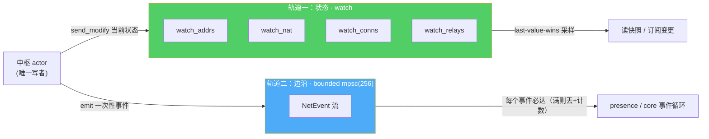

# 事件双轨制：watch 状态 vs 必达事件流

> 这篇讲内核对外输出的那两条轨道——一条采样状态、一条必达边沿。分清它俩，是把旧栈那个 20+ 变体的巨型 `NodeEvent` 拆干净的关键，也是最容易踩错的一处心智。

## 一个问题：连接状态，是「事件」还是「状态」？

旧栈把所有东西都当事件。`NodeEvent` 里既有 `PeerConnected`（一次性发生的边沿），也有 `NatStatusChanged`、`LanHelperStatusChanged`（描述当前是什么样的状态）。全塞进同一条 mpsc 通道，业务层一律当事件消费。

这会同时踩两个坑：

- **拿事件流去还原状态**：想知道「现在和谁连着」，得从头把所有 `PeerConnected`/`PeerDisconnected` 事件回放一遍在本地维护一张表。只要漏消费一段、或队列满丢了一个，本地表就和现实错位了。
- **拿状态思路去数边沿**：如果反过来，把连接状态做成「最新值」语义，那对端「断开→立刻重连」这种快速抖动，两次变更会被合并成「没变化」，presence 想据此判死就丢了边沿。

结论是这两类信息**语义根本不同，必须分两条轨**：



## 轨道一：watch —— 有损但永远拿得到「现在」

状态用 `tokio::sync::watch`，包一层成 `Watcher`（[`crates/net/src/watch.rs`](../../../crates/net/src/watch.rs)）。它的语义是 **last-value-wins 采样，不是队列**：

```rust
pub fn get(&self) -> T { self.rx.borrow().clone() }              // 同步读当前快照
pub async fn updated(&mut self) -> Option<T> { .. }             // 等下一次变更；写端 drop → None
pub fn stream(self) -> impl Stream<Item = T> { .. }             // 首项当前值，之后每次变更一项
```

有损是**特性不是缺陷**——你要的是「现在和谁连着」，中间那些瞬时值本来就不关心。actor 是唯一写者，`watch_conns` 永远是当前连接表的真相；`is_connected` 就是一次 `borrow()` 同步读（见 [01](01-endpoint-facade.md)）。四条 watch 分别是：

| watch | 内容 | 写入点 |
|---|---|---|
| `watch_addrs` | 本机监听/外部地址 | `NewListenAddr` / `ExternalAddrConfirmed` 等 |
| `watch_nat` | AutoNAT 结论（Public/Unknown） | autonat 探测事件（native） |
| `watch_conns` | 各对端最优路径 + RTT | 连接建立/关闭、ping RTT |
| `watch_relays` | 各 relay 的 reservation 状态 | reservation 接受/失效 |

### 借 iroh 的教训，但不抄它的 footgun

iroh 的 `Watcher`（复用自 `n0-watcher`）有两个被反复验证的真陷阱：`initialized()` 在 `Vec` watcher 上只 `pop()` 出**单个元素**（其余静默丢弃），而且对端断开后 `initialized()` 会**永久静默挂起、不报错**。我们借它的核心心智（采样、有损、不能用来数边沿），但**不复制这些接口**：

- 我们的 `updated()` 返回**完整 `T`**，不解包、不 pop；
- 写端 drop（Endpoint 关闭）后 `updated()` 返回 **`None`** 而不是永久挂起——关闭是一个能被观测到的正常结束，不是死锁。

`stream()` 的语义也被测试钉死：首项是当前值（只产一次）、之后每次变更一项、写端 drop 后结束（`watch.rs` 里那条 `stream_emits_current_then_changes_then_ends` 就是防「每轮 mark_changed 无限产出当前值」的回归）。

### 一个细节：只在真变化时才写

watch 每次 `send` 都会唤醒所有订阅者——**哪怕值没变**。如果 AutoNAT 每次探测成功都无脑写一次 `Public`，就会级联触发 DHT 重发布、前端 IPC 刷新。所以状态写入用 `send_if_modified` 做去重（[`crates/net/src/actor.rs`](../../../crates/net/src/actor.rs)）：

```rust
if ev.result.is_ok() {
    self.watches.nat.send_if_modified(|nat| {
        if *nat == NatStatus::Public { false }        // 值没变：不唤醒下游
        else { *nat = NatStatus::Public; true }
    });
}
```

外部地址确认、RTT 更新也是同理。高频的 RTT 更新还做了「定点改该 peer 那一项、不全表重建」的优化；连接增删这种低频事件才走 `publish_conns` 全表重建。

## 轨道二：NetEvent —— 每个边沿都必达

一次性发生的事情走 `NetEvent`，经 bounded mpsc 送达（[`crates/net/src/event.rs`](../../../crates/net/src/event.rs)）：

```rust
pub enum NetEvent {
    PeerConnected { node, path },
    PeerDisconnected { node },
    PathChanged { node, path },          // 例：dcutr 打洞成功 Relayed → Direct
    PeerIdentified { node, agent, protocol, addrs, protocols },
    Discovered { node, addrs, source },
    PingSuccess { node, rtt },
    PingFailure { node, error },         // presence 判死靠它
    RelayReservationAccepted { relay, renewal },
    RelayReservationLost { relay },
}
```

这些是「发生过一次」的边沿：`PingFailure`、`PeerDisconnected`、`RelayReservationLost`——presence 状态机和 [infra 收敛循环](../pairing-transfer/presence-two-bugs-one-root-cause.md)靠它们驱动，**一个都不能少**。所以它走队列（深度 256），不 poll 就在里面排着，而不是被覆盖。

队列满了怎么办？丢弃并计数，不阻塞 actor（`try_emit`）：

```rust
match tx.try_send(event) {
    Ok(()) => true,
    Err(TrySendError::Full(ev)) => { *dropped += 1; warn!(?ev, "queue full, dropped"); true }
    Err(TrySendError::Closed(_)) => false,   // 订阅端关了 → 移除
}
```

这里有个务实的底线设计：**必达是「尽力必达」**。真丢了边沿，presence 还有 `watch_conns` 的差分兜底能纠回来——两条轨道互为保险。fan-out 还做了个小优化：内核常态只有一个订阅者（core 事件循环），末位订阅者直接 move 原值免 clone。

## 旧栈那个巨型枚举，都去哪了

把 `NodeEvent` 的 20+ 变体按「状态 or 边沿」重新分家，就得到这张对照（`event.rs` 头注固化了去向）：

| 旧 `NodeEvent` 变体 | 新去向 |
|---|---|
| `Listening` | → `watch_addrs`（状态） |
| `NatStatusChanged` | → `watch_nat`（状态） |
| `RelayServer*` / `LanHelperStatusChanged` | → `watch_relays` / `watch_addrs`（状态） |
| `InboundRequest` | **消失**——业务入站由 Router 的 ProtocolHandler 吸收（见 [02](02-router-protocol-handler.md)） |
| `PeerConnected` / `PingFailure` / `RelayReservationLost` … | 保留为 `NetEvent` 边沿 |

还有一层边界：`NetEvent` **不直接进 IPC**。前端要看的事件由 `swarmdrop-core` 独立定义、组装，本枚举只在内核与 core 之间流通。这样即使内核事件形态变了，也不会直接震到前端契约（这条 libp2p 类型不穿透的边界，见 [07](07-type-boundary.md)）。

## 一句话判据

以后往内核加一个新的「对外信号」时，先问一句：

> **它是「现在是什么样」，还是「刚刚发生了什么」？** 前者进 watch，后者进 NetEvent。用错轨道，要么丢边沿，要么堆状态。

状态与事件安顿好了，接下来看内核里那三个「可插拔扩展点」是怎么用同一套范式实现的——ProtocolHandler、RpcService、AddressLookup 共享的三件套：[04 — 可插拔扩展点范式](04-extension-points.md)。
