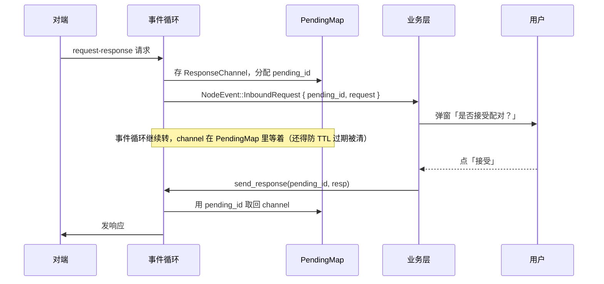
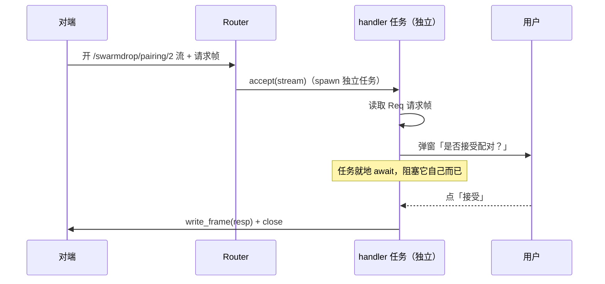

# 裸流上的 typed RPC：一整套机制怎么凭空消失

> 这篇讲控制面的请求-响应怎么从 libp2p 的 request-response behaviour 搬到裸流上。核心不是「换了个实现」，而是一个连锁反应：**因为 handler 能在回复前 await 用户决策，旧栈的 `pending_id` / `PendingMap` / `send_response` 三件套整个不存在了。**

## 旧栈：为什么需要那三件套

旧栈的配对确认要走 libp2p 的 `request_response` behaviour。它的形状决定了一个尴尬：**请求到达和响应发出，被事件循环劈成了两半。**

请求进来时是一个事件 `NodeEvent::InboundRequest { peer_id, pending_id, request }`。可这时候业务层还不能马上回复——配对要等用户在屏幕上点「接受」。但事件循环不能卡在这里等用户，它得继续转。于是 libp2p 给你一个 `ResponseChannel<Resp>`，你得先把它**存起来**，等用户点完了再回来用它 `send_response`。存哪儿？一个带 TTL 的 `PendingMap<u64, ResponseChannel<Resp>>`，用自增的 `pending_id` 当钥匙（[`libs/core/src/client/mod.rs`](../../../libs/core/src/client/mod.rs) 与 event_loop 里的 `pending_id_counter`）：



`pending_id`、`PendingMap`、`send_response` 这三样，全都是为了**跨越「事件循环不能阻塞等用户」这道坎**而存在的关联/暂存机制。它们不承载任何业务价值，纯粹是机制税。

## 新栈：handler 就地 await，坎没了

新内核里，入站流由 Router 交给 ProtocolHandler，而 **handler 跑在自己的独立任务上**（见 [02](02-router-protocol-handler.md)）。任务阻塞就阻塞，不影响任何别的东西——那还暂存什么 channel？直接在 handler 里线性地写「读请求 → 等用户 → 写响应」就完了。

这就是 `Rpc<Req, Resp>` helper（[`crates/net/src/rpc.rs`](../../../crates/net/src/rpc.rs)）。协议是 const 可构造的：

```rust
const PAIRING: Rpc<PairingRequest, PairingResponse> =
    Rpc::new(ProtocolId::from_static("/swarmdrop/pairing/2"));
```

服务端把业务 service 包成 handler 注册；`RpcService::handle` 里想 await 多久都行：

```rust
impl RpcService<PairingRequest, PairingResponse> for PairingService {
    async fn handle(&self, from: NodeId, req: PairingRequest)
        -> Result<PairingResponse, AcceptError>
    {
        let decision = self.prompt_user(from, &req).await;   // ← 就地等用户，随便等多久
        Ok(PairingResponse { accepted: decision.accepted, .. })
    }
}
```

对应的新时序，短了整整一截——没有 PendingMap，没有 pending_id：



`RpcService` 怎么被适配成 `ProtocolHandler` 的（`RpcHandler` 适配器）属于扩展点范式，见 [04](04-extension-points.md)。

## 客户端：一流一问一答

调用方一行搞定，未连接时 `open` 内部会按需拨号（复刻旧栈 request-response 的按需连接语义）：

```rust
let resp = PAIRING.call(&endpoint, peer, &request).await?;
```

`call_with` 的全过程就是「开流 → 写请求 → 读响应 → 关流」，整体套一个超时（`crates/net/src/rpc.rs`）：

```rust
n0_future::time::timeout(options.timeout, async {
    let mut stream = endpoint.open(to, self.protocol.clone()).await?;   // 未连接则内部拨号
    write_frame(&mut stream, req).await?;
    stream.flush().await?;
    let resp = read_frame::<Resp>(&mut stream).await?;
    let _ = stream.close().await;
    Ok(resp)
}).await.map_err(|_| RpcError::Timeout)?
```

为什么用「一条流一次问答」而不是在一条流上跑多路复用 RPC？因为 **yamux/QUIC 开流本来就廉价**——每次问答开一条新流，天然免了请求关联 ID、免了队头阻塞。这也是 `pending_id` 不再需要的另一半原因：连接层已经用「流」把并发问答隔开了，不用应用层再发明一套关联。

`CallOptions` 的默认超时是 **120 秒**，刻意对齐旧栈的 `req_resp_timeout`——因为「对端在等用户点确认」这种长交互是正常的，不能按普通 RPC 的几秒超时来掐（`crates/net/src/rpc.rs` 的 `CallOptions::default`）。

## 业务失败编码进类型，不靠断流表达

一个重要约定：`handle` 返回 `Err(AcceptError)` 表示**协议级**失败——流被断开，调用方看到 `RpcError::ClosedEarly`。而业务级的「拒绝/失败」不该走这条路，应该**编码进 `Resp` 类型本身**：

```rust
// 对：配对被拒是正常业务结果
PairingResponse { accepted: false, reason: Some("用户拒绝".into()) }
// 错：用 Err 表达「用户拒绝」——对端只会看到流莫名断了，不知道原因
```

理由很直接：Router 对 handler 的 `Err` 只记一行 warn、drop 流，**不给对端发任何错误码**（见 [02](02-router-protocol-handler.md)）。要让对端「知道被拒了、为什么」，就必须把这个信息放进一帧正常的响应里。`Err` 留给真正的协议违规（解码失败、IO 错误）。

## 帧格式与防 OOM

帧规则简单：`u32 大端长度前缀 + CBOR`，控制面单帧上限 **1 MiB**（`MAX_RPC_FRAME`）。数据面协议自带帧规则，不走这个 helper。

读帧这里有一处安全关键点——**恶意长度前缀必须在分配内存之前就被拒**：

```rust
let len = u32::from_be_bytes(len_buf) as usize;
if len > MAX_RPC_FRAME {
    return Err(RpcError::FrameTooLarge(len));   // 先拒，绝不 vec![0u8; len]
}
let mut buf = vec![0u8; len];   // 走到这里 len 已被证明 ≤ 1MiB
```

否则一个对端声称「我要发 4 GiB」，你照着 `len` 去 `vec![0u8; len]`，进程当场 OOM。`rpc.rs` 的测试 `read_rejects_oversized_length_prefix_before_allocating` 就是把这条钉死的——发一个 `u32::MAX` 长度前缀但零数据，必须报 `FrameTooLarge` 而不是尝试分配。另外还有两条边界测试：对端在帧边界前关流 → `ClosedEarly`（RPC 语义上等价于「拒答」），长度合法但 CBOR 是垃圾 → `Decode` 而不是 panic。

## 小结：一个改动引发的连锁塌缩

| 旧栈 | 新栈 |
|---|---|
| `request_response` behaviour | 裸流 + `Rpc<Req,Resp>` helper |
| `NodeEvent::InboundRequest { pending_id, .. }` | handler 在独立任务上就地 `handle` |
| `PendingMap<u64, ResponseChannel>` + TTL 清理 | **不存在** |
| `pending_id` 自增计数器 + `send_response` | **不存在** |
| 业务拒绝靠……其实没法清晰表达 | 编码进 `Resp`（`accepted: bool`） |

真正的杠杆只有一个：**handler 能就地 await 用户决策**。这个能力（来自 [02](02-router-protocol-handler.md) 的「accept 在独立任务上跑完」）一旦成立，所有为「事件循环不能阻塞」而生的暂存/关联机制就没有存在的理由了。

问答说清楚了，还剩最后一块拼图——「对端在哪」怎么解析。那涉及可插拔的发现与一个独立的 DHT 子 API：[06 — 可插拔发现与 DHT 子 API](06-address-lookup-dht.md)。
