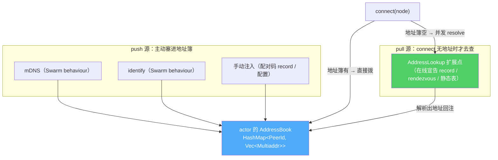

# 可插拔发现与 DHT 子 API：地址从哪来，记录往哪放

> 这篇讲两件被刻意分开的事：一是「对端在哪」的地址解析（push 与 pull 两个方向），二是「分享码记录」这种应用数据的 DHT 存取。它们看着都和 Kademlia 有关，但一个是地址、一个是数据，混在一起就会打架。

## 地址知识有两个来向

内核要拨号一个对端，得先有它的候选地址。这些地址从两个方向来，处理方式完全不同：



- **push 源**是「不请自来」的：mDNS 发现了邻居、identify 上报了对端地址、配对码 record 手动注入——这些直接进 actor 维护的 `AddressBook`。
- **pull 源**是「需要时才去问」的：`connect(node)` 时如果地址簿里一个候选都没有，才并发地去查各个 `AddressLookup`。

## 与 iroh 的差异：push 源是 Swarm 内的 behaviour

这里和 iroh 有个本质区别。iroh **没有内置 DHT**，它把所有发现（pkarr、DNS、mDNS）都放在一个外部的 `Discovery` 服务后面。而 libp2p 的 mDNS 和 Kademlia 是 **Swarm 内部的 behaviour**——它们发现地址是在事件循环里冒出来的，不走任何外部 trait。

所以我们的划分线和 iroh 不一样：**push 源（内部 behaviour）直接进地址簿，只有 pull 源才抽象成 `AddressLookup` 扩展点**。actor 的 swarm 事件处理里，mDNS 发现和 identify 上报都调 `record_addr` 落进地址簿（[`crates/net/src/actor.rs`](../../../crates/net/src/actor.rs)）。

### 为什么要自己维护地址簿

旧栈让 kad 路由表兼职当地址簿。新内核不这么干——因为 `Swarm::add_peer_address` **根本不是地址簿**：

```rust
fn record_addr(&mut self, peer: PeerId, addr: Multiaddr) {
    let entry = self.address_book.entry(peer).or_default();
    if !entry.contains(&addr) { entry.push(addr.clone()); }
    self.swarm.add_peer_address(peer, addr);   // 只是广播给 behaviour，不是存储
}
```

`add_peer_address` 只把 `NewExternalAddrOfPeer` 广播给各 behaviour——**没有 behaviour 存它，就没有任何效果**；dial 的候选地址实际来自 behaviour 的 `handle_pending_outbound_connection`。所以内核老老实实自己存一份 `HashMap<PeerId, Vec<Multiaddr>>`，拨号时把它作为显式候选传给 `DialOpts`，不赌某个 behaviour 恰好帮你记着。

## pull 源：AddressLookup 扩展点

`AddressLookup` 是个 pull 型解析源（[`crates/net/src/lookup.rs`](../../../crates/net/src/lookup.rs)）：

```rust
pub trait AddressLookup: Send + Sync + std::fmt::Debug + 'static {
    /// 解析对端候选地址。None = 不认识这个节点；流可多轮渐进产出（先缓存后网络）。
    fn resolve(&self, node: NodeId) -> Option<BoxStream<'static, Result<Vec<Addr>, LookupError>>>;
    /// 本机地址变化回调（发布型 lookup 用；默认空）。
    fn publish(&self, _info: &LocalNodeInfo) {}
}
```

`connect` 无候选时的分支就走它（`actor.rs` 的 `handle_connect`）：spawn 一个任务并发查所有 lookup，任一产出即回注成 `ConnectResolved` 消息重新走拨号；全部查完仍无地址则 `ConnectError::NoAddresses`。`resolve_all` 会把多个源的结果去重合并。`resolve` 返回**流**而非单值是有讲究的——它允许「先吐本地缓存、再吐网络查询结果」这种渐进产出。

`AddressLookup` 是扩展点四件套的一个实例，它本身已 object-safe 不需要 Dyn 孪生，细节见 [04](04-extension-points.md)。

### Builder 回填：解决「lookup 需要 Endpoint」的鸡生蛋

有些 lookup 要用到 Endpoint 本身才能构造——比如「基于 DHT 的在线宣告解析」得先有 `endpoint.dht()` 才能查。但 Endpoint 又要在 bind 时才建好，而 lookup 是 bind 之前就要配的。鸡生蛋。

解法是**延迟构造 + bind 尾声回填**（[`crates/net/src/endpoint/builder.rs`](../../../crates/net/src/endpoint/builder.rs)）：Builder 只存 `Box<dyn AddressLookupBuilder>`，等 Endpoint 建好后再逐个 `into_address_lookup(&endpoint)`，构造完经 `ActorMessage::SetLookups` 注入 actor：

```rust
// bind() 尾部：Endpoint 已建好，才回填 lookup
if !self.lookups.is_empty() {
    let mut lookups = Vec::with_capacity(self.lookups.len());
    for builder in self.lookups {
        lookups.push(builder.into_address_lookup(&endpoint)?);   // 此刻能拿到 &endpoint
    }
    let _ = actor_tx.send(ActorMessage::SetLookups(lookups)).await;
}
```

不需要 Endpoint 的 lookup（静态表等）靠 blanket impl 自动就是 Builder，用户无感；需要的用闭包 `LookupBuilderFn` 包一下。这套回填也是学 iroh `address_lookup` 的手法。

## DHT 是独立子 API，不是地址解析

关键的概念切分在这儿：**分享码 record、在线宣告 record 是「应用数据」，不是「地址解析」。** 它们恰好也存在 Kademlia 上，但语义上和「查对端地址」是两码事。所以 DHT 被做成一个独立的子 API（[`crates/net/src/dht.rs`](../../../crates/net/src/dht.rs)），从 `Endpoint::dht()` 拿（未启用 DHT 时为 `None`）：

```rust
pub struct Dht { .. }
impl Dht {
    pub async fn bootstrap(&self) -> Result<(), DhtError>;
    pub async fn put(&self, key: DhtKey, value: Vec<u8>, ttl: Option<Duration>) -> Result<(), DhtError>;
    pub async fn get(&self, key: DhtKey) -> Result<DhtRecord, DhtError>;
    pub async fn provide(&self, key: DhtKey) -> Result<(), DhtError>;
    pub async fn providers(&self, key: DhtKey) -> Result<Vec<NodeId>, DhtError>;
    // remove / stop_provide ...
}
```

它和 `AddressLookup` 的关系是**单向的**：DHT 是原语，「在线宣告 lookup」是构建在 DHT 之上的一个 `AddressLookup` 实现（也正是扩展点的验证用例）。反过来 DHT 不知道 AddressLookup 的存在。把这两层分开，`put`/`get` 一个字节数组这种通用能力就不会被「地址解析」的语义绑架。

## DhtKey：长度前缀做域分离

DHT 的键派生是一个 **wire 契约**——同样的输入必须永远散列到同样的 key，否则跨版本客户端查不到彼此的 record。`DhtKey::namespaced` 迁自旧栈但顺手修了一个理论缺陷（`dht.rs`）：

```rust
pub fn namespaced(namespace: &str, id: &[u8]) -> Self {
    let mut hasher = Sha256::new();
    hasher.update((namespace.len() as u64).to_be_bytes());  // ← 长度前缀
    hasher.update(namespace.as_bytes());
    hasher.update(id);
    Self(hasher.finalize().into())
}
```

那个 `(namespace.len()).to_be_bytes()` 长度前缀不是装饰。旧栈是纯拼接 `namespace ++ id`，于是 `("ab", "c")` 和 `("a", "bc")` 会散列到**同一个 key**——分享码空间和在线宣告空间可能撞车。加长度前缀把 namespace 和 id 的边界也纳入散列，域就干净地分开了。测试 `namespaced_key_is_deterministic_and_namespace_separated` 把这几条都钉死了：确定性、namespace 隔离、边界参与散列。

改这个派生规则的后果很硬——**分享码和在线宣告会全部失配**，所以它被当契约锁在测试里。同类的契约还有 net-base 里 NodeId/Addr 的字符串表示、状态枚举的 camelCase，那属于另一条边界：[07 — libp2p 类型不穿透](07-type-boundary.md)。

## 小结

| 概念 | 方向 | 归属 |
|---|---|---|
| mDNS / identify / 手动注入 | push | Swarm behaviour → actor AddressBook |
| `AddressLookup` | pull | 扩展点，`connect` 无地址时并发查 |
| `Dht` 子 API | —— | 独立原语，存应用数据（分享码/在线宣告） |
| `DhtKey::namespaced` | —— | wire 契约，长度前缀域分离 |

到这里，内核的功能面基本讲完了。最后一篇收束到一条贯穿全系列的硬约束——正是它让上面这些设计「将来能换底层」：[07 — libp2p 类型不穿透：newtype 边界](07-type-boundary.md)。
