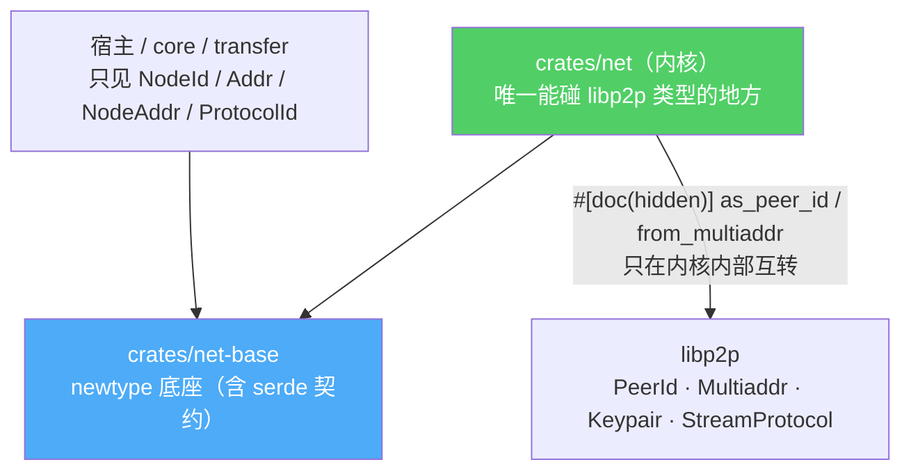

# libp2p 类型不穿透：一条 newtype 边界撑起「将来能换」

> 这篇讲整个系列最底层的那条硬约束——libp2p 的类型一个都不许爬出内核。它看着只是「包一层 newtype」的小事，却是 [00](00-why-not-migrate-iroh.md) 里「将来换网络库只改适配层」这个承诺唯一的兑现方式。

## 承诺与代价

[00](00-why-not-migrate-iroh.md) 的决策里有一句关键的话：**保留 libp2p，但要让「将来再评估 iroh 时只替换网络适配层、不重写产品核心」成为可能。** 这句话不是自动成立的。只要有一处业务代码写了 `PeerId`、一处 IPC 类型里塞了 `Multiaddr`、一处 FFI 签名带了 `libp2p::` 前缀，这个承诺就破了——换库时那些地方全得跟着改，「只改适配层」变成谎言。

旧栈就是这样：`NetClient<Req, Resp>` 的泛型、`NodeEvent` 里的 `PeerId`/`Multiaddr` 直接 serde 进前端、`ResponseChannel` 顺着 API 往上冒。libp2p 的形状渗进了每一层。

所以新内核立了一条不可谈判的边界：

> **libp2p 类型在 `crates/net` 内部收口成 newtype，一个都不向上穿透。上层只见 `crates/net-base` 的类型。**



## 四个 newtype 与它们藏起来的互转口

底座 `crates/net-base`（[`lib.rs`](../../../crates/net-base/src/lib.rs)）导出四个身份/地址类型，每个都是 libp2p 类型的 newtype：

| newtype | 包着 | 字符串表示 |
|---|---|---|
| `NodeId` | `libp2p::PeerId` | base58 |
| `Addr` | `multiaddr::Multiaddr` | `/ip4/192.168.1.2/tcp/4001` |
| `NodeAddr` | `{ NodeId, Vec<Addr> }` | JSON 对象 |
| `ProtocolId` | `Cow<'static, str>` | `/swarmdrop/pairing/2` |

内核和 libp2p 之间总得有个地方互转。这些互转口被 `#[doc(hidden)]` 标记，语义是「只供内核，业务层禁用」（[`crates/net-base/src/node_id.rs`](../../../crates/net-base/src/node_id.rs)）：

```rust
impl NodeId {
    #[doc(hidden)] pub fn from_peer_id(peer_id: PeerId) -> Self { Self(peer_id) }
    #[doc(hidden)] pub fn as_peer_id(&self) -> &PeerId { &self.0 }
}
```

`#[doc(hidden)]` 不是强制的编译期屏障，但它把「哪里在做 libp2p 互转」变成**可 grep 的有限集合**——`as_peer_id`/`from_multiaddr` 的调用点全在 `crates/net` 里。将来接一个 iroh 适配层，要改的就是这些点，而不是满仓库找 `PeerId`。这就是「只改适配层」从口号落到可执行的机制。

## 兼容性不是免费的：base58 和 protobuf 必须一致

换库能不破坏存量用户，靠的是**表示层的严格兼容**。`NodeId` 的 base58 字符串和旧栈 `PeerId` 的字符串**完全一致**，`SecretKey` 的 protobuf 编码和旧栈 `Keypair::to_protobuf_encoding` **完全一致**（`node_id.rs`）：

```rust
#[test]
fn node_id_base58_roundtrip_matches_peer_id() {
    let sk = SecretKey::generate();
    // base58 表示与 libp2p PeerId 完全一致（存量 DB 兼容的根据）
    assert_eq!(sk.node_id().to_string(), sk.as_keypair().public().to_peer_id().to_string());
}
```

这条兼容不是锦上添花，是**硬需求**：数据库里存的配对设备 peer_id 字符串、keychain/Stronghold 里存的密钥，重构后必须原样可用——否则升级即失去所有配对关系。所以「NodeId 只是新名字，值和旧 PeerId 一模一样」被测试钉死。`SecretKey` 的 `Debug` 还额外测了「绝不打印私钥材料」。

## 分类谓词也收口在这里

`Addr` 不只是包一层，它把「这个地址可不可拨、属于什么范围」的判定也收编了（[`crates/net-base/src/addr.rs`](../../../crates/net-base/src/addr.rs)）：`is_loopback`、`is_private_lan`、`is_public_routable`、`circuit_hops`、`p2p_node_id`……

为什么收口？因为这些谓词旧栈**散落在 event loop、infra、presence 三处手写**，位运算漂移过一次——IPv6 link-local 被漏判过。同一个「地址是不是公网」的问题有三份实现，迟早对不齐。收进 `Addr` 一处后，`p2p_node_id` 这种有坑的逻辑（circuit 地址 `/…/p2p/RELAY/p2p-circuit/p2p/TARGET` 必须取**最后一个** P2p 段而非中继身份）只需写对一次、测一次。

`classify_path`（把地址映射成 `PathKind::Local/Direct/Relayed`）就建在这些谓词上——这正是 [00](00-why-not-migrate-iroh.md) 里「产品层只理解少数稳定路径状态」的落地：UI 看到的是 `Relayed`，而不是某条 `/p2p-circuit/` multiaddr。

## ProtocolId：把「协议演进」的约定编进类型

`ProtocolId` 也不只是包一层字符串。它在构造时就强制三条约定（[`crates/net-base/src/protocol_id.rs`](../../../crates/net-base/src/protocol_id.rs)）——不以 `/` 开头会在**编译期** const panic：

```rust
pub const fn from_static(s: &'static str) -> Self {
    assert!(!s.is_empty() && s.as_bytes()[0] == b'/', "protocol id must start with '/'");
    Self(Cow::Borrowed(s))
}
```

三条约定是：必须以 `/` 开头（libp2p `StreamProtocol` 的硬要求）、必须带版本号结尾、用项目独有前缀 `/swarmdrop/...`。第二条最要紧——**协议匹配是整串精确相等，没有版本协商回退**（这点 libp2p multistream-select 和 iroh ALPN 是一致的）。没版本号，将来就没法演进；协议一旦发出去，`/swarmdrop/pairing/2` 和 `/swarmdrop/pairing/3` 就是两个互不相认的协议。把这条约定编进类型，比写在注释里靠人自觉可靠得多。

`Cow<'static, str>` 还顺带买到一个性能红利：编译期常量协议（本项目全部如此）开流时走 `as_static()` 零分配路径，不用每条流都 `String` 堆分配一次。

## serde 表示就是 wire 契约

这些 newtype 会经 serde 进 IPC、进 FFI、进 DHT record。所以它们的**序列化形态本身是一份跨端契约**，改了就静默破坏前端 match、破坏跨版本互通。契约被固化在测试里（[`crates/net-base/src/status.rs`](../../../crates/net-base/src/status.rs)）：

```rust
// 这些枚举经 serde 进前端与移动端——camelCase 表示是 IPC 契约
assert_eq!(serde_json::to_string(&PathKind::Relayed).unwrap(), "\"relayed\"");
assert_eq!(serde_json::to_string(&NatStatus::Public).unwrap(), "\"public\"");
assert_eq!(serde_json::to_string(&DiscoverySource::Mdns).unwrap(), "\"mdns\"");
```

`NodeId`/`Addr` 序列化成字符串（不是结构体）、状态枚举一律 camelCase——和旧栈 `NodeEvent` 的 `#[serde(rename_all = "camelCase")]` 保持一致，前端不用改。DHT 键的派生规则也是同一类 wire 契约，那条讲在 [06](06-address-lookup-dht.md)。

## 一个连带的安全含义

边界还牵出一处必须补的安全项。重构中删掉了应用层的 XChaCha20 加密（传输层 Noise/TLS 已提供机密性），但应用层加密**隐式承担过一项「归属校验」**——证明「这条数据确实来自我以为的那个对端」。删掉后，这个校验必须由传输层身份显式补上（[`crates/net/src/stream.rs`](../../../crates/net/src/stream.rs)）：

```rust
/// 传输层身份即归属证明：数据面协议必须校验
/// stream.remote() == session.peer
pub fn remote(&self) -> NodeId { self.remote }
```

`P2pStream::remote()` 返回的 `NodeId` 由传输层的加密握手保证——数据面协议拿它和会话里的对端身份比对，就取代了原先加密隐式做的事。**NodeId 不只是个标识符，它是身份的凭证**——这也是为什么身份类型必须收口、必须表示稳定。

## 收束全系列

七篇下来，内核的样子已经完整：一个 Clone 廉价的 `Endpoint` 门面（[01](01-endpoint-facade.md)）、按 stream 路由的 Router（[02](02-router-protocol-handler.md)）、状态与边沿分轨的事件系统（[03](03-event-dual-track.md)）、一套复用三处的扩展点范式（[04](04-extension-points.md)）、裸流上让整套暂存机制消失的 typed RPC（[05](05-typed-rpc-on-streams.md)）、push/pull 分明的发现加独立 DHT（[06](06-address-lookup-dht.md)）。

而这一篇的 newtype 边界，是把上面所有设计「焊」在一起、又同时「和 libp2p 隔开」的那层壳。**它让整个内核既深深用着 libp2p，又不被 libp2p 绑死**——这正是 [00](00-why-not-migrate-iroh.md) 那个「保留协议栈、学架构、留后路」决策，在类型系统上最终、最不起眼、也最要紧的兑现。
