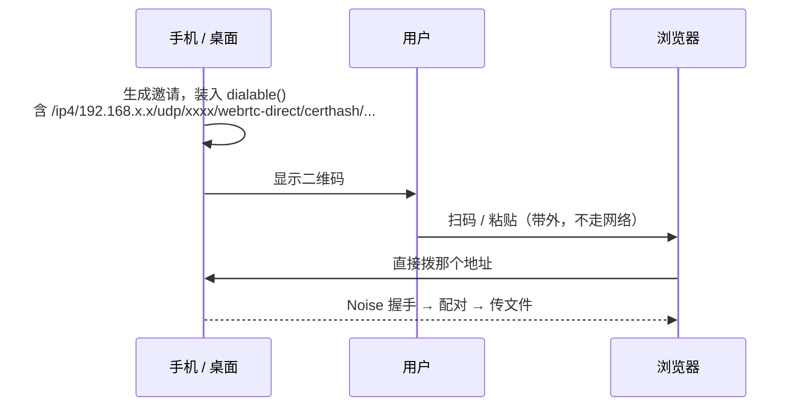
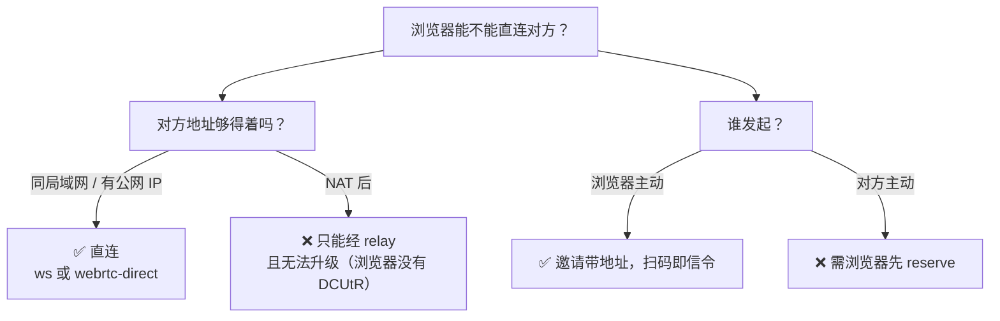

# 三端到底怎么连上：ws、webrtc-direct 与中继的真实分工

> **讲什么**：桌面、手机、浏览器之间建立连接时，到底走哪条腿、什么时候是真直连、
> 什么时候必须经中继。破除四个常见误解，最后给一张完整的连通性矩阵。
>
> **为什么写**：这些事实散落在 transport 组装、preset、invite 编解码和两端 UI 里，
> 没有一处能一眼看全。结果是连项目内部讨论都会绕进去——"局域网是走 ws 吗"
> "没连中继怎么直连"这类问题反复出现。

## 起点：一个绕不出来的问题

> "目前 Web 端和桌面端有两种连接，一种是 ws 一种是 webrtc，这个 webrtc 是直连的吗？"

这个问题问不出好答案，因为它的**前提就错了**。ws 和 webrtc 不是两种"连接方式"，
它们是两种 **transport**；而"直连还是中继"是**另一个维度**。把两者当成一回事，
后面怎么推都推不通。

先把这刀切开：

| 维度 | 取值 | 决定因素 |
|---|---|---|
| **transport** | ws / webrtc-direct / tcp / quic | 两端各自编进去了什么 |
| **拓扑** | 直连 / 经中继 | 对方的地址**够不够得着** |

同一个 transport 两种拓扑都能干：ws 既能直连局域网里的桌面，也能拿来连公网 relay
再在上面开 circuit。反过来也一样。

## 误解一：webrtc-direct 能穿 NAT

`direct` 这个词误导性极强。它的意思是**不需要信令服务器**，不是**能穿透 NAT**。

标准 WebRTC 建连要一个信令通道：两端交换 SDP、互报 ICE 候选，然后打洞。
libp2p 的 webrtc-direct 把这套全省了：

- 服务端证书的哈希（certhash）**直接写在地址里**，客户端拿它验证服务端，替代 CA 链
- 因此 SDP 不用交换——客户端从 multiaddr 里的 IP、端口、certhash 就能确定性地构造出来
- 服务端跑 ICE-lite，不收集候选，只等着被拨
- 连上之后再跑 Noise 握手认证对端身份

省掉信令的代价是：**目标地址必须已经可达**。它不打洞，它只是"拨一个你已经知道的 UDP 端口"。

所以 webrtc-direct 能不能用，取决于对方在哪：

- 同一局域网 → 拨私网 IP，可达 ✅
- 对方有公网 IP 或做了端口映射 → 可达 ✅
- 对方在 NAT 后 → **不可达，且没有补救手段** ❌

最后那条对浏览器是死路。浏览器侧连打洞的零件都没编进去——`crates/net/src/behaviour/mod.rs`
里 mdns / autonat / **dcutr** 全部是 `#[cfg(not(wasm_browser))]`，wasm target 下这些字段
根本不存在。上游更彻底：`webrtc-websys` 的 `dial` 直接拒绝 listener role，
那正是 DCUtR 打洞的另一半。

这和桌面之间形成鲜明对比——桌面有 autonat + dcutr，NAT 后也能把 relay 连接升级成直连。
**只有涉及浏览器的那条腿升级不了。**

## 误解二：既然不用信令服务器，浏览器怎么知道对方地址？

这是上一节的自然追问，答案很漂亮：**扫码本身就是信令通道**。

邀请里装的就是地址。`PairInvite.inviter` 是个 `NodeAddr`（`crates/invite/src/invite.rs`），
生成时取的是 `endpoint.watch_addrs().get().dialable()`——而 `dialable()` 的定义是
`listen ∪ external`（`crates/net/src/endpoint.rs`），也就是**本机所有监听地址**加上
外部确认过的地址。

于是流程是：



**全程没有第三方节点参与。** 二维码替代了信令服务器的职责——它传递的正是信令服务器
本该传递的东西（对端地址 + 证书指纹）。这就是 webrtc-direct 在扫码配对场景下的天作之合。

## 误解三：LanHelper 是数据的必经之路

两端 UI 都有一块"局域网协助节点地址"：

- 桌面 `src/components/network/lan-helper-address.tsx`
- 移动 `mobile/src/components/lan-helper-addresses.tsx`

它们的数据源都是 `networkStatus.lanHelperAdvertisedAddrs`，而后端**仅在
`provide_lan_helper` 开启时填充**（默认是关的，见 `src/stores/preferences-store.ts`）。

看到这个很容易得出"浏览器要先连 LanHelper 才能连别人"的结论。**不对。**

这批地址和上一节邀请里的地址是**两码事**：

| | 来源 | 给谁用 | 解决什么 |
|---|---|---|---|
| 邀请里的地址 | `dialable()`，无条件 | 浏览器**主动拨** | 我怎么连上你 |
| LanHelper 地址 | 仅 `provide_lan_helper` 开启 | 浏览器 **reserve** | 别人怎么拨到我 |

LanHelper 是"可达性代理"，不是数据中转站。浏览器主动拨对方时，它完全不参与。

## 误解四：Android 和桌面的 transport 是一样的

移动端和桌面端共用 `presets::Native`（`crates/core/src/runtime.rs`），但有一行例外：

```rust
// crates/net/src/endpoint/presets.rs
"/ip4/0.0.0.0/tcp/0",
"/ip4/0.0.0.0/udp/0/quic-v1",
"/ip4/0.0.0.0/udp/0/webrtc-direct",     // 浏览器入口 ①
#[cfg(not(target_os = "android"))]
"/ip4/0.0.0.0/tcp/0/ws",                // 浏览器入口 ②，Android 没有
```

Android 为什么被排除？因为 `with_websocket()` 的宏展开硬编码了 `Transport::system`
去读系统 DNS，在 Android 上要走 JNI，而 RN 宿主没有初始化入口——会直接炸。
所以整个 WebSocket transport 干脆没编进去（`crates/net/src/transport.rs` 有详细注释）。

结果是浏览器可用的入口按端不同：

| | ws | webrtc-direct |
|---|---|---|
| 桌面 | ✅ | ✅ |
| iOS | ✅ | ✅ |
| **Android** | ❌ 没编进去 | ✅ **唯一入口** |

配套的东西是齐的：webrtc 证书经 uniffi 落到 `expo-secure-store`（`mobile/src/core/keychain.ts`），
certhash 跨重启稳定——否则每次启动地址都变，已配对设备的地址簿会全部失效。

## 完整的连通性矩阵

把上面几条合起来：

| 场景 | 走什么 | 直连？ |
|---|---|---|
| 浏览器 ↔ 同局域网桌面 | ws 或 webrtc-direct（并发赛跑） | ✅ |
| 浏览器 ↔ 同局域网 Android | webrtc-direct（唯一） | ✅ |
| 浏览器 ↔ 公网可达的桌面 | webrtc-direct | ✅ |
| **浏览器 ↔ NAT 后设备（跨网常态）** | webrtc-direct 连 relay + circuit | ❌ 全程中转 |
| 浏览器 ↔ 浏览器 | 同上 | ❌ |
| 桌面 ↔ NAT 后桌面 | relay 起手 → DCUtR 升级 | ✅ 打洞后直连 |

跨网那格为什么只剩 webrtc-direct？不是因为它更适合跨网，而是因为**公网 relay 的 ws 入口
浏览器用不了**：https 页面拨公网裸 IP 的 `ws://` 会被 mixed content 拦，
`wss://` 又需要域名 + CA 证书。WebRTC 不走浏览器的 HTTP 栈，天然免疫这道门
（实测矩阵见 [browser-platform/03](../browser-platform/03-mixed-content-private-ip.md)）。

这也解释了两份地址清单为何不同：桌面的 `src/lib/bootstrap-nodes.ts` 是 tcp + quic
（原生端直达公网），而 Web 端的 `docs/app/try/relay-helpers.ts` **只有一条 webrtc-direct**。

> 桌面清单里原本还有一条 `/tcp/4002/ws`，2026-07-27 删掉了：原生端有 tcp/quic 直达，
> 它永远排不上号；浏览器又因 mixed content 用不了它——两头都不消费的死配置。
> 注意这不影响桌面**自身**的 `/ws` 监听，那是另一回事（见下一节）。

## 最要紧的一条：方向是不对称的

前面所有结论汇到这里：

| 方向 | 局域网能通吗 | 要中继吗 |
|---|---|---|
| 浏览器 → 手机 / 桌面 | ✅ | 不要 |
| 手机 / 桌面 → 浏览器 | ❌ | **要** |

原因还是那条硬边界：浏览器不能 listen。别人要拨到浏览器，只能拨它在某个节点上
预留的 circuit 地址——而预留本身需要一个在线的 relay（公网的，或局域网里开了
LanHelper 的设备）。

**产品含义很直接：Web 端和移动端在局域网配对，必须由浏览器发起。**
手机出示邀请，浏览器扫码后主动拨过去。反过来让手机扫浏览器的码，需要浏览器先 reserve
才能生成带可达地址的邀请，而 reserve 又要求局域网里有台开了 LanHelper 的设备——
绕一大圈，体验很差。

（手机自己也能当 LanHelper，条件只是 Native profile + 开关。但用它给浏览器做可达性代理
是自绕：浏览器既然连得上手机去 reserve，就说明它能直拨手机，不如直接让浏览器发起。）

## 连上之后：谁是"最优"连接

多条路径同时建立时，内核按 `classify_path` 分类、按 `path_rank` 取最优
（`crates/net/src/actor.rs`）：

```rust
circuit 地址        → Relayed  (rank 1)
私网 IP / loopback  → Local    (rank 3)
其他                → Direct   (rank 2)
```

局域网连接优先级最高。注意这个分类**不区分 ws 还是 webrtc-direct**——两者在局域网里
同为 `Local`，所以确实是"谁先握手成功用谁"，没有固定偏好。

## 小结



五句话：

1. **ws / webrtc-direct 是 transport，直连 / 中继是拓扑**，两个维度正交。
2. **webrtc-direct 的 "direct" 是免信令，不是穿 NAT**，它要求目标地址已经可达。
3. **扫码就是带外信令**，所以局域网直连不需要任何第三方节点在线。
4. **Android 只有 webrtc-direct 这一个浏览器入口**（ws transport 因 JNI DNS 问题没编进去）。
5. **方向不对称**：浏览器能主动直连别人，别人拨不到浏览器——Web 端的配对必须由它发起。

## 延伸阅读

- [browser-platform/02 浏览器能 listen 吗](../browser-platform/02-webrtc-websocket-in-browser.md)
  —— 不能 listen 与经 relay 被动接收的机制细节
- [browser-platform/03 mixed content 与私网 IP 豁免](../browser-platform/03-mixed-content-private-ip.md)
  —— 为什么公网 relay 的 ws 入口浏览器用不了
- [公网 Relay 接入浏览器](2026-07-public-relay-and-browser-entry.md)
  —— 服务端侧的地址公告、持久化证书与 reservation 部署
- [knowledge/libp2p-wasm.md](../../knowledge/libp2p-wasm.md)
  —— 浏览器 ↔ NAT 后设备直连为何在 js-libp2p 上也拿不到
