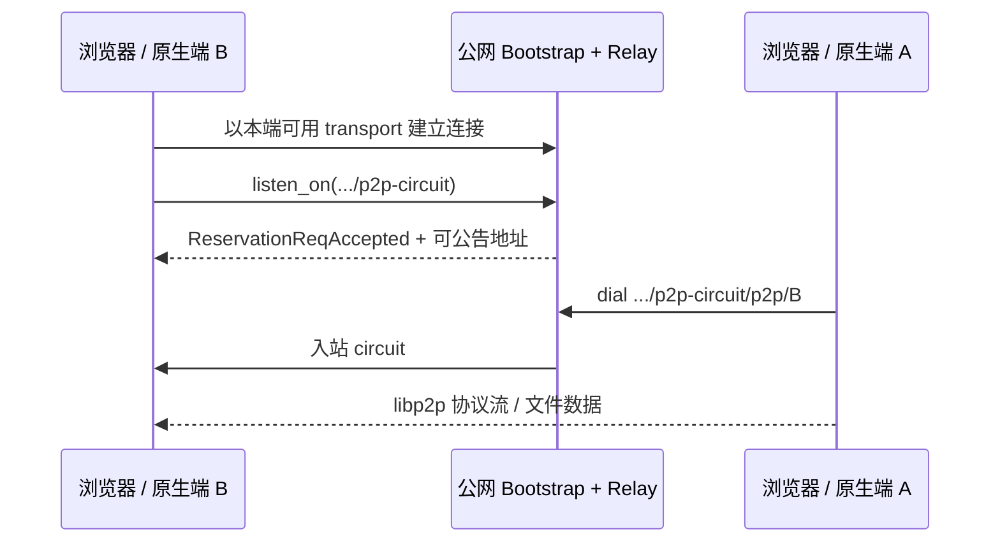

# 公网 Relay 接入浏览器：把“能拨通”变成“能被拨通”

> 2026-07 的一次跨端联调复盘。目标是让桌面、移动和两个浏览器页面都能经公网
> libp2p Relay 建立连接；本文只讨论**部署、地址和 reservation**，数据面 WebRTC
> stream 的问题见 [浏览器 DataChannel 复盘](../browser-platform/06-webrtc-datachannel-backpressure.md)。

一开始最容易犯的错误，是把“公网节点启动成功”误当作“所有客户端都能使用它”。实际至少有
三层独立条件：服务端要公告可达地址，客户端要选择自己支持的 transport，想被别人通过 relay
拨到的客户端还要成功取得 reservation。



## 1. 多端不是同一种网络环境

本次公网节点同时监听并公告了四类地址：

| 地址 | 面向端 | 用途 |
|---|---|---|
| `/tcp/4001` | 桌面 / 移动 | 原生 TCP |
| `/udp/4001/quic-v1` | 桌面 / 移动 | 原生 QUIC |
| `/tcp/4002/ws` | 桌面 | WebSocket；浏览器不能使用明文 `ws://` 跨 HTTPS 页面 |
| `/udp/4003/webrtc-direct/certhash/...` | 浏览器及支持 WebRTC Direct 的原生端 | 浏览器可用的安全入口 |

因此“公共节点地址”不能再内置在共享内核。内核只提供 transport 能力和拨号逻辑；各端前端维护
自己的默认节点清单，并与用户配置合并：

- 桌面可给出 TCP、QUIC、WS、WebRTC Direct；
- 移动只给实际可用的原生 transport；
- 浏览器只给 WebRTC Direct 或安全 WSS helper，且地址必须带 `/p2p/<relay-peer-id>`；
- Relay 的地址变更不会要求所有端更新同一份 Rust 常量。

这不是配置“重复”，而是把**平台能力差异**放在拥有该差异的边界层。

## 2. WebRTC Direct 不是只开一个 UDP 端口

启动日志中以下四项必须稳定对应：节点身份、持久化证书、PeerId、带证书哈希的地址。

```text
加载节点身份             /data/identity.key
加载持久化 WebRTC 证书   /data/webrtc.pem
local_peer_id=12D3KooW...
已公告公网地址           /udp/4003/webrtc-direct/certhash/uEi...
```

### 失败：容器重建后浏览器连接超时

第一次重新部署后，日志变成“生成新的 Ed25519 节点身份”和“生成持久化 WebRTC Direct 证书”。
这会同时改变 PeerId 与 `certhash`。旧的浏览器默认地址仍指向旧身份，结果是 `Timeout has been
reached`，即使云防火墙后来放行了 4003/UDP 也不会恢复。

### 修复

1. 对 `/data` 使用持久卷，保存 `identity.key` 和 `webrtc.pem`；
2. 暴露并在云安全组放行 4003/UDP；
3. 更新各端前端的默认地址和 `/p2p/<peer-id>` 后缀；
4. 部署后检查日志是“加载”而非“生成”身份与证书。

**结论：** WebRTC Direct 地址的 `certhash` 是可验证的证书身份，不是可随意复制的静态装饰；
重置证书等同于更换该入口的地址。

## 3. `connect` 成功不等于 relay 可用

浏览器端最初出现过：

```text
dial failed: Dial error: no addresses for peer
```

它并不是“对方没有 PeerId”，而是尝试经 relay 拨号时，目标端没有可供 relay 使用的 circuit 地址。
在 libp2p relay v2 中，客户端必须在**已经连上 relay 后**显式申请 reservation：

```text
relay 意图已登记，等待 reservation…
reserve → <relay-address>/p2p-circuit
✅ reserve ok（本机现可被拨）
```

正确的状态机是：

1. 先建立到 relay 的底层连接；
2. 收到已建立连接事件后申请 `.../p2p-circuit` listener；
3. 等待 `ReservationReqAccepted`；
4. 仅在 reservation 已成功时生成或消费可回拨的邀请；
5. 对端经 `.../p2p-circuit/p2p/<target>` 拨号。

把第 2 步和初始 `dial()` 同步发出会触发竞态：底层连接尚未存在，relay listener 会立即关闭。
把 reservation 成功作为 UI 的明确状态，而不是将“已连接 relay”当成“可被拨”，让这类错误可以被
观察和恢复。

## 4. Relay 服务端还必须公告外部地址

Relay 不是 NAT 探测服务。它对 reservation 响应附带的是自身 `external_addresses()`；若服务端
没有登记公网 Multiaddr，客户端即使连上了 relay，也无法获得可用的 circuit 地址。

服务端启动时因此要显式登记所有对外可达地址，例如：

```text
/ip4/<public-ip>/tcp/4001
/ip4/<public-ip>/udp/4001/quic-v1
/ip4/<public-ip>/tcp/4002/ws
/ip4/<public-ip>/udp/4003/webrtc-direct/certhash/<hash>
```

注意：登记是“告诉协议应公告什么”；Docker/Coolify 的端口映射、主机防火墙和云安全组负责让这些
地址真的可达。两者缺一不可。

## 5. 配置与发布的边界

本次还整理了部署方式：`crates/bootstrap/compose.coolify.yml` 使用 GitHub GHCR 镜像，而不是在
Coolify 上重复构建源码。文档中明确镜像 tag、数据卷、TCP/UDP 端口和升级步骤。

版本发布的结论也应按影响面区分：

| 改动 | 要更新的产物 |
|---|---|
| 默认公共节点地址 | 对应端的前端/应用版本；内核无需携带地址 |
| Relay 二进制或监听配置 | bootstrap 镜像与部署 |
| 浏览器 wasm WebRTC 实现 | 重新构建 wasm 并发布 GitHub Pages |
| 原生 transport 或共享内核 | 桌面和移动版本 |

不能因为“用了同一个公网 relay”就盲目给所有二进制重新发版，也不能因为“网页已更新”就假定旧的
原生端拥有新的默认地址。

## 6. 可重复的验收清单

1. Relay 日志显示加载持久化 identity 与 WebRTC PEM；
2. 公网地址、PeerId、`certhash` 与各端配置一致；
3. 4001/TCP、4001/UDP、4002/TCP、4003/UDP 的暴露规则与用途一致；
4. 浏览器可连接 WebRTC Direct；
5. 两个端都拿到 `reserve ok` 后再建立邀请；
6. 观察 `ReservationReqAccepted`、入站/出站 circuit 事件；
7. 最后才开始文件传输，并把控制面成功与数据面成功分别记录。

最后一条尤其重要：本次配对、offer、accept 全部成功后，文件仍然失败。那不是 relay 部署问题，
而是下篇所述的浏览器 DataChannel 累计缓冲问题。日志分层避免了继续错误地调大 relay 资源限制。

## 相关材料

- [旧的 relay circuit 修复记录](relay-circuit-fix.md)
- [`dev-notes/knowledge/net-kernel.md`](../../knowledge/net-kernel.md) 中的公网节点和 fork 策略
- [浏览器 DataChannel 复盘](../browser-platform/06-webrtc-datachannel-backpressure.md)
