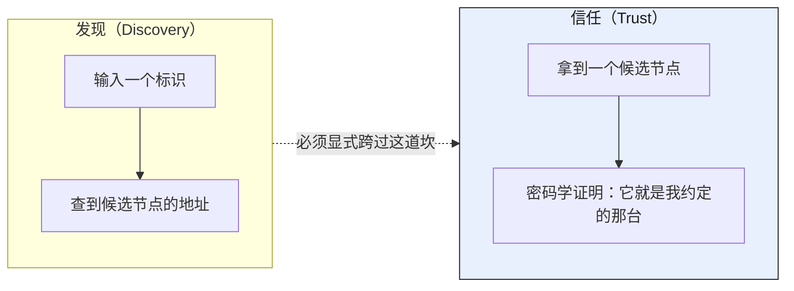
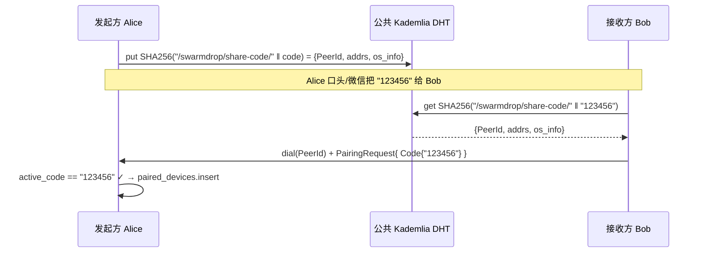
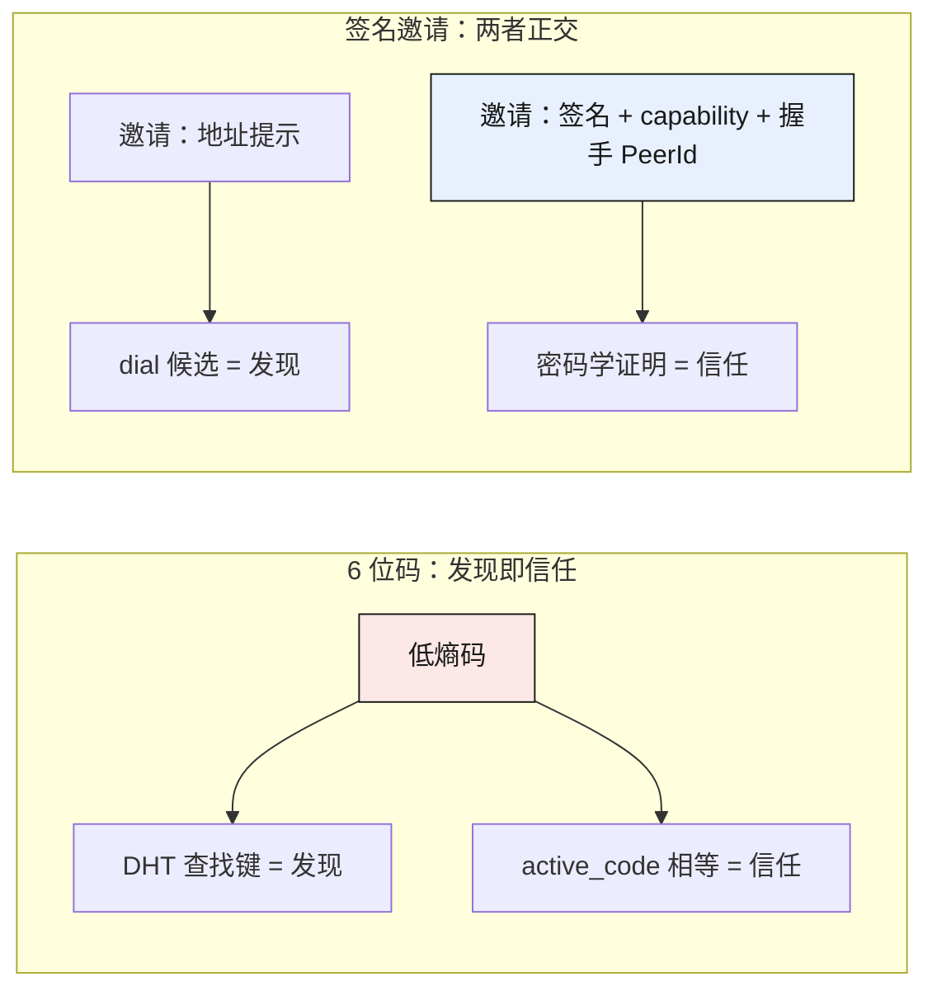

# 为什么弃用 6 位配对码——当「发现」被误当成「信任」

> 这是「签名邀请」系列的开篇，讲**为什么要换**：6 位配对码是个好用的早期验证脚手架，
> 但它把「找到对方」和「证明是对方」两件正交的事压进了同一个低熵数字里。本篇先把
> 「信任建立」这个概念讲清楚，再论证 DHT 分享码在这件事上从根上就错位了——不是熵不够，
> 是模型错了。后面几篇讲「换成什么」，答案的根都在这里。

## 结论先行

一句话：**6 位码适合早期把传输链路跑通，但不适合作为长期信任的锚点。** 它的致命缺陷不在
「6 位太短」——加长到 12 位也救不了——而在于它同时扮演了两个本该正交的角色：

| 角色 | 该由什么承担 | 6 位码的做法 |
|---|---|---|
| **发现**（找到候选节点的地址） | 公开、可枚举、可被任何人查询 | `SHA256(NS ‖ code)` 当 DHT 查找键 |
| **信任**（证明这个节点就是我面对面确认的那台设备） | 秘密、只进认证握手、不可被枚举 | **同一个码，无** |

三个互不相干的成熟系统（magic-wormhole、Matter、distributed-topic-tracker）独立收敛到同一条
定律：**用于「找到对方」的标识，必须与用于「证明是对方」的秘密正交。** SwarmDrop 的 6 位码是
唯一把两者合一的——这不是实现 bug，是模型选错了。

替代方向也已经定了：一次性、可验证、可过期的**签名邀请**（`PairInvite`），把「发现」和
「信任」彻底解耦。二维码不是另一种协议，只是同一条邀请链接的图形编码。现在
`crates/core/src/protocol/pairing.rs:28` 里 `Code` 变体已经删掉，只剩 `Direct` 和 `Invite`：

```rust
// crates/core/src/protocol/pairing.rs:28-36
pub enum PairingMethod {
    Direct,
    Invite {
        /// 邀请标识（发起端据此查 Registry）。
        invite_id: [u8; 16],
        /// bearer 凭证明文（发起端比对哈希；信道保密靠邀请串的 fragment 传递）。
        capability: [u8; 32],
    },
}
```

下面把「为什么弃」拆开讲。

## 先厘清：什么是「信任建立」

配对不是「连上就成功」。配对是**把一个密码学身份写进长期记录**——从此以后设备列表里那条
「Alice 的 MacBook」，得真的对应 Alice 那台机器的公钥，而不是任何冒充者。这条记录一旦写进
`paired_devices`，用户就会**主动点它发文件**——所以污染它的代价是文件明文投递给陌生人，
而不只是「配对失败」。

信任建立要回答的问题只有一个：

> **对面这个节点，是不是我（带外、面对面）约定的那一个？**

注意它和「发现」是两个正交的维度：



「查到了地址」到「证明了身份」之间那道坎，才是配对的全部难点。**6 位码的错误，是让同一个低熵
数字既当发现键、又当信任凭证，于是那道坎被悄悄抹平了。**

## 6 位码是怎么工作的

旧机制很直白：发起端把 6 位码映射成一条 DHT 记录，接收端用同一个码算出同一个键去查：



查找键的派生逻辑今天还留着（分享码域已废弃，同一个 `DhtKey` 现在只服务在线宣告）：

```rust
// crates/net/src/dht.rs:19-32
impl DhtKey {
    /// 命名空间键：`SHA256(len(namespace) ++ namespace ++ id)`。
    /// 例：分享码 `DhtKey::namespaced("/swarmdrop/share-code/", code.as_bytes())`。
    pub fn namespaced(namespace: &str, id: &[u8]) -> Self { /* ... */ }
}
```

关键在最后一步——发起端的校验是 `active_code == "123456"`。**它验证的是「码相等」，不是
「对面是我约定的那个人」。** 整个信任建立，全压在这一次字符串比较上。这就是错位的源头。

## 缺陷一（最本质）：DHT 记录只能「找到候选」，不能「证明身份」

这是四条里最该先讲的，因为它解释了另外三条为什么无法靠「打补丁」修掉。

DHT 记录是**公开、无认证、任何人可写**的。Kademlia 对 record 的处理是 last-write-wins——后写
的人无条件覆盖先写的。rust-libp2p 自己在源码注释里把记录的发布者字段叫做
**「(alleged) publisher」**（声称的发布者），上游的用词本身就是警告。而旧配对代码对这个字段是
无条件信任的：

```rust
// 旧栈 crates/core/src/pairing/manager.rs:113
let peer_id = record.publisher.ok_or(AppError::InvalidCode)?;   // ← 无条件信任
```

于是攻击者只要用自己的记录覆盖 `SHA256(code)`（免费、合法、协议允许），就能把 Bob 的查询
引到自己身上，再把 Bob 请求里学到的明文码和 hostname 转发给真 Alice——**一次完整的双向透明
MITM，两边 UI 都显示配对成功**。

根因就一句话：**「K 上有一条记录」这个事实，不携带任何关于「谁写的」的证明。** DHT 帮你找到了
一个候选地址，但「候选」永远只是候选。信任必须来自别处——一个只有真正的对端才能出示的密码学
凭证。6 位码模型里没有这个「别处」，所以发现即信任，找到即成功。这不是限流能补的洞，是模型
缺了一整个维度。

## 缺陷二：低熵——可枚举、可碰撞、可抢注

6 位数字空间只有 `10^6`，熵 `H(c) = log2(10^6) ≈ 19.93 bit`。因为查找键必须是接收方能独立
算出的确定性函数 `K = f(code)`，所以**查找键的熵永远不可能超过码的熵**。后果是三重的：

- **可枚举**：攻击者一次性预计算 `{SHA256(NS ‖ code)}` 全表 = **32 MB、约 0.05 秒**。开放
  DHT 结构上不存在守门人（Wolchok & Halderman, WOOT'10：*"BitTorrent DHTs cannot allow
  one and prevent the other."* 可查询性与可枚举性是同一个能力）。命中概率达 1 的查询速率
  `R* = 10^6 / 300s ≈ 3,333 次/秒`——这个速率在 2010 年的单台桌面 PC 上就已经被超出。
- **可碰撞**（不需要攻击者，随产品成功必然引爆）：生日界 `N² / (2×10^6)`，**N=1000 个并发
  活跃码 → 碰撞概率约 39%**。后果不是「配对失败」，是 Bob₁ 把文件发给了恰好也在等
  「123456」的陌生人 Alice₂，而 Alice₂ 的 `active_code` 校验照样通过。
- **可抢注**：见缺陷一的 last-write-wins。

要靠抬熵堵枚举，需要 38–41 bit ≈ **12–13 位数字**——直接杀死产品手感。HackerOne #1060541 的
判词逐字写过：*"Increasing OTP length (e.g., 4-digit to 6-digit) does not fix the
vulnerability."* 根因是缺认证，不是缺熵。

## 缺陷三：记录覆盖 / 过期 / 网络抖动 → 静默误连

低熵之外，DHT 作为「控制面 rendezvous」本身就不可靠：

- **覆盖**：如上，任何人可覆盖任何键。
- **过期校验校错了字段**：旧代码只看 Kademlia 传输层的 `record.expires`（每跳按接收端的
  `record_ttl` 重算，本项目 = 3600s），而记录里明明带了 `created_at`/`expires_at` 却从未被
  读过——**攻击者的投毒记录寿命是合法码的 12 倍**。「TTL=300s 所以窗口很小」是假安慰。
- **抖动**：DHT 的 put/get 在真实网络（尤其中国的 UDP 限速环境）下成功率、延迟都没有公开
  实测数据可押。查不到 → 配对失败；查到旧记录 → 静默误连。

这些都是「把信任锚点放在一个公开、可变、无认证的分布式存储上」的必然衍生症。换个 DHT、换个
哈希都治不了，因为病根在「用 DHT 记录承载信任」这件事本身。

## 缺陷四：配对码不适合在网页 / 桌面 / 移动间自然传播

这条最容易被忽略，但对 SwarmDrop 的产品形态是硬伤。理想的配对入口应该是「打开一个链接就能
和已配对设备传文件，不装应用也行」。6 位码做不到:

- 它是要**手输**的——移动端小键盘、口述、跨设备复制都别扭；
- 它要求**双方在同一个 DHT 窗口内同时在线**，才能一个 put 一个 get 撞上；
- 它**无法承载地址提示**，必须依赖公共 DHT 这个第三方，也就无法「带外自包含地传递」。

一个可以直接**复制、粘贴、扫码、点开**的东西，才谈得上在网页 / 桌面 / 移动之间自然流动。
数字码天生流不动。

## 诚实的岔路：我们一度想「保住码 + 补 PAKE」，为什么最后还是弃了

这是本篇最该讲透的权衡，不粉饰。2026-07-16 的 rendezvous 勘察当时给的结论其实是**「6 位码保
住，立刻修安全」**——因为 magic-wormhole 的码只有 16 bit（比我们的 20 bit **更少**），却安全了
十年。差别 100% 在架构：它把码只当「秘密认证段」喂进 SPAKE2，从不当公开查找键。三个系统同一
条定律：

| 系统 | 公开定位段 | 秘密认证段 |
|---|---|---|
| magic-wormhole | nameplate（服务器分配） | password（16 bit，只进 SPAKE2） |
| Matter | discriminator（12 bit，BLE/mDNS 广播） | setup passcode（27 bit，只进 SPAKE2+） |
| **旧 SwarmDrop** | **`SHA256(NS ‖ code)` —— 全码即查找键** | **无** |

所以「保码 + 加 PAKE」在密码学上完全成立：把码从查找键降级为只进 PAKE 的秘密，枚举、抢注、
碰撞一次性全关。**那为什么最后还是把码整个弃了？** 两条，都是 PAKE 补不上的：

1. **PAKE 仍然需要一个守门人。** 承认码公开、把认证移到 PAKE，仍需在查询路径上放限流器——
   否则合法用户（Alice 本人）就变成一个可被无限次静默拉动的 oracle。而那个限流器就是一台
   **rendezvous 服务器**。我们想要的是「自包含、带外传递、不依赖公共第三方」的配对入口，加
   PAKE 等于反向再引入一个必须常驻的控制面服务。
2. **PAKE 不解决缺陷一的另一半和缺陷四。** 它把「发现」那一侧洗干净了，但配对入口仍然是一个
   要手输的低熵码，**流不动**（缺陷四原样保留）。而签名邀请一次动作同时干掉发现侧的所有攻击面
   **和**传播问题——它本来就是一条能扫、能贴、能点开的链接。

结论：PAKE 是「在错的地基上盖对的房子」。地基（低熵码 + 必须的守门人）本身就是我们想拆的。
既然要重铺，就直接铺成把发现和信任彻底解耦的那种。

## 替代方向：签名邀请——把发现与信任解耦

`PairInvite` 是一个自包含、Ed25519 签名、带 TTL、一次性消费的载荷（详细数据模型与编码是后续
篇的主题，这里只给形状）：

- **可验证**：由发起方私钥签名，接收方本地验签即可确认「这条邀请没被篡改」。签名真正兜底的是
  身份 pin 覆盖不到的字段——尤其 `transport_policy`（防 LocalOnly 被静默改成走公网 relay）。
- **可过期**：默认 5 分钟 TTL，超时发起端立即拒收。
- **一次性**：发起端只保存 `hash(capability)`，CAS 消费，并发双花只有一个能赢。
- **发现与信任解耦**：邀请自包含地址提示（发现），但地址只是**连接提示不是身份**；最终身份
  只认 noise 握手得到的 PeerId。这一步我们从 libp2p 白拿——**握手即验证身份，连错人在密码学
  上不可能**（和 iroh ticket 的成立前提同构）。



二维码只是这条邀请链接的图形编码：有摄像头就扫，没有就复制 / 粘贴 / 点开,解析到的是**同一份**
邀请数据。它天生就能在网页 / 桌面 / 移动之间流动——缺陷四不复存在。

配对流程也从「连上即成功」变成一条必须逐步走完的握手：接收方解码验签检查 TTL → 连接发起方并
校验远端 PeerId 与邀请声明一致 → 出示 capability → 发起端校验哈希 / TTL / 未使用 → **双方各自
显式确认对方设备名与短指纹** → 才写入长期配对记录。任一步失败都不留信任。

## 小结

- **6 位码的病根不是熵，是模型**：它让同一个低熵数字既当发现键又当信任凭证，把「找到对方」和
  「证明是对方」两件正交的事合一了。
- **最本质的缺陷是「发现 ≠ 信任」**：DHT 记录公开、可覆盖、无认证，只能找到候选，永远无法证明
  身份——这不是限流能补的洞。低熵（枚举 / 碰撞 / 抢注）、记录覆盖过期抖动（静默误连）、流不动
  （不适合跨平台传播）都是它的衍生症。
- **「保码 + 加 PAKE」在密码学上成立但被否**：PAKE 仍需一个守门人服务器，且不解决传播问题。
  与其在错的地基上盖对的房子，不如直接铺解耦发现与信任的新地基。
- **替代方向是签名邀请**：一次性、可验证、可过期，自包含地址提示做发现、握手 PeerId + 签名 +
  capability 做信任，二维码只是同一链接的图形编码。

既然要做签名邀请，第一个问题是：**别人（iroh）的 ticket 是怎么做的，为什么它连签名都不要也
安全？** 下一篇就从 iroh-tickets 的源码级调研讲起——把「什么能白拿、什么必须我们自己补」分清楚。
