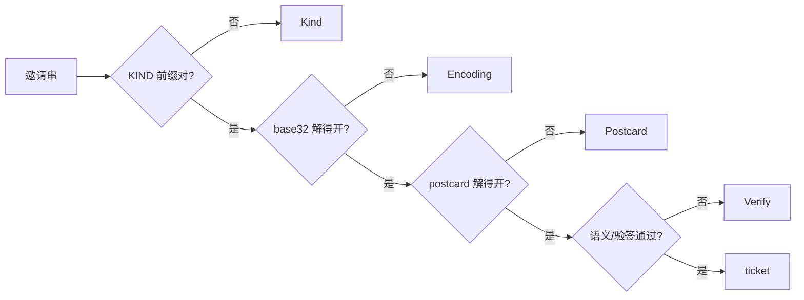

# iroh-tickets 的编码智慧，与它敢不签名的底气

> 这是 pairing-invite 系列的第一篇。我们要用一次性签名邀请替换 6 位配对码，动手前先把
> iroh-tickets 的源码从头读了一遍。本篇讲从中学到什么——**结论先行：ticket 的编码骨架值得整体
> 照抄，但它「不签名」的哲学在我们的场景要打一个补丁**。为什么能不签、我们为什么又非签不可，
> 这篇讲前半段，签名那一半留给下一篇。

## 结论先行

iroh-tickets 是一个只有两百来行的小库（`/Volumes/yexiyue/iroh-study/iroh-tickets/`），但它把
「怎么把一段连接信息塞进一个可复制、可扫码、能容错的字符串」这件事做得非常干净。我们的
`PairInvite`（`crates/invite/src/invite.rs`）把它的**编码四件套原样搬了过来**，只在一个地方分道
扬镳：

| 维度 | iroh EndpointTicket | 我们的 PairInvite | 差异原因 |
|---|---|---|---|
| KIND 前缀 | `endpoint` | `sdinvite` | 都是小写 ASCII 直拼 |
| wire 版本化 | postcard 单变体 enum | postcard 单变体 enum | 照抄 |
| 领域类型 ↔ wire | 手工镜像结构解耦 | 手工镜像结构解耦 | 照抄 |
| 错误分层 | `ParseError` 四分类 | `InviteParseError` 四分类 | 照抄 |
| 字符串编码 | base32-nopad | base32-nopad | 照抄（下一节讲为什么不用 base64url） |
| **是否签名** | **不签** | **Ed25519 尾置签名** | **分道扬镳** |

最有技术含量的一句话是：**iroh ticket 敢不签名，是因为它唯一安全敏感的字段（对端 id）会在 TLS
握手时被密码学强制校验——连错人在密码学上不可能，地址被人改了最坏也只是连不上。** libp2p 的
noise 握手有同样的性质，这份底气我们白拿。但我们往 ticket 里塞了 id 以外的安全敏感字段
（`transport_policy`），握手管不到它，所以补上签名。

下面拆开讲。

## 编码四件套

### 一、KIND 前缀：小写 ASCII 直拼

`Ticket` trait 只强制实现者提供三样东西——`KIND`、`encode_bytes`、`decode_bytes`
（`iroh-tickets/src/lib.rs:26`）。字符串形态是默认实现给的：

```rust
// iroh-tickets/src/lib.rs:44-49
fn encode_string(&self) -> String {
    let mut out = Self::KIND.to_string();
    data_encoding::BASE32_NOPAD.encode_append(&self.encode_bytes(), &mut out);
    out.make_ascii_lowercase();
    out
}
```

`KIND` 的注释明确要求「lower case ascii characters」（`lib.rs:29`）。前缀和 base32 载荷之间**没有
分隔符**——解码时靠 `strip_prefix` 一刀切开（`lib.rs:59`）。这要求前缀里不能出现 base32 字母表
（A-Z2-7）会产生歧义的东西，而全小写字母天然安全。

我们照做，`KIND = "sdinvite"`（`crates/invite/src/invite.rs:32`）。选纯字母还有一层考量——转大写
后仍落在 QR 码 alphanumeric 字符集内，这是下一节的伏笔。

### 二、postcard 单变体 enum：判别字节就是版本，但不是「版本号」

这是四件套里最容易被误解、也最值得学的一点。iroh 的 wire 结构不是直接序列化领域类型，而是包一层
单变体 enum：

```rust
// iroh-tickets/src/endpoint.rs:35-38
#[derive(Serialize, Deserialize)]
enum TicketWireFormat {
    Variant1(Variant1EndpointTicket),
}
```

postcard 对 enum 会写一个前导判别字节。`Variant1` 是第一个变体，判别码 `0x00`——这在它自己的
测试里被逐字节钉死（`endpoint.rs:203-210`，注释直接标 `// variant` `"00"`）。

关键在于**为什么是 enum 而不是一个 `version: u16` 字段**。`Ticket` trait 的文档把版本化整个甩给
实现者（`lib.rs:16-17`：「Versioning is left to the implementer」），而 n0 自己选 enum 的口径是:
**这些变体不是「版本号」，而是「可以并存、各自都合法」的编码形态**（not versions, since they might
both be equally valid）。线性的 `v1 < v2 < v3` 意味着新的一定取代旧的；而 enum 变体是**并列**的
——`BlobTicket` 至今停在 `Variant0`、`EndpointTicket` 用 `Variant1`，两者在同一个生态里长期共存
就是活证。未知变体在 postcard 里天然解码失败，不需要额外的版本比较逻辑。

我们的 wire 层一模一样：

```rust
// crates/invite/src/invite.rs:66-69
#[derive(Serialize, Deserialize)]
enum InviteWire {
    V1(InviteV1),
}
```

`V1` 是首变体、判别码 `0x00`，同样用一个测试钉死（`invite.rs:600`：「V1 判别码必须是 0x00」）。

### 三、wire 镜像结构：契约与领域类型解耦

`EndpointTicket` 对外的领域类型直接持有 `iroh_base::EndpointAddr`（`endpoint.rs:30-32`），但
`encode_bytes` 序列化的是**另一套手工镜像结构** `Variant1EndpointTicket` / `Variant1EndpointAddr`
（`endpoint.rs:40-43`、`129-138`），字段一个个手抄过去（`endpoint.rs:48-58`）。

好处是：领域类型可以随意重命名字段、改内部表示，只要 `encode_bytes` 里的手工映射跟着改，**wire
契约就纹丝不动**——已经发出去的 ticket 永远解得开。反过来，如果直接 `derive(Serialize)` 领域类型，
任何一次无心的字段改名都会悄悄破坏线上格式。

我们的 `PairInvite`（领域类型，`invite.rs:47-60`）和 `InviteV1`（wire 镜像，`invite.rs:71-90`）就是
这个关系，`to_wire` 手工搬运（`invite.rs:229-245`）。而且我们把这层解耦用得更狠：地址在领域类型里
是 `Addr`（multiaddr），进 wire 时转成二进制字节（`invite.rs:234`），因为 multiaddr 的文本形态大约
2x 膨胀，对 QR 长度不友好。

### 四、ParseError 四分层：最后一格是留给实现者的钩子

iroh 的解析错误刚好四类（`iroh-tickets/src/lib.rs:71-93`）:



前三格（`Kind` / `Encoding` / `Postcard`）是纯机械的格式校验，第四格 `Verify` 不一样——它是
**留给实现者的语义校验钩子**：

```rust
// iroh-tickets/src/lib.rs:90-92
/// Verification of the deserialized bytes failed.
#[error("verification failed: {message}")]
Verify { message: &'static str },
```

iroh 自己的 `EndpointTicket` 其实没用到它（decode 只做格式转换），但 trait 把这一格预留出来，就是
知道「有的 ticket 会需要在字节合法之后再做一层业务判定」。**我们就是那个 someone**——`InviteParseError`
照抄这四层（`invite.rs:113-127`），而 `Verify` 变体被我们用满了：验签失败、地址非法、未知网络策略、
载荷过短，全挂在这一格（`invite.rs:124-126`）。iroh 预留的钩子，正好接住了我们比它多出来的那一层
安全语义。

## 为什么 ticket 敢不签名

这是整篇最有技术含量的一段，也是我们做决策的支点。

`EndpointTicket` 是**纯明文的地址快照**——一个 `EndpointId`（32 字节 ed25519 公钥）加上若干
`TransportAddr`（`endpoint.rs:10-17`），没有签名、没有 TTL、没有一次性。任何人截获它、篡改里面的
地址、原样转发，解码都不会报错。这看起来很危险，但在 iroh 的信任模型里是安全的，原因是一句话：

> **iroh 的身份就是公钥本身，而这个身份在 TLS 握手时被密码学强制校验。**

拨号时，iroh 把目标 `EndpointId` 编进 TLS 的 SNI（形如 `<encoded-id>.iroh.invalid`），握手阶段
`verify_server_cert` 会**逐字节比对服务端证书的 SPKI 公钥与 SNI 里期望的公钥**。两者不一致，握手
直接失败。于是:

- **连错人在密码学上不可能**——中间人没有目标的私钥，签不出能通过 SPKI 比对的证书；
- **地址被篡改，最坏只是连不上**——你可能被引到一个错误的 IP，但那个 IP 上的节点公钥对不上，
  握手就断，不会误连到攻击者。

所以 ticket 里**唯一安全敏感的字段（id）自带验证**——它不需要 ticket 来自证真实性，握手会替它
兜底。地址只是「提示」，提示错了顶多降低可用性，伤不到安全性。

把这套哲学抽象出来，是三句话的授权模型：

| 维度 | 靠什么保证 |
|---|---|
| **真实性**（对面是不是我要连的那个人） | TLS/noise 握手强制比对公钥，与 ticket 无关 |
| **授权**（凭什么让我连 / 传文件） | 持有 ticket 这个 bearer capability——「拿到即有权」 |
| **ticket 自身** | 不自证真实性，只是承载 id + 地址提示的信封 |

### libp2p 同构：这份底气我们白拿

我们没换 iroh（[network-kernel 系列 00 篇](../network-kernel/00-why-not-migrate-iroh.md) 讲了为什么
保留 libp2p），但这条性质是通用的。libp2p 的 noise 握手同样强制 `PeerId`——连接建立时双方交换并
验证静态公钥，`PeerId` 由公钥派生，对不上就断连。**换句话说，「连错人在密码学上不可能」这个前提
在我们的栈里同样成立，一分钱没花就继承了。**

这一点直接反映在代码里。我们的 `NodeId`（就是包了一层的 `PeerId`）能**从自身就地恢复验签公钥**，
不需要 ticket 另带公钥字段：

```rust
// crates/net-base/src/node_id.rs:66-76
pub fn verify(&self, message: &[u8], signature: &[u8; 64]) -> bool {
    let mh = self.0.as_ref();
    // multihash code 0x00 = identity（非哈希、digest 即原文）
    if mh.code() != 0 {
        return false;
    }
    match libp2p_identity::PublicKey::try_decode_protobuf(mh.digest()) {
        Ok(pk) => pk.verify(message, signature),
        Err(_) => false,
    }
}
```

ed25519 的 `PeerId` 是 identity multihash（公钥 protobuf 直接内嵌、不经哈希），所以凭 `NodeId`
就能验签。我们的 `PairInvite` 因此也不带独立公钥字段——`inviter_id` 既是身份，又是验签公钥
（`invite.rs:75`、`180-184`）。这和 iroh「id 即公钥」是同一个道理。

## base32 还是 base64url：小写规范 + 大小写不敏感

iroh 用 `BASE32_NOPAD`，编码后 `make_ascii_lowercase()`（`lib.rs:47-48`），解码前
`to_ascii_uppercase()`（`lib.rs:62`）。这一对操作藏着一个很实用的性质:

**小写是规范形态，但解码大小写不敏感。** base32 的字母表是 `A-Z2-7`，全大写；库要求大写输入，所以
iroh 在编码后统一转小写做「规范展示形态」（URL 里好看、双击可全选、口述不费劲），解码时再转回大写
喂给解码器。于是同一个 ticket 无论大小写都能解开。

我们原设计文档本来写的是 base64url，调研后改成 base32-nopad（设计决策见
`openspec/changes/pair-invite-protocol/design.md` D2）。编解码逻辑与 iroh 逐行对齐:

```rust
// 编码（crates/invite/src/invite.rs:161-164）
out.push_str(&data_encoding::BASE32_NOPAD.encode(&bytes));
out.make_ascii_lowercase();

// 解码（crates/invite/src/invite.rs:171-173）
let bytes = data_encoding::BASE32_NOPAD
    .decode(rest.to_ascii_uppercase().as_bytes())
    .map_err(|e| InviteParseError::Encoding(e.to_string()))?;
```

为什么这个「大小写不敏感」对我们特别重要，是**给下一层 QR 优化埋的伏笔**：QR 码有一个
alphanumeric 编码模式，字符集是 `0-9 A-Z` 加几个符号——**全大写**。base32 的字母表恰好整个落在
里面，所以生成二维码前把整串 `to_ascii_uppercase()`，就能走 alphanumeric mode，比 base64url
（含小写、必掉进 byte mode）省大约 17% 的模块数。而解码端因为大小写不敏感，收到大写串照样解得开。
base64url 换不来这个好处——这是我们推翻原设计的直接理由。（QR 那一篇会单独展开。）

## 那我们为什么还要签名

到这里，编码骨架我们全抄了，连「id 靠握手兜底、不必自证」的底气也白拿了。那为什么 `PairInvite`
还要塞一个 64 字节的 Ed25519 签名（`invite.rs:88-89`、`153-165`）？

因为**我们往 ticket 里放了 id 以外的、安全敏感的、握手管不到的字段**——最要命的是
`transport_policy`（`invite.rs:56`）。它有 `Auto` 和 `LocalOnly` 两个值:`LocalOnly` 是一个产品
承诺——「这个邀请只在局域网内用，不许走公网 relay」。这个字段**不在 TLS 握手的保护范围内**:握手
只验对面是不是本人，管不到「这条邀请当初是不是承诺了只走局域网」。中间人把 `LocalOnly` 静默改成
`Auto`，握手照样成功，但你的流量被悄悄引上了公网中继——身份 pin 对此完全无能为力。

签名兜的就是这一格。因为签名尾置、signable 覆盖包括 enum 判别码在内的全部前置字节
（`invite.rs:157-158`），任何一个字节被翻转都会导致验签失败——我们有一个测试逐字节翻转来钉死这条
性质（`invite.rs:435-444`）。iroh 不需要这层，是因为它的 ticket 里没有这种「握手覆盖不到、却必须
可信」的字段；我们需要，是因为我们有。

一句话收尾这篇的判断:**握手负责真实性，签名负责握手够不着的那部分字段完整性，两者不重叠、缺一
不可。** 至于签名具体怎么尾置、为什么这样切能「零成本规范化」、怎么防降级攻击，是下一篇
[《签名尾置：让规范化免费的那一刀》] 的主题。
