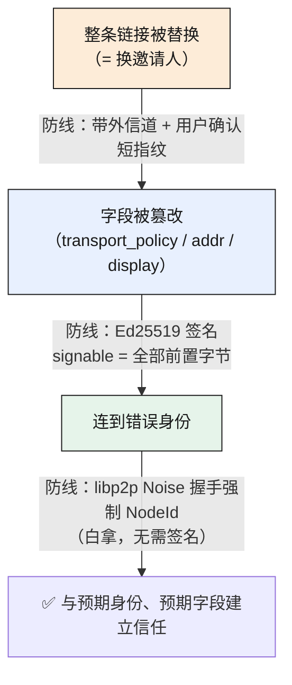
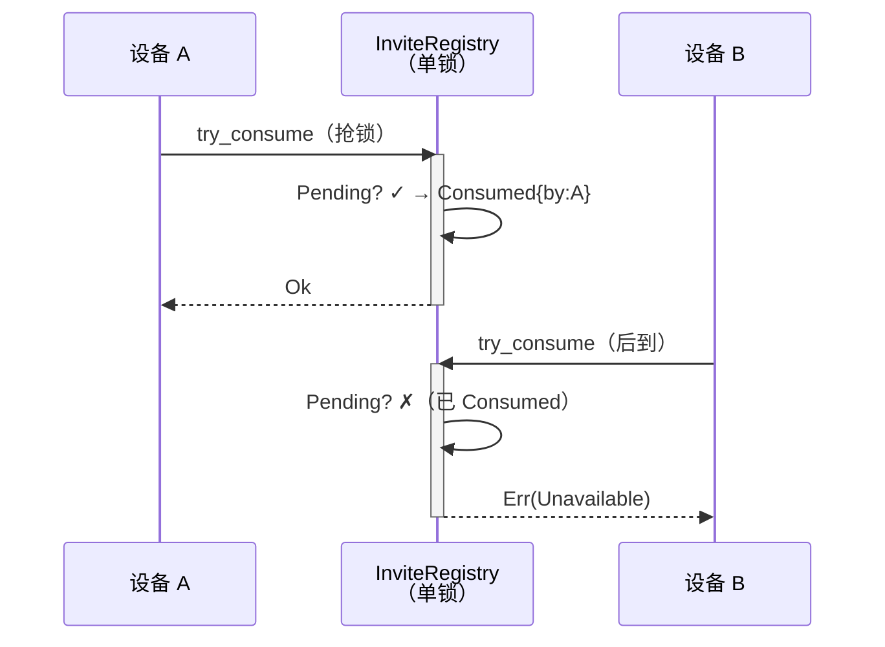

# PairInvite 协议内核——签名到底兜底什么，又怎么做到零成本

> 本篇是 pairing-invite 系列的技术深水区：[00](00-why-drop-pairing-code.md) 交代了为什么要用一次性签名邀请取代 6 位配对码，这一篇钻进协议内核本身。**一句话主旨——邀请里那 64 字节 Ed25519 签名，不是为了防你「连错人」（那件事握手早就兜死了），而是为了防身份 pin 覆盖不到的字段被静默篡改，首要保护对象是 `transport_policy`。** 想清楚「签名到底在防谁」，才谈得上把它做得又对又便宜。

## 结论先行：签名的职责边界

先把判断摆出来，后面再逐条拆：

1. **连错人不是签名的活。** SwarmDrop 跑 libp2p，拨号方把目标 `NodeId` 编进 Noise 握手，握手逐字节强制校验对端公钥——连到错误身份在密码学上不可能。这个性质我们从 libp2p 白拿，和 iroh ticket「不签名也安全」的前提同构。
2. **签名兜的是「身份 pin 管不到的字段」。** 邀请串里除了身份，还有地址提示、网络策略、展示名。这些字段握手管不着，被篡改也不会让你连错人，却能让你**连对了人、却按被篡改的规则连**——最危险的是 `transport_policy`：一个 `LocalOnly` 邀请被中间人悄悄改成 `Auto`,你以为只走局域网，实际被引到公网 relay。这是 iroh ticket 完全没有、而我们必须靠签名兜底的那个字段。
3. **签名做不到的事，签名不假装能做。** 整条链接被换掉（= 换了邀请人）签名防不了——那是带外信道 + 用户确认的防线，不是密码学的防线。签名的全部价值是**把攻击面从「改任意字段」压缩到「换整条链接」**,成本仅 64 字节 + 一次验签。

下面这张图是三道防线的分工，越靠内越「密码学硬」，越靠外越「靠人」：



## 一、逐字段攻击分析：签名到底救了哪个字段

把邀请的每个字段单独拎出来问「篡改它会怎样」，才知道签名值不值。领域类型 `PairInvite` 的字段定义在 `crates/invite/src/invite.rs:46-60`：

```rust
pub struct PairInvite {
    pub invite_id: [u8; 16],
    pub capability: [u8; 32],          // 256bit bearer 凭据
    pub inviter: NodeAddr,             // 身份 + 地址提示
    pub issued_at: u64,
    pub expires_at: u64,
    pub transport_policy: TransportPolicy,
    pub display_name: String,          // 仅供确认界面展示
    pub display_platform: String,
}
```

逐字段的威胁模型：

| 被篡改字段 | 后果 | 严重度 | 签名是否唯一防线 |
|---|---|---|---|
| `inviter_addrs` | 无害于身份（握手仍 pin `NodeId`），但可引流到攻击者的恶意 relay | 中 | 否，最坏只是连不上 |
| **`transport_policy`** | **`LocalOnly` → `Auto`：静默走公网 relay，违反「仅局域网」产品承诺** | **高** | **是——这是签名真正兜底的字段** |
| `display_name` / `display_platform` | 确认界面冒充（「书房的 Mac」→ 伪装成可信设备），社会工程 | 中 | 否，终防线是双方确认 + 短指纹 |
| `capability` | 哈希对不上，发起端直接拒（见第四节），仅 DoS | 低 | 否 |
| 整条链接替换 | = 换了邀请人，签名对新链接照样有效 | — | 签名防不了，防线在带外 + 用户确认 |

`transport_policy` 是全表唯一「签名是唯一防线」的字段。它的产品语义在 `invite.rs:37-44`：

```rust
pub enum TransportPolicy {
    Auto,       // 允许直连 / relay / 公网 fallback
    LocalOnly,  // 仅局域网：受邀方须过滤地址提示只留私网、禁用公网 fallback
}
```

`LocalOnly` 不是提示，是承诺。受邀方拿到邀请后按它过滤可用地址（`usable_addrs`,`invite.rs:215-226`）——`LocalOnly` 只保留私网直连地址、公网地址一律丢弃。如果这个字节能被中间人从 `1` 改成 `0`,「你的文件只在局域网里流动」这句产品承诺就被静默击穿了，而用户界面上什么都看不出来。**这就是为什么我们不惜多背 64 字节签名。**

## 二、签名尾置：零成本规范化（本篇的技术亮点）

签名有个恼人的鸡生蛋问题：签名要覆盖「除签名外的全部字节」,但序列化又得先有签名才能产出最终字节。常规解法是**规范化序列化两次**——先序列化不含签名的部分算签名，再把签名塞进去重新序列化，还得保证两次的「前缀字节」逐字节一致（否则验签方切出来的 signable 和签名方算的不是同一串）。

我们用一个结构技巧把这一切消掉：**让 `signature` 永远待在 wire 结构的最末位,且是定长 64 字节**。于是 `signable = bytes[..len - 64]`——切掉尾巴 64 字节，剩下的天然就是「除签名外的全部前置字节」,一刀切定,不需要第二次序列化。

wire 结构 `InviteV1`（`invite.rs:71-90`）把 `signature` 钉死在末位：

```rust
#[derive(Clone, Serialize, Deserialize)]
struct InviteV1 {
    invite_id: [u8; 16],
    capability: [u8; 32],
    inviter_id: Vec<u8>,        // NodeId multihash（ed25519 下 38B）
    inviter_addrs: Vec<Vec<u8>>,
    issued_at: u64,
    expires_at: u64,
    transport_policy: u8,       // 0 = Auto，1 = LocalOnly
    display_name: String,
    display_platform: String,
    #[serde(with = "sig_serde")]
    signature: [u8; 64],        // 必须末位：postcard 定长数组无长度前缀 → 尾部恰为 64 字节裸签名
}
```

签名流程（`invite.rs:153-165`）就三步，没有第二次规范化：

```rust
pub fn encode(&self, secret: &SecretKey) -> String {
    let mut wire = self.to_wire([0u8; 64]);        // 占位签名先填 0
    let unsigned = postcard::to_stdvec(&InviteWire::V1(wire.clone())).expect("postcard");
    let sig = secret.sign(&unsigned[..unsigned.len() - 64]);  // 签「除尾 64 字节外的全部」
    wire.signature = sig;                          // 写回真签名
    let bytes = postcard::to_stdvec(&InviteWire::V1(wire)).expect("postcard");
    // ... base32-nopad 编码 + 小写规范化
}
```

关键点：占位版和最终版**前缀逐字节一致**——因为签名放最末位,填 0 还是填真签名，都不影响它前面任何字节的编码。所以「先序列化占位版取 signable」和「最终序列化」的前缀是同一串,验签方切出来的和签名方算的自然对得上。

### 尾置为什么能顺带防降级

`signable = bytes[..len-64]` 里 **`bytes[0]` 就是 postcard 的 enum 判别码**。wire 层是个单变体 enum（`invite.rs:66-69`）：

```rust
enum InviteWire {
    V1(InviteV1),   // postcard 编码：1 字节判别码 0x00 即版本号
}
```

判别码进了 signable,意味着**版本号也被签名覆盖**。攻击者没法把一个 V2 邀请的字节尾巴嫁接到 V1 判别码上骗过老客户端——改判别码即改 signable,验签立刻失败。降级攻击被这根尾巴顺手挡了,一分钱没多花。

### `[u8; 64]` 的 serde 小坑

有个不得不处理的细节：serde 内置的数组 `Serialize`/`Deserialize` impl **只到 `[u8; 32]`**,64 字节数组没有现成实现。所以 `sig_serde` 模块（`invite.rs:94-110`）把它拆成两段 `[u8; 32]` 元组来序列化：

```rust
pub fn serialize<S: Serializer>(sig: &[u8; 64], s: S) -> Result<S::Ok, S::Error> {
    let lo: [u8; 32] = sig[..32].try_into().unwrap();
    let hi: [u8; 32] = sig[32..].try_into().unwrap();
    (lo, hi).serialize(s)
}
```

关键是这层拆分**在 postcard 下是零开销的**：postcard 对定长数组和元组都不写长度前缀,`(lo, hi)` 编码出来就是紧凑的连续 128... 不，是连续 64 字节、中间无任何分隔符。所以尾部依旧「恰好是 64 字节裸签名」,`bytes[..len-64]` 的切分契约丝毫不受影响。**换成 JSON 或 bincode 这层拆分就会漏字节进来,尾置切分就崩了——这是 postcard 定长紧凑编码给我们的白食。**

## 三、公钥从 NodeId 就地恢复：邀请不带独立公钥字段

验签需要公钥。一个自然的问题是：邀请串要不要额外塞一个公钥字段?**不用——公钥已经藏在 `inviter_id` 里了。**

Ed25519 的 libp2p `PeerId` 是一个 **identity multihash**：multihash code `0x00` 表示「不哈希、digest 即原文」,而这个原文就是公钥的 protobuf 编码。换句话说,`NodeId` 本身就内嵌了完整公钥,不是公钥的哈希。所以验签时直接从 `NodeId` 就地把公钥解出来即可（`crates/net-base/src/node_id.rs:66-77`）：

```rust
pub fn verify(&self, message: &[u8], signature: &[u8; 64]) -> bool {
    let mh = self.0.as_ref();
    if mh.code() != 0 {          // multihash code 0x00 = identity（非哈希）
        return false;
    }
    match libp2p_identity::PublicKey::try_decode_protobuf(mh.digest()) {
        Ok(pk) => pk.verify(message, signature),
        Err(_) => false,         // 非 identity 编码或非法公钥 → 恒 false，不 panic
    }
}
```

于是 `decode` 里验签这段（`invite.rs:180-184`）只需 `inviter_id`,不碰任何独立公钥字段：

```rust
let inviter_id = NodeId::from_bytes(&wire.inviter_id)
    .map_err(|_| InviteParseError::Verify("发起方身份非法"))?;
if !inviter_id.verify(&bytes[..bytes.len() - 64], &wire.signature) {
    return Err(InviteParseError::Verify("签名无效（邀请被篡改或伪造）"));
}
```

**省字段不是为了省那 32 字节,是为了消除一个不一致源**：如果邀请同时带 `inviter_id` 和一个独立 `pubkey`,两者理论上可能对不上,就得多写一条「校验 pubkey 派生出的 id == inviter_id」的逻辑。就地恢复把这个二元校验降成一元——邀请里只有一个身份来源,没有对不齐的余地。

## 四、一次性 = 发起端内存 CAS,明文 capability 绝不落盘

签名保证了邀请**没被篡改**,但保证不了它**没被重放**——同一条合法邀请被扫两次怎么办?一次性语义不在字节里,在发起端一张内存状态表 `InviteRegistry`（`invite.rs:294-389`）。

三个刻意的设计选择：

**1. 只存 capability 的哈希,明文绝不落盘。** `register`（`invite.rs:306-315`）存进去的是 `Sha256::digest(capability)`,不是明文:

```rust
PendingInvite {
    capability_hash: Sha256::digest(invite.capability).into(),  // 明文 capability 绝不进本表/日志/持久化
    expires_at: invite.expires_at,
    state: InviteState::Pending,
}
```

capability 是 256bit bearer 凭据——谁持有它谁就能消费邀请。所以它在发起端的存活形态只有哈希：即便进程内存被 dump、日志被翻,拿到的也是不可逆的哈希,消费时用相同哈希比对即可。

**2. 双阶段：非消费预检 + 原子消费。** 入站请求刚到达时先跑一次 `check`（`invite.rs:320-339`）——存在 + 未过期 + 哈希匹配 + 状态 `Pending`,**但不改状态**。它的作用是在用户还没确认前就早拒明显非法的请求,**不占用那唯一一次消费额度**。真正的消费走 `try_consume`（`invite.rs:345-368`),在用户点「接受」时才发生,单锁内完成检查-置换（CAS）:

```rust
pub fn try_consume(&self, invite_id, capability, by, now) -> Result<(), InviteRejectReason> {
    let mut invites = self.invites.lock().expect("registry lock");
    let entry = invites.get_mut(invite_id).ok_or(InviteRejectReason::Unknown)?;
    if now >= entry.expires_at { return Err(InviteRejectReason::Expired); }
    if entry.state != InviteState::Pending { return Err(InviteRejectReason::Unavailable); }
    let hash: [u8; 32] = Sha256::digest(capability).into();
    if hash != entry.capability_hash { return Err(InviteRejectReason::BadCapability); }
    entry.state = InviteState::Consumed { by };   // CAS：Pending → Consumed，单锁内原子
    Ok(())
}
```

**3. 并发双花恰有一胜。** 检查和置换在同一把锁内,所以两台设备同时扫同一个码,只有先拿到锁的那台把状态从 `Pending` 翻成 `Consumed`,另一台进来看到状态已非 `Pending`,拿 `Unavailable`。这有单测钉死（`concurrent_double_spend_single_winner`,`invite.rs:533-557`）——8 线程并发 `try_consume`,断言 `wins == 1`。



一个诚实的取舍：**这张表是纯内存态,发起端进程重启就丢。** 后果是重启后所有在途邀请一律 `Unknown`（`invite.rs:327`）——受邀方得重新扫码。我们接受这个语义:邀请 TTL 本就只有 5 分钟（`INVITE_TTL_SECS`,`invite.rs:35`),重启期覆盖不了几个在途邀请,而换来的是「一次性凭据永不落盘」的干净安全边界。TTL 的权威判定也在发起端这张表——`decode` 侧虽然也有 `is_expired`,但那只是给受邀方的 UX 预检,真正拒绝过期邀请的是发起端 `try_consume` 里的 `now >= expires_at`。

## 五、wire 契约锁定:字段序即契约

签名尾置、判别码即版本这套设计,全都建立在一个前提上——**wire 字节布局绝对稳定**。任何人不小心调换了 `InviteV1` 的字段顺序、或者把某个 `u64` 改成 `u32`,已经发出去的邀请串就再也解不出来了,而且是静默的:老客户端拿到新字节,验签可能仍过(如果改动在 signable 内且重新签了名),但字段错位。

所以有一个「合约测试」把字节布局钉死——`wire_v1_hex_snapshot`（`invite.rs:579-606`）用固定 `invite_id`/`capability` 产出确定性字节流,断言布局:

```rust
assert_eq!(bytes[0], 0x00, "V1 判别码必须是 0x00");   // enum tag
assert_eq!(&bytes[1..17], &[0x11; 16]);              // invite_id
assert_eq!(&bytes[17..49], &[0x22; 32]);             // capability
// 尾 64 字节是签名（签名尾置契约）
let sig: [u8; 64] = bytes[bytes.len() - 64..].try_into().unwrap();
assert!(invite.inviter.id.verify(&bytes[..bytes.len() - 64], &sig));
```

固定字段的字节偏移一览(这张表本身就是 wire 契约):

| 偏移 | 长度 | 字段 | 说明 |
|---|---|---|---|
| `[0]` | 1B | enum 判别码 | `0x00` = V1(进 signable → 防降级) |
| `[1..17]` | 16B | `invite_id` | 定长数组无前缀 |
| `[17..49]` | 32B | `capability` | 定长数组无前缀 |
| … | 变长 | `inviter_id` / `addrs` / 时间戳 / policy / 展示名 | 变长字段带 postcard varint 前缀 |
| 末 64B | 64B | `signature` | `signable = bytes[..len-64]` 的切点 |

这个测试的注释写得很重:「**本测试失败 = wire 契约被改动**——已发布的邀请串将无法解析,禁止随手『修』这个测试」。它不是普通单测,是一道防止未来的自己手滑的闸。配套还有一个 `tampered_fields_are_rejected`（`invite.rs:426-454`）——逐字节翻转 signable 里的**每一个**字节(含判别码和 `transport_policy`),断言全部被拒,把「签名覆盖全部前置字节」这个性质也钉死了。

## 小结

- **签名的职责边界想清楚了,才知道它值 64 字节**:防的不是连错人(握手兜底),是身份 pin 覆盖不到的字段完整性,首要保护 `transport_policy`——`LocalOnly` 的产品承诺全靠它。
- **签名尾置是零成本规范化**:`signature` 钉在 wire 末位定长 64 字节 → `signable = bytes[..len-64]` 一刀切定,天然覆盖含 enum 判别码在内的全部前置字节(顺带防降级),无需第二次序列化。`[u8;64]` 拆两段 `[u8;32]` 在 postcard 下仍紧凑无分隔。
- **公钥从 `NodeId` 就地恢复**:ed25519 PeerId 是 identity multihash,公钥内嵌不哈希,邀请不带独立公钥字段——省的不是字节,是一个不一致源。
- **一次性靠发起端内存 CAS**:只存 `sha256(capability)`,明文绝不落盘;`check` 非消费预检 + `try_consume` 原子 `Pending→Consumed`,并发双花恰一胜。代价是重启丢在途邀请,用 5 分钟 TTL 换永不落盘的干净边界。
- **wire 契约靠合约测试锁定**:字段序即契约,`wire_v1_hex_snapshot` 是防止未来手滑的闸。

签名、TTL、一次性都齐了,可这条邀请串有 330-390 个字符——直接甩给用户没法用。**下一篇 [03](03-qr-uppercase-and-core-single-source.md) 讲这 300 多字符怎么变成一张好扫、暗色主题下也不翻车的二维码:为什么整串转大写能省 15% 模块、为什么纠错等级要压到 M、为什么三端共用同一个 Rust 编码源。**
