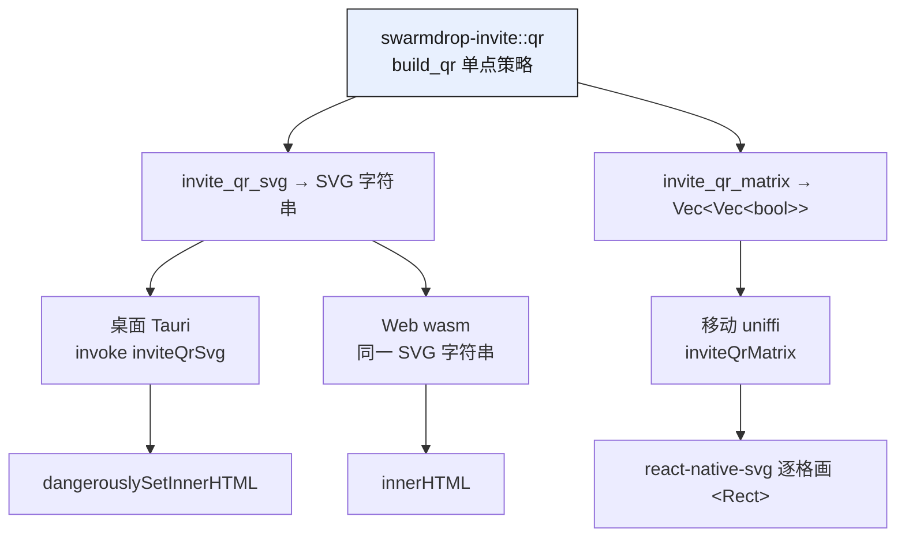

# 二维码的大写魔法与三端统一

> pair-invite 系列第三篇。前两篇把邀请协议讲透了——[签名 wire、一次性消费、TTL](02-pairinvite-protocol.md)。本篇讲两件顺手做对的小事：一个**零成本优化**（喂 QR 编码器前把邀请串整串 `.to_ascii_uppercase()`），把二维码版本从 v13-15 降到 v11-12、模块数掉约 15%、扫码成功率显著上升；和一个**架构决策**（二维码生成放 Rust core 而非三端各接一个 JS 库），落在「core 单源、三端薄壳」的主轴上。

## 结论先行

两句话把本篇讲完：

1. **大写化是纯赚的**。邀请串规范形态是小写 base32，只能走 QR 的 byte 模式（8 bit/字符）；而 base32 的大写字母表 `A-Z2-7` **100% 落在 QR alphanumeric 字符集**，改喂大写串就切进 alphanumeric 模式（5.5 bit/字符，密度 1.45×）。所有主流 QR 库自动做 segment 检测，只需把大写串喂进去。解码侧本就大小写不敏感，所以这一步**零风险**——版本从 v13-15 降到 v11-12，模块边长少 8 个，摄像头识别更稳。

2. **二维码生成属于 core，不属于三端**。桌面 / Web / 移动共用同一个 `swarmdrop-invite::qr`：同一套编码策略（大写 + ECL::M + 4 模块 quiet zone + 深模块不反色）单点固化，二维码与邀请串同 crate、同源。代价是桌面/移动各写 ~30 行渲染组件（没有现成库直接吃），换来的是三端**不可能漂移**。

下面分别展开。

## 一、大写魔法的原理

先看邀请串长什么样。`PairInvite::encode` 的产物是 `KIND` 前缀 + base32-nopad，最后整串转小写作为规范形态：

```rust
// crates/invite/src/invite.rs:160-165
let bytes = postcard::to_stdvec(&InviteWire::V1(wire)).expect("postcard");
let mut out = String::from(KIND);
out.push_str(&data_encoding::BASE32_NOPAD.encode(&bytes));
out.make_ascii_lowercase();
out
```

wire 里有 16B invite_id + 32B capability + 38B 身份 + 地址提示 + 64B 签名……postcard 压完约 180-220 字节，base32 展开 1.6× 后是 ~300 字符的串。这个长度对二维码很敏感——**它恰好卡在两个版本区间的分界上**。

### 为什么小写只能走 byte 模式

QR 有四种数据编码模式，每种对字符集有硬性要求：

| 模式 | 字符集 | 每字符位数 |
|---|---|---|
| Numeric | `0-9` | 3.33 bit |
| **Alphanumeric** | `0-9 A-Z`（**仅大写**）+ ` $%*+-./:` | **5.5 bit** |
| Byte | 任意 8-bit | 8 bit |

关键在 alphanumeric 那行的**「仅大写」**：小写字母 `a-z` 不在集里。我们的规范邀请串是小写 base32，含 `a-z`，于是 QR 编码器只能退回 byte 模式，每字符实打实占 8 bit。~300 字符 ×8 bit ≈ 2400 bit，落进 byte-M 容量表要到 v13-15。

### 大写化：base32 字母表恰好全落在 alphanumeric 里

这是整个技巧的支点，也是我们跨两路调研反复印证的一点：**base32（RFC 4648）的大写字母表是 `A-Z2-7`——32 个字符全部是 `0-9 A-Z` 的子集**，一个都不越界。所以只要把串整串大写，QR 编码器立刻能选 alphanumeric 模式，每字符从 8 bit 掉到 5.5 bit。

连 `KIND` 前缀都是安全的——它是纯字母，大写后照样在集内，源码注释专门点了这件事：

```rust
// crates/invite/src/invite.rs:31-32
/// 邀请 KIND 前缀（纯字母——转大写后仍在 QR alphanumeric 字符集内）。
const KIND: &str = "sdinvite";
```

于是 `build_qr` 的第一行就是整串大写，别的什么都不用做——主流 QR 库（我们用的 `fast_qr` 也一样）会自动 segment 检测、自动选中 alphanumeric 模式：

```rust
// crates/invite/src/qr.rs:19-24
fn build_qr(invite: &str) -> Result<QRCode, QrError> {
    QRBuilder::new(invite.to_ascii_uppercase())
        .ecl(ECL::M)
        .build()
        .map_err(|e| QrError(e.to_string()))
}
```

### 容量对比：同样 ~300 字符，差两个版本

把 v11-15 在 ECL-M 下两种模式的字符容量摆出来（ISO/IEC 18004 标准表）：

| 版本 | 边长（模块） | alphanumeric-M | byte-M |
|---|---|---|---|
| v11 | 61 | 468 | 321 |
| v12 | 65 | 528 | 365 |
| v13 | 69 | 600 | 415 |
| v14 | 73 | 656 | 453 |
| v15 | 77 | 734 | 507 |

alphanumeric 每列都是同版本 byte 列的 ~1.45×。~300 字符的邀请串：走 byte 要 v13-14（byte-M 容量 415/453 才装得下），走 alphanumeric 只需 v11-12（468/528）。**同一段数据，编码模式换一下，二维码边长少 8 个模块**——版本每降一级边长 −4 模块，摄像头在同样物理尺寸下每个模块占的像素更多，弱光/斜角/糊焦下的识别率肉眼可见地好起来。

这不是估的，测试里直接断言了「大写版本严格小于小写版本」：

```rust
// crates/invite/src/qr.rs:96-111
#[test]
fn uppercase_lowers_qr_version() {
    let invite = sample_invite();
    let upper = QRBuilder::new(invite.to_ascii_uppercase()).ecl(ECL::M).build().unwrap();
    let lower = QRBuilder::new(invite.clone()).ecl(ECL::M).build().unwrap();
    assert!(upper.size < lower.size, /* ... */);
}
```

> 一处诚实的口径差异：模块**总数**的降幅，`qr.rs` 的文档注释记作 −15%，`invite.rs` 的注释记作 ~17%——具体百分比取决于邀请串长度落在哪两个版本之间（边长 −8 模块对应面积降 20%+，但实际数据区占比另算）。硬事实只有一个：**版本降两级，边长 −8 模块**。别把某个约数当精确承诺。

### 为什么零风险：解码侧本就大小写不敏感

大写化不改变二维码代表的**数据**，只改变它的编码模式。反向读回来时，`decode` 在 base32 解码前先把 payload 整体大写，所以载荷大小写从来不影响解码：

```rust
// crates/invite/src/invite.rs:169-173
pub fn decode(s: &str) -> Result<Self, InviteParseError> {
    let rest = s.trim().strip_prefix(KIND).ok_or(InviteParseError::Kind)?;
    let bytes = data_encoding::BASE32_NOPAD
        .decode(rest.to_ascii_uppercase().as_bytes())   // ← payload 大小写无所谓
        .map_err(|e| InviteParseError::Encoding(e.to_string()))?;
```

round-trip 测试把这个契约钉死了——同一邀请，小写规范形态与「大写 payload」都解得出同一个 `PairInvite`：

```rust
// crates/invite/src/invite.rs:418-422
let back = PairInvite::decode(&s).unwrap();
assert_eq!(back, invite);
// QR 大写形态：payload 大写可解（KIND 前缀保持小写拼接）
let upper = format!("{KIND}{}", s[KIND.len()..].to_ascii_uppercase());
assert_eq!(PairInvite::decode(&upper).unwrap(), invite);
```

注意这里的契约边界：**载荷**大小写不敏感，`KIND` 前缀走的是普通 `strip_prefix`（区分大小写）。`build_qr` 为了密度把**整串**大写（连 `sdinvite` 一起变成 `SDINVITE`），所以扫码读回的原始文本是全大写的——要复原成能喂进 `decode` 的规范形态，输入侧得先把整串折回小写。这一步归**输入侧**管，正是下一篇的主题；此处只要记住：编码这一侧，大写化没有任何数据风险。

## 二、编码规范单点固化

`build_qr` 只有 5 行，却把三端二维码的**全部**策略钉在一处。逐条讲为什么是这些值：

| 决策 | 取值 | 为什么 |
|---|---|---|
| 大写化 | `invite.to_ascii_uppercase()` | 见上——切 alphanumeric 模式，降版本 |
| 纠错级别 | `ECL::M`（15%） | 屏幕→摄像头是近距、干净、无遮挡、无 logo 的场景，M 足够；Q/H 只会把数据挤上更高版本、模块更密**更难**扫 |
| quiet zone | 4 模块 | ISO 18004 硬性要求，少一圈很多解码器直接拒读 |
| 配色 | 深模块 `#0a0a0a` + 白底，**不随暗色主题反色** | 摄像头对「浅模块暗底」的反色 QR 识别率显著更差 |

后两条落在两个渲染出口上：SVG 出口用 `.margin(4)` 和 `.module_color([10,10,10,255])`（透明背景，白卡由渲染端套）；矩阵出口手工补 `const QZ: usize = 4` 的静默区，因为 `fast_qr` 的 `qr.data` 只有裸模块、不含 quiet zone。

```rust
// crates/invite/src/qr.rs:29-53（节选）
pub fn invite_qr_svg(invite: &str) -> Result<String, QrError> {
    let qr = build_qr(invite)?;
    Ok(SvgBuilder::default()
        .shape(Shape::Square)
        .margin(4)                          // quiet zone
        .module_color([10, 10, 10, 255])    // 深模块
        .to_str(&qr))
}

pub fn invite_qr_matrix(invite: &str) -> Result<Vec<Vec<bool>>, QrError> {
    let qr = build_qr(invite)?;
    const QZ: usize = 4;                    // 矩阵出口手工补 quiet zone
    // ...把 qr.data 拷进带 4 模块边距的方阵
}
```

要改纠错级别、要换编码模式、要调静默区宽度——**只动 `build_qr` 这一处**，SVG 和矩阵两个出口自动同步。这是「策略单点」最朴素的价值：没有第二个地方可以偷偷长歪。

## 三、架构决策：二维码生成放 Rust core

**结论先行**：二维码生成放进 `crates/invite`（core 层），而不是三端各接一个 JS/RN 的二维码库。理由和整个项目「core 单源、三端薄壳」的主轴完全一致，只是这次的「单源」多了一层：二维码不只是三端策略统一，它还和邀请串**同 crate、同源**——生成邀请的编码器和把邀请画成二维码的编码器是同一个 crate 的两个模块，单一职责收在一处。

`swarmdrop-invite` 是一个 wasm-clean 的独立层，只依赖类型底座、不依赖 core：

```toml
# crates/invite/Cargo.toml（节选）
swarmdrop-net-base = { workspace = true }   # 只依赖身份/地址类型底座
fast_qr = { version = "0.13", features = ["svg"] }   # wasm-first 二维码库
```



### 两个出口，因为 RN 没有 DOM

为什么一个 crate 要吐两种形态？因为消费端的渲染能力不对称：

- **桌面 / Web 有 DOM**——直接把 `invite_qr_svg` 产出的 SVG 字符串塞进去就行。桌面走 Tauri command，前端 `dangerouslySetInnerHTML`：

  ```rust
  // src-tauri/src/commands/pairing.rs:40-41
  pub fn invite_qr_svg(invite: String) -> AppResult<String> {
      swarmdrop_invite::invite_qr_svg(&invite)
  ```
  ```tsx
  // src/components/pairing/invite-qr.tsx:59（节选）
  // 二维码 SVG 由后端受信任生成（纯几何 path，无脚本），安全内联
  dangerouslySetInnerHTML={{ __html: state.svg }}
  ```

- **React Native 没有 DOM、没有 `innerHTML`**——喂它 SVG 字符串没处安放。所以移动端走矩阵出口：core 返回 `{size, modules}`，RN 用 `react-native-svg` 按矩阵逐格画 `<Rect>`。

  ```rust
  // mobile/packages/swarmdrop-core/rust/mobile-core/src/pairing.rs:78-84
  pub fn invite_qr_matrix(&self, invite: String) -> FfiResult<MobileQrMatrix> {
      let matrix = swarmdrop_invite::invite_qr_matrix(&invite)
          .map_err(|e| FfiError::Identity(format!("二维码生成失败: {e}")))?;
      let size = matrix.len() as u32;
      let modules = matrix.into_iter().flatten().collect();
      Ok(MobileQrMatrix { size, modules })
  }
  ```
  ```tsx
  // mobile/src/components/pairing/invite-qr.tsx:67-76（节选）
  {matrix.cells.map(({ x, y }) => (
    <Rect key={`${x}-${y}`} x={x} y={y} width={1} height={1} fill="#0a0a0a" />
  ))}
  ```

两个出口，同一个 `build_qr`。矩阵出口顺带解决了移动端一个小体验点：`inviteQrMatrix` 是同步 uniffi 方法，RN 组件里 `useMemo` 直接算，没有首帧 spinner 闪烁。

### 代价：各端要自己写 ~30 行渲染

这条路不是白拿的。生态里有现成的 `react-native-qrcode-svg`、`qrcode.react` 之类，装上传个字符串就出图。选 core 单源，意味着放弃这些现成件，桌面和移动各自写一个 ~30 行的渲染组件（把白卡、尺寸、加载态、错误态拼出来）。Web 端因为吃 SVG 字符串省一点，但也得自己套白卡。

值不值？对比一下另一条路的样子：桌面接 `qrcode.react`、Web 接 `qrcode`、RN 接 `react-native-qrcode-svg`——**三个库、三套默认值**。这个默认 ECL 是 M 那个是 Q，这个默认带 quiet zone 那个不带，这个大写优化有那个没有，暗色主题下有的反色有的不反色。三端二维码会以你察觉不到的速度悄悄漂移，直到某天用户反馈「安卓扫桌面的码扫不出来」，你才回头发现是两端 ECL 不一致顶高了版本。**~30 行 ×2 的渲染代码，换来的是这类漂移在架构上根本不可能发生**——因为根本只有一个编码器。

## 小结

- **大写化是零成本优化**：base32 大写表 `A-Z2-7` 全落在 QR alphanumeric 字符集，喂大写串即从 byte（8 bit）切到 alphanumeric（5.5 bit，1.45× 密度），版本 v13-15 → v11-12，边长 −8 模块。解码侧 payload 大小写不敏感，零风险。
- **`build_qr` 是策略单点**：大写 + ECL::M + 4 模块 quiet zone + 深模块不反色，全钉在 5 行里；SVG 与矩阵两出口共用，改一处两处同步。
- **二维码生成属于 core**：三端同一编码器、与邀请串同 crate 同源；桌面/Web 吃 SVG 字符串，移动吃矩阵自绘 `<Rect>`。代价是各端 ~30 行渲染组件，换来三端不可能漂移。

邀请生成好了、二维码也画出来了——可用户到底怎么把这串东西从一台设备弄到另一台？扫码、粘贴链接、深链唤起，每一条输入路径都有自己的坑（也包括上文留的那个「扫回来的全大写串怎么折回规范形态」）。下一篇讲**三端的输入侧**。
