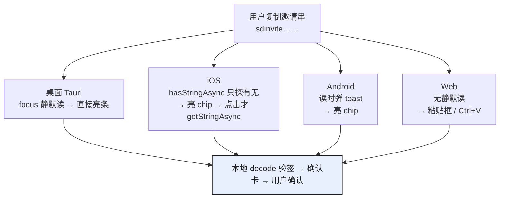
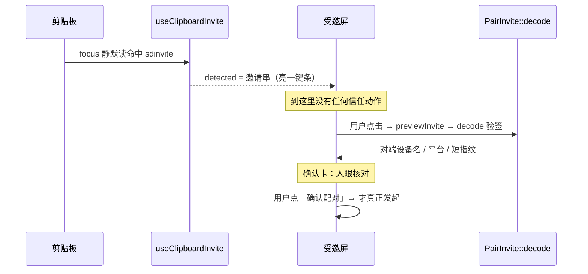

# 剪贴板感知与扫码——输入侧的三端平台工程

> 本系列前三篇把邀请**协议**（签名、TTL、一次性）和**二维码生成**（[03 篇](03-qr-uppercase-and-core-single-source.md)的大写 alphanumeric 优化）讲透了。这一篇转到输入侧：邀请串怎么**进到**受邀设备里。核心一句话——「复制邀请回来自动配对」很诱人，但桌面 / iOS / Android / Web 的剪贴板隐私模型天差地别，我们统一成「**感知 + 一键确认**」而不是全自动；而且那个「一键」不只是 UX，它同时是**安全闸**：邀请是信任凭证，全自动发起配对、不留一次确认，反而危险。

## 结论先行

三件事，先给判断：

1. **不做全自动。** 读到剪贴板里的邀请串 → 本地 `PairInvite::decode` 验签 → 弹确认卡（对端设备名 / 平台 / 短指纹）→ **用户点确认才发起配对**。这一步「一键确认」既是三端隐私合规的必要交互，也是防止「静默配对被利用」的安全闸。
2. **剪贴板感知三端各写各的。** 没有统一 API，因为背后的隐私模型不同：桌面静默读无提示、iOS 只能「探有无、不读内容」、Android 读时弹 toast、Web 干脆没有静默读能力。前缀 `sdinvite` 让「是不是邀请」一次 `startsWith` 就秒判。
3. **移动扫码 = `expo-camera` 的 `CameraView`。** SDK 56 内置扫码，否决 `vision-camera`（杀鸡用牛刀）。但这是本次**未落地**的原生步骤——`expo-camera` 安装被 workspace patch 阻塞、且需要 prebuild + 真机验证，所以只到设计定稿。

下面展开为什么。

## 一、剪贴板感知：三端隐私模型差异表

「复制邀请链接 → 切回应用 → 自动继续配对」这个心愿在四个平台上落地成四种完全不同的机制。差异不在我们，在系统对「谁在读剪贴板」的态度。设计记录在 `openspec/changes/pair-invite-protocol/design.md` 的 D7：

| 端 | 感知手段 | 系统提示 | 交互形态 |
|---|---|---|---|
| **桌面 Tauri** | 窗口 `focus` 时 `readText()` 静默读 + `startsWith` 前缀校验 | 无 | 命中 → 顶部亮一键条「检测到配对邀请，点此继续」 |
| **iOS** | `Clipboard.hasStringAsync()`——**只探有无字符串、不读内容、不弹横幅** | 探测无横幅；`getStringAsync` 真读才弹 | 有内容 → 亮「粘贴邀请」chip → **点击才真读**（横幅由用户手势触发，合规） |
| **Android** | 回前台读 + 前缀校验（Android 12+ 读时弹「已粘贴」toast） | 有 toast（可接受） | 同 iOS 的 chip 交互 |
| **Web demo** | 无静默读能力（`readText` 需用户手势 + 权限） | 权限弹窗 | 只能给粘贴框 + 按钮 / `Ctrl+V` paste 事件 |

一张图看清「谁能静默、谁必须用户点一下」：



关键观察：**桌面是唯一能「零系统提示静默读」的端**，所以它的体验最顺——用户复制完切回来，一键条已经亮着。iOS 最严：任何真读剪贴板内容都会弹系统横幅，`hasStringAsync()` 是苹果特意留的「探针」——它告诉你「剪贴板里有没有字符串」但不给你内容、不弹横幅，让 app 能亮一个 chip 而不惊扰用户；真正 `getStringAsync()` 的读取，必须由用户点 chip 这个明确手势去触发，横幅才不算「偷读」。Android 折中，读了会弹 toast，属于可接受范围。Web 最弱，`navigator.clipboard.readText()` 必须在用户手势里且要权限，所以 Web demo 只提供粘贴按钮。

前缀 `sdinvite` 在这里是「秒判真伪」的关键——它是纯字母串（转大写后仍落在 QR alphanumeric 字符集，见 [03 篇](03-qr-uppercase-and-core-single-source.md)），定义在 `crates/invite/src/invite.rs:32`：

```rust
// crates/invite/src/invite.rs:32
const KIND: &str = "sdinvite";
```

三端感知逻辑都只需一次 `startsWith("sdinvite")` 就能过滤掉 99% 的无关剪贴板内容，不必真去解码。

## 二、桌面实现：静默读，但绝不静默配对

桌面的感知封装在 `src/hooks/use-clipboard-invite.ts`。它做的事只有一件——**感知**，然后把邀请串抬给调用方去亮一键条，绝不自己发起配对：

```ts
// src/hooks/use-clipboard-invite.ts:22-34
const check = useCallback(async () => {
  if (!enabled) return;
  let text: string;
  try {
    text = (await navigator.clipboard.readText()).trim();
  } catch {
    return; // 读失败（无权限/空）静默忽略
  }
  if (!text.startsWith(INVITE_PREFIX)) return;
  if (text === seen) return; // 已提示过，不重复
  setDetected(text);
  setSeen(text);
}, [enabled, seen]);
```

三个细节值得记：

- **触发时机**：进入即检查一次 + 监听 `window` 的 `focus` 事件（`use-clipboard-invite.ts:36-42`）。「用户在别处复制完切回应用」正好触发 `focus`，这是桌面能静默读的窗口期。
- **同串只提示一次**：用 `seen` 记住已亮过的串（`:31`），避免用户 dismiss 掉一键条后每次切窗口又弹出来。
- **读失败一律静默**：`catch` 里直接 `return`，无权限 / 剪贴板为空都不报错——感知是「锦上添花」，失败不该打断粘贴主流程。

调用方 `src/routes/_app/pairing/input.lazy.tsx` 把它接进受邀屏，`enabled` 用一个复合条件锁死：

```ts
// src/routes/_app/pairing/input.lazy.tsx:48-50
const { detected, dismiss } = useClipboardInvite(
  isNodeRunning && current.phase === "idle",
);
```

只在「节点已启动 + 配对流程处于 idle」时才感知——正在预览 / 请求中就不再打扰。感知到后亮的是一个 `button`（`:128`），点它才走 `handleSubmit → previewInvite`，**不是 `useEffect` 自动触发**。这就是「感知」与「发起」之间那道刻意留出的手动缝。

## 三、为什么不全自动：「一键确认」是安全闸

技术上，桌面完全可以在 `check()` 命中后直接 `previewInvite(text)` 甚至直接发起配对。我们没有。原因是**邀请是 bearer 信任凭证**——谁持有它、谁就能向发起方证明「我是被邀请的」。如果剪贴板里恰好有一条邀请串（比如用户为了别的目的复制、或被诱导复制），全自动发起意味着用户在毫不知情下和一台陌生设备建立了信任关系。

所以受邀方的流程被拆成「感知 → 手动确认」两段，中间插入一次**本地验签 + 人眼核对**：



`decode` 本身就是第一道过滤——它不只解码，还**验签**，签名坏了 / 载荷过短直接返回错误（`crates/invite/src/invite.rs:169-179`，错误分四类 `Kind / Encoding / Postcard / Verify`，见 `:113-127`）。验签通过后确认卡展示的 `display_name / display_platform / peerId.slice(-8)` 短指纹（`input.lazy.tsx:77-88`）交给人眼核对——这一步防的是「签名合法但不是我想连的那台设备」（换整条链接的攻击，签名兜不住，只有带外信道 + 用户确认能兜，见协议 design D1）。

一句话：**这个「一键」不是省事，是把最后的信任决策权还给人。** 全自动会把它偷走。

## 四、移动扫码：为什么是 expo-camera CameraView

移动端多一个桌面没有的入口——相机扫码。这里结论也先给：**用 `expo-camera@56` 的内置扫码，不用 `vision-camera`。** 设计记录在 `openspec/changes/pair-invite-ui/design.md` 的 D3。

否决 `vision-camera` 的理由很直接：它是为「高性能相机帧处理」设计的重型库，引入 dev-client + MLKit、显著增大包体，而我们只是扫一个 QR——杀鸡用牛刀，纯扫码场景零收益。`expo-barcode-scanner` 又已在 SDK 52 被删。剩下的正解就是 SDK 53+ 内置进 `CameraView` 的扫码能力：

```tsx
<CameraView
  barcodeScannerSettings={{ barcodeTypes: ["qr"] }}
  onBarcodeScanned={locked ? undefined : handleScan}
/>
```

设计里钉死了四个工程细节，每一个都对应一个坑：

- **去抖上锁**：一张 QR 在取景框里，`onBarcodeScanned` 会连发多次回调。做法是「扫到即上锁」——`locked ? undefined : handleScan`，命中一次就把回调置空，避免同一个邀请触发多次 `previewInvite`。
- **权限 primer，不一进页面就弹系统框**：先展示业务说明「扫码用于建立配对，仅本地用相机」→ 用户点「开启相机」→ 才 `requestPermission()`；`canAskAgain === false` 时引导 `Linking.openSettings()`。只申请 `CAMERA`，不碰 microphone（扫码不录音）。
- **前缀校验**：扫到的串同样先 `startsWith("sdinvite")`，把二维码扫成别的什么东西的情况挡在解码前。
- **粘贴 fallback 是一等公民，不是降级**：扫码入口和粘贴入口**并列**，而不是「扫码失败才降级到粘贴」。理由见下一节——长串扫码本就有不可忽略的失败率，粘贴通道必须始终在场。粘贴走已装的 `expo-clipboard.getStringAsync()`。

### 踩过的坑：SDK 54/55 barcode 静默禁用

一条血泪记录：`expo-camera` 在 **SDK 54 / 55 上有 barcode 扫码被静默禁用的 bug**（[expo #44491](https://github.com/expo/expo/issues/44491)，根因是 ZXing 没被编进原生包）——`CameraView` 能开、能预览，但 `onBarcodeScanned` 永不触发，且无任何报错。**SDK 56 已修**，本项目在 56 上无需 workaround。这类「静默禁用」最坑——它不 crash、不报错，只是回调永远不来，很容易误以为是自己代码写错。锁死 SDK 版本、翻 changelog 是唯一的排查路径。

## 五、扫长串的密度坑：呼应 03 篇的大写优化

移动扫码这条线还牵出一个物理约束：**邀请串很长**。`InviteV1` ≈ 200–240 字节（含 64 字节签名 + 两条 LAN 地址），base32 编码后 **330–390 字符**（协议 design D2）。这么长的 payload 编成 QR，模块数不小，展示端稍微画小一点、或者取景稍微歪一点，就扫不出来。

两个缓解手段，缺一不可：

1. **展示端画够大**。`crates/invite/src/qr.rs` 是三端唯一的 QR 编码源（单点固化编码策略，避免三套 JS 库各写一遍导致漂移）。规范定死在 design D2：ECL::M、quiet zone 4 模块、屏显 **≥260px**、深模块白底**不随暗色主题反色**（摄像头对反色 QR 识别差）。

   ```rust
   // crates/invite/src/qr.rs:19-24 —— 编码策略单点
   fn build_qr(invite: &str) -> Result<QRCode, QrError> {
       QRBuilder::new(invite.to_ascii_uppercase())  // ← 大写 → alphanumeric
           .ecl(ECL::M)
           .build()
           .map_err(|e| QrError(e.to_string()))
   }
   ```

   那句 `to_ascii_uppercase()` 就是 [03 篇](03-qr-uppercase-and-core-single-source.md)的大写优化：base32 小写规范串只能走 QR byte 模式（8 bit/字符，v13–15），转大写后整串落在 QR alphanumeric 字符集（5.5 bit/字符，v11–12），**模块数直降约 15%**。而模块越少、每个模块能占的物理像素越大、越好扫。**大写优化的终极价值不是省 QR 版本号，是降低这 330–390 字符长串的实际扫码失败率。** 解码侧大小写不敏感（`invite.rs:172` 的 `to_ascii_uppercase()`），零风险。

2. **永远留粘贴通道兜底**。哪怕 QR 画到 260px、编码优到 v11，长串扫码失败率仍不可忽略（手抖、反光、屏幕脏、距离不对）。所以第四节说的「粘贴是一等公民」不是客气话——它是长串扫码不可靠时的唯一保底。

## 诚实标注：移动扫码本次未落地

要说清楚——**上面第四节的移动扫码是本次未落地的原生步骤**，只到设计定稿。卡点有三：

- `expo-camera` 的安装被 workspace 的 patch 阻塞（mobile 是独立 pnpm workspace，patch 冲突未解）；
- 加原生模块必须跑 `expo prebuild` 重新生成原生工程；
- 相机能力只能在**真机**上验证，模拟器扫码不可靠。

现状：`mobile/package.json` 里只有 `expo-clipboard`（粘贴 + 剪贴板感知这条线可以先走），**没有 `expo-camera`**。所以移动端本期能落的是「粘贴 / 剪贴板 chip」入口，扫码入口的代码与真机联调留到后续。这也是为什么把粘贴 fallback 定成一等公民——它不仅是长串扫码的兜底，现阶段更是移动端唯一实际可用的入口。

## 小结与承上启下

- **不全自动**：感知 → 本地验签 → 确认卡 → 用户点确认才发起。「一键」是把信任决策还给人，是安全闸不是省事。
- **三端各写各的**：桌面静默读、iOS 只探不读、Android 读带 toast、Web 只能粘贴——背后是四种系统隐私模型，前缀 `sdinvite` 让判真伪只需一次 `startsWith`。
- **移动扫码 = expo-camera CameraView**：去抖上锁 + 权限 primer + 前缀校验 + 粘贴 fallback 一等公民；SDK 54/55 有静默禁用 bug、56 已修；本次未落地（装被阻塞 + 需 prebuild + 真机）。
- **长串是物理约束**：QR 画够大 + 大写 alphanumeric（呼应 03 篇）+ 永远留粘贴通道，三管齐下降失败率。

到这里，邀请的**协议**（签名 / TTL / 一次性）、**二维码**、**三端输入 UI**都讲完了。最后一篇回头看一件容易被低估的事——「**删掉旧的 6 位配对码**」本身有多大：一个存在了整个 Phase 2 的信任建立机制被整体废弃，`PairingMethod` 只剩 `Direct` + `Invite`、没有双轨过渡期，牵动的面比想象宽得多。见 [05 篇](05-deleting-pairing-code-surgery.md)。
