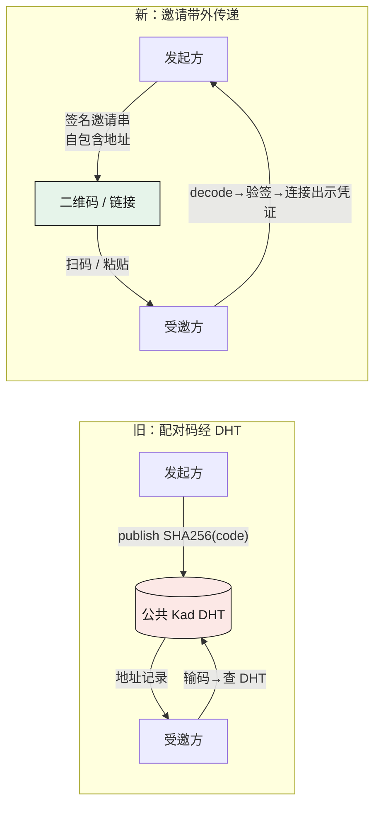
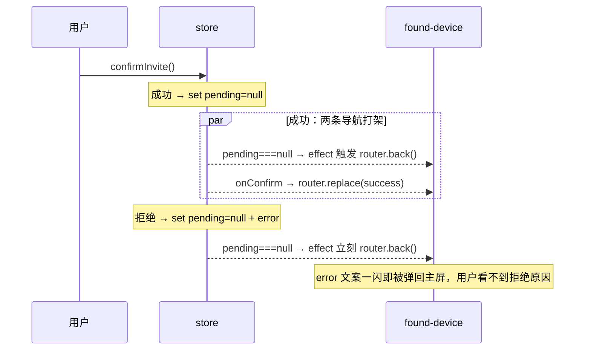

# 删除配对码：一次跨端手术，与它挖出的一个真竞态

> 这是 pairing-invite 系列的收尾。前面几篇讲怎么把「一次性签名邀请」造出来——从
> [iroh-tickets 的编码骨架 + 我们补的签名层](01-iroh-tickets-trust-model.md)，到三端统一的
> QR 编码。本篇讲**删除**：把用了两个 Phase 的 6 位配对码从五个端整体拔掉。
> **结论先行**——「不考虑兼容性直接删」让架构大幅缩水（PairingManager 掉了一大片 DHT 引用、
> `PairingMethod` 从三变体降到两变体），但删除本身是**跨 55 个文件的手术**，而且在移动端
> 挖出了一个真竞态 bug。删除从来不是「按 Delete 键」。

## 为什么敢直接删

SwarmDrop 还没有存量用户要照顾，产品决策很干脆（提交 [`0c95f679`](#) 的注脚原话）：

> openspec: pair-invite-protocol（Phase 3 + 配对码下线，用户 2026-07-19 决策）。
> **不考虑兼容性，配对码机制直接废弃。**

这一句省掉了整个「双轨并存」的复杂度——不需要 `Code` 和 `Invite` 两条路径共存一个版本、
不需要迁移期、不需要 feature flag。**能直接删，是这次重构最大的杠杆**。代价是它把删除工作
从「加一条新路径」变成了「拔掉一条穿透五端的旧路径」，这才是真正花时间的地方。

四个提交完成整件事：

| 提交 | 干的事 |
|---|---|
| [`0c95f679`](#) | Invite 接入协议 + 6 位配对码**整体下线**（`+256 / -450`，删两个文件） |
| [`d5b7a6c6`](#) | invite **下沉独立 crate** + QR 生成（第七个 wasm 门禁 crate） |
| [`b933cf3c`](#) | 移动 RN 侧 UI 迁移到 PairInvite（`+1208 / -1022`） |
| [`8b21dd28`](#) | 四路审查修复——去重 / **竞态** / 一致性 |

四个提交合起来动了 **55 个不重复的文件**。下面挑三件最有嚼头的讲。

## 一、删除换来的架构缩水：网络层不再需要 DHT

旧的 6 位码是这么工作的：发起方把 `SHA256(code)` 当 DHT key，往 Kademlia 里塞一条记录
（含 OS 信息 + 时间戳），受邀方输码后去 DHT 查这条记录拿到对端地址。**配对的信任根挂在
一个公共 DHT 上**——低熵可枚举、DHT 记录本身证明不了身份，这是 01 篇要用签名邀请取代它的
根本原因。

删掉它，`PairingManager` 立刻瘦一圈。旧 manager 里 `generate_code` / `get_device_info` /
`active_code` / `discovered_peers` / `dht` 引用连成一片，全部随 `code.rs`
（`crates/core/src/pairing/code.rs`，66 行）一起删除。协议枚举也从三变体降到两变体
（`crates/core/src/protocol/pairing.rs:28`）：

```rust
// crates/core/src/protocol/pairing.rs:25
#[derive(Debug, Clone, Serialize, Deserialize)]
#[cfg_attr(feature = "specta", derive(specta::Type))]
#[serde(rename_all = "camelCase", tag = "type")]
pub enum PairingMethod {
    Direct,
    Invite {
        invite_id: [u8; 16],
        capability: [u8; 32],
    },
}
```

关键的架构收益不在「少一个 enum 变体」，在于**配对流程从此不碰网络发现层**。邀请串自包含
地址提示（`inviter_addrs`），靠带外信道（二维码 / 链接）传递，`encode_invite` 明确不经 DHT
（`crates/core/src/pairing/manager.rs:91`）：

```rust
// crates/core/src/pairing/manager.rs:91
/// 生成邀请并返回编码串：签名 + 登记进 InviteRegistry。不经 DHT——邀请串自包含
/// 地址提示，靠带外信道（二维码/链接）传递。
pub fn encode_invite(&self, secret: &SecretKey, policy: TransportPolicy, display: &OsInfo) -> String {
    let invite = PairInvite::generate(secret, self.shareable_addrs(), policy, /* ... */);
    self.invite_registry.register(&invite);
    invite.encode(secret)
}
```



**一次性、TTL、并发防双花全收进发起端内存的 `InviteRegistry`**（`crates/invite/src/invite.rs:345`），
不再依赖 DHT 的最终一致性。这就是「删除一个机制」能反过来让架构更干净的例子——被删掉的
不只是代码，还有它拖着的一整条外部依赖。

## 二、invite 下沉独立 crate：让删除同时服务于 wasm 门禁

删配对码的同时，我们没把 invite 逻辑留在 `crates/core`，而是把它**下沉成独立 crate**
`swarmdrop-invite`（提交 `d5b7a6c6`）。这一步呼应了 core-wasm-ready 系列一直在推的事：把
wasm-clean 的纯逻辑从 core 里剥出去。

关键约束写在 crate 的 doc 里（`crates/invite/src/lib.rs:4`）：

```
//! 本 crate 是 **wasm-clean 的独立层**：只依赖 `swarmdrop-net-base` 的身份/地址类型 +
//! 编码库（sha2/postcard/data-encoding/fast_qr），**不依赖 core**——core（PairingManager）
//! 与浏览器端（swarmdrop-web 受邀方 decode）共享它。
```

依赖面刻意收得极窄（`crates/invite/Cargo.toml`）——只有 `swarmdrop-net-base` 提供
`NodeId` / `Addr` / `SecretKey`，加上纯编码库。**不依赖 core，也就意味着浏览器端能直接用同一个
`decode`**。web demo 的受邀方就是这么复用的（`crates/web/src/node.rs:180`）：

```rust
// crates/web/src/node.rs:180
pub async fn connect_invite(&self, invite: String) -> Result<ConnectionJsonJs, JsValue> {
    let inv = swarmdrop_invite::PairInvite::decode(&invite)
        .map_err(|e| WebError::invalid_input(format!("邀请无效: {e}")))?;
    let addr = inv.usable_addrs().into_iter().next()
        .ok_or_else(|| WebError::invalid_input("邀请不含可用地址"))?;
    // ...connect(NodeAddr::with_addrs(inv.inviter.id, vec![addr]))
}
```

桌面 / 移动 / 浏览器三端，验签、TTL 预检、`usable_addrs()` 按 `LocalOnly` 过滤地址——**跑的
是字面上同一个纯函数**，没有任何一端能悄悄放松验签。这是 SwarmDrop 的**第七个 wasm 门禁
crate**：`scripts/check-wasm.sh` 把它编到 `wasm32-unknown-unknown`，编不过就红。删配对码这件事，
顺手把「三端共享一份信任逻辑」也钉死了。

## 三、uniffi 绑定从 dylib 重生成，绕开原生重编

删掉 `generate_pairing_code` / `get_device_info`、换上 `generate_pair_invite` /
`consume_pair_invite` / `decode_pair_invite` 之后，移动端 RN 那一侧的 TypeScript + C++ 绑定
必须重新生成——否则 JS 调的还是不存在的旧方法。

朴素做法是 `ubrn build ios --and-generate`（`mobile/packages/swarmdrop-core/package.json:44`
里的 `build:ios` 脚本），但它是**重量级原生构建**：交叉编译到三个 iOS target
（`aarch64-apple-ios` / `-sim` / `x86_64-apple-ios`，见 `ubrn.config.yaml`），要 Xcode、要
磁盘、要几分钟。而这次改动**纯粹是 Rust 接口的增删**，二进制逻辑早在 `cargo build` 时就编好了。

省掉重编的关键是 uniffi 的 **library mode**：bindgen 不重新交叉编译，而是从**已经编译好的
dylib** 里读出内嵌的 FFI 元数据，直接吐 TS/C++。ubrn 对应的是 `generate` 子命令（library 模式
指向那个 dylib），产物就是 `b933cf3c` 里那份重生成的 `swarmdrop_mobile_core.ts` /
`.cpp`（`+300 / -300` 量级的绑定 diff）。**只要 ABI 没变、只是增删了几个 `#[uniffi::export]`
方法，就没必要走一遍原生交叉编译。** 这是移动端桥接迭代里最实用的一条省时经验。

## 四、删除挖出的真 bug：found-device 的导航竞态

这是整次手术里最有价值的复盘——**竞态不是新写出来的，是删配对码、改用「预览 → 确认」两页式
流程时，被移动端的路由模型引进来的**。审查（`8b21dd28`）抓到了它。

移动端受邀方流程是两个 expo-router 页面：粘贴/扫码后进 `found-device` 确认页看对端信息，点
「确认配对」后 `router.replace` 到 success 页。store 里用一个 `pending` 字段承载确认卡数据。
问题出在 `found-device` 的这个「没有 pending 就退回」的兜底 effect，和 `confirmInvite` 清
`pending` 的时机撞在一起。

**修复前**的 `confirmInvite`——成功和拒绝**都**清 `pending`：

```ts
// 修复前
set({ confirming: false, pending: null });   // ← 无条件清
if (!result.accepted) {
  set({ error: result.reason ?? "配对被拒绝" });
}
```

**修复前**的兜底 effect——只要 `pending` 变 null 就 `router.back()`：

```ts
// 修复前
useEffect(() => {
  if (pending === null && !confirming) router.back();
}, [pending, confirming, router]);
```

两者叠加，两种结局都错：



- **成功**：`pending` 被清 → 兜底 effect 的 `router.back()` 和 `onConfirm` 的
  `router.replace(success)` **两条导航同时竞争**。
- **拒绝**：`pending` 被清 → effect 立刻 `router.back()`，用户还没来得及读「对方拒绝了配对」
  这行 error，页面就被弹回主屏，**拒绝原因被吞掉**。

**根因**：那个 effect 把两件本质不同的事混为一谈——「一进本页就压根没有 pending」（深链/刷新
直达，该退回）和「confirm 之后 pending 被清空」（正常流程，不该退回）。用一个 `pending === null`
判断没法区分它们。

修法两处，各修一半：

```ts
// mobile/src/stores/pairing-invite-store.ts:158  —— 成功才清 pending
if (result.accepted) {
  // 成功才清 pending——由确认页 router.replace(success) 导航，避免与
  // found-device 的「pending===null → back()」竞态。
  set({ confirming: false, pending: null });
} else {
  // 拒绝：保留 pending，把 error 留在确认页展示（否则一闪即弹回主屏）。
  set({ confirming: false, error: result.reason ?? "配对被拒绝" });
}
```

```ts
// mobile/src/app/pairing/found-device.tsx:28  —— 兜底改「挂载态」判定
const hadPending = useRef(pending !== null);
useEffect(() => {
  if (!hadPending.current && !confirming) router.back();
}, [confirming, router]);
```

`hadPending` 是一个**挂载那一刻**的快照 ref：只有「进页面时就没有 pending」才触发兜底 back，
之后 pending 怎么变都不影响它。竞态消失。

**桌面为什么没这个 bug？** 因为桌面根本没有第二个页面。它用一个 `PairingPhase` 状态机
就地渲染（`src/stores/pairing-store.ts:83`）：

```ts
// src/stores/pairing-store.ts:83
export type PairingPhase =
  | { phase: "idle" }
  | { phase: "previewing"; invite: string; preview: PairInvitePreview }
  | { phase: "requesting" }
  | { phase: "success" };
```

`previewing → requesting → success` 全在同一棵组件子树里换渲染，**没有路由导航，也就没有
「谁先 navigate」的竞争窗口**。竞态是移动端「扁平的 store 状态 + 分离的路由页 + effect 驱动
导航」这套组合独有的——同一个业务逻辑，两端跑，只有引入了路由页的那端会出事。这条值得记住：
**跨端复用业务逻辑时，UI 编排模型的差异会凭空长出各自的 bug**。

## 诚实一点：删除并不「删干净」，有些税删不掉

两个地方是这次手术**刻意没删**的，讲清楚免得误会「整体下线」= 一个字符串都不剩。

**其一，DB 里的 `ShareCode` 留着。** 收件箱来源枚举 `InboxSourceKind`
（`crates/entity/src/lib.rs:179`）仍有 `ShareCode` 变体——它标记的是「这个文件是通过分享码流程
收到的」这一**持久化历史**，和配对用的分享码是两码事。删它要跑一次 DB migration，成本远大于
收益。所以「整体下线」的范围是**活跃的配对路径**，不是全局字符串清洗。

**其二，两个宿主各留一份几乎一样的 Preview DTO。** 桌面（specta）和移动（uniffi）各有一个
字段完全相同的确认卡投影：

```rust
// src-tauri/src/commands/pairing.rs:23
#[derive(Debug, Clone, Serialize, specta::Type)]
pub struct PairInvitePreview {   // peer_id / display_name / display_platform / expires_at / local_only
```

```rust
// mobile/packages/swarmdrop-core/rust/mobile-core/src/pairing.rs:30
#[derive(Debug, Clone, uniffi::Record)]
pub struct MobileInvitePreview { // 同样五个字段
```

看着像该合并的重复，但**合不了**：`specta::Type` 和 `uniffi::Record` 是两个宿主各自的绑定
derive，互斥；把任何一个塞进 wasm-clean 的 `crates/invite`，都会把那个宿主的 proc-macro 依赖
污染进这层纯 crate，破坏它的 wasm 门禁。所以判断是**不下沉**——`crates/invite` 只导出领域类型
`PairInvite`（带真字段），每个宿主把它手工投影成自己 derive 出来的 DTO。**这份重复是 IPC
边界的固有税，不是设计缺陷。** 同理还有 `respond_pairing_request` 保留的那个无人读的 `method`
参数（`src-tauri/src/commands/pairing.rs:219`）——纯为 IPC 签名稳定而留，删了反而要动前端 bindings。

## 系列收束

一路走下来：从 [00 篇「发现 ≠ 信任」](00-why-drop-pairing-code.md) 的洞察出发——DHT 上能被
发现的记录证明不了身份；到照抄 iroh-tickets 的编码骨架、再补一层 Ed25519 签名（签名尾置、
覆盖版本判别码、公钥从 `inviter_id` 就地恢复）；到把这套逻辑下沉成 wasm-clean 的
`swarmdrop-invite`，让桌面、移动、浏览器**跑同一份 decode**、生成**同一套 QR**；最后是本篇的
删除手术——把旧配对码从五个端拔干净。

三个收尾的教训，留给下一个要「删一个跨端机制」的人：

1. **没有存量包袱时，「直接删」是最大的杠杆**——省掉的双轨复杂度远超删除本身的工作量；
2. **删除会缩架构**——被删的往往拖着一整条外部依赖（这里是公共 DHT），删干净了架构反而更清晰；
3. **删除会挖 bug**——换实现时新引入的编排模型（移动端两页式路由）会长出旧模型没有的竞态，
   审查那一步不能省。

PairInvite 到此落地。下一个信任层面的问题——邀请的**撤销与授权分级**（`capability` 目前只是
一个不透明的 bearer 凭据）——留给 roadmap 上的 PairInvite v2。
</content>
</invoke>
