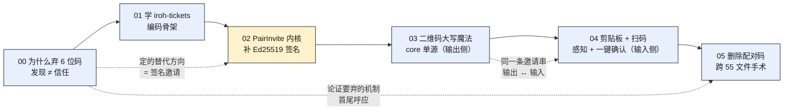

# pairing-invite — 从 6 位配对码到一次性签名邀请

> 配对重构的完整记录：为什么把用了两个 Phase 的 6 位 DHT 分享码整体废弃，换成一次性、
> 可验证、可过期的**签名邀请**（`PairInvite`）。根子上的问题是**「发现」被误当成了「信任」**——
> 一个低熵数字同时扮演「找到对方地址」和「证明就是对方」两个正交角色。这个系列从「为什么
> 必须解耦」一路讲到「旧机制怎么从五端拔干净」。

## 一条主线

**把「发现」和「信任」解耦。** 发现（找到候选地址）该公开可枚举，信任（证明是本人）该秘密、
只进认证握手；6 位码把两者压进同一个数字，是模型选错。六篇顺着这条线，从「为什么错」推到
「换成的签名邀请长什么样、怎么传播、怎么收进来、旧的怎么删」。

这是一个**独立系列**，不隶属网络内核重构 umbrella——它讲的是配对的信任模型，不是网络栈。

## 篇目（建议顺序阅读，篇篇承接）

| # | 标题 | 一句话 |
|---|---|---|
| [00](00-why-drop-pairing-code.md) | 为什么弃用 6 位配对码——当「发现」被误当成「信任」 | 6 位码把「找到对方」与「证明是对方」两件正交的事压进一个低熵数字；magic-wormhole / Matter / distributed-topic-tracker 独立收敛到同一定律——发现标识必须与证明秘密正交，不是熵不够，是模型错了 |
| [01](01-iroh-tickets-trust-model.md) | iroh-tickets 的编码智慧，与它敢不签名的底气 | 照抄 ticket 的编码四件套（KIND 前缀 / postcard 版本化 / 领域↔wire 镜像 / 错误四分类 / base32-nopad）；它敢不签名是因唯一敏感字段（对端 id）被握手强制校验，但我们塞了握手管不到的 `transport_policy`，只能补签名 |
| [02](02-pairinvite-protocol.md) | PairInvite 协议内核——签名到底兜底什么，又怎么做到零成本 | 那 64 字节 Ed25519 签名不防「连错人」（Noise 握手兜死），而防身份 pin 覆盖不到的字段被静默篡改——首要保护 `transport_policy`（`LocalOnly` 被改 `Auto` 会被引到公网 relay）；把攻击面从「改任意字段」压到「换整条链接」，成本仅 64B + 一次验签 |
| [03](03-qr-uppercase-and-core-single-source.md) | 二维码的大写魔法与三端统一 | 喂 QR 前整串 `to_ascii_uppercase()`，base32 大写表 100% 落进 alphanumeric（5.5 vs 8 bit/字符，密度 1.45×）→ 版本 v13-15 降到 v11-12、模块 -15%、扫码更稳；且二维码生成固化在 core（`swarmdrop-invite::qr`）单源，三端薄壳不漂移 |
| [04](04-clipboard-and-scan.md) | 剪贴板感知与扫码——输入侧的三端平台工程 | 「复制邀请自动配对」诱人，但桌面 / iOS / Android / Web 剪贴板隐私模型天差地别，统一成「感知 + 一键确认」；那「一键」既是隐私合规交互也是安全闸——全自动静默配对反而危险；移动扫码用 `expo-camera` CameraView（本次未落地） |
| [05](05-deleting-pairing-code-surgery.md) | 删除配对码：一次跨端手术，与它挖出的一个真竞态 | 「不考虑兼容性直接删」让架构缩水（`PairingManager` 掉一片 DHT 引用、`PairingMethod` 三变体→两变体），但删除是跨 55 文件、四提交的手术，并在移动端挖出一个真竞态 bug——删除从来不是「按 Delete 键」 |

## 阅读顺序建议

- **想懂整件事**：00 → 05 顺读，篇篇承接（推荐）。
- **只想懂「为什么换 + 换成什么」**：00 →（跳过 01 的编码考据）→ 02，两篇拿到信任模型的全部要点。
- **想抠工程落地**：03（QR 输出）→ 04（剪贴板 / 扫码输入）→ 05（删除手术），三篇偏平台工程与重构执行。

## 篇间关系

- **00 → 02**：00 论证要用「签名邀请」取代分享码，把方向定死；02 兑现它，造出签名内核。
- **02 是全系列的技术重心**（图中高亮）——前两篇为它铺垫（为什么换、学谁的编码），后三篇是它的传播与拆旧。
- **03 与 04 是对偶**：同一条邀请串，03 讲怎么发出去（二维码 / 链接，输出侧），04 讲怎么收回来（剪贴板 / 扫码，输入侧）。
- **00 与 05 首尾呼应**：00 从模型上论证 6 位码该弃，05 从代码上把它跨五端拔掉。

## 与相邻系列 / 旧文的关系

- **[`../pairing-transfer/`](../pairing-transfer/)** —— 重构**前**的旧配对实现（6 位码 + DHT Provider 那一套）。本系列描述的是取代它的新机制，读旧文注意版本差异。
- **[`../2026-07-net-refactor-series.md`](../2026-07-net-refactor-series.md)** —— 同期进行的网络内核重构 umbrella（libp2p → iroh 风格 API、wasm 传输端、传输域抽 crate）。相关但**不同主题**：那边讲网络栈与传输，本系列讲配对的信任模型。`PairInvite` 下沉成的 `swarmdrop-invite` 恰是那边点名的「第七个 wasm 门禁 crate」，两条线在工程上有交集。

## 素材出处

- 邀请协议 / 编码 / QR 生成：`crates/invite/src/`（`invite.rs`、`qr`）
- 配对方法枚举（`Code` 变体已删，只剩 `Direct` / `Invite`）：`crates/core/src/protocol/pairing.rs`
- 变更设计与决策记录：`openspec/changes/pair-invite-protocol/design.md`
- iroh-tickets 编码参考（外部研究）：`/Volumes/yexiyue/iroh-study/iroh-tickets/`
