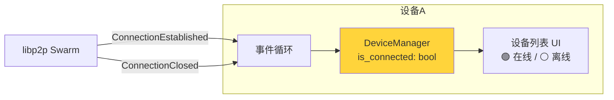
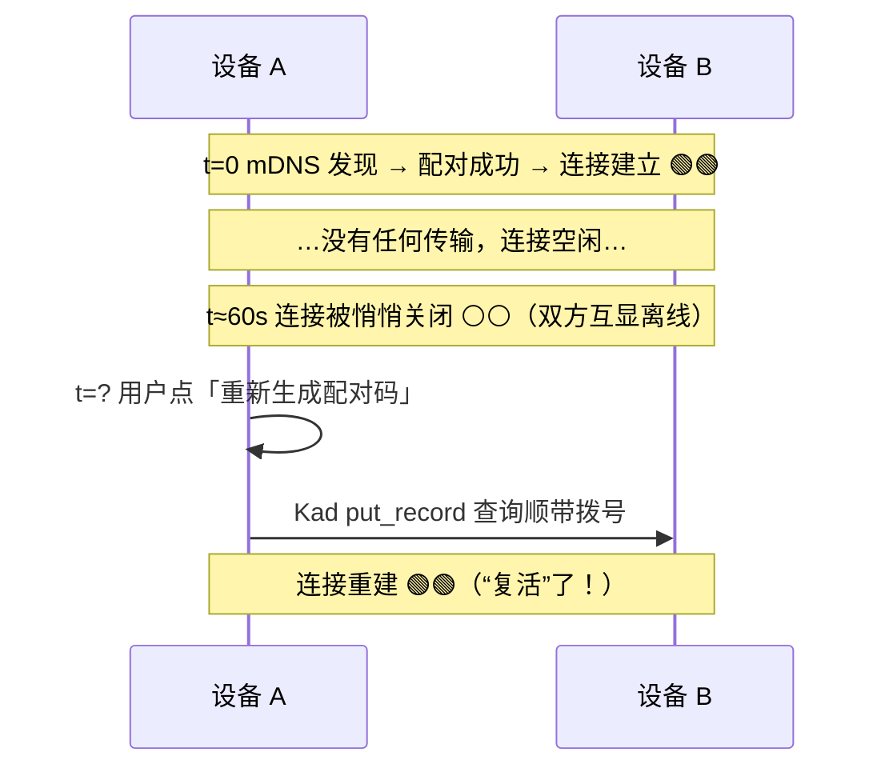
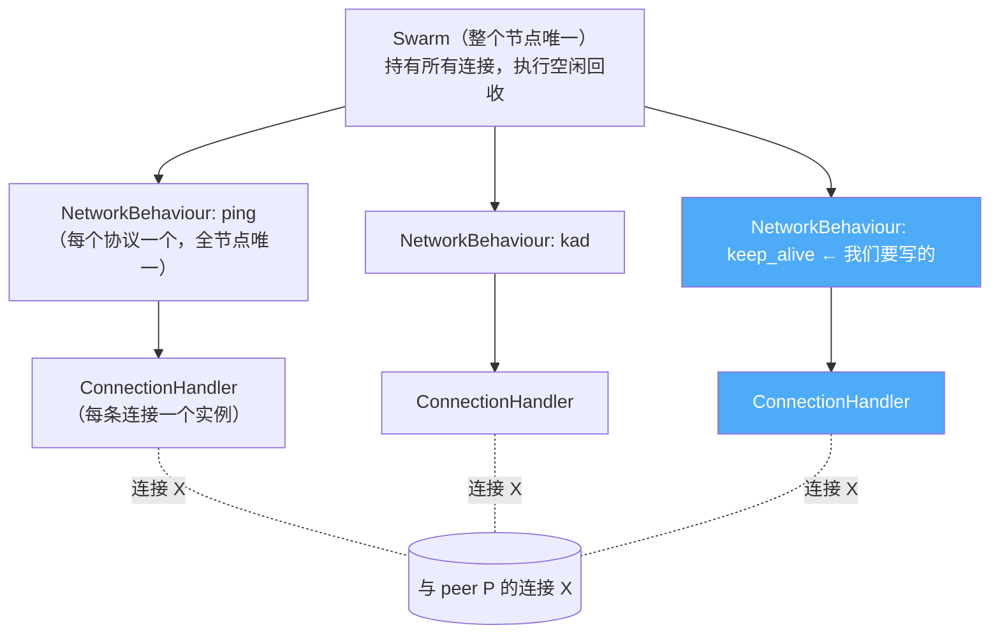
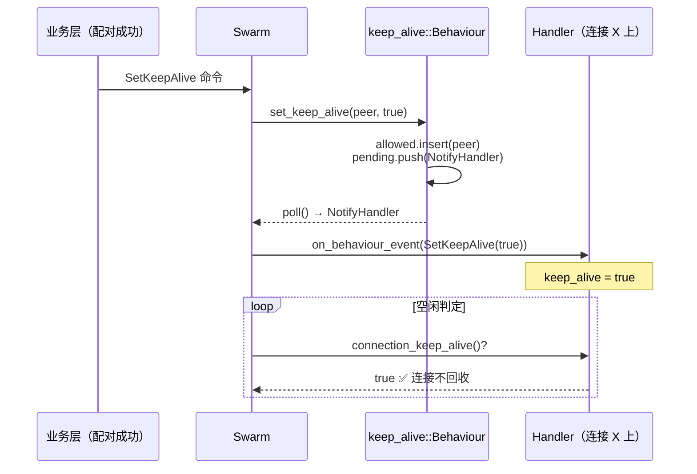
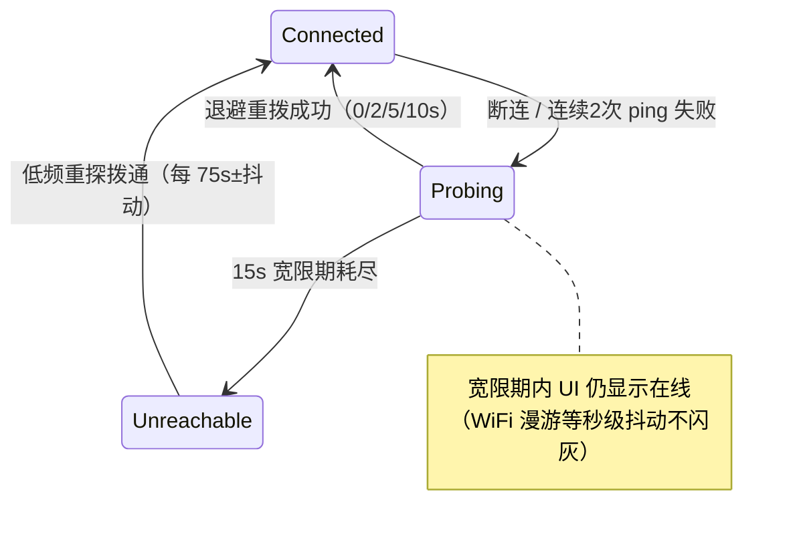
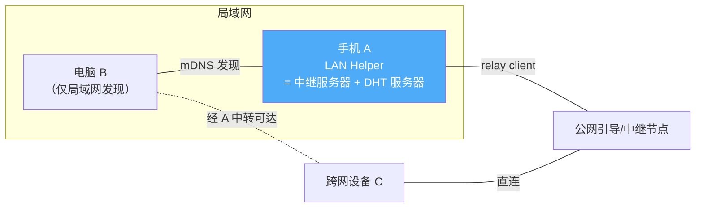
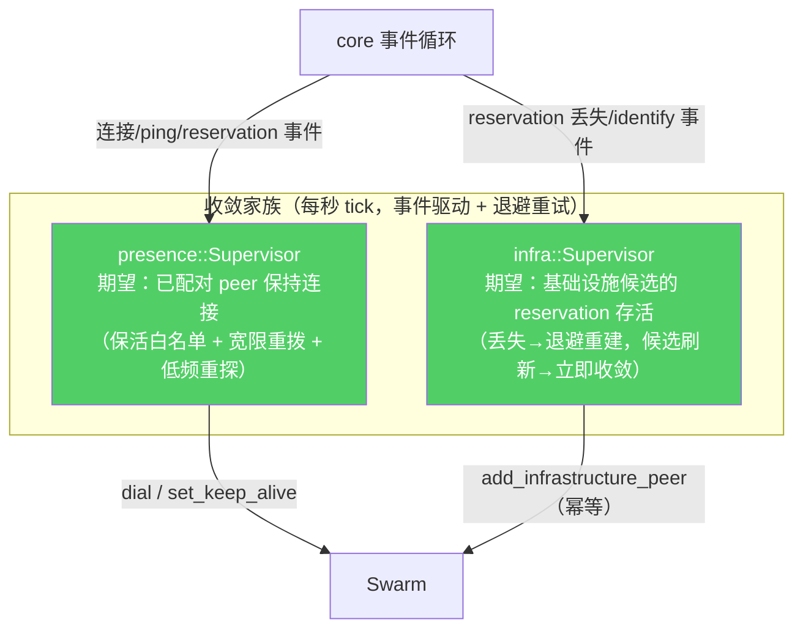

# 你的设备真的离线了吗？——两个 presence Bug，同一个病根

SwarmDrop 在 v0.7.5 前后接连暴露了两个「设备在线状态」的 Bug。表面看是两个不相干的问题：一个发生在同一局域网里，一个发生在跨网中继的复杂拓扑里。但把它们解剖到底会发现——**它们是同一个病，长在两个器官上**。

本文完整讲述这两个 Bug 的现象、根因、修复，重点拆解修复中最陌生的一块：**如何给 libp2p 写一个自定义 NetworkBehaviour**（连接保活白名单）。读完你会对「libp2p 里一条连接是怎么活着、怎么死掉的」有一个完整的心智模型。

## 两个 Bug 的现象

**Bug 1（局域网）**：两台设备通过 mDNS 发现并配对成功，一切正常。然后你去倒了杯水，回来发现对方显示**离线**了。诡异的是——随手点一下「重新生成配对码」，对方**立刻**变回在线。设备根本没动过，网络也没断过。

**Bug 2（跨网网关拓扑）**：手机 A 开着「局域网协作节点」（LAN Helper）并连着公网中继；电脑 B 和它同一局域网，设置了「仅局域网发现」；公网侧的设备 C 能通过这条链路和 B 配对、传文件。但 C 经常「看不到 B 在线」，或者看到在线后过一会儿就掉了——而且**再也回不来**，除非重启节点。

先记住一个共同点：**两个 Bug 里，设备本身都活得好好的**。「离线」是我们自己的软件说谎了。

## 预备知识：libp2p 里，「在线」到底是什么

SwarmDrop 的设备列表里那个绿点，在 v0.7.5 的实现里就是一句话：

> **在线 = 此刻和这个 peer 之间存在一条活跃的 libp2p 连接。**



`ConnectionEstablished` 事件来了就置 `is_connected = true`，`ConnectionClosed` 来了就置 `false`。UI 忠实地渲染这个布尔值。逻辑简单、直白——**也正是一切问题的起点**：它把「在线」定义成了一个瞬时的、易碎的东西，而没有问一句：*这条连接凭什么一直活着？*

## Bug 1 解剖：谁杀死了那条连接

### 时间线



### 凶手一：60 秒空闲回收

libp2p 的 Swarm 有一个配置叫 `idle_connection_timeout`，我们设的是 60 秒：

```rust
// libs/core/src/config.rs
idle_connection_timeout: Duration::from_secs(60),
```

含义：一条连接如果「空闲」超过 60 秒，Swarm 会主动把它关掉（`KeepAliveTimeout`），节省资源。配对完成后没有传输，连接自然空闲——60 秒后被回收，`ConnectionClosed` 事件一发，UI 变灰。

### 凶手二：ping 不保活了（一个过时的注释）

「等等，我们不是有 ping 吗？每 15 秒一次心跳，连接怎么会算空闲？」——代码里的注释也是这么以为的：

```rust
// ===== Ping =====
// 定期发送心跳包检测连接是否存活   ← 这个注释在 libp2p 0.52 之后就是错的
```

历史上 libp2p 的 ping 协议确实有 `keep_alive` 选项。但从 **libp2p 0.52 起这个能力被移除了**：ping 的数据流被显式地排除在空闲判定之外（源码里的 `stream.ignore_for_keep_alive()`），ping 失败也只上报事件、不关连接。官方的态度写在 crate 文档里：

> *It is up to the user to implement a health-check / connection management policy.*

也就是说：**心跳照跳，连接照关**。这个「过时的认知」正是设计层面的第一根因。

### 凶手三：没人负责重连

连接被回收之后，谁来重建？答案是：没有人。

- **mDNS 救不了**：libp2p 的 mDNS 只对**全新**的记录发 `Discovered` 事件（我们对该事件会自动拨号）。但只要双方都活着，mDNS 记录每 5 分钟被查询响应刷新 TTL、**永不过期**——所以 `Discovered` 只在第一次相遇时发一次，之后再也不会响。
- **应用层救不了**：`announce_online`（向 DHT 发布在线记录，TTL 仅 300 秒）和 `check_paired_online`（对已配对设备主动拨号）都**只在节点启动时执行一次**。

唯一的「意外好心人」是 Kademlia 的周期性 bootstrap（默认 5 分钟），它会拨号路由表里的节点顺带把对方连回来——于是形成了 E2E 测试里观察到的「presence 来回跳」：离线 4 分钟 → 在线 1 分钟 → 再离线……

### 谜底：为什么点一下按钮就「复活」

「重新生成配对码」的实现是把配对码写进 DHT：

```rust
// 重新生成配对码 → put_record 到 Kademlia
self.client.put_record(Record { key: share_code_key(...), ... }).await
```

Kademlia 的 PUT 是一次**迭代查询**：先找到离 key 最近的 K 个节点，再发送存储请求。查询过程中，libp2p 会自动**拨号路由表中尚未连接的节点**——而对端设备早在配对时就进了路由表。于是：点按钮 → DHT 查询 → 顺带拨号对端 → `ConnectionEstablished` → 绿了。

**这不是设计，是副作用。** 任何内含 DHT 查询或拨号的命令（查配对码、发文件……）都能「救活」对方，这就是「执行个命令就在线」的全部真相。

## 修复：给已配对设备发一张「长期通行证」

诊断清楚后，修复方向就明确了：**已配对设备之间的连接，不该被空闲回收**。但 `idle_connection_timeout` 是全局的——调大它会让陌生连接、路过的 DHT 查询连接也永不回收。我们要的是**逐 peer 的豁免**。

libp2p 没有现成的组件干这件事（老版本的 `keep_alive::Behaviour` 也被删了），所以要自己写一个 NetworkBehaviour。这正好是理解 libp2p 连接管理的最佳切口。

### 先搞懂：Swarm 是怎么决定「这条连接该死」的

libp2p 的运行时是三层结构：



- **NetworkBehaviour**：一个协议的「大脑」，全节点只有一个实例，能看到所有 peer/连接的全貌；
- **ConnectionHandler**：该协议在**某一条连接上**的「手脚」，每条连接建立时由 Behaviour 现场创建一个，随连接销毁。

**空闲判定规则**（这是全文最关键的一句话）：

> 一条连接上，**所有** ConnectionHandler 的 `connection_keep_alive()` 都返回 `false`，且没有活跃的协议流时，这条连接进入「空闲」状态，空闲计时超过 `idle_connection_timeout` 即被关闭。

ping 的 handler 返回 `false`（0.52+ 的新语义），kad 没有查询在跑时返回 `false`，identify 交换完信息后返回 `false`……所以配对后的静默连接，60 秒必死。

**那么修复思路就水落石出了**：写一个 Behaviour，它的 handler 什么协议都不跑，只干一件事——对白名单里的 peer，`connection_keep_alive()` 返回 `true`。只要有一个 handler 说「保活」，Swarm 就不会回收这条连接。

### Handler：一个只会说「别挂我」的门卫

先看 handler（每条连接一个实例），它简单到只有一个字段：

```rust
/// 不承载任何协议、只回答 keep-alive 询问的 handler
pub struct Handler {
    keep_alive: bool,
}

impl libp2p::swarm::ConnectionHandler for Handler {
    type FromBehaviour = HandlerIn;      // Behaviour 能发给我什么消息
    type ToBehaviour = Infallible;       // 我永远不给 Behaviour 发消息
    type InboundProtocol = DeniedUpgrade;  // 我不接受任何协议协商
    type OutboundProtocol = DeniedUpgrade; // 我也不发起任何协议协商
    // ...

    /// ⭐ 全部魔法所在：Swarm 判定空闲时会问每个 handler 这个问题
    fn connection_keep_alive(&self) -> bool {
        self.keep_alive
    }

    /// Behaviour 通知我更新标志（白名单运行中变化时）
    fn on_behaviour_event(&mut self, event: HandlerIn) {
        match event {
            HandlerIn::SetKeepAlive(enabled) => self.keep_alive = enabled,
        }
    }

    /// 我没有任何协议工作要做，永远挂起
    fn poll(&mut self, _: &mut Context<'_>) -> Poll<...> {
        Poll::Pending
    }
}
```

逐个解释这些看起来吓人的关联类型：

- **`DeniedUpgrade`**：libp2p 的「协议协商」占位符，意思是这个 handler 不说任何协议——对端想跟我协商任何子流都会被拒绝。我们不需要传数据，只需要**存在**。
- **`FromBehaviour = HandlerIn`**：Behaviour（大脑）→ Handler（手脚）的单向消息通道。白名单变了，大脑要通知每条既有连接上的手脚改口。
- **`ToBehaviour = Infallible`**：`Infallible` 是「不可能构造出来的类型」，用它表示「我永远不会给大脑发消息」。
- **`poll` 返回 `Pending`**：handler 的 `poll` 是干协议活的（发起子流、读写数据），我们无活可干，永远挂起即可——**挂起不影响 `connection_keep_alive()` 被询问**，那是另一条独立的裁决通道。

### Behaviour：白名单 + 通知已有连接

Behaviour 是全节点唯一的大脑，管两件事：**记住白名单**，以及**把变更下发到已有连接**：

```rust
#[derive(Default)]
pub struct Behaviour {
    /// 保活白名单
    allowed: HashSet<PeerId>,
    /// peer → 该 peer 当前所有活跃连接（下发变更时要点名）
    connections: HashMap<PeerId, Vec<ConnectionId>>,
    /// 待下发给 handler 的通知（poll 时逐个吐出）
    pending: VecDeque<ToSwarm<Infallible, HandlerIn>>,
    waker: Option<Waker>,
}
```

第一件事：**连接建立时，发一个「出生即带标志」的 handler**。Swarm 在每条新连接建立时会回调 Behaviour 索要 handler——这正是查白名单的时机：

```rust
fn handle_established_inbound_connection(
    &mut self,
    connection_id: ConnectionId,
    peer_id: PeerId,
    ...
) -> Result<THandler<Self>, ConnectionDenied> {
    // 登记这条连接（之后白名单变更要通知它）
    self.connections.entry(peer_id).or_default().push(connection_id);
    // handler 出生时就知道自己该不该喊“保活”
    Ok(Handler { keep_alive: self.allowed.contains(&peer_id) })
}
// handle_established_outbound_connection 同理
```

第二件事：**白名单运行中变化时，通知既有连接**。比如用户解除配对，我们希望那条连接恢复「可回收」。handler 是活在连接任务里的独立实体，大脑不能直接改它的字段——要走 libp2p 的官方信道 `ToSwarm::NotifyHandler`：

```rust
pub fn set_keep_alive(&mut self, peer_id: PeerId, enabled: bool) {
    let changed = if enabled {
        self.allowed.insert(peer_id)
    } else {
        self.allowed.remove(&peer_id)
    };
    if !changed {
        return;
    }
    // 给该 peer 的每条既有连接的 handler 发通知
    for connection_id in self.connections.get(&peer_id).into_iter().flatten() {
        self.pending.push_back(ToSwarm::NotifyHandler {
            peer_id,
            handler: NotifyHandler::One(*connection_id),
            event: HandlerIn::SetKeepAlive(enabled),
        });
    }
    // 叫醒 Swarm 来取通知（见下）
    if let Some(waker) = self.waker.take() {
        waker.wake();
    }
}
```

通知不是直接「发」出去的，而是排进 `pending` 队列，等 Swarm 下次轮询 Behaviour 的 `poll` 时逐个取走：

```rust
fn poll(&mut self, cx: &mut Context<'_>) -> Poll<ToSwarm<...>> {
    if let Some(event) = self.pending.pop_front() {
        return Poll::Ready(event);   // 有通知：交给 Swarm 派送
    }
    self.waker = Some(cx.waker().clone()); // 没通知：留个电话
    Poll::Pending                          // 挂起等下次
}
```

这里的 **waker** 是 Rust 异步的标准礼仪：`poll` 返回 `Pending` 时必须留下「电话号码」（waker），将来有新事件时打这个电话（`waker.wake()`），运行时才知道要再来 `poll` 你。忘了这一步，通知可能永远躺在队列里。

最后别忘了打扫：连接关闭时把登记表里的条目清掉（`on_swarm_event` 里处理 `FromSwarm::ConnectionClosed`）。

把它注册进节点的行为组合，就大功告成：

```rust
#[derive(NetworkBehaviour)]
pub struct CoreBehaviour<Req, Resp> {
    pub ping: ping::Behaviour,
    pub keep_alive: keep_alive::Behaviour,   // ← 新成员
    pub identify: identify::Behaviour,
    pub kad: kad::Behaviour<...>,
    // ...
}
```

一图总结整条通路：



### 光保活还不够：presence 状态机

保活解决了「健康连接不该死」，但连接仍然可能因真实原因断掉（对方关机、切网络）。所以修复还有另一半——`presence::Supervisor`，一个持续运转的状态机：



在线的语义从「此刻有连接」升级为「Connected 或 Probing」——短暂抖动不再闪灰，真离线 15 秒内如实呈现，对方回归 90 秒内自动发现。**没有任何一步需要用户点按钮。**

## Bug 2 解剖：换个拓扑，同一个鬼故事

Bug 1 修完发版（v0.7.6），跨网网关拓扑的 Bug 2 立刻现形。先看拓扑：



B 不直连公网，它的跨网可达性靠一个叫 **relay reservation（中继预约）** 的东西：B 向 A 说「帮我留个信箱」，A 同意后，B 获得一个中继地址 `/…/p2p/A/p2p-circuit/p2p/B`——别人拨这个地址，流量经 A 转发到 B。可以把 reservation 想象成**在传达室登记的一个信箱**：信箱在，快递就能转进来。

### 病根：预约是「一次性」的，丢了没人补办

调查发现（这里省略 12 个并行调查 agent 的血泪），reservation 在我们的代码里是**彻头彻尾的一次性动作**，而它在 libp2p 里又**严格绑定单条连接**——与中继的连接一断，circuit listener 永久关闭。然后呢？

- 候选表 `upsert` 对同地址返回「没变化」→ 跳过重新注册；
- bootstrap 登记表在第一次 identify 后就把条目**删了** → 重连后不再触发预约；
- listener 关闭事件只打了一行 `warn!` 日志 → 没有任何人被通知。

三层「一次性门禁」层层把重建之路焊死。结果：手机 A 挂起一次（iOS 退个后台就够了），B 的信箱就永久注销，C 从此再也拨不通 B——**直到重启节点进程**。

是不是很眼熟？**和 Bug 1 完全同构**：

| | Bug 1（局域网） | Bug 2（跨网） |
|---|---|---|
| 断掉的东西 | 空闲连接被回收 | reservation 随连接一起死 |
| 谁负责重建 | 没有人 | 没有人 |
| 一次性动作 | announce/check 只在启动跑一次 | 预约只在首次 identify 触发一次 |
| 「意外复活」通道 | Kad 查询顺带拨号 | 进程重启换端口才触发重注册 |

### 修复：把「一次性」全部换成「持续收敛」

到这里就能说出那个统一的病根了：

> **我们把网络世界当成了「装配一次就永远成立」的静物，用命令式的一次性编排去搭建它。但网络是持续腐坏的——连接会断、预约会丢、地址会变。正确的姿势是声明式收敛：声明期望状态，用一个永不下班的循环把现实不断拉回期望。**

熟悉 Kubernetes 的读者会立刻认出这就是 **reconcile 模式**。修复即把这个模式落成一个「收敛家族」：



配套的机制层改动：listener 关闭不再只打日志，而是上抛 `RelayReservationLost` 事件（与 `Accepted` 成对）；预约请求幂等化（已有活跃 listener 则 no-op），于是「断线重连 → identify → 幂等重建」形成自动闭环。三层一次性门禁全部拆除或降级为「即时路径」，兜底统一归收敛循环。

集成测试给出的答卷：**杀掉中继节点再重启，依赖它的设备在几秒内自动补办信箱，全程无人干预。**

## 彩蛋：保活的反噬——僵尸节点

发版前的多 agent 审查轮（25 条发现，对抗核实后 12 条成立）抓到一个绝妙的回旋镖：

> 用户点「停止节点」后，事件循环没有接终止信号、底层 Swarm 根本没退出。以前这只是浪费点内存——空闲连接 60 秒后总会自己死掉。但现在，**我们亲手写的 keep-alive 白名单会把僵尸节点的连接永远钉住**：对端看到的是一个「已停止却永远在线」的幽灵设备。

修复是给事件循环接上取消令牌，退出时级联释放整个 Swarm，并确立契约：*停止节点 = `shutdown().await` + drop 掉 manager，缺一不可*。

这个彩蛋想说的是：**每一个「让连接活下去」的机制，都必须回答「它该怎么死」**。保活与回收是同一枚硬币，只设计其中一面，另一面就会来找你。

## 带走的三条经验

1. **别把瞬时状态当事实陈述。** 「此刻有连接」不等于「设备在线」；把易碎的瞬时信号直接映射到用户可见的状态，就是在让 UI 说谎。中间需要一层带宽限、带记忆的语义（我们的 presence 状态机）。
2. **网络世界只认收敛，不认装配。** 任何「启动时做一次」的网络编排（连接、预约、宣告、注册）都是定时炸弹。声明期望 → 观测现实 → 持续修复，reconcile 循环才是长治久安。
3. **依赖的语义会漂移，注释是最早腐烂的东西。** 「ping: 保持连接活跃」这行注释在 libp2p 0.52 后就是错的，它误导了整个设计。升级依赖时，去读源码验证那些你「记得」的行为——本次两轮调查中，最关键的证据全部来自 cargo registry 里的依赖源码，而不是文档。

---

*相关代码：`libs/core/src/runtime/keep_alive.rs`（自定义 behaviour）、`crates/core/src/presence/`（presence 状态机）、`crates/core/src/infra/`（基础设施收敛）。回归测试锚点：`keep_alive.rs`、`presence_lifecycle.rs`、`infra_reconcile.rs`、`e2e_transfer.rs::shutdown_node_goes_offline_on_peer`。随桌面 v0.7.2→v0.7.3、移动 v0.7.6→v0.7.7 发布。*
