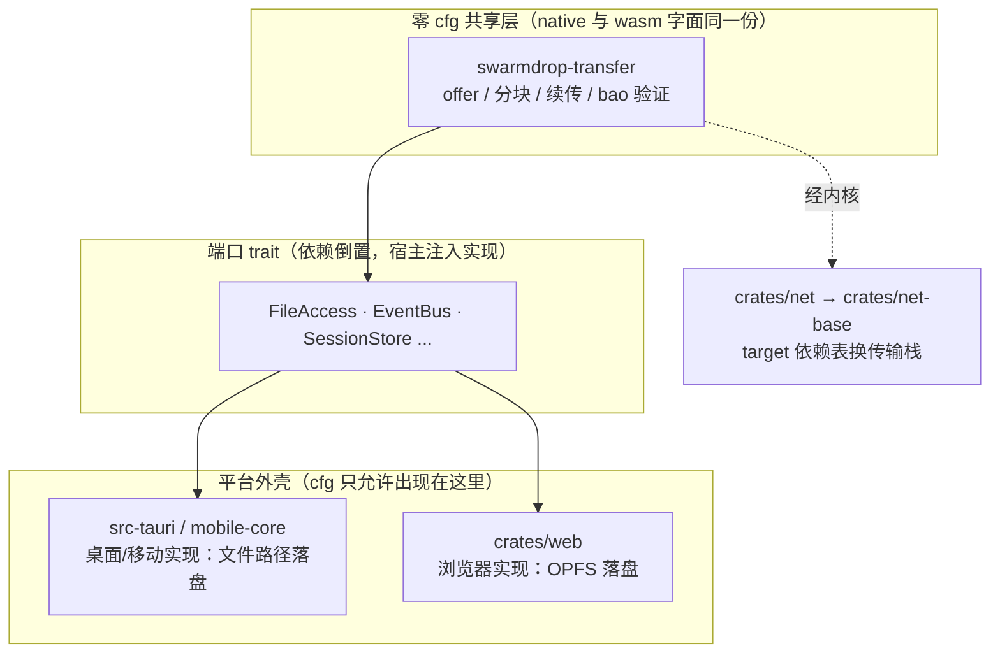

# 单核心包：浏览器与桌面同一份 Rust 逻辑

> **本系列讲什么**：怎么让一份 Rust 代码同时编到 native 和 wasm，且两边都能真正跑起来。
> **这一篇讲什么**：为什么「单核心包」是 rust-wasm 路线的核心卖点，它到底"同"到什么程度，
> 以及本系列剩下五篇要各自解决哪一块。**这是全系列的地图，先读它。**

## 从一个愿望说起

SwarmDrop 是「跨网版 LocalSend」。桌面端、移动端已经用 Rust（libp2p）实现了配对、传输、
断点续传、bao 逐块验证一整套。现在要上 Web 端——**能不能不重写一遍**？

有两条路：

1. **两套实现**：Web 用 js-libp2p，原生用 rust-libp2p，靠协议互操作对齐字节。
2. **单核心包**：把同一份 Rust 编到 `wasm32-unknown-unknown`，浏览器里跑的传输逻辑与桌面
   **字面上是同一份代码**。

我们选了第 2 条。这个决策的完整论证在
[`dev-notes/knowledge/libp2p-wasm.md`](../../knowledge/libp2p-wasm.md)（54 个 agent 调研 + 16 个
编译探针），把两条路的成本摆开对比：

| | 两套实现（js-libp2p） | 单核心包（rust wasm） |
|---|---|---|
| 传输逻辑 | 约 **1 万行**生产级 Rust 要 TS 重写（调研时仅 `transfer/` 就 5747 行，现已随 bao/web 壳增长）| **一行不写**，编到 wasm 复用 |
| 测试 | **2693 行 Rust 测试带不走** | 原样复用 |
| 字节兼容 | TS 侧逆向一个从未文档化的 CBOR 格式，rust 改一行 `protocol.rs` 就可能悄悄破坏两端 | 同一份 codec，天然一致 |
| 加密/多路复用 | noise/yamux 是第三方 ChainSafe 包，另一条版本兼容轴 | 同一份 |

一句话：**单核心包把兼容性问题从"跨语言字节对齐"降级成"同一份代码编两次"。** 代价是要把
一份 Rust 真正编到 wasm 并跑通——那正是本系列剩下五篇要解决的。

## "同一份"到底同到什么程度

不是"架构相似"，是**字面同一个 crate**。2026-07 的里程碑实测（记录见
[`spike/net-web-smoke/`](../../../spike/net-web-smoke/) 与 libp2p-wasm.md）：

> 浏览器跑与桌面**字面同一份** `swarmdrop-transfer`——offer 门控、256KiB 分块、
> `fetch_plan` 续传、bao 逐块 Merkle 验签全量复用，OPFS 落盘 716800 字节逐字节一致；
> 甚至浏览器↔浏览器经 helper circuit 的双向文件传输也逐字节一致。

关键在于**业务层零 `#[cfg]`**。传输域 `crates/transfer` 里没有一处平台分支——平台差异全部被
挡在它下面的两层：网络内核 `crates/net` 用 target 依赖表换传输栈，`n0-future` 吸收 tokio 与
浏览器 runtime 的差异。业务代码对"自己在浏览器还是在桌面"**完全无感知**。

要说清楚"核心"指哪些 crate：能编到 wasm 的是 `net-base` / `net` / `host` / `transfer` / `web`
这五个。**组合根 `swarmdrop-core` 不在其中**——它挂着 sea-orm + SQLite，进不了浏览器
（原因见 [01 篇](01-dual-target-engineering.md) 讲 `check-wasm.sh` 那节）。所以单核心包的"核心"
精确地说是**传输域 `swarmdrop-transfer`**，不是那个挂着数据库的组合根。这也是为什么本系列反复
说"字面同一份"时，指的始终是 transfer 域而非整个后端。

同一个 `TransferManager`，桌面注入"按路径读写文件"的端口，浏览器注入"读写 OPFS"的端口，
业务流程一行不改。这正是[传输架构系列](../transfer-architecture/)讲的依赖倒置——本系列只关心
它**为什么能编到两个 target 且两边都能跑**。

更早一步的冒烟证据在 [`spike/net-web-smoke/`](../../../spike/net-web-smoke/)：一个**两端共享同一份
`proto` 模块（协议/RPC/Endpoint API 零 cfg）**的最小验证，五格全通——

| 通路 | 结果 |
|---|---|
| 浏览器 → helper 的 `ws://`（私网 IP） | ✅ path=Local |
| 浏览器 → helper 的 `webrtc-direct`（certhash，免域名免 CA） | ✅ 直拨 + RPC echo |
| 浏览器 reserve circuit + native 拨 circuit 反向 echo | ✅ 浏览器**被动接收**连接 + 双向 RPC |

浏览器开不了监听、发不了 UDP 多播，却能靠 circuit relay reservation 被动可达——这些是内核层
（[network-kernel 系列](../network-kernel/)）操心的事，业务层照样无感知。**"共享同一份 proto"
就是单核心包最直接的一手证据。**

## 这个范式是从 iroh 学来的

iroh（n0 团队）的浏览器样例把这套范式做到了极致。它的三个官方浏览器例子
（browser-echo / browser-chat / browser-blobs）都是同一个结构：**平台中立核心 crate + wasm 薄壳 +
复用同一核心的 CLI**，而"shared 核心"里**一行 wasm cfg 都没有**（三个共享核心 grep `cfg(`
计数均为 0）。平台差异全被 iroh 自身和 n0-future 吸收。

> iroh 的做法我们没有照抄传输栈（我们底层仍是 libp2p），但**抄了它的边界哲学**：核心代码对
> wasm 完全无感知，cfg 只准出现在内核与外壳。为什么"学 iroh 而不迁 iroh"，见
> [network-kernel 系列](../network-kernel/)——那是架构演进视角，本系列是 wasm 工程视角，两者互补。

libp2p 与 iroh 在这件事上有一个**心智差异**要先记住：libp2p 的 wasm 适配发生在 **transport 层**
（按 target 换 `SwarmBuilder` 的 provider 与传输组合），**不是 behaviour 层**。所以我们的 cfg
分叉集中在 `crates/net` 构建 transport 的地方，业务层照样零感知。

## 本系列要解决的五个具体问题

把"一份 Rust 同时编到 native 和 wasm 且都能用"拆开，恰好是五道坎，对应后面五篇：

| 篇 | 问题 | 一句话 |
|---|---|---|
| [01 双 target 工程](01-dual-target-engineering.md) | 同一 crate 怎么按平台换依赖？ | 用 target 依赖表 + `cfg_aliases`，**不用 feature 开关**（会 unification 爆炸）|
| [02 n0-future 垫片](02-n0-future-tokio-shim.md) | wasm 没有 tokio runtime 怎么办？ | native 上就是 `pub use tokio::*`，wasm 上换 `spawn_local` + `web_time` |
| [03 吃 libp2p master](03-libp2p-master-pitfalls.md) | 为什么被迫吃 git 依赖？ | crates.io 的 webrtc-direct 是坏的，修复只在 master（rev `93c5059`）|
| [04 wasm 工具链](04-wasm-toolchain.md) | 编译环境有哪些没人告诉你的坑？ | Apple clang 编不了 ring、getrandom 双版本双开关、体积 |
| [05 编过 ≠ 能用](05-what-compiles-isnt-what-runs.md) | 编译全绿就稳了吗？ | **本系列最重要的一课**：wasm 单线程 + Web 语义是编译期看不见的第三维 |

阅读顺序：想动手 wasm 化就顺着 01 → 02 → 03 → 04 读；只想看最扎心的教训直接跳 05
（它自带前情，可独立读）。

## 终点预告：绿灯不是终点

本系列会反复强调一件反直觉的事：**`cargo check --target wasm32` 全绿、`native test` 全绿、
控制面全通，都不保证 wasm 里真能跑。** 第一次把 `swarmdrop-transfer` 编到 wasm 用了 7 处改动
（见 libp2p-wasm.md 的编译实证），但从"编过"到"浏览器里逐字节落盘正确"，中间还隔着四道
**运行时门**——`std::time` 直接 panic、`split()` 唤醒丢失、跨任务 waker 丢失、secure context
gating。05 篇会把这四道门列成总纲，每道一句话；它们逐层剥开的完整调试复盘在
[wasm-debugging 系列](../wasm-debugging/)。

先记住这条主线：**编过 ≠ 能用，是本系列的暗线，也是通往调试系列的桥。**

## 本系列的边界

单核心包这件事牵涉四个视角，本系列只占其一。为避免重复，划清边界：

- **本系列（wasm 工程视角）**：怎么把一份 Rust 编到双 target 且都能跑——依赖组织、runtime
  垫片、git 依赖、工具链、运行时门。
- **不讲**内核为什么长这样（Endpoint 门面、按协议路由）——那是
  [network-kernel 系列](../network-kernel/)。
- **不讲**传输域怎么靠端口 trait 依赖倒置——那是 [transfer-architecture 系列](../transfer-architecture/)。
- **不讲** OPFS / secure context / ReadableStream 等 Web 平台 API——那是
  [browser-platform 系列](../browser-platform/)。
- **不讲**那个数据面 bug 十一轮怎么剥的——那是 [wasm-debugging 系列](../wasm-debugging/)，
  本系列 05 篇只给它的总纲。

所以读到某处觉得"这里怎么点到为止"，多半是刻意把它让给了对应的兄弟系列。

## 小结

- **单核心包 = 业务层字面同一份 Rust，编到 native 与 wasm 双 target。** 卖点是把 Web 端兼容性
  从"跨语言重写 + 字节逆向"降级成"同一份代码编两次"。
- **零 cfg 是硬约束**：cfg 只准出现在内核（`crates/net`）与外壳（`crates/web`），业务层
  （`crates/transfer`）不许有平台分支。这是从 iroh 学来的边界哲学。
- **五道坎对应五篇**，最后一篇"编过 ≠ 能用"是全系列的题眼。

下一篇从最基础的工程手法开始：[同一个 crate 怎么按平台换依赖](01-dual-target-engineering.md)。
