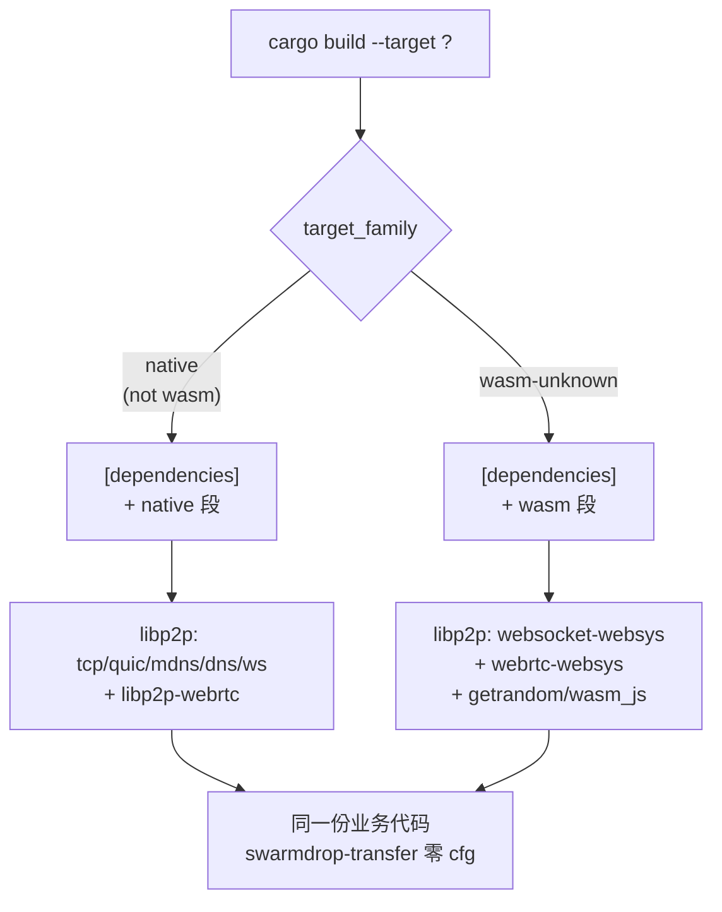

# 双 target 工程：cfg alias + target 依赖表

> **讲什么**：同一个 crate 要同时编到 native 和 `wasm32-unknown-unknown`，两边依赖不同、
> 实现不同——工程上怎么组织？**为什么重要**：这是单核心包（[00 篇](00-single-core-package.md)）
> 落地的第一块地基。选错手法（比如用 feature 开关）会在 workspace 里引发 feature unification
> 爆炸，越走越乱。本篇给出三段式 target 依赖表 + `cfg_aliases` + 空壳 crate 的完整套路。

## 错误的第一直觉：用 feature 开关

想让一个 crate"在 wasm 上换实现"，最容易想到的是加 feature：

```toml
# ❌ 反面示范
[features]
native = ["libp2p/tcp", "libp2p/quic", "libp2p/mdns"]
web = ["libp2p/websocket-websys", "libp2p/webrtc-websys"]
```

在**单 crate** 里这看着没问题。但 SwarmDrop 是一个多 crate workspace，`swarmdrop-net` 被
`swarmdrop-transfer`、`swarmdrop-core`、`swarmdrop-web`、桌面壳、移动壳同时依赖。Cargo 的
**feature 是加性的（additive）**，且会在整个构建图里做 **unification**——只要有任何一个成员在某个
构建里同时把 `native` 和 `web` 拉进来，两组互斥的依赖就会一起进依赖树，`tcp` 和
`webrtc-websys` 撞在一起，编译直接崩。

`crates/net/Cargo.toml` 顶部的注释把这条讲得很直白：

```toml
# 依赖用 target 三段式而非 feature 开关：同一 crate 双 target，feature 是加性的
# 会在 workspace feature unification 下爆炸，target 表才是「按平台换实现」的正解
# （iroh 同款做法，见 dev-notes/knowledge/libp2p-wasm.md）。
```

**关键区分**：feature 回答"要不要这个能力"，target 回答"在这个平台上用哪个实现"。
按平台换实现，答案是 target，不是 feature。

## 正解：三段式 target 依赖表

`Cargo.toml` 支持 `[target.'cfg(...)'.dependencies]`——按编译目标决定依赖。
`crates/net/Cargo.toml` 分成三段：

```toml
# ============ 公共（两个 target 都要）============
[dependencies]
swarmdrop-net-base = { workspace = true }
n0-future = { workspace = true }
# wasm 上 tokio 只有 sync/macros 可用（纯用户态原语）；spawn/time 走 n0-future
tokio = { workspace = true, features = ["sync", "macros"] }
cbor4ii = { version = "1", features = ["use_std", "serde1"] }

# ============ native ============
[target.'cfg(not(target_family = "wasm"))'.dependencies]
libp2p = { workspace = true, features = [
    "tcp", "quic", "dns", "websocket", "mdns",
    "noise", "yamux", "kad", "identify", "ping", "relay", "dcutr", "autonat",
    # ... ed25519 / macros / tokio / serde
] }
libp2p-webrtc = { workspace = true, features = ["tokio", "pem"] }

# ============ wasm（浏览器）============
[target.'cfg(all(target_family = "wasm", target_os = "unknown"))'.dependencies]
libp2p = { workspace = true, features = [
    "noise", "yamux", "kad", "identify", "ping", "relay", "serde",
    "websocket-websys", "webrtc-websys",
    # ... ed25519 / macros
] }
getrandom = { version = "0.3", features = ["wasm_js"] }
```

Cargo 按目标平台**只解析对应那一段**。编 native 时 `webrtc-websys` 根本不进依赖图，编 wasm 时
`tcp`/`quic`/`mdns` 根本不进依赖图——两组互斥依赖天然隔离，没有 unification 问题。



注意公共段里 `tokio` 只开 `["sync", "macros"]`——wasm 上 tokio 的 `sync`（mpsc/oneshot/watch）
是纯用户态原语，wasm 安全；`net`/`time`/`rt` 在 wasm 上不可用，所以 spawn 和 time 全走
`n0-future`（下一篇 [02](02-n0-future-tokio-shim.md) 专讲）。这条切分让公共段能安全共享 tokio 的
一部分，而不是整个 tokio 二分。

> 为什么原生要单独直接依赖 `libp2p-webrtc`？因为 webrtc-direct **不在 libp2p facade 里**
> （facade 只有 `webrtc-websys`），原生 webrtc 必须直接依赖。这条以及"为什么整套走 git rev"
> 见 [03 篇](03-libp2p-master-pitfalls.md)。

## `cfg_aliases`：别让长 cfg 字符串散落全 crate

代码里也要按平台分叉（引不同模块、调不同构造器）。如果每处都写完整的
`#[cfg(all(target_family = "wasm", target_os = "unknown"))]`，又长又容易写错、改一次改一片。

学 iroh 的做法：在 `build.rs` 里**集中定义一个 cfg alias**。

```rust
// crates/net/build.rs
fn main() {
    // 集中定义 cfg alias，全 crate 用 #[cfg(wasm_browser)] / #[cfg(not(wasm_browser))]，
    // 不散落长 target 字符串（学 iroh build.rs）。
    cfg_aliases::cfg_aliases! {
        wasm_browser: { all(target_family = "wasm", target_os = "unknown") },
    }
}
```

配 `[build-dependencies] cfg_aliases = { workspace = true }`（workspace pin `"0.2"`）。之后代码里
只写：

```rust
#[cfg(wasm_browser)]
use libp2p::websocket_websys as ws;
#[cfg(not(wasm_browser))]
use libp2p::tcp;
```

**这个 alias 名和定义要跟 iroh / n0-future 完全一致**（`all(target_family = "wasm", target_os = "unknown")`）——
n0-future 内部所有 `#[cfg(wasm_browser)]` 分支就是这个 alias 控制的，命名对齐能省掉一层心智负担。

> ⚠️ 为什么是 `target_os = "unknown"` 而不只是 `target_family = "wasm"`？因为 `wasm32-wasi`
> 也是 wasm family，但它有一部分 std（文件系统等）。我们要精确锁定的是**浏览器**目标
> `wasm32-unknown-unknown`——它连 libc 都没有。

## 空壳 crate：`#![cfg(wasm_browser)]` 模式

`crates/web` 是浏览器外壳，**整个 crate 只在 wasm 下才有内容**。但它是 workspace member，
`cargo check --workspace` 会在 native 下也编它一遍。怎么让它在 native 下"秒过"？

crate 根加一行 `#![cfg(wasm_browser)]`——**整个 crate 在 native target 下编成空壳**。
`crates/web/Cargo.toml` 头部注释：

```toml
# 浏览器 Web 壳……#![cfg(wasm_browser)] 全 crate 门控——native target 下是空壳，秒过
# `cargo check --workspace`；wasm 下经端口 Web 实现装配 TransferManager。
```

好处：`cargo check --workspace`（native）不会因为 web 壳里一堆 `web-sys` 调用而报错，
它整个被 cfg 掉了；而 wasm 构建时它是真身。这让日常开发（native）和 wasm 门禁（专门跑）
互不干扰。

## crate-type：要产出 .wasm 就得 cdylib

`crates/web` 声明：

```toml
# crates/web/Cargo.toml
[lib]
crate-type = ["cdylib", "rlib"]
```

- `cdylib`——wasm-bindgen 需要它才能真正生成 `.wasm` 文件（iroh 的 `iroh/Cargo.toml` 也这么写，
  注释原话："We need 'cdylib' to actually generate .wasm files"）。
- `rlib`——让它还能被其它 Rust crate 当普通库依赖 / 跑测试。

两个都要。只有 cdylib 会丢掉 rlib 的可依赖性，只有 rlib 产不出 wasm。

## 双 target 门禁：一个脚本

光会写还不够，要**每次 PR 都验证 wasm 真能编过**，否则业务层某人不小心引了个 native-only 的
东西，要到很久以后才发现。`scripts/check-wasm.sh` 就是这个门禁（CI 的 wasm job 同款）：

```bash
# scripts/check-wasm.sh（节选）
CRATES=(-p swarmdrop-net-base -p swarmdrop-net -p swarmdrop-host -p swarmdrop-transfer -p swarmdrop-web)
cargo check "${CRATES[@]}" --target wasm32-unknown-unknown
```

它把"哪些 crate 必须保持 wasm 可编"钉成了一张清单——`net-base` / `net` / `host` / `transfer` /
`web`。注意 `swarmdrop-core` **不在**清单里：它带 sea-orm + SQLite，`libsqlite3-sys` 在
wasm 上死于 `stdio.h file not found`（wasm32-unknown-unknown 连 libc 都没有）。所以单核心包的
"核心"是**传输域 `swarmdrop-transfer`**，不是组合根 `swarmdrop-core`。

> 这个脚本在 macOS 上还悄悄处理了一个工具链坑（Apple clang 编不了 wasm），那属于
> [04 篇 wasm 工具链](04-wasm-toolchain.md) 的范畴，这里先不展开。

## 小结

| 手法 | 用途 | 位置 |
|---|---|---|
| **三段式 target 依赖表** | 按平台换实现（不用 feature 开关） | `crates/net/Cargo.toml` |
| **`cfg_aliases!{ wasm_browser }`** | 代码里只写短 cfg，集中定义 | 各 crate `build.rs` |
| **`#![cfg(wasm_browser)]` 空壳** | 纯 wasm crate 在 native 下秒过 | `crates/web/lib.rs` |
| **`crate-type=["cdylib","rlib"]`** | 既产 .wasm 又可当库 | `crates/web/Cargo.toml` |
| **`check-wasm.sh`** | 把"哪些 crate 必须 wasm 可编"钉成门禁 | `scripts/` + CI |

一句话：**feature 回答"要不要"，target 回答"在哪个平台用哪个实现"。按平台换实现一律走
target 依赖表。** 下一篇解决其中最关键的一块替换：[wasm 没有 tokio runtime 怎么办](02-n0-future-tokio-shim.md)。
