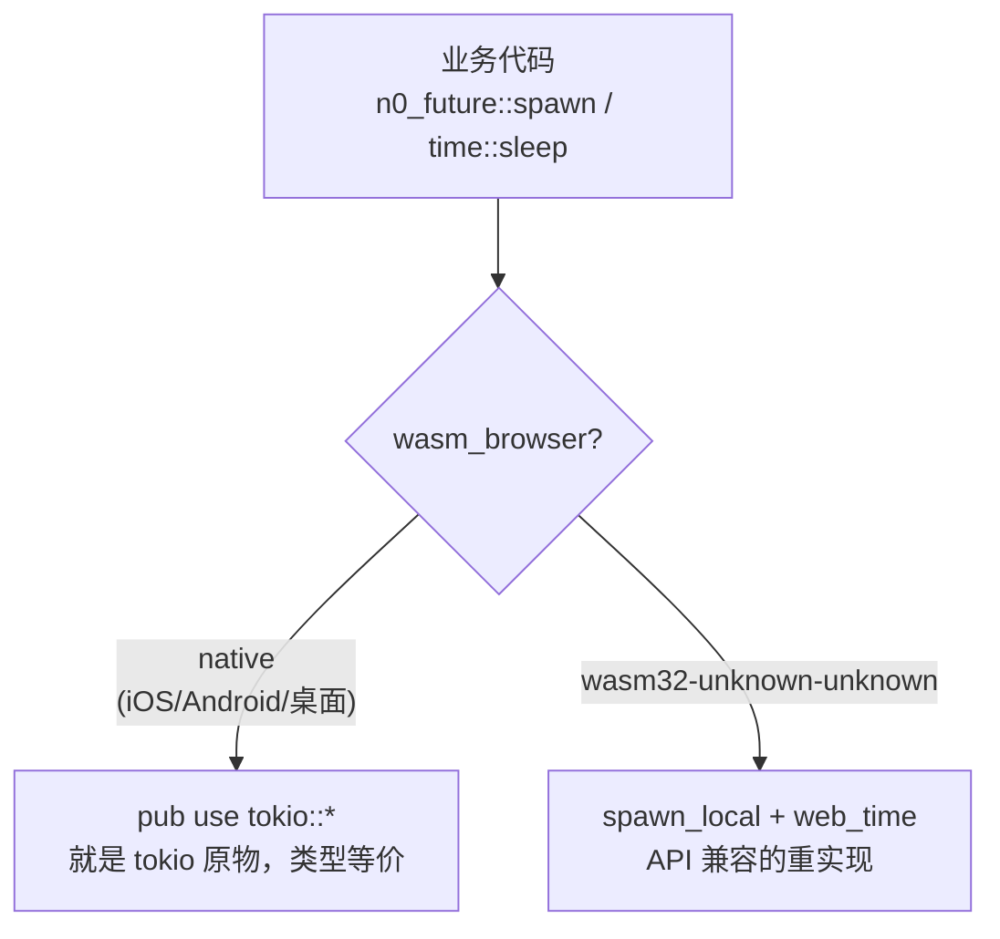

# n0-future：tokio 的浏览器替身

> **讲什么**：wasm 上没有 tokio runtime，那 `tokio::spawn`、`tokio::time::sleep` 这些遍布代码的
> 调用怎么办？答案是 `n0-future`——native 上它**就是 tokio 本身**，wasm 上换成 API 兼容的重实现。
> **为什么重要**：这是让业务层保持[零 cfg](00-single-core-package.md)的关键一环。用对了，几十处
> tokio 调用是纯机械替换；用错了，会踩一个 wasm 独有的 lost-wakeup 陷阱。

## 问题：wasm 上 tokio 大半不能用

tokio 的 runtime 依赖操作系统线程和 IO 事件循环。`wasm32-unknown-unknown` 是**单线程**、
无系统调用的沙盒——`tokio::spawn` 没有执行器可投递，`tokio::time::Instant::now()` 直接
运行时 panic。但我们的传输域里 `spawn` / `timeout` / `interval` / `sleep` 加起来几十处
（`libs/core` 8 处 + `crates/core` 28 处），不可能为 wasm 手写一套。

需要一个垫片：**同一套 API，native 走 tokio，wasm 走浏览器 runtime。**

## n0-future 的设计：native 上零成本假装成 tokio

`n0-future` 是 n0（iroh 组织）维护的通用垫片，**不拖 iroh 进来**。它的精髓在于——
在 native 上它**不是包装、不是适配层，就是 tokio 的 re-export**：

```rust
// n0-future/src/task.rs:4-9
#[cfg(not(wasm_browser))] pub use tokio::spawn;
#[cfg(not(wasm_browser))] pub use tokio::task::{AbortHandle, Id, JoinError, JoinHandle, JoinSet};
#[cfg(not(wasm_browser))] pub use tokio_util::task::AbortOnDropHandle;

// n0-future/src/time.rs:6-10
#[cfg(not(wasm_browser))] pub use tokio::time::{
    error::Elapsed, interval, interval_at, sleep, sleep_until, timeout,
    Duration, Instant, Interval, MissedTickBehavior, Sleep, Timeout,
};
```

`pub use` 按定义就是同一类型——`n0_future::time::Instant` **就是** `tokio::time::Instant`。
所以桌面/移动端跑的还是 tokio 原物，**类型等价、源码级零改动**。wasm 侧才换成 API 兼容的
重实现（`web-time` + `wasm-bindgen-futures` + `send_wrapper`）。



`wasm_browser` 由 n0-future 自己 `build.rs` 里的 cfg_alias 控制
（`all(target_family = "wasm", target_os = "unknown")`，和我们 [01 篇](01-dual-target-engineering.md)
用的完全同名）——**自动生效，不用手配 rustflag**。

> **纠正一个易生的误判**：n0-future 不是"跨平台抽象"，是"浏览器兼容垫片"。编到
> `aarch64-apple-ios` / `aarch64-linux-android` 时 target_family 不是 wasm，因此 **100% 走
> `pub use tokio::*`**。移动端从这次替换里一点行为变化都不会有。

## 三类 API：能换、不用换、换不了

把代码里用到的 tokio 面盘一遍，恰好分三类：

```rust
// ---- ① 有对应物，换（纯 import 替换）----
tokio::spawn                        -> n0_future::spawn
tokio::time::{sleep, timeout, interval, Instant, Duration, ...}
                                    -> n0_future::time::{同名}

// ---- ② 无对应物，且【不需要】换 ----
tokio::select! { .. }               // 纯宏，只吃 macros feature、不碰 runtime，wasm 照常编译
tokio::sync::{mpsc, oneshot, watch, broadcast, Mutex, ...}  // 纯用户态，wasm 安全

// ---- ③ 无对应物，且【无法】上 wasm ----
tokio::task::spawn_blocking         // 浏览器没线程
tokio::fs / tokio::net              // 浏览器没文件系统/裸 socket
```

**② 这一类很省事**：`select!` 是纯宏，只需要 tokio 的 `macros` feature，运行时一点不碰，
wasm 上照常展开。所以我们 [01 篇](01-dual-target-engineering.md) 的公共依赖段里
`tokio = { features = ["sync", "macros"] }` 就够——`sync` 给用户态原语，`macros` 给 `select!`，
两者都 wasm 安全。**`select!` 和 `tokio::sync::*` 一个字都不用改。**

**③ 这一类是真边界**：`spawn_blocking` / `tokio::fs` / `tokio::net` 在浏览器物理上不存在。
碰到它们不是"换个库"，是"这段逻辑得换设计"——比如落盘不能走 `tokio::fs`，得走 OPFS 端口
（那属于 [browser-platform 系列](../browser-platform/)）。好在传输域早就通过端口 trait
把文件 IO 依赖倒置出去了，这类调用本来就不在业务层。

## 迁移风险：比想象低，但别说"零成本"

盘点用量（libp2p-wasm.md 的统计）：

| API | 数量 | 备注 |
|---|---|---|
| `tokio::spawn` | 22 | **全部 fire-and-forget**——零 `JoinHandle`、零 `.abort()` |
| `tokio::time::timeout` | 5 | |
| `tokio::time::interval` | 3 | 其中 2 处用 `set_missed_tick_behavior` |
| `tokio::time::sleep` | 1 | |

**22 处 spawn 全是 fire-and-forget** 这点很关键——wasm 版 spawn 底层是
`wasm_bindgen_futures::spawn_local`，投递后就脱管、没有 JoinHandle 语义，正好是 drop-in。
`interval` 里那 2 处用了 `set_missed_tick_behavior(MissedTickBehavior::Delay)`（tokio 独有 API），
n0-future 也补齐了，同样是纯 import 替换。

> ⚠️ **别说"零成本"。** `n0-future` 的 `Cargo.toml` 在非 wasm target 下无条件启用了 tokio 的
> `test-util` feature。Cargo 的 feature unification 会把它传染给整个构建的 tokio——如果你的项目
> 此前没开过 `test-util`，引入 n0-future 会首次把 tokio 的**可 mock 时钟代码路径**编进生产包。
> 默认 `start_paused=false`，运行时行为不变，**但二进制必然不同**。「类型等价」成立，
> 「二进制逐字节等价」不成立。

还有一个 Web 化才浮现的边界：native 下 `n0_future::time::Instant` 是 `tokio::time::Instant`
（同一类型），但 wasm 下它会变成 `web_time::Instant`。所以把 `Instant` 用作**结构体字段**或
**公开函数签名**的地方，在 Web 化那一刻会变成类型边界——替换时要单独盯这些点。

## 关键坑：wasm 版 JoinSet 是个有缺陷的 shim

这是本篇最需要记住的一条，也是为后面调试系列埋的伏笔。

native 上 `n0_future::task::JoinSet` 就是 `tokio::task::JoinSet`（完美）。但 wasm 上它是用
`futures_buffered::FuturesUnordered` 自己拼的 shim，还套了 `send_wrapper::SendWrapper`。
**这个 shim 有作者自己标注的 TODO 级缺陷**（index-foundations.md 引的 n0-future 源码 doc）：

> *"If you `.spawn` a new task onto this `JoinSet` while the future returned from this is currently
> pending, then this future will continue to be pending, even if the newly spawned future is already
> finished. **TODO(matheus23): Fix this limitation.**"*

翻译成人话：

```rust
loop {
    tokio::select! {
        // 已有任务完成 → 正常
        joined = set.join_next() => { /* ... */ }
        // 但在 join_next 挂起期间往 set 里 spawn 新任务……
        new = rx.recv() => set.spawn(some_task),  // ← wasm 下这个新任务可能永远 join 不出来
    }
}
```

**根因是 wasm 单线程**：`FuturesUnordered` 需要**宿主主动 poll** 才推进，它不是像 tokio 那样
把任务投到独立执行器上自己跑。当 `join_next()` 的 future 正挂起时新 spawn 的任务，不会触发
对这个 future 的重新 poll，于是它永远 pending。native 多线程时序天然掩盖了这个问题。

变通办法（n0 自己的做法）是：每次往 `JoinSet` 里 spawn 后重建 `join_next` future。**但更根本的
教训是：wasm 单线程下，"spawn 出去自己会跑"这个来自多线程 tokio 的直觉不成立。** 凡是依赖
"后台任务被独立驱动"的结构，到 wasm 上都要重新审视谁来 poll 它。

> 🔗 **这条直接连到 [05 篇"编过 ≠ 能用"](05-what-compiles-isnt-what-runs.md) 的门 3**：一条流在
> 任务 A 读了首帧、再 move 给独立 spawn 的任务 B，B 首次 poll 前 muxer 已经把后续帧的 wake 打给
> 了 A 的旧 waker——同样是"新 spawn 的东西没人唤醒"的 lost-wakeup 家族。JoinSet shim 是它在
> API 层的显影，门 3 是它在数据面的显影。完整调试复盘见 [wasm-debugging 系列](../wasm-debugging/)。

## 小结

- **n0-future 在 native 上就是 `pub use tokio::*`**（类型等价、零行为变更），wasm 上换
  `spawn_local` + `web_time`。移动端走 native 分支，从替换里没有任何行为变化。
- **三类 API**：`spawn`/`time` 要换（纯 import 替换）；`select!`/`tokio::sync` 不用换（纯用户态、
  wasm 安全）；`spawn_blocking`/`fs`/`net` 换不了（业务层本就不该碰它们）。
- **别说"零成本"**：`test-util` 被 unification 带进生产包，二进制会变。
- **wasm 版 JoinSet 是 FuturesUnordered shim**，需要宿主 poll、不是独立 spawn——这是 wasm
  单线程 lost-wakeup 的第一次露头，[05 篇门 3](05-what-compiles-isnt-what-runs.md) 会再遇到它。

下一篇换个战场：[为什么我们被迫吃 libp2p git master](03-libp2p-master-pitfalls.md)。
