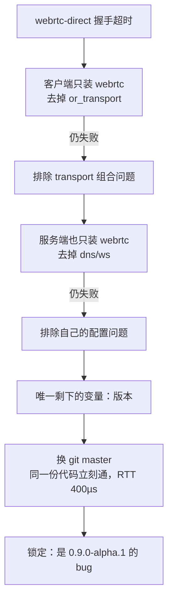

# 吃 libp2p git master 的坑

> **讲什么**：SwarmDrop 的 libp2p 依赖不是 crates.io 的发布版，而是 pin 在 git master 的一个
> 具体 rev（`93c5059`）。这一篇讲**为什么被迫这么做**、**代价是什么**、以及切到 master 之后
> 撞上的一串行为变更坑。**为什么重要**：吃 git 依赖是要写进决策记录、走独立 PR 的重大选择，
> 不是"随手 pin 一下"；而且 master 的行为和 0.56 发布版有真实差异，照着旧文档写会踩空。

## 起因：crates.io 上的 webrtc-direct 是坏的

要让浏览器免域名、免 CA 证书地连上公网节点，唯一的传输是 `/webrtc-direct`
（地址形如 `/ip4/1.2.3.4/udp/1234/webrtc-direct/certhash/<hash>`，裸 IP + 自签证书哈希）。
问题是——**crates.io 上最新的 `libp2p-webrtc 0.9.0-alpha.1` 的 webrtc-direct 跑不通。**

症状很有迷惑性（`spike/webrtc-direct-https/Cargo.toml` 的大段注释记录了全过程）：

- 浏览器 ICE 能打通，**服务端确实收到 `IncomingConnection`**；
- 但握手死在 `data channel opening took longer than 10 seconds`；
- 拨号端报 `Failed to negotiate transport protocol(s): Timeout has been reached`。

"网络层看着通了、握手层挂了"最容易让人怀疑是自己的配置。所以 spike 做了**逐变量隔离**：



两端都降到与官方 `examples/browser-webrtc` 完全相同的配置仍失败，**换 git master 后同一份代码
立刻通**。上游 CHANGELOG 点名了修复——`transports/webrtc/CHANGELOG.md` 的 `0.10.0-alpha`
第一条：

> Update webrtc-rs to `v0.17` and **fix libp2p noise data channel negotiation**.
> See [PR 6429](https://github.com/libp2p/rust-libp2p/pull/6429)

⇒ **这比"它是 alpha"严重一档：不是"不稳"，是已发布版本根本不通。要 webrtc-direct，今天
就必须吃 git 依赖**，等 `0.10.0-alpha` 发布才能回 crates.io。

## 代价一：整个 facade 一起切，pin 同一个 rev

webrtc-websys 是从 libp2p facade 来的，版本必须和 facade 配对——所以**不能只把
`libp2p-webrtc` 切 git，整个 libp2p 系全部一起切**。根 `Cargo.toml`：

```toml
# 根 Cargo.toml — libp2p 系全部 pin 同一 git rev
libp2p        = { git = "https://github.com/libp2p/rust-libp2p", rev = "93c5059" }
libp2p-stream = { git = "https://github.com/libp2p/rust-libp2p", rev = "93c5059" }
libp2p-webrtc = { git = "https://github.com/libp2p/rust-libp2p", rev = "93c5059" }

# 但 identity/multiaddr 不跟 git：
libp2p-identity = "0.2"
```

**为什么 `libp2p-identity` / `multiaddr` 反而用 crates.io？** 因为 master 树自己就把它们解析到
crates.io 发布版（Cargo.lock 实证 `libp2p-identity 0.2.14` / `multiaddr 0.18.2`）。`net-base`
用 crates.io 版本天然 unify。**这里有个隐雷**：如果你把 identity 也 pin 成 git，可能和 master
树解析出的 crates.io 版本对不上，导致仓库里出现**两个 `PeerId` 类型**（git 版一个、registry 版
一个），类型不兼容、编译报错。让它们跟着 master 树自动解析，反而干净。

> ⚠️ **吃 git rev 是有纪律的**（net-kernel.md 的约定）：升级 rev 必须走**独立 PR + 全量测试 +
> wasm check**，不能夹在功能改动里。`93c5059` 是 2026-07-13 的快照。

## 代价二：master ≠ 0.56，照旧文档写会踩空

从 0.56 切到 0.57-dev，有几处行为变更专门坑"照着 0.56 经验写"的人。

### 坑 A：`wasm-bindgen` feature 被删了

libp2p **0.56** 有一个一等公民的 `wasm-bindgen` feature，一把打开 getrandom/js、swarm 的
`WasmBindgenExecutor`、gossipsub 定时器。很多 wasm 教程（包括我们自己早期的调研笔记）都教你
在 wasm target 段写 `features = ["wasm-bindgen", ...]`。

**master（0.57）把这个 feature 移除了**，改为按 `cfg(target_family="wasm")` 自动生效。
0.56 的写法搬到 master 会直接报 `libp2p does not have that feature`。所以我们
[01 篇](01-dual-target-engineering.md) 的 wasm 依赖段里**没有** `wasm-bindgen`——不是漏了，
是 master 上它不存在了。

### 坑 B：`wasm-bindgen-futures` 必须精确 pin `=0.4.58`

master 的 `libp2p-swarm` 把 `wasm-bindgen-futures` **精确 pin 成 `=0.4.58`**。如果你在自己的
wasm 依赖段里随手写 `wasm-bindgen-futures = "0.4"`，Cargo 会解析到更高的 `0.4.76`，然后和
libp2p-swarm 钉死的 `=0.4.58` 冲突——**cargo 无解**。所以两个碰它的 crate 都跟着钉死：

```toml
# crates/net/Cargo.toml（wasm 段）与 crates/web/Cargo.toml
# master 的 libp2p-swarm 精确 pin =0.4.58，必须跟着钉，否则 cargo 无解
wasm-bindgen-futures = "=0.4.58"
```

> 这条也牵连到 wasm-bindgen 工具链的版本一致性，那部分归 [04 篇](04-wasm-toolchain.md)。

### 坑 C：relay server 的 HOP 协议默认不广告（PR 6154）

这是最隐蔽的一个，**只在自建 relay / LanHelper 场景才炸**。master 的 relay（0.22.0）把 HOP
协议广告默认改成 `Status::Disable`，并随 **external address** 自动开关。私网 LanHelper 没有公网
地址 → auto 模式**永远不会开 HOP** → 浏览器/客户端的 reservation 请求在 multistream 层被**静默
拒绝**（症状：`Listener: rejecting protocol .../hop`，且**没有任何 relay 事件**）。

**正确做法**：配置了 relay server 就显式打开：

```rust
// crates/net/src/behaviour/mod.rs
server.set_status(Some(relay::Status::Enable));
```

### 坑 D：`NoAddressesInReservation`（旧栈也踩过）

server 没有 external 地址时**照样 accept reservation**，但应答里 0 个地址——**client 侧**报
`NoAddressesInReservation` 直接关掉 circuit listener（而 server 日志还显示 accepted，极具
迷惑性）。所以 relay 必须把自身可公告地址塞进应答，`announce_private_addrs` 承担这个职责
（identify 广播 + reservation 应答地址两用，判定含 loopback：生产无害、测试必需）。

> 坑 C/D 不是 wasm 特有，但**浏览器把它们放大了**：浏览器无法 listen，要"被动可达"只能靠
> circuit relay reservation——reservation 一旦失败，浏览器就彻底连不进来。这两个坑在纯原生
> 场景可能被直连掩盖，一上 Web 端就无处可藏。relay reservation 的完整时序（必须先与 relay 有
> 活跃连接才能 `listen_on(circuit)`）见 [network-kernel 系列](../network-kernel/)。

还有一处 master 的类型分叉容易被忽略：kad `Record.expires` 在 native 是
`std::time::Instant`、在 wasm 是 `web_time`（与 `n0_future::time::Instant` 同源）。写跨平台的
DHT Put 代码时这里得 cfg 分支——又一个"业务层零 cfg、平台差异下沉到内核"的具体落点。

## 一个反直觉的好消息：behaviour 层原样编过 wasm

切 master 听起来风险很大，但要澄清一件事：**libp2p 的协议（behaviour）层本来就 100% 编得过
wasm**。libp2p-wasm.md 的编译探针实测，两端依赖树只在**传输层**有差集：

| 只在 wasm | 只在原生 |
|---|---|
| `webrtc-websys` `websocket-websys` `webtransport-websys` | `mdns` `quic` `tcp` `tls` |

其余 `kad` / `gossipsub` / `relay` / `dcutr` / `identify` / `ping` / `request-response` /
`noise` / `yamux` 等 18 个 crate 完全一致，全部编过 wasm32。**卡点从来不在协议层，在传输层。**
这也印证了 [00 篇](00-single-core-package.md) 的边界哲学——cfg 分叉集中在传输栈，业务/协议层
无感知。

> ⚠️ 但"编过"不等于"能用"。behaviour 层编过 wasm，**不代表**它在浏览器运行时行为正确。
> 这正是 [05 篇](05-what-compiles-isnt-what-runs.md) 的主题。

## 小结

- **吃 git master 的唯一硬理由**：crates.io 的 `libp2p-webrtc 0.9.0-alpha.1` webrtc-direct
  已发布版根本不通，修复只在 master（PR 6429）。spike 逐变量隔离坐实了是版本问题。
- **代价**：整个 facade 一起切、pin 同一 rev（`93c5059`）；`identity`/`multiaddr` 反而让它跟着
  master 树解析到 crates.io，否则会出现两个 `PeerId` 类型。
- **master 行为变更四坑**：`wasm-bindgen` feature 删除、`wasm-bindgen-futures` 精确 pin `=0.4.58`、
  relay HOP 默认不广告（`set_status(Enable)`）、`NoAddressesInReservation`（`announce_private_addrs`）。
- **升级 rev 要走独立 PR + 全量测试 + wasm check**，等 `0.10.0-alpha` 发布再回 crates.io。

下一篇是工具链层的坑：[Apple clang 编不了 ring、getrandom 双版本、体积](04-wasm-toolchain.md)。
