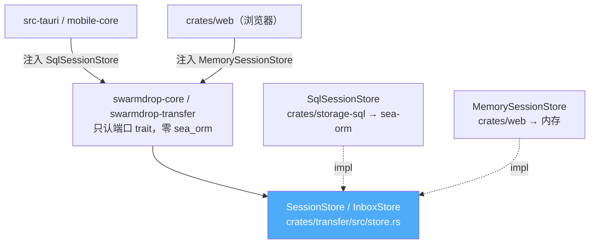

# sea-orm 从 core 摘到 storage-sql——core 编 wasm 的存储前置

> **讲什么**：`swarmdrop-core` 要编到 `wasm32-unknown-unknown`，但 sea-orm 是 native-only。
> 卡点**不在 entity**（纯数据结构，实测原样过 wasm）——在 `DatabaseConnection`（它拖着
> sqlx/tokio/mio/ring 一整条 native 链）。所以切割线划在**连接层**：core 定义 `SessionStore`/
> `InboxStore` 端口 trait，SQL 实现整体下沉独立 crate `storage-sql`。
> **为什么重要**：这是 core-wasm-ready 的**第 0 步**。它和 [00 篇单核心包](00-single-core-package.md)、
> [02 篇 n0-future](02-n0-future-tokio-shim.md) 三件套一起，构成「同一份 core 编到浏览器」的完整前置。

## 结论先行

浏览器里没有能用的 SQLite。这不是「sea-orm 编不过 wasm」的问题——是**更底层的物理不存在**：
`wasm32-unknown-unknown` 连 libc 都没有（`sqlite3.c` 撞 `'stdio.h' file not found`），`sqlx-sqlite`
的 runtime 撞 `mio`（`This wasm target is unsupported by mio`），`runtime-tokio-rustls` 撞 `ring`
的 C 代码。三条路全堵死，实测记录在 [`storage-abstraction.md`](../../knowledge/storage-abstraction.md)。

于是很自然会想到「把存储抽成 trait」。但抽 trait 时最容易问错的问题是「entity 能不能编 wasm」——
**问反了**。实测的答案是：

| 东西 | 能不能上 wasm | 为什么 |
|---|---|---|
| `entity::*::Model` | **能**，一个字不改 | 是 `DeriveActiveModel` 生成的**纯 scalar 结构体**，关系字段只在 `ModelEx` |
| `DatabaseConnection` | **不能** | 它就是 sqlx pool + tokio runtime + mio + ring，wasm 硬墙 |

所以切割线不在 entity，在 `DatabaseConnection`。**entity 留在 core，连接层摘出去。** 落地形态：



依赖方向被倒置了：以前 core 直接 `use sea_orm::DatabaseConnection`，现在 core 只认 `crates/transfer/src/store.rs`
里的端口 trait，SQL 实现（`SqlSessionStore`）反过来依赖端口。**core 从此看不见 sea-orm。**

## 第 0 步：先把 sea-orm 的 runtime 从公共依赖里拆掉

抽 trait 之前有一步**零风险、无论 Web 走哪条路都该做**的准备：让 workspace 的 `sea-orm` 默认不带 runtime。

改前，根 `Cargo.toml` 的 sea-orm 硬绑了 `runtime-tokio-rustls` + `sqlx-sqlite`——任何 crate（哪怕只用
`entity` 的类型）都会被传染进 mio 编译墙。改后（`Cargo.toml:31-36`）：

```toml
# 根 workspace：default-features=false + 只留类型宏 features
sea-orm = { version = "2.0.0-rc", default-features = false, features = [
    "macros", "with-chrono", "with-uuid", "with-json",
] }
```

runtime features（`runtime-tokio-rustls`/`sqlx-sqlite`）**由需要真正连库的 crate 自己增量补**。
`entity` 只吃类型宏（`crates/entity/Cargo.toml:7` 的 `sea-orm = { workspace = true }`），并留一个可选
feature 给桌面/移动端在需要时开：

```toml
# crates/entity/Cargo.toml:20
sqlite = ["sea-orm/runtime-tokio-rustls", "sea-orm/sqlx-sqlite"]
```

这一步实测改完即过。**不做它，后面所有 trait 设计都跑不到 wasm 上**——因为业务 crate 只要
transitively 碰到 entity 就会撞墙。

## 端口 trait：定义在 transfer，用例级粒度，entity 直接上签名

端口定义在 `crates/transfer/src/store.rs`（传输域是唯一持久化消费方）。两个子端口按聚合根拆：

```rust
// crates/transfer/src/store.rs:21
#[async_trait]
pub trait SessionStore: Send + Sync {
    async fn create_session(&self, input: CreateSessionInput<'_>) -> AppResult<()>;
    // 断点续传要读回原始 Model —— entity 类型直接出现在签名里，实测能编 wasm
    async fn find_session(&self, id: Uuid)
        -> AppResult<Option<entity::transfer_session::Model>>;         // :77
    async fn apply_transition(
        &self, session: &entity::transfer_session::Model,             // :64
        state: &TransferState,
    ) -> AppResult<()>;
    async fn get_session_files(&self, id: Uuid)
        -> AppResult<Vec<entity::transfer_file::Model>>;               // :89
    // …共 14 个方法
}

// crates/transfer/src/store.rs:113 —— transfer 只用「完成接收后幂等建条目」一个用例
#[async_trait]
pub trait InboxStore: Send + Sync {
    async fn ensure_inbox_item_for_completed_receive_session(&self, id: Uuid) -> AppResult<()>;
}
```

三个设计选择，每个都由前面的实测撑着：

**1. entity 类型直接上 trait 签名，不做镜像转换。** `find_session` 返回 `entity::transfer_session::Model`、
`apply_transition` 收 `&entity::transfer_session::Model`、`get_session_files` 返回
`Vec<entity::transfer_file::Model>`——全是 entity 原类型。既然 `Model` 实测过 wasm32，就没必要为了
「脱钩 sea-orm」把 8 个 enum 全做一遍 `Core*` 镜像 + `From` 双向转换（那是纯洁癖、零 wasm 收益）。

**2. 粒度取「用例级」，trait 上永不出现 `begin`/`commit`。** 全 core 唯一的跨表事务在
`crates/storage-sql/src/inbox.rs:205`（`begin()`）→ `:261`（`commit()`），整包在一个 pub fn 内。
所以 trait 暴露 `create_session`（会话行 + N 个文件行 + 策略快照一次写入）而非
`insert_session_row` + `insert_file_row`——事务窗口是**实现细节**。SQLite 用 sea-orm 事务，
未来 IndexedDB 用它自己的微任务事务窗口，语义差异被挡在实现里，trait 面看不见。

**3. 读查询不进 trait。** `storage-sql` 里有 33 个 `pub async fn`（`ops.rs` 23 + `inbox.rs` 10），
只有 15 个（`SessionStore` 14 + `InboxStore` 1）被提进端口——就是 transfer 运行时**真正需要**的那些。
剩下的读查询（`get_transfer_projections`/`list_inbox_items`/`search_inbox`…）由 commands/MCP **直接调
free function**。它们是纯 native 消费点（历史列表、收件箱检索），没必要为它们扩宽 wasm 边界。端口刻意窄。

一个反直觉的收获：这套 trait 保持与 core 既有 6 个 `host` trait **逐字同构**（`#[async_trait]` +
`: Send + Sync`），错误类型沿用 `AppResult`。见下一节，`Send` 约束一个字都不用动。

## SQL 实现下沉：`SqlSessionStore` 只做委托，函数本体不动

实现层是独立 crate `swarmdrop-storage-sql`。它的依赖面很干净——**只吃端口 + 数据类型 + sea-orm，
不依赖 core**（`crates/storage-sql/Cargo.toml`）：

```toml
swarmdrop-transfer = { workspace = true }   # 端口 trait
swarmdrop-host     = { workspace = true }   # AppResult / CoreSaveLocation
entity             = { workspace = true }   # Model
sea-orm = { workspace = true, features = ["runtime-tokio-rustls", "sqlx-sqlite"] }
```

`SqlSessionStore` 持一个 `Arc<DatabaseConnection>`，方法体逐个委托给 `ops`/`inbox` 里的既有实现函数——
**那些函数从 core 平移过来，函数本体一个字没改**：

```rust
// crates/storage-sql/src/store.rs:21
pub struct SqlSessionStore { db: Arc<DatabaseConnection> }

#[async_trait]
impl SessionStore for SqlSessionStore {
    async fn create_session(&self, input: CreateSessionInput<'_>) -> AppResult<()> {
        ops::create_session(&self.db, input).await   // 委托，本体不动
    }
    // …14 个方法全是一行委托
}
```

搬迁的提交是 `ac38744a`（*refactor(core,storage-sql): sea-orm 摘出独立 crate*）。git 直接把它识别成
**重命名**——`ops.rs`/`inbox.rs`/`store.rs` 从 `crates/core/src/database/` 整体挪到
`crates/storage-sql/src/`，diff 只有 24/36/8 行的 import 路径调整，业务逻辑零改动。同一提交里
`crates/core/src/database/mod.rs` 减 7 行、`lib.rs` 减 1 行——core 里那个 `database` 模块就此消失。

## SendWrapper 那条：为什么 trait 的 `Send` 约束不用 cfg 条件化

这是最容易讲错的一条，先把事实摆正：**`SqlSessionStore` 本身不用 `SendWrapper`**。它持的
`DatabaseConnection` 在 native 上本来就是 `Send`，直接满足 `SessionStore: Send + Sync`。

`SendWrapper` 是**为 Web 侧准备的**。浏览器里一切异步（IndexedDB / OPFS / fetch）都经
`wasm_bindgen_futures::JsFuture`，它是 `!Send`（内部持 `JsValue`）。直觉是「那 trait 的 `Send` 约束
得 cfg 条件化」——但那要求把整套 trait 头上的 `Send + Sync` supertrait 一起条件化，牵一发动全身；
更糟的是 `#[async_trait(?Send)]` 会**沿调用链病毒式传染**，击穿传输域 [n0-future 那 22 处
`spawn`](02-n0-future-tokio-shim.md)（它们要求 future `Send`）。

省事的路是：**trait 保持 `: Send + Sync` 不动，Web 实现内部用 `SendWrapper` 把 `!Send` 的 JsFuture
裹成 `Send`**。这不是绕过 `Send`，是真满足（探针 15 实测：特意用返回 `impl Send` 的 spawn 形状去逼
约束，也过）。这个模式已经在 Web 端跑起来了——`crates/web/src/file_access.rs:186`：

```rust
// open_writable 内部有 !Send 句柄跨 await，整段裹 SendWrapper 满足 trait 的 Send 约束
let writable = SendWrapper::new(open_writable(&sink.0, keep_existing_data)).await?;
```

于是同一个 `: Send + Sync` 的 trait，两端各自满足、互不迁就：

| 实现 | 位置 | 怎么满足 `Send` | 依赖 sea-orm？ |
|---|---|---|---|
| `SqlSessionStore` | `crates/storage-sql`（native）| `DatabaseConnection` 天然 `Send` | 是 |
| `MemorySessionStore` | `crates/web`（wasm）| 全是普通值 + `std::sync::Mutex`，无 `!Send` | **否** |
| 未来 IndexedDB/OPFS store | `crates/web` | `SendWrapper` 裹 JsFuture（如 `file_access.rs`）| 否 |

⚠️ **代价写死在实现顶部注释**：`SendWrapper` 跨线程 drop/access 会 panic。wasm32 不开 atomics 时是
单线程、永不触发；一旦启用 wasm threads（atomics + shared memory）就变成活雷。CI 里 target 必须钉住
不带 `+atomics`。

Web 端当前的 `MemorySessionStore`（`crates/web/src/store.rs:34`）连 `SendWrapper` 都用不上——它手工
构造 `entity::*::Model`（纯 scalar，可直接 `Model { … }`）、直接拼 `TransferProjection`（绕开 `ModelEx`
的 `HasMany` 关系类型），因此 **web 壳自身不依赖 sea-orm**。页面刷新即丢，符合「传输端」定位；
跨刷新持久化的 IndexedDB 版是后续 change。但它已经证明了关键一点：**core 在浏览器里被真实消费了。**

## 量化耦合面：抽象成本比想象小

抽这层 trait 到底动了多少东西？盘出来的数字反直觉地小：

| 项 | 数字 | 说明 |
|---|---|---|
| `storage-sql` 里以 `db: &DatabaseConnection` 为首参的 `pub async fn` | 33 | `ops.rs` 23 + `inbox.rs` 10 |
| 其中被提进端口 trait 的 | 15 | `SessionStore` 14 + `InboxStore` 1，只覆盖 transfer 运行时需要 |
| 持 `Arc<dyn TransferStore>` **字段**的结构体（注入点）| **3** | `manager.rs:163`、`coordinator.rs:331`、`actor/receiver.rs:50` |
| 合并端口 blanket impl | **1** | `TransferStore: SessionStore + InboxStore`，单 `Arc` 覆盖两个子端口 |
| transfer crate 里的 `sea_orm` / `DatabaseConnection` 引用 | **0** | 已 grep 核实 |
| 跨表事务 | 1 处 | `inbox.rs:205`→`:261`，整包在单个 pub fn 内 |

注入点只有 3 个，是因为有个合并端口把两个子 trait 收成一个（`crates/transfer/src/store.rs:126`）：

```rust
pub trait TransferStore: SessionStore + InboxStore {}
impl<T: SessionStore + InboxStore + ?Sized> TransferStore for T {}
```

blanket impl 覆盖任何同时实现两个子端口的类型，所以 `SqlSessionStore` 只需分别 `impl SessionStore`
和 `impl InboxStore`，`TransferManager` 那边收一个 `Arc<dyn TransferStore>` 就够——三处字段
（manager / coordinator / receiver）各注入一次。

宿主的装配点也就三平台两实现，一目了然：

| 宿主 | 装配点 | 注入的实现 |
|---|---|---|
| 桌面 | `src-tauri/src/database.rs:52`、`commands/lifecycle.rs:75` | `SqlSessionStore` |
| 移动 | `mobile-core/src/history.rs:211`、`network.rs:227` | `SqlSessionStore` |
| 浏览器 | `crates/web/src/node.rs:107` | `MemorySessionStore` |

**同一份 core，三个平台，两种 store 实现**——这正是依赖倒置该有的样子。

## 踩过的坑与留下的债

诚实讲，这层抽象没有把所有东西都干净地挡在实现里，有两处是知道而故意不做的：

- **inbox 的全文检索是硬编码 SQLite 裸 SQL**（`crates/storage-sql/src/inbox.rs:249`、`:351` 的
  `DbBackend::Sqlite`——FTS + trigram 虚表）。IndexedDB 的事务是「微任务窗口内自动提交」，语义上兼容不了
  这种事务内穿插 `await` 的写法。所以 Web 端 `InboxStore` 直接 no-op（`crates/web/src/store.rs:298`
  的 `ensure_inbox_item_*` 返回 `Ok(())`）——这有现成的降级依据：接收方本就只把返回值当「成功/失败」，
  失败也不回滚已完成传输。真要在 Web 做收件箱检索，得换实现（不是换后端）。

- **`entity::TerminalReason` 在 CBOR wire 协议上**（`crates/transfer/src/protocol.rs` 的 `ResumeReport`）。
  这个 `DeriveActiveEnum` 上了跨设备线缆，抽存储时若顺手改它的 serde 表示，老客户端会收不了新客户端的
  续传应答→跨版本续传静默失败。所以这次**碰都没碰它**——该字段单独立项处理，不混进存储重构。

## 小结

- **切割线在 `DatabaseConnection`，不在 `entity`。** entity 的 `Model` 是纯 scalar 数据类型，实测原样
  过 wasm32；`DatabaseConnection` 拖着 sqlx/tokio/mio/ring，是真硬墙。所以摘的是连接层。
- **第 0 步先拆 runtime**：workspace sea-orm `default-features=false`，runtime features 由连库的 crate
  增量补。不做这步，业务 crate 一碰 entity 就撞墙。
- **端口在 transfer，用例级粒度，entity 直接上签名**：事务是实现细节，读查询不进 trait，端口刻意窄。
- **trait 保持 `: Send + Sync` 不 cfg 条件化**：native `SqlSessionStore` 天然满足，Web `!Send` 路径用
  `SendWrapper` 满足——避开 `?Send` 对传输域 22 处 `spawn` 的病毒式传染。注意 `SqlSessionStore` 自己
  **不用** SendWrapper，那是 Web 侧的技术。
- **耦合面小**：3 注入点 + 1 blanket 端口，transfer 零 sea-orm；SQL 实现只是把 core 里的
  `ops`/`inbox` 平移进独立 crate，函数本体不动（`ac38744a`）。
- 这是 core-wasm-ready 的**第 0 步**——`swarmdrop-core` 由此和 net-base/net/host/transfer/invite/web 一起进
  `scripts/check-wasm.sh` 的 wasm32 双门（`cargo check` + `clippy -D warnings`）。配上
  [00 篇单核心包](00-single-core-package.md)、[02 篇 n0-future](02-n0-future-tokio-shim.md)，
  「同一份 core 编到浏览器」的三件前置就凑齐了。

结构化数据的落地讲完了，但文件**数据本身**在浏览器里往哪儿写？那是另一条线——OPFS
（Origin Private File System）。Web 端真正落盘、且要做到与桌面**逐字节一致**的完整实战，见
[browser-platform/00-opfs.md](../browser-platform/00-opfs.md)。
