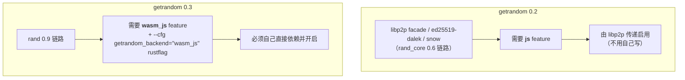

# wasm 工具链的坑（文档不会告诉你）

> **讲什么**：把 Rust 编到 `wasm32-unknown-unknown` 时，真正卡住你的往往不是代码，是工具链——
> macOS 上 ring 编不过、getrandom 报一个你没听过的错、wasm-bindgen 版本对不上、产物体积。
> **为什么重要**：这几个坑一个都不会出现在 crate 的 README 里，全靠踩。本篇把 SwarmDrop 实际
> 遇到并解决的记进来，配上仓库里真实的 `.cargo/config.toml` 与 `check-wasm.sh`。

## 坑 1：Apple clang 没有 WebAssembly backend

在 macOS 上第一次 `cargo build --target wasm32-unknown-unknown`，大概率撞上：

```
cargo:warning=error: unable to create target:
  'No available targets are compatible with triple "wasm32-unknown-unknown"'
error occurred in cc-rs: command did not execute successfully: clang ...
  "--target=wasm32-unknown-unknown" ... ring/crypto/curve25519/curve25519.c
```

**报错指向 ring，真凶是 clang。** Xcode CLT 自带的 Apple 系统 clang **不支持 wasm32 target**
（`clang --print-targets | grep -i wasm` 无输出）。而 `ring`（由 `tls-ring` / rustls 链路带进来）
在编 wasm 时会**实打实把 C 源码编一遍**（curve25519.c、aes_nohw.c…交给 cc crate），于是撞上
clang 的能力缺口。

**这个坑极易误判成"这个库编不了 wasm"**——其实换个带 wasm 后端的 clang 就好。解法是装
Homebrew LLVM 并指向它：

```sh
brew install llvm     # Homebrew 的 clang 带 wasm 后端
export CC_wasm32_unknown_unknown=/opt/homebrew/opt/llvm/bin/clang
export AR_wasm32_unknown_unknown=/opt/homebrew/opt/llvm/bin/llvm-ar
```

**但注意我们没有把它硬编码进 `.cargo/config.toml`。** 那会污染 Linux CI（Linux 发行版 clang
通常自带 wasm 后端，不需要也不该指向 `/opt/homebrew`）。所以处理放在脚本里按平台判断
——`scripts/check-wasm.sh`：

```bash
# macOS：Apple clang 无 wasm backend，ring 等 C 依赖编 wasm 必挂，需 Homebrew LLVM。
if [[ "$(uname)" == "Darwin" ]]; then
  BREW_LLVM="/opt/homebrew/opt/llvm/bin"
  if [[ -x "$BREW_LLVM/clang" ]]; then
    export CC_wasm32_unknown_unknown="$BREW_LLVM/clang"
    export AR_wasm32_unknown_unknown="$BREW_LLVM/llvm-ar"
  else
    echo "warn: Homebrew LLVM 未安装（brew install llvm）..." >&2
  fi
fi
```

`.cargo/config.toml` 里留了一段注释把这个决策讲清楚——"这里刻意不写 `[env]` 硬编码
Homebrew 路径——那会污染 Linux CI"。**教训：平台特定的工具链路径属于脚本/CI，不属于
提交进仓库的 `.cargo/config.toml`。**

## 坑 2：getrandom 双版本，各要各的开关

这是最容易"修好一个以为完事"的坑。依赖树里同时存在**两个 getrandom 大版本**，它们要 wasm
随机源的方式**完全不同**：



两个报错长得还不一样：

- 0.2 说 `you may need to enable the "js" feature`
- 0.3 说 `The "wasm_js" backend requires the wasm_js feature`

修好 0.3 的会以为完事了，结果 0.2 那条又冒出来。**正确做法是两处都配。** 0.3 那条在
`crates/net/Cargo.toml` 的 wasm 段直接依赖：

```toml
# crates/net/Cargo.toml（wasm 段）
getrandom = { version = "0.3", features = ["wasm_js"] }
```

**但光有 feature 还不够，0.3 还需要一个 rustflag**，配在 `.cargo/config.toml`：

```toml
# .cargo/config.toml
[target.wasm32-unknown-unknown]
# getrandom 0.3（rand 0.9 链路）需要显式 backend，缺了编译失败且报错不指向这里。
# getrandom 0.2 那条由 libp2p 传递的 `js` feature 负责，两者缺一不可。
rustflags = ['--cfg', 'getrandom_backend="wasm_js"']
```

注意配置注释里那句"**两者缺一不可**"——0.2 靠 libp2p 传递的 `js` feature，0.3 靠这个直接依赖 +
rustflag。少任何一半都编不过。

> ⚠️ 两个要点：① 这是 **rustflag 不是 feature**，不会随 `cargo add` 自动带过来，下游要自己在
> `.cargo/config.toml` 补。② "编过"只保证有 backend，**不保证运行时熵源正确**——密码学相关的
> 东西（`SecretKey::generate` 之类）上线前要在真实浏览器里验一遍，不能只凭编过就放行。

## 坑 3：wasm-bindgen crate 与 CLI 版本必须精确一致

`crates/web` 依赖 `wasm-bindgen = "0.2"`（生成 wasm 绑定的库），构建时还要用 `wasm-bindgen`
**CLI**（或 `wasm-pack` 内置的）把 `.wasm` 处理成可加载产物。**这两个版本不匹配会直接报错。**

两个实操建议：

1. **别让 wasm-pack 现场编 CLI**——它会 `cargo install --force wasm-bindgen-cli --version X`
   从源码编 walrus / wasmparser，慢且占盘（iroh 的经验里实测因盘满直接
   `No space left on device`）。用预编译二进制（`cargo binstall` 或 `taiki-e/install-action`）。
2. 库版本升级时 CLI 要同步动，两边锁在一起。

这条和 [03 篇](03-libp2p-master-pitfalls.md) 的 `wasm-bindgen-futures = "=0.4.58"` 是**两回事**：
那条是 libp2p-swarm 钉死的**运行时垫片库**版本（不跟就 cargo 无解），这条是**代码生成工具链**
的 crate/CLI 一致性。都在 wasm-bindgen 家族，但一个是依赖求解、一个是工具版本。

## 坑 4：workspace member 的 `[profile.release]` 被忽略

想给 wasm 产物开激进优化（`opt-level="z"` + `lto` + `strip`），自然会想在 `crates/web/Cargo.toml`
里写 `[profile.release]`。**它会被静默忽略，还带一条警告。**

Cargo 的 `[profile.*]` **只在 workspace root 生效**，成员 crate 的 profile 无效。iroh 官方例子的
绕法是把 profile 写进**该 crate 自己的 `.cargo/config.toml`**：

```toml
# 给单个 crate 定制 release profile 的唯一办法（iroh browser 例子的绕法）
[profile.release]
codegen-units = 1
strip = "symbols"
lto = true
opt-level = "z"
panic = 'abort'
```

代价是：从 workspace root 构建它时这份 profile 不生效——所以 wasm 产物要走该 crate 目录下的
构建入口（或 wasm-pack 指定该 crate）。**已有根 workspace 的 monorepo 加 wasm crate 一定会
正面撞上这个限制**，别指望根 profile 能覆盖到成员的 release 优化。

## 体积：一个可衡量的现实

wasm 产物要走网络下发，体积是真实成本。两个可对照的数字：

| 产物 | 裸 | gzip | 说明 |
|---|---|---|---|
| **net-web-smoke 冒烟壳** | 1836 KB | **598 KB** | 内核 + 双向 RPC echo，无传输栈（`spike/net-web-smoke/README.md` 实测）|
| iroh 冒烟壳（对照） | 2005 KB | 849 KB | iroh Endpoint + echo，同类基线 |
| **完整传输栈**（`crates/web`） | — | ~1142 KB | 加上 OPFS 落盘 + bao 逐块验证 + 完整 transfer 后 |

两条结论：

1. **冒烟壳 598 KB gzip 比 iroh 同类基线小约 30%**——libp2p 底层不比 iroh 胖。
2. **从冒烟壳到完整传输栈，gzip 差不多翻倍**——OPFS + bao + 完整 transfer 域是主要增量。
   首屏想瘦身，先砍 `tracing-subscriber` 的 `env-filter`（会拉进 regex）比砍功能划算。

> ⚠️ 关于 `wasm-opt -Os`：在**已经 strip + LTO** 的产物上，它对**压缩后**体积常常是负收益
> （raw 小约 9%，但 gzip/brotli 反而大约 4.5%，而真正走网络的是压缩后的字节）。iroh 三个例子
> 独立复现同一方向。**照抄 `wasm-opt` 前先自己实测再决定留不留，别默认它有用。**

## 小结

| 坑 | 现象 | 解法 | 落点 |
|---|---|---|---|
| Apple clang 无 wasm 后端 | 报错指向 ring 的 C 编译 | Homebrew LLVM + `CC/AR_wasm32` env | `check-wasm.sh`（按平台，不进 config.toml）|
| getrandom 双版本 | 两个不同报错，修一个还剩一个 | 0.2 靠 libp2p 传 `js`；0.3 直接依赖 `wasm_js` + rustflag | `Cargo.toml` + `.cargo/config.toml`，"两者缺一不可" |
| wasm-bindgen 版本 | crate 与 CLI 不匹配报错 | 锁版本、用预编译 CLI | 工具链一致性 |
| member profile 被忽略 | 优化不生效 + 警告 | profile 写进该 crate 的 `.cargo/config.toml` | monorepo 加 wasm crate 必撞 |
| 体积 | 完整栈 gzip 约翻倍 | 先砍 env-filter；`wasm-opt` 先实测 | 冒烟壳 598 KB / 完整栈 ~1142 KB |

一句话：**wasm 工具链的坑几乎全在"平台特定环境"这一层，代码本身没错。** 处理原则是——
平台特定的路径放脚本/CI（别污染 `.cargo/config.toml`），版本该钉死就精确钉死。

到这里，"怎么编过"已经讲全了。下一篇是全系列的题眼，也是最反直觉的一课：
[编过 ≠ 能用](05-what-compiles-isnt-what-runs.md)。
