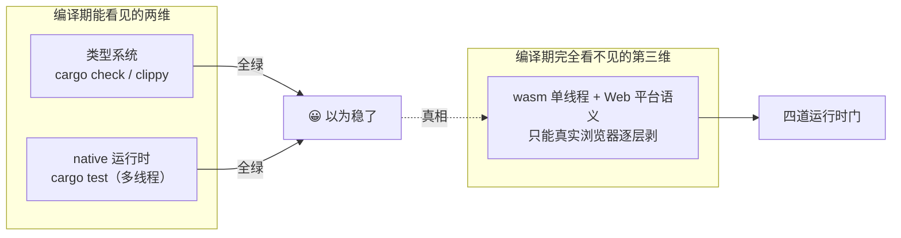

# 「编过 ≠ 能用」：wasm 的隐形门（总纲）

> **讲什么**：本系列前四篇解决了"怎么把一份 Rust 编到 wasm 且 `cargo check` 全绿"。这一篇要
> 泼一盆冷水——**编过、测过、控制面全通，都不保证 wasm 运行时正确**。wasm 单线程 + Web 平台
> 语义是编译期完全看不见的第三维，藏着四道运行时门。**为什么重要**：这是本系列最重要的一课，
> 也是通往 [wasm-debugging 系列](../wasm-debugging/)的桥。本篇是**总纲**——把四道门列全，每道一句话，
> 完整的十一轮调试复盘在调试系列。

## 一个真实的"全绿却不能用"

2026-07 把 `swarmdrop-transfer` 编到 wasm 时，状态是这样的：

- `cargo check --target wasm32-unknown-unknown` 五个 crate **全过**；
- `scripts/check-wasm.sh --clippy` **零 warning**；
- native `cargo test` 传输域测试 **全绿**；
- 浏览器里控制面（Endpoint 建立、RPC、offer 协商）**全通**。

看起来该收工了。结果——**浏览器里文件传输的数据面静默挂死**：不报错、不超时、进度条停在
某一块。libp2p-wasm.md 把这段经验总结成一句最扎心的话：

> **「native 测试全绿 + 五 crate wasm 编译全过 + 控制面全通」= 零保证。**

为什么？因为上面所有检查都在**编译期**或**多线程 native 运行时**里做，而 wasm 的坑全在
**单线程 wasm 运行时 + Web 平台语义**这一维——`cargo` 一个都看不见。

## 四道运行时门（总纲）

这是 SwarmDrop 在真实浏览器里**按踩到的顺序**剥出来的四道门。每道门都有一个共同特征：
**编译期零信息量**——cargo 全绿，只在运行时炸，且往往是"静默失败"这种最坏的失败模式。

### 门 1 — `std::time` 直接 panic

`std::time::Instant::now()` 在 wasm 上是 `time not implemented on this platform` 的**运行时
panic**（不是编译错）。transfer 里 5 处 `Instant` 曾把 prepare 直接炸掉。

**修**：一律换 `n0_future::time::Instant`（native = tokio，wasm = web_time）。
这正是 [02 篇](02-n0-future-tokio-shim.md) 讲 n0-future 时反复强调"time 必须换"的运行时后果——
不换的话编译毫无怨言，一跑就 panic。

### 门 2 — `split()` 的 reader half 在 wasm 不被唤醒

`futures::AsyncReadExt::split()` 把流拆成读写两半并发使用，在 wasm 单线程下 reader half
收到字节后**不唤醒读端**（native 多线程掩盖了这个问题）。

**判据**：能工作的路径（RPC / offer）全是**整条流顺序 read/write，从不 split**；唯独卡住的路径
split 了。**修**：去掉 split，顺序读写（本就不重叠时 split 纯属多余）。

### 门 3 — accepted 流跨任务 move 导致 lost-wakeup

一条流在任务 A（Router handler）读了首帧，再 move 给独立 spawn 的任务 B——B 首次 poll 前，
muxer 已经把后续帧的 wake 打给了 A 的旧 waker，B 注册新 waker 时事件已被消耗，发送端不再有
新字节 → **永久 Pending**。native 多线程时序掩盖。

**修**：**accepted 流不跨任务**——在读首帧的同一任务里 await 到流生命周期结束
（iroh 的"形状 A：在 accept 里跑完"）。这也是更干净的架构。

> 🔗 这和 [02 篇](02-n0-future-tokio-shim.md) 讲的 **JoinSet shim 缺陷是同一个家族**：spawn/move
> 出去的任务**确实被独立驱动了**（`spawn_local` 是真的）——不成立的是"独立驱动就万事大吉"这个
> 来自多线程 tokio 的直觉。wasm 单线程下，谁持有 waker、唤醒信号打给了谁，变成必须显式回答的问题
> （门 3 是 wake 打给了旧任务，JoinSet 是收割点没被重新唤醒——两者任务都在跑，丢的都是唤醒）。

### 门 4 — Web 平台 API 的 secure-context gating

`navigator.storage`（OPFS）/ `crypto.subtle` 在非 secure context（比如 `http://` + 私网 IP）下
**整个不存在**，web-sys 绑定打到 undefined 的 `JsFuture` **永久 pending**——不 resolve、不 reject，
最坏的失败模式。落盘就是这么静默挂死的。

**判据**：碰 Web 平台 API 的路径静默挂死，一句 `isSecureContext` 探针即可定位。**修**：构造时
预检 + 明确报错 + 每个 JS await 套 timeout 兜底。

> 🔗 secure context、OPFS、mixed content 与私网 IP 豁免这些 **Web 平台知识**的完整展开在
> [browser-platform 系列](../browser-platform/)——门 4 在本系列只是"运行时门"的一员，它的平台
> 背景在那边讲透。

## 四道门的共性：编译期看不见的第三维

把四道门并排看，规律很清楚：

| 门 | 编译期 | native test | 失败模式 | 根因维度 |
|---|---|---|---|---|
| 1 `std::time` | ✅ 过 | ✅ 过（native 有 time）| 运行时 panic | Web 平台无 `Instant` |
| 2 `split()` | ✅ 过 | ✅ 过（多线程掩盖）| 静默卡读端 | wasm 单线程唤醒 |
| 3 跨任务 waker | ✅ 过 | ✅ 过（多线程掩盖）| 永久 Pending | wasm 单线程 waker |
| 4 secure context | ✅ 过 | ✅ 过（native 无此 API）| 永久 pending | Web 平台 API gating |

**门 1 / 4 来自"Web 平台"这一维**（浏览器没有的东西 / 有条件才给的东西），**门 2 / 3 来自
"wasm 单线程"这一维**（多线程 tokio 掩盖的时序假设）。两维叠起来，就是 `cargo` 那两把尺子
（类型系统 + native 运行时）**结构上量不到**的地方。

### 为什么 native test 掩盖了门 2 / 3

门 2 / 3 都是**唤醒（wakeup）**问题，而唤醒的时序在多线程和单线程下截然不同。

- 多线程 tokio（native test）：读端和写端、任务 A 和任务 B 可能真的跑在**不同 OS 线程**上。
  即使某一侧的 waker 注册得"晚了一点"，另一个线程仍在推进，字节到达时几乎总有个还活着的
  waker 能把它唤醒——**时序竞态被并行度悄悄兜住了**。
- 单线程 wasm：只有一个执行流。如果 waker 在"错误的时刻"注册（reader half 还没轮到、
  任务 B 还没首次 poll），那一次唤醒就**永久丢了**，没有第二个线程来补救。

所以门 2 / 3 不是 wasm "引入"了 bug，而是**代码里本就存在的唤醒假设，被 native 的并行度长期
掩盖**。这也是为什么"加更多 native 测试"救不了它们——测试跑在多线程 runtime 上，那层掩盖
一直在。**只有真实浏览器的单线程执行能把它们暴露出来。**

记住这条心智模型比记住四道门更重要：

> **wasm 单线程 + Web 平台语义，是编译期完全看不见的第三维。绿灯只覆盖了前两维。**

## 这对工程流程意味着什么

1. **wasm check 是必要不充分条件**。`check-wasm.sh`（见 [01 篇](01-dual-target-engineering.md)）
   拦得住"引了 native-only 依赖"，拦不住上面任何一道运行时门——四道门在 `cargo check` 眼里
   都是合法代码。它是门禁的下限，不是正确性的保证。**把它当成"绿了就能上线"是本篇要破的
   最大错觉。**
2. **真实浏览器实测不可省**。四道门只能在真实浏览器里逐层剥——`wasm-bindgen-test --headless`
   跑数据面回归、`evaluate` 直插平台层探针（门 4 就是一句 `isSecureContext` 定位的）。
3. **穷举锚点 > 逐个假设**。卡点稳定后在可疑路径每个 await 前后铺日志锚点，"最后一条锚点"
   = 精确病灶。逐个假设验证只会来回拉扯。
4. **每层修复让卡点前移一步**（offer 不通 → 首帧拉不到 → 拉到首帧 → 三块全过 → finalize）
   是正确收敛的信号。
5. **对照实验切分维度**：小文件 vs 大文件切"帧大小/流控假设"、换 origin 切"secure context"、
   native e2e vs 浏览器切"wasm 特有 vs 逻辑错误"、浏览器探针直插平台层切"环境 vs 代码"。
   每一刀都把"编译期看不见的第三维"切成可观测的一小块。

## 小结

- **编过 ≠ 能用**：`cargo check` / `clippy` / `check-wasm` 全绿 + native test 全绿 + 控制面全通，
  对 wasm 运行时正确性**零保证**。
- **四道门**：`std::time` panic（门 1）、`split()` 唤醒丢失（门 2）、跨任务 waker 丢失（门 3）、
  secure context gating（门 4）。门 1/4 来自 Web 平台维，门 2/3 来自 wasm 单线程维。
- **核心心智**：wasm 单线程 + Web 平台语义是编译期看不见的第三维，绿灯只覆盖前两维。
- **本篇是总纲**。四道门逐层剥开的完整十一轮调试复盘 + 方法论在
  [wasm-debugging 系列](../wasm-debugging/)；门 4 的 Web 平台背景在
  [browser-platform 系列](../browser-platform/)。

至此本系列结束——从"怎么编过双 target"讲到"编过之后为什么还可能不能用"。回到起点那句话
（[00 篇](00-single-core-package.md)）：**单核心包的终点不是绿灯，是浏览器里逐字节一致。**
