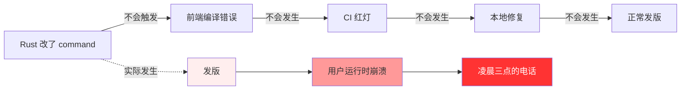
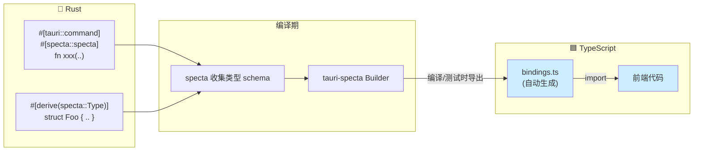
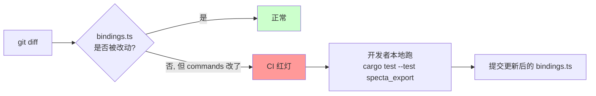
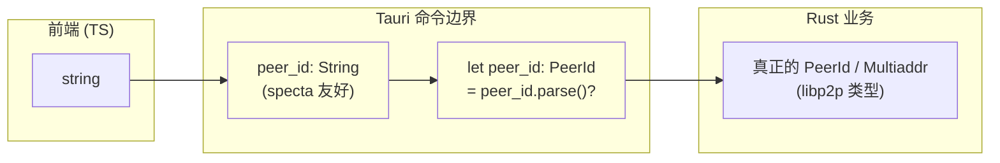
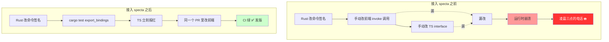

# 再见,`invoke("xxx", { ??? })` —— 用 tauri-specta 给 Tauri 项目装上类型雷达

> 一篇关于 `tauri-specta` 的安利+教程。
> 适用对象：任何用 Tauri 写过超过三个 IPC 命令、并且至少凌晨被 `undefined` 叫醒过一次的工程师。

---

## 〇、一个发生在凌晨三点的故事

你正在写一个 Tauri 项目，前端 React，后端 Rust。

上线前一晚，你信心满满地把发送文件的命令从这样：

```rust
#[tauri::command]
async fn start_send(prepared_id: String, peer_id: String) -> AppResult<...> { ... }
```

改成了这样（加了一个新参数 `selected_file_ids`，因为产品想支持"勾选其中几个发送"）：

```rust
#[tauri::command]
async fn start_send(
    prepared_id: String,
    peer_id: String,
    peer_name: String,                 // ← 新增
    selected_file_ids: Vec<i64>,       // ← 新增
) -> AppResult<...> { ... }
```

`cargo build` —— 绿色。
`cargo test` —— 绿色。
`pnpm tsc` —— 绿色。
打包，发版，睡觉。

凌晨三点，电话响了。用户反馈：**点了"发送"，界面卡住，啥反应没有**。

你拉开电脑，打开 devtools，控制台里赫然写着：

```
Error: invalid type: null, expected a string at line 1 column 38
```

你查了二十分钟，终于在前端某个角落里翻到了那行字：

```ts
await invoke("start_send", {
  preparedId: prep.id,
  peerId: peer.id,
  // peerName 没传，selectedFileIds 也没传
});
```

—— Rust 改了，TypeScript 没跟上，而 **没有任何工具告诉你**。

这就是 Tauri 原生 IPC 的"类型黑洞"问题。今天我们要请出的主角，就是那个让"凌晨三点的电话"再也不会响的家伙：

# **tauri-specta**

---

## 一、为什么 Tauri 原生 IPC 是个"类型黑洞"

我们先看一下原生 `invoke` 长什么样：

```ts
import { invoke } from "@tauri-apps/api/core";

const result = await invoke("some_command", { foo: "bar", baz: 42 });
//                  ^^^^^^^^^^^^^
//                  字符串
//                                  ^^^^^^^^^^^^^^^^^^^^^^^^^^^^^^^^^
//                                  随便传，TS 不查
```

这一行代码里，TypeScript 类型系统能告诉你的事情是：

- `invoke` 接受一个字符串
- 第二个参数是个对象
- 返回 `Promise<unknown>`

**它无法告诉你**：

- 这个命令在 Rust 端**存不存在**
- 参数对不对（少了？多了？类型错了？）
- 返回值是什么形状
- 命令会抛出哪些错误

你写的每一个 `invoke` 调用，本质上都是一次**祈祷**。



更糟的是，事件（`emit` / `listen`）也是同样的字符串字符串字符串——前端不知道你 emit 了什么，后端不知道前端会监听什么。

> **类型黑洞总结**：Rust ↔ TypeScript 之间只有一根细细的字符串管道，
> 类型信息在中间被全部抽干，所有"是否对得上"的验证都被推迟到了**生产环境的运行时**。

---

## 二、tauri-specta 是干什么的

一句话：

> **把 Rust 的类型信息，从你写 `#[tauri::command]` 的那一刻起，原封不动地搬到前端的 TypeScript 里。**

它干的事情可以用一张图说清：



它由三个 crate 组成，分工很清晰：

| Crate | 作用 |
|-------|------|
| `specta` | 通过 `#[derive(specta::Type)]` 收集**类型 schema**（结构体/枚举的字段、命名、序列化形式） |
| `specta-typescript` | 把 schema **翻译**成 TypeScript 类型字符串 |
| `tauri-specta` | 把上面两个粘起来，再加上 `#[specta::specta]` 收集 **Tauri 命令签名**，生成可调用的 `commands` 对象 |

效果就是：你写了下面这种 Rust：

```rust
#[derive(Debug, Clone, Serialize, Deserialize, specta::Type)]
#[serde(rename_all = "camelCase")]
pub struct DeviceInfo {
    pub peer_id: String,
    pub code_record: ShareCodeRecord,
}

#[tauri::command]
#[specta::specta]
pub async fn get_device_info(
    net: State<'_, NetManagerState>,
    code: String,
) -> AppResult<DeviceInfo> { ... }
```

前端会自动得到这个：

```ts
// bindings.ts (auto-generated)
export type DeviceInfo = {
  peerId: string;
  codeRecord: ShareCodeRecord;
};

export const commands = {
  getDeviceInfo: (code: string) =>
    __TAURI_INVOKE<DeviceInfo>("get_device_info", { code }),
  // ...
};
```

注意几个细节：

- 函数名自动从 `snake_case` 改成 `camelCase`
- 字段名也按 `serde` 的 `rename_all` 改成 `camelCase`
- 返回类型 `DeviceInfo` 是**强类型**的，不是 `unknown`
- `State<'_, NetManagerState>` 这种 Tauri 注入参数自动**从签名里剔除**

前端写代码的体验变成这样：

```ts
import { commands } from "@/lib/bindings";

const info = await commands.getDeviceInfo(code);
//    ^? DeviceInfo
info.peerId    // ✅ 自动补全
info.peerName  // ❌ 编译错误：DeviceInfo 没有这个字段
```

—— **这才是一个 2026 年的项目应该有的开发体验。**

---

## 三、五分钟接入：跟着 SwarmDrop 项目从零做一遍

下面所有代码片段都来自 SwarmDrop 本仓库的真实集成（[src-tauri/src/setup.rs](src-tauri/src/setup.rs)），可以直接抄。

### 3.1 加依赖

`src-tauri/Cargo.toml`：

```toml
[dependencies]
specta             = { version = "=2.0.0-rc.25", features = ["derive", "uuid", "serde_json"] }
specta-typescript  = "=0.0.12"
tauri-specta       = { version = "=2.0.0-rc.25", features = ["typescript"] }
```

> 注意 specta v2 还在 `rc` 阶段，**版本一定要锁死**（`=2.0.0-rc.25` 这种写法），
> 否则升级时 `tauri-specta` 和 `specta` 的版本对不上会编译炸。

### 3.2 给所有命令加两个属性

凡是想被前端调用的命令，都加上 `#[specta::specta]`：

```rust
#[tauri::command]
#[specta::specta]                   // ← 就加这一行
pub async fn generate_pairing_code(
    net: State<'_, NetManagerState>,
    expires_in_secs: Option<u64>,
) -> AppResult<PairingCodeInfo> {
    // ...
}
```

### 3.3 给所有"跨边界类型"加 derive

凡是会作为命令的参数 / 返回值出现的自定义类型，都加上 `specta::Type`：

```rust
#[derive(Debug, Clone, Serialize, Deserialize, specta::Type)]
#[serde(rename_all = "camelCase")]
pub struct DeviceInfo {
    pub peer_id: String,
    pub code_record: ShareCodeRecord,
}
```

枚举同理：

```rust
#[derive(Debug, Clone, Serialize, Deserialize, specta::Type)]
#[serde(tag = "type", rename_all = "camelCase")]
pub enum PairingMethod {
    Code { code: String },
    Manual,
}
```

这里有个**传染性原则**：`DeviceInfo` derive 了 `Type`，那它字段里的 `ShareCodeRecord` 也得 derive `Type`；后者字段里的所有自定义类型也得 derive。**整条链路必须打通**，否则编译报错。

### 3.4 集中注册命令

在 `setup.rs` 里建一个统一的 `SpectaBuilder`：

```rust
use tauri_specta::{collect_commands, Builder as SpectaBuilder, ErrorHandlingMode};

pub fn specta_builder() -> SpectaBuilder<Wry> {
    SpectaBuilder::<Wry>::new()
        .dangerously_cast_bigints_to_number()     // 后面会讲为什么
        .error_handling(ErrorHandlingMode::Throw) // 后面也会讲
        .commands(collect_commands![
            commands::generate_pairing_code,
            commands::get_device_info,
            commands::request_pairing,
            // ... 你的其它命令
        ])
}
```

### 3.5 接入 Tauri Builder

```rust
pub fn build_app() -> Builder<Wry> {
    let specta = specta_builder();

    // debug build 时顺手把 bindings.ts 导出
    #[cfg(debug_assertions)]
    {
        use specta_typescript::Typescript;
        let _ = specta.export(
            Typescript::default()
                .header("// AUTO-GENERATED by tauri-specta. DO NOT EDIT.\n"),
            "../src/lib/bindings.ts",
        );
    }

    Builder::default()
        // 原来是 .invoke_handler(tauri::generate_handler![..])
        // 现在改成 ↓
        .invoke_handler(specta.invoke_handler())
        .setup(move |app| {
            specta.mount_events(app);   // 如果用到 typed events
            // ... 你原来的 setup 逻辑
            Ok(())
        })
}
```

### 3.6 前端调用

```ts
import { commands } from "@/lib/bindings";

const info = await commands.getDeviceInfo("123456");
//    ^? DeviceInfo

await commands.requestPairing(peerId, { type: "code", code: "..." }, null);
//                            ^^^^^^^ string
//                                    ^^^^^^^^^^^^^^^^^^^^^^^^^^^^^^ PairingMethod (tagged union)
```

完事。整个改造工作量基本只是：

- 给命令加一行 `#[specta::specta]`
- 给类型加一个 `specta::Type` derive
- 把 `invoke_handler` 那一行换成 specta 的版本

---

## 四、四个一定要知道的实战技巧

教程到这里就能跑通了，但下面这几个点是踩过坑之后才会装上的"消音器"。

### 技巧 1：`u64` / `i64` 默认会变成 `bigint`

specta 默认会把 Rust 的 64 位整数翻译成 TS 的 `bigint`，这通常会让前端**写起来非常痛苦**：

```ts
// 默认行为
const n: bigint = await commands.getFileSize();
const total = n + 1;  // ❌ Operator '+' cannot be applied to types 'bigint' and 'number'
```

如果你确认自己所有 `u64` 字段都在 JS 安全整数范围内（< 2^53，约 9PB），打开这个开关：

```rust
SpectaBuilder::<Wry>::new()
    .dangerously_cast_bigints_to_number()   // ← 加这个
```

之后 `u64` / `i64` / `usize` 全部变成 TS 的 `number`，前端体验和原生 JS 一致。
名字里的 `dangerously` 是提醒：**这是一个你需要为自己负责的选择**。

### 技巧 2：错误处理：Throw 还是 Result？

specta 提供两种错误处理模式：

```rust
.error_handling(ErrorHandlingMode::Throw)   // 默认
// 或
.error_handling(ErrorHandlingMode::Result)
```

差别在前端：

```ts
// Throw 模式 —— 直接抛
try {
  const info = await commands.getDeviceInfo("xxx");
} catch (e) {
  // e 的类型就是你 AppError 映射的形状
}

// Result 模式 —— 返回 tuple
const r = await commands.getDeviceInfo("xxx");
if (r.status === "error") {
  // r.error 是错误
} else {
  // r.data 是数据
}
```

**老项目从原生 `invoke` 迁移过来，选 `Throw`**，原来的 `try/catch` 一行都不用改。
新项目想要 Rust-style 强制错误处理，选 `Result`。

### 技巧 3：让 `cargo test` 强制导出 bindings（CI 友好）

`build_app()` 里的 `export` 只在 `tauri dev` / `tauri build` 真正跑起来时才会触发。
意味着：CI 里如果只跑 `cargo build`，bindings 不会被刷新。

SwarmDrop 的做法是把导出做成一个**测试**（[src-tauri/tests/specta_export.rs](src-tauri/tests/specta_export.rs)）：

```rust
use specta_typescript::Typescript;

#[test]
fn export_bindings() {
    let builder = swarmdrop_lib::specta_builder();
    builder
        .export(
            Typescript::default()
                .header("// AUTO-GENERATED by tauri-specta. DO NOT EDIT.\n"),
            "../src/lib/bindings.ts",
        )
        .expect("Failed to export specta TypeScript bindings");
}
```

```bash
cargo test -p swarmdrop --test specta_export
```

这样在 CI 里加一步：



就能保证 **bindings 永远不漂移**。这一招对所有 `cargo test` 都能跑的人来说，是零成本接入。

### 技巧 4：第三方类型不支持 `specta::Type` 怎么办？

这是最常见的卡点。比如 libp2p 的 `PeerId`、`Multiaddr` —— 这些是第三方库的类型，你**无法**给它们加 `derive`。

解决思路：**在边界处把它们 toString**。SwarmDrop 里就是这么做的（[src-tauri/src/commands/pairing.rs](src-tauri/src/commands/pairing.rs)）：

```rust
#[tauri::command]
#[specta::specta]
pub async fn request_pairing(
    app: AppHandle,
    net: State<'_, NetManagerState>,
    peer_id: String,                  // ← 不是 PeerId，是 String
    method: PairingMethod,
    addrs: Option<Vec<String>>,       // ← 不是 Vec<Multiaddr>，是 Vec<String>
) -> AppResult<PairingResponse> {
    // 进函数第一件事就是 parse 回真正的类型
    let peer_id: PeerId = peer_id.parse()?;
    let addrs = addrs.map(|list|
        list.into_iter().map(|s| s.parse::<Multiaddr>()).collect()
    )?;
    // ... 继续用 PeerId / Multiaddr
}
```

代价是多写几行 `parse()`，收益是**整个 IPC 边界保持类型自闭包**，不用为第三方库做特殊适配。



---

## 五、还有一招：类型化的事件

Tauri 的 `emit` / `listen` 也是字符串地狱：

```rust
app.emit("paired-device-added", &info);   // 后端
```

```ts
listen<???>("paired-device-added", e => { ... });  // 前端，payload 类型靠猜
```

tauri-specta 同样可以收集事件类型。SwarmDrop 现在 13 个事件全部走 typed 化的路（[src-tauri/src/events.rs](../../src-tauri/src/events.rs)），下面是真实代码。

**第一步：给 `tauri-specta` 加 `derive` feature**——不加则下面的 `Event` derive 宏不可见，会报"trait is imported here, but it is only a trait"。

```toml
tauri-specta = { version = "=2.0.0-rc.25", features = ["typescript", "derive"] }
```

**第二步：定义事件 wrapper struct**。SwarmDrop 用 newtype + `serde(transparent)` 模式，wire payload 形状与原 payload 完全一致，前端 listener 无感升级：

```rust
use serde::Serialize;

#[derive(Debug, Clone, Serialize, specta::Type, tauri_specta::Event)]
#[serde(transparent)]
pub struct PairedDeviceAdded(pub PairedDeviceInfo);

#[derive(Debug, Clone, Serialize, specta::Type, tauri_specta::Event)]
#[serde(transparent)]
pub struct TransferProgress(pub TransferProgressEvent);

// ... 一共 13 个
```

注意 derive 必须写完整路径 `tauri_specta::Event`——因为 `use tauri_specta::Event;` 会被解析为 trait import，遮蔽同名 derive macro。

**第三步：注册到 SpectaBuilder**：

```rust
SpectaBuilder::<Wry>::new()
    .commands(collect_commands![...])
    .events(collect_events![
        events::PairedDeviceAdded,
        events::TransferProgress,
        // ... 13 个
    ])
```

**第四步：setup hook 里挂载事件注册表**：

```rust
.setup(move |app| {
    specta.mount_events(app);    // 没有这一行 emit 时会 panic
    // ... 其它 setup 逻辑
    Ok(())
})
```

**后端发事件**：

```rust
use tauri_specta::Event as _;

PairedDeviceAdded(info).emit(&app)?;   // 强类型，再也不写字符串
TransferProgress(event).emit(&self.app)?;
```

**前端监听**：

```ts
import { events } from "@/lib/bindings";

events.pairedDeviceAdded.listen(e => {
  e.payload;  // ✅ PairedDeviceInfo，自动补全
});

events.transferProgress.listen(e => {
  e.payload.totalBytes;  // ✅ number
  e.payload.direction;   // ✅ "send" | "receive" | "unknown"
});
```

bindings.ts 生成的 events 对象长这样：

```ts
export const events = {
    pairedDeviceAdded: makeEvent<PairedDeviceAdded>("paired-device-added"),
    transferProgress: makeEvent<TransferProgress>("transfer-progress"),
    // ... 13 个
};
```

注意 wire 事件名（`"paired-device-added"`）是 tauri-specta **自动从 PascalCase struct 名转 kebab-case** 得到的——前端属性名是 camelCase。整套命名转换零配置，并且与"以前手写 `"paired-device-added"` 字符串常量"的 wire 协议 100% 兼容。

### 接入过程中踩过的两个坑

**坑 1：千万别在 wrapper struct 上加 `#[serde(rename = "kebab-case")]`**。

第一次接入时我误以为得手动指定 wire 事件名，加了 `#[serde(rename = "transfer-progress")]`，结果 specta 把这个字符串当 TS type name 拿去生成代码，报错：

```text
Attempted to export "swarmdrop_lib::events::transfer-progress" but was unable to
due to name "transfer-progress" containing an invalid character.
```

原因是 specta 2.0 的 type name 解析直接读 Rust ident，并把 `serde(rename)` 当 type-level 重命名应用，而 TS 标识符不允许带 `-`。**直接用默认即可**——struct 名 PascalCase，tauri-specta 自动转 kebab-case wire 名，皆大欢喜。

**坑 2：全局类型空间不允许同名**。

SwarmDrop 有两个 `TransferDirection`——一个在 core（运行时方向，含 `Unknown`），一个在 `entity`（DB 层，只有 `Send`/`Receive`）。原本只有命令路径会收集类型，DB 实体那个先到注册表；接入 events 后，core 的也通过 event payload 链路被注册，撞名：

```text
Detected multiple types with the same name: "TransferDirection"
```

specta 全局只认 type name 不认 module path。`#[specta(rename)]` 在 container 上已被废弃，`#[serde(rename)]` 又只影响字段层。**唯一解就是真的改 Rust 名字**：把 core 那个改成 `RuntimeTransferDirection`（语义上确实是"运行时方向"），entity 那个保留 `TransferDirection`。这种"事件接入逼出来的命名收敛"反而是个意外的整理收益。

---

## 六、它适合谁

**几乎所有 Tauri 项目都应该用。** 我能想到的"不用"的理由只有：

1. 你的项目就只有一两个 `invoke`，且永远不会再加（真的吗？）
2. 你前端不用 TypeScript（…那是另一个话题）
3. 你拒绝接受 `rc` 版本的库（公平，但 specta 已经 `rc.25` 了，相当稳定）

而它带来的好处可以用一张对比图收尾：



**核心理念**：让 Rust 成为整个应用的**单一类型事实源（single source of truth）**。前端不再"维护"类型，而是"消费"类型。每一次 `git push`，Rust 和 TypeScript 都被同一根绳子拴在一起向前走。

凌晨三点的电话，可以不响。

---

## 附录：本文涉及到的关键文件

- 集中装配：[src-tauri/src/setup.rs](../../src-tauri/src/setup.rs)
- 命令示例：[src-tauri/src/commands/pairing.rs](../../src-tauri/src/commands/pairing.rs)
- 事件定义：[src-tauri/src/events.rs](../../src-tauri/src/events.rs)
- 事件分发：[src-tauri/src/host/event_bus.rs](../../src-tauri/src/host/event_bus.rs)
- 错误映射：[src-tauri/src/error.rs](../../src-tauri/src/error.rs)
- 强制导出测试：[src-tauri/tests/specta_export.rs](../../src-tauri/tests/specta_export.rs)
- 生成产物：[src/lib/bindings.ts](../../src/lib/bindings.ts)（请勿手改）

> 改造后 SwarmDrop 前端不再有 `src/commands/` 目录——所有 IPC 调用走
> `commands.xxx()`，所有事件走 `events.xxx.listen()`，全部来自单一源
> `@/lib/bindings`。前端补充类型（业务别名 / 聚合类型 / `PeerId` 等
> string alias）收拢在 [src/lib/types.ts](../../src/lib/types.ts)。

## 延伸阅读

- tauri-specta GitHub：https://github.com/specta-rs/tauri-specta
- specta 主仓库：https://github.com/specta-rs/specta
- Tauri v2 IPC 文档：https://v2.tauri.app/develop/calling-rust/
