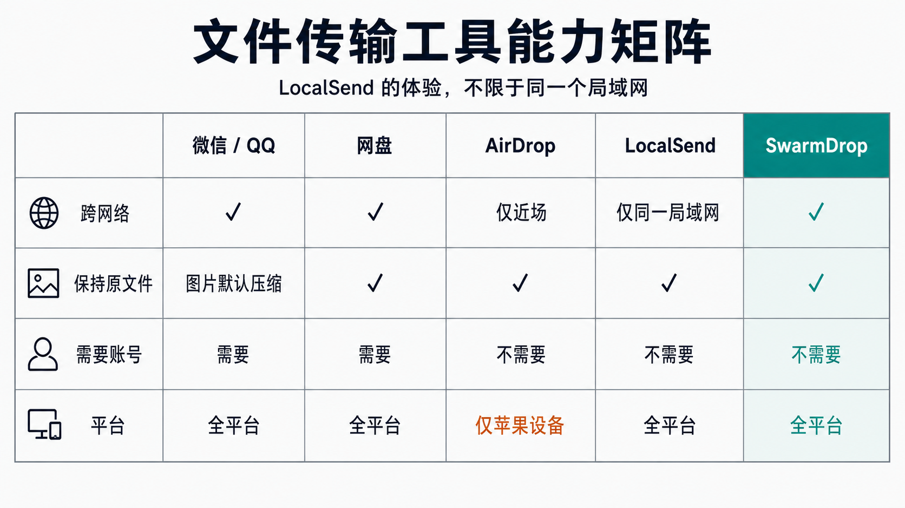
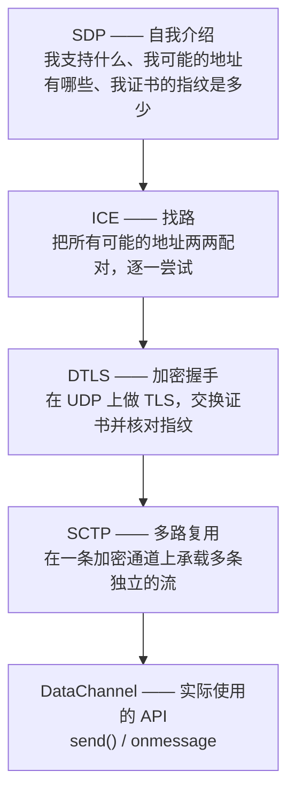
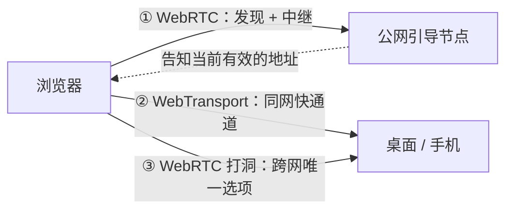
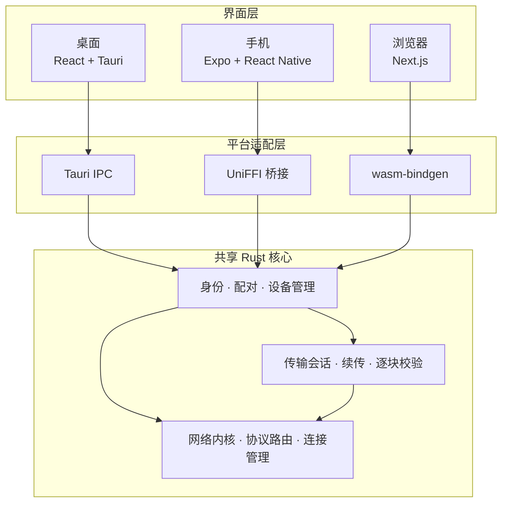
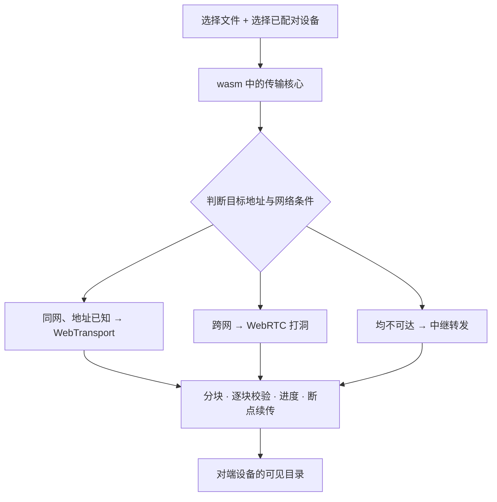

# 浏览器不能监听端口、没有文件系统，凭什么能点对点传文件？

> 打开一个网页，无需安装任何软件，就能把文件直接传到自己的手机上，中间不经过任何服务器。
> 这篇讲这件事在浏览器里是如何实现的，并把 **WebRTC**、**WebTransport**、**OPFS**
> 这三样东西讲清楚。
> 主角是 SwarmDrop，上一篇是 [一套 Rust 核心，跑通 Tauri + React Native](https://juejin.cn/post/7639930076302770216)。


先描述一个场景。

你在公司电脑上，想把手机里刚拍的几十张照片取出来。微信传输会压缩，网盘需要登录且限速，AirDrop 只在苹果设备之间可用，手边没有数据线——更重要的是，这台电脑不是你的，你不便在上面安装任何软件。

现在的答案是：**打开一个网页**。

<https://swarm-apps.github.io/SwarmDrop/app>

页面本身是静态的，托管在 GitHub Pages 上。但打开之后，这个标签页就成为你设备网络里的一个正常节点——可以和手机配对、接收文件、发送文件，数据走点对点通道，**中间没有任何一台服务器能接触到你的明文**。

## 先介绍一下 SwarmDrop

用一句话概括：**LocalSend 的体验，但不限于同一个局域网。**

| | 跨网络 | 保持原文件 | 需要账号 | 平台 |
|---|---|---|---|---|
| 微信 / QQ | ✅ | 图片默认压缩 | 需要 | 全平台 |
| 网盘 | ✅ | ✅ | 需要 | 全平台 |
| AirDrop | 仅近场 | ✅ | 不需要 | 仅苹果设备 |
| LocalSend | 仅同一局域网 | ✅ | 不需要 | 全平台 |
| **SwarmDrop** | **✅** | **✅** | **不需要** | **全平台** |



没有账号系统，没有中心服务器，也没有"上传—下载"这一步。两台设备**扫码配对一次**，之后便长期互相识别：处于同一个 Wi-Fi 下走局域网直连，不在同一网络则自动打洞或经中继转发，路径由程序自动选择。

传输全程端到端加密，中继节点只经手它没有密钥的密文。文件不限大小，不压缩，不限速，中断后可续传。

**目前有三个端：**

| 端 | 状态 |
|---|---|
| **桌面** | macOS / Windows / Linux，均可直接下载 |
| **手机** | Android 提供安装包；iOS 受签名限制，目前只能自行构建 |
| **浏览器** | 打开网页即可使用，无需安装（iOS 用户可以直接用这个） |

下载都在这一页：<https://swarm-apps.github.io/SwarmDrop/>

**典型使用场景：**

- 手机拍摄的视频导入电脑剪辑，不希望被压缩；
- 公司电脑与家中电脑之间互传文件，不想经过网盘；
- Android 手机 + Windows 电脑，AirDrop 覆盖不到的设备组合；
- 临时使用他人的电脑，无法安装软件，**打开网页即可收发**；
- 桌面端内嵌了一个 MCP server，可以让 AI Agent 把文件送到另一台设备，或检索已接收的内容。

## 顺便交代一下 SwarmNote

从上一篇过来的读者可能会问：那个项目呢？

**SwarmNote 我不打算继续维护了。**

原因很简单：笔记这个赛道做的人太多了。从 Obsidian、Logseq 到各家云笔记，再到每周都有新的"本地优先 + 端到端加密"方案出现，我很难说服自己，我做的那个版本能给用户带来别人给不了的东西。技术上它没有问题，该跑通的都跑通了。但**技术跑通和产品值得做，是两件事**。

个人精力有限，与其两个项目都停在半成品状态，不如把一个做到真正可用。

不过上一篇的结论并没有失效——恰恰相反，正因为当初把核心与平台切分清楚，这次加浏览器端**没有重写任何一行业务逻辑**：传输状态机、配对协议、分块校验，浏览器里跑的和桌面上跑的是字面同一份代码。

以上是产品和背景。下面进入这篇文章真正要讲的部分。

上一篇讲的是如何让桌面端和手机共用一份 Rust 核心，这一篇讲的是：**如何让浏览器也加入进来。**

这件事之所以值得单独写一篇，是因为**浏览器本身并不具备做这件事的条件**。

---

## 一、浏览器被绑住的那三只手

桌面程序和手机 App 有三件事做起来天经地义：

1. **开一个端口，等待别人连入。**
2. **打开一个文件，跳到第 12345 个字节，写入一段数据。**
3. **自行决定用 TCP 还是 UDP，连接哪个 IP、哪个端口。**

这三件事，浏览器**一件都做不到**。

- **它没有 `listen`。** 网页无法"在 8080 端口等待连接"，只能主动向外发起，不能被动接受。
- **它没有文件系统。** 编译到 wasm 之后连 libc 都没有，`File::open` 这类接口并不存在。
- **它不能开 socket。** 可用的联网能力，只有浏览器允许的那几个 API。

可以这样类比：桌面和手机像有独立门牌号的沿街商铺，谁都能找上门；浏览器像写字楼里一间只能从旋转门出去的办公室——能出去见人，别人进不来，出门还只能走保安指定的几条路。

所以问题不是"如何写一个 Web 界面"，而是：

> 如何让这间"只能出门"的办公室，与沿街商铺**平等地**做生意？

这三条里，"不能 listen"和"不能开 socket"是同一个问题的两面，后面会合在一起讲。所以全文的主线是三段：

| 约束 | 解法 | 对应章节 |
|---|---|---|
| 联不上另一台设备 | WebRTC，以及后来补上的 WebTransport | 二 ~ 五 |
| 没有地方写文件 | OPFS | 六 |
| 还有一道看不见的门 | secure context | 七 |

第三条不在上面那份"三只手"清单里，因为它在写代码之前根本看不见——这也正是它值得单独讲的原因。

---

## 二、联网：浏览器只有三扇门

浏览器提供给 JavaScript 的联网能力只有三样：

| API | 能做什么 | 能否连接"另一台设备" |
|---|---|---|
| `fetch` | 发送 HTTP 请求 | 不能，只能连服务器 |
| `WebSocket` | 建立一条长连接 | 不能，只能连服务器 |
| `RTCPeerConnection` | 建立一条点对点通道 | **能** |

前两者有一个共同前提：**对端必须是一台有域名、有 CA 证书的服务器**。无法用 `fetch` 去连接另一台个人电脑。

所以从第一行代码开始，这件事就绑定在了第三样上——**WebRTC**。

---

## 三、WebRTC 到底是什么

这一节是科普。如果你只在腾讯会议、Google Meet 的语境里听说过 WebRTC，那么对它的印象大概率是偏的。

### 名字带来的误解

WebRTC 全称 Web Real-Time Communication。因为视频通话是它最知名的应用，很多人以为它是一个"音视频 API"。

实际上**音视频只是它顺带支持的一种载荷**，它真正解决的是一个更底层的问题：

> 两台都在路由器后面、都没有公网地址的机器，如何直接互相发送数据包？

这个问题叫 **NAT 穿透**，才是 WebRTC 的立身之本。

### 为什么你的电脑"没有地址"

家用路由器后面的设备，IP 通常是 `192.168.1.7` 这种形式。全世界有数以亿计的设备使用同一个 IP，它在公网上**没有意义**，外部无法通过它定位到你。

你能上网，是因为路由器做了地址转换（NAT）：向外发起连接时，它临时分配一个"公网 IP + 端口"作为对外身份，返回的数据包按这份映射转回给你。

问题在于，这份映射**只对你主动联系过的对象生效**。外部凭空向你的路由器发包时，路由器没有对应的映射记录，会直接丢弃。

于是两台都在 NAT 后面的设备想直连，就像两个人都住在需要刷卡的门禁小区里，谁都进不去对方的门。

### 它如何解决：四个层次

WebRTC 不是单个 API，而是一整套协议栈的组合。拆开来看有四层，各管一段：



**SDP** 是一份自我介绍，纯文本，内容包括"我支持哪些编解码、我可能的地址有哪些、我的证书指纹是多少"。双方交换之后，才知道该如何与对方通信。

**ICE** 负责找路。设备先收集一批"候选地址"：本机局域网地址、通过 STUN 服务器查到的公网映射地址，以及中继地址。双方交换候选列表后**两两配对逐一尝试**，选用最先连通的一对。

所谓"**打洞**"就发生在这一步，机制并不复杂：双方**同时**向对方的公网映射地址发包。A 发出的包在 B 侧被丢弃，但它在 A 自己的路由器上**留下了一条映射记录**；随后 B 的包到达时，A 的路由器发现这个地址刚刚联系过，便予以放行。双方同时进行，通路即建立。

**DTLS** 是运行在 UDP 上的 TLS，负责加密，同时核对"对端确实持有介绍中声明的那张证书"。

**SCTP** 在加密通道之上实现多路复用，可以开启多条互不阻塞的独立流。JS 中使用的 `DataChannel`，就是 SCTP 的一条流。

### 它最反直觉的一点

**WebRTC 不负责双方如何交换那份"自我介绍"。**

ICE 需要交换候选地址、DTLS 需要交换证书指纹，这些都写在 SDP 里。但两台机器在建立连接**之前**无法通信，那么 SDP 如何送达？

WebRTC 的回答是：**这不属于它的职责范围。** 这条"自行解决"的通道称为**信令（signaling）**。

视频会议软件用自己的服务器做信令。SwarmDrop 没有服务器，用的是**已经建立的中继连接**：浏览器先通过公网上的引导节点建立一条控制通道，SDP 和候选地址经这条通道传递；直连建立后，数据不再经过它。

这也顺带解释了一个常见困惑：**为什么"无服务器"的 P2P 应用，实际上仍然需要一台公网机器？**

因为它不接触数据，但需要帮助双方建立联系。这两件事可以分开——中继只能看到它没有密钥的密文。

### 补充一点：它并不好用

封装得越完整的东西，底层漏出来的问题往往越多。我们最终没有使用现成实现，自己写了一套传输层，过程中向几个上游项目提交了一些补丁。

细节篇幅所限不展开，只留一条通用的教训：

> **在异步流水线架构里，`send()` 返回 `Ok` 不代表数据已经发出。**

我们遇到过这样一个问题：`send` 返回成功，对端没有收到任何数据，两侧均无报错。定位之后发现，`send` 检查的条件与真正决定成败的条件并不是同一个，而真正失败的那一层只记录了一行 `warn!` 日志便将错误丢弃。

**被 `warn` 掉的错误，可能是调用方感知问题的唯一机会。** 编写库代码时尤其需要注意这一点。

---

## 四、能传，但是慢——于是有了第二扇门

Web 端第一版只有 WebRTC 一条路，功能上是完整的：配对、发送、接收、断点续传都可以正常工作。

但**传输大文件时问题就暴露了**。

同一个 Wi-Fi 下，手机与桌面之间能稳定跑到十几 MB/s，浏览器这条路明显慢一截。更明显的问题是**速率不稳定**——同样的文件、同样的网络，这一次很顺畅，下一次就慢到需要重来。

后来做了一组对照测试，把主观感受变成了数字：同一台机器、同一份上层逻辑，只替换传输层，传输 64 MiB，WebRTC Direct 的中位数是 **72 MiB/s**，波动区间为 **43.7 到 288**——最快与最慢相差 **6.6 倍**。

速率不稳定并非错觉。

### 慢在哪里

原因不是 WebRTC 设计得不好，而是**它本就不是为这件事设计的**。

回看第三节那张四层图，DataChannel 之下是 **SCTP**。这一层在浏览器和原生端都是**运行在用户态、由软件实现的可靠传输**，分片、重组、有序交付、流控都需要它自己完成。而它的优化目标是"实时通信中的小消息"——聊天文本、信令、游戏状态同步，追求的是**低延迟**，而非**高吞吐**。

再叠加为穿透 NAT 而必须存在的部分：ICE 的探测、DTLS 的加解密。传输小消息时这些开销可以忽略，一旦要跑满带宽传输 2 GB 的文件，就全部显现出来。

这相当于**用越野车运货**：它确实能开到任何地方，但运输效率不是它的设计目标。

于是问题变得具体：**浏览器上是否存在另一条路，专门用于"连接一台位置已知的设备，并且速度足够快"？**

有，而且是近几年才出现的——**WebTransport**。

### 先讲 QUIC

要理解 WebTransport，需要先了解 QUIC。

TCP 有一个固有问题叫**队头阻塞**：一条 TCP 连接上的数据必须按序交付，前面的包丢失时，后面已经到达的包也必须排队等待重传。HTTP/2 在一条 TCP 上做多路复用，结果是一个流丢包会导致所有流一起阻塞——问题只是被移到了更下层。

QUIC 的思路是：**不再在 TCP 上修补，直接在 UDP 上重新实现传输层。**

它自带多路复用（流与流真正独立，一条丢包不影响其他）、自带 TLS 1.3（握手与加密合并，1-RTT 甚至 0-RTT 建连），并且在网络从 Wi-Fi 切换到 4G 时能保持连接不中断。HTTP/3 就运行在 QUIC 之上。

**WebTransport 就是把 QUIC 开放给网页 JavaScript 使用的 API。**

与 WebSocket 对比，差别很清楚：

| | WebSocket | WebTransport |
|---|---|---|
| 底层 | TCP | QUIC（UDP） |
| 多路复用 | 无，一条连接一条流 | 有，可开启多条独立流 |
| 队头阻塞 | 有 | 无 |
| 不可靠传输 | 不支持 | 支持（适合实时音视频） |
| 连接自签名证书的机器 | 不能 | **可以** |

最后一行是对本项目唯一真正重要的一条。

### 没有域名，如何让浏览器信任你

浏览器默认只信任 CA 签发的证书，而申请 CA 证书需要域名。

但 SwarmDrop 要连接的是用户自己的电脑，它没有域名，只有一个 `192.168.1.7`。

WebTransport 规范为此留了一个例外机制，称为 `serverCertificateHashes`，含义是：

> 不走 CA 那一套，只信任这一张证书，它的 SHA-256 哈希是 `xxxxx`。

这个哈希直接写入地址，形式如下：

```
/ip4/192.168.1.7/udp/4004/quic/webtransport/certhash/uEiDx.../p2p/12D3Koo...
```

**这个地址除了说明"连接到哪里"，还说明了"信任哪张证书"。** 浏览器不查 CA，只比对这个哈希。

这一思路在浏览器环境中是通用做法——前面讲的 WebRTC 同样依靠交换证书指纹建立信任。

需要补充的是：证书校验通过之后，仍然要再进行一次身份握手。因为哈希只能证明"对端持有这张证书"，无法证明"对端就是目标设备"。设备身份是一对 Ed25519 密钥，必须单独绑定，否则中间人换用自己的证书即可冒充。

### 一条反直觉的规则：这张证书只能存活 14 天

规范中有一条不起眼的限制：**使用 `serverCertificateHashes` 的自签名证书，有效期最长 14 天。**

这个限制起初容易被忽略，但它改变了整件事的性质。

通常情况下，服务器证书属于"启动时读取一次的静态配置"。但 14 天轮换一次意味着：

- 更换证书 = 新的哈希 = **对外通告的地址全部改变**；
- 更换的瞬间，所有持有旧地址的客户端**全部无法连接**；
- 而地址是通过配对邀请、通过节点间的自我介绍散布出去的，**无法知道哪些客户端仍持有旧地址**。

因此正确的做法是：**始终同时通告两张证书——当前这张，以及下一张。**

这样客户端手中的地址跨过轮换时刻仍然有效，代价是一条地址的实际寿命变为 28 天（两个 14 天窗口重叠）。此外，刚退役的哈希也不能立即丢弃，需要保留一段时间以兼容上一轮发出的地址。

这个细节值得留意，因为它说明了一件事：**一个功能真正的复杂度，有时不在主流程里，而在它引入的那个未被预期的维度上。** 这里引入的维度是"时间"——一个原本没有生命周期的东西，突然有了。

---

## 五、结果：快了 4.5 倍，但旧路一寸都不能拆

接入 WebTransport 之后，同一组对照测试重新运行（同机、64 MiB、6 次取中位数、只替换传输层）：

| 传输 | 中位数 | 波动区间 |
|---|---|---|
| TCP | 933 MiB/s | 927–1149 |
| **WebTransport** | **322 MiB/s** | 286–326（**±7%**） |
| QUIC | 266 MiB/s | 248–276 |
| WebRTC Direct | 72 MiB/s | 43.7–288（**6.6 倍**） |

两个变化，各自独立：

- **吞吐从 72 提升到 322，约 4.5 倍。**
- **波动从 6.6 倍收窄到 ±7%，小一个数量级。**

对"这个文件还要传多久"这类用户能直接感知的体验，第二条可能比第一条更重要——稳定的 300 MiB/s，比一个在 44 到 288 之间波动的"平均值相近"体验明显更好。前面提到的速率不稳定，正是被这一条解决的。

再看真机数据。局域网内 Android 手机 ↔ 桌面 Chrome，单文件 2 GB：

| 方向 | 吞吐 |
|---|---|
| 手机 → 浏览器 | **约 20 MB/s**（约 160 Mbps） |
| 浏览器 → 手机 | **约 9 MB/s** |

20 这个数值已经落入两台原生设备之间跑 QUIC 的区间，也就是说：

> **浏览器在接收方向上已经不是瓶颈。**

这是开始做之前没有预期到的结果。

至于两个方向为何相差一倍以上：浏览器发送时需要自行读取文件、计算校验，而 wasm 是单线程且没有 SIMD 加速，这段时间无法与网络写入重叠。这部分仍在优化中。

### 那能否移除 WebRTC？

尽管数字有说服力，答案是**不能**，而且理由与速度无关：

**① NAT 打洞只有 WebRTC 具备。** WebTransport 至今没有对应的穿透机制。一方在家、一方在公司这类跨网场景，**只有** WebRTC 这一条路。

**② 那张 14 天的证书，使 WebTransport 无法充当"第一联系点"。** 浏览器不能把一个会过期的地址硬编码进去，它需要先通过 WebRTC 连上引导节点，再从中获取当前有效的 WebTransport 地址。

因此目前是两条入口并存，各司其职：



需要说明的是：以上数据均在回环与局域网环境下测得，**跨网场景尚未实测**；iOS Safari 与 Firefox 也尚未跑通完整链路。

---

## 六、存储：文件写到哪里

网络之外的第二个约束是：**浏览器没有文件系统。**

要支持断点续传，核心动作是"**打开文件，跳到第 N 个字节，写入一段，关闭**"，这属于文件系统语义。

浏览器提供过三代持久化设施，能力相差一个数量级：

| 设施 | 数据模型 | 能否按位置写入 | 适用场景 |
|---|---|---|---|
| `localStorage` | 字符串键值对，约 5 MB | 不能 | 小配置 |
| `IndexedDB` | 结构化对象键值对（可存 Blob） | **不能**——只能整体读出、修改、写回 | 元数据、小对象 |
| **OPFS** | **完整的文件系统**（目录 + 文件 + 句柄） | **能** | **大文件、随机写、断点续传** |

很多人的第一反应是 IndexedDB，它确实可以存放 Blob。但它是**键值语义**：修改一个字节，需要把整个值读出、修改、再写回。传输一个 4 GB 的文件，每收到 256 KB 就重写一遍 4 GB，显然不可行。

### OPFS 是什么

**OPFS（Origin Private File System，源私有文件系统）** 是 File System Access API 的一个分支。

每个站点（准确说是每个 origin）可以获得一个**私有的、沙盒化的文件系统根目录**，通过 `navigator.storage.getDirectory()` 取得。几个关键性质：

- **按 origin 隔离**：`https://a.com` 与 `https://b.com` 各有各的根目录，互不可见。
- **不进入用户可见的文件系统**：它不是"下载"文件夹，在 Finder 或资源管理器中看不到，也不需要授权弹窗，是纯粹的程序私有存储区。
- **具备完整的目录树与文件句柄**：可以像真实文件系统一样逐级建目录、按偏移量写入。
- **持久**：只要未被清除，刷新页面后数据仍在。

最后一条是关键——**它使浏览器端的断点续传成为可能**。传输中途关闭标签页，下次打开可以继续。

写法大致如下：传输开始时打开一个写入句柄并保持整场使用，每收到一个 256 KiB 的块就按偏移量直接写入，最后提交：

```rust
params.set_position(Some(offset as f64));   // 定位到该偏移
params.set_data(&chunk);                    // 写入这一块
writable.write_with_write_params(&params)?;
```

这里有一个反直觉但重要的结论：

> **大文件不占满内存，靠的不是更大的缓冲区，而是没有缓冲区。**

收到一块立即写入、立即释放，内存中同时最多保留一块的量级。传输 4 GB 与传输 4 MB，内存占用相同。（初版实现是先累积成一个大 Blob 再一次性落盘，几百 MB 就会耗尽内存。）

关于持续写盘是否会影响界面响应：实测不会。原因在于**写盘速度远快于网络**，落盘始终追随网络进度，不会积压。

### 一个只有浏览器才有的限制

还有一点值得说明：**Web 端只有"接收"可以续传，"发送"不行。**

浏览器中的文件是通过 `<input type="file">` 获得的 `File` 对象，其生命周期跟随页面——**刷新之后便无法再读取该文件**，除非用户重新选择。而桌面和手机拿到的是路径，只要文件仍在，随时可以重新打开。

因此发送中途的会话，我们**刻意不做持久化**。恢复出一个读不到源文件的会话，只会给用户一个永远无法推进的进度条。

这类"因平台本质约束而必须存在差异"的地方，我的原则是明确写下来、明确不做，而不是为三端对称硬做一个无法使用的实现。

---

## 七、还有一道看不见的门：secure context

这一节单独讲，因为它对任何在浏览器中做持久化的人都适用，而且能省下不少排查时间。

现象是：使用 `http://192.168.50.105:8080` 访问 Web 端，传输过程**一路正常**——连接建立、分块推送、校验全部通过——唯独最后落盘那一步**静默永久挂起**。不报错、不超时，也不返回。

改用 `http://127.0.0.1` 访问，同一份代码立即通过，文件逐字节一致。

**唯一的变量是页面的地址。**

在代码中逐个排除了两轮之后，我在控制台执行了一行：

```js
console.log(isSecureContext, navigator.storage, crypto.subtle);
// false   undefined   undefined
```

问题随即定位。

### 什么是 secure context

浏览器有一个全局判定，称为**安全上下文（secure context）**：当前页面来源是否足够可信，决定是否放行一批敏感 API。

白名单如下：

| 判据 | 示例 | 是否安全 |
|---|---|---|
| `https:` | `https://swarmdrop.app` | ✅ |
| 环回地址 | `http://127.0.0.1` | ✅ |
| `localhost` | `http://localhost:1420` | ✅ |
| **http + 私网 IP** | **`http://192.168.50.105`** | **❌** |
| http + 域名 | `http://example.com` | ❌ |

最反直觉的是中间这组对比：`127.0.0.1` 走 http **是**安全上下文，`192.168.50.105` 走 http **不是**。"本机"与"局域网"在这里属于两个世界。

而受此限制的 API 在条件不满足时，**不是抛出异常，而是整个属性不存在**：

- `navigator.storage`（OPFS 入口）→ `undefined`
- `crypto.subtle`（Web Crypto）→ `undefined`

于是调用落在 `undefined` 上，Promise **永久 pending**——最难排查的失败形式，既无错误也无超时。

### 为什么只有落盘失败，网络却全部正常

这是根因最隐蔽的部分。

我们的加密握手使用的是**自带的纯 Rust 实现**，完全不依赖 `crypto.subtle`。因此安全上下文缺失对加密与连接建立没有任何影响，网络层一切正常。

结果就是"网络全部正常、只有存储挂起"，这种表现最容易被误判为传输 bug。

三条可复用的经验：

**① 生产环境的 Web 页面必须使用 https。** 不要在局域网内直接起一个 HTTP 服务托管页面，那样 OPFS 与 Web Crypto 会一并消失。正确做法是**页面从 https 加载，只有 P2P 连接指向局域网 IP**。

**② 调用平台 API 的代码应先检测再调用，并为每个 await 设置超时。** 不能让落在 undefined 上的 Promise 永久挂起。

**③ 遇到"某个平台 API 相关的路径莫名挂起"，先在控制台检查平台状态，再回到自己的代码里查。** 一行 `console.log` 抵得上两轮排查。

---

## 八、三端合起来是什么样

把前面几节拼起来：



**"同一份核心"究竟同到什么程度？**

不是"所有代码完全一致"，而是：**传输状态机、协议、分块校验、设备身份这些部分不按平台复制**；确实必须不同的 IO，收敛在各自的接口实现里。

举一个具体的例子：接口方法 `write_sink_chunk(文件, 偏移量, 数据)`，桌面实现是 `std::fs` 的 seek + write，浏览器实现是上面那段 OPFS 写入。**上层传输逻辑完全不知道自己运行在哪个平台上。**

因此从用户视角，一次从浏览器发送文件仍然只是"选文件、选设备"两步：



对端的桌面端拿到的是**同一套传输会话**，而不是"网页上传到服务器、原生端再下载"的平行实现。

---

## 九、现在的进展

三端均已跑通，当前版本 v0.21.0。

开头列出的能力——跨网直连、端到端加密、扫码配对、断点续传、AI 可调用——都已落地并稳定运行了一段时间。功能这一层，我认为是完成了。

**目前的重心全部在打磨上**：三端交互对齐、界面一致性、边界状态的文案（连接失败时应当告诉用户什么才有用）、以及真机链路的收敛，尤其是跨网场景。

这段距离是"能用"与"好用"之间的距离，往往比把功能实现出来更长。

SwarmNote 停止维护之后，我的时间基本都在这一个项目上。

- **在浏览器中直接试用**（无需安装）：<https://swarm-apps.github.io/SwarmDrop/app>
- **下载桌面端 / Android**：<https://swarm-apps.github.io/SwarmDrop/>
- **源码**：<https://github.com/swarm-apps/SwarmDrop>

现阶段是提意见价值最大的时候——功能已经稳定，但哪里别扭、哪里不好理解、哪个流程绕，我很想听到。欢迎在 Issue 区提出，评论区也可以。

---

最后回到开头那个问题：浏览器凭什么能点对点传文件？

答案是三样东西：**WebRTC 让它能触及另一台设备，WebTransport 让这条路足够快，OPFS 让它有地方落盘。**

把这三样接起来之后会发现，桌面、手机和浏览器只是三个入口。真正不应改变的是：一个文件从一台设备到另一台设备，协议、身份、加密与完整性校验，不会因为"今天打开的是哪一端"而变成三套实现。

## 参考资料

- 上一篇：[一套 Rust 核心，跑通 Tauri + React Native](https://juejin.cn/post/7639930076302770216)
- [WebRTC API（MDN）](https://developer.mozilla.org/docs/Web/API/WebRTC_API)
- [WebTransport API（MDN）](https://developer.mozilla.org/docs/Web/API/WebTransport_API)
- [Origin Private File System（MDN）](https://developer.mozilla.org/docs/Web/API/File_System_API/Origin_private_file_system)
- [Secure contexts（MDN）](https://developer.mozilla.org/docs/Web/Security/Secure_Contexts)
