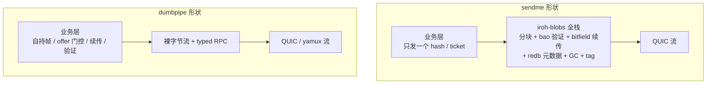
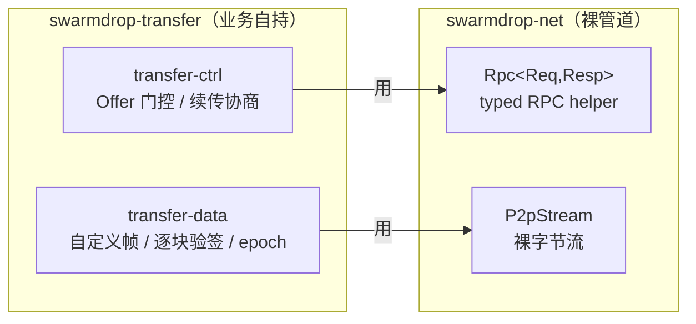

# dumbpipe 形状：网络只给裸管道，业务自持

> **本篇讲什么**：P2P 文件传输没有 HTTP 那样的现成规范——网络层能给你什么「形状」，直接决定
> 业务层长什么样。本篇对比两种形状（dumbpipe vs sendme），说明 SwarmDrop 为什么选前者，以及
> 这个选择如何一路决定了后面几篇要讲的 crate 边界。
>
> **为什么重要**：这是整个传输域架构的第 0 个决策。选错形状，后面所有分层、端口、验证方案
> 都得推倒重来。

## 两种形状

调研 iroh 生态时（见 `dev-notes/knowledge/iroh-migration.md`），我们把「网络层与文件传输业务
的接缝」抽象成两种形状，用 iroh 的两个官方样本命名：

| | **dumbpipe 形状** | **sendme 形状** |
|---|---|---|
| 网络层给业务的东西 | 一条**裸字节流** + typed RPC | 一个 **blob hash**（内容寻址） |
| 谁负责分帧 | 业务层 | 网络栈（iroh-blobs） |
| 谁负责分块/校验/续传 | 业务层 | 网络栈（bao + bitfield） |
| 谁负责 offer 门控 | 业务层 | 无（谁拿到 ticket 谁能下） |
| 传输模型 | push / pull 都行 | 只有 pull |
| 心智负担 | 帧、会话、续传全自理 | 内容寻址、GC、tag 所有权舞蹈 |

**切割线一句话**：跨过网络边界的到底是「一段不透明的字节流」，还是「一个内容寻址的 blob 哈希」。



## 为什么 SwarmDrop 选 dumbpipe 形状

sendme 形状意味着吞下整套内容寻址 blob 栈（iroh-blobs，23000+ 行）。调研得出三条**结构性冲突**，
每条都足以否决它（详见 `iroh-migration.md`）：

1. **push/offer 模型冲突**——SwarmDrop 是「发方 offer → 收方 accept → 发方推」；iroh-blobs 是
   pull 模型，push 默认禁用、官方拒绝提供开启便利。走 sendme 形状会落在它最不成熟的分支上。
2. **加密与内容寻址二选一**——内容寻址要 hash 即凭证，而我们（当时）每接收方一把密钥，同一文件
   对不同接收方是不同密文 → 去重价值归零。（这条张力在 [05](05-removing-encryption-layer.md) 里
   有更深的展开。）
3. **Web 端无持久化**——iroh-blobs 浏览器里只有 MemStore，刷新即从零。而我们自研传输层反而能自己
   接 OPFS。

更关键的是：sendme 形状「省下」的分块、续传、校验，**我们本来就有**。真正缺的只有「逐块验签」
一个能力——而那是 bao-tree 单独就能补的纯算法（见 [04](04-bao-tree-verified-streaming.md)），
不需要吞整个 blob 栈。

**结论**：走 dumbpipe 形状。网络层只提供裸管道，传输业务全部自持。

## 我们的网络层给业务什么

自研网络内核 `swarmdrop-net`（iroh 风格 API、libp2p 底层）刻意只暴露两样东西：

**① 裸字节流 `P2pStream`**——绑定对端与协议的双向流，实现 `AsyncRead + AsyncWrite`，
帧编解码留给上层：

```rust
// crates/net/src/stream.rs
/// 一条与对端的双向字节流（`AsyncRead + AsyncWrite`）。
///
/// 由 `Endpoint::open`（出站）或 Router 分发（入站）产生。帧编解码与消息
/// 边界由上层协议实现（RPC helper 或业务自定义帧）。drop 时自动归还配额。
pub struct P2pStream { /* ... */ }
```

**② typed RPC `Rpc<Req, Resp>`**——裸流上的「一流一问一答」，业务只定义请求/响应类型：

```rust
// crates/net/src/rpc.rs
//! 形态：open stream → 写请求帧 → 读响应帧 → 关流。
//! - handler 可以在回复前 await 用户决策（配对确认等长交互）……
```

就这两样。没有 Codec 层强制你适配 poll 语义，没有内容寻址，没有 blob store。这正是 dumbpipe 形状
的下限：给你管道，剩下自己写。

## 业务层自持了什么：两条协议

传输域用**两条协议**把「控制」与「数据」分开（`crates/transfer/src/protocol.rs`）：

```rust
// crates/transfer/src/protocol.rs
/// 传输控制面协议名（typed RPC）。
pub const TRANSFER_CTRL_PROTOCOL: ProtocolId = ProtocolId::from_static("/swarmdrop/transfer-ctrl/2");
/// 传输数据面协议名（裸流 + 自带帧协议）。
pub const TRANSFER_DATA_PROTOCOL: ProtocolId = ProtocolId::from_static("/swarmdrop/transfer-data/2");
```

- **控制面（transfer-ctrl）走 typed RPC**：`Offer → OfferResult`、`Cancel`、`Pause`、
  `ResumeProbe`、`ResumeCommit`。这是 offer 门控、续传协商的地方——`OfferResult.accepted` 把
  「拒绝」编码进响应类型本身，未配对设备直接被 RPC handler 婉拒。
- **数据面（transfer-data）走裸流 + 自定义帧**：`Hello`（握手校验 session/epoch/manifest）、
  `BlockData`（块数据 + 逐块证明）、`Abort`、`Finish`。帧边界、版本、session 绑定全由业务在
  `crates/transfer/src/wire/data_frame.rs` 里手写（length-prefixed varint + 手工 cursor 编解码）。



为什么数据面不用 typed RPC 而要裸流？因为大文件分块是**长连接流式**场景——控制面 RPC 单帧上限
1 MiB（`MAX_RPC_FRAME`），而数据面自带 8 MiB 帧上限和连续推送语义。裸流让「发送端沿 fetch_plan
连续推 256 KiB 块」写起来自然，不受请求-响应往返约束。这正是 dumbpipe 形状的红利：网络层不替你
决定消息节奏。

## 自持不是免费的

公平地说，dumbpipe 形状把成本转嫁给了业务层——帧编解码、session/epoch 绑定、fetch_plan 协商、
断点续传、逐块校验，全得自己写。`crates/transfer/src/wire/data_frame.rs` 里那一整套手写的
length-prefixed varint + cursor 编解码，就是这份账单。

但这份账单我们**本来就在付**：

- **分块 / 续传 / 校验，重构前就有**——走 sendme 形状并不会「省掉」它们，只是换成 iroh-blobs 替我们
  维护。差别不在代码总量，在这些代码是**谁维护**（`iroh-migration.md`：sendme 的对应物是
  iroh-blobs 的 2 万多行，不是 0）。
- **换来的是完全掌控**——push/offer 模型、配对门控、收件箱、多会话并发，全是我们自己的产品语义，
  不用去迁就一个 blob 栈默认关闭 push、谁拿 ticket 谁能下的形状。
- **唯一真缺的能力另有解**——逐块验签用纯算法 crate `bao-tree` 单独补，不需要吞整个 blob 栈
  （见 [04](04-bao-tree-verified-streaming.md)）。

一句话：dumbpipe 形状的成本是「自己写帧」，收益是「传输语义完全归业务」。对一个已经有完整传输栈、
只想换网络底座的项目，这笔账划算。

## 这一形状如何决定 crate 边界

选了 dumbpipe 形状，就等于承诺「传输业务自成一体、只向下依赖裸管道」。这句话有一个直接的结构后果：

> 既然传输逻辑不依赖网络栈的内部（只依赖 `P2pStream` 和 `Rpc` 两个接口），它就**能被切成一个
> 独立的 crate**，向下只压在 `swarmdrop-net` 上，而不和 core 的其余部分纠缠。

这就是下一篇的主题：把传输域从 `swarmdrop-core` 里抽出来，成为独立的 `swarmdrop-transfer`，
落成一个六层分层。

**下一篇** → [01 传输域抽成独立 crate：六层分层](01-crate-extraction.md)
